# InspectAzureAI architecture

A guided tour of the .NET 10 solution: how a chat request reaches an Azure AI Foundry deployment, how an eval run drives agents inside sandboxes, and where each mechanism lives in the code. Every section pairs a diagram with the code that implements it.

Boxes labelled *In plain English* restate each section for a reader with no programming background; skip them if you have one.

## 1. What this solution is

> **In plain English:** This is a program written in C# that copies the behaviour of a well-known Python toolkit for testing AI models. Think of it as a translator plus a test lab: it knows how to talk to AI models hosted on Microsoft's cloud, and it can run exams for those models, including exams where the AI has to fix real code inside a locked room. The four layers stack like floors of a building, and each floor only relies on the floors below it. The three ideas listed below come up again and again: copy the original Python exactly, hand around shared information invisibly instead of through every function, and be precise about which failures deserve a second try.

InspectAzureAI is a C# port of three Python code bases, stacked into four layers:

| Layer | Project | Ports | Lines |
|---|---|---|---|
| 1 | `InspectAzureAI.Provider` | Inspect AI's `azureai` model provider plus its Anthropic-on-Azure and OpenAI-Responses-on-Azure paths: the data model (messages, content, tools, the full `GenerateConfig`, output), Entra ID auth, streaming, tool calling, reasoning parameters, structured output, JSON-schema generation, stall scopes, Anthropic web search | ~7,000 |
| 2 | `InspectAzureAI.Eval` | Inspect AI's eval engine: ambient sample context, the `Model` wrapper with retries, adaptive concurrency, the prompt cache, cost and roles, scoped limits, tools (built-in, sandbox, MCP), solvers, agents, datasets, tasks, sandboxes (Docker and local), the agent bridge, approval, hooks, scorers and metrics, store tracking, the `.json` and `.eval` logs with their tools, re-scoring, analysis tables, eval sets | ~52,900 |
| 3 | `InspectAzureAI.Swe` | inspect_swe's two SWE agents: a native port of mini-swe-agent and a Claude Code CLI agent | ~2,700 |
| 4 | `InspectAzureAI.Cli`, `InspectAzureAI.SweShowcase`, `InspectAzureAI.ModelMatrix`, `InspectAzureAI.Sample` | Console apps that compose the libraries: the `inspectai` command line (the port of `inspect`), a three-task eval showcase, a matrix runner over every deployment, and a provider-only CLI with diagnostics | ~3,900 / ~1,700 / ~1,100 / ~2,100 |

Six xunit projects (about 38,000 lines) test the layers offline. `docs/swe-showcase.md` and the README carry the Python-to-C# mapping tables and `docs/ports/` the per-subsystem port notes with their deviations from Python (`docs/ports/README.md` is the index); this document explains the runtime mechanics instead.

Three ideas recur everywhere, so it is worth naming them now:

- **Python fidelity is a design constraint.** Every C# file cites the Python module it ports, and wire bytes (JSON separators, error strings like `Error: ...`, the literal `None` for a missing tool call id) match what Python would send. When a rule looks odd, look for the Python origin first.
- **Ambient context flows through `AsyncLocal`.** The per-sample services (model, sandbox, store, transcript, limits), the streaming observer and the model-event sink are not passed as parameters. They are installed with an `IDisposable` scope and read by whoever needs them inside that async flow. This is how Python's module-level `store()`, `sandbox()` and `transcript()` are reproduced.
- **Return versus throw is a contract, not an accident.** A provider call returns a `GenerateResult` for success and for terminal failures (HTTP 400), throws for anything the caller may retry, and lets non-Azure failures escape untouched. The Eval `Model` wrapper is built around exactly that split.

## 2. The big picture

> **In plain English:** Here is the map. At the bottom sits the Provider, the part that actually phones the AI model. Above it is the Eval engine, which runs the tests. Above that are the SWE agents, two ready-made AI programmer personalities. On top are the apps you type at the command line. Outside the box are the things the program talks to: Microsoft's sign-in service, the AI models, Docker (which creates disposable mini computers), and the Claude Code tool.

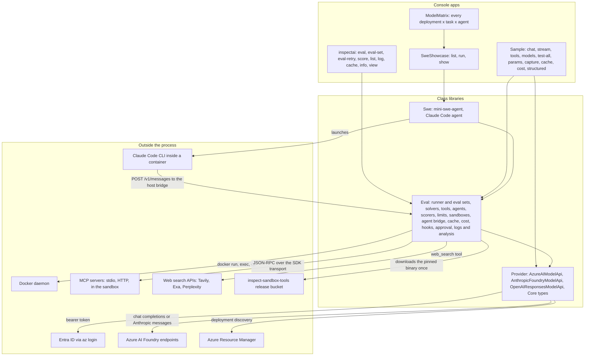
```mermaid
flowchart TB
    subgraph apps["Console apps"]
        ICLI["inspectai: eval, eval-set, eval-retry, score, list, log, cache, info, view"]
        SAMPLE["Sample: chat, stream, tools, models, test-all, params, capture, cache, cost, structured"]
        SHOW["SweShowcase: list, run, show"]
        MATRIX["ModelMatrix: every deployment x task x agent"]
    end
    subgraph libs["Class libraries"]
        SWE["Swe: mini-swe-agent, Claude Code agent"]
        EVAL["Eval: runner and eval sets, solvers, tools, agents, scorers, limits, sandboxes, agent bridge, cache, cost, hooks, approval, logs and analysis"]
        PROV["Provider: AzureAIModelApi, AnthropicFoundryModelApi, OpenAIResponsesModelApi, Core types"]
    end
    subgraph ext["Outside the process"]
        ENTRA["Entra ID via az login"]
        FOUNDRY["Azure AI Foundry endpoints"]
        ARM["Azure Resource Manager"]
        DOCKER["Docker daemon"]
        CLI["Claude Code CLI inside a container"]
        MCP["MCP servers: stdio, HTTP, in the sandbox"]
        SEARCH["Web search APIs: Tavily, Exa, Perplexity"]
        TOOLS["inspect-sandbox-tools release bucket"]
    end
    ICLI --> EVAL
    SAMPLE --> PROV
    SAMPLE --> EVAL
    SHOW --> SWE
    MATRIX --> SHOW
    SWE --> EVAL
    EVAL --> PROV
    PROV -->|"bearer token"| ENTRA
    PROV -->|"chat completions or Anthropic messages"| FOUNDRY
    PROV -->|"deployment discovery"| ARM
    EVAL -->|"docker run, exec, cp"| DOCKER
    EVAL -->|"JSON-RPC over the SDK transport"| MCP
    EVAL -->|"web_search tool"| SEARCH
    EVAL -->|"downloads the pinned binary once"| TOOLS
    SWE -->|"launches"| CLI
    CLI -->|"POST /v1/messages to the host bridge"| EVAL
```

### Project dependencies

> **In plain English:** Each part only knows about the parts below it, like a company where the intern never gets to boss the manager. That keeps things predictable: you can change something at the top and nothing underneath notices.

The dependency graph is strictly layered. Nothing below references anything above, and the apps that drive evals reach the provider through `Eval`.

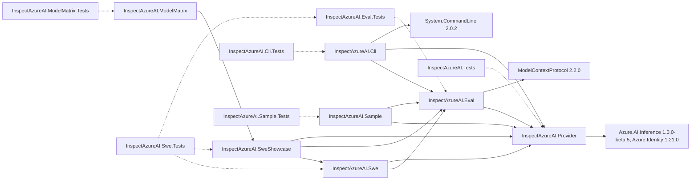
```mermaid
flowchart LR
    PROV["InspectAzureAI.Provider"]
    EVAL["InspectAzureAI.Eval"]
    SWE["InspectAzureAI.Swe"]
    ICLI["InspectAzureAI.Cli"]
    SHOW["InspectAzureAI.SweShowcase"]
    MATRIX["InspectAzureAI.ModelMatrix"]
    SAMPLE["InspectAzureAI.Sample"]
    NUGET["Azure.AI.Inference 1.0.0-beta.5, Azure.Identity 1.21.0"]
    NUGET2["ModelContextProtocol 2.2.0"]
    NUGET3["System.CommandLine 2.0.2"]
    T1["InspectAzureAI.Tests"]
    T2["InspectAzureAI.Eval.Tests"]
    T3["InspectAzureAI.Swe.Tests"]
    T4["InspectAzureAI.ModelMatrix.Tests"]
    T5["InspectAzureAI.Cli.Tests"]
    T6["InspectAzureAI.Sample.Tests"]
    EVAL --> PROV
    SWE --> EVAL
    SWE --> PROV
    ICLI --> EVAL
    ICLI --> PROV
    SHOW --> SWE
    SHOW --> EVAL
    SHOW --> PROV
    MATRIX --> SHOW
    SAMPLE --> PROV
    SAMPLE --> EVAL
    PROV --> NUGET
    EVAL --> NUGET2
    ICLI --> NUGET3
    T1 -.-> PROV
    T2 -.-> EVAL
    T3 -.-> SWE
    T3 -.-> SHOW
    T3 -.-> T2
    T4 -.-> MATRIX
    T5 -.-> ICLI
    T6 -.-> SAMPLE
```

Three NuGet dependencies in total: the Provider on the Azure SDKs, Eval on the official MCP SDK (4.19) and the CLI on System.CommandLine (6.5). Everything else, including the `.eval` zip reader with its zstandard decoder, the JSON-RPC transport, the sandbox agent bridge and the sandboxes, is BCL alone (`HttpListener`, `Process`, `System.Text.Json`, `System.IO.Compression`). Test projects reach internal seams through `InternalsVisibleTo`.

### Two runtime shapes

> **In plain English:** Everything the program does is one of two things. Either it asks the AI one question and gets one answer, or it runs a whole exam with many questions, each in its own sandbox, and writes a report at the end.

Everything the solution does is one of two shapes:

1. **A single generate.** Caller builds a list of `ChatMessage`, optional `ToolInfo`s and a `GenerateConfig`, calls `IModelApi.GenerateAsync`, and receives a `GenerateResult`. The Sample app and the Eval `Model` wrapper are both such callers. Section 3 covers this shape end to end.
2. **An eval run.** `Eval.RunAsync` takes an `EvalTask` and `EvalOptions`, runs every (sample, epoch) through a solver inside an ambient `SampleContext` with a sandbox, scores it and writes an `EvalLog`. Agents are solvers; the Claude Code agent adds an HTTP bridge so a CLI in the container can use the same model. Sections 4 to 6 cover this shape.

Everything else is a driver around the second shape: an eval set (4.28) runs several tasks into one directory and resumes from what is there, `inspectai` (6.5) turns command-line flags into `EvalOptions`, and the log tools (4.25 to 4.27) work on the files a run leaves behind.

## 3. Layer 1: the Provider

> **In plain English:** The Provider is the phone line to the AI. It takes your conversation, packages it the way Microsoft's servers expect, sends it, and unpacks whatever comes back.

### 3.1 The data model

> **In plain English:** Before you can talk to the AI you need a shared vocabulary: what a message is, who said it, what a tool is (a function the AI can ask you to run on its behalf), and what an answer looks like. These are the nouns that everything else in the program uses. The code example at the end shows a full back-and-forth: ask, get an answer, run any tool the AI requested, send the result back, repeat.

`InspectAzureAI.Provider/Core` holds the minimal Inspect types every other project imports. They are plain records with a few conventions: `ChatMessage.Id` is auto-filled with a 22-character short uuid, `MessageContent` is the `str | list[Content]` union with implicit conversions, and `ToolInfo.ToJson()` mirrors pydantic's `exclude_none` dump so tool schemas serialise byte-for-byte like Python.

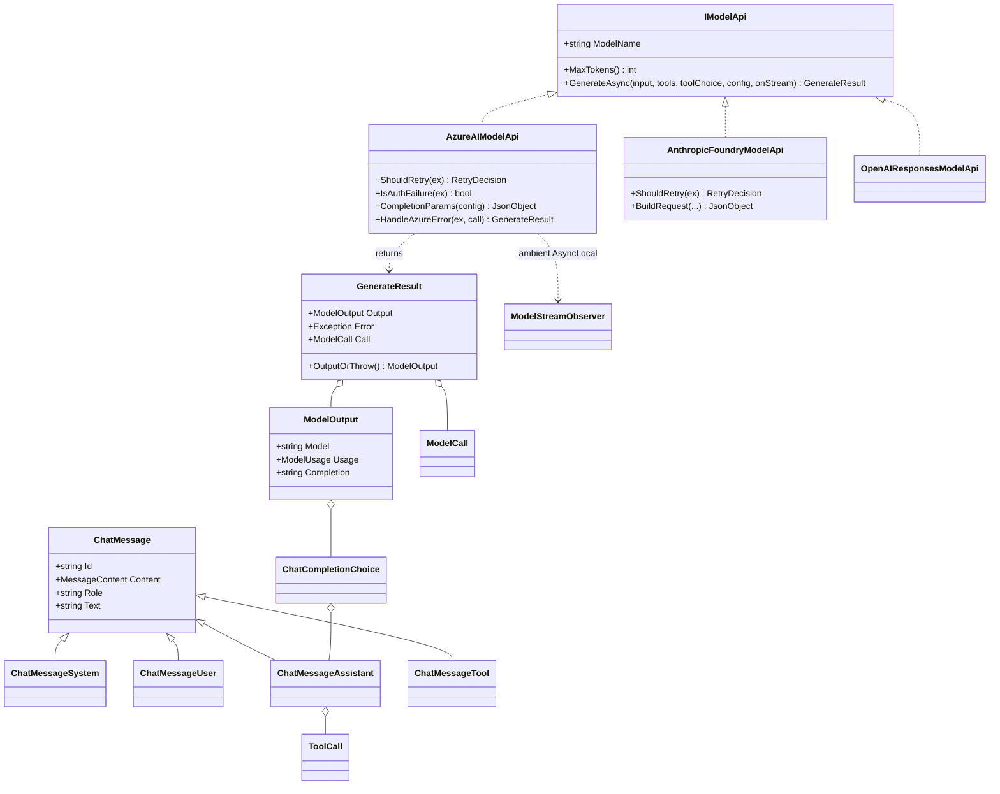
```mermaid
classDiagram
    class IModelApi {
        +string ModelName
        +MaxTokens() int
        +GenerateAsync(input, tools, toolChoice, config, onStream) GenerateResult
    }
    class AzureAIModelApi {
        +ShouldRetry(ex) RetryDecision
        +IsAuthFailure(ex) bool
        +CompletionParams(config) JsonObject
        +HandleAzureError(ex, call) GenerateResult
    }
    class AnthropicFoundryModelApi {
        +ShouldRetry(ex) RetryDecision
        +BuildRequest(...) JsonObject
    }
    class OpenAIResponsesModelApi
    IModelApi <|.. AzureAIModelApi
    IModelApi <|.. AnthropicFoundryModelApi
    IModelApi <|.. OpenAIResponsesModelApi
    class ChatMessage {
        +string Id
        +MessageContent Content
        +string Role
        +string Text
    }
    ChatMessage <|-- ChatMessageSystem
    ChatMessage <|-- ChatMessageUser
    ChatMessage <|-- ChatMessageAssistant
    ChatMessage <|-- ChatMessageTool
    ChatMessageAssistant o-- ToolCall
    class GenerateResult {
        +ModelOutput Output
        +Exception Error
        +ModelCall Call
        +OutputOrThrow() ModelOutput
    }
    class ModelOutput {
        +string Model
        +ModelUsage Usage
        +string Completion
    }
    ModelOutput o-- ChatCompletionChoice
    ChatCompletionChoice o-- ChatMessageAssistant
    GenerateResult o-- ModelOutput
    GenerateResult o-- ModelCall
    AzureAIModelApi ..> GenerateResult : returns
    AzureAIModelApi ..> ModelStreamObserver : ambient AsyncLocal
```

The types a newcomer needs first:

| Type | File | Role |
|---|---|---|
| `IModelApi` | `Core/IModelApi.cs` | The contract all three providers implement: `ModelName`, `MaxTokens()`, `GenerateAsync(input, tools, toolChoice, config, onStream, ct)`. |
| `GenerateResult` | `Core/Errors.cs` | Exactly one of `Output` or `Error`, plus the recorded `ModelCall`. `OutputOrThrow()` rethrows a terminal error. |
| `ChatMessage` family | `Core/ChatMessage.cs` | System, User, Assistant (with `ToolCalls`) and Tool (with `ToolCallId`, `Function`, `Error`). |
| `Content` family | `Core/Content.cs` | `ContentText`, `ContentReasoning` (with an optional Anthropic signature), `ContentImage`; audio and video are rejected by the Azure route. |
| `ToolInfo`, `ToolCall`, `ToolChoice` | `Core/Tools.cs` | Tool descriptions, the parsed calls (arguments as `JsonObject`, `ParseError` when parsing failed) and the auto/any/none/function choice. |
| `GenerateConfig` | `Core/GenerateConfig.cs` | Per-call settings. Only penalties, temperature, top_p, max_tokens, stop, seed and the reasoning fields reach the wire. |
| `ModelOutput`, `ModelUsage`, `StopReason` | `Core/ModelOutput.cs` | Choices, usage (with an additive operator), and the stop reason mapped from `finish_reason`. |
| `ModelCall` | `Core/ModelCall.cs` | A redacted deep copy of the raw request and response for logs. |
| `ModelStreamObserver`, `StreamEvent` | `Core/Streaming.cs` | The ambient streaming observer and the text/reasoning/tool-call/retry events it delivers. |

The README's usage example shows the whole caller-side loop: build messages, call generate, append the assistant message, execute any tool calls, repeat.

```csharp
var api = new AzureAIModelApi("gpt-5.4-mini");                    // AZUREAI_BASE_URL + DefaultAzureCredential (az login)
var input = new List<ChatMessage> { new ChatMessageUser("What is the weather in Paris?") };
var config = new GenerateConfig { MaxTokens = api.MaxTokens() };

while (true)
{
    var result = await api.GenerateAsync(input, [weatherTool], ToolChoice.Auto, config,
        onStream: e => { if (e is StreamTextEvent t) Console.Write(t.Text); return Task.CompletedTask; });
    var output = result.OutputOrThrow();          // ModelOutput; result.Call is the ModelCall record
    input.Add(output.Message);
    if (output.Message.ToolCalls is not { Count: > 0 } calls) break;
    foreach (var call in calls)                   // call.Function, call.Arguments (JsonObject), call.ParseError
        input.Add(new ChatMessageTool(RunWeather(call.Arguments), call.Id, call.Function));
}
```

### 3.2 AzureAIModelApi: one generate call

> **In plain English:** This is the full journey of one question. Decide whether the answer should arrive word by word or all at once, package the conversation, keep a copy for the records, send it, and unpack the reply. If something goes wrong, sort the failure into one of three bins: not really an error (the question was too long, so the model politely stopped), your fault so do not retry, or a temporary problem worth trying again later.

`AzureAIModelApi` (`src/InspectAzureAI.Provider/AzureAIModelApi.cs`) is the port of Python's `AzureAIAPI`. Construction is eager and fail-fast: it normalises the streaming argument (`auto`, `true`, `false`), splits an `org/model` prefix, pops two port-only model args (`max_completion_tokens` as a boolean flag and `model_format`), resolves the credential, and resolves the endpoint from the first set variable among `AZURE_ENDPOINT_URL`, `AZUREAI_ENDPOINT_URL`, `AZUREAI_BASE_URL` and `INSPECT_EVAL_MODEL_BASE_URL`. A missing endpoint is a `PrerequisiteError` at construction time, never at the first call.

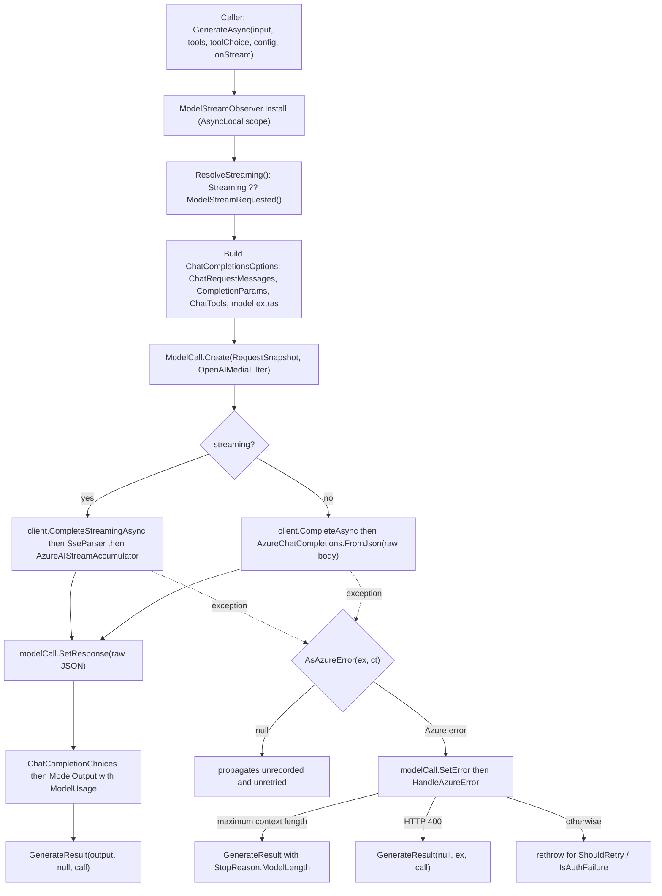
```mermaid
flowchart TD
    A["Caller: GenerateAsync(input, tools, toolChoice, config, onStream)"] --> B["ModelStreamObserver.Install (AsyncLocal scope)"]
    B --> C["ResolveStreaming(): Streaming ?? ModelStreamRequested()"]
    C --> D["Build ChatCompletionsOptions: ChatRequestMessages, CompletionParams, ChatTools, model extras"]
    D --> E["ModelCall.Create(RequestSnapshot, OpenAIMediaFilter)"]
    E --> F{"streaming?"}
    F -- yes --> G["client.CompleteStreamingAsync then SseParser then AzureAIStreamAccumulator"]
    F -- no --> H["client.CompleteAsync then AzureChatCompletions.FromJson(raw body)"]
    G --> I["modelCall.SetResponse(raw JSON)"]
    H --> I
    I --> J["ChatCompletionChoices then ModelOutput with ModelUsage"]
    J --> K["GenerateResult(output, null, call)"]
    G -. exception .-> L{"AsAzureError(ex, ct)"}
    H -. exception .-> L
    L -- null --> M["propagates unrecorded and unretried"]
    L -- Azure error --> N["modelCall.SetError then HandleAzureError"]
    N -- maximum context length --> O["GenerateResult with StopReason.ModelLength"]
    N -- HTTP 400 --> P["GenerateResult(null, ex, call)"]
    N -- otherwise --> Q["rethrow for ShouldRetry / IsAuthFailure"]
```

A call proceeds in five moves:

1. **Decide whether to stream.** `ResolveStreaming()` returns the explicit setting if there is one, otherwise `ModelStreamObserver.ModelStreamRequested()`, which is true only when the `onStream` overload installed an observer (section 3.6). With streaming left at `auto`, a request streams exactly when a handler is attached.
2. **Build the request.** Messages are converted by `AzureMessageConversion`, parameters by `CompletionParams`, tools by `AzureToolConversion` (section 3.4 and 3.5). Leftover model args are written into `AdditionalProperties` last, so a `-M key=value` overrides any derived field.
3. **Snapshot the request** into a `ModelCall` before anything is sent, with base64 image data replaced by a sentinel.
4. **Send** through a fresh `ChatCompletionsClient` built per call. The streaming branch reads the raw `ContentStream` through the hand-written `SseParser` and folds it into a completion document; the non-streaming branch parses the raw body itself. Neither uses the SDK's typed `ChatCompletions`, because the typed model drops undeclared fields like `content_filter_results`, `reasoning_content` and `reasoning_tokens`.
5. **Map the outcome.** Success becomes a `ModelOutput` (choices sorted by index, native tool calls parsed, reasoning placed first as `ContentReasoning`, usage including reasoning and cached tokens). Failures go through the exception filter below.

*`src/InspectAzureAI.Provider/AzureAIModelApi.cs`, lines 366-411*

```csharp
        try
        {
            AzureChatCompletions response;
            if (streaming)
            {
                using var streamingResponse = await client.CompleteStreamingAsync(options, cancellationToken).ConfigureAwait(false);
                var contentStream = streamingResponse.GetRawResponse().ContentStream
                                    ?? throw new ServiceResponseException("Streaming response carried no body.");
                await using (contentStream.ConfigureAwait(false))
                {
                    response = await ReadStreamAsync(contentStream, cancellationToken).ConfigureAwait(false);
                }
            }
            else
            {
                var completion = await client.CompleteAsync(options, cancellationToken).ConfigureAwait(false);
                response = AzureChatCompletions.FromJson(completion.GetRawResponse().Content);
            }
            // ...
        }
        catch (Exception ex) when (AsAzureError(ex, cancellationToken) is { } azureError)
        {
            modelCall.SetError(new JsonObject { ["error"] = new JsonObject { ["message"] = AzureErrorMessage(azureError) } });
            return HandleAzureError(azureError, modelCall);
        }
```

The exception filter is the port of Python's `except AzureError`. Only exceptions `AsAzureError` can classify are caught; everything else (a `JsonException` from a malformed SSE chunk, an empty stream, the caller's own cancellation) leaves the method untouched, unrecorded and unretried.

*`src/InspectAzureAI.Provider/AzureAIModelApi.cs`, lines 430-470*

```csharp
    public static Exception? AsAzureError(Exception ex, CancellationToken cancellationToken = default)
    {
        switch (ex)
        {
            case RequestFailedException or ServiceResponseException:
                return ex;
            case IOException:
                return new ServiceResponseException(ex.Message, ex);
            case OperationCanceledException when !cancellationToken.IsCancellationRequested:
                return new ServiceResponseException(ex.Message, ex);
            case AggregateException { InnerExceptions.Count: > 0 } aggregate:
                return AsAzureError(aggregate.InnerExceptions[^1], cancellationToken);
            default:
                return null;
        }
    }

    public GenerateResult HandleAzureError(Exception ex, ModelCall modelCall)
    {
        if (ex is RequestFailedException { Status: > 0 } http)
        {
            var response = AzureErrorMessage(http);
            if (response.ToLowerInvariant().Contains("maximum context length"))
            {
                return new GenerateResult(ModelOutput.FromContent(ModelName, response, StopReason.ModelLength), null, modelCall);
            }

            if (http.Status == 400)
            {
                return new GenerateResult(null, http, modelCall);
            }
        }

        ExceptionDispatchInfo.Capture(ex).Throw();
        throw ex;
    }
```

`AsAzureError` folds the .NET SDK's failure shapes onto Python's `AzureError` family: an `IOException` or an SDK timeout (an `OperationCanceledException` the caller did not request) becomes a `ServiceResponseException`, and the `AggregateException` the SDK throws when its own retries are exhausted is unwrapped to its last inner exception. `HandleAzureError` then encodes the three-way contract.

> **The outcome contract.** A context-length overflow is not an error but a `ModelOutput` with `StopReason.ModelLength`. An HTTP 400 is returned inside `GenerateResult.Error` and is terminal: the Eval layer wraps it without retrying. Every other Azure failure is rethrown with its stack for the caller's `ShouldRetry` loop. A `Status == 0` connection failure passes through `AsAzureError` but is retried by nobody, matching Python's `ServiceRequestError`.

### 3.3 Authentication: Entra ID and the audience

> **In plain English:** Instead of a password (an API key), the program uses your Microsoft login, the same one you get by running az login. A small wrapper makes sure every login token asks for the right audience, a bit like making sure a concert ticket names the right venue. Without it, Microsoft's own library would ask for a ticket to the wrong venue.

There are no API keys on this branch. All three providers call `AzureHosting.ResolveAzureCredential` in their constructor, which takes the host-supplied `TokenCredential` (tests and `--fake` inject a fake) or a bare `DefaultAzureCredential`, whose chain includes environment, managed identity, Visual Studio, Azure CLI (`az login`) and more. The result is wrapped in an `AudienceTokenCredential` pinned to `AZUREAI_AUDIENCE` (default `https://cognitiveservices.azure.com/.default`).

*`src/InspectAzureAI.Provider/Util/AzureHosting.cs`, lines 72-90*

```csharp
public sealed class AudienceTokenCredential(TokenCredential inner, string scope) : TokenCredential
{
    /// <summary>The credential that actually acquires tokens.</summary>
    public TokenCredential Inner { get; } = inner;

    /// <summary>The scope requested on every call.</summary>
    public string Scope { get; } = scope;

    /// <inheritdoc />
    public override AccessToken GetToken(TokenRequestContext requestContext, CancellationToken cancellationToken) =>
        Inner.GetToken(Rescope(requestContext), cancellationToken);

    /// <inheritdoc />
    public override ValueTask<AccessToken> GetTokenAsync(TokenRequestContext requestContext, CancellationToken cancellationToken) =>
        Inner.GetTokenAsync(Rescope(requestContext), cancellationToken);

    private TokenRequestContext Rescope(TokenRequestContext context) =>
        new([Scope], context.ParentRequestId, context.Claims, context.TenantId);
}
```

The wrapper exists because `Azure.AI.Inference` hard-codes `https://ml.azure.com/.default` when handed a credential. `Rescope` replaces the scopes but keeps the request id, claims and tenant, so the SDK's bearer-token policy still drives acquisition and refresh. No token is fetched at construction; the pipeline asks at send time. The Anthropic and Responses routes, which do not use the SDK pipeline, call `GetTokenAsync` themselves on every request and set the `Authorization` header.

> **Gotcha.** The wrapper rewrites every scope, so it must never be handed to `FoundryCatalog`, which needs the management scope. The Sample passes `api.Credential.Inner` for that, and shares that inner credential across every per-deployment provider so one token cache serves the whole run.

`EntraTokenInfo.TryParse` decodes a token's payload (audience, tenant, object id, UPN, expiry, scopes) without validating the signature. The Sample's `token` command uses it so a wrong tenant or an expired login is visible before the first model call.

### 3.4 From GenerateConfig to wire parameters

> **In plain English:** AI models have knobs: how creative to be, how long the answer may be, how hard to think before answering. Different vendors give the knobs different names. This section is the translation table from the program's standard knob names to each vendor's names, plus a special header that tells Microsoft's servers to pass unusual settings through instead of rejecting them.

Parameter mapping is where most of the vendor-specific knowledge lives. `CompletionParams` builds the body fields in Python's order, then appends the reasoning fields for the deployment's vendor family; `ApplyCompletionParams` copies known keys onto typed SDK properties and everything else into `AdditionalProperties` as raw JSON.

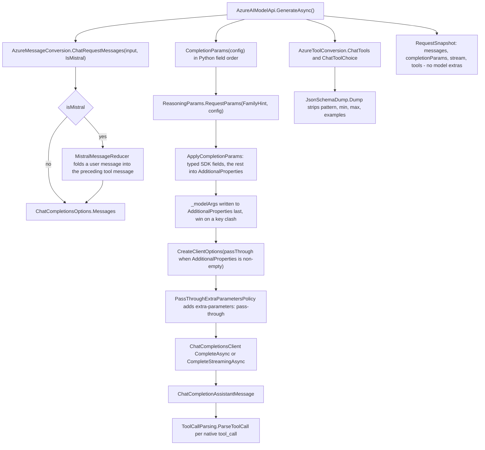
```mermaid
flowchart TD
  G["AzureAIModelApi.GenerateAsync()"] --> M["AzureMessageConversion.ChatRequestMessages(input, IsMistral)"]
  M --> MR{"isMistral"}
  MR -- yes --> RED["MistralMessageReducer folds a user message into the preceding tool message"]
  MR -- no --> OPT["ChatCompletionsOptions.Messages"]
  RED --> OPT
  G --> CP["CompletionParams(config) in Python field order"]
  CP --> RP["ReasoningParams.RequestParams(FamilyHint, config)"]
  RP --> AP["ApplyCompletionParams: typed SDK fields, the rest into AdditionalProperties"]
  G --> T["AzureToolConversion.ChatTools and ChatToolChoice"]
  T --> JS["JsonSchemaDump.Dump strips pattern, min, max, examples"]
  AP --> MA["_modelArgs written to AdditionalProperties last, win on a key clash"]
  MA --> CL["CreateClientOptions(passThrough when AdditionalProperties is non-empty)"]
  CL --> PP["PassThroughExtraParametersPolicy adds extra-parameters: pass-through"]
  G --> RS["RequestSnapshot: messages, completionParams, stream, tools - no model extras"]
  PP --> WIRE["ChatCompletionsClient CompleteAsync or CompleteStreamingAsync"]
  WIRE --> RESP["ChatCompletionAssistantMessage"]
  RESP --> PT["ToolCallParsing.ParseToolCall per native tool_call"]
```

| `GenerateConfig` field | Wire field | Rule |
|---|---|---|
| `FrequencyPenalty`, `PresencePenalty`, `Temperature`, `TopP` | same names (`top_p`) | Typed SDK properties. |
| `MaxTokens` | `max_tokens` or `max_completion_tokens` | `max_completion_tokens` when the name is gpt-5 or o-series (`OpenAIUtil.NeedsMaxCompletionTokens`) or when `-M max_completion_tokens=true` forced it. The renamed field is not a typed option, so it travels as an extra. |
| `StopSeqs`, `Seed` | `stop`, `seed` | Typed SDK properties. |
| `ReasoningEffort`, `ReasoningTokens` | `reasoning_effort` or `thinking {...}` | Decided per vendor family by `ReasoningParams` (below). |
| anything else | not sent | Carried but ignored, as in Python. |

The token limit itself comes from the caller; `MaxTokens()` is `null` for Mistral families (service default) and 2048 otherwise, and hosts pass that in as `config.MaxTokens`.

*`src/InspectAzureAI.Provider/AzureAIModelApi.cs`, lines 262-282*

```csharp
        if (config.MaxTokens is not null)
        {
            parameters[ForceMaxCompletionTokens || OpenAIUtil.NeedsMaxCompletionTokens(ModelFamily()) ? "max_completion_tokens" : "max_tokens"] = config.MaxTokens;
        }

        if (config.StopSeqs is not null)
        {
            parameters["stop"] = new JsonArray(config.StopSeqs.Select(s => (JsonNode?)JsonValue.Create(s)).ToArray());
        }

        if (config.Seed is not null)
        {
            parameters["seed"] = config.Seed;
        }

        foreach (var (key, value) in ReasoningRequestParams(config))
        {
            parameters[key] = value?.DeepClone();
        }

        return parameters;
```

**Reasoning families.** Foundry fronts many vendors, and each spells "think harder" differently. `ReasoningParams.FamilyOf(format, name)` classifies a deployment: a name containing `model-router` is Router; otherwise the ARM `Format` string (passed as the `model_format` model arg by the fleet commands) decides; otherwise name heuristics run (gpt, grok, mai-, deepseek, kimi, cohere, claude, mistral). `Describe(family)` returns a `ReasoningSupport` record saying whether the family takes an effort key, a `thinking` toggle, and a budget key; `RequestParams` turns that into body fields.

*`src/InspectAzureAI.Provider/Util/ReasoningParams.cs`, lines 175-199*

```csharp
        var support = Describe(family);
        if (support.EffortKey is not null && support.Toggle == ThinkingToggle.None && !string.IsNullOrEmpty(effort))
        {
            parameters[support.EffortKey] = effort;
        }

        if (support.Toggle == ThinkingToggle.EnabledDisabled)
        {
            if (effort == "none")
            {
                parameters["thinking"] = new JsonObject { ["type"] = "disabled" };
            }
            else
            {
                var thinking = new JsonObject { ["type"] = "enabled" };
                if (support.BudgetKey is not null && config.ReasoningTokens is > 0)
                {
                    thinking[support.BudgetKey] = config.ReasoningTokens;
                }

                parameters["thinking"] = thinking;
            }
        }

        return parameters;
```

Effort-key families (OpenAI gpt-5, Router, xAI, Microsoft) get `reasoning_effort` verbatim. Toggle families (DeepSeek, Kimi, Cohere) get a `thinking` object, with the budget under the family's key (`token_budget` for Cohere, `budget_tokens` otherwise). Legacy OpenAI (gpt-4o rejects `reasoning_effort` with HTTP 400), Mistral and Unknown produce nothing. The Anthropic family is marked `Adaptive` and handled by the Anthropic route instead; the Responses route bypasses the table altogether and always sends `reasoning.effort`. The `Describe` table is the single place to correct after a `params` probe (section 3.9) shows a deployment behaving differently.

**Why the pass-through header matters.** Any extra body field (`max_completion_tokens`, `reasoning_effort`, `thinking`, a model arg) is rejected by the model-inference gateway unless the request carries `extra-parameters: pass-through`. The SDK stamps that header on non-streaming calls with extras but not on streaming ones, so the provider registers a per-call pipeline policy whenever `AdditionalProperties` is non-empty.

*`src/InspectAzureAI.Provider/Util/PassThroughExtraParametersPolicy.cs`, lines 13-24*

```csharp
internal sealed class PassThroughExtraParametersPolicy : HttpPipelineSynchronousPolicy
{
    public const string HeaderName = "extra-parameters";

    public override void OnSendingRequest(HttpMessage message)
    {
        if (!message.Request.Headers.Contains(HeaderName))
        {
            message.Request.Headers.Add(HeaderName, "pass-through");
        }
    }
}
```

> **Gotcha.** `RequestSnapshot` records the derived completion params but never the model extras, so a `-M reasoning_effort=low` that overrides a derived `reasoning_effort: high` is invisible in `ModelCall.Request` while the wire carried `low`. The Sample's reasoning verdicts therefore parse the captured HTTP body rather than the `ModelCall`.

### 3.5 Messages and tools on the wire

> **In plain English:** The AI can ask the program to run a tool, such as check the weather in Paris. This section converts the conversation and the list of available tools into the exact format the server wants. When the AI replies with a tool request, the program reads the request's details carefully, forgives a small typo, and never crashes on a bad one; instead it tells the AI what went wrong so it can try again.

`AzureMessageConversion.ChatRequestMessage` is the per-role switch every outgoing message passes through. Three Python-fidelity literals live here: a tool error is sent as content prefixed with `Error: `, a missing tool call id is sent as the string `None`, and an assistant message with tool calls sends `null` rather than an empty text.

*`src/InspectAzureAI.Provider/Tools/AzureMessageConversion.cs`, lines 71-94*

```csharp
    public static ChatRequestMessage ChatRequestMessage(ChatMessage message)
    {
        switch (message)
        {
            case ChatMessageSystem system:
                return new ChatRequestSystemMessage(system.Text);
            case ChatMessageUser user:
                return user.Content.IsString
                    ? new ChatRequestUserMessage(user.Content.Text!)
                    : new ChatRequestUserMessage(user.Content.Items!.Select(ChatContentItem));
            case ChatMessageTool tool:
                return new ChatRequestToolMessage(
                    tool.Error is not null ? $"Error: {tool.Error.Message}" : tool.Text,
                    tool.ToolCallId ?? "None");
            case ChatMessageAssistant assistant:
                if (assistant.ToolCalls is { Count: > 0 })
                {
                    var text = assistant.Text;
                    return new ChatRequestAssistantMessage(
                        assistant.ToolCalls.Select(AzureToolConversion.ChatToolCall),
                        text.Length > 0 ? text : null);
                }

                return new ChatRequestAssistantMessage(assistant.Text);
```

User content items accept only text and images; an image is normalised by `InlineMedia.InlineMediaDataUri` (data URIs only, MIME sniffed from magic bytes when missing, no filesystem or network access) and anything else throws. When the model name contains `mistral`, `MistralMessageReducer` folds a user message that follows a tool message into that tool message, because Mistral rejects the sequence.

Tools go out as one `ChatCompletionsToolDefinition` per `ToolInfo`, with the JSON Schema passed through `JsonSchemaDump.Dump`, which strips `pattern`, `minLength`, `maxLength`, `minimum`, `maximum` and `examples` recursively. `ToolChoice.Any` maps to the SDK's `Required` preset.

On the way back, `ToolCallParsing.ParseToolCall` parses native tool-call arguments with `json.loads` semantics: last duplicate key wins, a bounded nesting depth, a recovery pass for a trailing stray quote, and a middle-truncated 16 KiB error message recorded on `ToolCall.ParseError` rather than thrown, so the model sees its own mistake on the next turn.

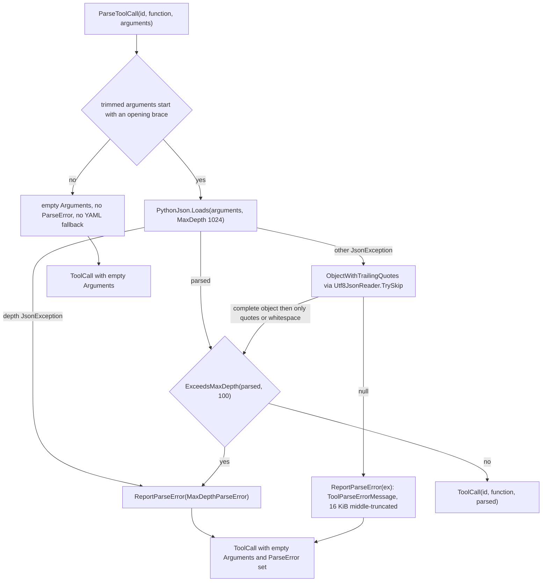
```mermaid
flowchart TD
  A["ParseToolCall(id, function, arguments)"] --> B{"trimmed arguments start with an opening brace"}
  B -- no --> E["empty Arguments, no ParseError, no YAML fallback"]
  B -- yes --> C["PythonJson.Loads(arguments, MaxDepth 1024)"]
  C -- parsed --> D{"ExceedsMaxDepth(parsed, 100)"}
  C -- depth JsonException --> X["ReportParseError(MaxDepthParseError)"]
  C -- other JsonException --> R["ObjectWithTrailingQuotes via Utf8JsonReader.TrySkip"]
  R -- complete object then only quotes or whitespace --> D
  R -- null --> Y["ReportParseError(ex): ToolParseErrorMessage, 16 KiB middle-truncated"]
  D -- yes --> X
  D -- no --> OK["ToolCall(id, function, parsed)"]
  X --> T["ToolCall with empty Arguments and ParseError set"]
  Y --> T
  E --> T2["ToolCall with empty Arguments"]
```

*`src/InspectAzureAI.Provider/Tools/ToolCallParsing.cs`, lines 47-88*

```csharp
        arguments = (arguments ?? "").Trim();
        if (arguments.StartsWith('{'))
        {
            JsonObject? parsed = null;
            try
            {
                parsed = ParseObject(arguments);
            }
            catch (JsonException ex) when (IsDepthExceeded(ex))
            {
                ReportParseError(MaxDepthParseError());
            }
            catch (JsonException ex)
            {
                parsed = ObjectWithTrailingQuotes(arguments);
                // ...
            }
            // ...
        }

        return new ToolCall(id, function, argumentsDict) { ParseError = error, Type = type };
```

The Python YAML fallback for non-JSON arguments is deliberately not ported: native function calling always returns JSON, so arguments that do not start with a brace yield empty arguments and no error. The same parser serves the Anthropic route, which first serialises a `tool_use` block's input with `PythonJson.Dumps`.

Underneath sit stateless fidelity helpers reused across the solution: `PythonJson` (`json.dumps` separators and `ensure_ascii`, `json.loads` duplicate-key semantics), `PythonSemantics.Truthy` (Python truthiness across CLR and JSON node types), `InlineMedia`, and `ShortUuid`.

### 3.6 Streaming

> **In plain English:** Streaming is when the answer arrives in pieces, like watching someone type. The program reads those pieces off the wire, hands each one to whoever asked for live updates, and glues them back together into one complete answer, so the rest of the code does not care whether the answer streamed or arrived in one go.

Streaming is not a parameter of the core generate call. It is discovered through an ambient observer that the `onStream` overload installs for the duration of the call.

*`src/InspectAzureAI.Provider/Core/Streaming.cs`, lines 84-98*

```csharp
    public static IDisposable Install(ModelStreamObserver observer)
    {
        var previous = CurrentObserver.Value;
        CurrentObserver.Value = observer;
        return new Restore(previous);
    }

    /// <summary>Port of <c>model_stream_requested()</c>.</summary>
    public static bool ModelStreamRequested() => CurrentObserver.Value is { OnStream: not null };

    /// <summary>Port of <c>report_model_stream_start()</c>.</summary>
    public static void ReportModelStreamStart() => CurrentObserver.Value?.StreamStarted();

    /// <summary>Port of <c>report_model_stream_progress()</c>.</summary>
    public static void ReportModelStreamProgress(int? outputTokens = null) => CurrentObserver.Value?.ReportProgress(outputTokens);
```

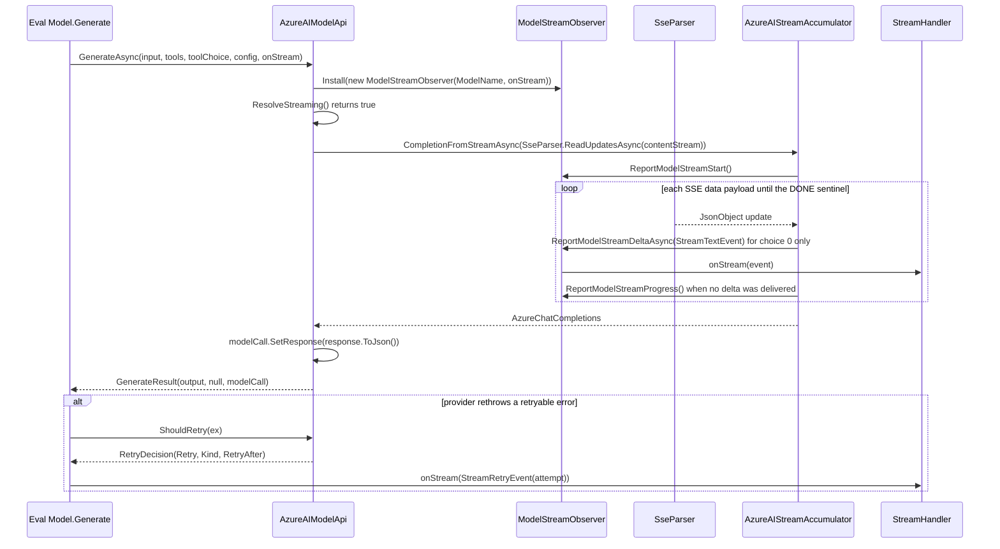
```mermaid
sequenceDiagram
    participant M as Eval Model.Generate
    participant A as AzureAIModelApi
    participant O as ModelStreamObserver
    participant S as SseParser
    participant X as AzureAIStreamAccumulator
    participant H as StreamHandler
    M->>A: GenerateAsync(input, tools, toolChoice, config, onStream)
    A->>O: Install(new ModelStreamObserver(ModelName, onStream))
    A->>A: ResolveStreaming() returns true
    A->>X: CompletionFromStreamAsync(SseParser.ReadUpdatesAsync(contentStream))
    X->>O: ReportModelStreamStart()
    loop each SSE data payload until the DONE sentinel
        S-->>X: JsonObject update
        X->>O: ReportModelStreamDeltaAsync(StreamTextEvent) for choice 0 only
        O->>H: onStream(event)
        X->>O: ReportModelStreamProgress() when no delta was delivered
    end
    X-->>A: AzureChatCompletions
    A->>A: modelCall.SetResponse(response.ToJson())
    A-->>M: GenerateResult(output, null, modelCall)
    alt provider rethrows a retryable error
        M->>A: ShouldRetry(ex)
        A-->>M: RetryDecision(Retry, Kind, RetryAfter)
        M->>H: onStream(StreamRetryEvent(attempt))
    end
```

Two components do the work:

**`SseParser`** replaces the SDK's typed update stream with a hand-written server-sent-events reader, so every JSON field on the wire (the tool-call `index`, per-choice `content_filter_results`) survives into the accumulator as a raw `JsonObject`. It buffers `data:` lines, dispatches on the blank line, ignores comment lines, and stops at `data: [DONE]`.

*`src/InspectAzureAI.Provider/SseParser.cs`, lines 30-61*

```csharp
            if (line.Length == 0)
            {
                if (data.Count > 0)
                {
                    var payload = string.Join("\n", data);
                    data.Clear();
                    if (payload == "[DONE]")
                    {
                        yield break;
                    }

                    yield return JsonNode.Parse(payload)?.AsObject() ?? throw new JsonException("Stream update was not a JSON object.");
                }

                continue;
            }
            // ...
            if (line.StartsWith("data:", StringComparison.Ordinal))
            {
                var value = line[5..];
                // ...
                data.Add(value);
            }
```

**`AzureAIStreamAccumulator`** (the port of `azureai_completion_from_stream`) folds the updates into one `chat.completion` document. Per choice it accumulates content, reasoning fragments (from `reasoning_content`, `reasoning` or `thinking`), the finish reason, the last non-empty `content_filter_results`, and tool-call fragments assembled by slot: an integer `index` wins, otherwise a fragment carrying an id opens a new slot and a bare argument fragment extends the newest one. Deltas are delivered to the handler only for choice 0 and only while an observer with a handler is installed.

*`src/InspectAzureAI.Provider/AzureAIStreamAccumulator.cs`, lines 84-159*

```csharp
            var deltasRequested = ModelStreamObserver.ModelStreamRequested();
            var reported = false;
            foreach (var updateChoice in (update["choices"] as JsonArray)?.OfType<JsonObject>() ?? [])
            {
                var index = updateChoice["index"]?.GetValue<int>() ?? 0;
                // ...
                var delta = updateChoice["delta"] as JsonObject ?? new JsonObject();
                var report = index == 0 && deltasRequested;
                var reasoning = ReasoningDelta(delta);
                if (reasoning is not null)
                {
                    choice.Reasoning.Add(reasoning);
                    if (report)
                    {
                        await ModelStreamObserver.ReportModelStreamDeltaAsync(new StreamReasoningEvent(reasoning)).ConfigureAwait(false);
                        reported = true;
                    }
                }
                // ...
            }

            if (!reported && updateUsage is null)
            {
                ModelStreamObserver.ReportModelStreamProgress();
            }
```

Because the accumulator synthesises a document shaped exactly like a non-streamed response, the parsing code and the recorded `ModelCall.Response` are identical on both paths. A handler that throws is detached for the rest of the call and logged once, so generation continues. A streamed response with no `usage` chunk yields `Usage = null` and a one-time warning suggesting `-M streaming=false`. A `StreamToolCallEvent` carries the accumulated id and name but only this delta's argument fragment; consumers append fragments with the same id themselves.

### 3.7 ModelCall capture, retries and errors

> **In plain English:** Some failures deserve a second try (the server was busy), some do not (you sent a bad request). This section decides which is which and how long to wait, and it keeps a redacted copy of every request and reply for the logs, with any images blanked out.

**ModelCall.** The request snapshot is taken before the network call and mirrors Python's: messages and tools in wire form, the completion params, `stream: true` when streaming, `tools: null` when none were sent, `tool_choice` only alongside tools, and never the model name or model extras. `OpenAIUtil.OpenAIMediaFilter` replaces `data:` URLs with `<base64-data-removed>`. `SetResponse` and `SetError` reuse the stored filter so the response is redacted identically. The Eval log carries these records inside every `ModelEvent`.

**Retries.** Two retry layers coexist. The `Azure.AI.Inference` pipeline keeps its own retry policy (tunable through `AzureAIClientSettings.ConfigureClientOptions`; tests zero it), and above it the Eval `Model` loop consults `ShouldRetry`:

*`src/InspectAzureAI.Provider/AzureAIModelApi.cs`, lines 208-227*

```csharp
    public RetryDecision ShouldRetry(Exception ex)
    {
        if (ex is RequestFailedException { Status: > 0 } http)
        {
            if (!HttpRetryUtil.IsRetryableHttpStatus(http.Status))
            {
                return RetryDecision.No();
            }

            var retryAfter = HttpRetryUtil.ParseRetryAfterFromException(http);
            return http.Status == 429 ? RetryDecision.RateLimit(retryAfter) : RetryDecision.Transient(retryAfter);
        }

        if (ex is ServiceResponseException)
        {
            return RetryDecision.Transient();
        }

        return RetryDecision.No();
    }
```

408, 429 and 5xx are retried, 429 as a rate limit; `ServiceResponseException` (a dropped body or timeout) is transient; a status-0 connection failure, 401, 404 and non-Azure exceptions are not retried. `HttpRetryUtil.ParseRetryAfter` prefers `retry-after` and otherwise the maximum of the OpenAI `x-ratelimit-reset-*` and `anthropic-ratelimit-*-reset` headers, each accepted as float seconds, a duration string such as `1m30s`, an HTTP-date or an ISO 8601 timestamp. `IsAuthFailure` is true only for 401.

`ProviderLogger` is a process-wide shim with `Warning`, `Info` and `WarnOnce` (deduplicated by message text), a replaceable sink, and captured lists for tests.

### 3.8 Claude deployments: the Anthropic Messages route

> **In plain English:** Claude models on Microsoft's cloud speak a slightly different dialect. This is a second phone line just for them. It shares the same login and the same rules about failures, but does its own packaging and unpacking.

`AnthropicFoundryModelApi` (`src/InspectAzureAI.Provider/Anthropic/`) is a second `IModelApi` for `claude-*` deployments, which Foundry serves over `/anthropic/v1/messages`. It follows the Azure path of Python's `anthropic.py` but uses the same Entra credential as the main provider, not an API key.

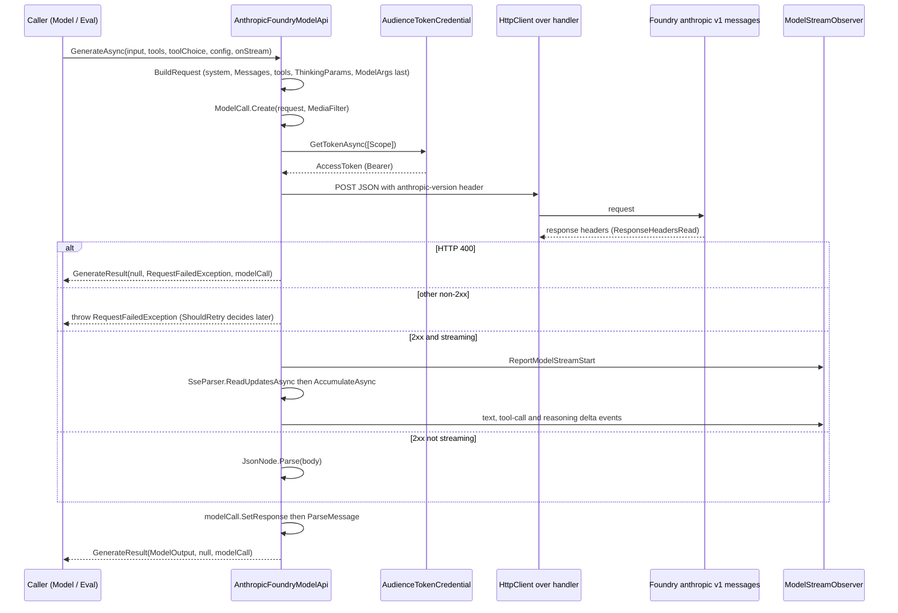
```mermaid
sequenceDiagram
    participant C as Caller (Model / Eval)
    participant A as AnthropicFoundryModelApi
    participant T as AudienceTokenCredential
    participant H as HttpClient over handler
    participant F as Foundry anthropic v1 messages
    participant O as ModelStreamObserver
    C->>A: GenerateAsync(input, tools, toolChoice, config, onStream)
    A->>A: BuildRequest (system, Messages, tools, ThinkingParams, ModelArgs last)
    A->>A: ModelCall.Create(request, MediaFilter)
    A->>T: GetTokenAsync([Scope])
    T-->>A: AccessToken (Bearer)
    A->>H: POST JSON with anthropic-version header
    H->>F: request
    F-->>H: response headers (ResponseHeadersRead)
    alt HTTP 400
        A-->>C: GenerateResult(null, RequestFailedException, modelCall)
    else other non-2xx
        A-->>C: throw RequestFailedException (ShouldRetry decides later)
    else 2xx and streaming
        A->>O: ReportModelStreamStart
        A->>A: SseParser.ReadUpdatesAsync then AccumulateAsync
        A->>O: text, tool-call and reasoning delta events
    else 2xx not streaming
        A->>A: JsonNode.Parse(body)
    end
    A->>A: modelCall.SetResponse then ParseMessage
    A-->>C: GenerateResult(ModelOutput, null, modelCall)
```

What is shared and what differs:

| Concern | Chat-completions route | Anthropic route | Responses route (`OpenAIResponsesModelApi`, `src/InspectAzureAI.Provider/OpenAI/`) |
|---|---|---|---|
| Transport | `ChatCompletionsClient` pipeline (SDK retry, bearer policy, pass-through policy) | Plain `HttpClient` over an injectable `HttpMessageHandler`; token acquired explicitly per request | Plain `HttpClient` over an injectable `HttpMessageHandler`, no OpenAI NuGet package; token acquired explicitly per request; no HTTP timeout (gpt-5.4-pro can take minutes; the model layer's attempt timeout governs) |
| Base URL | inference endpoint variables | `AZUREAI_ANTHROPIC_BASE_URL`, `AZURE_ANTHROPIC_BASE_URL`, else the inference endpoint with `/models` replaced by `/anthropic` | `AZUREAI_OPENAI_BASE_URL`, `AZURE_OPENAI_BASE_URL`, else the inference endpoint with `/models` replaced by `/openai/v1`; posts to `/responses`, no api-version |
| Body | SDK options plus extras | Hand-built JSON: `model`, always `max_tokens` (4096 for Claude 3/3.5 names, 32000 otherwise), `system` lifted from system messages, content-block messages, `tools` with `input_schema`, `tool_choice`, thinking fields, then model args last | Hand-built JSON: `model`, `input` items, flat function `tools` (`strict: false`), `tool_choice` (`none`, `required`, a named function; `auto` not sent), `parallel_tool_calls`, `max_output_tokens` (no default), `reasoning {effort, mode, summary}`, `text.format` / `text.verbosity`, always `store: false` with `include: ["reasoning.encrypted_content"]` on reasoning models, `temperature` / `top_p` only when reasoning is off, then model args last; penalties, stop sequences, seed, `logit_bias`, `n`, logprobs and fallback models ignored with a one-time warning |
| Reasoning | `reasoning_effort` or `thinking` per family | A `ReasoningTokens` budget yields `thinking {type: enabled, budget_tokens}` and raises `max_tokens` above the budget; otherwise `thinking {type: adaptive}` plus `output_config {effort}` | `reasoning.effort` verbatim (`max` becomes `xhigh` before gpt-5.6), `reasoning.summary` only with `--reasoning-summary auto` (Python defaults to `auto`; other Azure organisations can get HTTP 400, the test resource accepted it); `ReasoningParams` bypassed; `ReasoningTokens` ignored |
| Message shape | one wire message per Inspect message | Consecutive same-role turns merged (the API requires alternation); tool results become `tool_result` blocks in a user turn; signed thinking blocks replayed on later turns, unsigned reasoning dropped with a warning | System messages become a `developer` message; user parts `input_text` / `input_image` / `input_file`; assistant turns become `reasoning` items (replayed through `encrypted_content`), `message` and `function_call` items; tool results `function_call_output`; message and `function_call` ids not replayed |
| Streaming | `SseParser` + `AzureAIStreamAccumulator` | `SseParser` + `AccumulateAsync` over `message_start`, `content_block_*`, `message_delta` events keyed by block index | `SseParser` + `ResponsesStreamAccumulator`: `output_text`, `reasoning_summary_text` and `function_call_arguments` deltas delivered live; the terminal `response.completed|incomplete|failed` event's response object parsed like a non-streamed body |
| Errors | `AsAzureError`, `HandleAzureError` | `HttpRequestException` becomes a status-0 `RequestFailedException`; IO and timeout become `ServiceResponseException`; 400 returned, other statuses thrown; same `ShouldRetry` rules | Same contract as the Anthropic route; HTTP 400 `context_length_exceeded` becomes a `model_length` output, `content_filter` / `content_policy_violation` / `invalid_prompt` / `cyber_policy` a `content_filter` output, other 400s the terminal error; 408/429/5xx thrown with the same `ShouldRetry` rules |
| `ModelCall` | no elapsed time | records elapsed seconds; redacts any `data` string over 64 characters | raw JSON request and response; the streamed terminal response object gives the recorded response the same shape either way |

*`src/InspectAzureAI.Provider/Anthropic/AnthropicFoundryModelApi.cs`, lines 212-237*

```csharp
            if (!response.IsSuccessStatusCode)
            {
                var body = await response.Content.ReadAsStringAsync(cancellationToken).ConfigureAwait(false);
                var text = ErrorMessage(body, response.StatusCode);
                modelCall.SetError(ErrorNode(text), watch.Elapsed.TotalSeconds);
                var error = new RequestFailedException((int)response.StatusCode, text);
                if (response.StatusCode == HttpStatusCode.BadRequest)
                {
                    return new GenerateResult(null, error, modelCall);
                }

                throw error;
            }
// ...
                if (streaming)
                {
                    ModelStreamObserver.ReportModelStreamStart();
                    var stream = await response.Content.ReadAsStreamAsync(cancellationToken).ConfigureAwait(false);
                    await using (stream.ConfigureAwait(false))
                    {
                        messageJson = await AccumulateAsync(SseParser.ReadUpdatesAsync(stream, cancellationToken), cancellationToken).ConfigureAwait(false);
                    }
                }
```

`ParseMessage` maps the response blocks: `text` to `ContentText`, `thinking` to `ContentReasoning` with its signature, `redacted_thinking` to a redacted `ContentReasoning`, `tool_use` through the shared `ParseToolCall`; `stop_reason` maps `end_turn` and `stop_sequence` to Stop, `tool_use` to ToolCalls, `max_tokens` to MaxTokens, `refusal` to ContentFilter.

Callers pick the route explicitly (`--route anthropic|responses` in the Sample and the examples runner, the `anthropic/azure/` or `openai/azure/` model prefix in the CLI) or automatically: Eval's `FoundryModels.RouteFor` selects the Anthropic route for any name starting with `claude` and the Responses route for names containing `gpt-5.6`, `-pro` or `codex` or starting with `o<digit>`; `--route models` or the `azureai/` prefix forces chat completions. The Responses route parses `reasoning` items into redacted `ContentReasoning` (item id as `signature`, the encrypted blob, a `summary`), `message` `output_text` into text (refusals flagged) and `function_call` into tool calls; the stop reason comes from `incomplete_details.reason` (`tool_calls` whenever a function call is present) and usage from `input_tokens` minus `cached_tokens`, `input_tokens_details.cached_tokens` and `output_tokens_details.reasoning_tokens`. Not ported there: the built-in tools (web search, computer use, remote MCP, code interpreter, image generation), logprobs and background mode.

### 3.9 Foundry discovery and parameter probes

> **In plain English:** Two helpers for looking around. One asks Microsoft which models are deployed on your account. The other tests each model by sending one setting at a time and checking whether the model accepted it, ignored it, or rejected it, which is how the compatibility table in the README was built.

Two port-only helpers support the fleet commands:

**`FoundryCatalog`** (`Foundry/FoundryCatalog.cs`) talks to Azure Resource Manager with the management scope. Given the inference endpoint it finds the Cognitive Services account serving that host (directly via `AZUREAI_RESOURCE_ID`, or by listing subscriptions and accounts) and lists its deployments with name, model, ARM `Format` (the vendor string), provisioning state and capabilities. 401 or 403 from ARM becomes a `PrerequisiteError` naming the Reader role.

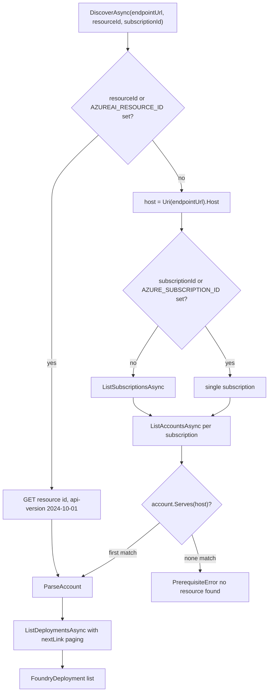
```mermaid
flowchart TD
    A["DiscoverAsync(endpointUrl, resourceId, subscriptionId)"] --> B{"resourceId or AZUREAI_RESOURCE_ID set?"}
    B -- yes --> C["GET resource id, api-version 2024-10-01"]
    C --> D["ParseAccount"]
    B -- no --> E["host = Uri(endpointUrl).Host"]
    E --> F{"subscriptionId or AZURE_SUBSCRIPTION_ID set?"}
    F -- no --> G["ListSubscriptionsAsync"]
    F -- yes --> H["single subscription"]
    G --> I["ListAccountsAsync per subscription"]
    H --> I
    I --> J{"account.Serves(host)?"}
    J -- none match --> K["PrerequisiteError no resource found"]
    J -- first match --> D
    D --> L["ListDeploymentsAsync with nextLink paging"]
    L --> M["FoundryDeployment list"]
```

**`ParameterProbes`** (`Foundry/ParameterProbes.cs`) defines, per vendor family, the candidate request parameters the Sample's `params` command sends one at a time on top of a baseline call, and classifies each observation. Every verdict is relative to the deployment's baseline (and stream baseline), which is why they are always passed in.

*`src/InspectAzureAI.Provider/Foundry/ParameterProbes.cs`, lines 232-253*

```csharp
    public static ProbeVerdict Classify(ProbeSpec spec, ProbeObservation baseline, ProbeObservation? streamBaseline, ProbeObservation probe)
    {
        if (probe.Status is 400 or 422)
        {
            return new("rejected", true, probe.Error ?? $"HTTP {probe.Status}");
        }

        if (probe.Output is null || probe.Status is null or >= 400)
        {
            return new("error", false, probe.Error ?? (probe.Status is null ? "no response" : $"HTTP {probe.Status}"));
        }

        if (spec.Via == ProbeVia.Config && spec.Configure is not null && spec.Expect != ProbeExpect.Stream
            && !RequestChanged(baseline.RequestBody, probe.RequestBody))
        {
            return new("n/a", false, "the provider derives no request field for this family; nothing was sent");
        }

        var completion = AzureAIModelApi.StripCohereTextMarkers(probe.Output.Completion).Trim();
        if (completion.Length == 0 && spec.Expect is ProbeExpect.Stop or ProbeExpect.JsonObject or ProbeExpect.JsonSchemaAnswer)
        {
            return new("ignored", true, $"empty completion (stop_reason {probe.Output.StopReason.ToWire()}); nothing to judge");
        }
```

The verdict precedence is fixed: 400/422 means rejected, other failures are transport errors rather than evidence, a `Config` probe whose request equals the baseline is `n/a` (the provider never put the parameter on the wire), and only then does the parameter-specific comparison run. The results feed the README parameter matrix and the wire dashboard under `docs/dashboard`.

### 3.10 End to end: a streamed tool call

> **In plain English:** One big diagram showing a complete question and answer with a tool involved, from login to the final unpacked reply, including the branches for when things fail.

Putting the pieces together for the most common call: a gpt-style deployment, one tool, streaming on.

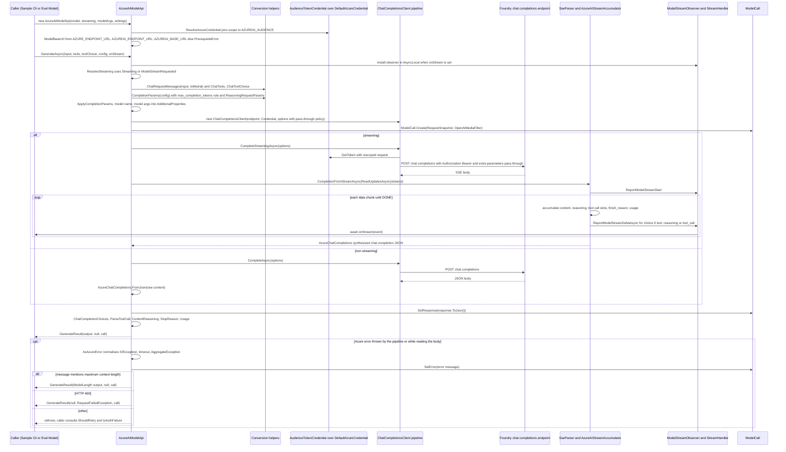
```mermaid
sequenceDiagram
    participant Caller as Caller (Sample Cli or Eval Model)
    participant Api as AzureAIModelApi
    participant Conv as Conversion helpers
    participant Cred as AudienceTokenCredential over DefaultAzureCredential
    participant Client as ChatCompletionsClient pipeline
    participant Foundry as Foundry chat completions endpoint
    participant Acc as SseParser and AzureAIStreamAccumulator
    participant Obs as ModelStreamObserver and StreamHandler
    participant Call as ModelCall

    Caller->>Api: new AzureAIModelApi(model, streaming, modelArgs, settings)
    Api->>Cred: ResolveAzureCredential pins scope to AZUREAI_AUDIENCE
    Api->>Api: ModelBaseUrl from AZURE_ENDPOINT_URL, AZUREAI_ENDPOINT_URL, AZUREAI_BASE_URL else PrerequisiteError
    Caller->>Api: GenerateAsync(input, tools, toolChoice, config, onStream)
    Api->>Obs: Install observer in AsyncLocal when onStream is set
    Api->>Api: ResolveStreaming uses Streaming or ModelStreamRequested
    Api->>Conv: ChatRequestMessages(input, IsMistral) and ChatTools, ChatToolChoice
    Api->>Conv: CompletionParams(config) with max_completion_tokens rule and ReasoningRequestParams
    Api->>Api: ApplyCompletionParams, model name, model args into AdditionalProperties
    Api->>Client: new ChatCompletionsClient(endpoint, Credential, options with pass-through policy)
    Api->>Call: ModelCall.Create(RequestSnapshot, OpenAIMediaFilter)
    alt streaming
        Api->>Client: CompleteStreamingAsync(options)
        Client->>Cred: GetToken with rescoped request
        Client->>Foundry: POST chat completions with Authorization Bearer and extra-parameters pass-through
        Foundry-->>Client: SSE body
        Api->>Acc: CompletionFromStreamAsync(ReadUpdatesAsync(stream))
        Acc->>Obs: ReportModelStreamStart
        loop each data chunk until DONE
            Acc->>Acc: accumulate content, reasoning, tool call slots, finish_reason, usage
            Acc->>Obs: ReportModelStreamDeltaAsync for choice 0 text, reasoning or tool_call
            Obs->>Caller: await onStream(event)
        end
        Acc-->>Api: AzureChatCompletions synthesised chat.completion JSON
    else non streaming
        Api->>Client: CompleteAsync(options)
        Client->>Foundry: POST chat completions
        Foundry-->>Client: JSON body
        Api->>Api: AzureChatCompletions.FromJson(raw content)
    end
    Api->>Call: SetResponse(response.ToJson())
    Api->>Api: ChatCompletionChoices, ParseToolCall, ContentReasoning, StopReason, Usage
    Api-->>Caller: GenerateResult(output, null, call)
    opt Azure error thrown by the pipeline or while reading the body
        Api->>Api: AsAzureError normalises IOException, timeout, AggregateException
        Api->>Call: SetError(error message)
        alt message mentions maximum context length
            Api-->>Caller: GenerateResult(ModelLength output, null, call)
        else HTTP 400
            Api-->>Caller: GenerateResult(null, RequestFailedException, call)
        else other
            Api-->>Caller: rethrow, caller consults ShouldRetry and IsAuthFailure
        end
    end
```

Where things surface on this path:

- **Construction** throws `PrerequisiteError` for a missing endpoint variable or a credential that cannot be built.
- **A failed sign-in** surfaces lazily from the SDK's bearer policy during the call as an `Azure.Identity` exception, which is not in the Azure error family, so it propagates unrecorded. The console apps catch `CredentialUnavailableException` and `AuthenticationFailedException` at the top and print the `az login` hint.
- **Nothing is retried inside `GenerateAsync`** except by the SDK's own policy. The Inspect-style loop lives in Eval's `Model` (section 4.3). The Sample has no retry loop.
- **Offline substitution** happens at the transport: `AzureAIClientSettings.Transport` accepts a `CannedTransport` and `TokenCredential` a fake, so the whole SDK pipeline runs for real with only the socket replaced (section 8).

## 4. Layer 2: the Eval engine

> **In plain English:** The Eval engine is the exam hall. It takes a set of questions, gives each one to the AI (or to an AI agent), scores the answers, and writes a report. It also provides safe rooms, called sandboxes, where an AI can run commands without touching your real computer.

`InspectAzureAI.Eval` ports Inspect AI's eval engine. Sections 4.1 to 4.7 are the core needed to run agentic SWE tasks: the ambient sample context, the `Model` wrapper, tools and their executor, solvers and `TaskState`, agents, datasets and tasks, sandboxes, the agent bridge, scorers, the runner and the log. Sections 4.8 onwards are the subsystems ported on top of that core, one per `docs/ports/*.md` note, in the order a sample meets them: limits and error policy, concurrency, the cache, cost, model extras, compaction, agents and solvers, metrics, the three tool families, approval, hooks, store tracking, the log formats and their tools, re-scoring, analysis, and eval sets. It has one project reference (Provider) and one NuGet package (the MCP SDK, 4.19).

### 4.1 Ambient sample context

> **In plain English:** While a question is being answered, lots of code needs the same things: which AI to use, which sandbox, a shared notepad, a diary of events, and the limits. Rather than passing all of that into every function, the program hangs them in the air for the duration of that question, and anything working on that question can reach up and grab them. Two questions running at the same time never see each other's stuff.

`SampleContext` is how Python's module-level `store()`, `sandbox()`, `transcript()`, `get_model()` and `score()` are reproduced: a single `AsyncLocal` that the runner sets with a `using` scope around setup, solvers and scorers.

*`src/InspectAzureAI.Eval/Context/SampleContext.cs`, lines 16-27*

```csharp
    private static readonly AsyncLocal<SampleContext?> Ambient = new();

    public static SampleContext? Current => Ambient.Value;

    /// <summary>Installs <paramref name="context"/> for the current async flow; disposing restores the previous one.</summary>
    public static IDisposable Begin(SampleContext context)
    {
        ArgumentNullException.ThrowIfNull(context);
        var previous = Ambient.Value;
        Ambient.Value = context;
        return new Scope(previous);
    }
```

Because `AsyncLocal` flows into awaited continuations and child tasks but not back out, solvers, tools, scorers and agents call `SampleContext.Current` or `Require()` without parameters, and concurrent samples never see each other's context. The context carries:

| Service | Type | What it holds |
|---|---|---|
| `ActiveModel` | `Model` | The eval's model, wrapped with retries and event recording. |
| `Store` | `Store` | A lock-guarded key/value bag shared by solvers, tools and agents; snapshotted into the log. |
| `Transcript` | `Transcript` | The ordered event list of the sample. `Span()` opens a begin/end pair whose id is tracked in its own `AsyncLocal` and stamped onto every event added inside it. |
| `Limits` | `Limits` | The sample's usage ledger (`ModelUsage` per model, waiting time, cost) and the cost limit; the message, token, turn, time and working limits are enforced by the scoped limit stack of 4.8, which the runner roots here. `Suspend()` stops enforcement so scorers can still generate. |
| `Sandboxes` | `SandboxEnvironments` | Named environments; the first is the default. `Sandbox(name)` resolves one. |
| `SampleState`, `Scorer` | `TaskState`, callback | The runner's own state and an intermediate-scoring callback agents use between attempts. |

`Model` tolerates a missing context (its limit checks are null-conditional). `SandboxTools.Bash`, `BasicAgent` and both SWE agents call `Require()` and throw outside a scope. The same `AsyncLocal` pattern is used by `Transcript` for the current span and by `ModelEventSinks` for an ambient model-event sink.

### 4.2 The Model wrapper: config, limits, retries, events

> **In plain English:** This wraps the phone line with house rules: merge the settings, check that the message and token budget has not been blown, try again when the server was busy, and write a diary entry for every attempt so the report shows exactly what happened.

`Model` (`src/InspectAzureAI.Eval/Model/Model.cs`) wraps any `IModelApi`. It is the single model entry point for solvers, agents and the bridge, so the retry loop, the limits, the `ModelEvent`s in the transcript and the usage in the log are the same for every caller.

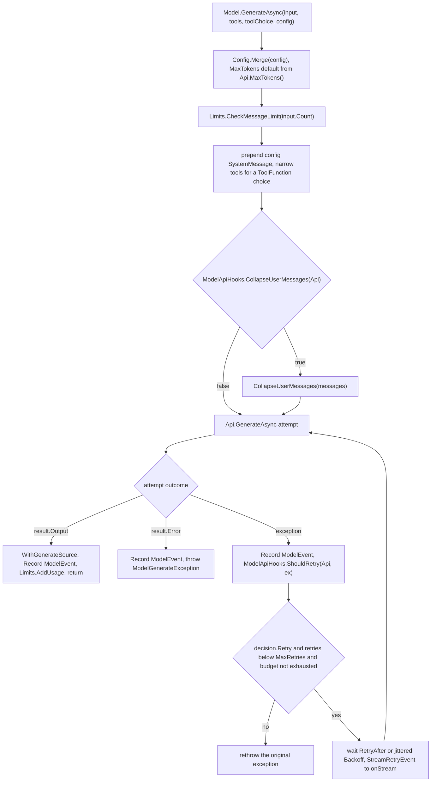
```mermaid
flowchart TD
    A["Model.GenerateAsync(input, tools, toolChoice, config)"] --> B["Config.Merge(config), MaxTokens default from Api.MaxTokens()"]
    B --> C["Limits.CheckMessageLimit(input.Count)"]
    C --> D["prepend config SystemMessage, narrow tools for a ToolFunction choice"]
    D --> E{"ModelApiHooks.CollapseUserMessages(Api)"}
    E -->|true| F["CollapseUserMessages(messages)"]
    E -->|false| G["Api.GenerateAsync attempt"]
    F --> G
    G --> H{"attempt outcome"}
    H -->|result.Output| I["WithGenerateSource, Record ModelEvent, Limits.AddUsage, return"]
    H -->|result.Error| J["Record ModelEvent, throw ModelGenerateException"]
    H -->|exception| K["Record ModelEvent, ModelApiHooks.ShouldRetry(Api, ex)"]
    K --> L{"decision.Retry and retries below MaxRetries and budget not exhausted"}
    L -->|no| M["rethrow the original exception"]
    L -->|yes| N["wait RetryAfter or jittered Backoff, StreamRetryEvent to onStream"]
    N --> G
```

*`src/InspectAzureAI.Eval/Model/Model.cs`, lines 136-155*

```csharp
            if (result?.Error is { } terminal)
            {
                Record(messages, resolvedTools, resolvedChoice, resolvedConfig, null, result.Call, retries, terminal.Message, attemptStarted, elapsed);
                throw new ModelGenerateException(terminal.Message, terminal, result.Call);
            }

            var failure = thrown ?? new InvalidOperationException("Model API returned neither an output nor an error.");
            Record(messages, resolvedTools, resolvedChoice, resolvedConfig, null, null, retries, failure.Message, attemptStarted, elapsed);

            var decision = thrown is null ? RetryDecision.No() : ModelApiHooks.ShouldRetry(Api, thrown);
            var budgetExhausted = Retry.Timeout is { } budget && DateTimeOffset.UtcNow - started >= budget;
            if (!decision.Retry || retries >= Retry.MaxRetries || budgetExhausted)
            {
                ExceptionDispatchInfo.Capture(failure).Throw();
            }

            var wait = decision.RetryAfter is { } retryAfter ? TimeSpan.FromSeconds(Math.Max(0, retryAfter)) : Backoff(retries);
            retries++;
            await NotifyRetryAsync(onStream, retries).ConfigureAwait(false);
            await (Retry.Delay ?? SleepDelay)(wait, cancellationToken).ConfigureAwait(false);
```

This is the provider's outcome contract consumed. A returned terminal error becomes `ModelGenerateException` at once; only a thrown exception reaches `ShouldRetry`, the `MaxRetries` count and the optional `Timeout` budget. The wait honours the provider's `RetryAfter` before falling back to full-jitter exponential backoff (3 s initial, 60 s cap), and `Retry.Delay` is injectable so tests do not sleep. Every attempt, successful or not, produces a `ModelEvent` delivered to the transcript, the instance `EventSink` and the ambient sink.

> **Gotcha.** `IModelApi` does not declare `should_retry` or `collapse_user_messages`, so `ModelApiHooks` pattern-matches the concrete types (`AzureAIModelApi`, `AnthropicFoundryModelApi`, `OpenAIResponsesModelApi`, `ScriptedModelApi`). Any other implementation silently gets the status-code default and no user-message collapsing. The Anthropic route always collapses consecutive user messages because the Messages API requires strict alternation; the Responses route never does (its `input` accepts any sequence of items).

The token limit is checked only after a successful call, so a generate can succeed, be recorded, and still surface a `LimitExceededException` instead of its output. That mirrors Python.

The diagram shows the core path. The ported subsystems hook into the same method in this order, each detailed in its own section: `MessageLimit.CheckMessageLimit` on the scoped stack (4.8) before anything else; a `ConnectionSlot` held for the whole retry loop and a `Concurrency.BeginRequest` scope (4.9); per attempt, the `before generate` hook (4.21), the prompt-cache lookup (4.10), then the provider call inside a `GenerateAttempt` that arms the stall and attempt timeouts (4.12); on success, pricing (4.11), throughput and role-usage accounting (4.9, 4.12), `TokenLimit.RecordModelUsage` / `CheckTokenLimit` then the cost limit (4.8, 4.11), the `usage` hook, and the cache store; on failure, the auth-failure retry rule for api-key overrides (4.21), `ReportHttpRetry` for the adaptive controller, the `retry` hook and the retry wait recorded as sample waiting time. `CompleteGenerate` runs on every return, cache hits included: it rolls up a fallback (4.12) and records a turn against the turn limits (4.8).

### 4.3 Solvers, TaskState, the generate loop and tools

> **In plain English:** A solver is the recipe for answering a question. It might just ask, or it might ask, let the AI run some tools, feed the results back, and repeat until the AI stops asking for tools. The tool executor runs whatever the AI asked for, several at once when that is safe, and trims any huge output so the AI is not buried in text.

A `Solver` is a delegate `(TaskState state, Generate generate, CancellationToken) -> Task<TaskState>`. `TaskState` is the mutable state a chain works on: messages, output, tools, tool choice, per-state limits, metadata, store, `Completed` and scores. `Solvers.Chain` runs solvers in turn until `Completed`; `Solvers.Generate` invokes the runner's `Generate` delegate, built once per sample by `GenerateLoop.Create(model)`.

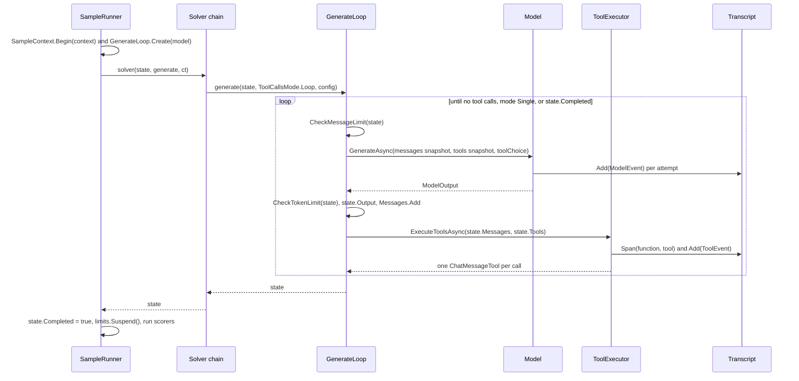
```mermaid
sequenceDiagram
    participant R as SampleRunner
    participant S as Solver chain
    participant G as GenerateLoop
    participant M as Model
    participant X as ToolExecutor
    participant T as Transcript
    R->>R: SampleContext.Begin(context) and GenerateLoop.Create(model)
    R->>S: solver(state, generate, ct)
    S->>G: generate(state, ToolCallsMode.Loop, config)
    loop until no tool calls, mode Single, or state.Completed
        G->>G: CheckMessageLimit(state)
        G->>M: GenerateAsync(messages snapshot, tools snapshot, toolChoice)
        M->>T: Add(ModelEvent) per attempt
        M-->>G: ModelOutput
        G->>G: CheckTokenLimit(state), state.Output, Messages.Add
        G->>X: ExecuteToolsAsync(state.Messages, state.Tools)
        X->>T: Span(function, tool) and Add(ToolEvent)
        X-->>G: one ChatMessageTool per call
    end
    G-->>S: state
    S-->>R: state
    R->>R: state.Completed = true, limits.Suspend(), run scorers
```

*`src/InspectAzureAI.Eval/Solvers/GenerateLoop.cs`, lines 66-98*

```csharp
        var toolChoice = state.ToolChoice;
        while (true)
        {
            CheckMessageLimit(state);

            // Snapshots: the model records its input on the transcript, and the state's lists keep mutating.
            var output = await model.GenerateAsync(state.Messages.ToArray(), state.Tools.ToArray(), toolChoice, config, cancellationToken: cancellationToken).ConfigureAwait(false);
            CheckTokenLimit(state);
            state.Output = output;
            // ...
            if (toolCalls == ToolCallsMode.None || message.ToolCalls is not { Count: > 0 })
            {
                return state;
            }

            var result = await ToolExecutor.ExecuteToolsAsync(state.Messages, state.Tools, maxToolOutput, cancellationToken).ConfigureAwait(false);
            state.Messages.AddRange(result.Messages);
            // ...
            if (state.Completed || toolCalls == ToolCallsMode.Single)
            {
                return state;
            }
```

**Tools.** A `ToolDef` is a named, described, schema-carrying executable with a `Parallel` flag and an optional `MaxOutput`; `ToInfo()` produces the `ToolInfo` the model sees. `ToolExecutor` runs the last assistant message's tool calls in stages: consecutive parallel tools share a stage under `Task.WhenAll`, a non-parallel or unknown tool is a barrier of one. Results are always placed at the call's original index.

*`src/InspectAzureAI.Eval/Tools/ToolExecutor.cs`, lines 35-54*

```csharp
        var results = new ChatMessageTool[toolCalls.Count];
        foreach (var stage in Stages(toolCalls, tools))
        {
            var tasks = stage.Select(index => RunOneAsync(toolCalls[index], tools, maxOutput, cancellationToken)).ToArray();
            var outcomes = await Task.WhenAll(tasks).ConfigureAwait(false);
            for (var i = 0; i < stage.Count; i++)
            {
                results[stage[i]] = outcomes[i].Message;
            }

            // Anything that is not a ToolError (or one of the mapped system errors) is fatal to the sample,
            // as in Python; the first failure in declared order wins once the stage has settled.
            var fatal = outcomes.Select(o => o.Fatal).FirstOrDefault(e => e is not null);
            if (fatal is not null)
            {
                System.Runtime.ExceptionServices.ExceptionDispatchInfo.Capture(fatal).Throw();
            }
        }

        return new ExecuteToolsResult(results);
```

`RunOneAsync` opens a `tool` span, turns a `ParseError` into a parsing tool error, reports unknown functions, validates required parameters, invokes the tool, and maps exceptions to `ToolCallError` codes (timeout, sandbox_unavailable, permission, file_not_found, limit, approval, and so on). Text results are truncated to `tool.MaxOutput ?? 16 KiB`, keeping the tail, and the `ToolEvent` records what the model actually saw. `SandboxTools.Bash` and `Python` are the built-in sandbox tools; they resolve the sandbox from the ambient context and return stderr followed by stdout.

Three ported pieces sit on this path. Every call's arguments are validated against the tool's JSON schema by `ToolInputValidator` (4.17) after the required-parameter check, as Python's `call_tool` does; the ambient approval policy, when one is installed, decides before the tool runs (4.20); and a `ToolDef` with `Handoff` set is a handoff to another agent (4.14) rather than a function. `ToolDef.FromMethod` (4.12) builds a `ToolDef` from an ordinary C# method by reflection, and `BuiltinTools`, `TextEditor`, `BashSession` and MCP servers (4.17 to 4.19) supply the rest of the tool library.

**Built-in solvers.** `Solvers.SystemMessage`, `PromptTemplate`, `UserMessage` and `UseTools` are the prompt and tool helpers. `Solvers.BasicAgent` composes a ReAct loop: a system message with a `submit` tool, the generate loop, a loop-scoped token limit, a continue message when the model made no tool call, and scoring between attempts through `SampleContext.Scorer` when `maxAttempts > 1`.

**Agents.** An `AgentDef` wraps an `Agent` delegate over an `AgentState` (messages plus a synthesised output). `Agents.AsSolver` runs it inside an `agent` span and, in a `finally` block, copies the agent's messages and output back onto the `TaskState`, so an agent that throws still leaves its partial conversation for logging and scoring. The SWE agents in section 5 are `AgentDef`s, and so is Python's general-purpose `react` agent with its handoff, as_tool and run companions (4.14). The multiple-choice, chain-of-thought, self-critique and fork solvers are in 4.15.

### 4.4 Datasets and tasks

> **In plain English:** A dataset is the list of exam questions, with the expected answers and any files that go with them. A task bundles the questions with the recipe, the marking scheme, the kind of sandbox to use, and the limits.

`Datasets.Json` and `Datasets.Csv` read local files into `Sample` records (input as a string or message list, target, choices, id, metadata, sandbox spec, files, setup) through a `FieldSpec` or a custom mapper, then resolve relative file references next to the dataset, shuffle, and apply a limit, in Python's order. `EvalTask` is the record the runner consumes:

| Field | Meaning |
|---|---|
| `Dataset`, `Setup`, `Solver` | What to run; `Solver` defaults to `Solvers.Generate()`. |
| `Scorers`, `Metrics` | `ScorerDef`s with their own metrics, or a task-level metrics override. |
| `Sandbox`, `Epochs`, `Config` | The `SandboxSpec` (type and config), the epoch count with optional reducers, and the task's `GenerateConfig`. |
| `MessageLimit`, `TokenLimit`, `TurnLimit`, `TimeLimit`, `WorkingLimit`, `CostLimit` | Per-sample limits, rooted on the scoped limit stack (4.8) and the cost ledger (4.11). |
| `FailOnError`, `ContinueOnFail`, `RetryOnError`, `EarlyStopping` | The error policy (4.8): `FailOnError` defaults to `Always`. |
| `Approval`, `ModelRoles` | The task's tool-approval policies (4.20) and named model roles (4.12); an eval-level value wins over both. |
| `Name`, `Version`, `Metadata`, `TaskArgs` | Identity: `TaskArgs` and `Version` feed the task identifier that eval sets (4.28) resume by. |

`[Task]` on a `public static` method returning an `EvalTask` is Python's `@task` decorator for the CLI (6.5).

### 4.5 The runner, scoring and the log

> **In plain English:** The runner is the invigilator. It starts the sandboxes, runs each question (several at a time), enforces the time limits, marks each answer, adds up the scores, and writes everything to a JSON file that the original Python tools can also read. Running out of time or budget ends the attempt but the answer still gets marked.

`Eval.RunAsync` is the only way to run a task. It resolves samples and epochs, initialises each distinct sandbox provider once, fans out one task per (sample, epoch) under a `SemaphoreSlim(MaxSamples)`, and writes the log even when the run was cancelled.

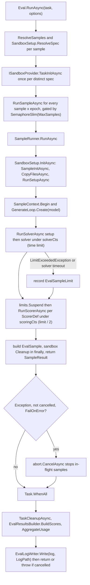
```mermaid
flowchart TD
    A["Eval.RunAsync(task, options)"] --> B["ResolveSamples and SandboxSetup.ResolveSpec per sample"]
    B --> C["ISandboxProvider.TaskInitAsync once per distinct spec"]
    C --> D["RunSampleAsync for every sample x epoch, gated by SemaphoreSlim(MaxSamples)"]
    D --> E["SampleRunner.RunAsync"]
    E --> F["SandboxSetup.InitAsync: SampleInitAsync, CopyFilesAsync, RunSetupAsync"]
    F --> G["SampleContext.Begin and GenerateLoop.Create(model)"]
    G --> H["RunSolverAsync setup then solver under solverCts (time limit)"]
    H -->|LimitExceededException or solver timeout| I["record EvalSampleLimit"]
    H --> J["limits.Suspend then RunScorerAsync per ScorerDef under scoringCts (limit / 2)"]
    I --> J
    J --> K["build EvalSample, sandbox Cleanup in finally, return SampleResult"]
    K --> L{"Exception, not cancelled, FailOnError?"}
    L -->|yes| M["abort.CancelAsync stops in-flight samples"]
    L -->|no| N["Task.WhenAll"]
    M --> N
    N --> O["TaskCleanupAsync, EvalResultsBuilder.BuildScores, AggregateUsage"]
    O --> P["EvalLogWriter.Write(log, LogPath) then return or throw if cancelled"]
```

*`src/InspectAzureAI.Eval/Runner/Eval.cs`, lines 177-208*

```csharp
        async Task RunSampleAsync(int index, Sample sample, SandboxSpec? sandbox, int epoch)
        {
            try
            {
                await semaphore.WaitAsync(abort.Token).ConfigureAwait(false);
            }
            catch (OperationCanceledException)
            {
                // never started: Python logs nothing for samples still queued when the run stops
                return;
            }
            // ...
                reporter?.SampleStarted(sample.Id!, epoch);
                var result = await runner.RunAsync(sample, sandbox, epoch, abort.Token).ConfigureAwait(false);
                results[index] = result;
                reporter?.SampleCompleted(result.Sample);
                if (result.Exception is { } ex && !result.Cancelled && failOnError)
                {
                    lock (failureSync)
                    {
                        failure ??= ex;
                    }

                    await abort.CancelAsync().ConfigureAwait(false);
                }
```

Cancellation and fail-on-error share one linked token source: cancelling it stops in-flight samples and makes queued ones return before they start, leaving a null slot that the log omits. Sandbox `TaskCleanupAsync` runs with `CancellationToken.None` so cleanup completes even when the caller cancelled.

The diagram is the shape of one attempt. Around it, `Eval.RunAsync` now runs the attempt loop of 4.8 (`SampleErrorHandler` for the `FailOnError` policy, `RetryOnError` re-queueing, early stopping), takes its sample semaphore from the scheduler of 4.9, reuses finished samples from a previous log when an eval set resumes (4.28), emits the hooks of 4.21, and records each sample into an `ILogRecorder` as it completes (4.24) instead of writing once at the end.

**Per sample.** `SampleRunner.RunAsync` builds a fresh `Store`, `Transcript`, `Limits` and `TaskState`, initialises the sandbox inside an `init` span (container up, sample files copied, the setup script run once under `INSPECT_SANDBOX_SETUP_TIMEOUT`), installs the `SampleContext`, and runs setup and solver under a token that fires at the time limit.

*`src/InspectAzureAI.Eval/Runner/SampleRunner.cs`, lines 95-115*

```csharp
                state = await RunSolverAsync("solver", task.Solver, state, generate, transcript, solverCts.Token).ConfigureAwait(false);
            }
            catch (LimitExceededException ex)
            {
                limit = SampleLimit(ex);
            }
            catch (OperationCanceledException) when (solverCts.IsCancellationRequested && !cancellationToken.IsCancellationRequested)
            {
                limit = TimeLimitExceeded();
            }

            state.Completed = true;
            limits.Suspend();

            // Python gives scoring half the original time limit: it must still run after a timed-out solver,
            // but a hung container should not cost the full limit a second time.
            using var scoringCts = CancellationTokenSource.CreateLinkedTokenSource(cancellationToken);
            if (timeLimit is { } scoringLimit)
            {
                scoringCts.CancelAfter(scoringLimit / 2);
            }
```

> **Limits end the solver, not the sample.** A message, token or time limit becomes an `EvalSampleLimit` and the sample proceeds to scoring with usage still accumulating but no check raising. The exception filter is the only thing distinguishing a solver timeout from caller cancellation, which propagates and marks the result cancelled. A scoring timeout is a `TimeoutException`, that is a sample error, not a limit.

**Scoring.** A `Scorer` is a delegate `(TaskState, Target, ct) -> Task<Score>`; `ScorerDef` attaches a name and default metrics. Built-ins are `Includes`, `Match`, `ExactMatch`, `Pattern`, `ModelGradedQa`, `ModelGradedFact` and `Custom`. The model-graded scorers resolve their grader lazily as `model ?? SampleContext.Require().ActiveModel`, neutralise `[BEGIN DATA]` delimiters in the question and answer, and parse the grade with the permissive regex. `EvalResultsBuilder.BuildScores` produces one `EvalScore` per scorer and reducer view; epochs are reduced per sample id before metrics run.

*`src/InspectAzureAI.Eval/Runner/EvalResultsBuilder.cs`, lines 42-65*

```csharp
        var result = new List<EvalScore>();
        for (var i = 0; i < scorers.Count; i++)
        {
            var name = scorerNames[i];
            var metrics = metricsOverride ?? scorers[i].Metrics;
            var scores = sampleScores.Where(s => s.ContainsKey(name)).Select(s => s[name]).ToList();

            // Python: no reducers → an unnamed mean view; an explicit empty list disables reduction entirely
            if (reducers is { Count: 0 })
            {
                result.Add(ScoreForMetrics(name, scores, metrics, null));
                continue;
            }

            var views = reducers is null
                ? [(Reducers.Mean(), (string?)null)]
                : reducers.Select(reducer => (reducer, Reducers.NameOf(reducer))).ToList();
            foreach (var (reducer, reducerName) in views)
            {
                result.Add(ScoreForMetrics(name, ReduceScores(scores, reducer), metrics, reducerName));
            }
        }

        return result;
```

Sample identity follows Python's value semantics: the int `1` and the string `"1"` are different samples, so ids are keyed with a type prefix for both the duplicate check and epoch grouping.

**The log.** `EvalLogWriter` serialises the `EvalLog` record graph (spec, results, stats, samples with messages, output, scores, store snapshot, transcript events, usage per model) as Python-compatible snake_case JSON. All the fidelity lives in one read-only `JsonSerializerOptions` with hand-written converters for every union or computed-property type.

*`src/InspectAzureAI.Eval/Log/EvalLogWriter.cs`, lines 71-98*

```csharp
        var options = new JsonSerializerOptions
        {
            PropertyNamingPolicy = JsonNamingPolicy.SnakeCaseLower,
            WriteIndented = true,
            DefaultIgnoreCondition = JsonIgnoreCondition.WhenWritingNull,
            // Python writes non-ASCII text verbatim; the default encoder would escape it (and '+', '<', ...)
            Encoder = JavaScriptEncoder.UnsafeRelaxedJsonEscaping,
            Converters =
            {
                new JsonStringEnumConverter<EvalStatus>(JsonNamingPolicy.SnakeCaseLower),
                new PlainObjectConverter(),
                new NonFiniteDoubleConverter(),
                // ...
                new ContentConverterFactory(),
                new MessageContentConverter(),
                new ChatMessageConverterFactory(),
                new ScoreValueConverterFactory(),
                new ScoreConverter(),
                new ModelCallConverter(),
                new ModelOutputConverter(),
                new TranscriptEventConverterFactory(),
            },
        };
        options.MakeReadOnly(populateMissingResolver: true);
```

Since the log-schema port (4.23) the output is byte for byte what pydantic writes, non-finite floats included: `NaN` and `Infinity` appear as the bare constants Python emits (`ser_json_inf_nan="constants"`) and read back as such, legacy shapes are migrated on read, and `EvalLog.Version` is 2 (a newer version is rejected, older ones are normalised). The default on-disk format is the `.eval` zip of 4.24, written sample by sample through an `ILogRecorder`; `EvalLogWriter.Read` / `Write` route either extension to the right format. The log path is `LogFileNaming.LogFilePath(logDir, spec, format)`: `<logDir>/<created>_<task>_<task_id>.<ext>` with Python's `clean_filename_component` applied to each part (`_`, `/`, `:`, `+` become `-`), so Python's `list_eval_logs` parses it.

### 4.6 Sandboxes: Docker and local

> **In plain English:** A sandbox is a disposable mini computer where the AI can run commands. Docker sandboxes are real containers, one per question, with strict timeouts enforced from inside the container. The local sandbox is just a temporary folder on your own machine, used for quick offline runs and tests.

The sandbox subsystem (`src/InspectAzureAI.Eval/Sandbox`) is the per-sample execution environment agents, tools and scorers use. `ISandboxEnvironment` offers `ExecAsync(argv, input, cwd, env, user, timeout)`, `WriteFileAsync`, `ReadFileAsync` and `HostAddress`; `ISandboxProvider` owns the lifecycle (`TaskInitAsync` once per task, `SampleInitAsync` per sample returning `SandboxEnvironments` plus a cleanup delegate, `TaskCleanupAsync`). `SandboxRegistry` is pre-seeded with `local` and `docker`.

**Docker.** `DockerSandboxProvider` resolves the spec's config (null means `python:3.12-slim-bookworm`; a directory or Dockerfile is built and tagged by a content hash of the context; anything else is pulled), starts one idle container per sample (`docker run -d --init --name inspect-swe-<hex> --add-host host.docker.internal:host-gateway IMAGE sleep infinity`), and returns a cleanup that runs `docker rm -f` or keeps the container for inspection. Everything goes through the bare `docker` CLI, built by `DockerCli` and executed by `ProcessRunner`.

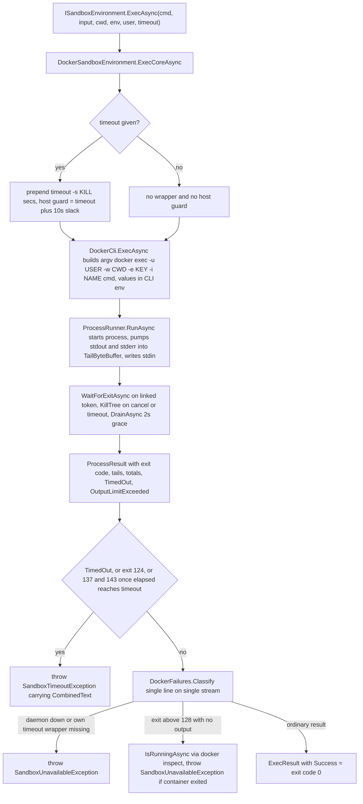
```mermaid
flowchart TD
    A["ISandboxEnvironment.ExecAsync(cmd, input, cwd, env, user, timeout)"] --> B["DockerSandboxEnvironment.ExecCoreAsync"]
    B --> C{"timeout given?"}
    C -->|yes| D["prepend timeout -s KILL secs, host guard = timeout plus 10s slack"]
    C -->|no| E["no wrapper and no host guard"]
    D --> F["DockerCli.ExecAsync builds argv docker exec -u USER -w CWD -e KEY -i NAME cmd, values in CLI env"]
    E --> F
    F --> G["ProcessRunner.RunAsync starts process, pumps stdout and stderr into TailByteBuffer, writes stdin"]
    G --> H["WaitForExitAsync on linked token, KillTree on cancel or timeout, DrainAsync 2s grace"]
    H --> I["ProcessResult with exit code, tails, totals, TimedOut, OutputLimitExceeded"]
    I --> J{"TimedOut, or exit 124, or 137 and 143 once elapsed reaches timeout"}
    J -->|yes| K["throw SandboxTimeoutException carrying CombinedText"]
    J -->|no| L["DockerFailures.Classify single line on single stream"]
    L -->|"daemon down or own timeout wrapper missing"| M["throw SandboxUnavailableException"]
    L -->|"exit above 128 with no output"| N["IsRunningAsync via docker inspect, throw SandboxUnavailableException if container exited"]
    L -->|"ordinary result"| O["ExecResult with Success = exit code 0"]
```

*`src/InspectAzureAI.Eval/Sandbox/Docker/DockerSandboxEnvironment.cs`, lines 218-224 and 246-260*

```csharp
        var inContainer = cmd;
        DockerFailures.InjectedWrapper? wrapper = null;
        if (timeout is { } limit)
        {
            inContainer = ["timeout", "-s", "KILL", FormatSeconds(limit), .. cmd];
            wrapper = new DockerFailures.InjectedWrapper("timeout", cmd[0]);
        }
        // ...
        if (timeout is { } expected)
        {
            var seconds = FormatSeconds(expected);
            if (result.TimedOut)
            {
                throw new SandboxTimeoutException($"Command timed out after {seconds} seconds (docker exec did not return): {string.Join(" ", cmd)}", result.CombinedText);
            }

            // 124 is GNU timeout's own code; 137/143 also come from OOM kills and stray signals, so wall-clock
            // time disambiguates those from a real timeout.
            if (result.ExitCode is 124 or 137 or 143 && (result.ExitCode == 124 || elapsed >= expected))
            {
                throw new SandboxTimeoutException($"Command timed out after {seconds} seconds: {string.Join(" ", cmd)}", result.CombinedText);
            }
        }
```

Timeouts are enforced inside the container with GNU `timeout -s KILL` because `docker exec` detaches on a host signal and would orphan the process tree; the host-side guard is only a backstop. Environment variables are passed as bare `-e NAME` with the value in the docker CLI's own environment, so bridge tokens never appear in `ps`.

**`ProcessRunner`** is the single host-process primitive both sandboxes use. It pumps stdout and stderr concurrently into keep-the-tail buffers (capped by `INSPECT_SANDBOX_MAX_EXEC_OUTPUT_SIZE`, 10 MiB by default) so unbounded output cannot exhaust memory or deadlock a pipe, and distinguishes three cancellation causes.

*`src/InspectAzureAI.Eval/Sandbox/Docker/ProcessRunner.cs`, lines 59-61 and 81-100*

```csharp
        var stdout = new TailByteBuffer(request.OutputLimit);
        var stderr = new TailByteBuffer(request.OutputLimit);
        using var abort = new CancellationTokenSource();
        // ...
        catch (OperationCanceledException)
        {
            KillTree(process);
            if (cancellationToken.IsCancellationRequested)
            {
                await DrainAsync(pumps).ConfigureAwait(false);
                cancellationToken.ThrowIfCancellationRequested();
            }

            if (abort.IsCancellationRequested)
            {
                limitExceeded = true;
            }
            else
            {
                timedOut = true;
            }

            await process.WaitForExitAsync(CancellationToken.None).ConfigureAwait(false);
        }
```

**Local.** `LocalSandboxEnvironment` runs commands on the host in a per-sample temp directory under `inspect-swe/`, ignores `user` with a one-time warning, and relies on `Process.Kill(entireProcessTree: true)` for timeouts. It is what `--fake` and most tests use.

### 4.7 The agent bridge

> **In plain English:** Some AI tools, like the Claude Code app, expect to call the AI company's servers directly. The bridge is a stand-in for that server running on your machine. The tool talks to it as normal, and the bridge quietly forwards everything to whichever model the exam is actually using, then rebuilds the conversation for the report. A random password stops anything else on the network from using it.

The agent bridge lets a scaffold running inside the sandbox (the Claude Code CLI) talk to a host-side HTTP server as if it were the Anthropic Messages API or the OpenAI chat-completions API. Unlike Python's in-sandbox proxy, `SandboxAgentBridge` runs on the host: it binds `127.0.0.1` for a local sandbox and the wildcard prefix for Docker (the container reaches it as `host.docker.internal`), protected by a random per-instance token compared in constant time.

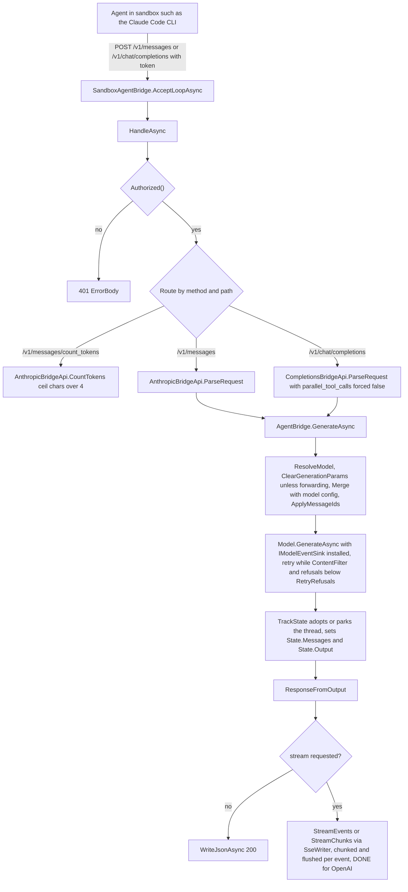
```mermaid
flowchart TD
    A["Agent in sandbox such as the Claude Code CLI"] -->|"POST /v1/messages or /v1/chat/completions with token"| B["SandboxAgentBridge.AcceptLoopAsync"]
    B --> C["HandleAsync"]
    C --> D{"Authorized()"}
    D -->|no| E["401 ErrorBody"]
    D -->|yes| F{"Route by method and path"}
    F -->|"/v1/messages/count_tokens"| G["AnthropicBridgeApi.CountTokens ceil chars over 4"]
    F -->|"/v1/messages"| H["AnthropicBridgeApi.ParseRequest"]
    F -->|"/v1/chat/completions"| I["CompletionsBridgeApi.ParseRequest with parallel_tool_calls forced false"]
    H --> J["AgentBridge.GenerateAsync"]
    I --> J
    J --> K["ResolveModel, ClearGenerationParams unless forwarding, Merge with model config, ApplyMessageIds"]
    K --> L["Model.GenerateAsync with IModelEventSink installed, retry while ContentFilter and refusals below RetryRefusals"]
    L --> M["TrackState adopts or parks the thread, sets State.Messages and State.Output"]
    M --> N["ResponseFromOutput"]
    N --> O{"stream requested?"}
    O -->|no| P["WriteJsonAsync 200"]
    O -->|yes| Q["StreamEvents or StreamChunks via SseWriter, chunked and flushed per event, DONE for OpenAI"]
```

*`src/InspectAzureAI.Eval/Agents/Bridge/SandboxAgentBridge.cs`, lines 326-345*

```csharp
                case Route.Messages:
                    {
                        var parsed = AnthropicBridgeApi.ParseRequest(json);
                        var output = await _bridge.GenerateAsync(parsed.Model, parsed.Messages, parsed.Tools, parsed.ToolChoice, parsed.Config, cancellationToken).ConfigureAwait(false);
                        var message = AnthropicBridgeApi.ResponseFromOutput(output, parsed.Model);
                        if (!parsed.Stream)
                        {
                            await WriteJsonAsync(response, 200, message, cancellationToken).ConfigureAwait(false);
                            break;
                        }

                        var writer = StartStream(response);
                        responseStarted = true;
                        foreach (var sseEvent in AnthropicBridgeApi.StreamEvents(message))
                        {
                            await writer.WriteAsync(sseEvent, cancellationToken).ConfigureAwait(false);
                        }

                        break;
                    }
```

The HTTP layer is a thin dispatcher: a dialect module (`AnthropicBridgeApi` or `CompletionsBridgeApi`) parses the body into Inspect messages, tools, tool choice and config, `AgentBridge.GenerateAsync` does the model call, and the dialect module renders the response. Streaming is synthesised after the fact from the complete response, so the model is never streamed through the bridge.

*`src/InspectAzureAI.Eval/Agents/Bridge/AgentBridge.cs`, lines 140-160*

```csharp
        var model = ResolveModel(requestedModel);
        var config = ResolveGenerateConfig(model, ForwardGenerationConfig ? requestConfig : ClearGenerationParams(requestConfig));
        var messages = ApplyMessageIds(input);

        var refusals = 0;
        ModelOutput output;
        while (true)
        {
            using var sinkScope = ModelEventSink is null ? null : ModelEventSinks.Install(ModelEventSink);
            output = await model.GenerateAsync(messages, tools, toolChoice, config, cancellationToken: cancellationToken).ConfigureAwait(false);
            if (!output.Empty && output.StopReason == StopReason.ContentFilter && RetryRefusals is { } limit && refusals < limit)
            {
                refusals++;
                continue;
            }

            break;
        }

        TrackState(messages, output);
        return output;
```

Three things happen on every bridged request:

- **Model resolution and config precedence.** The requested name collapses onto an alias or the served `Model`. Because `ForwardGenerationConfig` is false by default, the scaffold's `max_tokens`, temperature and reasoning settings are stripped and the served model's own config wins, which is how `--reasoning-effort` from the CLI flags governs a Claude Code run.
- **Stable message ids.** Each message is keyed by a MurmurHash3 of a Python-identical JSON snapshot (bit-exact with Python so `attachment://` references are recognised), so the same scaffold message keeps its id across calls.
- **Thread tracking.** `TrackState` fingerprints input plus output (role and text hash) and decides whether this call is the scaffold's main conversation or a side thread (a sub-agent, a summary), adopting it into `AgentState.Messages` and `Output` when it extends or supersedes the tracked thread. That reconstruction is what the Claude Code agent returns; nothing is parsed from the CLI's own result event.

Errors map per dialect: a `LimitExceededException` is stored as `LimitError` and cancels `LimitReached`, which tears down the CLI's exec; `ModelGenerateException` and bad requests answer 400; anything else 500, as an `event: error` frame once a stream has started.

The same `AgentBridge` has an in-process face: `InspectAzureAI.Maf.InspectChatClient` implements Microsoft.Extensions.AI's `IChatClient` over it, so a Microsoft Agent Framework `ChatClientAgent` (or any `IChatClient` consumer) runs its own tool loop while every model call, approval decision and limit is Inspect's; `ToolDefFunction` hands Inspect tools such as the sandbox `bash` to the framework, and function-invocation middleware records a `ToolEvent` per call. `docs/agent-framework.md` covers it.

### 4.8 Scoped limits, error policy, retries and early stopping

> **In plain English:** Limits used to be one flat checklist per question. Now they stack: the exam sets a budget, an agent inside it can set a smaller one, and a helper inside that a smaller one still, and every use is counted against the whole stack from the outside in. The same section covers what happens when a question crashes: retry it from scratch, count it against a failure threshold, or stop the whole exam early.

Python's `util/_limit.py` keeps each limit kind on a tree of nested scopes; `Context/Limit.cs` and `LimitTree.cs` port that base with one concrete class per kind (`TokenLimit`, `MessageLimit`, `TurnLimit`, `TimeLimit`, `WorkingLimit`). A limit is entered with `.Enter()` inside a `using` (or `Limit.Apply(...)` / `LimitScope.RunAsync`), records on itself and its ancestors, and is checked root first; the limit that trips is `LimitExceededException.SourceLimit`. `SampleRunner` applies the task's limits as the root nodes, agents push their own beneath them (4.14), and `Model.GenerateAsync` calls the statics: `MessageLimit.CheckMessageLimit` before the call, `TokenLimit.RecordModelUsage` / `CheckTokenLimit` after it, `TurnLimit.RecordTurn` on every return, cache hits included. Every trip records a `SampleLimitEvent` on the transcript. The flat `Limits` class of 4.1 remains the per-sample usage ledger and carries the cost limit (4.11).

| Policy | Where | Behaviour |
|---|---|---|
| `FailOnError` (bool or number) | `EvalTask` / `EvalOptions` / `EvalConfig` | `Always`, `Never`, a fraction or a count; `ContinueOnFail` defers the decision to the end of the run. |
| `RetryOnError` | `SampleRunner` is one attempt per call; `Eval.RunAsync` loops | A failed sample re-runs from scratch (fresh store, transcript and sandbox, same uuid) at the back of the queue; the retried errors land in `EvalSample.ErrorRetries` with the events from the attempt's last model call on. |
| `IEarlyStopping` | `EvalTask.EarlyStopping` | `StartTask` / `ScheduleSample` / `CompleteSample` / `CompleteTask` callbacks; a halted sample is never logged and the summary lands in `EvalResults.EarlyStopping`. |
| `EvalOptions.SampleIds` | `SampleIdFilter` | fnmatch globs over normalised ids with `task:id` scoping. |

Timing follows Python: `TotalTime` runs from after sandbox init and `WorkingTime` subtracts the waiting time that model retries report. Deviations: `TimeLimit` is a cancellation-token deadline, so the body sees an `OperationCanceledException` that `LimitScope` converts; the working-limit monitor sleeps until the earliest possible trip instead of polling; token-limit formulas and the `500k` / `1m` syntax are not ported. Port note: `docs/ports/runner-extras.md`.

### 4.9 Connection concurrency and throughput

> **In plain English:** Too many simultaneous calls get you throttled; too few waste time. The engine starts small, opens more connections while calls succeed, backs off when the server pushes back, and reports tokens per second as it goes.

`Concurrency/` ports `util/_concurrency.py`, the connection-slot bookkeeping of `model/_model.py` and `model/_throughput.py`. A `Model` without an explicit `MaxConnections` gates its generates with an `AdaptiveConcurrencyController` (slow start, additive increase / multiplicative decrease, a saturation gate and a cooldown debounce; start 10, default 20, max 100) keyed by `Model{ApiType}:{ConnectionKey}`, where the Foundry routes key on `{endpoint}:{model}`. `Model.GenerateAsync` holds one `ConnectionSlot` across the whole retry loop and its backoff sleeps, reports every retry decision through `Concurrency.ReportHttpRetry`, and feeds `Throughput.RecordGenerate` / `RecordRetryWait`, which `ConsoleEvalReporter` prints as the footer line (`IEvalReporter.Stats`). The runner's sample semaphore comes from `SampleScheduler.CreateSampleSemaphore`: a `DynamicSampleLimiter` that follows the controller (limit plus 5) when adaptive connections are active, else `MaxConnections`. The controller's history is written to the log as `stats.connection_limit_history`.

Deviations: registries, limiters and controllers are lock-protected (generates complete on the thread pool, not on one event loop) and process-global, and `Eval.RunAsync` does not reset them because `MatrixRunner` runs evals concurrently; `EvalOptions.MaxSamples` became `int?` (null derives it as Python does); `MaxConnections = 0` is rejected rather than treated as unset; batch mode, the hard-pause gate and the control channel are not ported. Port note: `docs/ports/concurrency.md`.

### 4.10 The prompt cache

> **In plain English:** Ask the same question twice with the same settings and the second answer comes from a folder on disk instead of the model. Entries expire, can be listed and pruned, and every use is marked in the report.

`Model/Cache/` ports `model/_cache.py`. `Model.GenerateAsync(..., cache: CachePolicy)` builds a `CacheEntry` from exactly what the provider would see (system message prepended, user messages collapsed, `max_tokens` defaulted), looks it up on every attempt of the retry loop, and stores the output after the token-limit check, so an output that breached the limit is never cached; a `content_filter` output never is either. The key is an MD5 over the components Python hashes in the order Python hashes them (config minus the connection and retry fields, messages minus ids, base URL, tool choice, tools, expiry in seconds, scopes, and the epoch when `PerEpoch`); the layout under `INSPECT_CACHE_DIR` (or the platform cache directory) is `generate/<model>/<key>`. A hit records a `ModelEvent` with `cache: "read"` and no `ModelCall`; every attempt under a policy records `cache: "write"`. `CacheOps` carries the list, clear, prune and size operations behind `inspectai cache`.

Deviations: the key hashes canonical JSON rather than `str()` of pydantic dumps, so a Python process and a .NET process never share entries; entries are JSON, not pickle; an invalid expiry fails at policy construction; unreadable entries are warned about and treated as misses. Port note: `docs/ports/prompt-cache.md`.

### 4.11 Model info, pricing and the cost limit

> **In plain English:** A built-in catalogue knows each model's context size and release date, and a price list you supply turns token counts into dollars. A question can be given a dollar budget the same way it is given a token budget.

`Model/Cost/` ports `model/_model_data/` (the 781-entry YAML database, converted to embedded JSON by `scripts/convert-model-data.py` with the source commit pinned in `manifest.json`), `model/_model_info.py` (`ModelInfoLookup`: exact, case-insensitive, then fuzzy match at the 60 threshold) and `compute_model_cost` (`ModelCosts`, bit-identical to the venv). Prices come only from `INSPECT_AZUREAI_MODEL_COST_CONFIG`, `EvalOptions.ModelCostConfig` or `ModelInfoLookup.SetModelCost`, because the Python data carries none. `Model.GenerateAsync` prices the output (`ModelCosts.PriceOutput`) before the event is recorded, so the `ModelEvent`, `EvalSample.ModelUsage` and `EvalStats.ModelUsage` all carry `total_cost`, then records and checks `Limits.CostLimit` after the token limits, in Python's order. `FoundryModelOverlay` maps a bare deployment name to its vendor's database key (`azureai/grok-4.6` resolves to xAI's entry, which Python's direct lookup misses).

Deviations: the price file is JSON only; a `cost_limit` without cost data is a `PrerequisiteError` before any sample runs; `cache_ttl` is always the 5-minute rate; only the eval model is checked. Port note: `docs/ports/cost.md`.

### 4.12 Model extras: structured output, JSON schema, reflection tools, stall scopes, fallbacks, roles

> **In plain English:** Things the Python `Model` does that the first cut skipped: asking for answers in a fixed JSON shape, turning an ordinary C# method into a tool, giving up on a stream that goes quiet, switching to a backup model, and naming models by role (grader, critic) rather than by deployment.

| Feature | Where | Mechanism |
|---|---|---|
| Every `GenerateConfig` field | `Provider/Core/GenerateConfig.cs`, `GenerateConfigTypes.cs` | A test checks the C# properties against `GenerateConfig.model_fields`. |
| Structured output | `Provider/Tools/ResponseFormat.cs` | `ResponseSchema` becomes `response_format: {type: json_schema, ...}` on the chat-completions route (port-only; Python's `azureai` ignores it), `output_format` plus the `structured-outputs-2025-11-13` beta on the Anthropic route, and `text.format` (`json_schema`) on the Responses route. |
| `JsonSchema` and `JsonSchemaOf<T>` | `Provider/Core/JsonSchema.cs`, `JsonSchemaGenerator.cs` | Records, enums, nullables, collections, dictionaries and `Description` attributes; cross-checked with the venv's `json_schema()`. |
| Reflection tools | `Tools/ToolDef.Reflection.cs` | `ToolDef.FromMethod` / `ParseToolInfo` / `ToolWith`; binding uses exact property names and never coerces, and the executor validates the call against the schema first. |
| Stall and attempt timeouts | `Provider/Core/StallScope.cs`, `Model/GenerateAttempt.cs`, `ModelTimeouts.cs` | `stream_idle_timeout` reschedules a `CancellationTokenSource` timer on every chunk; `attempt_timeout` links a second one; both raise exceptions the retry loop treats as transient. |
| Fallbacks | `Provider/Core/ModelFallback.cs`, `Model/FallbackModelApi.cs`, `SampleModelAccumulators.cs` | Server-side `fallback_models` is warned and ignored as Python does on Azure; `FallbackModelApi` (port-only) switches client-side after N failures and stamps the same `ModelFallback` record, rolled up per sample. |
| Roles | `Model/ModelRoles.cs` | `ModelRoles.Resolve` / `Merge` with Python's error messages, an ambient `Begin` scope, `ModelRoles.GetModel(role)`, `ModelEvent.Role`; `Eval.RunAsync` installs the merged eval-level and task-level roles. |

`TokenEstimation` ports the media constants of `model/_tokens.py`; text is a character heuristic because no tokenizer package is allowed. Port note: `docs/ports/model-extras.md`.

### 4.13 Message trimming and compaction

> **In plain English:** Long agent conversations outgrow the model's memory. Compaction shrinks the history before each call, by dropping old tool output, summarising, trimming, or a memory tool, and can rescue a call that failed because the history was too long.

`Model/Compaction/` ports `model/_trim.py` and `model/_compaction/`. `TrimMessages.Trim` keeps the system and input messages and the last `preserve` fraction of the conversation, dropping orphaned tool calls and results. The strategies (`CompactionEdit`, `CompactionSummary` with the Python prompt templates verbatim, `CompactionTrim`, `CompactionMemory`, `CompactionAuto`) implement `ICompactionStrategy` and are driven by an `ICompact` from `Compaction.Create`, whose threshold is an absolute token count or a fraction of the context window. The agent-loop seam is the `CompactionHook` delegate: a loop calls `CompactInputAsync` before each generate, `RecordOutputAsync` after it, and `Compaction.TryRecoverOverflowAsync` on a `model_length` stop. `BasicAgent`, `Agents.React` and the mini-swe loop all use it, and each compaction records a `CompactionEvent`.

Deviations: token counting is `ceil(chars / 4) * 1.1` unless the api implements `ICompactionModelApi`, so absolute thresholds trigger at different points than in Python; the context window comes from `CompactionModelInfo`, the api, or 128,000 for the scripted model; native compaction is `NotSupportedException` and `CompactionAuto` falls back to summary; no checkpointing. Port note: `docs/ports/compaction.md`.

### 4.14 React agents, handoff, as_tool and run

> **In plain English:** The general-purpose agent recipe from Python: think, call tools, repeat, then submit. Agents can hand a conversation to another agent, be offered to a model as a tool, or be run on their own, each within its own smaller budget.

`Agents/React.cs` ports `agent/_react.py`: `Agents.React(name, description, prompt, tools, model, attempts, submit, onContinue, retryRefusals, compaction, truncation, approval)` returns an `AgentDef` whose loop generates, executes tools, scores between attempts and stops on submit. `Handoff` wraps an agent as a `ToolDef` with `ToolDef.Handoff` set, so `ToolExecutor` runs it under a `handoff` span, appends the agent's messages after the tool message and stamps `ToolEvent.Agent`; `AsTool` exposes an agent as an ordinary tool; `Agents.RunAsync` runs one standalone and returns `AgentRunResult(State, LimitError)`. `AgentLimits` (message, token, time) enter as child nodes on the shared limit trees of 4.8 through `AgentLimitScope`, so agent budgets nest under the sample's. `MessageFilters` (`ContentOnly`, `RemoveTools`, `LastMessage`, `TrimMessages`) are the input and output filters.

Deviations: `on_continue` and `model` are each split into a string and a callable parameter; a model name string is not accepted; agents take no parameters, so a handoff tool's schema is empty and options travel by closure; the sample's limits are always checked alongside the agent's (stricter than Python's innermost-only message check); no checkpoints, operator channel or `agent_span_id`. Port note: `docs/ports/react-agents.md`.

### 4.15 Multiple choice, chain of thought, self critique and fork

> **In plain English:** The classic exam formats: pick A, B, C or D (with shuffled options un-shuffled again for marking), think step by step first, critique your own answer and rewrite it, or try several recipes on the same question at once.

`Solvers/MultipleChoice.cs` ports `solver/_multiple_choice.py` line for line: the templates, the strict `ANSWER:` parse with its lenient fallback, multi-answer forms (`AB`, `A,B`, `A and B`), shuffling through Python's own Fisher-Yates over `TaskState.Choices` (now a `Choices` object with marks), and the "pretend we didn't shuffle" rewrite of the prompt and the final message. `Scorers.Choice()` and `Scorers.Answer("letter" | "word" | "line")` are the matching scorers. `Solvers.ChainOfThought`, `AssistantMessage` and `SelfCritique` port `_prompt.py` and `_critique.py` with the default templates verbatim; `Solvers.Fork(state, solvers, generate)` runs each branch on a `TaskState.Copy()` under a `subtask` span and fails fast like `tg_collect`. `PythonFormat.Format` is the strict `str.format` subset the templates need.

Deviations: a seed does not reproduce a Mersenne Twister order (the algorithm matches, the generator does not); `shuffle` takes a `Random?`; `fork` takes the `Generate` delegate explicitly rather than reading a context variable; `TaskState.Copy()` shares the values inside metadata and store. Port note: `docs/ports/solvers.md`.

### 4.16 Metrics, extra scorers and reducers

> **In plain English:** Every statistic Python can put in the results table (variance, standard error with clustering, bootstrap and Wilson confidence intervals, grouped and categorical breakdowns, Krippendorff's alpha, perplexity), plus the scorers that combine or pre-compute scores and a maths-answer checker.

`Scorers/Metrics/` ports `scorer/_metrics/` (`Var`, `Stderr(cluster)`, `BootstrapStderr`, `Ci`, `CiWilson`, `Grouped`, `Frequency`, `Categorical`, `Aggregate`, `KrippendorffAlpha`, `PerplexityPerToken` / `PerSeq`), with `Distributions` porting the t and normal quantiles from CPython's `statistics`; reference values were computed with the venv and are asserted within 1e-9. `Reducers.Majority`, `PassK`, `Collect`, `Create(name)` and `Validate` complete the reducer set; `Scorers.F1`, `Exact`, `Cascade`, `MultiScorer`, `PrecomputedScores` and `Math` are the extra scorers. `MetricScores.Unreduced` metrics get their own reducer-less `EvalScore` over every epoch, as `compute_eval_scores_for_views` does.

Deviations: the math scorer has no SymPy, so it evaluates the numeric subset exactly (big-integer rationals, `\frac`, `\sqrt`, `\binom`, units, tuples) and compares anything symbolic as text; the C# `Scorer` cannot return `None`, so NaN stands in for an unscored result in `cascade` and `multi_scorer`; bootstrap randomness is `System.Random`. Port note: `docs/ports/metrics.md`.

### 4.17 Built-in tools and web search

> **In plain English:** Ready-made tools an agent can be given: a scratchpad to think in, web search through a search API, reading, listing and grepping files in the sandbox, and a to-do list or plan the agent keeps updated.

`Tools/Builtin/` ports `tool/_tools/`: `BuiltinTools.Think`, `WebSearch`, `ReadFile`, `ListFiles`, `Grep`, `TodoWrite` and `UpdatePlan`. Every factory's name, description, schema, `options` and `parallel` flag are asserted byte for byte against the Python `ToolDef` dump in `fixtures/tools/tool_info.json`. Web search follows Python's provider design: an external provider (`TavilySearchProvider`, `ExaSearchProvider`, and a .NET-only `PerplexitySearchProvider`) created lazily on the first call, with `BaseHttpProvider` supplying the per-provider concurrency and tenacity-style retries; Claude's server-side `web_search_20250305` is passed through on the Anthropic route and its `server_tool_use` / `web_search_tool_result` blocks come back as `ContentToolUse` with `UrlCitation`s. `ToolInputValidator` ports `validate_tool_input` (Draft 7 messages, same wording), and `ToolExecutor` runs it for every call.

Deviations: Perplexity is used only when listed explicitly (Python's default configuration still fails with "No valid provider found."); the `google` provider and `web_fetch` are not ported. Port note: `docs/ports/builtin-tools.md`.

### 4.18 Sandbox tools over JSON-RPC: text_editor and bash_session

> **In plain English:** Two tools that need a helper program inside the sandbox: a file editor with undo, and a persistent shell session. The helper is the same published binary Python uses, downloaded, checked against its published checksum, copied in, and spoken to over a small request-and-response protocol.

`Tools/Support/` ports the injection and the transport: `SandboxToolsBinary` downloads the pinned `inspect-sandbox-tools` release (v29, vendored `SHA256SUMS`) into `INSPECT_SANDBOX_TOOLS_BINARIES_DIR`; `SandboxToolSupport` runs Python's injection sequence (detector, `SandboxRecon` for architecture, libc and OS, root or rootless install, `tar xzf`, `start-server`) once per sandbox under a lock; `JsonRpc` and `SandboxJsonRpcTransport` send `json.dumps`-formatted requests through `ISandboxEnvironment.ExecAsync([cli, "exec"])` with the chunked-response reassembly of the Python transport. `TextEditor.Create` and `BashSession.Create` are the tools, with schemas byte-identical to the venv's and the `bash_session` state kept in the sample store under Python's `BashSessionStore` keys.

Deviations: a `version` RPC verifies each fresh injection; digest verification is always strict and binaries are never bundled; `ExecAsync` has no `timeout_retry` / `concurrency`; `type_submit` without `input` sends only the return key (Python's f-string types the literal `None`). Port note: `docs/ports/sandbox-tools.md`.

### 4.19 MCP tool sources

> **In plain English:** The Model Context Protocol is a standard way for a program to offer tools. An eval can connect to such a server (a local process, a web address, or a program started inside the sandbox) and hand its tools to the model like any other.

`Tools/Mcp/` ports `tool/_mcp/` on the official `ModelContextProtocol` SDK, the one NuGet dependency of the Eval project. `Mcp.McpServerStdio` / `McpServerHttp` / `McpServerSse` / `McpServerSandbox` build servers, `Mcp.McpTools(server, names)` filters their tools into an `IToolSource`, and `await using var c = await McpConnection.ConnectAsync(tools)` holds one session across calls. Tools resolve to ordinary `ToolDef`s (schemas through `BridgeJson.ToolParamsFromSchema`), results map to `ToolResult` contents, `isError` results raise `ToolError`, and JSON-RPC error codes map as Python's error mapper does. The sandbox transport implements the SDK's `IClientTransport` over the same `mcp_launch_server` / `mcp_send_request` carrier protocol as Python, through the injected CLI of 4.18.

Deviations: a session lives per async flow (`AsyncLocal`) rather than per task; sampling is not wired (the SDK marks it obsolete); solvers hold a `List<ToolDef>`, so callers resolve `ToolsAsync()` under a connection first. Port note: `docs/ports/mcp-tools.md`.

### 4.20 Tool-call approval

> **In plain English:** A gate in front of every tool call. A policy says which tools need which approver: approve automatically, ask a human at the console, modify the call, reject it with an explanation, or stop the whole sample. The bridged Claude Code agent gets the same gate on every response.

`Approval/` ports `inspect_ai/approval`. `ApprovalPolicy(approver, tools)` matches prefix globs with `fnmatch` over `format_function_call(...)`; the first match decides and `escalate` continues down the chain. `ApprovalPolicies.FromFile` reads the JSON form of the policy file and `ToConfig` records it as `EvalConfig.approval`. `ToolApproval.Begin` installs the policies ambiently, exactly as `eval(approval=)` does, so `ToolExecutor` (before running a tool), `Agents.React`, the mini-swe loop and the bridge all consult the same scope. `approve` and `modify` run the tool (the tool message keeps the model's original call), `reject` becomes a `ToolCallError("approval", ...)`, and `terminate` throws `TerminateSampleException`, which the runner records as the `operator` sample limit and still scores. Every decision is an `ApprovalEvent`. `BridgeApproval` applies the gate to a bridged response: a rejection replays the assistant turn plus one `approval` tool result per call and regenerates, and three consecutive rejections terminate.

Deviations: policy files are JSON only; the human approver is console-only behind `IApprovalPrompter` (no `modify`, no notifications, no ACP or panel routing); approvers are `ApproverDef`s registered with `ApproverRegistry` rather than registry-tagged closures; upstream's host-tool execution grants are not needed because the .NET bridge exposes no host-tool surface. Port note: `docs/ports/approval.md`.

### 4.21 Lifecycle hooks

> **In plain English:** Callbacks at every stage of a run (run, task, sample, attempt, model call, retry, cache hit) so a host can log, meter or route events elsewhere without touching the engine.

`Hooks/` ports `hooks/_hooks.py` and `_startup.py`: the abstract `Hooks` with seventeen no-op virtual callbacks and `OverrideApiKey`, the payload records with Python's names, `HookRegistry` (the `@hooks` decorator) plus per-run `EvalOptions.Hooks`, `HookEmitter` with every `Emit*Async`, and `HookStartup.InitHooks` with the `INSPECT_REQUIRED_HOOKS` check. Emission order and gating are Python's: run start, task start, sample init, sample start, attempt start, sample events (queued to a background emitter and drained before the attempt end), scoring, attempt end, sample end, task end, run end; `Model.GenerateAsync` emits before-generate, cache usage, usage and retry. A throwing hook is logged and the rest still run; a `LimitExceededException` propagates. An eval set (4.28) wraps its passes in eval-set start and end and runs each pass under one `HookRunGroup`.

Deviations: registration is explicit (no entry points or legacy telemetry hooks); `init_hooks` runs at `Eval.RunAsync`; `RunEnd.Logs` holds the logs written before an exception; the `BeforeModelGenerate` payload is read-only; the Foundry providers authenticate with Entra ID only, so `ApiKeyOverride` is never consulted by them. Port note: `docs/ports/hooks.md`.

### 4.22 Store and state tracking, JSON changes, replay and subtasks

> **In plain English:** The shared notepad and the solver's state are diffed at every step and the differences go in the report, so a log can be replayed to see what the notepad held at any point. Sub-tasks get their own notepad and their own diary entry.

`Context/JsonChanges.cs` and `JsonPatch.cs` port `json_changes` and the `jsonpatch` library (the six operations, `replaced` values, the list-append convention); a cross-check runs the venv's `json_changes` over 24 documents and asserts the same operations. `Transcript.Span` now snapshots the ambient store on entry and records a `StoreEvent` on dispose, exactly where Python's `span()` wraps `track_store_changes()`; `SolverTranscript` and `ChainSolver` record a `StateEvent` after each step; `StoreReplay.StoreFromEvents` rebuilds a store from a log. `StoreModel` is the typed view (`{TypeName}:{instance}:{field}` keys, so a .NET model reads a Python log's store and vice versa); `Subtask.RunAsync` swaps the ambient store, opens a `subtask` span and updates a pending `SubtaskEvent` in place.

Deviations: a `StoreEvent` is recorded even when the span body throws; patches visit keys in document order (Python: set order); `StoreModel` raises on a failed coercion instead of returning the raw value; `StoreAs` outside a context throws. Port note: `docs/ports/store-replay.md`.

### 4.23 The log data model and the `.json` format

> **In plain English:** The report's vocabulary, every kind of diary entry and every field of the summary, matches Python's exactly, byte for byte where it matters, so Python's own viewer and reader open these files and old Python files open here.

`Log/EvalLog.cs`, `EvalLogModels.cs` and `Context/TranscriptEventTypes.cs` port `log/_log.py` and all 23 members of the `Event` union (`SampleInit`, `SampleLimit`, `Sandbox`, `State`, `Store`, `Model`, `Tool`, `Anchor`, `Approval`, `Branch`, `Checkpoint`, `Compaction`, `Input`, `Interrupt`, `Score`, `ScoreEdit`, `Error`, `Logger`, `Info`, `SpanBegin`, `SpanEnd`, `Step`, `Subtask`), with `EvalLogEdits` (tags, metadata and score edits with provenance), `Timeline`, `LogThinning` (the `.eval` summary view), `LogAttachments` (`condense_sample`, with a MurmurHash3 identical to Python's `mm3_hash`) and `LegacyLogMigrations` (the `mode="before"` validators). `EvalLogWriter` writes Python's `.json` exactly: snake_case in pydantic field order, 2-space indent, `exclude_none`, `datetime.isoformat()` timestamps and the bare `NaN` / `Infinity` constants pydantic writes; reads tolerate those constants, migrate legacy shapes, reject a version above 2 and normalise older ones. The fixture `python_eval_log.json` is generated by the venv and round-tripped.

Deviations: `TimelineEvent` holds a uuid rather than the event; `EvalConfig` splits Python's unions into typed pairs; `ApprovalPolicyConfig`, `events_data` and the RFC 6902 `changes` stay raw JSON; an empty `eval_id` gets a fresh short uuid (no blake2s in the BCL); a `ToolCall.view` inside a message is dropped on read. Port note: `docs/ports/log-schema.md`.

### 4.24 The `.eval` zip format and recorders

> **In plain English:** Python's compact log is a zip file written one question at a time, so a crashed run still leaves a readable file. The port writes the same members in the same order and reads Python's files, including the compressed ones it cannot itself produce.

`Log/EvalFormat/` ports `log/_recorders/eval.py` and `log/_file.py`. `EvalRecorder` is the `ILogRecorder` the runner drives: `LogInit`, `LogStart` (`_journal/start.json`), `LogSample` per completed sample (`samples/{id}_epoch_{n}.json`, condensed, buffered and flushed with `_journal/summaries/{k}.json`), `LogFinish` (`summaries.json`, `reductions.json`, `header.json`), every flush an atomic copy over the destination. `JsonRecorder` is the whole-file alternative. `EvalLogFiles` ports `read_eval_log`, `write_eval_log`, `list_eval_logs`, the sample and summary readers and `write_log_dir_manifest`; `EvalLogWriter.Read` / `Write` / `ReadHeader` route `.eval` paths here, so every existing caller reads either format. `ZipLogReader` / `ZipLogWriter` handle the archive by hand, and `ZstdDecoder` is an RFC 8878 decoder for the zstandard members Python writes. `EvalOptions.LogFormat` defaults to `eval` (`INSPECT_LOG_FORMAT`), `LogDir` to `INSPECT_LOG_DIR`, and the file is named `{created}_{task}_{id}` so Python's `list_eval_logs` parses it.

Deviations: written members are deflate (the BCL cannot produce zstandard; Python reads deflate); local files only; `.eval` reads resolve the `events_data` pools into the model events; a snapshot write blocked by a reader is skipped and retried at the next flush; the chunked writer and the realtime buffer are not ported. Port note: `docs/ports/eval-format.md`.

### 4.25 Log tools: editing, recovery, conversion and bundling

> **In plain English:** Things you do to reports after the fact: correct a score, mark samples invalid, salvage a crashed run's partial file, convert between the two formats, and package a folder of reports with the viewer for a static website.

`Log/Tools/` ports `log/_score.py`, the invalidation half of `log/_edit.py`, `log/_recover/`, `log/_convert.py` and `log/_bundle.py`. `EvalLogEdits.EditScore` prepends the pre-edit state to the score's history, places a `ScoreEditEvent` in the last scorers span and recomputes metrics from the header's scorers (a `PythonFact` edits the same log with `edit_score` and compares); `InvalidateSamples` / `UninvalidateSamples` carry provenance. `EvalLogRecovery` recognises a log with `_journal/start.json` and no `header.json`, and streams its flushed samples into a clean file with recomputed stats and results and a "recovered" `EvalError`. `LogConversion.ConvertEvalLogsAsync` converts files or directories both ways (`json` to `eval` to `json` is JSON-identical), and `LogBundle` assembles viewer assets, `index.html` with the `log_dir_context` script, `robots.txt` and `logs/listing.json` in a temp directory. `LogCommands` are the `inspect log` helpers the CLI's `log` commands call.

Deviations: recovery is journal-only, because there is no SQLite sample buffer, so samples since the last flush are lost; viewer assets are not shipped (`INSPECT_VIEW_DIST_DIR` or the Python package's `_view/dist`); no Hugging Face target or progress display. Port note: `docs/ports/log-tools.md`.

### 4.26 Scoring existing logs

> **In plain English:** Re-mark a finished exam with a different marking scheme, either adding the new marks next to the old ones or replacing them, and recompute the summary table.

`Runner/Scoring/ScoreLogs.ScoreAsync(log, scorers, action, epochsReducer, options)` ports `_eval/score.py`: every sample is scored (errored ones included) under a `SampleContext` built from the log with `Transcript(events)`; `ScoreAction.Append` keeps the existing scores (a reused scorer name becomes `name1`) and places the new scorer spans in the sample's last `scorers` span, `Overwrite` replaces them in place. `EvalResultsBuilder.ComputeResults` is the one results computation shared with the runner, so runner logs carry `reductions`, `results.headline` and `eval.config.epochs_reducer` as Python's do; `LogHeader.MetricsFromLogHeader` and `ReducersFromLogHeader` re-create the built-ins from the header. Two `PythonFact`s read the re-scored fixture back with the venv and compare `eval_results` over the same samples.

Deviations: the model and roles are passed in through `ScoreLogOptions` (there is no registry to rebuild them from the header; a scorer that generates without one is a `PrerequisiteError`); header metrics beyond the built-in table are `NotSupportedException`; the headline fallback is silent; timelines are not restored. Port note: `docs/ports/score-logs.md`.

### 4.27 Tabular analysis of logs

> **In plain English:** Turn a folder of reports into tables, one row per eval, per sample, per message or per event, with the same column names Python's data-frame helpers produce, ready to write out as CSV or JSON Lines.

`Analysis/` ports `analysis/_dataframe/`. A `Column` pairs a JSONPath (evaluated against the log-format JSON of the record, so every default path sees what `model_dump(mode="json", exclude_none=True)` sees) or a typed extractor with a `ColumnType`; `EvalColumns`, `SampleColumns`, `MessageColumns` and `EventColumns` are the Python column groups; `EvalsTable`, `SamplesTable`, `MessagesTable` and `EventsTable` read logs (`LogSource` ports `resolve_logs`) into a `Table` of ordered columns and native cells, with `Read` raising `ColumnImportException` and `ReadWithErrors` returning the `strict=False` tuple. `Prepare` ports the `_prepare` operations (`ScoreToFloat`, `ModelInfo` over the lookup of 4.11, `TaskInfo`, `Frontier`). Column names, sample ids (uuid, or MD5 to shortuuid, bit-identical), merged column order and tool-event rows were verified against the venv over inspect_ai's own test logs.

Deviations: a `Table`, not a `DataFrame`; a JSONPath subset (fields, `*`, `[n]`, `[-n]`, `[*]`) with no schema validation; a YAML coercion subset; sample extractors always receive the summary; `pprint` values are not wrapped. Port note: `docs/ports/analysis.md`.

### 4.28 Eval sets, resume and eval-retry

> **In plain English:** Run several exams as one batch into one folder, and run the batch again to pick up where it left off: finished exams are kept, failed questions are re-asked, and the same question is never paid for twice. A single finished report can also be retried on its own.

`Runner/EvalSet/` ports `_eval/evalset.py` and `eval_retry`. `TaskIdentifier.Compute` produces Python's `{task}#{args_hash}/{model}/{additional_hash}` (version 3; `PydanticJson` reproduces `pydantic_core.to_json` byte for byte, cross-checked with `task_identifier(read_eval_log(...))` on a log this runner wrote). `EvalSet.RunAsync(tasks, EvalSetOptions)` lists the latest log per identifier in the directory, keeps the complete ones as headers, feeds each incomplete one back as an `EvalSampleSource` (finished samples reused and re-logged, errored ones re-run with their error history seeded), and retries the pass with `RetryAttempts` (10), exponential `RetryWait` (30 s doubling to 1 h) and `RetryConnections` decay, cleaning up older logs of a retried task unless `RetryCleanup` is off. Every pass runs under one hook run. `EvalRetry.RunAsync(logs, options)` rebuilds a task and model from a log's header and does the same for a single log.

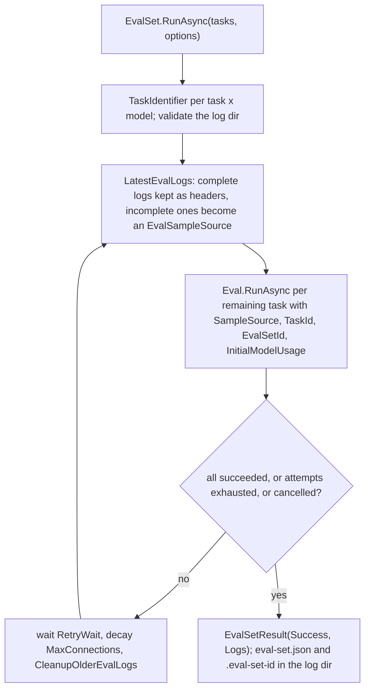
```mermaid
flowchart TD
    A["EvalSet.RunAsync(tasks, options)"] --> B["TaskIdentifier per task x model; validate the log dir"]
    B --> C["LatestEvalLogs: complete logs kept as headers, incomplete ones become an EvalSampleSource"]
    C --> D["Eval.RunAsync per remaining task with SampleSource, TaskId, EvalSetId, InitialModelUsage"]
    D --> E{"all succeeded, or attempts exhausted, or cancelled?"}
    E -->|"no"| F["wait RetryWait, decay MaxConnections, CleanupOlderEvalLogs"]
    F --> C
    E -->|"yes"| G["EvalSetResult(Success, Logs); eval-set.json and .eval-set-id in the log dir"]
```

Deviations: there is no task registry, so in-memory identifiers carry no `file@` prefix or solver steps (tasks differing only by solver must differ in name, `TaskArgs`, `Version` or config) and `EvalRetry` takes the tasks explicitly; reducers are always applied; logs are read whole (a crashed `started` log is re-run, not recovered); a configuration exception stops the set. Port note: `docs/ports/eval-set.md`.

## 5. Layer 3: the SWE agents

> **In plain English:** Two ready-made AI software engineer personalities. One is a simple loop rebuilt here in C#: the AI runs shell commands until it says it is done. The other is the real Claude Code app, installed inside the sandbox and pointed at the bridge.

`InspectAzureAI.Swe` supplies two agents as `AgentDef` factories. Both begin with `SampleContext.Require()`, so they only run inside a sample scope, support multiple attempts scored through the ambient scorer, and return an `AgentState` carrying the full trajectory even after a failure.

### 5.1 mini-swe-agent, natively

> **In plain English:** The AI gets exactly one tool: run a shell command. It looks around, edits files, runs tests, and when it is finished it prints a magic phrase to say it is done. If it asks for something in the wrong shape, the mistake is shown back to it; three mistakes in a row and the run stops.

`MiniSwe.Agent` runs the mini-swe-agent bash loop in C# against the sample's `Model` and sandbox; no Python is needed inside the image. The templates from `mini.yaml` are reproduced verbatim, and `TemplateRenderer` implements just the Jinja subset they need.

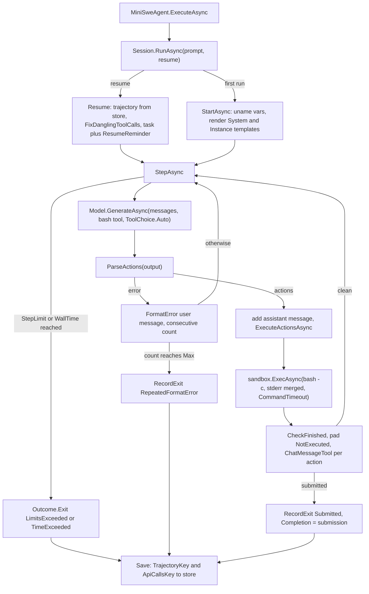
```mermaid
flowchart TD
    A["MiniSweAgent.ExecuteAsync"] --> B["Session.RunAsync(prompt, resume)"]
    B -->|resume| C["Resume: trajectory from store, FixDanglingToolCalls, task plus ResumeReminder"]
    B -->|first run| D["StartAsync: uname vars, render System and Instance templates"]
    C --> E["StepAsync"]
    D --> E
    E -->|StepLimit or WallTime reached| X["Outcome.Exit LimitsExceeded or TimeExceeded"]
    E --> F["Model.GenerateAsync(messages, bash tool, ToolChoice.Auto)"]
    F --> G["ParseActions(output)"]
    G -->|error| H["FormatError user message, consecutive count"]
    H -->|count reaches Max| Y["RecordExit RepeatedFormatError"]
    H -->|otherwise| E
    G -->|actions| I["add assistant message, ExecuteActionsAsync"]
    I --> J["sandbox.ExecAsync(bash -c, stderr merged, CommandTimeout)"]
    J --> K["CheckFinished, pad NotExecuted, ChatMessageTool per action"]
    K -->|submitted| Z["RecordExit Submitted, Completion = submission"]
    K -->|clean| E
    X --> S["Save: TrajectoryKey and ApiCallsKey to store"]
    Y --> S
    Z --> S
```

*`src/InspectAzureAI.Swe/MiniSwe/MiniSweAgent.cs`, lines 430-456*

```csharp
        private async Task<Outcome> StepAsync(CancellationToken cancellationToken)
        {
            if (0 < _options.StepLimit && _options.StepLimit <= _nCalls)
            {
                return Outcome.Exit("LimitsExceeded");
            }

            // ...

            _nCalls++;
            var output = await _model.GenerateAsync(_messages.ToArray(), Tools, ToolChoice.Auto, cancellationToken: cancellationToken).ConfigureAwait(false);
            _output = output;

            // Upstream raises FormatError before the assistant message is added, so only the format error
            // message enters the trajectory (the response itself lives in the model event).
            var (actions, error) = ParseActions(output);
            if (error is not null)
            {
                return Outcome.FormatError(error);
            }

            _messages.Add(output.Message);
            return await ExecuteActionsAsync(actions, cancellationToken).ConfigureAwait(false);
        }
```

Each step offers a single `bash` tool. A response with no tool call, a parse error, a different function or a missing `command` argument produces a format-error user message, and the malformed assistant message is never appended; three consecutive format errors end the run. Otherwise each command runs as an observation, never as an exception:

*`src/InspectAzureAI.Swe/MiniSwe/MiniSweAgent.cs`, lines 490-513*

```csharp
            CommandObservation observation;
            try
            {
                var result = await _sandbox.ExecAsync(
                    ["bash", "-c", "exec 2>&1\n" + command],
                    cwd: _cwd,
                    env: _env,
                    user: _options.User,
                    timeout: _options.CommandTimeout,
                    cancellationToken: cancellationToken).ConfigureAwait(false);
                observation = new CommandObservation(result.Stdout + result.Stderr, result.ReturnCode, "");
            }
            catch (SandboxTimeoutException ex)
            {
                var seconds = _options.CommandTimeout.TotalSeconds.ToString("R", CultureInfo.InvariantCulture);
                observation = new CommandObservation(
                    ex.TruncatedOutput,
                    -1,
                    $"An error occurred while executing the command: Command '{command}' timed out after {seconds} seconds");
            }
            catch (Exception ex) when (ex is not OperationCanceledException)
            {
                observation = new CommandObservation("", -1, $"An error occurred while executing the command: {ex.Message}");
            }
```

The run ends when an observation's first non-blank line is exactly `COMPLETE_TASK_AND_SUBMIT_FINAL_OUTPUT` with exit code 0; the rest of the output is the submission and replaces the last output's completion. The trajectory and call count are saved to the sample store, which is also where a resumed attempt reloads them from.

### 5.2 The Claude Code agent

> **In plain English:** This one downloads the Claude Code program into the sandbox, points it at the bridge instead of the internet, launches it, and reads its output. From the exit code it works out whether Claude finished, refused, or crashed, and it can relaunch after a crash. What it hands back is the conversation the bridge saw, not Claude's own summary.

`ClaudeCode.Agent` installs and launches the Claude Code CLI inside the sandbox and serves the sample model to it through the bridge. One `ClaudeCodeAgent` (one session id, one binary cache) is shared by every execution.

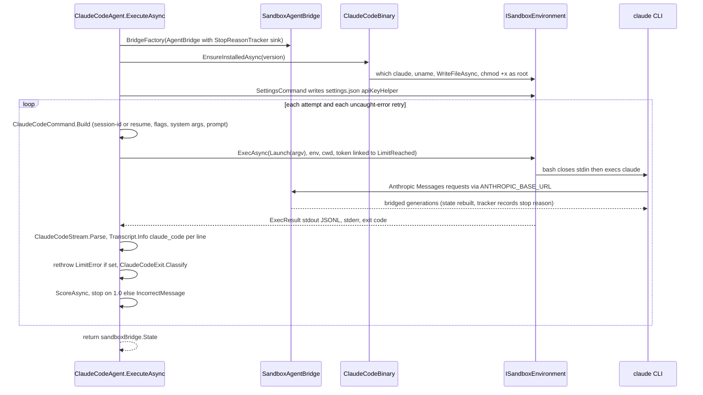
```mermaid
sequenceDiagram
    participant A as ClaudeCodeAgent.ExecuteAsync
    participant BR as SandboxAgentBridge
    participant BIN as ClaudeCodeBinary
    participant SB as ISandboxEnvironment
    participant CLI as claude CLI
    A->>BR: BridgeFactory(AgentBridge with StopReasonTracker sink)
    A->>BIN: EnsureInstalledAsync(version)
    BIN->>SB: which claude, uname, WriteFileAsync, chmod +x as root
    A->>SB: SettingsCommand writes settings.json apiKeyHelper
    loop each attempt and each uncaught-error retry
        A->>A: ClaudeCodeCommand.Build (session-id or resume, flags, system args, prompt)
        A->>SB: ExecAsync(Launch(argv), env, cwd, token linked to LimitReached)
        SB->>CLI: bash closes stdin then execs claude
        CLI->>BR: Anthropic Messages requests via ANTHROPIC_BASE_URL
        BR-->>CLI: bridged generations (state rebuilt, tracker records stop reason)
        SB-->>A: ExecResult stdout JSONL, stderr, exit code
        A->>A: ClaudeCodeStream.Parse, Transcript.Info claude_code per line
        A->>A: rethrow LimitError if set, ClaudeCodeExit.Classify
        A->>A: ScoreAsync, stop on 1.0 else IncorrectMessage
    end
    A-->>A: return sandboxBridge.State
```

The pieces, in the order they run:

1. **Models and bridge.** `ClaudeCodeModels.Resolve` derives the presented (cosmetic) model name, the served `Model` with `--reasoning-effort` merged host-side, and the alias map. An `AgentBridge` is built with a `ClaudeCodeStopReasonTracker` as its event sink, and the bridge server starts through `BridgeFactory` (tests substitute a fake).
2. **Binary.** `ClaudeCodeBinary.EnsureInstalledAsync` uses an existing `claude` on the image's PATH, or resolves the version (stable/latest pointer, manifest SHA-256), serves a checksum-verified host cache file or downloads with retries against a 1 GiB cap, writes it into the sandbox and `chmod +x` as root.
3. **Environment and auth.** `ClaudeCodeEnv.Build` sets `ANTHROPIC_BASE_URL` and `ANTHROPIC_AUTH_TOKEN` to the bridge, every model role variable to the presented name, and switches off nonessential traffic, MCP and auto-memory. Because the CLI ignores the auth token variable and would enter OAuth, `$HOME/.claude/settings.json` is seeded with an `apiKeyHelper` that echoes the token.
4. **Launch.** Each attempt rebuilds the argv (`--session-id` first, `--resume` afterwards; `--print --output-format stream-json --verbose`; `--append-system-prompt` only on a non-resume launch), resets the tracker, and runs the CLI through a bash wrapper that closes stdin, with no timeout and under a token linked to the bridge's `LimitReached`.
5. **Outcome.** The finished exec is framed by `ClaudeCodeStream.Parse` into JSONL events (each recorded on the transcript), stderr and exit. A limit hit by a bridged generation takes precedence over the exit code; otherwise `ClaudeCodeExit.Classify` decides.

*`src/InspectAzureAI.Swe/ClaudeCode/ClaudeCodeAgent.cs`, lines 131-194 (elided)*

```csharp
                var isResume = hasAssistantResponse || attemptCount > 0 || uncaughtErrorCount > 0;
                var systemTexts = ClaudeCodeCommand.SystemTexts(sandboxBridge.State.Messages, Options.SystemPrompt);
                var systemArgs = ClaudeCodeCommand.SystemPromptArgs(systemTexts, Options.ReplaceSystemPrompt, isResume);
                var agentCmd = ClaudeCodeCommand.Build(claudeBinary, SessionId, isResume, flags, systemArgs, agentPrompt);

                tracker.Reset();
                var result = await LaunchAsync(sandbox, sandboxBridge, agentCmd, agentCwd, agentEnv, cancellationToken).ConfigureAwait(false);
                // ...
                // The CLI exits however it likes once its generation was refused; the limit is the outcome.
                if (sandboxBridge.LimitError is { } limit)
                {
                    ExceptionDispatchInfo.Capture(limit).Throw();
                }

                var kind = ClaudeCodeExit.Classify(exitCode, stderrData, tracker.LastStopReason, Options.RetryUncaughtErrors, uncaughtErrorCount);
                if (kind == ClaudeCodeExitKind.RetryUncaughtError)
                {
                    uncaughtErrorCount++;
                    continue;
                }

                if (kind == ClaudeCodeExitKind.Failure)
                {
                    throw new InvalidOperationException(ClaudeCodeExit.ErrorMessage(exitCode, stderrData));
                }
```

*`src/InspectAzureAI.Swe/ClaudeCode/ClaudeCodeExit.cs`, lines 37-56*

```csharp
    public static ClaudeCodeExitKind Classify(int exitCode, string stderr, StopReason? lastStopReason, int? retryUncaughtErrors, int uncaughtErrorCount)
    {
        ArgumentNullException.ThrowIfNull(stderr);
        if (exitCode == 0)
        {
            return ClaudeCodeExitKind.Success;
        }

        if (IsRefusalExit(exitCode, stderr, lastStopReason))
        {
            return ClaudeCodeExitKind.Refusal;
        }

        if (exitCode == 1 && stderr.Trim().Length == 0 && retryUncaughtErrors is { } retries && uncaughtErrorCount < retries)
        {
            return ClaudeCodeExitKind.RetryUncaughtError;
        }

        return ClaudeCodeExitKind.Failure;
    }
```

An exit 1 with silent stderr after a `ContentFilter` stop is an Anthropic refusal, treated as success because the refusal text is already in the bridge state and scorable; the same exit without a refusal is an uncaught CLI exception and is retried while budget remains. The sandbox API has no streaming exec, so the JSONL is parsed after the fact; because exec output keeps the tail, a very long session may lose its first lines, and a parse error as the first stdout event records a warning naming the output cap.

## 6. Layer 4: the console apps

> **In plain English:** The apps are what you actually type at the command line. They glue the layers together and turn flags like --task and --agent into real objects.

### 6.1 SweShowcase

> **In plain English:** A demo with three coding exams: write a hello program, fix failing tests, and answer questions about the machine. You choose an exam and an AI agent and it runs. There is a fake mode with a scripted pretend AI so you can try it with no cloud account at all.

`InspectAzureAI.SweShowcase` composes Provider, Eval and Swe into a runnable demo with three commands: `list` the built-in tasks and agents, `run` one task with one agent against a Foundry deployment (or an offline scripted model), and `show` a log.

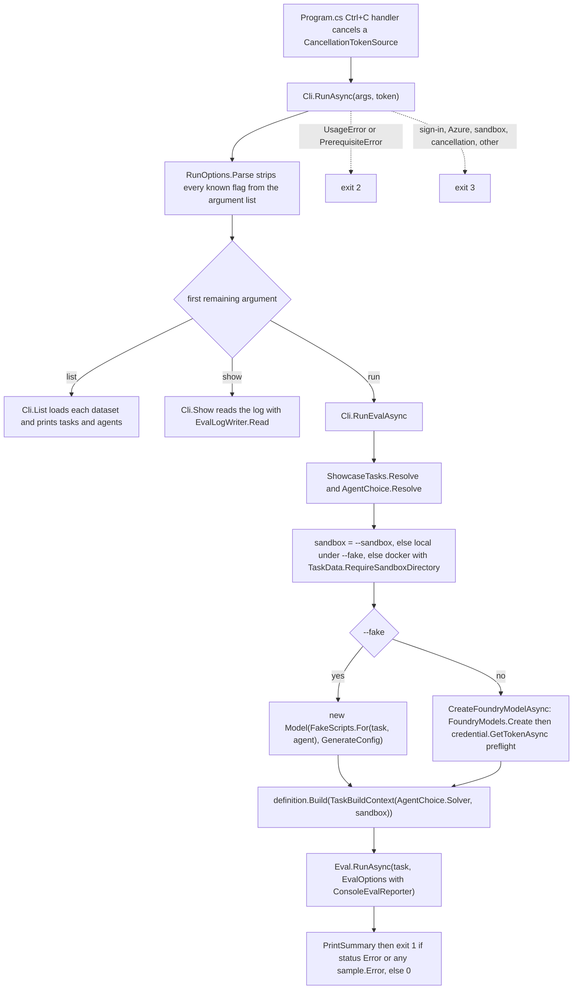
```mermaid
flowchart TD
    P["Program.cs Ctrl+C handler cancels a CancellationTokenSource"] --> R["Cli.RunAsync(args, token)"]
    R --> O["RunOptions.Parse strips every known flag from the argument list"]
    O --> C{"first remaining argument"}
    C -->|list| L["Cli.List loads each dataset and prints tasks and agents"]
    C -->|show| S["Cli.Show reads the log with EvalLogWriter.Read"]
    C -->|run| E["Cli.RunEvalAsync"]
    E --> T["ShowcaseTasks.Resolve and AgentChoice.Resolve"]
    T --> SB["sandbox = --sandbox, else local under --fake, else docker with TaskData.RequireSandboxDirectory"]
    SB --> M{"--fake"}
    M -->|yes| F["new Model(FakeScripts.For(task, agent), GenerateConfig)"]
    M -->|no| G["CreateFoundryModelAsync: FoundryModels.Create then credential.GetTokenAsync preflight"]
    F --> B["definition.Build(TaskBuildContext(AgentChoice.Solver, sandbox))"]
    G --> B
    B --> EV["Eval.RunAsync(task, EvalOptions with ConsoleEvalReporter)"]
    EV --> PS["PrintSummary then exit 1 if status Error or any sample.Error, else 0"]
    R -.->|UsageError or PrerequisiteError| X2["exit 2"]
    R -.->|sign-in, Azure, sandbox, cancellation, other| X3["exit 3"]
```

*`src/InspectAzureAI.SweShowcase/Cli.cs`, lines 284-291 and 311-317*

```csharp
        var definition = ShowcaseTasks.Resolve(options.Task);
        var agent = AgentChoice.Resolve(options.Agent);
        var sandboxType = options.Sandbox ?? (options.Fake ? "local" : "docker");
        var sandbox = sandboxType == "docker" ? new SandboxSpec("docker", TaskData.RequireSandboxDirectory()) : new SandboxSpec("local");
        var model = options.Fake
            ? new Model(FakeScripts.For(definition.Name, agent), options.GenerateConfig)
            : await CreateFoundryModelAsync(options, cancellationToken);
        var task = definition.Build(new TaskBuildContext(AgentChoice.Solver(agent, options.Attempts, options.Debug), sandbox));
        // ...
        var log = await Eval.RunAsync(task, evalOptions, cancellationToken);

        Console.WriteLine();
        PrintSummary(log);
        Console.WriteLine($"show it with: swe-showcase show {log.Location}");
        var errored = log.Status == EvalStatus.Error || (log.Samples?.Any(sample => sample.Error is not null) ?? false);
        return errored ? 1 : 0;
```

This is the whole composition of a run: registry lookups, the sandbox default that flips to local under `--fake`, the model branch, and the task factory. Before any sample runs, `CreateFoundryModelAsync` acquires a token once so a sign-in problem becomes a single exit-3 message rather than an error on every sample. Every built-in task sets `FailOnError = false`, a 200-message limit and a 20-minute time limit, so a broken sample is recorded and scored in whatever state it reached, and the failure is surfaced only through exit code 1 computed from the log.

*`src/InspectAzureAI.SweShowcase/AgentChoice.cs`, lines 38-44*

```csharp
    public static Solver Solver(string agent, int attempts, bool debug) => agent switch
    {
        MiniSweName => Agents.AsSolver(MiniSwe.Agent(new MiniSweAgentOptions { Attempts = new AgentAttempts(attempts) })),
        ClaudeCodeName => Agents.AsSolver(ClaudeCode.Agent(new ClaudeCodeOptions { Attempts = new AgentAttempts(attempts), Debug = debug })),
        BasicName => Solvers.BasicAgent(tools: [SandboxTools.Bash(BashTimeout)], maxAttempts: attempts),
        _ => throw new UsageError($"--agent expects {string.Join("|", Names)}, got '{agent}'"),
    };
```

| Task | Samples | Scorer | What it exercises |
|---|---|---|---|
| `hello-swe` | 3: write `hello.py`, add `--reverse` to `words.py`, fix an off-by-one in `stats.py` | `exec_check`: runs `metadata.check` in the sandbox; exit 0 is C | File editing and a shell check |
| `pytest-fix` | 2: `textkit.slugify`, `mathkit.is_prime`, each with a failing pytest suite | `exec_check` running `python3 -m pytest -q` | Test-driven fixes |
| `system-explorer` | 2 questions: the Python version, the CPU core count | `model_graded_qa`, so the task model is its own judge | Exploration and model grading |

Task data (`tasks/<name>/dataset.json` plus files) and the sandbox `Dockerfile` ship inside the project and are copied next to the executable at build time; a missing file is a `PrerequisiteError`.

*`src/InspectAzureAI.SweShowcase/BuiltinTasks/ExecCheckScorer.cs`, lines 23-52*

```csharp
        return Scorers.Custom(Name, async (state, _, cancellationToken) =>
        {
            var check = state.Metadata.TryGetValue(MetadataKey, out var value) && value is string command && command.Length > 0
                ? command
                : throw new InvalidOperationException($"Sample {state.SampleId} has no '{MetadataKey}' command in its metadata.");
            var metadata = new Dictionary<string, object?>(StringComparer.Ordinal) { [MetadataKey] = check };
            ExecResult result;
            try
            {
                result = await SampleContext.Require().Sandbox().ExecAsync(["bash", "-c", check], timeout: limit, cancellationToken: cancellationToken);
            }
            catch (SandboxTimeoutException ex)
            {
                // ... returns new Score(ScoreConstants.Incorrect) with a "Check timed out" explanation
            }
            metadata["returncode"] = result.ReturnCode;
            var output = Output(result);
            return new Score(result.Success ? ScoreConstants.Correct : ScoreConstants.Incorrect)
            {
                Answer = state.Output.Completion,
                Explanation = output.Length > 0 ? output : $"exit code {result.ReturnCode}",
                Metadata = metadata,
            };
        }, Metrics.Accuracy(), Metrics.Stderr());
```

**Fake mode.** `--fake` replaces only the model and flips the sandbox default to local; commands still run in a real temp directory on the host. `FakeScripts.For` builds a `ScriptedModelApi` whose turns are all the same conversation-driven factory: it recomputes its position from the number of assistant messages instead of a queue index, which keeps the script deterministic when several samples run concurrently through one api. It solves sample 1 of each task in the tool-call shape of the chosen agent, gives up on other samples, and answers judge prompts with `GRADE: C` or `GRADE: I`. Claude Code is refused under `--fake` because the CLI needs a real sandbox and bridge.

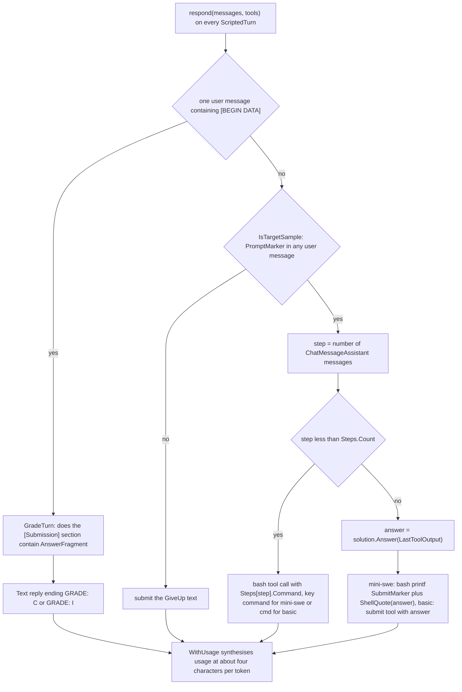
```mermaid
flowchart TD
    A["respond(messages, tools) on every ScriptedTurn"] --> B{"one user message containing [BEGIN DATA]"}
    B -->|yes| C["GradeTurn: does the [Submission] section contain AnswerFragment"]
    C --> D["Text reply ending GRADE: C or GRADE: I"]
    B -->|no| E{"IsTargetSample: PromptMarker in any user message"}
    E -->|no| F["submit the GiveUp text"]
    E -->|yes| G["step = number of ChatMessageAssistant messages"]
    G --> H{"step less than Steps.Count"}
    H -->|yes| I["bash tool call with Steps[step].Command, key command for mini-swe or cmd for basic"]
    H -->|no| J["answer = solution.Answer(LastToolOutput)"]
    J --> K["mini-swe: bash printf SubmitMarker plus ShellQuote(answer), basic: submit tool with answer"]
    D --> L["WithUsage synthesises usage at about four characters per token"]
    F --> L
    I --> L
    K --> L
```

**The ported subsystems in `run`.** `--log-format eval|json`, `--approval <policy.json|approver>`, `--cache <expiry|off>`, `--compaction edit|summary|trim|auto[:threshold]`, `--hooks sample-log[=file]`, `--cost-limit` and `--model-cost-config` are parsed by `RunOptions` (validated up front as usage errors) and wired by `RunWiring` into `EvalOptions`, so they reach the agents exactly as `eval(approval=)`, `generate(cache=)`, `react(compaction=)` and `@hooks` would: approval is installed ambiently by the runner (4.20) and consulted by the basic agent's executor, the mini-swe loop and the Claude Code bridge; the cache policy is passed to every generate (4.10); compaction is the `CompactionHook` seam (4.13), refused for Claude Code because the CLI compacts its own context; `sample-log` is a `Hooks` subclass registered per run (4.21). `show` reads either format through `EvalLogFiles.ReadEvalLog` and prints the recorded approval config, per-sample cost, cache hits, approvals by decision and compactions. `docs/ports/showcase-wiring.md` records the wiring and why mini-swe keeps its own loop rather than `Agents.React`.

### 6.2 ModelMatrix

> **In plain English:** Runs the same exam on every model deployed on your account and prints a comparison table. Run it again into the same folder and it picks up where it left off.

`InspectAzureAI.ModelMatrix` is a thin runner over the showcase: it discovers every deployment on the Foundry resource behind `AZUREAI_BASE_URL` through `FoundryCatalog`, selects rows (`--only`, `--exclude`, ARM format filters, a skip reason for failed or non-chat deployments; OpenAI-format deployments with `chatCompletion: false` such as gpt-5.4-pro, and the auto-routed gpt-5.6 / `-pro` / `codex` / o-series names, go through the Responses route instead of being skipped), and runs the chosen showcase task and agent (Claude Code by default) against each deployment, with bounded parallelism. Each deployment runs as its own eval set (4.28) in `<log-dir>/<deployment>/` (`EvalSet.RunAsync([task], ...)` with `MaxTasks = 1`, `LogDirAllowDirty = true` and `--retry-attempts` immediate retries, default 2), so a second run into the same directory resumes and reuses finished samples. Each deployment yields an eval log and one `MatrixRow` (score, accuracy, tokens, seconds, cost, tokens per second, reused samples, error or skip reason); the run ends with a console table, a JSON summary and an optional Markdown table. Hooks lines are prefixed with the deployment, and a `sample-log=FILE` destination is opened once per matrix run and shared by every deployment. It reuses the showcase's internals (`RunOptions.Parse`, `ShowcaseTasks`, `AgentChoice`, `FakeScripts`) through `InternalsVisibleTo`, and its exit codes follow the showcase. A deployment that fails is recorded, not fatal; only a sign-in failure or cancellation stops the matrix.

### 6.3 End to end: a showcase run

> **In plain English:** The complete story of one exam run, from typing the command to the report file, for both kinds of agent.

```mermaid
sequenceDiagram
    participant CLI as Cli.RunEvalAsync
    participant EV as Eval.RunAsync
    participant SR as SampleRunner
    participant SB as Sandbox (Docker or Local)
    participant AG as Agent (MiniSwe or ClaudeCode)
    participant CC as Claude Code CLI (inside sandbox)
    participant BR as SandboxAgentBridge and AgentBridge
    participant MD as Eval Model wrapper
    participant PV as Provider (Foundry api or ScriptedModelApi)

    CLI->>CLI: RunOptions.Parse, ShowcaseTasks.Resolve, AgentChoice.Resolve
    alt --fake
        CLI->>MD: new Model(FakeScripts.For(task, agent)), sandbox defaults to local
    else Foundry
        CLI->>MD: FoundryModels.Create and credential preflight
    end
    CLI->>EV: RunAsync(EvalTask, EvalOptions)
    EV->>SB: TaskInitAsync (docker builds sandbox/Dockerfile once)
    loop every sample and epoch, MaxSamples in flight
        EV->>SR: RunAsync(sample, spec, epoch)
        SR->>SB: SampleInitAsync then WriteFileAsync(sample files)
        SR->>SR: SampleContext.Begin with Store, Transcript, Limits, Scorer
        SR->>AG: Agents.AsSolver runs agent.Execute(AgentState)
        alt mini-swe agent
            loop until submit marker, format-error cap, step or sample limit
                AG->>MD: GenerateAsync(messages, bash tool, auto)
                MD->>PV: Api.GenerateAsync with retry loop and ModelEvent
                PV-->>MD: GenerateResult
                MD-->>AG: ModelOutput
                AG->>SB: ExecAsync(bash -c command, cwd, env, 30s timeout)
                SB-->>AG: ExecResult rendered as JSON observation tool message
            end
        else claude-code agent
            AG->>BR: SandboxAgentBridge.StartAsync(AgentBridge, sandbox)
            AG->>SB: EnsureInstalledAsync(claude), write settings.json
            AG->>SB: ExecAsync(claude --print --output-format stream-json -- prompt)
            SB->>CC: process starts with ANTHROPIC_BASE_URL and auth token
            loop every CLI turn
                CC->>BR: POST /v1/messages with x-api-key
                BR->>MD: AgentBridge.GenerateAsync then Model.GenerateAsync
                MD->>PV: Api.GenerateAsync
                PV-->>MD: GenerateResult
                MD-->>BR: ModelOutput, TrackState updates AgentState
                BR-->>CC: Messages JSON or synthesized SSE events
            end
            CC-->>SB: JSONL stdout and exit code
            SB-->>AG: ExecResult parsed by ClaudeCodeStream, exit classified
        end
        AG-->>SR: AgentState copied onto TaskState
        SR->>SB: ExecCheckScorer runs bash -c metadata.check
        SB-->>SR: exit code becomes Score C or I
        SR->>SB: Cleanup(cleanup flag)
        SR-->>EV: SampleResult with EvalSample
    end
    EV->>EV: BuildScores, AggregateUsage, EvalLogWriter.Write
    EV-->>CLI: EvalLog
    CLI->>CLI: PrintSummary and exit code
```

What the log captures for such a run: per sample, the messages, output, scores, metadata, the store snapshot (mini-swe's exit status, submission, trajectory and call count; Claude Code's stdout and stderr under `--debug`), the transcript events (init, solvers, agent and scorer spans, one `ModelEvent` per generation attempt with its `ModelCall`, an info event per mini-swe command or Claude Code JSONL line, score and error events) and model usage per model. `Eval.RunAsync` writes the log even on cancellation.

### 6.4 The Sample CLI and the scripts

> **In plain English:** The simplest app: ask a model a question, watch it stream, try a tool, check your login, list your models, and smoke-test every deployment. Its recordings of the raw network traffic feed the dashboard and the README table.

`InspectAzureAI.Sample` is the provider-only front end. It references the Provider and, for its three engine demos (`cache`, `cost` and `structured`: two generations under a `CachePolicy`, one priced generation, and a `ResponseSchema` from `JsonSchemaOf<T>` parsed back), the Eval library; nothing references it but its tests. Its top-level statements strip options into static properties on `Cli`, then dispatch on the command.

```mermaid
flowchart TD
  A["dotnet run -- command options"] --> B["top-level statements strip options with TakeOption into Cli statics"]
  B --> C{"arguments[0]"}
  C -->|"chat stream tools image"| D["Cli.CreateModelApi(route, model, streaming, fake)"]
  C -->|"config naming token retry-demo models test-all capture params"| E["Cli.CreateApi(model, streaming, fake)"]
  D -->|"--route anthropic"| F["AnthropicFoundryModelApi"]
  D -->|"--route responses"| F2["OpenAIResponsesModelApi"]
  D -->|"default route"| E
  E -->|"--fake"| G["AzureAIModelApi with FakeAzure.Transport and FakeAzure.Credential"]
  E -->|"live"| H["AzureAIModelApi with DefaultAzureCredential"]
  F --> I["Cli.Chat Stream ToolLoop Image"]
  F2 --> I
  G --> I
  H --> I
  I --> J["api.GenerateAsync(input, tools, ToolChoice.Auto, DefaultConfig(api), OnStream?)"]
  J --> K["Cli.Report prints ModelCall request and response, output, reasoning, tool calls, usage"]
  H --> L["Cli.Models TestAll Capture Params"]
  L --> M["FoundryCatalog.DiscoverAsync(endpoint) then CreateCapturedTarget per deployment"]
  K --> O["catch chain maps to exit code 0 1 2 3"]
  M --> O
```

| Command group | Commands | What they do |
|---|---|---|
| Generate | `chat`, `stream`, `tools`, `image` | One generate call (a five-turn loop for `tools` with a canned weather tool), then `Report` prints the `ModelCall` request and response, completion, reasoning, tool calls and usage. |
| Diagnose (no network) | `config`, `naming`, `retry-demo`, `token` | Resolved endpoint and credential, name-derived rules for a list of models, `ShouldRetry` classifications for canned failures, and the decoded Entra token. |
| Fleet | `models`, `test-all`, `capture`, `params` | Discover deployments through ARM, then smoke-test each (chat, stream, tools, reasoning), record every HTTP exchange, or probe which parameters each accepts. |

*`src/InspectAzureAI.Sample/Program.cs`, lines 287-306*

```csharp
        public static AzureAIModelApi CreateApi(string? model, string? streaming, bool fake)
        {
            model ??= Environment.GetEnvironmentVariable("INSPECT_AZUREAI_MODEL") ?? "gpt-5.4-mini";
            try
            {
                if (fake)
                {
                    // Offline: a canned transport and a dummy token, so no sign-in is attempted.
                    return new AzureAIModelApi(model, "https://fake.local/models", streaming: streaming, modelArgs: ExtraModelArgs,
                        settings: new AzureAIClientSettings { Transport = FakeAzure.Transport(), TokenCredential = FakeAzure.Credential });
                }

                return new AzureAIModelApi(model, streaming: streaming, modelArgs: ExtraModelArgs);
            }
            catch (ArgumentException ex)
            {
                // NormalizeStreamArg rejects anything but auto/true/false with the Python message.
                throw new UsageError($"--streaming: {ex.Message}");
            }
        }
```

The fleet commands build one fresh provider per deployment (and per probe), chosen by the ARM `Format`, with wire capture injected: an `HttpCapturePolicy` at `PerRetry` on the SDK pipeline (so the recorded request already carries the bearer header, redacted to its length, and there is one exchange per SDK retry) or an `HttpCaptureHandler` on the Anthropic route's `HttpClient`. Streamed bodies are tee'd while the provider consumes them.

*`src/InspectAzureAI.Sample/Program.cs`, lines 610-630*

```csharp
        private static CapturedTarget CreateCapturedTarget(AzureAIModelApi api, AzureAIClientSettings shared, FoundryDeployment deployment, bool anthropic, IReadOnlyDictionary<string, object?> args)
        {
            if (anthropic)
            {
                var handler = new HttpCaptureHandler();
                var claude = new AnthropicFoundryModelApi(deployment.Name, AnthropicFoundryModelApi.DeriveBaseUrl(api.EndpointUrl), streaming: api.Streaming, modelArgs: args, settings: shared, handler: handler);
                return new CapturedTarget(claude, handler.Exchanges, handler);
            }

            var capture = new HttpCapturePolicy();
            var settings = shared with
            {
                ConfigureClientOptions = options =>
                {
                    shared.ConfigureClientOptions?.Invoke(options);
                    options.AddPolicy(capture, HttpPipelinePosition.PerRetry);   // after the bearer-token policy, before the transport
                },
            };
            var modelArgs = new Dictionary<string, object?>(args) { ["model_format"] = deployment.Format };   // ARM's vendor string picks the reasoning mapping
            return new CapturedTarget(new AzureAIModelApi(deployment.Name, api.EndpointUrl, streaming: api.Streaming, modelArgs: modelArgs, settings: settings), capture.Exchanges, null);
        }
```

One compensation is worth knowing: some reasoning deployments (MAI-Thinking-1) reject `max_tokens` with an error naming `max_completion_tokens`, and Python's name rule does not know them. `test-all`, `capture` and `params` each detect that text, flip the `max_completion_tokens` model arg, rebuild the provider (model args are constructor state) and rerun once, recording a note so the table tells the user which flag to pass.

The three scripts wrap these commands: `scripts/test-all-models.sh` reads the endpoint and resource id from the Azure CLI and execs `test-all` over the succeeded deployments; `scripts/build-dashboard.py` embeds a `capture` report into `docs/dashboard/index.html` after refusing any report with an unredacted credential header; `scripts/build-readme-matrix.py` regenerates the README's "Parameters by model" table between its markers from the same report.

### 6.5 The `inspectai` command line

> **In plain English:** The port of the `inspect` command you would type in Python: run an exam, run a batch, retry, re-mark, list and convert reports, manage the cache. Exams are found inside compiled .NET libraries instead of Python files.

`InspectAzureAI.Cli` (executable `inspectai`, on System.CommandLine) ports `_cli/`. `InspectCli.Build` assembles the command tree and `RunAsync(args, CliIo, CliServices)` parses, invokes and maps exceptions to exit codes; the tests drive it in-process with captured output, a `scripted/*` provider over `ScriptedModelApi` and real `.eval` and `.json` logs, with argument-parsing reference values computed by the venv's `parse_cli_args`.

```mermaid
flowchart TD
    A["inspectai eval hello --assembly MyEvals.dll --model azureai/gpt-5.4-mini -T count=5 --cache 1W"] --> B["InspectCli.RunAsync: parse, --version, usage errors exit 2"]
    B --> C["EvalCommands: EvalOptionSet binds every eval_options flag"]
    C --> D["TaskRegistry.Discover over loaded assemblies plus --assembly; Resolve name or assembly@name"]
    D --> E["TaskRegistry.Create binds -T args to the [Task] method's parameters"]
    C --> F["Models.Create: direct providers, /azure/ Foundry, bare deployments, custom providers"]
    C --> G["Catalog: --solver, --scorer, --metric, --epochs-reducer by Python name with -S args"]
    E --> H["EvalOptions (limits, cache, approval, hooks, cost, log format)"]
    F --> H
    G --> H
    H --> I["Eval.RunAsync or EvalSet.RunAsync or EvalRetry.RunAsync"]
    I --> J["ResultsPrinter; exit 0, or 1 when the log status is not success"]
```

| Command | Ported from | What it does here |
|---|---|---|
| `eval`, `eval-set`, `eval-retry` | `_cli/eval.py` | `EvalOptionSet` binds the options of `eval_options` (limits, `--epochs`, `--fail-on-error`, `--retry-on-error`, `--cache`, `--approval`, `--cost-limit`, `--hooks`, `--log-format`, the `GenerateConfig` fields, `-T` / `-S` / `-M` arguments) onto `EvalOptions`, `EvalSetOptions` and `EvalRetryOptions`. |
| `score` | `_cli/score.py` | Re-scores a `.eval` or `.json` log through `ScoreLogs` (4.26): `--scorer`, `--action append` or `overwrite`, `--output-file`, `--overwrite`. |
| `list tasks` | `_cli/list.py` | `TaskRegistry.Discover` over the loaded assemblies plus the given paths; `-F key=value` attribute filters. |
| `log list`, `dump`, `convert`, `schema` | `_cli/log.py` | The log tools of 4.25 (`LogCommands`, `LogConversion`). |
| `cache list`, `clear`, `prune`, `path` | `_cli/cache.py` | `CacheOps` (4.10). |
| `info version` (plus the hidden `log-file` and `log-schema`, as in Python) | `_cli/info.py` | Version and install path; the embedded `inspect-openapi.json`, which this port's logs conform to. |
| `view` | `_cli/view.py` | Hands its arguments to Python's `inspect view` when `inspect` is on `PATH` (it reads this port's logs), else prints how to install it. |

**Tasks and names.** `[Task]` on a `public static` method returning an `EvalTask` is the `@task` decorator (`Tasks/TaskAttribute.cs`): the name defaults to the snake_case method name, `-T name=value` arguments bind to the method's parameters through `ParameterBinder` with type conversion, and `[Task("name", "light=true")]` carries the attributes `list tasks -F` filters on. A spec is a name or `assembly@name`; assemblies come from `--assembly` or `INSPECT_EVAL_ASSEMBLY`, and with no spec every discovered task runs. Solvers, scorers, metrics and reducers are resolved by their Python names against the built-in `Solvers`, `Scorers`, `Metrics` and `Reducers` factories (`Registry/Catalog.cs`), with `-S` arguments bound the same way; `score` without `--scorer` re-creates the header's scorers likewise. `Models/ModelProviders.cs` delegates to the shared `Models` factory. `openai/<model>` and `anthropic/<model>` call direct services; `openai/azure/<deployment>`, `anthropic/azure/<deployment>`, `azureai/<deployment>` and bare deployments select Foundry. `mockllm/model` selects `MockLlmModelApi`, Python's offline model, and custom registrations remain supported. See [direct providers](direct-providers.md) for the migration guard, raw HTTP protocols, background processing, qualified identities and legacy resume compatibility. `Args/YamlValue.cs` is the PyYAML subset `parse_cli_args` needs.

Deviations: tasks are discovered in assemblies, not `.py` files; `--model a,b` runs the models one after another; options whose subsystems are absent (`--tags`, `--trace`, `--checkpoint`, `--sample-shuffle`, the `--log-*` recorder options and others listed in the note) are not defined, a few are accepted but inert (`--log-level`, `--no-ansi`) and a few refused with exit 2 (`--debug`, `--limit` ranges, the `500k` token-limit form); `--env` keeps the raw value; a log finishing with status `error` exits 1 where Python exits 0 (the section 8 contract); the `acp`, `ctl`, `trace`, `sandbox` and `download` commands are not ported. Port note: `docs/ports/cli.md`.

## 7. Testing strategy

> **In plain English:** Every test runs without the internet. The network, the login and Docker are swapped for stand-ins that record what the code tried to do, so a test can check the exact bytes that would have been sent. Each layer has its own swap point, and where Python can compute the expected value cheaply, the test asks the real Python for it.

Six xunit projects, all offline: no network, no Azure sign-in, and no Docker unless a test is explicitly gated. The reusable doubles live in `src` (`Provider/Testing`, `Eval/Testing`) rather than in the test projects because the `--fake` modes reuse them. The last full run on this branch: 2,363 passed, 23 skipped (gated), 0 failed.

| Layer | Project | Seam | Doubles |
|---|---|---|---|
| Provider | `tests/InspectAzureAI.Tests` (288) | `AzureAIClientSettings` (transport, credential, client options); an injected `HttpMessageHandler` for the Anthropic and Responses routes, which never touch the SDK pipeline | `CannedTransport`, `FakeTokenCredential`, `FakeArmHandler` for `HttpClient` paths, scripted handlers for the two hand-rolled routes |
| Eval | `tests/InspectAzureAI.Eval.Tests` (1,742) | `IModelApi`, `ISandboxEnvironment` (`OnExecCall` scripts a whole exec, stdin included), `IProcessRunner`, `HttpMessageHandler` for the web-search and binary downloads, in-process MCP servers joined by `System.IO.Pipelines` | `ScriptedModelApi` (with `ConnectionLimit` / `Gate` / `PeakConcurrentCalls` for the concurrency tests), `FakeSandboxEnvironment`, the real `LocalSandboxEnvironment`, `ScriptedProcessRunner`, a fake sandbox-tools bucket |
| Swe and showcase | `tests/InspectAzureAI.Swe.Tests` (222) | `ClaudeCodeAgent.BridgeFactory`, `HttpMessageHandler` for the CDN, `Cli.RunAsync` in-process | `FakeBridge`, `FakeCdn`, a scripted sandbox command table, `--fake` |
| CLI | `tests/InspectAzureAI.Cli.Tests` (99) | `InspectCli.RunAsync` with `CliIo` and `CliServices`, a `scripted/*` model provider | captured output, a test assembly of `[Task]` methods, real logs in a temp directory |
| ModelMatrix, Sample | `tests/InspectAzureAI.ModelMatrix.Tests` (29), `tests/InspectAzureAI.Sample.Tests` (6) | options, selection and report; the demo commands | fake deployments; the Sample's fake transport |

```mermaid
flowchart LR
    T["xunit test in InspectAzureAI.Tests"] --> F["Fixtures.Api(model, transport, sdkRetries)"]
    F --> S["AzureAIClientSettings with Transport, TokenCredential, ConfigureClientOptions"]
    S --> A["AzureAIModelApi.GenerateAsync()"]
    A --> C["CreateClientOptions(passThrough)"]
    C --> P["Azure SDK pipeline with bearer and retry policies"]
    P --> K["FakeTokenCredential.GetToken() returns test-token and records Scopes"]
    P --> X["CannedTransport.ProcessAsync()"]
    X --> R["Requests list and LastRequest.BodyJson"]
    X --> D["Responder(CapturedRequest)"]
    D --> J["CannedResponse.Json or Sse or Error, or a thrown exception"]
    J --> A
    A --> G["GenerateResult (Output, Error, Call)"]
    G --> T
    R --> T
```

*`tests/InspectAzureAI.Tests/TestSupport.cs`, lines 89-106*

```csharp
    public static AzureAIModelApi Api(
        string modelName = "test-model",
        object? streaming = null,
        IReadOnlyDictionary<string, object?>? modelArgs = null,
        CannedTransport? transport = null,
        int sdkRetries = 0) =>
        new(modelName, BaseUrl, streaming: streaming, modelArgs: modelArgs,
            settings: new AzureAIClientSettings
            {
                Transport = transport,
                TokenCredential = new FakeTokenCredential(FakeToken),
                ConfigureClientOptions = o =>
                {
                    o.Retry.MaxRetries = sdkRetries;
                    o.Retry.Delay = TimeSpan.Zero;
                    o.Retry.MaxDelay = TimeSpan.Zero;
                },
            });
```

Because `CannedTransport` is a real `HttpPipelineTransport`, the SDK's bearer, retry and pass-through policies all execute before it sees the fully formed request. Tests assert on the exact wire body and headers, and a `Responder` that throws reproduces transport failures the way the SDK would surface them.

*`src/InspectAzureAI.Provider/Testing/CannedTransport.cs`, lines 29-48*

```csharp
    public override async ValueTask ProcessAsync(HttpMessage message)
    {
        var headers = new Dictionary<string, string>(StringComparer.OrdinalIgnoreCase);
        foreach (var header in message.Request.Headers)
        {
            headers[header.Name] = header.Value ?? "";
        }

        string? body = null;
        if (message.Request.Content is not null)
        {
            using var buffer = new MemoryStream();
            await message.Request.Content.WriteToAsync(buffer, message.CancellationToken).ConfigureAwait(false);
            body = Encoding.UTF8.GetString(buffer.ToArray());
        }

        var captured = new CapturedRequest(message.Request.Uri.ToUri(), message.Request.Method.Method, headers, body);
        Requests.Add(captured);
        message.Response = Responder(captured);
    }
```

The Eval and SWE suites sit behind `ScriptedModelApi`, the stand-in for Python's `mockllm`. Each call records the exact input, tools, tool choice and config, then replays the next turn: `Throw` exercises the `Model` retry loop, `Error` returns a terminal `GenerateResult.Error` like an HTTP 400, and `From(factory)` computes the reply from the conversation.

```mermaid
sequenceDiagram
    participant Test as EvalRunnerTests
    participant Eval as Eval.RunAsync
    participant Ctx as SampleContext
    participant Model as Model.GenerateAsync
    participant Api as ScriptedModelApi
    participant Sb as LocalSandbox or FakeSandbox
    Test->>Api: new ScriptedModelApi(ScriptedTurn.Text, ScriptedTurn.ToolCall, ...)
    Test->>Eval: RunAsync(task, EvalOptions with Model(api) and LogDir)
    Eval->>Ctx: Begin(context) per sample (AsyncLocal)
    Eval->>Sb: WriteFileAsync sample files, ExecAsync setup script
    Eval->>Model: solver calls generate
    Model->>Api: GenerateAsync(input, tools, toolChoice, config)
    Api->>Api: record ScriptedRequest, dequeue turn, build ModelCall
    alt turn.Exception
        Api-->>Model: throw (Model retry loop consults ShouldRetry)
    else turn.TerminalError
        Api-->>Model: GenerateResult(null, error, call)
    else Output or Factory
        Api-->>Model: GenerateResult(output, null, call)
    end
    Model-->>Eval: ModelOutput and ModelEvent in the transcript
    Eval-->>Test: EvalLog (Status, Samples, Results) and the JSON log file
    Test->>Api: assert api.Requests and api.Remaining
```

*`tests/InspectAzureAI.Eval.Tests/TestSupport.cs`, lines 88-105*

```csharp
    public SampleContextScope(ScriptedModelApi? api = null, bool withLocalSandbox = false, Limits? limits = null, ISandboxEnvironment? sandbox = null)
    {
        Api = api ?? new ScriptedModelApi();
        Model = new Model(Api);
        SandboxEnvironments? sandboxes = null;
        if (withLocalSandbox)
        {
            Local = new LocalSandboxEnvironment();
            sandboxes = SandboxEnvironments.Single(Local);
        }
        else if (sandbox is not null)
        {
            sandboxes = SandboxEnvironments.Single(sandbox);
        }

        Context = new SampleContext { ActiveModel = Model, Limits = limits ?? new Limits(), Sandboxes = sandboxes };
        _scope = SampleContext.Begin(Context);
    }
```

Tests that call solvers, agents, tools or scorers directly must install a context first; this scope does it with a scripted model and either the real local sandbox or a fake. Runner tests go through `Eval.RunAsync` instead and re-read the JSON log.

**Cross-checking with Python.** Wherever a reference value is cheap to compute, the tests compute it with the inspect_ai venv and assert the C# result matches: metric values (within 1e-9), cost arithmetic (bit-exact), tool schemas and descriptions (byte for byte, from fixture dumps), the `.json` log a Python run writes, `json_changes` operations, `task_identifier`, `HeadersJson`, YAML scalar parsing and `parse_cli_args` results, `auto_id` and `mm3_hash`. Tests that need the interpreter at run time are gated with `[PythonFact]` on `INSPECT_PY` (the venv's python) and skip cleanly without it; `[PythonInteropFact]` covers the round trips where Python reads a log this port wrote. Fixtures live under `tests/InspectAzureAI.Eval.Tests/fixtures/` (Python-written logs, inspect_ai's own legacy and analysis logs, tool dumps, zstandard streams, the model database dump), located relative to the test output directory, so do not pass `--artifacts-path` to `dotnet test`.

**Adding a test.** Pick the project by seam: provider wire behaviour goes in `InspectAzureAI.Tests` with `Fixtures.Api`, a `CannedTransport` responder and assertions on `LastRequest.BodyJson`; model, solver, agent, tool, log or runner behaviour goes in `Eval.Tests` with `ScriptedModelApi` plus `SampleContextScope` or `Eval.RunAsync`, one file per area; mini-swe, Claude Code or the showcase go in `Swe.Tests`; command parsing and end-to-end runs go in `Cli.Tests` through `InspectCli.RunAsync`. Wrap environment changes in `EnvScope.Clean().Set(...)`, call `ProviderLogger.Reset()` before asserting on warnings, reset process-global registries (`Concurrency.Init()`, `Throughput.Init()`, `HookRegistry.Clear()`, `ModelInfoLookup.ClearModelInfoCache()`) where a test touches them, and gate Docker, network, Python or an external MCP server with `[DockerFact]`, `[SandboxToolsDockerFact]`, `[NetworkFact]`, `[PythonFact]`, `[PythonInteropFact]` or `[StdioServerFact]`. Never require Docker, network or Azure credentials in a new test.

> **Why the suites run serially.** All assemblies set `DisableTestParallelization`: the sample context, the streaming observer and the model-event sink are `AsyncLocal` ambient state, `EnvScope` mutates process environment variables, `ProviderLogger` is static, the showcase tests redirect `Console`, and the Claude Code tests bind ports and share a binary cache.

## 8. Cross-cutting reference

> **In plain English:** The cheat sheets: which settings on your machine matter, what the exit codes mean, the invisible in-the-air state, and one table showing what happens with each kind of failure.

### Environment variables

> **In plain English:** These are settings you put in your shell before running anything, like the web address of your models. The program reads them so you do not have to type them every time.

| Variable | Read by | Meaning |
|---|---|---|
| `AZURE_ENDPOINT_URL`, `AZUREAI_ENDPOINT_URL`, `AZUREAI_BASE_URL`, `INSPECT_EVAL_MODEL_BASE_URL` | all three providers | The inference endpoint, in that precedence after an explicit argument. The error message names only `AZUREAI_BASE_URL`. |
| `AZUREAI_AUDIENCE` | `AzureHosting` | Token scope, default `https://cognitiveservices.azure.com/.default`. |
| `AZUREAI_ANTHROPIC_BASE_URL`, `AZURE_ANTHROPIC_BASE_URL` | Anthropic route | Base URL for `/v1/messages`; otherwise derived from the inference endpoint. |
| `AZUREAI_OPENAI_BASE_URL`, `AZURE_OPENAI_BASE_URL` | Responses route | Base URL for `/responses` (the `…/openai/v1` surface, no api-version); otherwise derived from the inference endpoint (`/models` replaced by `/openai/v1`). |
| `AZURE_TENANT_ID`, `AZURE_CLIENT_ID` | `DefaultAzureCredential` | Standard Azure Identity hints. |
| `AZUREAI_RESOURCE_ID`, `AZURE_SUBSCRIPTION_ID` | `FoundryCatalog` | Skip the ARM search for the account behind the endpoint. |
| `INSPECT_AZUREAI_MODEL` | Sample, showcase, matrix | Default deployment name (`gpt-5.4-mini` when unset). |
| `INSPECT_SANDBOX_SETUP_TIMEOUT` | `SandboxSetup` | Setup script timeout in seconds (300). |
| `INSPECT_SANDBOX_MAX_EXEC_OUTPUT_SIZE`, `INSPECT_SANDBOX_MAX_READ_FILE_SIZE` | `SandboxLimits` | Exec output tail (10 MiB) and file read cap (100 MiB); re-read on every call. |
| `ANTHROPIC_BASE_URL`, `ANTHROPIC_AUTH_TOKEN`, `ANTHROPIC_MODEL` and friends | set, not read | Written into the Claude Code CLI's environment inside the sandbox by `ClaudeCodeEnv.Build`. |
| `INSPECT_LOG_DIR`, `INSPECT_LOG_FORMAT` (or `INSPECT_EVAL_LOG_FORMAT`), `INSPECT_EVAL_LOG_FILE_PATTERN` | `EvalOptions`, `LogFileNaming` | Log directory (`logs`), format (`eval`), and the `{created}_{task}_{id}` file-name pattern. |
| `INSPECT_CACHE_DIR` | `CacheOps` | Root of the prompt cache; otherwise the platform cache directory under `inspect_ai`. |
| `INSPECT_AZUREAI_MODEL_COST_CONFIG` | `ModelInfoLookup` | JSON price file applied on the first lookup; a missing or invalid file throws on every lookup. |
| `INSPECT_REQUIRED_HOOKS` | `HookStartup` | Hooks that must be registered before a run (Python's error text). |
| `INSPECT_SANDBOX_TOOLS_BINARIES_DIR`, `INSPECT_SANDBOX_JSON_RPC_RESPONSE_MAX_BYTES` | `SandboxToolsBinary`, `SandboxJsonRpcTransport` | Cache of the downloaded `inspect-sandbox-tools` binaries (`~/.cache/inspect-azureai/sandbox-tools`); the chunked-response threshold. |
| `TAVILY_API_KEY`, `EXA_API_KEY`, `PERPLEXITY_API_KEY` | web-search providers | Read on the first `web_search` call; missing is a `PrerequisiteError` then, not at construction. |
| `INSPECT_VIEW_DIST_DIR`, `INSPECT_VIEW_SCHEMA_PATH` | `ViewerAssets` | The Python package's viewer assets and OpenAPI schema for `LogBundle`. |
| `INSPECT_EVAL_MODEL`, `INSPECT_EVAL_MODEL_BASE_URL`, `INSPECT_EVAL_TASK_ARGS`, `INSPECT_EVAL_SOLVER_ARGS`, `INSPECT_EVAL_MODEL_ARGS` and the other `INSPECT_EVAL_*` option variables | `inspectai` | Python's environment-variable defaults for the `eval` options, same names. |
| `INSPECT_EVAL_ASSEMBLY`, `INSPECT_EVAL_HOOKS`, `INSPECT_EVAL_SET_ID`, `INSPECT_EVAL_RETRY_*` | `inspectai` | This port's additions: assemblies to discover tasks in, hooks to register, the eval-set id, retry settings. |
| `INSPECT_SWE_SKIP_DOCKER`, `INSPECT_SWE_NETWORK_TESTS`, `INSPECT_PY`, `INSPECT_MCP_STDIO_SERVER` | tests | Force-skip Docker tests; opt in to network tests; the venv python for `[PythonFact]` cross-checks; a command line for the stdio MCP round trip. |

### Exit codes

> **In plain English:** When a command finishes it reports a number. Zero means fine, one means the run worked but something was wrong with the answers, two means you typed something wrong or a setting is missing, three means a login, cloud or Docker problem.

The Sample, the showcase, the matrix and `inspectai` share one policy:

| Code | Meaning |
|---|---|
| 0 | Success. |
| 1 | Semantic failure: a terminal generate error, a tool loop that did not converge, any sample with an error, a log whose status is not `success` (`inspectai`, where Python exits 0), any `test-all` chat check not `ok`. |
| 2 | Usage or prerequisite: bad flag, unknown task, model or argument, missing endpoint variable, missing task data or files, a refused option, a cost limit without prices, `--fake` with a command that needs Azure. |
| 3 | Sign-in failure (with the `az login` hint), an Azure request or response failure, a sandbox that is unavailable, cancellation, or any other uncaught failure in `inspectai`. |

### Ambient state

> **In plain English:** The things that get hung in the air rather than passed around, and who puts them there.

| Scope | Installed by | Read by |
|---|---|---|
| `SampleContext` | `SampleRunner` (and `SampleContextScope` in tests) | solvers, tools, scorers, agents, the bridge |
| `Transcript` span id | `Transcript.Span` (which also tracks store changes for its `StoreEvent`) | `Transcript.Add`, to set `parent_id` |
| `ModelStreamObserver` | the `onStream` overload of `GenerateAsync`, `GenerateAttempt` for a stall scope | the stream accumulators, to decide streaming, deliver deltas and bump the idle deadline |
| `ModelEventSinks` | `AgentBridge` per attempt, `ClaudeCodeAgent` | the `Model` wrapper, to publish `ModelEvent`s |
| The limit trees (`TokenLimit`, `MessageLimit`, `TurnLimit`, `TimeLimit`, `WorkingLimit`) | `SampleRunner` at the root, `AgentLimitScope` and `Limit.Apply` beneath | the `Model` wrapper and agents, root first |
| `ToolApproval` | `Eval.RunAsync` from `EvalOptions.Approval` / `EvalTask.Approval`, `AgentBridge` for its own policies | `ToolExecutor`, `Agents.React`, the mini-swe loop, `BridgeApproval` |
| `ModelRoles` | `Eval.RunAsync` from the merged roles | `ModelRoles.GetModel(role)`, model-graded scorers |
| `Concurrency.BeginRequest` (the active controller) | the `Model` wrapper around each generate | `ReportHttpRetry`, so an HTTP retry lands on the right controller |
| `HookContext` | `Eval.RunAsync` and `SampleRunner` | the model-level hook payloads, for the eval and sample ids |
| `SampleModelAccumulators` | `SampleRunner` | the `Model` wrapper, for the per-sample fallback and role-usage rollups |
| `McpServerLocal` session | the first `McpConnection` or tool listing in an async flow | later MCP calls in that flow and its children |

All of them return an `IDisposable` that restores the previous value; dispose them in nesting order.

### The error contract, in one table

> **In plain English:** Every kind of failure and what each layer does with it, in one place.

| Outcome | Provider | `Model` wrapper | Runner |
|---|---|---|---|
| Success | `GenerateResult.Output` | records a `ModelEvent`, adds usage, returns | continues |
| Context-length overflow | `Output` with `StopReason.ModelLength` | as success | continues; `BasicAgent` stops the loop |
| HTTP 400 | `GenerateResult.Error` | `ModelGenerateException`, never retried | sample error (or a limit, see below) |
| 408, 429, 5xx, dropped body | thrown, `ShouldRetry` says retry | waits `RetryAfter` or backoff, retries up to `MaxRetries` | continues |
| 401, 404, connection failure | thrown, `ShouldRetry` says no | rethrown | sample error; the apps map sign-in failures to exit 3 |
| Malformed SSE, empty stream, caller cancellation | escapes unrecorded | rethrown (cancellation is never retried) | sample error or cancelled |
| Message, token, turn, time, working or cost limit | n/a | `LimitExceededException` after usage is added, with `SourceLimit` set; a `SampleLimitEvent` recorded | `EvalSampleLimit`; scoring still runs |
| Stream idle or attempt timeout | n/a | `StreamIdleTimeoutException` / `AttemptTimeoutException`, retried as transient | continues |
| Prompt-cache hit | n/a | no provider call; `ModelEvent.cache = read`; the turn still counts | continues |
| Approval `reject` | n/a | n/a | `ToolCallError("approval")` in the tool message; the sample continues |
| Approval `terminate` | n/a | n/a | `TerminateSampleException` becomes the `operator` sample limit; scoring still runs |
| Sample error under `RetryOnError` | n/a | n/a | re-run from scratch, the error kept in `error_retries`; only the final attempt is logged |
| Sample error under `FailOnError` = never, a fraction or a count | n/a | n/a | the run continues; the policy decides the final status |
| Eval-set pass with failures | n/a | n/a | retried after `RetryWait` with the failed samples re-run and finished ones reused |

### Python lineage

> **In plain English:** Where to look if you want to compare a C# file with the Python it was copied from, and where the copies deliberately differ.

Every C# file cites the Python module it ports in its header comment. The README's "Python to C# mapping" and "Fidelity notes" sections cover the provider, `docs/swe-showcase.md` the SWE agents and the showcase, and `docs/ports/` the eval subsystems: one note per area (indexed with its deviations in `docs/ports/README.md`) listing what was ported from which files, the public C# API, every deviation from Python with its reason, and what was not ported. The README's "Ported from inspect_ai" table maps areas to notes, and its "Intentionally out of scope" list is the union of the notes' "Not ported" sections. `docs/model-parameters.md` records what each verified deployment accepted.

## 9. Where to start reading

> **In plain English:** If you want to read the actual code, this is the order that makes each file easier because you have read the one before it. The last step is a command you can run right now with no cloud account.

A suggested order through the code, each step building on the last:

1. `src/InspectAzureAI.Provider/Core/IModelApi.cs`, `Core/ChatMessage.cs`, `Core/ModelOutput.cs`, `Core/Errors.cs`: the vocabulary.
2. `src/InspectAzureAI.Provider/AzureAIModelApi.cs`: read `GenerateAsync` top to bottom, then `CompletionParams`, `AsAzureError`, `HandleAzureError`, `ShouldRetry`.
3. `src/InspectAzureAI.Provider/Core/Streaming.cs` and `AzureAIStreamAccumulator.cs`: the ambient observer and the accumulator.
4. `src/InspectAzureAI.Provider/Util/ReasoningParams.cs`: the vendor table.
5. `src/InspectAzureAI.Provider/Anthropic/AnthropicFoundryModelApi.cs` and `OpenAI/OpenAIResponsesModelApi.cs`: the same contract on hand-built transports.
6. `src/InspectAzureAI.Eval/Context/SampleContext.cs` and `Model/Model.cs`: ambient services and the retry loop.
7. `src/InspectAzureAI.Eval/Solvers/GenerateLoop.cs`, `Tools/ToolExecutor.cs`, `Agents/Agents.cs`: how a solver turns into model calls and tool runs.
8. `src/InspectAzureAI.Eval/Runner/Eval.cs` and `Runner/SampleRunner.cs`: the run loop and the per-sample pipeline.
9. `src/InspectAzureAI.Eval/Sandbox/Docker/DockerSandboxEnvironment.cs` and `Docker/ProcessRunner.cs`: how commands actually run.
10. `src/InspectAzureAI.Eval/Agents/Bridge/SandboxAgentBridge.cs` and `Bridge/AgentBridge.cs`: the HTTP bridge and thread tracking.
11. `src/InspectAzureAI.Swe/MiniSwe/MiniSweAgent.cs`, then `ClaudeCode/ClaudeCodeAgent.cs`: the two agents.
12. `src/InspectAzureAI.SweShowcase/Cli.cs` and `FakeScripts.cs`: composition, and the offline path you can run without Azure: `dotnet run --project src/InspectAzureAI.SweShowcase -- run --task hello-swe --agent mini-swe --fake`.

Then the ported subsystems, each with its note under `docs/ports/`:

13. `src/InspectAzureAI.Eval/Context/Limit.cs`, `LimitTree.cs` and `TokenLimit.cs`: the scoped limit stack that everything else records against; then `Runner/SampleErrorHandler.cs` for the error policy.
14. `src/InspectAzureAI.Eval/Concurrency/AdaptiveConcurrencyController.cs` and `ConnectionSlot.cs`: how a generate waits for a connection, and `Model/Cache/PromptCache.cs` and `Model/Cost/ModelCosts.cs`: the two things that happen around it.
15. `src/InspectAzureAI.Eval/Agents/React.cs` and `Model/Compaction/Compaction.cs`: the general-purpose agent loop and the compaction seam it drives.
16. `src/InspectAzureAI.Eval/Approval/ToolApproval.cs` and `Hooks/HookEmitter.cs`: the two ambient gates on tool calls and lifecycle events.
17. `src/InspectAzureAI.Eval/Log/EvalLogWriter.cs`, `Log/EvalFormat/EvalRecorder.cs` and `Log/Json/PythonJsonFormat.cs`: how a log becomes Python's bytes in both formats; then `Runner/Scoring/ScoreLogs.cs` and `Analysis/SamplesTable.cs` for what reads them back.
18. `src/InspectAzureAI.Eval/Runner/EvalSet/EvalSet.cs` and `TaskIdentifier.cs`: resume and retry; then `src/InspectAzureAI.Cli/InspectCli.cs` and `Commands/EvalCommands.cs`, and the offline command you can run right now: `dotnet run --project src/InspectAzureAI.Cli -- eval hello --assembly tests/InspectAzureAI.Cli.Tests/bin/Debug/net10.0/InspectAzureAI.Cli.Tests.dll --model mockllm/model` (after `dotnet build`).
