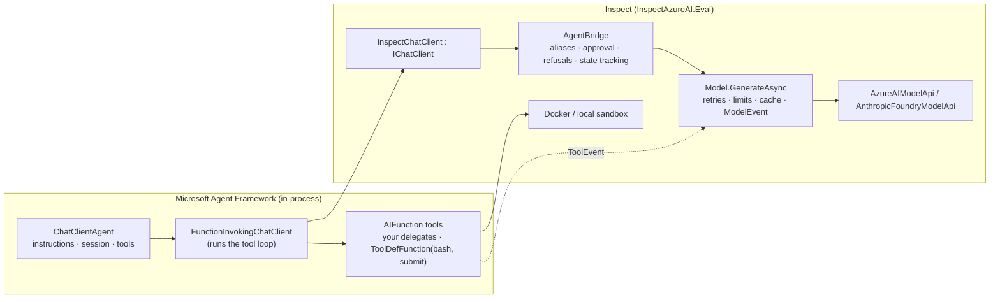

# Microsoft Agent Framework agents under Inspect

`src/InspectAzureAI.Maf` runs a [Microsoft Agent Framework](https://learn.microsoft.com/agent-framework/) agent as
an Inspect agent. The framework keeps its own tool loop, session and middleware; every model call it makes is
served by the Inspect model of the sample, so the transcript, limits, approval, prompt cache, cost accounting and
the `.eval` log come out exactly as they do for a native Inspect agent. It is the in-process counterpart of
Python's `agent_bridge()` (which patches the OpenAI/Anthropic clients of a Python scaffold), built on the same
`AgentBridge` that serves the Claude Code CLI over HTTP.



## Three ways to bridge, and which one this is

| Level | How | Status |
|---|---|---|
| **In-process `IChatClient`** | `InspectChatClient` translates Microsoft.Extensions.AI messages, tools and options into `AgentBridge.GenerateAsync` calls and the `ModelOutput` back into a `ChatResponse`. No HTTP, no container, works for every provider in the port. | **Built** — this project. |
| Loopback HTTP | Start `SandboxAgentBridge` on `127.0.0.1` and hand Agent Framework an `OpenAIClient` pointed at `BaseUrl` (`/v1/chat/completions`, model `inspect`, the bridge token as the API key). Exercises the exact route a container would use. | Available with the existing bridge; needs the `Microsoft.Agents.AI.OpenAI` and `OpenAI` packages. Not wired into the showcase. |
| Agent Framework inside the sandbox | A .NET console app in the container with `OPENAI_BASE_URL` set to the host bridge, the way `ClaudeCodeAgent` runs the CLI. | Not built (needs a .NET runtime in the sandbox image). |

## The pieces

| Type | Role |
|---|---|
| `InspectChatClient` | `IChatClient` over an `AgentBridge`. `GetResponseAsync` maps `ChatOptions.Instructions` to a leading system message, `AITool`s (function tools only) to `ToolInfo`s, `ChatToolMode` to `ToolChoice`, the generation parameters to a `GenerateConfig` (forwarded only when the bridge is built with `forwardGenerationConfig`), asks the bridge for `ChatOptions.ModelId ?? "inspect"`, and returns the output as a `ChatResponse` whose tool calls are `FunctionCallContent` for the framework to invoke. Streaming replays the finished response as updates, as the sandbox bridge does. `GetService` answers `ChatClientMetadata` (provider `inspect`, the model's name) and the `AgentBridge`. |
| `ToolDefFunction` / `MafTools` | An Inspect `ToolDef` as an `AIFunction`: the schema is the tool's `ToolParams`, and a call runs through the Inspect tool executor under the model's own tool-call id (required-argument and schema validation, the executor's error mapping — timeouts, sandbox errors, parse errors — output truncation to the tool's or the default limit, and the transcript `ToolEvent` with its span), without approval, which the bridge already applied on the model response. The framework passes the tool message's text back to the model, or `Error: …` for a tool error, as Inspect's providers render one. `MafTools.FromToolDefs([SandboxTools.Bash()])` is how the showcase hands the sandbox `bash` tool to the framework. |
| `AgentFramework.Agent(MafAgentOptions)` | The `AgentDef` factory (use it with `Agents.AsSolver`, `Agents.AsTool`, handoffs, `Agents.RunAsync`). Builds a `ChatClientAgent` over the chat client with `Instructions` and `Tools` (or whatever `AgentFactory` returns), adds function-invocation middleware, and runs the `react`-style outer loop below. |

`MafAgentOptions` (record, all optional): `Name`, `Description`, `Instructions` (default `basic_agent`'s system
message; `{submit}` is the submit tool's name), `Tools`, `Submit` (default true) with `SubmitName` /
`SubmitDescription`, `Attempts` (an `AgentAttempts`), `ContinueMessage`, `Model` (default the sample's active
model), `RetryRefusals`, `Cache`, `Approval`, `AgentFactory` (`Func<IChatClient, IList<AITool>, AIAgent>` for a
custom `ChatClientAgent`, extra middleware, or a workflow wrapped as an agent), `RecordToolEvents`.

## What a run does

1. `SampleContext.Require()` supplies the model; an `AgentBridge` is built over the incoming `AgentState` with the
   options' approval policies, refusal retries and cache policy; an `InspectChatClient` wraps it, and a
   `FunctionInvokingChatClient` wraps that with the framework's per-run caps lifted (`MaxToolIterations`, default
   unbounded, instead of the framework's 40 round-trips; consecutive tool errors never abort the run) — Inspect's
   limits bound the run, and tool failures are reported to the model for as long as it keeps calling, as the
   native tool loop does.
2. The sample's messages become the first `RunAsync` input of a fresh `AgentSession`; Agent Framework keeps the
   history in the session and sends the whole conversation on every call, which is what the bridge's thread
   tracking needs to keep `AgentState.Messages` and `Output` current (the same mechanism Claude Code relies on).
3. Function-invocation middleware wraps every tool the framework runs. For a framework-side function (an
   `AIFunctionFactory` delegate) it records a transcript `ToolEvent` under a `tool` span (arguments, result or
   error, timing; `failed` for an unhandled exception) — something Python's in-process bridge cannot do — and
   captures a `LimitExceededException` / `TerminateSampleException` the function raised (the framework would
   otherwise fold it into a tool error) to re-throw it after the run; an Inspect tool records its own event
   through the executor. For every function it sets `FunctionInvocationContext.Terminate` once the iteration that
   ran the submit tool has finished its last call, so the framework neither calls the model again with the
   submission nor skips the submit call's siblings. A cancelled invocation records nothing and propagates.
4. Tool results of the final round never reach a model request, so they are appended to the state from the
   framework's response (by tool-call id); the submitted answer becomes `Output.Completion`.
5. A submission with attempts left is scored with `Agents.ScoreAsync`; an incorrect one is answered with the
   incorrect message on the same session. A run that ends without a submission (the agent stopped calling tools)
   gets the continue message, as `react` does; without a submit tool the run simply ends.
6. Limits raised by a model call propagate straight out of the framework's `RunAsync`; the eval runner records the
   sample's limit. Approval rejections are replayed to the model by the bridge before the framework ever sees the
   call, so a rejected tool is never invoked, and an Inspect tool is not approved a second time on execution. A
   response in which the framework left a tool call un-invoked (an approval-gated function, a custom agent that
   bypasses function invocation) fails the run explicitly rather than continuing with an unanswered call.

## Using it

```csharp
using InspectAzureAI.Eval.Agents;
using InspectAzureAI.Eval.Tools;
using InspectAzureAI.Maf;
using Microsoft.Extensions.AI;

var weather = AIFunctionFactory.Create((string city) => $"Sunny in {city}", "get_weather", "Current weather.");
var agent = AgentFramework.Agent(new MafAgentOptions
{
    Instructions = "Answer with the weather, then call {submit} with a one-line summary.",
    Tools = [weather, .. MafTools.FromToolDefs([SandboxTools.Bash()])],
    Attempts = new AgentAttempts(2),
});
var task = new EvalTask { Name = "weather", Dataset = dataset, Solver = Agents.AsSolver(agent), Scorers = [Scorers.Includes()] };
```

Any `IChatClient` consumer works the same way — `new InspectChatClient(new AgentBridge(state, model))` can back a
Semantic Kernel or Microsoft.Extensions.AI pipeline directly.

In the showcase: `swe-showcase run --task hello-swe --agent maf` runs a `ChatClientAgent` with the sandbox `bash`
tool and a submit tool; `--attempts`, `--approval`, `--cache`, `--cost-limit`, `--hooks` and the limits apply as
for the other agents, `--compaction` is refused (the framework owns its context), and `--fake` drives it with the
same scripted turns as `basic`.

## Tests

`tests/InspectAzureAI.Maf.Tests` (45 tests, offline, no Docker):

- `MafConversionTests`: both directions of the message translation (text, instructions, function calls and
  results, result exceptions, structured results, media, reasoning with signatures and redacted blocks), tool
  schemas, tool modes, generation options and JSON-schema response formats, model outputs to responses
  (function-call arguments as `JsonElement`s, usage, finish reasons), tool errors and media results round-tripping
  as the tool message, and the refusals for non-function tools, schema-less JSON mode, out-of-range seeds and
  unsupported content.
- `InspectChatClientTests`: the client over a scripted model — tracking into the bridge state, tools offered and
  calls returned, streaming, model aliases, `GetService`.
- `MafAgentTests`: `Eval.RunAsync` with a `ChatClientAgent` and a real `AIFunctionFactory` tool — the tool loop,
  messages and events in the log, scoring; attempts with an incorrect submission; the continue message; no submit
  tool; a token limit ending the sample; approval rejecting a call before the framework runs it; 45 tool calls in
  one run (past the framework's default cap); a submission alongside a sibling call. Under a sample context: the
  sandbox `bash` tool through `ToolDefFunction` with tool events; the executor's validation, truncation and
  timeout mapping under the model's call ids with one event per call; approval applied once per Inspect tool
  call; a failing framework-side tool reported to the model; a submission followed by a throwing sibling; an
  unhandled exception in an Inspect tool failing the sample; a limit raised inside a tool re-thrown from the run;
  cancellation inside a tool recording no event; a custom `AgentFactory`; option validation.
- `Swe.Tests`: `--fake --agent maf` on `hello-swe`, `--compaction` refused, `list` shows the agent.

## Verified against a live Foundry resource

Run on 2026-09-07 against `https://myfoundry0406.services.ai.azure.com/models` (Entra ID through `az login`),
Docker 29.5 on an arm64 host, `--sandbox docker`; Microsoft.Agents.AI 1.20.0 on Microsoft.Extensions.AI 10.9.0.

| Task (sample) | Model (route) | Result | Tokens | Time | What happened |
|---|---|---|---|---|---|
| hello-swe (1) | gpt-5.4-mini (models) | `exec_check=C` | 807 | 5.3 s | 2 model calls, 2 tool calls: `bash(cmd=…)` wrote `hello.py`, then `submit(answer="Done")`; both recorded as `ToolEvent`s; `output.completion` is the submitted answer. `docker ps -a` showed no leftover container. Re-run after the review fix pass (`--attempts 2`): `exec_check=C`, 815 tokens, 5.1 s, the same 2 calls and 2 tools, one submission. |
| hello-swe (2, `--sample-id 2`) | claude-sonnet-4-6 (anthropic) | `exec_check=C` | 9,059 | 26.9 s | The Anthropic-on-Foundry route through the same adapter: 6 model calls, 5 tool calls (`bash` to read and rewrite `words.py`, then `submit`); the submission text became `output.completion`. No leftover container. |

## Fidelity notes and limits

1. Only `AIFunction` tools cross to the model; a hosted tool (web search, code interpreter, MCP server objects)
   is refused with `NotSupportedException` rather than dropped, since the Inspect model could not honour it.
2. Instructions travel as `ChatOptions.Instructions` in Agent Framework 1.20 and become one leading
   `ChatMessageSystem`; a `ChatRole.System` message in the history is kept as a system message too.
3. Function-call arguments are handed to the framework as `JsonElement` values (the shape the OpenAI client
   produces), so `AIFunctionFactory` marshalling behaves as with a real provider; a tool call the model failed to
   parse carries a `JsonException` on the `FunctionCallContent`.
4. A framework-side function that throws is reported to the model by the framework (`Error: Function failed.
   Exception: …`, detailed errors on) and its `FunctionResultContent.Exception` becomes the tool message's
   `ToolCallError` ("unknown"). An Inspect tool's errors are the executor's (`parsing`, `timeout`, `limit`, …):
   the function result is then the `ChatMessageTool` itself, which the chat client unwraps, so the error object
   and any non-text content reach the model and the state intact; an unhandled exception in an Inspect tool fails
   the sample as it does in the native loop. Reasoning content keeps a provider's signature or redacted blob in
   `TextReasoningContent.ProtectedData`, which the Anthropic route needs to replay thinking with tool use.
5. Streaming is synthesised from the finished response (`ToChatResponseUpdates`), like the sandbox bridge.
6. A JSON-schema `ChatOptions.ResponseFormat` becomes a `ResponseSchema`; schema-less JSON mode and a seed
   outside 32 bits are refused. Temperature, top-p/k, max tokens, stop sequences, penalties, seed and
   `AllowMultipleToolCalls` are mapped but the bridge strips generation parameters unless it is built with
   `forwardGenerationConfig` — the served model's own config wins, as for Claude Code.
7. Compaction is not offered: the framework owns its session history. Message, token, time, working and cost
   limits apply through `Model.GenerateAsync`; a scaffold that never submits is bounded by them (the tests set a
   message limit for that reason), and the framework's own 40-round-trip cap is lifted so it cannot end a run
   with un-invoked calls.
8. The submit tool stops the framework's loop through `FunctionInvocationContext.Terminate` at the end of its
   iteration, so a submission costs no extra model call and its sibling calls still run (a sibling that throws is
   answered with its error rather than rethrown, since the framework ignores `Terminate` on an exception; a
   sibling naming a function that does not exist is answered by the framework itself and costs one more model
   call). With `AllowConcurrentInvocation` left at its default, tools run one at a time; the bridge also serves
   them in order for approval. A submit call without an `answer` is a parsing error, not an attempt. Tool names
   must be unique and must not collide with the submit tool's.
9. A framework-side function that raises a limit or a termination is re-thrown after `RunAsync` returns (the
   framework has already produced an error result for it); an Inspect tool follows the executor, where a limit
   raised inside the tool is reported as a `limit` tool error.
10. Only the eval model (and bridge aliases) are addressable by `ChatOptions.ModelId`; there are no model roles.
11. The completion is the submitted answer alone and the submit call stays in the messages, as `basic_agent`
    does (`react` appends the answer to the assistant text and removes the call).
