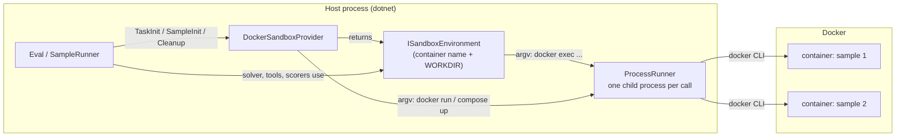
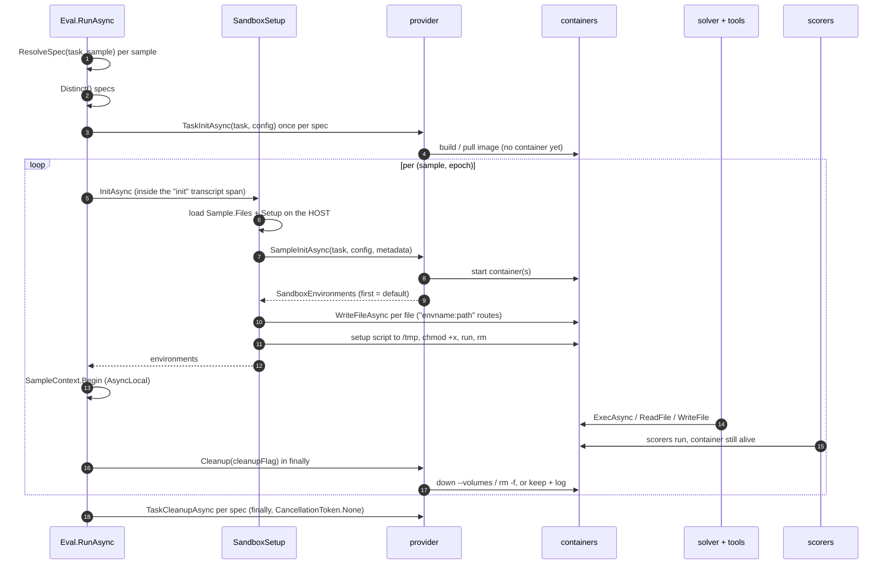
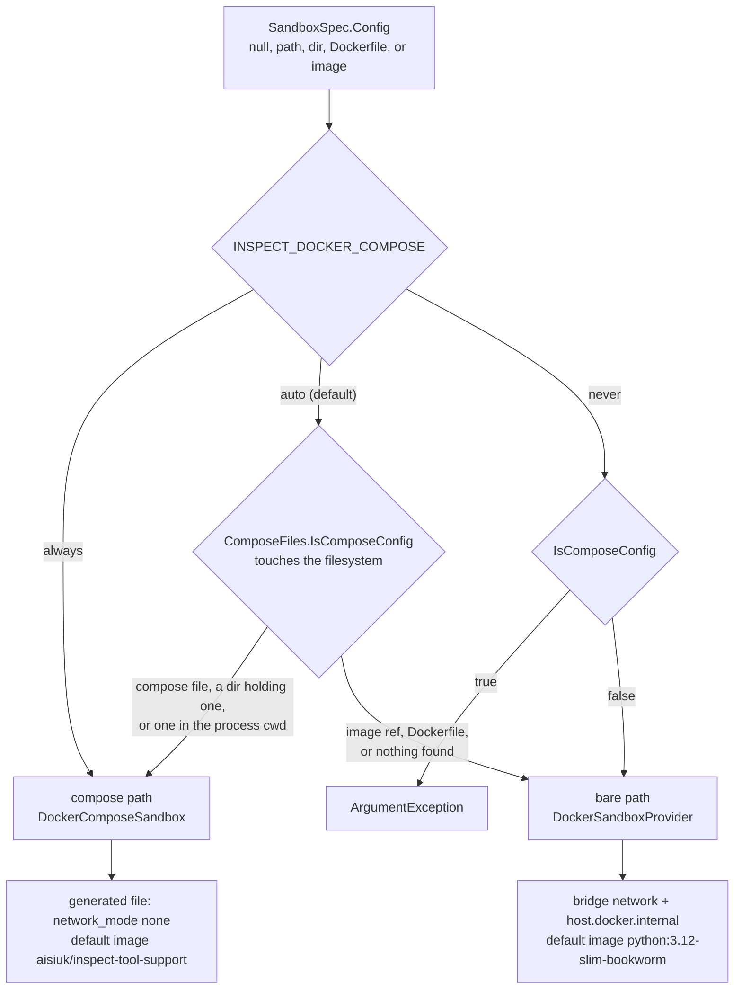
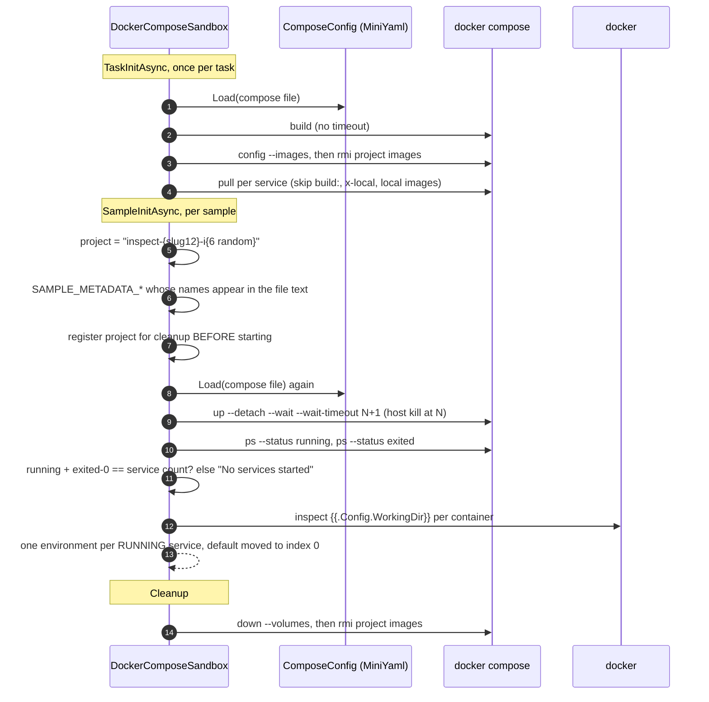
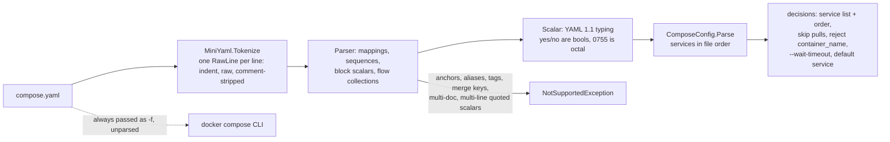
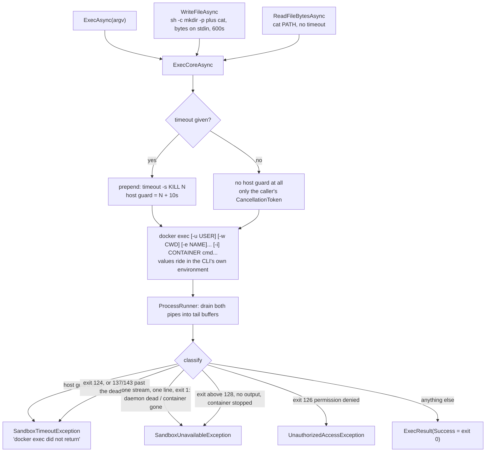
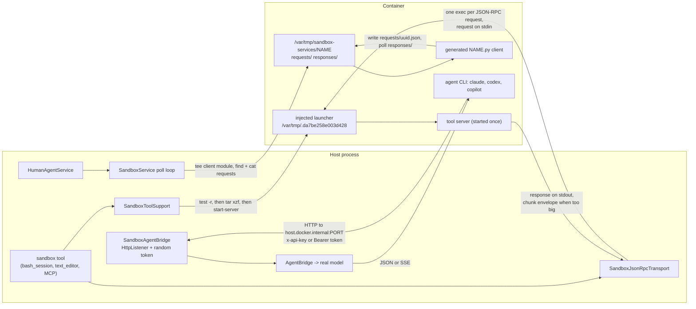
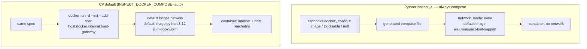

# Container orchestration in C#

> How this repo runs a sample's code inside a container: what the pieces are, who calls
> what and when, and where it differs from Python `inspect_ai`.
>
> Written 2026-09-13 against branch `feat/codex-cli-claude-code-parity`. Every code
> sample is quoted verbatim and every `path:line` citation was checked against the
> working tree on that day; line numbers drift, the file names do not.

## Contents

1. [Why there is a container at all](#1-why-there-is-a-container-at-all)
2. [The contract: four small types](#2-the-contract-four-small-types)
3. [The lifecycle: who calls what, and when](#3-the-lifecycle-who-calls-what-and-when)
4. [Two engines behind one provider](#4-two-engines-behind-one-provider)
5. [The bare path: one container, `docker run`](#5-the-bare-path-one-container-docker-run)
6. [The compose path: a project per sample](#6-the-compose-path-a-project-per-sample)
7. [Reading the compose file: MiniYaml](#7-reading-the-compose-file-miniyaml)
8. [Running a command inside the container](#8-running-a-command-inside-the-container)
9. [Getting files in and out](#9-getting-files-in-and-out)
10. [Three ways the host talks to the container](#10-three-ways-the-host-talks-to-the-container)
11. [Concurrency, limits and cleanup guarantees](#11-concurrency-limits-and-cleanup-guarantees)
12. [What is different from Python inspect_ai](#12-what-is-different-from-python-inspect_ai)
13. [Practical notes](#13-practical-notes)

---

## 1. Why there is a container at all

> **In plain words.** When an eval runs, the model is allowed to do real things: run shell
> commands, edit files, install packages. You do not want that happening on your own
> machine, and you want every sample to start from the same clean slate. So the runner
> gives each sample its own throwaway box (a Docker container), puts the sample's files in
> it, lets the model work inside it, scores the result, and then throws the box away. This
> section also gives you the one idea to hold onto for the rest of the document: the C#
> code never speaks to Docker directly. It runs the ordinary `docker` command-line tool as
> a child process, once per action, exactly as you would at a terminal. A "sandbox
> environment" object is just a container name plus the ability to build the right `docker
> ...` command.

An eval hands a model a task and then runs whatever the model asks for: shell commands,
file edits, package installs, sometimes a whole agent CLI. That has to happen somewhere
that is **disposable** (the next sample starts clean), **isolated** (the model cannot
touch your machine, and usually cannot reach the network), and **reproducible** (the same
image every time).

That "somewhere" is a *sandbox*. A task declares one, and the runner creates one per
sample, copies the sample's files in, runs its setup script, lets the solver work, scores
while the container is still alive, then destroys it.

```csharp
// examples/evals_in_eval/FileProbe.cs:32
    public static EvalTask FileProbeTask() => Build(new SandboxSpec("docker"));
```

Three sandbox kinds exist: `"local"` (no container — a temp directory on your machine,
for tests and trusted tools), `"docker"` (the real thing, this document), and `"fake"`
(scripted, registered by tests and demos).

The mental model in one line: **the host process never talks to the Docker API — it shells
out to the `docker` CLI, one child process per operation, and a "sandbox environment" is
just a container name plus the knowledge of how to build that argv.**



## 2. The contract: four small types

> **In plain words.** This section introduces the four C# types everything else is built
> on. `SandboxSpec` is the *request*: two strings, which kind of sandbox (`docker`,
> `local`) and configured how (a compose file, an image name, or nothing).
> `ISandboxProvider` is the *factory*: a set-up step that runs once per task (build or
> pull the image), a step that runs once per sample (start the container), and a tear-down
> step that runs once per task. `ISandboxEnvironment` is the *handle the model's tools
> use*: run a command, read a file, write a file, nothing more. `SandboxEnvironments` is
> *what one sample was given*: a named list of those handles (the first one is "the"
> sandbox) plus a function to call when the sample is over. The one rule to remember: if a
> command runs and fails you get a normal result with a non-zero exit code; you only get
> an exception when the sandbox itself is broken.

Everything in this subsystem hangs off four declarations. Read these and you can predict
the rest. (A runnable, narrated version of this section: `dotnet run --project
src/InspectAzureAI.SandboxContractDemo`.)

**`SandboxSpec` — what the task asked for.** A type name and an opaque config string.

```csharp
// src/InspectAzureAI.Eval/Sandbox/SandboxSpec.cs:9
public sealed record SandboxSpec(string Type, string? Config = null);
```

`Type` is a key in the registry (`"docker"`, `"local"`). `Config` is provider-specific: for
Docker it may be a compose file, a directory holding one, a Dockerfile, an image name, or
`null`.

**`ISandboxProvider` — the factory, with a lifecycle.** Three methods, two scopes: per
task (build/pull once) and per sample (start containers).

```csharp
// src/InspectAzureAI.Eval/Sandbox/ISandboxProvider.cs:8-21
public interface ISandboxProvider
{
    /// <summary>Registry key, e.g. "local" or "docker".</summary>
    string Type { get; }

    /// <summary>Runs once per task before any sample (e.g. builds the image).</summary>
    Task TaskInitAsync(string taskName, string? config, CancellationToken cancellationToken = default);

    /// <summary>Creates the environments for one sample; the first entry is the default sandbox.</summary>
    Task<SandboxEnvironments> SampleInitAsync(string taskName, string? config, IReadOnlyDictionary<string, string> metadata, CancellationToken cancellationToken = default);

    /// <summary>Runs once per task after all samples.</summary>
    Task TaskCleanupAsync(string taskName, string? config, bool cleanup, CancellationToken cancellationToken = default);
}
```

**`ISandboxEnvironment` — what solvers and tools actually touch.** Run a command, read a
file, write a file. Note `cmd` is *argv*, never a shell string, so there is no quoting or
injection problem — and no globbing either: `["ls", "*.txt"]` does not expand.

```csharp
// src/InspectAzureAI.Eval/Sandbox/ISandboxEnvironment.cs:12-25
    /// <summary>
    /// Runs <paramref name="cmd"/> (argv, never a shell string). A missing executable is a failed
    /// <see cref="ExecResult"/>; a provider that cannot run commands at all throws
    /// <see cref="SandboxUnavailableException"/>; an expired <paramref name="timeout"/> throws
    /// <see cref="SandboxTimeoutException"/> carrying the output captured so far.
    /// </summary>
    Task<ExecResult> ExecAsync(
        IReadOnlyList<string> cmd,
        string? input = null,
        string? cwd = null,
        IReadOnlyDictionary<string, string>? env = null,
        string? user = null,
        TimeSpan? timeout = null,
        CancellationToken cancellationToken = default);
```

That doc comment is the whole error contract, and it is worth memorising: **a command that
runs and fails is an ordinary `ExecResult`, not an exception.** Exceptions mean the sandbox
itself misbehaved.

**`SandboxEnvironments` — what one sample got.** An ordered name → environment map plus an
optional teardown delegate. Two details carry real weight: the *first* entry is the
default sandbox (position is the only thing that marks it), and cleanup is a closure the
provider hands back, not a method on any interface.

```csharp
// src/InspectAzureAI.Eval/Sandbox/SandboxEnvironments.cs:9-15
public sealed record SandboxEnvironments(IReadOnlyDictionary<string, ISandboxEnvironment> Environments, Func<bool, Task>? Cleanup = null)
{
    /// <summary>The default sandbox (first entry); throws when there are none.</summary>
    public ISandboxEnvironment Default =>
        Environments.Count > 0
            ? Environments.First().Value
            : throw new InvalidOperationException("SandboxEnvironments contains no environments.");
```

The `bool` handed to `Cleanup` is **not** "did the sample succeed". It is the runner's
`--no-sandbox-cleanup` switch: `true` destroy, `false` keep it running so a human can look
inside (`src/InspectAzureAI.Eval/Runner/EvalOptions.cs:56`).

Providers live in a static, case-insensitive dictionary that is built the first time
anything touches it, pre-seeded with `local` and `docker`
(`src/InspectAzureAI.Eval/Sandbox/SandboxRegistry.cs:15-19`). One provider instance serves
the whole process and every concurrent sample, so provider code must be thread-safe.

## 3. The lifecycle: who calls what, and when

> **In plain words.** This section is the timeline. Before any sample runs, the runner
> works out which sandbox each sample needs, removes duplicates, and asks the provider to
> prepare each distinct one; that is when the image gets built or pulled, and no container
> exists yet. Then, for every sample and every epoch, it starts the container(s), copies
> the sample's files in, runs the sample's setup script, hands control to the solver and
> its tools, runs the scorers *while the container is still alive*, and finally tears the
> container down. After the last sample the provider gets one last call to clean up
> anything task-wide. The diagram shows exactly these steps in order, and the four
> subsections below explain the ones that are easy to get wrong.



### Which sandbox a sample gets

> **In plain words.** Both the task and an individual sample can say what sandbox they
> want. When they disagree, the task's *type* always wins (a sample cannot switch from
> Docker to local), but a sample may supply its own *config* as long as it is asking for
> the same type. If neither says anything, the sample runs with no sandbox at all.

The task's spec and the sample's spec are merged, and the task always wins the *type*
argument. A sample may only override the *config*, and only when its own type matches:

```csharp
// src/InspectAzureAI.Eval/Runner/SandboxSetup.cs:25-37
    public static SandboxSpec? ResolveSpec(SandboxSpec? taskSandbox, Sample sample)
    {
        ArgumentNullException.ThrowIfNull(sample);
        if (taskSandbox is null)
        {
            return sample.Sandbox;
        }

        var config = sample.Sandbox is { Config: not null } own && string.Equals(own.Type, taskSandbox.Type, StringComparison.OrdinalIgnoreCase)
            ? own.Config
            : taskSandbox.Config;
        return new SandboxSpec(taskSandbox.Type, config);
    }
```

So a sample declaring `local` inside a `docker` task silently gets docker. `null` out means
this sample runs with no container at all.

### How the container reaches solver code

> **In plain words.** Solvers and tools are not handed the sandbox as a parameter.
> Instead, just before the solver runs, the runner puts the sample's sandboxes (and other
> per-sample things) into an ambient context that follows the async call chain, like a
> thread-local for `async` code. Any tool anywhere in that chain can ask the context for
> "the default sandbox" or "the one called `victim`". A side effect of where this happens:
> starting the container and running setup are finished *before* the sample's stopwatch
> starts, so a slow image pull is not counted against the sample's time limits.

It is not passed as an argument. The environments go onto an ambient `SampleContext` held
in an `AsyncLocal`, and everything downstream fetches it from there:

```csharp
// src/InspectAzureAI.Eval/Runner/SampleRunner.cs:122-140
            if (sandbox is not null)
            {
                using var initSpan = transcript.Span("init", "init");
                sandboxes = await SandboxSetup.InitAsync(task.Name, sandbox, sample, cancellationToken).ConfigureAwait(false);
            }

            var context = new SampleContext
            {
                ActiveModel = model,
                Store = store,
                Transcript = transcript,
                Limits = limits,
                Sandboxes = sandboxes,
                SampleState = state,
                Scorer = task.Scorers.Count > 0
                    ? scored => ScoreIntermediateAsync(scored, sample, state, transcript, cancellationToken)
                    : null,
            };
            using var scope = SampleContext.Begin(context);
```

A tool then writes `SampleContext.Require().Sandbox()` for the default container, or
`Sandbox("victim")` for a named one (`src/InspectAzureAI.Eval/Context/SampleContext.cs:54`).
Tools that need "whichever container has this file" use `SandboxWith.FindAsync`, which
probes each environment with `which` or `test -r` and caches the winner for the sample
(`src/InspectAzureAI.Eval/Sandbox/SandboxWith.cs:43`).

Because container startup happens inside the `init` span and the sample's stopwatch starts
after it closes, **image pulls and setup scripts are not billed to the sample's
`total_time` or `working_time`** (`src/InspectAzureAI.Eval/Runner/SampleRunner.cs:143`).

### Files, then setup, then the solver

> **In plain words.** A sample can carry files and a setup script. The runner reads all of
> them on the host first (a value can be a `data:` URI, a path on disk, or the literal
> text), then writes each file into the container, then runs the setup script inside the
> default container under a time limit. If any of that fails, the container is destroyed
> on the spot and the sample errors, even if you asked to keep containers for inspection.

Sample files and the setup script are read on the *host* first, before anything starts —
each value is decoded as a `data:` URI, else read from disk if such a path exists (a
directory expands recursively), else taken as literal content
(`src/InspectAzureAI.Eval/Runner/SandboxSetup.cs:85`). Then:

```csharp
// src/InspectAzureAI.Eval/Runner/SandboxSetup.cs:60-78
        try
        {
            await CopyFilesAsync(files, environments, cancellationToken).ConfigureAwait(false);
            if (setup is not null)
            {
                await RunSetupAsync(setup, environments.Default, cancellationToken).ConfigureAwait(false);
            }

            return environments;
        }
        catch
        {
            if (environments.Cleanup is { } cleanup)
            {
                await cleanup(true).ConfigureAwait(false);
            }

            throw;
        }
```

Worth knowing: a file key of the form `envname:path` routes that file to a named container
(an unknown name fails the sample), and the setup script runs in the **default** container
only, under `INSPECT_SANDBOX_SETUP_TIMEOUT` (default 300s). That `cleanup(true)` is
unconditional — a container whose setup failed is destroyed even under
`--no-sandbox-cleanup`, which is the one container you probably wanted to inspect.

### Teardown order

> **In plain words.** Scoring happens *before* the container is removed, on purpose, so a
> scorer can still run commands (for example, to check that a file exists). Removal sits
> in a `finally`, so it happens whether the sample succeeded, failed or was cancelled; if
> removal itself fails, that is logged and the sample keeps its score. The task-level
> clean-up runs after all samples in another `finally`, with a token that cannot be
> cancelled, so pressing Ctrl+C still tears containers down. The table sums up which step
> runs how often; note the arithmetic, because containers are per sample *per epoch*.

Scoring deliberately happens *before* teardown, inside the same `try`, so scorers can still
run commands in the container. Cleanup is the `finally`:

```csharp
// src/InspectAzureAI.Eval/Runner/SampleRunner.cs:250-263
        finally
        {
            if (sandboxes?.Cleanup is { } cleanupSandboxes)
            {
                try
                {
                    await cleanupSandboxes(cleanup).ConfigureAwait(false);
                }
                catch (Exception ex)
                {
                    transcript.Add(new ErrorEvent($"Sandbox cleanup failed: {ex.Message}", ex.ToString()));
                }
            }
        }
```

A cleanup failure is recorded and swallowed — the sample keeps its score. `TaskCleanupAsync`
then runs once per distinct spec in `Eval`'s own `finally`, with `CancellationToken.None`
so it still runs after a Ctrl+C (`src/InspectAzureAI.Eval/Runner/Eval.cs:245`).

| Scope | Runs | Docker does |
|---|---|---|
| `TaskInitAsync` | once per distinct `(Type, Config)` per task | build or pull the image; for compose, `compose build` + per-service pulls |
| `SampleInitAsync` | once per **(sample, epoch)** | `docker run -d` or `compose up --wait`, then one environment per container |
| `Cleanup(flag)` | sample `finally`, after scoring | `rm -f` / `down --volumes`, or keep and log how to attach |
| `TaskCleanupAsync` | task `finally`, uncancellable | down leftover projects of that task; delete generated compose files |

Three epochs over ten samples means **thirty** containers over the run, not ten.

---

## 4. Two engines behind one provider

> **In plain words.** Saying `"docker"` can mean two quite different things. The *compose
> path* uses `docker compose up` to start a small throwaway project (possibly several
> services) from a compose file, and generated compose files disable networking entirely.
> The *bare path* simply does `docker run` on one image and `docker exec`s into it: no
> compose plugin needed, but the container sits on Docker's normal network with internet
> access. Which path you get depends on an environment variable (`INSPECT_DOCKER_COMPOSE`:
> `auto`, `always`, `never`) and, in `auto`, on whether the config string looks like a
> compose file. The four numbered surprises matter because the two paths differ in *both*
> default image *and* network, and because in `auto` a `null` config triggers a search of
> the *current working directory* for a compose file, so the same eval can behave
> differently depending on where you launched it.

The `"docker"` provider can start a sample's container in two completely different ways,
and choosing between them is the single most consequential decision in this subsystem.

- **Compose path** — `docker compose up` a throwaway project. Multi-service, healthcheck
  aware, and (for generated files) **no network at all**.
- **Bare path** — `docker run -d` one idle container and `docker exec` into it. Needs no
  compose plugin, and has **normal bridge networking**.

The choice comes from a policy plus the shape of the config string:

```csharp
// src/InspectAzureAI.Eval/Sandbox/Docker/DockerSandboxProvider.cs:127-134
    public bool UsesCompose(string? config) => ComposeMode switch
    {
        DockerComposeMode.Always => true,
        DockerComposeMode.Never => ComposeFiles.IsComposeConfig(config)
            ? throw new ArgumentException($"Sandbox config '{config}' is a docker compose file, but this provider runs without compose (DockerComposeMode.Never).", nameof(config))
            : false,
        _ => ComposeFiles.IsComposeConfig(config),
    };
```



Four things surprise people here:

1. **The mode is read once**, when the static registry first builds the provider
   (`DockerComposeMode.cs:27`, via `DockerSandboxProvider.cs:34-37`). Setting the variable
   later in the same process changes nothing. An unrecognised value is warned about and
   downgraded to `auto` rather than failing.
2. **A `null` config does not mean "the default image".** In `auto` it first searches the
   *process working directory* for `compose.yaml` / `compose.yml` / `docker-compose.yaml` /
   `docker-compose.yml` / `.compose.yaml` (`ComposeProject.cs:296-321`). The same eval takes
   a different path depending on where you started it. Pass the task's directory as the
   config if you want the compose file next to the task.
3. **The two paths differ in image *and* network.** Flipping `INSPECT_DOCKER_COMPOSE` to
   `always` changes both.
4. **The routing test is re-run** in `TaskInitAsync`, `SampleInitAsync` and
   `TaskCleanupAsync` (`DockerSandboxProvider.cs:69, 84, 119`), each time hitting the disk.
   If a compose file appears mid-run, init and cleanup can disagree about which engine the
   task used.

## 5. The bare path: one container, `docker run`

> **In plain words.** The bare path is one `docker run -d` that starts a container doing
> nothing (`sleep infinity`), so that later `docker exec` calls have somewhere to run.
> Before that, the config string is turned into an image: nothing means a default Python
> image; a directory or a `Dockerfile` path means build it; anything else is treated as an
> image name and pulled. Builds are tagged with a hash of their contents so an unchanged
> directory is not rebuilt. Two things to keep in mind: only one build or pull happens at
> a time process-wide and none has a timeout, so a slow registry stalls everyone; and
> built images are never deleted, so they pile up on disk across runs.

The whole path is one command:

```csharp
// src/InspectAzureAI.Eval/Sandbox/Docker/DockerCli.cs:24-31
    /// <summary><c>docker run -d --init --name NAME --add-host ... IMAGE CMD...</c>; returns the container id.</summary>
    public async Task<string> RunDetachedAsync(string image, string name, IReadOnlyList<string> command, CancellationToken cancellationToken = default)
    {
        // --init reaps the orphans of exec'd processes (the auto-compose file Python generates sets init: true).
        List<string> args = ["run", "-d", "--init", "--name", name, "--add-host", HostGatewayMapping, image, .. command];
        var result = await RunManagementAsync(args, null, cancellationToken).ConfigureAwait(false);
        return result.StdoutText.Trim();
    }
```

The container is named `inspect-swe-` plus 12 random hex digits, runs `sleep infinity` (with
a `tail -f /dev/null` retry when the image has no `sleep`), and its WORKDIR comes from
`docker inspect --format {{.Config.WorkingDir}}`
(`DockerSandboxProvider.cs:89-101, 136-152`). The `null` in the timeout slot is real:
`docker run` has no host-side time limit.

Before that, the config string is turned into one concrete image:

| Config | Becomes |
|---|---|
| `null` or blank | `python:3.12-slim-bookworm` |
| an existing directory | build of that directory (must contain a `Dockerfile`) |
| a path ending in `Dockerfile` | build of its directory |
| anything else | an image reference, passed to `docker pull` unvalidated |

```csharp
// src/InspectAzureAI.Eval/Sandbox/Docker/DockerImages.cs:59-78
        var source = Resolve(config);
        await EnsureGate.WaitAsync(cancellationToken).ConfigureAwait(false);
        try
        {
            if (await cli.ImageExistsAsync(source.Image, cancellationToken).ConfigureAwait(false))
            {
                return source.Image;
            }

            if (source.IsBuild)
            {
                await cli.BuildAsync(source.Image, source.ContextDirectory!, source.Dockerfile!, cancellationToken).ConfigureAwait(false);
            }
            else
            {
                await cli.PullAsync(source.Image, cancellationToken).ConfigureAwait(false);
            }

            return source.Image;
        }
```

A build is tagged `inspect-swe-sandbox:<first 12 hex of a SHA-256 over the whole context>`,
so an unchanged context reuses the image (`DockerImages.cs:151`). `.dockerignore` is not
consulted, and `.git` is the only exclusion. `EnsureGate` is a process-wide semaphore of
**one** held across the entire build or pull, and build/pull carry no host timeout — so a
hung registry stalls every other sample's image check.

Two sharp edges: an existing file named `Dockerfile.dev` is judged *not* compose-shaped by
one test and *not* a Dockerfile by the other, so it ends up being `docker pull`ed as if it
were an image name (`ComposeProject.cs:105` vs `DockerImages.cs:42`). And nothing on this
path is reclaimed at task cleanup — `inspect-swe-sandbox:<hash>` images accumulate across
runs by design (`DockerSandboxProvider.cs:117-119`).

## 6. The compose path: a project per sample

> **In plain words.** Docker Compose groups containers, networks and volumes under a
> *project name*. This path invents a fresh project name for every sample, runs `docker
> compose up --wait`, and later `docker compose down --volumes`, so no two samples ever
> share anything. The rest of the section is about the awkward parts: how long to wait for
> services to come up (computed from the healthchecks in the file, or 600 s if there are
> none); how to tell that "up" actually worked (by counting running containers against the
> services in the file, because the exit code of `up --wait` is unreliable); which service
> is "the sandbox" (`x-default: true`, else one named `default`, else the only one); how
> per-sample metadata reaches compose (as `SAMPLE_METADATA_*` variables, only for names
> literally present in the file); and what is remembered for clean-up (live projects,
> tracked by task name, which is the root of a concurrency problem covered in §12).

A compose *project* is just a name Docker prefixes onto the containers, networks and volumes
it creates. This path makes a fresh one per sample, so samples never share state.



**Where the wait timeout comes from.** Not a constant — the services' own healthchecks:

```csharp
// src/InspectAzureAI.Eval/Sandbox/Docker/Compose/ComposeCli.cs:56-63
    public Task<ProcessResult> UpAsync(ComposeProject project, IEnumerable<ComposeService> services, CancellationToken cancellationToken = default)
    {
        ArgumentNullException.ThrowIfNull(project);
        var healthcheckTime = ComposeHealthchecks.ServicesHealthcheckTime(services);
        var timeout = healthcheckTime > 0 ? healthcheckTime : ComposeWait;
        string[] command = ["up", "--detach", "--wait", "--wait-timeout", (timeout + 1).ToString(CultureInfo.InvariantCulture)];
        return CommandAsync(project, command, TimeSpan.FromSeconds(timeout), cancellationToken: cancellationToken);
    }
```

```csharp
// src/InspectAzureAI.Eval/Sandbox/Docker/Compose/ComposeHealthchecks.cs:52-58
        var startPeriod = ParseDuration(healthcheck.StartPeriod ?? "0s").TotalSeconds;
        var retries = healthcheck.Retries ?? 3;
        var interval = ParseDuration(healthcheck.Interval ?? "30s").TotalSeconds;
        var timeout = ParseDuration(healthcheck.Timeout ?? "30s").TotalSeconds;
        var graceBoundaryProbe = startPeriod > 0 ? timeout : 0.0;
        var total = startPeriod + graceBoundaryProbe + retries * (interval + timeout);
        return (int)Math.Ceiling(total);
```

No healthcheck anywhere means the 600-second `ComposeWait` fallback. Compose is told `N+1`
seconds while the host-side guard kills the child at `N`, so the host normally wins by a
second and compose's own timeout message rarely appears.

**How "did it start?" is decided.** Not by `up`'s exit code — under `--wait`, compose exits
non-zero whenever a service exits, even successfully. So the check is a count:

```csharp
// src/InspectAzureAI.Eval/Sandbox/Docker/Compose/ComposeCli.cs:198-206
        var running = await PsAsync(project, status: "running", cancellationToken: cancellationToken).ConfigureAwait(false);
        var exited = await PsAsync(project, status: "exited", cancellationToken: cancellationToken).ConfigureAwait(false);
        var successful = running.Count + exited.Count(container => container.ExitCode == 0);
        if (successful == 0 || successful != services.Count)
        {
            return [];
        }

        return running;
```

An exact count against the services *parsed from the file* is strict in a way that matters:
compose profiles that leave a service out, or `deploy.replicas`, produce a mismatch and the
misleading error `No services started`. A run-once service that exits 0 counts toward the
total but never becomes an environment, because only the running list is returned.

**Which service is "the sandbox".** `x-default: true`, else a service named `default`, else a
lone service — expressed purely as list position:

```csharp
// src/InspectAzureAI.Eval/Sandbox/Docker/Compose/DockerComposeSandbox.cs:122-137
            // confirm that we have a 'default' environment and put it first
            defaultService ??= environments.Any(entry => entry.Key == "default")
                ? "default"
                : environments.Count == 1 && services.Services.Count == 1
                    ? environments[0].Key
                    : throw new InvalidOperationException(
                        "No 'default' service found in Docker compose file. You should either name a service 'default' or add 'x-default: true' to one of your service definitions.");
            var index = environments.FindIndex(entry => entry.Key == defaultService);
            if (index < 0)
            {
                throw new InvalidOperationException($"The default service '{defaultService}' of the Docker compose file is not running.\nCompose up stderr: {up.StderrText}");
            }

            var ordered = new List<KeyValuePair<string, ISandboxEnvironment>>(environments.Count) { environments[index] };
            ordered.AddRange(environments.Where((_, position) => position != index));
            return SandboxEnvironments.Create(ordered, cleanup => SampleCleanupAsync(project, ordered, cleanup));
```

A minimal compose file from this repo, which also shows the usual way to keep a sandbox
offline:

```yaml
# examples/skills/compose.yaml
services:
  default:
    image: ubuntu:24.04
    command: tail -f /dev/null
    init: true

# Keep an interface for the network-info task without permitting Internet access.
networks:
  default:
    internal: true
```

**Per-sample metadata.** Compose files can key their image off sample metadata. The host
forwards `SAMPLE_METADATA_<KEY>` as an environment variable for every compose command of
that project — but only for keys whose derived name *literally appears in the file's text*,
a plain substring search, not an interpolation parse (`DockerComposeSandbox.cs:172-188`). A
mention inside a YAML comment is enough; a key that never appears is silently dropped.

**What is tracked for cleanup.** Live projects and generated compose files are held in two
in-memory lists on the (process-wide singleton) provider, filtered by **task name**
(`DockerComposeSandbox.cs:158-164`). That is the root of the concurrency hazard in
[§12](#12-what-is-different-from-python-inspect_ai). Generated files live in the platform
data directory (`INSPECT_AUTO_COMPOSE_DIR` overrides it) and are deleted at task cleanup.

## 7. Reading the compose file: MiniYaml

> **In plain words.** To make the decisions in §6 (which services exist, in what order,
> how long to wait, which one is the default) the port needs to read the compose file.
> Rather than asking `docker compose config`, which would resolve every YAML feature for
> it, it reads the YAML itself with a small hand-written parser that supports only a
> subset. Anything outside that subset (anchors, aliases, tags, merge keys) fails
> immediately with a clear exception rather than being misread. Docker itself still
> receives the original file, so keys the parser ignores still take effect when the
> containers run; only the port's own decisions are made from the raw text. The bullet
> list is the practical fallout: no `${VAR}` interpolation or profiles in those decisions,
> YAML 1.1 typing (`yes` is a boolean), and a disabled healthcheck still counting toward
> the wait time.

This repo parses compose YAML **itself** rather than asking `docker compose config` what is
in the file. `MiniYaml` (~820 lines) is an indentation-driven reader that produces plain
.NET objects; `ComposeConfig` then types about twenty service keys and keeps everything else
verbatim in an `Extra` dictionary.



The supported subset is a deliberate boundary — refused features fail loudly on their first
character rather than being misread:

```csharp
// src/InspectAzureAI.Eval/Sandbox/Docker/Compose/MiniYaml.cs:407-415
            if (first is '&' or '*' or '!')
            {
                throw new NotSupportedException($"YAML line {line.Number}: anchors, aliases and tags are not supported ('{rest}').");
            }

            if (first is '%' or '@' or '`')
            {
                throw new FormatException($"YAML line {line.Number}: a plain scalar cannot start with '{first}'.");
            }
```

Exception types carry meaning: `FormatException` = malformed structure,
`NotSupportedException` = real YAML deliberately refused, `InvalidOperationException` = valid
YAML but the wrong compose shape. `ComposeConfig.Load` wraps all three with the file path
(`ComposeConfig.cs:84-90`).

What the parsed view is actually used for is narrow — the service names and their order, the
`container_name` rejection, skipping pulls for `build:` / `x-local` services, the wait
timeout, and the default-service pick. Everything else it models (ports, volumes, env,
command, resource limits) exists for parity with Python's model and is exercised only by
tests. **The CLI always receives the original file via `-f`, so keys this model ignores still
take effect in Docker** (`ComposeCli.cs:308`).

Consequences worth knowing before you write a compose file for this runner:

- `${VAR}` interpolation, `.env` files, profiles, `extends` and `include` are **not** applied
  to the parsed view. Docker still applies them when it runs — but the port's service list,
  pull decisions and wait timeout are computed from the raw text.
- YAML 1.1 typing: unquoted `yes`/`no`/`on`/`off` are booleans, and `0755` is octal 493.
  Quoting flips the type, so `x-default: "yes"` throws `Expected a boolean, got 'yes'`.
- A quoted scalar must fit on one line; a `[`/`{` flow collection may span lines.
- `healthcheck: {disable: true}` is parsed but ignored by the timeout formula, so a disabled
  healthcheck still contributes Docker's default 3 × (30 + 30) = 180 seconds to the wait.
- Duplicate keys silently overwrite, and unknown keys are silently shelved.

---

## 8. Running a command inside the container

> **In plain words.** Every command a tool runs becomes one `docker exec` child process on
> the host. If the caller gave a timeout, the command is wrapped in the container's own
> `timeout -s KILL` (so the process inside really dies) and the host waits ten seconds
> longer as a backstop. Environment variables are passed by *name* on the command line
> with their *values* in the child's environment, so secrets never show up in `ps`. The
> exit code and output are then classified: an ordinary non-zero exit is a normal result;
> a timeout (by the host guard, by exit code 124, or by 137/143 *after* the deadline) is
> `SandboxTimeoutException`; a very specific one-line message meaning "the daemon or
> container is gone" is `SandboxUnavailableException`, and that check is deliberately
> strict so a model running docker *inside* its sandbox cannot trigger it. The three
> traps: no timeout means no host guard at all; output over 10 MiB per stream is silently
> trimmed; and compose sandboxes use exactly this `docker exec` path too, never `docker
> compose exec`.

Three operations — run a command, read a file, write a file — are **the same mechanism**: a
`docker exec` of the host `docker` CLI as a child process. Reading a file is `cat`; writing
one is a tiny `sh -c` script fed on stdin.



**There are two timeouts for the same call, on purpose.** Killing the host `docker exec`
process leaves the process tree inside the container running, so the real enforcement is
`timeout -s KILL` *inside* the container; the host guard is a backstop set 10 seconds later.

```csharp
// src/InspectAzureAI.Eval/Sandbox/Docker/DockerSandboxEnvironment.cs:218-237
        var inContainer = cmd;
        DockerFailures.InjectedWrapper? wrapper = null;
        if (timeout is { } limit)
        {
            inContainer = ["timeout", "-s", "KILL", FormatSeconds(limit), .. cmd];
            wrapper = new DockerFailures.InjectedWrapper("timeout", cmd[0]);
        }

        var started = Stopwatch.GetTimestamp();
        var result = await _cli.ExecAsync(
            ContainerName,
            inContainer,
            input,
            cwd is null ? null : ContainerPath(cwd),
            env,
            user,
            timeout is null ? null : timeout + HostTimeoutSlack,
            outputLimit,
            abortOnOutputLimit,
            cancellationToken).ConfigureAwait(false);
```

The argv is assembled once, with one detail worth copying elsewhere: only variable **names**
go on the command line, and the values live in the docker CLI child's own environment, so
secrets never appear in the host process list.

```csharp
// src/InspectAzureAI.Eval/Sandbox/Docker/DockerCli.cs:50-70
        List<string> args = ["exec"];
        if (!string.IsNullOrEmpty(user))
        {
            args.Add("-u");
            args.Add(user);
        }

        if (!string.IsNullOrEmpty(cwd))
        {
            args.Add("-w");
            args.Add(cwd);
        }

        if (env is not null)
        {
            foreach (var key in env.Keys)
            {
                args.Add("-e");
                args.Add(key);
            }
        }
```

Deciding whether a non-zero exit was a *timeout* uses the clock, because 137 and 143 also
mean "OOM-killed" or "stray signal":

```csharp
// src/InspectAzureAI.Eval/Sandbox/Docker/DockerSandboxEnvironment.cs:246-260
        if (timeout is { } expected)
        {
            var seconds = FormatSeconds(expected);
            if (result.TimedOut)
            {
                throw new SandboxTimeoutException($"Command timed out after {seconds} seconds (docker exec did not return): {string.Join(" ", cmd)}", result.CombinedText);
            }

            // 124 is GNU timeout's own code; 137/143 also come from OOM kills and stray signals, so wall-clock
            // time disambiguates those from a real timeout.
            if (result.ExitCode is 124 or 137 or 143 && (result.ExitCode == 124 || elapsed >= expected))
            {
                throw new SandboxTimeoutException($"Command timed out after {seconds} seconds: {string.Join(" ", cmd)}", result.CombinedText);
            }
        }
```

Classifying "Docker itself is broken" is deliberately paranoid: the message must be on
exactly one stream, be a single line, and carry the matching exit code
(`DockerFailures.cs:31-50`). The reason is real — a model running docker *inside* its own
sandbox prints those very strings, and they must stay ordinary tool output.

| Situation | Result |
|---|---|
| command ran, exited non-zero | `ExecResult(Success: false, …)` — the caller's problem |
| timeout expired (either guard) | `SandboxTimeoutException`, carrying output so far |
| daemon dead, container gone/stopped, injected `timeout` missing | `SandboxUnavailableException` |
| exec denied (126) | `UnauthorizedAccessException` |
| file read over the limit | `OutputLimitExceededException` |
| empty argv | `ArgumentException` |

Three traps in this area:

- **No timeout means no host guard.** `ExecAsync(timeout: null)` and every
  `ReadFileBytesAsync` pass `null`, so only the caller's `CancellationToken` can end a hung
  `docker exec`. `WriteFileAsync` is the one operation with an unconditional limit (600s
  in-container).
- **Exec output is silently truncated and the caller is not told.** Each stream keeps only
  the *last* 10 MiB (`TailByteBuffer`) and nothing compares that against the true total. File
  reads behave the opposite way: they kill `cat` and throw.
- **Despite the class name, the compose environment never runs `docker compose exec`.** Exec,
  read and write all delegate to a plain `DockerSandboxEnvironment` bound to the resolved
  container name (`DockerComposeSandboxEnvironment.cs:44-64`); compose is used only for `cp`,
  `ps` and the human-facing "attach to it like this" command. So everything above applies
  unchanged to compose sandboxes.

The `local` sandbox implements the same interface without a container: the argv runs directly
on the host in a per-sample temp directory, `user` is ignored (with a warn-once), and file
I/O is ordinary .NET `File` calls (`LocalSandboxEnvironment.cs:55-104`).

## 9. Getting files in and out

> **In plain words.** There is no special file API. Reading a file is `docker exec ... cat
> PATH`; writing one is `docker exec ... sh -c 'mkdir -p ... && cat > "$1"'` with the
> bytes fed on stdin. The path is passed as a shell *argument*, never spliced into the
> script text, so odd characters in file names are safe. Reads have a size cap (100 MiB by
> default) and throw if it is exceeded; writes have no size cap, only the 600-second
> limit. Error kinds (missing file, permission denied, is a directory) are recognised by
> matching English words in stderr, so a non-English locale falls back to a generic error.
> Reading a file as *text* uses a strict UTF-8 decoder, so a binary file throws instead of
> returning garbage.

```csharp
// src/InspectAzureAI.Eval/Sandbox/Docker/DockerSandboxEnvironment.cs:130-144
        var limit = SandboxLimits.MaxReadFileSize;
        var result = await ExecCoreAsync(
            ["cat", ContainerPath(path)],
            input: null,
            cwd: null,
            env: null,
            user: null,
            timeout: null,
            limit,
            abortOnOutputLimit: true,
            cancellationToken).ConfigureAwait(false);
        if (result.OutputLimitExceeded || result.StdoutTotal > limit)
        {
            throw new OutputLimitExceededException(SandboxLimits.HumanReadableSize(limit), null);
        }
```

Writing a file is the only place a shell is involved, and even there the path travels as a
positional parameter rather than being interpolated, so spaces and quotes in paths are safe:

```text
["sh", "-c", "mkdir -p \"$(dirname \"$1\")\" && cat > \"$1\"", "sh", file]
```

There is no cap on how many bytes you can *write* — the size limits apply to output streams —
so a huge write is bounded only by that 600-second wrapper.

Error typing is English substring matching on stderr (`no such file or directory`,
`permission denied`, `is a directory`), which falls through to a generic
`InvalidOperationException` under a non-English locale or a BusyBox with different wording
(`DockerSandboxEnvironment.cs:151-167`). `ReadFileAsync` (the text overload) uses a **strict**
UTF-8 decoder, so a binary file throws rather than returning mojibake; the tool layer turns
that into a `unicode_decode` tool error.

For bulk copies there are explicit helpers over `docker cp` / `compose cp -L`
(`DockerSandboxEnvironment.cs:174-190`, `ComposeCli.cs:155`) — these are C#-only additions,
used for whole-directory transfers.

## 10. Three ways the host talks to the container

> **In plain words.** Plain `exec` is not enough for everything, so there are three
> higher-level channels. (1) *Tool support*: the built-in sandbox tools (bash session,
> text editor) need a small server inside the container; the host installs a prebuilt
> executable once, then sends each tool call as a JSON-RPC request on the stdin of a short
> `docker exec` and reads the reply from stdout. (2) *SandboxService*: when code inside
> the container needs to call the host, it drops a JSON file into a `requests/` directory
> and polls `responses/`, while the host polls `requests/` through exec; no network is
> involved. (3) *The agent bridge*: an agent CLI (Claude Code, Codex, Copilot) running
> inside the container believes it is calling a model API; the host runs a small HTTP
> server that impersonates that API and forwards to the real model, and the container
> reaches it at `host.docker.internal:<port>` with a random token. Because (3) is HTTP
> over the network, it cannot work in a container whose networking is disabled.



**1. Tool support (JSON-RPC over exec).** The built-in sandboxed tools need a server inside
the container. The host probes for it, and if absent detects OS/arch/libc, fetches a
prebuilt self-contained Linux executable (local cache or S3, always verified against a
hard-coded SHA-256), writes it in, unpacks it, and starts it once. Every tool call is then
**one short-lived `exec`** whose stdin is a JSON-RPC request:

```csharp
// src/InspectAzureAI.Eval/Tools/Support/SandboxJsonRpcTransport.cs:50-63
    public async Task<string> CallAsync(string method, JsonNode? parameters, bool isNotification, JsonRpcCallOptions options, CancellationToken cancellationToken = default)
    {
        ArgumentNullException.ThrowIfNull(method);
        ArgumentNullException.ThrowIfNull(options);
        var request = JsonRpc.CreateRequest(method, parameters, isNotification);
        long? maxResponseBytes = _responseChunking ? SandboxLimits.MaxExecOutputSize : null;
        var response = await SandboxExecAsync(request, JsonRpc.RpcCallDescription(method, parameters), options, maxResponseBytes, cancellationToken).ConfigureAwait(false);
        if (maxResponseBytes is not { } limit)
        {
            return response;
        }

        return await CompleteChunkedResponseAsync(response, options, limit, cancellationToken).ConfigureAwait(false);
    }
```

There is no long-lived pipe: all state (bash sessions, editor state) lives in the server and
is addressed by ids carried in the params. A reply too large for the exec output limit comes
back as a chunk envelope, which the transport reassembles with extra execs and then releases
in a `finally`. Whether the server can switch users depends entirely on whether the tree
could be installed as root:

```csharp
// src/InspectAzureAI.Eval/Tools/Support/SandboxToolSupport.cs:194-212
            await ExtractToolsTreeAsync(sandbox, artifact, state.ToolsUser, cancellationToken).ConfigureAwait(false);

            // A root-owned 0700 tree prevents access by other, non-root users, but not by a process running
            // in the sandbox as root. The launcher is invoked as root, so this does not impede tool calls.
            if (state.ToolsUser == "root")
            {
                var chmod = await sandbox.ExecAsync(["chmod", "700", SandboxToolsDir], user: "root", cancellationToken: cancellationToken).ConfigureAwait(false);
                if (!chmod.Success)
                {
                    throw new InvalidOperationException($"Failed to chmod sandbox tools dir: {chmod.Stderr}");
                }
            }

            // Start the server as root so it can setuid to any user; without root, user-switching is disabled.
            var start = await sandbox.ExecAsync([SandboxCli, "start-server"], user: state.ToolsUser, cancellationToken: cancellationToken).ConfigureAwait(false);
            if (!start.Success)
            {
                throw new InvalidOperationException($"Failed to start sandbox tools server: {start.Stderr}");
            }
```

**2. `SandboxService` (RPC over files).** When code *inside* the container needs to call back
into the host, the channel is a directory. The host writes a generated Python client module
into the container; that module drops request JSON into `requests/` and polls `responses/`,
while the host polls `requests/` over exec and dispatches to C# handlers. No sockets, no
ports:

```csharp
// src/InspectAzureAI.Eval/Sandbox/SandboxService.cs:650-660
            def _write_{{name}}_request(method: str, **params: Any) -> str:
                from json import dump
                from uuid import uuid4

                requests_dir = _{{name}}_service_dir("{{RequestsDir}}")
                request_id = str(uuid4())
                request_data = dict({{IdField}}=request_id, {{MethodField}}=method, {{ParamsField}}=params)
                request_path = requests_dir / (request_id + ".json")
                with open(request_path, "w") as f:
                    dump(request_data, f)
                return request_id
```

In this repo the only caller is the human agent (`HumanAgentService.cs:58`). Requests move by
`tee` and `cat` through exec, so a request larger than the exec output limit can never be
read — a `wc -c` size check catches that case and answers with an error instead of retrying
forever (`SandboxService.cs:367`).

**3. The agent bridge (HTTP on the host).** An agent CLI inside the container — Claude Code,
Codex, Copilot — expects to call a model API. The bridge serves one on the *host*:
`/v1/messages`, `/v1/messages/count_tokens`, `/v1/chat/completions`, `/v1/responses`, plus an
`/mcp` endpoint for host tools exposed to the scaffold. The agent passes the base URL and a
token into the container as environment variables (`ANTHROPIC_BASE_URL` /
`ANTHROPIC_AUTH_TOKEN`, or `OPENAI_BASE_URL` / `OPENAI_API_KEY` for Codex), where the URL is
`http://host.docker.internal:<port>`.

```csharp
// src/InspectAzureAI.Eval/Agents/Bridge/SandboxAgentBridge.cs:654-668
    private bool Authorized(HttpListenerRequest request)
    {
        var presented = request.Headers["x-api-key"];
        var authorization = request.Headers["Authorization"];
        if (presented is null && authorization is not null && authorization.StartsWith("Bearer ", StringComparison.OrdinalIgnoreCase))
        {
            presented = authorization["Bearer ".Length..].Trim();
        }

        if (presented is null)
        {
            return false;
        }

        return CryptographicOperations.FixedTimeEquals(Encoding.UTF8.GetBytes(presented), _authTokenBytes);
```

That random per-instance token is the *only* access control, and it has to be, because
`HttpListener` matches the request's `Host` header against its prefixes: a container
addressing the host as `host.docker.internal` is only served if the listener binds the
wildcard prefix, which it does whenever `HostAddress` is not loopback
(`SandboxAgentBridge.cs:285`). Two consequences of this design: it needs a **network path
from the container to the host** (so it does not work under `network_mode: none`), and
limits or approver terminations raised during a bridged generation never propagate out of the
HTTP handler — they are exposed as cancellation tokens the agent links into its exec, so the
CLI is torn down and the real exception is rethrown by the agent
(`ClaudeCodeAgent.cs:404`).

## 11. Concurrency, limits and cleanup guarantees

> **In plain words.** How many containers can be alive at once is decided solely by how
> many samples the runner lets run at once; there is no separate sandbox limit. Only
> `docker compose` calls are throttled, plain `docker` calls are not. Clean-up is
> guaranteed in three places: a failed start removes its own containers; a finished sample
> removes its containers in a `finally` after scoring; and a finished task removes
> leftovers in a `finally` that ignores cancellation. What is *not* cleaned up: built
> images (by design), containers left behind by a crash or by `--no-sandbox-cleanup`, and
> generated compose files after a hard kill. The environment-variable table lists every
> knob and calls out the ones with surprising semantics.

**What bounds the number of live containers:** the sample scheduler, and nothing else. There
is no per-sandbox semaphore. `INSPECT_DOCKER_CLI_CONCURRENCY` gates `docker compose`
invocations only — `docker run`, `exec`, `inspect`, `rm` and `cp` are completely ungated
(`ComposeCli.cs:40-44` vs `DockerCli`, which holds no semaphore).

**What is guaranteed to be cleaned up:**

- A failure *during* `SampleInitAsync` brings its own project down before rethrowing
  (`DockerComposeSandbox.cs:139`), and a failure during file copy or setup calls
  `cleanup(true)` (`SandboxSetup.cs:70`).
- Sample teardown runs in a `finally` after scoring, with cleanup failures downgraded to an
  `ErrorEvent`.
- Task teardown runs in `Eval`'s `finally` with `CancellationToken.None`, so Ctrl+C still
  tears containers down. The process then exits 3.
- Compose teardown (`down --volumes`) swallows failures and timeouts as warnings — so the
  project is dropped from the tracking list whether or not it actually went away.

**What is not:** bare-path images (kept deliberately), containers left by a crash or
`--no-sandbox-cleanup` (the log prints the exact command to remove them), and generated
compose files orphaned by a hard kill. There is no `sandbox cleanup` CLI command.

### Environment variables

> **In plain words.** Every knob you can turn without changing code, with its default. The
> right-hand column flags the surprising ones: one variable is read only once per process,
> and over-limit exec output is trimmed rather than reported.

| Variable | Default | Effect |
|---|---|---|
| `INSPECT_DOCKER_COMPOSE` | `auto` | `auto` / `always` / `never` — compose vs bare routing. **Read once**, at first use of the registry; an unrecognised value warns and means `auto` |
| `INSPECT_DOCKER_CLI_CONCURRENCY` | `max(2 × CPUs, 4)` | concurrent `docker compose` invocations (not plain `docker`) |
| `INSPECT_AUTO_COMPOSE_DIR` | platform data dir | where generated compose files are written |
| `INSPECT_SANDBOX_SETUP_TIMEOUT` | `300` (seconds) | sample setup script budget; a bad value silently falls back |
| `INSPECT_SANDBOX_MAX_EXEC_OUTPUT_SIZE` | 10 MiB | per-stream exec output cap; **over-limit output is trimmed, not an error** |
| `INSPECT_SANDBOX_MAX_READ_FILE_SIZE` | 100 MiB | file-read cap; over-limit **throws** `OutputLimitExceededException` |
| `INSPECT_SANDBOX_TOOLS_BINARIES_DIR` | `~/.cache/inspect-azureai/sandbox-tools` | where injected tool-support artifacts are cached |

Both size limits are re-read from the environment on **every** access, so a malformed value
throws from whichever call happens to read it first (`SandboxLimits.cs:50-63`).

---

## 12. What is different from Python inspect_ai

> **In plain words.** The C# port copies Python's design closely, so ordinary tasks (one
> or a few services, an explicit compose path, the standard tools) behave the same. The
> differences cluster in four areas: *defaults*, chiefly that C#'s default mode gives
> containers network access where Python's never does; *compose files* that use advanced
> YAML features the in-process parser cannot read; *agents* in network-isolated
> containers, because the C# bridge needs a network path to the host; and *runs at scale*,
> where the missing sandbox limit and the per-task-name tracking of projects can bite. The
> subsections rank the differences, give work-arounds for the worst ones, separate
> deliberate design choices from gaps, and list what only C# has.

The whole lifecycle is a faithful port: one-time setup, per-sample container start, copying
the sample's files, running its setup script, the sandbox accessors, exec/read/write, and
teardown — as are the compose up/wait/down loop, tool-support injection with its chunked
JSON-RPC transport, and the file-based service. **Single- and simple multi-service compose
tasks with an explicit compose path, the standard bash/python/text_editor tools, and the
human agent behave as they do in Python.**

The differences show up in four places: default settings, compose files that use advanced
YAML, agents in network-isolated containers, and runs at scale.

> Source: `docs/ports/sandbox-parity.md`, a subsystem-by-subsystem audit (C# `main` 58b8585
> vs inspect_ai 76f1aa761) covering 387 behaviours — 131 at parity, 67 partial, 67 divergent,
> 95 missing in C#, 27 C#-only. Two rows have moved on since that snapshot; see
> [Provenance](#provenance) below.

### The one that changes results silently

> **In plain words.** In Python, every Docker sandbox goes through a generated compose
> file with networking turned off. In C#'s default `auto` mode, an image, Dockerfile or
> `null` config goes to plain `docker run` on the normal bridge network, so a task you
> believe is offline can reach the internet with no error or warning. Set
> `INSPECT_DOCKER_COMPOSE=always` to get Python's behaviour, at the cost of the agent
> bridge.



An eval meant to be offline is not offline. The fix is `INSPECT_DOCKER_COMPOSE=always`,
which restores Python's behaviour — at the cost of the agent bridge, which needs a network
path to the host (see the next table).

### The differences that matter

> **In plain words.** The ranked list. Each row says what Python does, what C# does
> instead, and how much it matters: *high* means it can change results or break a run,
> *medium* means poorer diagnostics or a missing convenience.

| # | Difference | Python | C# | Sev |
|---|---|---|---|---|
| 1 | **Default mode drops network isolation** | every docker config is wrapped in compose with `network_mode: none` | `auto` sends image / Dockerfile / null configs to bare `docker run` on the bridge network; `Dockerfile.<name>` is even misread as an image and pulled | high |
| 2 | **Configs are not resolved against the task directory** | looks for `compose.yaml` / `Dockerfile` **beside the task**, makes relative paths absolute against it, carries a compatible config over an override, and `eval-retry` reuses the logged spec | only the process cwd is searched, relative paths resolve against cwd, `--sandbox` is the only override, `eval-retry` ignores the logged spec | high |
| 3 | **Compose files are parsed in-process** | service list comes from `docker compose config`, so anchors, merge keys, `${VAR}`, profiles, `extends`, `include` are already resolved | MiniYaml reads the raw file; anchors/aliases/tags/merge keys throw, and interpolation, profiles, extends, include are never applied to the parsed view | high |
| 4 | **Projects are tracked by task name** | setup/teardown once per unique (spec, run dir, env) for the whole run, under a lock; leftovers swept at run shutdown; `inspect sandbox cleanup` for recovery | one shared provider tracks live projects per **task name** and cleans up per task, while eval-set runs several (task, model) pairs at once; no cleanup CLI | high |
| 5 | **No cap on concurrent sandboxes** | each sample holds a `sandboxes/<type>` semaphore for the sandbox's life — `max_sandboxes`, else 2× effective CPUs for Docker — plus a global subprocess limiter and start jitter | no limiter, no `--max-sandboxes`, no jitter; the compose gate covers compose commands only | high |
| 6 | **No `exec_remote`; bridge needs host networking** | `exec_remote` gives streaming, killable background jobs (`bash(background=True)`); the bridge runs a proxy **inside** the container over file RPC, so it works under `network_mode: none` | no `exec_remote` at all; the bridge is a host HTTP listener reached at `host.docker.internal` | high |
| 7 | **No per-sample init env, internal images, or prebuilt mode** | one init per distinct metadata environment with `SAMPLE_METADATA_*` set (SWE-bench-style per-sample images), builds inspect's internal images, `--sandbox-prebuilt` verifies instead of building | all three missing: one init per spec with no metadata env, no internal images, no prebuilt mode | high |
| 8 | **Thin diagnostics, a few possible hangs** | Engine ≥ 24.0.6 / Compose ≥ 2.21 checks, post-mortem on a dead container (`ps --all`, OOMKilled, `logs --tail`), `compose cp` reads with a 600s timeout, exec hangs retried | no version checks, no post-mortem, `read_file` is `cat` with no timeout, no exec retry, prerequisite errors land in an error log | medium |
| 9 | **Sandbox activity is missing from the transcript** | every environment is proxied, emitting a `SandboxEvent` per exec/read/write, normalising timeouts and publishing connection details | no proxy: no sandbox events at runtime (the type exists only for reading logs), no timeout normalisation, no connections published | medium |
| 10 | **Sandbox MCP skips injection and chunking** | the sandbox MCP transport injects the tool-support CLI, sets the response-size limit and reassembles chunks | takes the sandbox directly, injects nothing, never reassembles | medium |
| 11 | **Remote `Sample.files` are not fetched** | http(s) URLs (with retries) and fsspec paths are fetched, as well as data URIs, directories and inline text | http(s) and fsspec values are written into the container **as literal text** | medium |
| 12 | **Narrower provider extension model** | decorator registration, lazy entry-point discovery with install hints, typed config objects, hooks for config files, docker compatibility, default concurrency, per-sample metadata env, CLI cleanup and deferred cleanup; a self-check suite | string-only config, none of those hooks, in-code registration only, `local` + `docker` only, no conformance suite | medium |

### What to do about the top four

> **In plain words.** For each of the four high-severity differences most likely to hit
> you: the symptom you will see, which difference causes it, and the work-around available
> today.

| Symptom | Cause | Work-around today |
|---|---|---|
| an "offline" eval reaches the internet | #1 | set `INSPECT_DOCKER_COMPOSE=always`, or hand the task an explicit compose file with `networks: default: internal: true` |
| a ported task silently runs `python:3.12-slim-bookworm` | #2 | pass the compose file path (or its directory) as the spec config — do not rely on a `null` config finding it |
| a valid compose file throws, or reports `No services started` | #3 | remove anchors/merge keys, avoid `${VAR}` in fields the port reads (image, healthcheck durations) and avoid profile-gated services |
| parallel runs of one task kill each other's containers | #4 | do not run the same task name concurrently in one process (e.g. eval-set over several models) with a docker sandbox |

### Differences of mechanism that are deliberate

> **In plain words.** Places where C# reaches the same goal a different way on purpose.
> Most are neutral or better (secrets kept out of the process list, for instance); the
> *Verdict* column spells out the cost where there is one, such as commands getting no
> graceful shutdown before being killed.

These are design choices rather than gaps — but several carry a cost worth knowing.

| Topic | Python | C# | Verdict |
|---|---|---|---|
| exec in a compose service | `docker compose exec SERVICE`, gated and retried on a broken pipe | `docker exec CONTAINER` using the name captured at sample init | faster (skips compose's per-call config read), but ungated, and the failure classifier matches daemon messages Python deliberately ignores |
| env vars for exec | `--env K=V` in argv | `-e K`, value in the docker CLI's own environment | an improvement: secrets stay out of the host process list |
| container working directory | `compose exec SERVICE sh -c pwd` | `docker inspect {{.Config.WorkingDir}}` | same result, and works in images with no shell |
| in-container timeout signal | `timeout -k 5s Ns` — SIGTERM, then SIGKILL | `timeout -s KILL Ns`, with exit 137 disambiguated by elapsed time | timeouts still reported correctly, but commands get no graceful shutdown |
| reading a file out | `compose cp -L` to a host temp file, 600s timeout, canary + size check | `cat` over exec, killed once past the size limit | avoids staging on the host and stops oversize reads early, but needs `cat`, uses the container user's permissions, cannot detect non-regular files, and has **no timeout** |
| provider registry | decorator + lazy entry points + install hints | static case-insensitive dictionary + explicit `Register` | fine as a .NET idiom; the cost is extensibility, not correctness |
| default compose service | running `x-default`, else `default`, else error | same, plus a lone service of any name | fine, though a file written against C# may fail in Python |
| per-sample cleanup hook | classmethod with an `interrupted` flag, skipped entirely when cleanup is off | `Func<bool,Task>` closure, always called with the cleanup-enabled flag | reasonable .NET shape, but dropping `interrupted` means a setup-failed container is destroyed under `--no-sandbox-cleanup` — the very one you wanted to inspect |
| tool-support binaries | bundled, then S3 with retries (digest mismatch only warns), then local build | cache or `INSPECT_SANDBOX_TOOLS_BINARIES_DIR`, then a single S3 GET with digests always enforced | better security; the cost is no retry, so one transient S3 error fails the first injection |
| Ctrl+C | interrupted samples left for a shielded cleanup at run end, exit 130 | each sample tears down inline with a non-cancellable token, log marked Cancelled, exit **3** | containers do get removed; a second Ctrl+C cannot force an exit if docker hangs, and scripts checking for 130 will see 3 |

### Behaviour that exists only in C#

> **In plain words.** Features with no Python counterpart (the bare path, hash-tagged
> image builds, the bridge token, test seams shipped in the library), so you know which
> parts you cannot look up in the Python documentation.

- The `INSPECT_DOCKER_COMPOSE` switch and the whole bare single-container path — no compose
  plugin required.
- A directory accepted as a config (its compose file, else its Dockerfile), and a bare image
  reference as a config.
- Content-hash image builds (`inspect-swe-sandbox:<hash>`) behind a one-at-a-time gate.
- `ISandboxEnvironment.HostAddress`, plus explicit copy-to/copy-from-container helpers.
- A `version` RPC health check after injecting tool support, and hardened artifacts (digests
  always enforced, cached copies re-verified, downloads capped at 512 MiB).
- Agent bridge access control: a random per-instance token compared in constant time.
- Test seams shipped in the library (`FakeSandboxEnvironment`, injectable tool-binary source
  and MCP RPC) plus scripted `fake` providers.
- Per-sample "kept for inspection" log lines printing the exact `docker exec` and
  `docker compose … down --volumes` commands.
- `INSPECT_AUTO_COMPOSE_DIR`, and support for the older JSON-array `compose ps` output.

### Provenance

> **In plain words.** Where the comparison data came from and what has changed since it
> was gathered, so you can judge how far to trust each row above.

Two rows of the audit have been overtaken by this branch: the agent bridge now serves four
routes (`/v1/messages`, `/v1/messages/count_tokens`, `/v1/chat/completions`, `/v1/responses`)
plus `/mcp`, where the audit recorded only the first and third. Everything else above was
re-checked against the working tree on 2026-09-13.

Also note `docs/ARCHITECTURE.md:1327` still describes the Docker provider as bare-CLI only,
which predates the compose port; `docs/ports/sandbox-parity.md` has a full list of that kind
of drift.

---

## 13. Practical notes

> **In plain words.** The section to read before writing your first sandboxed task: how to
> declare a sandbox in code and on the command line, why you should always pass an
> explicit compose path, the rules a compose file must follow for this runner, the
> commands that remove containers left behind after a crash, and where the relevant tests
> and related documents live.

**Declaring a sandbox.** In a task, `Sandbox = new SandboxSpec("docker", "compose.yaml")`.
From the CLI, `--sandbox docker` or `--sandbox docker:compose.yaml`
(`src/InspectAzureAI.Cli/Commands/EvalCommands.cs:65`). `--no-sandbox-cleanup` keeps the
containers and logs how to attach to each one.

**Prefer an explicit config path.** Because of difference #2, a `null` config only finds a
compose file in the *process* working directory. Every ported example in this repo passes an
explicit path for that reason.

**Writing a compose file this runner will accept.** Name one service `default` or mark one
`x-default: true`; keep every service in the file unprofiled (the running count must match);
no `container_name`; no anchors, merge keys or tags; no `${VAR}` in the image or healthcheck
durations; add `networks: default: internal: true` if the sample must stay offline.

**Cleaning up after a crash.** There is no `sandbox cleanup` command. The kept-for-inspection
log line contains the command you need:

```bash
docker compose --project-name <name> down --volumes   # compose path
docker rm -f <container>                              # bare path
docker images --filter reference='inspect-swe-sandbox:*'   # bare-path images are never reclaimed
```

**Where the tests are.** `tests/InspectAzureAI.Eval.Tests/DockerComposeTests.cs` (compose
model and MiniYaml), `DockerCliTests.cs` (argv, failure classification). No test runs a real
`docker compose`, which is why the YAML gaps in difference #3 are unexercised.

**Related documents.** `docs/ports/sandbox-parity.md` (the full audit, with every non-parity
row), `docs/ARCHITECTURE.md` (the whole system), `docs/ports/sandbox-tools.md` (the
in-container tool server).
