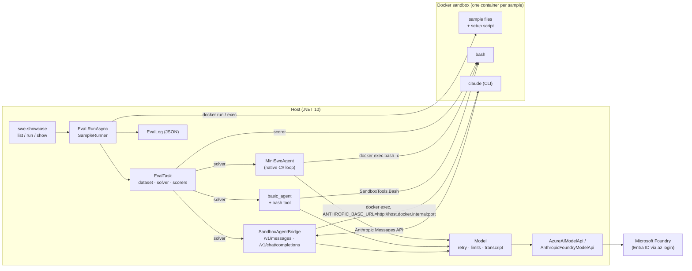

# SWE showcase: Inspect eval components and Inspect SWE agents in C#

Four projects extend the provider port with a minimal, faithful C# port of Inspect AI's eval components and
two Inspect SWE agents, plus a console app that runs them against the user's Microsoft Foundry deployments:

| Project | What it is |
|---|---|
| `src/InspectAzureAI.Eval` | Datasets and samples, tasks, solvers and `TaskState`, scorers and metrics, agents, tools, sandboxes (Docker and local), the `Model` wrapper (retry loop, limits, transcript), the sandbox **agent bridge**, an eval runner and a JSON eval log. |
| `src/InspectAzureAI.Swe` | **mini-swe-agent** (a native C# port of the upstream v2 `DefaultAgent` bash tool-calling loop) and **Claude Code** (the real CLI binary inside the sandbox, its Anthropic API calls proxied to the host bridge and served by the Azure providers). |
| `src/InspectAzureAI.Maf` | A **Microsoft Agent Framework** `ChatClientAgent` as an Inspect agent: an `IChatClient` over the agent bridge serves its model calls in-process, Inspect tools are wrapped as `AIFunction`s ([agent-framework.md](agent-framework.md)). |
| `src/InspectAzureAI.SweShowcase` | The `swe-showcase` console app with three built-in tasks, a Docker sandbox image, and a fully offline `--fake` mode. |
| `src/InspectAzureAI.ModelMatrix` | The `model-matrix` console app: every deployment on the resource × one task × one agent (Claude Code by default), with a results table, a JSON summary and an optional Markdown table. |
| `tests/InspectAzureAI.Eval.Tests`, `tests/InspectAzureAI.Swe.Tests`, `tests/InspectAzureAI.ModelMatrix.Tests` | xunit suites; Docker- and network-dependent tests are gated by `[DockerFact]` / `[NetworkFact]`. |

The design specification is [swe-showcase-design.md](swe-showcase-design.md); this document is the user-facing
guide, the Python → C# mapping and the record of every deliberate deviation from the Python sources.

## Architecture



- The **runner** initialises the sandbox provider once per task (building the image), then runs every
  (sample, epoch) with bounded concurrency: container up, files copied, setup script, the solver, the scorers,
  container down, one `EvalSample` in the log.
- **Agents** are `AgentDef`s turned into solvers with `Agents.AsSolver`; the sample's ambient `SampleContext`
  gives them the model, the sandbox, the store, the transcript and `score()`.
- **Claude Code** is the only component that talks HTTP: the CLI inside the container is pointed at the
  host-side `SandboxAgentBridge` (`ANTHROPIC_BASE_URL=http://host.docker.internal:<port>`, a per-run bearer
  token), which translates the Anthropic Messages API into `Model.GenerateAsync` calls and reconstructs the
  agent's conversation from the request/response threads.
- **Agent Framework** (`--agent maf`) talks no HTTP: the framework's `ChatClientAgent` is given an
  `InspectChatClient`, an `IChatClient` over the same `AgentBridge`, so its function-calling loop runs in-process
  while every model call, approval decision and limit is Inspect's; the sandbox `bash` tool is handed to the
  framework as an `AIFunction`.
- Every model call goes through `Model`, so the retry loop, the message/token limits, the `ModelEvent`s in the
  transcript and the usage in the log are the same for all four agents.

## How to run

Prerequisites: .NET 10 SDK, Docker (for the default sandbox), the Azure CLI signed in, and a Foundry endpoint:

```bash
az login                                   # Entra ID only; no API keys are read
export AZUREAI_BASE_URL=https://<resource>.services.ai.azure.com/models
export INSPECT_AZUREAI_MODEL=gpt-5.4-mini  # optional default deployment
docker version                             # the daemon must be running

# offline smoke test (no network, no Docker): a scripted model solves sample 1 on the host
dotnet run --project src/InspectAzureAI.SweShowcase -- run --fake --sandbox local --task hello-swe --agent mini-swe

# the real thing: build the sandbox image, run mini-swe-agent on every hello-swe sample
dotnet run --project src/InspectAzureAI.SweShowcase -- run --task hello-swe --agent mini-swe

# Claude Code on a Claude deployment (the Anthropic route is picked from the model name)
dotnet run --project src/InspectAzureAI.SweShowcase -- run --task pytest-fix --agent claude-code --model claude-sonnet-4-6

# the inspect_swe docs example, model-graded
dotnet run --project src/InspectAzureAI.SweShowcase -- run --task system-explorer --agent basic --limit 1

# a Microsoft Agent Framework agent, its model calls bridged in-process to the deployment
dotnet run --project src/InspectAzureAI.SweShowcase -- run --task hello-swe --agent maf --attempts 2

# inspect a log
dotnet run --project src/InspectAzureAI.SweShowcase -- show logs/<timestamp>_hello-swe_<id>.json
```

Instead of exporting the endpoint in every shell, put it in the (gitignored) launch profile
`src/InspectAzureAI.SweShowcase/Properties/launchSettings.json` under `profiles.<name>.environmentVariables`;
`dotnet run` applies it automatically, and `--no-launch-profile` switches it off.

The first Docker run builds `src/InspectAzureAI.SweShowcase/sandbox/Dockerfile` (`python:3.12-slim-bookworm`
plus bash, git, curl, procps, coreutils and pytest) as `inspect-swe-sandbox:<content hash>`; later runs reuse
it until the Dockerfile changes. Claude Code's binary is downloaded on the host (cached under
`~/.cache/inspect-azureai/claude-code-downloads`) and copied into the container at run time, so the image
needs no Node.js.

`run` prints one line per sample start and completion (id, epoch, score, tokens, time), the log path, a
metrics table and the exit code: **0** ok, **1** at least one sample errored (or the run aborted), **2** usage
error or missing prerequisite (no endpoint, task data not built), **3** sign-in, Azure or runtime failure. A
sign-in problem is detected before any sample starts (a token is acquired up front) and reported with the
`az login` hints.

## Commands and flags

```
swe-showcase list
swe-showcase run --task <name> --agent mini-swe|claude-code|basic|maf [options]
swe-showcase show <log.eval|log.json>
```

(`swe-showcase` stands for `dotnet run --project src/InspectAzureAI.SweShowcase --`.)

| Flag | Meaning |
|---|---|
| `--task <name>` | `hello-swe`, `pytest-fix`, `system-explorer` or `ctf` (required). |
| `--agent <name>` | `mini-swe`, `claude-code`, `basic` or `maf` (required); `maf` is a Microsoft Agent Framework `ChatClientAgent` with the sandbox `bash` tool ([agent-framework.md](agent-framework.md)). |
| `--model <deployment>` | Foundry deployment; default `$INSPECT_AZUREAI_MODEL`, else `gpt-5.4-mini`. |
| `--route models\|anthropic` | Model-inference route (default) or the Anthropic Messages route; `claude-*` names take the Anthropic route automatically. |
| `--limit N` | Run only the first N samples. |
| `--sample-id ID` | Run only this sample id (repeatable; wins over `--limit`). |
| `--epochs N` | Run every sample N times; epoch scores are reduced with `mean`. |
| `--max-samples N` | Samples in flight at once (default 4). |
| `--attempts N` | Submissions the agent may make; an incorrect one is scored through `score()` and the agent is told to retry (default 1). |
| `--sandbox docker\|local` | `docker` (default) builds the showcase image and runs one container per sample; `local` runs the sample on this host in a fresh temp directory — **demo only**: the agent's commands run unconfined on your machine, and the checks need `python3` (and `pytest` for `pytest-fix`) on the PATH. With `--fake` the default is `local`. |
| `--log-dir DIR` | Where the eval log goes (default `logs`, or `$INSPECT_LOG_DIR`). |
| `--log-format eval\|json` | The log format: `eval` (default, the `.eval` zip Inspect's viewer reads; `$INSPECT_LOG_FORMAT` overrides) or `json`. |
| `--no-cleanup` | Keep the containers / temp directories for inspection (their names are logged). |
| `--max-tokens <n\|none>` | `max_tokens` sent; default the provider's `max_tokens()`. |
| `--reasoning-effort <lvl>` | Inspect's `reasoning_effort` (`none\|minimal\|low\|medium\|high\|xhigh\|max`), applied through the model's `GenerateConfig` for all agents. |
| `--model-arg key=value` | Repeatable; the Python `-M` model args (JSON values are parsed). |
| `--approval <policy>` | Tool-call approval: a JSON policy file (`{"approvers": [{"name", "tools", ...}]}`, the structure of Inspect's YAML policies) or a registered approver name (`auto`, `human`). Applied to the bash calls of `mini-swe` and `basic` and to Claude Code's tool calls through the bridge; `reject` answers the call with an approval error, `terminate` ends the sample with the `operator` limit. |
| `--cache <expiry\|off>` | Inspect's prompt cache (`generate(cache=)`) for every model call: `1W`, `3D`, `12h`, ... (`on` = `1W`). A hit replays the stored output without a provider call and is recorded as `cache: read` on the model event; entries live under `$INSPECT_CACHE_DIR` or the user cache directory. |
| `--compaction <strategy>` | `edit\|summary\|trim\|auto[:threshold]` — compact the conversation once it reaches the threshold (a token count, or a fraction of the context window; default 0.9), as `react(compaction=)` does. `mini-swe` and `basic` only; Claude Code compacts its own context, so the flag is a usage error there. |
| `--hooks <name[=file]>` | Lifecycle hooks: `sample-log` prints one `[hook]` line per run, task, sample and model event (`sample-log=FILE` writes them to a file). Repeatable / comma-separated. |
| `--cost-limit <dollars>` | Stop a sample once its priced model usage exceeds this; needs prices for the model (a limit without prices is exit 2). |
| `--model-cost-config FILE` | JSON prices per model (`{"<deployment>": {"input", "output", "input_cache_write", "input_cache_read"}}` in $/million tokens; `$INSPECT_AZUREAI_MODEL_COST_CONFIG` applies one to every run). Costs then appear on the log's usage (`total_cost`), in the summary and in `show`. |
| `--fake` | A scripted model that solves sample 1 of the task offline (see below). |
| `--debug` | Claude Code debug capture (stdout/stderr into the sample store) and full exception traces. |

`list` prints the tasks (sample count, scorer), the agents and the sandbox Dockerfile path. `show` reads either
log format (`read_eval_log`) and prints the run's status, token usage and cost, the recorded approval policy and
cost limit, the metrics table and one line per sample (scores, tokens, cost, time, model/tool call counts, what
the cache, approvals and compaction did, limit, error), the first line of the submitted answer and the last line
of each score's explanation.

### `--fake`: the offline mode

`--fake` replaces the Foundry model with `ScriptedModelApi` (`InspectAzureAI.Eval.Testing`). Its turns are
computed from the conversation, so runs are deterministic under any concurrency: the script solves sample 1
of the chosen task with the turn shape the agent expects — mini-swe: `bash` calls carrying a `command`, then
`printf` of the `COMPLETE_TASK_AND_SUBMIT_FINAL_OUTPUT` marker; basic: `bash` calls carrying `cmd`, then a
`submit` — gives up on every other sample (so an offline run reports 1 correct), and answers a
`model_graded_qa` judge prompt with `GRADE: C` when the submission contains the expected answer. `--fake`
refuses `--agent claude-code` (exit 2): the CLI needs a real sandbox with the binary installed and a real
model behind the bridge. `--fake --sandbox docker` builds the image and runs the script in containers, which
is a useful smoke test of the Docker provider without any model cost.

## Every deployment at once: `model-matrix`

`src/InspectAzureAI.ModelMatrix` is a second console app on the same runner: it discovers every deployment on the
Foundry resource behind `AZUREAI_BASE_URL` (through Azure Resource Manager, the same `FoundryCatalog` the sample's
`models` command uses), runs one showcase task with one agent against each of them — Claude Code on `hello-swe` by
default — and prints a results matrix. Each deployment is its own **eval set** in `<log-dir>/<deployment>/`
(`EvalSet.RunAsync`, the port of `inspect eval-set`): running the matrix again with the same `--log-dir` resumes
it — a complete log is reused without running (the row says `reused`), an incomplete one is re-run reusing its
completed samples, and an eval that errors is retried immediately (`--retry-attempts`, default 2). The run's
summary goes to `<log-dir>/<timestamp>_matrix_<task>.json` (or `--out`) and, with `--markdown`, to a Markdown table.

```bash
# Claude Code × every chat deployment, one sample each, three deployments at a time
dotnet run --project src/InspectAzureAI.ModelMatrix -- --parallel 3 --markdown docs/model-matrix-results.md

# mini-swe-agent on the OpenAI and DeepSeek deployments only, both hello-swe samples 1 and 2
dotnet run --project src/InspectAzureAI.ModelMatrix -- --agent mini-swe --format OpenAI,DeepSeek --sample-id 1 --sample-id 2

# offline: the scripted model on a fixed four-deployment catalog (agent defaults to mini-swe, sandbox to local)
dotnet run --project src/InspectAzureAI.ModelMatrix -- --fake
```

| Flag | Meaning |
|---|---|
| `--only a,b` / `--skip a,b` | Deployment names to run / leave out (repeatable, case-insensitive). `--only` defines the rows; everything else is not part of the matrix. |
| `--format OpenAI,Anthropic` | Keep only these ARM model formats. |
| `--include-non-chat` | Also try deployments whose capabilities say `chatCompletion=false` (image, parsing and embedding models are skipped otherwise). |
| `--parallel N` | Deployments evaluated at the same time (default 1). The sandbox image is built once and shared. |
| `--retry-attempts N` | Immediate eval-set retries of a deployment whose eval errors, reusing its completed samples (default 2; Python's `eval_set` defaults to 10). |
| `--model-cost-config FILE`, `--cost-limit`, `--cache`, `--compaction`, `--hooks`, `--approval`, `--log-format` | The showcase flags above, applied to every deployment; with prices the matrix reports a `cost` column and total, and hook lines are prefixed with the deployment name. |
| `--out FILE`, `--markdown FILE` | The JSON summary and an optional Markdown table. |
| `--resume FILE` | Rerun only the deployments that errored in a previous matrix JSON (same task and agent) and carry its other rows over — for transient failures, so a 20-model run is not repeated for one network blip. Not with `--only`. |
| `--show FILE` | Print a saved matrix JSON (and re-render its Markdown with `--markdown`) without running anything. |
| the showcase's run flags | `--task`, `--agent`, `--limit` (default **1** sample per deployment), `--sample-id`, `--epochs`, `--max-samples`, `--attempts`, `--sandbox`, `--log-dir`, `--no-cleanup`, `--max-tokens`, `--reasoning-effort`, `--model-arg`, `--fake`, `--debug` — same meaning as above. `--model` and `--route` are rejected: the deployment list is the resource's, and each deployment takes the route its ARM `Format` implies (`Anthropic` → the Messages route, everything else → the model-inference route, with `model_format=<Format>` passed as a model arg). |

Each row records the deployment's status — `ok` (accuracy 1), `partial`, `incorrect`, `unscored`, `error`
(the eval or a sample failed; the first line of the error is the note) or `skipped` (with the reason) — plus
accuracy, tokens, cost (when the model is priced), throughput (`tok/s`: tokens over wall time), wall time,
whether the row was reused from an earlier run, and the eval log path. A failing deployment never stops the matrix; only a sign-in
failure or Ctrl-C does. Exit codes: **0** every selected deployment completed (incorrect answers are results,
not errors), **1** at least one deployment errored, **2** usage or missing prerequisite, **3** sign-in, Azure or
runtime failure. The last full run is in [model-matrix-results.md](model-matrix-results.md).

## The four tasks

Task data lives under `src/InspectAzureAI.SweShowcase/tasks/<name>/dataset.json` (loaded with
`Datasets.Json`, file references resolved relative to the dataset file) and is copied next to the executable;
the C# task definitions are in `BuiltinTasks/` rather than the design's `Tasks/` because that name collides
with the `tasks/` data directory on case-insensitive filesystems.
All four set `fail_on_error=False` (a broken sample is recorded and reported through the exit code rather than
aborting the demo), a 200-message limit and a 20-minute time limit per sample.

| Task | Samples | Sandbox | Scorer |
|---|---|---|---|
| `hello-swe` | 1: create `hello.py` printing `Hello, Inspect!`; 2: add a `--reverse` flag to the provided `words.py`; 3: fix an off-by-one in the provided `stats.py` so it prints 35. | showcase Dockerfile | `exec_check`: runs the sample's `metadata.check` bash command in the sandbox; exit 0 → `C`, else `I`; explanation = the command output. |
| `pytest-fix` | 1: `textkit.slugify` (does not lower-case or collapse whitespace); 2: `mathkit.is_prime` (misses perfect squares). Each ships a package and a failing pytest suite. | showcase Dockerfile | `exec_check` with `check = python3 -m pytest -q` (plus a guard that the tests are still there). |
| `system-explorer` | The inspect_swe `examples/system_explorer` idea: 1: which Python version is installed; 2: how many CPU cores the machine reports. | showcase Dockerfile | `Scorers.ModelGradedQa()` — the task model is the judge (the default template, instructions and `GRADE:` regex of `scorer/_model.py`). |
| `ctf` | The Capture the Flag task of the Inspect docs (`tasks.qmd`, `react-agent.qmd`): each sample's `setup` script plants a `picoCTF{...}` flag in the sandbox — 1: a dotfile under `challenge/.cache`; 2: a base64-encoded `challenge/encoded.txt`; 3: printable text inside the binary `challenge/vault.bin`. The docs' CTF system prompt is chained before the agent. | showcase Dockerfile | `Scorers.Includes()` — the submitted answer contains the flag (case-insensitive). |

## Verified against a live Foundry resource

Run on 2026-09-04 against `https://myfoundry0406.services.ai.azure.com/models` (Entra ID through `az login`,
no API keys) with Docker 29.5 on an arm64 host, `--sandbox docker` and `--limit 1` / `--sample-id`; no
`--max-tokens`, `--reasoning-effort` or temperature was passed (gpt-5 deployments reject any temperature other
than 1, and the showcase never sends one unless asked). Every run completed, was scored, wrote its log and
exited 0, and `docker ps -a` showed no leftover `inspect-swe-*` container afterwards. Tokens and times are the
values in the logs (`show` prints the same).

| Task (sample) | Agent | Model (route) | Result | Tokens | Time | Notes |
|---|---|---|---|---|---|---|
| hello-swe (1) | mini-swe | gpt-5.4-mini (models) | `exec_check=C` | 4,466 | 9.4 s | 4 model calls, 4 `bash` actions (`pwd && ls`, heredoc write, `od` byte check, `echo COMPLETE_TASK_AND_SUBMIT_FINAL_OUTPUT`); observations are the `mini.yaml` JSON; the store holds exit status, submission, trajectory and api calls. |
| hello-swe (1) | basic | gpt-5.4-mini (models) | `exec_check=C` | 801 | 4.8 s | One `bash(cmd=…)` call, then `submit(answer="Done")`; both recorded as `ToolEvent`s; `output.completion` is the submitted answer. |
| hello-swe (1) | claude-code | claude-sonnet-4-6 (anthropic) | `exec_check=I` | 72,040 | 47.4 s | First run: Claude Code 2.1.236 linux-arm64 (316 MiB) downloaded to the host cache, installed under `/var/tmp/.5c95f967ca830048/`, `settings.json` seeded; 3 bridged `/v1/messages` calls (24 tools each) over `host.docker.internal`; `Write` → `Bash` → text. The model wrote `/hello.py` although its system prompt said `Primary working directory: /workspace`, so the check failed — a model choice, not a translation fault (the same prompt text reached it that the CLI built). |
| hello-swe (2, `--sample-id 2`) | claude-code | claude-sonnet-4-6 (anthropic) | `exec_check=C` | 97,023 | 19.9 s | Exercises `files` (`words.py` copied into `/workspace`); `Read` (a wrong `/root/words.py` guess, then `/workspace/words.py`), `Edit`, final text; 4 bridged calls; the cached binary was reused (no download). |
| system-explorer (1) | mini-swe | gpt-5.4-mini (models) | `model_graded_qa=I` | 3,480 | 8.0 s | The grader is the same deployment: the grading prompt is the verbatim `scorer/_model.py` template, the verdict `GRADE: I` was parsed and the grader exchange kept under `metadata.grading`. The agent ran `python3 --version`, answered once without a tool call (one `format_error_template` turn), then submitted with nothing after the marker, so the graded answer was its last text, which never stated the version. |
| hello-swe (1) | claude-code | gpt-5.4-mini (models) | `exec_check=C` | 32,069 | 12.9 s | Claude Code driven by a non-Anthropic deployment through the bridge: `Write` then a text answer, 2 calls, 15,488 cached input tokens on the second; stderr carried the CLI's `[claude-code:unrecognized_model]` warning (exit 0, classified as success). |
| hello-swe (1) | maf | gpt-5.4-mini (models) | `exec_check=C` | 807 | 5.3 s | 2026-09-07, Microsoft.Agents.AI 1.20.0: the framework's `ChatClientAgent` made 2 bridged calls in-process, invoked `bash(cmd=…)` (wrote `hello.py`) and `submit(answer="Done")`, both as `ToolEvent`s; no HTTP, no leftover container. |
| hello-swe (2, `--sample-id 2`) | maf | claude-sonnet-4-6 (anthropic) | `exec_check=C` | 9,059 | 26.9 s | 2026-09-07: the same Agent Framework agent on the Anthropic route, 6 bridged calls and 5 tool calls (`bash` reads and rewrites `words.py`, then `submit`); the submission text is `output.completion`. |
| hello-swe (2, `--sample-id 2`) | claude-code | claude-sonnet-4-6 (anthropic) | `exec_check=C` | 97,028 | 20.8 s | Re-run after the review fix pass. The first post-fix attempt failed with the CLI's "issue with the selected model" message and zero model calls because the bridge had been narrowed to a `127.0.0.1` prefix; restoring the wildcard prefix (fidelity note 1) fixed it, and a regression test now sends a request with `Host: host.docker.internal:<port>`. |

What the runs showed about the port (recorded so they are not mistaken for bugs):

- Claude Code 2.1.236 sends `system` as three blocks (`x-anthropic-billing-header: …`, its identity line, the
  main prompt). Like the Python bridge, one `ChatMessageSystem` per block is kept and all three are forwarded
  (the API drops a block that starts with such a header, so blocks must not be concatenated).
- Presented with a non-Anthropic model name, the CLI puts its `<system-reminder>` context into `role: system`
  entries inside `messages[]` (with Sonnet the same text travels inside the user and `tool_result` blocks); the
  bridge maps them to mid-conversation `ChatMessageSystem` messages, which the model-inference route accepts.
- `call_*` tool-call ids from the model-inference route pass through as `tool_use` ids and come back unchanged
  as `tool_use_id`; Anthropic `toolu_*` ids do the same on the Anthropic route.
- The model-inference route applies Python's `DEFAULT_MAX_TOKENS` (2048) when `--max-tokens` is absent (the
  Anthropic route used 32,000). For a reasoning deployment that bounds visible plus reasoning output, so pass
  `--max-tokens` for larger tasks.
- Sonnet through the bridge paid full input price on every turn (`cache_creation` / `cache_read` 0 on 24k-token
  requests): the bridge drops the CLI's `cache_control` markers as Python does, and `AnthropicFoundryModelApi`
  adds none of its own (Python's provider does under `cache_prompt="auto"`). gpt-5.4-mini cached automatically.
- A Claude Code sample's `total_time` includes the binary download on a cold host cache (47 s cold versus
  20 s warm above), as in Python, where the download also happens inside the agent.
- `--debug` stores every JSONL line and stderr chunk in the sample store (`claude_code_debug`) and logs only
  parse errors and stderr in the `Claude Code Debug Output:` block, exactly as `claude_code.py` traces.

## Python → C# mapping

### inspect_ai (→ `InspectAzureAI.Eval`)

| Python | C# |
|---|---|
| `dataset/_dataset.py` `Sample`, `Dataset`, `MemoryDataset`, `FieldSpec` | `Dataset/Sample.cs`, `IDataset.cs`, `MemoryDataset.cs`, `FieldSpec.cs` |
| `dataset/_util.py` (record → sample), `dataset/_sources/util.py` `resolve_sample_files` | `Dataset/SampleRecords.cs` |
| `dataset/_sources/json.py` `json_dataset`, `_sources/csv.py` `csv_dataset` | `Dataset/Datasets.cs`, `CsvParser.cs` |
| `_eval/task/task.py` `Task`, `_eval/task/epochs.py` `Epochs` | `Tasks/EvalTask.cs`, `Tasks/Epochs.cs` |
| `solver/_task_state.py` `TaskState` | `Solvers/TaskState.cs`, `SampleInput.cs` |
| `solver/_solver.py` `Solver`/`Generate`, `_chain.py` `chain`, `_use_tools.py` `use_tools` | `Solvers/SolverDelegates.cs`, `Solvers/Solvers.cs` |
| `solver/_prompt.py` `system_message`, `prompt_template`, `user_message` | `Solvers/PromptSolvers.cs` |
| `solver/_basic_agent.py` `basic_agent` | `Solvers/BasicAgent.cs` |
| `model/_model.py` `Model.generate` + the solver `generate()` tool loop | `Model/Model.cs`, `Solvers/GenerateLoop.cs` |
| `model/_retry.py`, `model/_generate_config.py` (merge) | `Model/ModelRetryOptions.cs`, `Model/ModelApiHooks.cs`, `Model/GenerateConfigExtensions.cs` |
| `model/_model.py` `get_model()` for the Foundry providers | `Model/FoundryModels.cs` |
| `log/_transcript.py` `ModelEvent`, `_model.py` event sinks | `Model/ModelEvent.cs`, `Model/IModelEventSink.cs`, `Model/ModelGenerateException.cs` |
| `model/_call_tools.py` `execute_tools`, `tool/_tool.py`, `_tool_def.py`, `_tool_params.py` | `Tools/ToolExecutor.cs`, `Tools/ToolDef.cs`, `Tools/ToolResult.cs`, `Tools/ToolErrors.cs` |
| `tool/_tools/_execute.py` `bash`, `python` | `Tools/SandboxTools.cs` |
| `scorer/_metric.py` `Score`, `Value`, `CORRECT`…, `SampleScore`, `Metric` | `Scorers/Score.cs`, `ScoreValue.cs`, `ScorerDelegates.cs`, `SampleScore.cs` |
| `scorer/_target.py` `Target` | `Scorers/Target.cs` |
| `scorer/_match.py` `includes`, `match`, `_pattern.py` `pattern`, `_common.py` | `Scorers/Scorers.cs`, `Scorers/MatchScorers.cs` |
| `scorer/_model.py` `model_graded_qa`, `model_graded_fact`, templates, `chat_history` | `Scorers/ModelGraded.cs` |
| `scorer/_metrics/accuracy.py`, `mean.py`, `std.py` (`stderr`, `std`) | `Scorers/Metrics.cs` |
| `scorer/_reducer/reducer.py`, `registry.py` (`mean`, `max`, `median`, `mode`, `at_least`, `pass_at`) | `Scorers/Reducers.cs` |
| `scorer/_classification.py` / `_metric.py` `value_to_float` | `Scorers/ValueToFloat.cs` |
| `agent/_agent.py` `AgentState`, `Agent`, `agent()`, `_types.py` `AgentAttempts`, `_as_solver.py` | `Agents/AgentState.cs`, `AgentDelegates.cs`, `AgentAttempts.cs`, `Agents.cs` |
| `agent/_bridge/types.py` (`AgentBridge`, `_track_state` thread tracking), `_bridge/util.py` (model resolution) | `Agents/Bridge/AgentBridge.cs`, `ThreadTracking.cs`, `Mm3Hash.cs` |
| `agent/_bridge/anthropic_api_impl.py` | `Agents/Bridge/AnthropicBridgeApi.cs` |
| `agent/_bridge/completions.py` | `Agents/Bridge/CompletionsBridgeApi.cs` |
| `agent/_bridge/sandbox_agent_bridge.py` + `inspect_sandbox_tools/_agent_bridge/proxy.py` (HTTP + SSE synthesis) | `Agents/Bridge/SandboxAgentBridge.cs`, `SseWriter.cs`, `BridgeJson.cs` |
| `util/_sandbox/environment.py` (`SandboxEnvironment`, `ExecResult`, `SandboxEnvironmentSpec`, output limits) | `Sandbox/ISandboxEnvironment.cs`, `ExecResult.cs`, `SandboxSpec.cs`, `SandboxEnvironments.cs`, `SandboxExceptions.cs`, `SandboxLimits.cs` |
| `util/_sandbox/registry.py` | `Sandbox/SandboxRegistry.cs` |
| `util/_sandbox/local.py` | `Sandbox/Local/LocalSandboxEnvironment.cs`, `LocalSandboxProvider.cs`, `TailByteBuffer.cs` |
| `util/_sandbox/docker/docker.py`, `compose.py`, `util.py`, `failure.py` | `Sandbox/Docker/DockerSandboxProvider.cs`, `DockerSandboxEnvironment.cs`, `DockerCli.cs`, `DockerImages.cs`, `DockerFailures.cs`, `ProcessRunner.cs` |
| `util/_store.py` `Store`/`store()` | `Context/Store.cs` |
| `util/_limit.py` (`message_limit`, `token_limit`, `time_limit`, `LimitExceededError`) | `Context/Limits.cs`, `LimitExceededException.cs` |
| `log/_transcript.py` `Transcript`, events, spans | `Context/Transcript.cs`, `TranscriptEvents.cs` |
| `util/_sandbox/context.py` `sandbox()`, `_eval/task/run.py` `sample_state()` / `score()`, `get_model()` | `Context/SampleContext.cs` |
| `_eval/eval.py` `eval()`, `_eval/task/run.py` `task_run` / `task_run_sample`, `_eval/run.py` | `Runner/Eval.cs`, `SampleRunner.cs`, `EvalOptions.cs` |
| `_eval/task/sandbox.py`, `util/_sandbox/context.py` (files, setup) | `Runner/SandboxSetup.cs` |
| `_eval/task/results.py` (reducers, metrics, `EvalResults`) | `Runner/EvalResultsBuilder.cs` |
| `_display/plain` (progress lines) | `Runner/IEvalReporter.cs` (`ConsoleEvalReporter`) |
| `log/_log.py` (`EvalLog`, `EvalSpec`, `EvalSample`, …), `_util/error.py` `EvalError` | `Log/EvalLog.cs` |
| `log/_file.py` `write_eval_log` / `read_eval_log` (JSON) | `Log/EvalLogWriter.cs`, `Log/Json/*.cs` |
| `model/_providers/mockllm.py` (test model) | `Testing/ScriptedModelApi.cs`, `Testing/FakeSandboxEnvironment.cs` |

### inspect_swe and mini-swe-agent (→ `InspectAzureAI.Swe`)

| Python | C# |
|---|---|
| inspect_swe `_mini_swe_agent/mini_swe_agent.py` (`mini_swe_agent()`, attempts, resume), `resumable_agent.py` | `MiniSwe/MiniSwe.cs`, `MiniSweAgent.cs`, `MiniSweAgentOptions.cs` |
| mini-swe-agent `agents/default.py` `DefaultAgent`, `models/utils/actions_toolcall.py`, `environments/local.py`, `config/mini.yaml` | `MiniSwe/MiniSweAgent.cs`, `MiniSweTemplates.cs` |
| Jinja2 rendering of the `mini.yaml` templates (`DefaultAgent._render_template`, `tojson`) | `MiniSwe/TemplateRenderer.cs` |
| inspect_swe `_claude_code/claude_code.py` `claude_code()` (validation, attempts loop, settings.json, launch) | `ClaudeCode/ClaudeCode.cs`, `ClaudeCodeAgent.cs`, `ClaudeCodeOptions.cs`, `ClaudeCodeCommand.cs` |
| `_claude_code/model.py` `resolve_claude_code_models` | `ClaudeCode/ClaudeCodeModels.cs` |
| `_claude_code/env.py` | `ClaudeCode/ClaudeCodeEnv.cs` |
| `_claude_code/agentbinary.py`, `_util/agentbinary.py`, `_util/download.py`, `_util/checksum.py`, `_util/platform.py` | `ClaudeCode/ClaudeCodeBinary.cs` |
| `_claude_code/_events/stream.py`, `live_consumer.py` (`last_stop_reason` only) | `ClaudeCode/ClaudeCodeStream.cs` |
| `claude_code.py` exit classification (`_is_claude_code_refusal_exit`, retry rule) | `ClaudeCode/ClaudeCodeExit.cs` |
| `_util/messages.py` (`user_turn`, `build_user_prompt`) | `Util/AgentPrompt.cs` |
| `_util/sandbox.py` (platform detection, agent cwd, checked exec) | `Util/SandboxUtil.cs` |

### The showcase (→ `InspectAzureAI.SweShowcase`)

| Python | C# |
|---|---|
| `inspect eval` / `inspect list tasks` (CLI), `@task` registry | `Cli.cs`, `RunOptions.cs`, `ShowcaseTasks.cs`, `AgentChoice.cs` |
| inspect_swe `examples/system_explorer/task.py` | `BuiltinTasks/SystemExplorerTask.cs` (+ `HelloSweTask.cs`, `PytestFixTask.cs`, `ExecCheckScorer.cs`) |
| `mockllm` scripted runs | `FakeScripts.cs` |

## Fidelity notes

Numbered so a reader of the code can cite them. Each is a deliberate deviation from (or an addition to) the
Python behaviour; anything not listed here is intended to match the Python sources named in the mapping.

### Overall design

1. The bridge proxy runs on the **host** and is reached from the container through `host.docker.internal`,
   not inside the sandbox over file RPC as in `inspect_sandbox_tools`; consequently the bridge requires a
   per-instance random bearer/`x-api-key` token (the server is reachable over the network, unlike Python's
   in-sandbox proxy), `ANTHROPIC_BASE_URL` is the host-side bridge URL (`http://host.docker.internal:<port>`)
   and `ANTHROPIC_AUTH_TOKEN` is that token rather than Python's `http://localhost:<port>` and literal dummy
   token, and the bridge port is ephemeral (`Port = 0`) instead of the sample-store counter starting at 3001.
   For a Docker sandbox the bridge listens on the wildcard prefix (every host interface): `HttpListener`
   matches each request's `Host` header against its prefixes, and the container's requests arrive as
   `host.docker.internal:<port>`, so a prefix naming `127.0.0.1` answers them with 400 and Claude Code reports
   the model as missing (a narrower binding was tried and reverted for exactly this reason). The token is the
   access control; for a local sandbox the bridge binds `127.0.0.1` only.
2. mini-swe-agent is a **native C# loop** against `Model` and `ISandboxEnvironment`, not the Python package
   bridged through litellm inside the sandbox; the sandbox image therefore needs no Python packaging.
3. There is no model-info registry or pricing; `WorkingTime` is written equal to `TotalTime` because model
   waiting (retry backoff) time is not tracked and subtracted as Python's `sample_waiting_time()` does.
4. `Model` retries are bounded: exponential backoff with full jitter from `InitialBackoffSeconds` capped at
   `MaxBackoffSeconds` (default 60 s, 5 retries), whereas Python uses tenacity's
   `wait_exponential_jitter(initial=3, max=30 min)` with unbounded retries by default.
5. The default Docker image is `python:3.12-slim-bookworm`.
6. Eval logs are plain JSON (`EvalLog.Version = 1`), not `.eval` archives (Python's version 2).
7. The showcase's `--sandbox local` runs the agent's commands on the host in a temp directory and is
   documented as demo-only; the showcase tasks set `fail_on_error=False`, a 200-message and a 20-minute
   limit, and `swe-showcase run` acquires an Entra ID token before the run so a sign-in failure is exit
   code 3 up front rather than an error on every sample.

### Tools and sandboxes

8. Tool output truncation keeps the **tail**; Python's `truncate_string_to_bytes` middle-truncates.
9. An unknown tool name is reported as `ToolCallError("unknown", "Tool X not found")`; Python raises
   `ToolParsingError` and reports type `parsing`.
10. `ToolExecutor` validates only `Parameters.Required` presence; Python runs a Draft-7 JSON-schema validator
    over the argument types.
11. `SandboxTools.Bash`'s parameter is named `cmd` (the Python bash tool's is `command`); the bash/python result
    is `stderr + "\n" + stdout` (stderr first, only when non-empty), and `SandboxTools.Python` runs
    `bash --login -c "python3 -"` with the code on stdin — both as in the current `_execute.py`.
12. Tool errors: `is_a_directory` is mapped from an `IOException` whose message contains "is a directory" (what
    the local sandbox throws); `unicode_decode` from `DecoderFallbackException`.
13. `LocalSandboxProvider`'s cleanup keeps the temp directory when the cleanup flag is false (so `--no-cleanup`
    can inspect it, mirroring the docker provider); Python's local sandbox always deletes it. A missing
    executable is a failed `ExecResult` (return code 127, stderr names the command) rather than Python's
    `FileNotFoundError`. No `SandboxEvent` is emitted by the sandboxes (the record exists).
14. The Docker provider drives the bare `docker` CLI against one container per sample instead of docker
    compose projects: compose files, multi-service sandboxes, `x-default`, port mappings, `connection()`,
    `SAMPLE_METADATA_*` interpolation (metadata is accepted and ignored), `sandbox_unavailable_diagnostics`
    logging, the per-process exec concurrency semaphore, `timeout_retry` and image pruning are not ported.
    Containers start with `docker run -d --init … sleep infinity` (falling back to `tail -f /dev/null` when
    the image has no `sleep`), the WORKDIR is read with `docker inspect`, and a missing image reference is
    pulled explicitly in `task_init`.
15. Images built from a Dockerfile are tagged by content hash (`inspect-swe-sandbox:<sha256[:12]>`, every file
    under the context — no `.dockerignore` handling), so an unchanged context never rebuilds and task cleanup
    never removes images.
16. The in-container timeout wrapper is `timeout -s KILL <secs>` (Python: `timeout -k 5s <secs>s`), so a
    timed-out command exits 137 or 124; 124 always and 137/143 only when the wall clock reached the timeout
    map to `SandboxTimeoutException`. A `docker exec` that outlives timeout + 10 s on the host is killed and
    raised as `SandboxTimeoutException` instead of being retried.
17. Files are written by streaming raw bytes to `sh -c 'mkdir -p "$(dirname "$1")" && cat > "$1"'` over
    `docker exec -i` (Python: base64 + tee) and read back with `docker exec cat` (Python: `docker compose cp`
    staging through a host temp file); the read limit kills `cat` once stdout passes the cap.
18. The Docker failure classifier also matches bare-`docker exec` daemon wordings ("is not running", "No such
    container", "is paused"/"is restarting", "Cannot connect to the Docker daemon") because the compose-only
    `service "x" is not running` wording never appears; Docker CLI failures carry the last 8 KiB of stderr.
    Timeout messages and `TruncatedOutput` follow the local provider (`Command timed out after N seconds:
    <cmd>`, stdout and stderr joined with a newline) so both providers look the same to tool callers.
19. `SandboxRegistry` registers `local` and `docker` in a static dictionary rather than a module initializer
    (CA2255 forbids the latter in a library).
63. Both sandboxes run commands through one `ProcessRunner`, which stops draining a command's stdout/stderr
    pipes 2 s after the process has exited or been killed and returns what was captured; a backgrounded or
    orphaned child that inherited the pipes (`server &`, a `(sleep 30 &)` subshell re-parented away from the
    killed tree) would otherwise hold the sample forever. Python's `subprocess()` waits for EOF (and hangs the
    same way). The abandoned reads end on their own when that child exits.
64. Cancelling or timing out a Docker exec kills only the host `docker exec` client, exactly as Python's
    `subprocess()` does: a process inside the container survives a host-side cancellation (an in-container
    `timeout -s KILL` wrapper is what ends it on a *command* timeout). A solver time limit or Ctrl+C can
    therefore leave the agent running while the scorers execute in the same container.
65. Environment variables reach `docker exec` as bare `-e NAME` flags valued through the CLI's own
    environment (Python's compose exec passes `--env K=V` on the command line), so the bridge token never
    appears in the host process list. The image content hash streams files, skips `.git` and is memoized
    against a path/size/mtime fingerprint; a `.dockerignore` is not honoured (an ignored file still changes
    the tag).

### Model, context and limits

20. Every provider attempt records its own `ModelEvent` (`Retries` = attempt index) delivered to both the
    transcript and any installed sink; Python records one pending event completed in place and routes it to
    the sink instead of the transcript.
21. `Limits.CheckTimeLimit` is cooperative (called by the runner) rather than Python's cancel-scope
    `time_limit`; sample time limits are a linked `CancellationTokenSource` that cancels the solver at
    `TimeLimit` and scoring at `TimeLimit / 2` (Python's `scoring_time_limit`). The solver cancellation
    becomes a `time` `EvalSampleLimit` and the sample is still scored; a scoring timeout is an ordinary sample
    error; a solver that ignores its token is not interrupted.
22. The eval-level "active model config" merge of `resolve_generate_config` is not applied: the eval model is
    `new Model(api, task.Config.Merge(model.Config), retry)` (the model's own config layers over the task's,
    mirroring `task.config.merge(eval config)`), so `SampleContext.ActiveModel` is a distinct `Model` sharing
    the same `IModelApi`.
23. No `SampleInitEvent` / `SampleLimitEvent` are emitted; limits are recorded on `EvalSample.Limit` and errors
    as `ErrorEvent`. Solver steps are named `setup` / `solver` (delegates carry no registry names); scorer
    steps use the unique scorer name; `ScoreEvent` carries no scorer field; `Solvers.Chain` emits no
    per-solver span or `StateEvent` diff (nested chains are still unrolled).
24. `SampleContext.Scorer` (`score()`) copies the sample's own `TaskState` and takes only messages/output from
    a state that is not the sample's own instance; Python does that copy only for an `AgentState`. Outside the
    runner (unit tests) the SWE agents fall back to a synthesized `TaskState` where Python's `score()` raises.
66. Python scopes the message/token limits around the solvers and scores outside them; the runner calls
    `Limits.Suspend()` before the scorers run, so a model-graded scorer still generates after a sample hit its
    limit while its usage keeps accumulating into the log.

### Log

25. Every non-finite double (NaN, ±Infinity) and the unscored NaN score sentinel are written as `null` because
    JSON has no constants for them (Python writes `NaN`/`Infinity` via `ser_json_inf_nan="constants"`); a
    `null` reads back as NaN for non-nullable doubles (e.g. `EvalMetric.Value`) and `ScoreValue`, and as null
    for nullable doubles. Null-valued properties are omitted rather than written as `null`; the reader treats
    missing and null identically.
26. `EvalError.Traceback` carries `Exception.ToString()` (no ANSI traceback); a single-value `Target` is
    written as a string and a multi-value one as a list because the C# `Target` is always a list;
    `ToolEvent.Working` is written as `working_time` in seconds and `ToolTruncation` as Python's `[raw, shown]`
    list; `ErrorEvent` nests `{message, traceback}` under `error`; `ModelOutput` writes an extra `completion`
    only when an explicitly set `Completion` differs from the first choice's text.
27. The log file name uses the local wall-clock stamp without the UTC offset (`<yyyy-MM-ddTHH-mm-ss>`), a
    filename-safe task name (characters outside `[A-Za-z0-9-_.]` become `-`) and 6 random hex characters in
    place of Python's task id.
28. `EvalResults` are computed for error and cancelled runs from the samples that were recorded (Python's error
    path leaves results empty); on cancellation the log is written with status `cancelled` before the
    `OperationCanceledException` propagates. In-flight samples cancelled by a fail-on-error abort or by the
    caller are logged with the cancellation as their error; samples still queued are never logged.
29. `EvalScore.Reducer` comes from `Reducers.NameOf` (only reducers built by `Reducers` carry a name; a custom
    delegate logs null); the default mean logs `reducer = null` as Python's implicit mean does; an explicit
    empty reducer list disables reduction. Sample ids given in `EvalOptions.SampleIds` match samples textually
    (invariant `ToString`); missing ids are assigned 1-based and duplicates raise `InvalidOperationException`.

### Datasets and tasks

30. `MemoryDataset.Shuffle` uses .NET `Random(seed)`, so seeded orders are reproducible within .NET but differ
    from Python's `random.Random(seed)` sequence.
31. Without a `FieldSpec.Metadata` list only the record's own `metadata` field (object or JSON string) becomes
    sample metadata, exactly as `dataset/_util.py` does. Record errors raise `InvalidDataException` carrying
    Python's `ValueError` messages; malformed JSON raises `JsonException`; JSONL loading skips blank lines
    (jsonlines raises); `IDataset.Slice(Range)` replaces Python slicing and clamps out-of-range bounds; `Epochs`
    validates `Count >= 1` up front (Python validates in `eval()`).
32. `Sample.Files` / `Setup` / `Sandbox.Config` values are resolved to absolute paths only when the referenced
    file exists relative to the dataset file; a value naming a directory expands recursively under its key;
    data URIs decode base64 or percent-encoded text; the empty string is always literal contents; `http(s)`
    URLs are not downloaded (Python fetches them). The setup script runs the Python way (written to
    `/tmp/<id>`, `chmod +x`, `env <file>`, `INSPECT_SANDBOX_SETUP_TIMEOUT` defaulting to 300 s, then removed,
    a bash shebang prepended when missing); a non-zero exit fails the sample with Python's message.
33. Not ported: `Dataset.shuffle_choices`, the pydantic-model form of `FieldSpec.metadata`, S3/HTTP dataset
    sources, CSV dialects other than the unix behaviour (the delimiter is configurable), and auto-assigning a
    short uuid to a `ChatMessage` whose JSON lacks `id` (it reads back with `Id = null`).

### Scorers and metrics

34. Metrics skip unscored (NaN-at-root) sample scores inside the metric, whereas Python filters them in
    `_eval/task/results.py` before calling the metric — same observable result, done here so a runner cannot
    forget it.
35. An unparseable grader verdict yields `Score.Unscored(reason: "grader_failed", explanation: "Grade not found
    in model output: …")` exactly as the current `scorer/_model.py`; `Pattern` keeps the older
    `I` / `invalid_response_format` fallback per `_pattern.py`. `ModelGradedQa`/`Fact` grade with a single
    model only (no `model_role`, list-of-models fan-out with a majority reducer, or callable
    `include_history`).
36. `ExactMatch` is registered as `exact_match` and is `match(location="exact", ignore_case)` with
    `[accuracy, stderr]`; Python's `exact()` classification scorer (token-normalised equality) is not ported.
37. Python's `str.casefold()` is approximated with `ToLowerInvariant()` (no full case folding, e.g. "ß" does
    not become "ss"). `value_to_float`'s numeric-string check uses `double.TryParse` (invariant), so Python
    `float()` extras such as digit underscores or non-ASCII digits are not accepted for score strings (the
    numeric match scorer does accept Unicode digits through the `_unicode.py` port). `normalize_number`
    reproduces Python's `.5g` via .NET `G5` with a lower-cased exponent marker; both sides are normalised
    identically so match results are unaffected.
38. `Pattern` uses .NET regular expressions: named capture groups are numbered after unnamed ones (Python
    numbers by position) and Python-only syntax is unsupported.
39. Template formatting supports `{name}` substitution and `{{`/`}}` escapes only (no format specs,
    conversions or `{ctx[key]}` indexing); an undefined variable throws `KeyNotFoundException` (Python:
    `KeyError`); metadata values render via Python-style `str()`/`repr` (lists as `['a']`, dicts as
    `{'k': 'v'}`); `chat_history` renders a `ChatMessageTool` error as pydantic's `type='x' message='y'` text
    and `format_function_call` pretty-prints list/dict arguments as JSON instead of pprint output.
40. Score reducers surface Python's `ValueError` cases (mismatched dict keys / list lengths, non-container
    values mixed with containers, list/dict values in a scalar count reduction) as `ArgumentException` with
    the same messages. Omitted reducers: `majority`, `pass_k`, `collect`; omitted metrics: `bootstrap_stderr`,
    `ci`, `var`, `grouped` and the clustered `stderr(cluster=...)` option. The `value_to_float` fallback
    warning goes through `ProviderLogger.Warning` rather than the Python logging module.

### Solvers and the basic agent

41. The prompt solvers take template text only (Python's `resource()` loading from a file or URL is not
    ported); `assistant_message()` and `chain_of_thought()` are not ported. `TemplateFormatter` leaves a lone
    `{` or `}` intact where `str.format` raises, applies .NET format specs (e.g. `{ratio:F2}`) to `IFormattable`
    values, and resolves simple field names only (attribute/index access and positional fields are left
    intact).
42. `Solvers.UseTools` with a null `toolChoice` leaves `state.ToolChoice` unchanged (Python's `use_tools`
    defaults it to `auto`); an `append` parameter mirrors Python's.
43. `BasicAgent` sets `state.Completed = true` when the loop ends by an accepted submission (Python's
    `basic_agent` never sets `completed`); its `tokenLimit` counts tokens used since the loop started (the
    loop-scoped `token_limit()` context) and the state's own limits are checked by the loop and by
    `GenerateLoop` because the ambient `Limits` is init-only; the default system/continue/incorrect texts are
    the design's verbatim strings (the continue message is longer than the current Python
    `DEFAULT_CONTINUE_MESSAGE`); the model-context-overflow termination records `InfoEvent(Source: null)`;
    the callable `incorrect_message` variant is not ported. `GenerateLoop.Create` takes `maxToolOutput` as a
    parameter because this port's `GenerateConfig` has no `max_tool_output` field.
44. `Agents.AsSolver` skips Python's registry/required-parameter validation (an `AgentDef` is already a
    concrete delegate) and always copies `Output` back. When one call in a parallel tool stage throws a fatal
    exception the stage's siblings are awaited to completion rather than cancelled (Python cancels them); the
    first fatal in declared order is then rethrown.

### Agent bridge

45. Model resolution is collapsed: aliases resolve to their `Model` and every other name (`inspect`,
    `inspect/<x>`, the served model's own name, unknown) resolves to the bridge's single `Model`, since this
    port has no model roles, `get_model` registry or separate active-model instance. Message ids are
    re-allocated by content on every bridged request (`apply_message_ids`) using a role/content/tool-call
    snapshot hash rather than Python's full pydantic JSON hash; the observable behaviour (a stable id per
    content, distinct ids for repeated identical messages) is the same.
46. The response `model` field on `/v1/messages` echoes the requested model name; `/v1/chat/completions` uses
    the served model's name as Python does. `count_tokens` estimates `ceil(chars / 4)` over the JSON of
    `system` + `messages` (Python's sandbox bridge has no dedicated `count_tokens` handler).
47. Streaming emits one delta per text/thinking block and one `input_json_delta` per `tool_use` (the Python
    proxy chunks text at 48 and JSON at 20 characters), sends no `ping` events, and `message_start` carries the
    real input usage because generation completes before the first byte is written (the proxy emits
    `message_start` before generating).
48. Errors are answered in-band (400 for `ModelGenerateException` / `BridgeRequestException`, 500 otherwise,
    `event: error` once a stream has started) and recorded in `Errors` (the last 100) instead of the proxy's
    write-to-stderr-and-exit; malformed JSON bodies are also recorded. A `LimitExceededException` is not a
    provider error: like Python's service (which re-raises it) the bridge keeps it as `LimitError`, cancels
    `LimitReached`, and the Claude Code agent tears down its exec and rethrows it so the sample ends as that
    limit. The token passed to `StartAsync` cancels in-flight handlers (answered 500 "shutting down");
    `DisposeAsync` waits up to 30 s for in-flight handlers (nothing when that token fired), then cancels them,
    aborts the listener so a stalled client cannot block, and abandons whatever is still running after 5 s.
    `TrackState` and id allocation are guarded by a lock because `HttpListener` handlers run concurrently.
49. Server/built-in Anthropic tools (`web_search`, `bash_20250124`, `text_editor`, `computer`,
    `code_execution`) are silently dropped rather than raised on or substituted with host tools. Anthropic
    `document` blocks map only when their source is text/content (→ `ContentText`); base64/url documents
    raise `BridgeRequestException`. OpenAI `logit_bias`, `response_format` and `prompt_logprobs` are ignored;
    the think-tag parser handles signature/redacted attributes but not nested `<summary>` or the internal
    attribute. An `is_error` `tool_result` whose content is a block list gets `ToolCallError.Message` from its
    text blocks joined with newlines (Python uses `str(content)`, the repr of the list); a list with no text
    blocks falls back to the blocks' JSON.
67. Assistant reasoning is emitted as an Anthropic `thinking` block only when it carries a signature and as
    `redacted_thinking` only when redacted *and* signed; unsigned reasoning (a served non-Anthropic model, a
    wrapped `Model`) degrades to a text block holding `ContentReasoning.text` (`<think>…</think>`), the same
    rule the Anthropic provider applies to reasoning that did not come from Anthropic — the Messages API
    rejects a thinking block whose signature is empty.
68. Anthropic `output_config.effort` is folded into `GenerateConfig.ReasoningEffort` (this port's config has
    no separate `effort`; the Anthropic route maps `ReasoningEffort` back to `output_config.effort`). Under
    `forwardGenerationConfig: true` on a non-Anthropic route it would surface as `reasoning_effort`; the Claude
    Code agent never forwards request config, so this only affects callers of the public `AgentBridge`.
50. Not ported (out of scope): compaction, approval policies, filters, checkpointing, MCP servers and bridged
    host tools, operator-message provenance, `response_schema` / structured output, and the Responses and
    Google routes.

### mini-swe-agent

51. The trajectory inspect_swe writes to `/var/tmp/.mini-swe-trajectory-<uuid>.json` in the sandbox is kept in
    the sample `Store` (`mini_swe_agent_trajectory`, `mini_swe_agent_api_calls`) and reloaded on a resumed
    execution; resuming without one throws `InvalidOperationException("Cannot resume: …")` like the Python
    `RuntimeError`. The exit "message" has no Inspect equivalent: `exit_status` / `submission` go to the Store
    and to an `InfoEvent(mini_swe_agent)`; an uncaught exception records its type name as the exit status and
    propagates (cancellation excluded).
52. The observation of the submitting command (and "action was not executed" observations for later calls in
    the same step) is appended as `ChatMessageTool` before stopping; upstream raises `Submitted` inside
    `execute_actions` and never records those observations. On a format error the assistant response is
    dropped from the trajectory (only the format-error user message is added), exactly as upstream; the
    response remains visible in the `ModelEvent`. Consecutive format errors are counted (and reset on clean
    steps) in resumed runs too; inspect_swe's `ResumableAgent.run` predates that upstream logic.
53. `finish_reason` for the format-error template is the litellm value the upstream agent reads:
    `MaxTokens` **and** `ModelLength` → `length`, `ToolCalls` → `tool_calls`, `ContentFilter` →
    `content_filter`, else `stop`. This deliberately differs from the Python data path, where inspect_ai's
    bridge (`openai_finish_reason`) reports a `max_tokens` stop as `stop` and only `model_length` as
    `length`, so a response cut off by `max_tokens` gets the guidance branch there and the token-limit branch
    here (the branch the template author intended). `state.Output` on submission is the last model output
    with `Completion` replaced by the submission text; an empty submission leaves the message text because
    the Provider's `ModelOutput.Completion` falls back to the first choice's text (Python scores `""`) — the
    basic agent's `submit("")` has the same fallback.
54. The instance template is stored as Jinja renders it on Linux: the Darwin block is gone and, because of
    the `` whitespace stripping, the line reads "### Edit files with sed:```bash" exactly as upstream
    shows a Linux model; templates keep the trailing newline of the yaml block scalar and `TemplateRenderer`
    drops it like Jinja's `keep_trailing_newline=False`. Observation JSON reproduces Jinja's `tojson` filter
    (`json.dumps` `ensure_ascii` plus `< > & '` escapes) and counts/slices by code points. Template variables
    come from `uname -s/-n/-r/-v/-m` run in the sandbox (a failing `uname` yields empty strings with a
    warning); only `task`, `system`, `node`, `release`, `version`, `machine` are exposed to custom templates
    (upstream also merges config, `os.environ` and cost/step counters).
55. Command timeout `exception_info` mirrors `str(subprocess.TimeoutExpired)`
    ("Command '<cmd>' timed out after <secs> seconds"); the partial output captured before the kill is the
    observation output. No cost tracking / `cost_limit` (upstream `AgentConfig.cost_limit = 3.0`):
    `LimitsExceeded` is raised only for `StepLimit`.

### Claude Code

56. Version-resolution memoization (with failure sharing) and the single-download install gate are per
    `ClaudeCodeBinary` instance (one per agent definition), not process-wide as Python's module-level
    dictionaries and `concurrency()` keys. The host cache is `~/.cache/inspect-azureai/claude-code-downloads`
    rather than platformdirs' cache for the inspect_swe package. A failed fetch of
    `https://claude.ai/install.sh` falls back to `https://downloads.claude.ai/claude-code-releases` (Python
    raises); a fetched script with no recognizable assignment still raises Python's "Unable to determine
    download base URL for claude code.".
57. The `settings.json` seed command JSON-escapes and shell-quotes the api key, and the `apiKeyHelper` value
    itself single-quotes the key (`echo '<key>'`) because Claude Code runs the helper through a shell; Python
    writes `echo <key>` bare. The helper echoes the same key for ordinary tokens, but the file bytes differ.
58. JSONL is framed from the completed `ExecResult` (stdout lines, then one stderr chunk, then exit), so an
    unterminated last stdout line is flushed after stderr and events are not emitted live
    (`ISandboxEnvironment.ExecAsync` has no streaming; `ClaudeCodeStream` supports chunked feeding if one is
    added). The exec output cap applies (10 MiB keep-the-tail, `INSPECT_SANDBOX_MAX_EXEC_OUTPUT_SIZE`): a
    session emitting more stream-json than that loses its first lines, where Python streams and never
    truncates; when stdout does not start with a complete JSON line an `InfoEvent("claude_code",
    {"type": "inspect_warning"})` says so. A stdout line whose JSON root is `null` is reported as a
    `ParseError`. Lines are recorded on the transcript as `InfoEvent("claude_code", <parsed JSON>)`; the rest
    of `LiveConsumer` (sub-agent span attribution, `compact_boundary` compaction events, tool-view fill-in)
    is not ported.
59. The stop-reason tracker ignores `ModelEvent`s carrying an `Error` (Python guards on empty choices; the C#
    `Model` records failed attempts with a placeholder output). `effort` is validated eagerly against
    low/medium/high/xhigh/max and `AgentAttempts.IncorrectMessage` is a plain string (the async-callable form
    is not ported). The effort-applied served `Model` is also the bridge's default model, so an unknown model
    id sent by the CLI gets the effort config too (Python's `inspect/<model>` sentinel routes to the raw model
    without effort).
60. Python `ValueError` → `ArgumentException`, `RuntimeError` → `InvalidOperationException`,
    `ChecksumMismatchError` → `ChecksumMismatchException`, message strings kept verbatim. Debug capture goes to
    the sample Store under `claude_code_debug` (a `ClaudeCodeDebug` record) and the trace dump to
    `ProviderLogger.Info`, instead of a `StoreModel` and the TRACE-level "Inspect SWE" log.
61. Not ported per the design scope: skills, static MCP servers, bridged tools and the MCP readiness gate,
    centaur mode, checkpointing (`claude_code_session_id` / `attempt_count` tracking), `transparent_proxy`,
    the web-search grant, and the offline JSONL converters.

62. Client request headers are not forwarded: the Python bridge passes the sandboxed client's headers
    (minus `x-stainless-*` and the blocked set — `anthropic-beta` is deliberately kept) to the provider as
    `config.extra_headers`; this port's `GenerateConfig` has no `extra_headers`, so the `anthropic-beta`
    feature flags Claude Code sends never reach the Foundry Anthropic route (the live runs above needed none).
69. Binary acquisition hardening beyond Python: the value of a `stable`/`latest` pointer must be a semver
    string (it is interpolated into URLs and the sandbox install path; Python trusts it verbatim), the
    version regexes end in `\z` so a trailing newline is rejected, `chmod +x` runs as argv rather than a
    shell string, in-progress `.tmp` cache writes are excluded from the `claude-*` listing and prune (stale
    ones older than an hour are removed), and a download is rejected past 1 GiB instead of buffered whole.
70. A sample limit hit by a bridged generation ends the run as `LimitExceededException` (the agent cancels
    the CLI exec through `SandboxAgentBridge.LimitReached` and rethrows `LimitError`), never as the
    "Error executing claude code agent" failure the CLI's exit would otherwise produce; Python gets the same
    outcome from its bridge task group cancelling the exec. `ClaudeCodeDebug` exposes read-only lists.
### Microsoft Agent Framework

71. `InspectChatClient` is the in-process form of the bridge: it feeds `AgentBridge.GenerateAsync` directly from
    Microsoft.Extensions.AI messages instead of parsing an HTTP body, so aliases, refusal retries, approval
    replay and thread tracking are the bridge's own. Instructions (`ChatOptions.Instructions`) become one leading
    `ChatMessageSystem`; function calls travel as `FunctionCallContent` / `FunctionResultContent` with
    `JsonElement` arguments, the shape the OpenAI client produces.
72. Only `AIFunction` tools cross to the model; hosted tools, unsupported content types, schema-less JSON mode
    and out-of-range seeds are refused (`NotSupportedException`) rather than dropped; a JSON-schema response
    format becomes a `ResponseSchema`. Generation parameters are mapped but stripped by the bridge unless it
    forwards generation config. Reasoning signatures and redacted blocks ride in `ProtectedData`.
73. A `FunctionInvokingChatClient` with the framework's per-run caps lifted runs the tools (Inspect's limits bound
    the run). An Inspect tool (`ToolDefFunction`) runs through the tool executor under the model's call id —
    validation, error mapping, truncation, the `ToolEvent`; its error object and content travel back as the
    `ChatMessageTool` itself — without a second approval; a framework-side
    function gets its `ToolEvent` from the run's middleware (Python's in-process bridge records none), and a limit
    or termination it raises is re-thrown after the run, since the framework turns tool exceptions into error
    results. The loop ends through `FunctionInvocationContext.Terminate` at the end of the iteration that ran
    the submit tool (no extra model call, siblings still run); a response with an un-invoked call fails the run.
74. The outer loop is `react`'s: a submission with attempts left is scored with `Agents.ScoreAsync` and answered
    with the incorrect message on the same session; a run that stops without submitting gets the continue
    message; the final round's tool results, which never reach a model request, are appended to the state from
    the framework's response by tool-call id.
75. Compaction is refused for `maf`: the framework owns its session history. The other flags reach it as for
    `basic`; `--fake` drives it with `basic`'s scripted turns (`bash(cmd)` then `submit(answer)`).

## Intentionally out of scope

Eval sets, approval policies, checkpointing, centaur/human-cli mode, MCP servers and bridged host tools,
skills, compaction strategies, the OpenAI Responses and Google routes of the bridge, the Inspect log viewer
format (`.eval` zip), the model-info registry/pricing and the `inspect` CLI itself.
