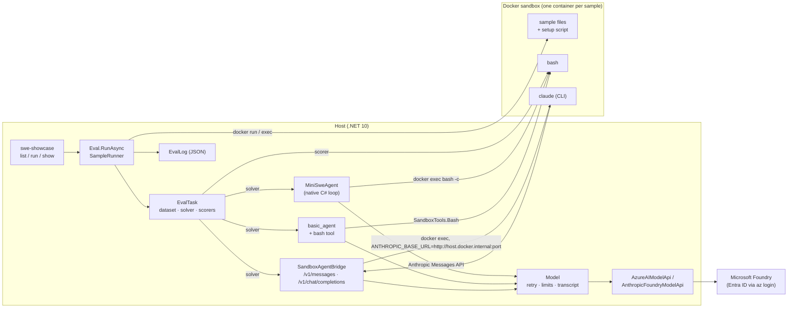

# SWE showcase: Inspect eval components and Inspect SWE agents in C#

Four projects extend the provider port with a minimal, faithful C# port of Inspect AI's eval components and
two Inspect SWE agents, plus a console app that runs them against the user's Microsoft Foundry deployments:

| Project | What it is |
|---|---|
| `src/InspectAzureAI.Eval` | Datasets and samples, tasks, solvers and `TaskState`, scorers and metrics, agents, tools, sandboxes (Docker and local), the `Model` wrapper (retry loop, limits, transcript), the sandbox **agent bridge**, an eval runner and a JSON eval log. |
| `src/InspectAzureAI.Swe` | **mini-swe-agent** (a native C# port of the upstream v2 `DefaultAgent` bash tool-calling loop) and **Claude Code** (the real CLI binary inside the sandbox, its Anthropic API calls proxied to the host bridge and served by the Azure providers). |
| `src/InspectAzureAI.Maf` | A **Microsoft Agent Framework** `ChatClientAgent` as an Inspect agent: an `IChatClient` over the agent bridge serves its model calls in-process, Inspect tools are wrapped as `AIFunction`s ([agent-framework.md](agent-framework.md)). |
| `src/InspectAzureAI.SweShowcase` | The `swe-showcase` console app with three built-in tasks, a Docker sandbox image, and a fully offline `--fake` mode. |
| `src/InspectAzureAI.ModelMatrix` | The `model-matrix` console app: every deployment on the resource × one task × one agent (Claude Code by default), with a results table, a JSON summary and an optional Markdown table. |
| `tests/InspectAzureAI.Eval.Tests`, `tests/InspectAzureAI.Swe.Tests`, `tests/InspectAzureAI.ModelMatrix.Tests` | xunit suites; Docker- and network-dependent tests are gated by `[DockerFact]` / `[NetworkFact]`. |

The design specification is [swe-showcase-design.md](swe-showcase-design.md); this document is the user-facing
guide, the Python → C# mapping and the record of every deliberate deviation from the Python sources.

## Architecture

> **In plain words.** The diagram shows the moving parts and who talks to whom. On the host, the console app
> calls the eval runner, which runs a task (dataset, solver, scorers), and every model call goes through one
> `Model` wrapper before it reaches Foundry. Each sample gets its own Docker container; the agents differ in how
> they use it. mini-swe-agent and the basic agent run their loop on the host and only send bash commands into
> the container. Claude Code is the opposite: the real CLI runs inside the container and, because it wants to
> call an Anthropic API, the host runs a small "bridge" web server that pretends to be that API and forwards the
> calls to Foundry. The Agent Framework agent also uses the bridge, but calls it in-process with no HTTP. The
> bullets underneath say the same thing in words.


```mermaid
flowchart LR
    subgraph host["Host (.NET 10)"]
        CLI["swe-showcase<br/>list / run / show"]
        Runner["Eval.RunAsync<br/>SampleRunner"]
        Task["EvalTask<br/>dataset · solver · scorers"]
        Model["Model<br/>retry · limits · transcript"]
        Prov["AzureAIModelApi /<br/>AnthropicFoundryModelApi"]
        Log["EvalLog (JSON)"]
        Bridge["SandboxAgentBridge<br/>/v1/messages · /v1/chat/completions"]
        MiniSwe["MiniSweAgent<br/>(native C# loop)"]
        Basic["basic_agent<br/>+ bash tool"]
    end
    subgraph sandbox["Docker sandbox (one container per sample)"]
        Files["sample files<br/>+ setup script"]
        Bash["bash"]
        Claude["claude (CLI)"]
    end
    Foundry["Microsoft Foundry<br/>(Entra ID via az login)"]

    CLI --> Runner --> Task
    Runner --> Log
    Task -->|solver| MiniSwe & Basic & Bridge
    Task -->|scorer| Bash
    Runner -->|docker run / exec| Files
    MiniSwe -->|docker exec bash -c| Bash
    Basic -->|SandboxTools.Bash| Bash
    Bridge -->|docker exec, ANTHROPIC_BASE_URL=http://host.docker.internal:port| Claude
    Claude -->|Anthropic Messages API| Bridge
    MiniSwe & Basic & Bridge --> Model --> Prov --> Foundry
```

- The **runner** initialises the sandbox provider once per task (building the image), then runs every
  (sample, epoch) with bounded concurrency: container up, files copied, setup script, the solver, the scorers,
  container down, one `EvalSample` in the log.
- **Agents** are `AgentDef`s turned into solvers with `Agents.AsSolver`; the sample's ambient `SampleContext`
  gives them the model, the sandbox, the store, the transcript and `score()`.
- **Claude Code** is the only component that talks HTTP: the CLI inside the container is pointed at the
  host-side `SandboxAgentBridge` (`ANTHROPIC_BASE_URL=http://host.docker.internal:<port>`, a per-run bearer
  token), which translates the Anthropic Messages API into `Model.GenerateAsync` calls and reconstructs the
  agent's conversation from the request/response threads.
- **Agent Framework** (`--agent maf`) talks no HTTP: the framework's `ChatClientAgent` is given an
  `InspectChatClient`, an `IChatClient` over the same `AgentBridge`, so its function-calling loop runs in-process
  while every model call, approval decision and limit is Inspect's; the sandbox `bash` tool is handed to the
  framework as an `AIFunction`.
- Every model call goes through `Model`, so the retry loop, the message/token limits, the `ModelEvent`s in the
  transcript and the usage in the log are the same for all four agents.

## How to run

> **In plain words.** The commands you need, in the order you need them: sign in with `az login` (no API keys
> anywhere), set the Foundry endpoint, make sure Docker is running, then try the offline `--fake` run first
> because it needs nothing but the .NET SDK. The other examples each show one agent on one task. The paragraphs
> after the commands explain how to keep the endpoint in a launch profile, what the first Docker run builds and
> caches (the sandbox image, and Claude Code's binary on the host), what `run` prints, and what its exit codes
> mean: 0 fine, 1 a sample errored, 2 you asked for something wrong or something is missing, 3 sign-in or Azure
> failed.

Prerequisites: .NET 10 SDK, Docker (for the default sandbox), the Azure CLI signed in, and a Foundry endpoint:

```bash
az login                                   # Entra ID only; no API keys are read
export AZUREAI_BASE_URL=https://<resource>.services.ai.azure.com/models
export INSPECT_AZUREAI_MODEL=gpt-5.4-mini  # optional default deployment
docker version                             # the daemon must be running

# offline smoke test (no network, no Docker): a scripted model solves sample 1 on the host
dotnet run --project src/InspectAzureAI.SweShowcase -- run --fake --sandbox local --task hello-swe --agent mini-swe

# the real thing: build the sandbox image, run mini-swe-agent on every hello-swe sample
dotnet run --project src/InspectAzureAI.SweShowcase -- run --task hello-swe --agent mini-swe

# Claude Code on a Claude deployment (the Anthropic route is picked from the model name)
dotnet run --project src/InspectAzureAI.SweShowcase -- run --task pytest-fix --agent claude-code --model claude-sonnet-4-6

# the inspect_swe docs example, model-graded
dotnet run --project src/InspectAzureAI.SweShowcase -- run --task system-explorer --agent basic --limit 1

# a Microsoft Agent Framework agent, its model calls bridged in-process to the deployment
dotnet run --project src/InspectAzureAI.SweShowcase -- run --task hello-swe --agent maf --attempts 2

# inspect a log
dotnet run --project src/InspectAzureAI.SweShowcase -- show logs/<timestamp>_hello-swe_<id>.json
```

Instead of exporting the endpoint in every shell, put it in the (gitignored) launch profile
`src/InspectAzureAI.SweShowcase/Properties/launchSettings.json` under `profiles.<name>.environmentVariables`;
`dotnet run` applies it automatically, and `--no-launch-profile` switches it off.

The first Docker run builds `src/InspectAzureAI.SweShowcase/sandbox/Dockerfile` (`python:3.12-slim-bookworm`
plus bash, git, curl, procps, coreutils and pytest) as `inspect-swe-sandbox:<content hash>`; later runs reuse
it until the Dockerfile changes. Claude Code's binary is downloaded on the host (cached under
`~/.cache/inspect-azureai/claude-code-downloads`) and copied into the container at run time, so the image
needs no Node.js.

`run` prints one line per sample start and completion (id, epoch, score, tokens, time), the log path, a
metrics table and the exit code: **0** ok, **1** at least one sample errored (or the run aborted), **2** usage
error or missing prerequisite (no endpoint, task data not built), **3** sign-in, Azure or runtime failure. A
sign-in problem is detected before any sample starts (a token is acquired up front) and reported with the
`az login` hints.

## Commands and flags

> **In plain words.** The reference for the three sub-commands (`list`, `run`, `show`) and every flag `run`
> accepts. Only `--task` and `--agent` are required. The rest fall into groups: which samples to run and how
> many at once (`--limit`, `--sample-id`, `--epochs`, `--max-samples`); how the agent behaves (`--attempts`,
> `--approval`, `--compaction`, `--cache`); the model call (`--model`, `--route`, `--max-tokens`,
> `--reasoning-effort`, `--model-arg`); where things run and are written (`--sandbox`, `--log-dir`,
> `--log-format`, `--no-cleanup`); money (`--cost-limit`, `--model-cost-config`); and diagnostics (`--hooks`,
> `--debug`, `--fake`). The paragraph at the end says what `list` and `show` print.

```
swe-showcase list
swe-showcase run --task <name> --agent mini-swe|claude-code|basic|maf [options]
swe-showcase show <log.eval|log.json>
```

(`swe-showcase` stands for `dotnet run --project src/InspectAzureAI.SweShowcase --`.)

| Flag | Meaning |
|---|---|
| `--task <name>` | `hello-swe`, `pytest-fix`, `system-explorer` or `ctf` (required). |
| `--agent <name>` | `mini-swe`, `claude-code`, `basic` or `maf` (required); `maf` is a Microsoft Agent Framework `ChatClientAgent` with the sandbox `bash` tool ([agent-framework.md](agent-framework.md)). |
| `--model <deployment>` | Foundry deployment; default `$INSPECT_AZUREAI_MODEL`, else `gpt-5.4-mini`. |
| `--route models\|anthropic` | Model-inference route (default) or the Anthropic Messages route; `claude-*` names take the Anthropic route automatically. |
| `--limit N` | Run only the first N samples. |
| `--sample-id ID` | Run only this sample id (repeatable; wins over `--limit`). |
| `--epochs N` | Run every sample N times; epoch scores are reduced with `mean`. |
| `--max-samples N` | Samples in flight at once (default 4). |
| `--attempts N` | Submissions the agent may make; an incorrect one is scored through `score()` and the agent is told to retry (default 1). |
| `--sandbox docker\|local` | `docker` (default) builds the showcase image and runs one container per sample; `local` runs the sample on this host in a fresh temp directory — **demo only**: the agent's commands run unconfined on your machine, and the checks need `python3` (and `pytest` for `pytest-fix`) on the PATH. With `--fake` the default is `local`. |
| `--log-dir DIR` | Where the eval log goes (default `logs`, or `$INSPECT_LOG_DIR`). |
| `--log-format eval\|json` | The log format: `eval` (default, the `.eval` zip Inspect's viewer reads; `$INSPECT_LOG_FORMAT` overrides) or `json`. |
| `--no-cleanup` | Keep the containers / temp directories for inspection (their names are logged). |
| `--max-tokens <n\|none>` | `max_tokens` sent; default the provider's `max_tokens()`. |
| `--reasoning-effort <lvl>` | Inspect's `reasoning_effort` (`none\|minimal\|low\|medium\|high\|xhigh\|max`), applied through the model's `GenerateConfig` for all agents. |
| `--model-arg key=value` | Repeatable; the Python `-M` model args (JSON values are parsed). |
| `--approval <policy>` | Tool-call approval: a JSON policy file (`{"approvers": [{"name", "tools", ...}]}`, the structure of Inspect's YAML policies) or a registered approver name (`auto`, `human`). Applied to the bash calls of `mini-swe` and `basic` and to Claude Code's tool calls through the bridge; `reject` answers the call with an approval error, `terminate` ends the sample with the `operator` limit. |
| `--cache <expiry\|off>` | Inspect's prompt cache (`generate(cache=)`) for every model call: `1W`, `3D`, `12h`, ... (`on` = `1W`). A hit replays the stored output without a provider call and is recorded as `cache: read` on the model event; entries live under `$INSPECT_CACHE_DIR` or the user cache directory. |
| `--compaction <strategy>` | `edit\|summary\|trim\|auto[:threshold]` — compact the conversation once it reaches the threshold (a token count, or a fraction of the context window; default 0.9), as `react(compaction=)` does. `mini-swe` and `basic` only; Claude Code compacts its own context, so the flag is a usage error there. |
| `--hooks <name[=file]>` | Lifecycle hooks: `sample-log` prints one `[hook]` line per run, task, sample and model event (`sample-log=FILE` writes them to a file). Repeatable / comma-separated. |
| `--cost-limit <dollars>` | Stop a sample once its priced model usage exceeds this; needs prices for the model (a limit without prices is exit 2). |
| `--model-cost-config FILE` | JSON prices per model (`{"<deployment>": {"input", "output", "input_cache_write", "input_cache_read"}}` in $/million tokens; `$INSPECT_AZUREAI_MODEL_COST_CONFIG` applies one to every run). Costs then appear on the log's usage (`total_cost`), in the summary and in `show`. |
| `--fake` | A scripted model that solves sample 1 of the task offline (see below). |
| `--debug` | Claude Code debug capture (stdout/stderr into the sample store) and full exception traces. |

`list` prints the tasks (sample count, scorer), the agents and the sandbox Dockerfile path. `show` reads either
log format (`read_eval_log`) and prints the run's status, token usage and cost, the recorded approval policy and
cost limit, the metrics table and one line per sample (scores, tokens, cost, time, model/tool call counts, what
the cache, approvals and compaction did, limit, error), the first line of the submitted answer and the last line
of each score's explanation.

### `--fake`: the offline mode

> **In plain words.** `--fake` swaps the real model for a scripted one that ships in the Eval library. The
> script knows how to solve sample 1 of each task using whatever turn shape the chosen agent expects (a `bash`
> tool call, then the agent's own submit signal), gives up on every other sample, and answers a grading prompt
> with `GRADE: C` when the submission looks right, so an offline run always reports exactly one correct sample,
> which makes it a stable smoke test. It cannot drive Claude Code (a real binary that needs a real model), but
> it can drive Docker, which is a cheap way to exercise the sandbox provider.

`--fake` replaces the Foundry model with `ScriptedModelApi` (`InspectAzureAI.Eval.Testing`). Its turns are
computed from the conversation, so runs are deterministic under any concurrency: the script solves sample 1
of the chosen task with the turn shape the agent expects — mini-swe: `bash` calls carrying a `command`, then
`printf` of the `COMPLETE_TASK_AND_SUBMIT_FINAL_OUTPUT` marker; basic: `bash` calls carrying `cmd`, then a
`submit` — gives up on every other sample (so an offline run reports 1 correct), and answers a
`model_graded_qa` judge prompt with `GRADE: C` when the submission contains the expected answer. `--fake`
refuses `--agent claude-code` (exit 2): the CLI needs a real sandbox with the binary installed and a real
model behind the bridge. `--fake --sandbox docker` builds the image and runs the script in containers, which
is a useful smoke test of the Docker provider without any model cost.

## Every deployment at once: `model-matrix`

> **In plain words.** A second console app for one question: how does every deployment on my Foundry resource do
> on this task? It lists the deployments through Azure Resource Manager, runs the same task and agent against
> each one, and prints a table with a row per deployment (status, accuracy, tokens, cost, speed, time, log
> path). Each deployment runs as its own eval set, so re-running with the same log directory reuses finished
> results and retries only the failures; `--resume` does the same from a saved summary. The flags either shape
> the row list (`--only`, `--skip`, `--format`, `--include-non-chat`, `--parallel`) or are the showcase's own
> flags applied to every row. One deployment failing never stops the others.

`src/InspectAzureAI.ModelMatrix` is a second console app on the same runner: it discovers every deployment on the
Foundry resource behind `AZUREAI_BASE_URL` (through Azure Resource Manager, the same `FoundryCatalog` the sample's
`models` command uses), runs one showcase task with one agent against each of them — Claude Code on `hello-swe` by
default — and prints a results matrix. Each deployment is its own **eval set** in `<log-dir>/<deployment>/`
(`EvalSet.RunAsync`, the port of `inspect eval-set`): running the matrix again with the same `--log-dir` resumes
it — a complete log is reused without running (the row says `reused`), an incomplete one is re-run reusing its
completed samples, and an eval that errors is retried immediately (`--retry-attempts`, default 2). The run's
summary goes to `<log-dir>/<timestamp>_matrix_<task>.json` (or `--out`) and, with `--markdown`, to a Markdown table.

```bash
# Claude Code × every chat deployment, one sample each, three deployments at a time
dotnet run --project src/InspectAzureAI.ModelMatrix -- --parallel 3 --markdown docs/model-matrix-results.md

# mini-swe-agent on the OpenAI and DeepSeek deployments only, both hello-swe samples 1 and 2
dotnet run --project src/InspectAzureAI.ModelMatrix -- --agent mini-swe --format OpenAI,DeepSeek --sample-id 1 --sample-id 2

# offline: the scripted model on a fixed four-deployment catalog (agent defaults to mini-swe, sandbox to local)
dotnet run --project src/InspectAzureAI.ModelMatrix -- --fake
```

| Flag | Meaning |
|---|---|
| `--only a,b` / `--skip a,b` | Deployment names to run / leave out (repeatable, case-insensitive). `--only` defines the rows; everything else is not part of the matrix. |
| `--format OpenAI,Anthropic` | Keep only these ARM model formats. |
| `--include-non-chat` | Also try deployments whose capabilities say `chatCompletion=false` (image, parsing and embedding models are skipped otherwise). |
| `--parallel N` | Deployments evaluated at the same time (default 1). The sandbox image is built once and shared. |
| `--retry-attempts N` | Immediate eval-set retries of a deployment whose eval errors, reusing its completed samples (default 2; Python's `eval_set` defaults to 10). |
| `--model-cost-config FILE`, `--cost-limit`, `--cache`, `--compaction`, `--hooks`, `--approval`, `--log-format` | The showcase flags above, applied to every deployment; with prices the matrix reports a `cost` column and total, and hook lines are prefixed with the deployment name. |
| `--out FILE`, `--markdown FILE` | The JSON summary and an optional Markdown table. |
| `--resume FILE` | Rerun only the deployments that errored in a previous matrix JSON (same task and agent) and carry its other rows over — for transient failures, so a 20-model run is not repeated for one network blip. Not with `--only`. |
| `--show FILE` | Print a saved matrix JSON (and re-render its Markdown with `--markdown`) without running anything. |
| the showcase's run flags | `--task`, `--agent`, `--limit` (default **1** sample per deployment), `--sample-id`, `--epochs`, `--max-samples`, `--attempts`, `--sandbox`, `--log-dir`, `--no-cleanup`, `--max-tokens`, `--reasoning-effort`, `--model-arg`, `--fake`, `--debug` — same meaning as above. `--model` and `--route` are rejected: the deployment list is the resource's, and each deployment takes the route its ARM `Format` implies (`Anthropic` → the Messages route, everything else → the model-inference route, with `model_format=<Format>` passed as a model arg). |

Each row records the deployment's status — `ok` (accuracy 1), `partial`, `incorrect`, `unscored`, `error`
(the eval or a sample failed; the first line of the error is the note) or `skipped` (with the reason) — plus
accuracy, tokens, cost (when the model is priced), throughput (`tok/s`: tokens over wall time), wall time,
whether the row was reused from an earlier run, and the eval log path. A failing deployment never stops the matrix; only a sign-in
failure or Ctrl-C does. Exit codes: **0** every selected deployment completed (incorrect answers are results,
not errors), **1** at least one deployment errored, **2** usage or missing prerequisite, **3** sign-in, Azure or
runtime failure. The last full run is in [model-matrix-results.md](model-matrix-results.md).

## The four tasks

> **In plain words.** What the built-in tasks are and how each one is checked. Task data is a JSON dataset next
> to the code, copied beside the executable. `hello-swe` (three small coding jobs) and `pytest-fix` (two broken
> packages with failing tests) are checked mechanically: a bash command runs inside the sandbox and exit code 0
> means correct. `system-explorer` asks about the machine and is graded by the model itself. `ctf` hides a flag
> in the container with a setup script and checks whether the submitted answer contains it. All four tolerate a
> broken sample (recorded, not fatal) and cap each sample at 200 messages and 20 minutes.

Task data lives under `src/InspectAzureAI.SweShowcase/tasks/<name>/dataset.json` (loaded with
`Datasets.Json`, file references resolved relative to the dataset file) and is copied next to the executable;
the C# task definitions are in `BuiltinTasks/` rather than the design's `Tasks/` because that name collides
with the `tasks/` data directory on case-insensitive filesystems.
All four set `fail_on_error=False` (a broken sample is recorded and reported through the exit code rather than
aborting the demo), a 200-message limit and a 20-minute time limit per sample.

| Task | Samples | Sandbox | Scorer |
|---|---|---|---|
| `hello-swe` | 1: create `hello.py` printing `Hello, Inspect!`; 2: add a `--reverse` flag to the provided `words.py`; 3: fix an off-by-one in the provided `stats.py` so it prints 35. | showcase Dockerfile | `exec_check`: runs the sample's `metadata.check` bash command in the sandbox; exit 0 → `C`, else `I`; explanation = the command output. |
| `pytest-fix` | 1: `textkit.slugify` (does not lower-case or collapse whitespace); 2: `mathkit.is_prime` (misses perfect squares). Each ships a package and a failing pytest suite. | showcase Dockerfile | `exec_check` with `check = python3 -m pytest -q` (plus a guard that the tests are still there). |
| `system-explorer` | The inspect_swe `examples/system_explorer` idea: 1: which Python version is installed; 2: how many CPU cores the machine reports. | showcase Dockerfile | `Scorers.ModelGradedQa()` — the task model is the judge (the default template, instructions and `GRADE:` regex of `scorer/_model.py`). |
| `ctf` | The Capture the Flag task of the Inspect docs (`tasks.qmd`, `react-agent.qmd`): each sample's `setup` script plants a `picoCTF{...}` flag in the sandbox — 1: a dotfile under `challenge/.cache`; 2: a base64-encoded `challenge/encoded.txt`; 3: printable text inside the binary `challenge/vault.bin`. The docs' CTF system prompt is chained before the agent. | showcase Dockerfile | `Scorers.Includes()` — the submitted answer contains the flag (case-insensitive). |

## Verified against a live Foundry resource

> **In plain words.** Evidence rather than instructions: real runs against a real Foundry resource on a given
> date, one row each, with the task, agent, model, score, tokens and time taken straight from the logs. The
> Notes column is the useful part: it records what the agent actually did (which tool calls, in what order) and
> explains the one failure (Claude Code wrote the file in the wrong directory, a model choice rather than a
> bug). The bullet list after the table collects behaviours seen in those runs that could be mistaken for bugs,
> such as how Claude Code splits its system prompt into blocks and why prompt caching did not kick in on the
> Anthropic route.

Run on 2026-09-04 against `https://myfoundry0406.services.ai.azure.com/models` (Entra ID through `az login`,
no API keys) with Docker 29.5 on an arm64 host, `--sandbox docker` and `--limit 1` / `--sample-id`; no
`--max-tokens`, `--reasoning-effort` or temperature was passed (gpt-5 deployments reject any temperature other
than 1, and the showcase never sends one unless asked). Every run completed, was scored, wrote its log and
exited 0, and `docker ps -a` showed no leftover `inspect-swe-*` container afterwards. Tokens and times are the
values in the logs (`show` prints the same).

| Task (sample) | Agent | Model (route) | Result | Tokens | Time | Notes |
|---|---|---|---|---|---|---|
| hello-swe (1) | mini-swe | gpt-5.4-mini (models) | `exec_check=C` | 4,466 | 9.4 s | 4 model calls, 4 `bash` actions (`pwd && ls`, heredoc write, `od` byte check, `echo COMPLETE_TASK_AND_SUBMIT_FINAL_OUTPUT`); observations are the `mini.yaml` JSON; the store holds exit status, submission, trajectory and api calls. |
| hello-swe (1) | basic | gpt-5.4-mini (models) | `exec_check=C` | 801 | 4.8 s | One `bash(cmd=…)` call, then `submit(answer="Done")`; both recorded as `ToolEvent`s; `output.completion` is the submitted answer. |
| hello-swe (1) | claude-code | claude-sonnet-4-6 (anthropic) | `exec_check=I` | 72,040 | 47.4 s | First run: Claude Code 2.1.236 linux-arm64 (316 MiB) downloaded to the host cache, installed under `/var/tmp/.5c95f967ca830048/`, `settings.json` seeded; 3 bridged `/v1/messages` calls (24 tools each) over `host.docker.internal`; `Write` → `Bash` → text. The model wrote `/hello.py` although its system prompt said `Primary working directory: /workspace`, so the check failed — a model choice, not a translation fault (the same prompt text reached it that the CLI built). |
| hello-swe (2, `--sample-id 2`) | claude-code | claude-sonnet-4-6 (anthropic) | `exec_check=C` | 97,023 | 19.9 s | Exercises `files` (`words.py` copied into `/workspace`); `Read` (a wrong `/root/words.py` guess, then `/workspace/words.py`), `Edit`, final text; 4 bridged calls; the cached binary was reused (no download). |
| system-explorer (1) | mini-swe | gpt-5.4-mini (models) | `model_graded_qa=I` | 3,480 | 8.0 s | The grader is the same deployment: the grading prompt is the verbatim `scorer/_model.py` template, the verdict `GRADE: I` was parsed and the grader exchange kept under `metadata.grading`. The agent ran `python3 --version`, answered once without a tool call (one `format_error_template` turn), then submitted with nothing after the marker, so the graded answer was its last text, which never stated the version. |
| hello-swe (1) | claude-code | gpt-5.4-mini (models) | `exec_check=C` | 32,069 | 12.9 s | Claude Code driven by a non-Anthropic deployment through the bridge: `Write` then a text answer, 2 calls, 15,488 cached input tokens on the second; stderr carried the CLI's `[claude-code:unrecognized_model]` warning (exit 0, classified as success). |
| hello-swe (1) | maf | gpt-5.4-mini (models) | `exec_check=C` | 807 | 5.3 s | 2026-09-07, Microsoft.Agents.AI 1.20.0: the framework's `ChatClientAgent` made 2 bridged calls in-process, invoked `bash(cmd=…)` (wrote `hello.py`) and `submit(answer="Done")`, both as `ToolEvent`s; no HTTP, no leftover container. |
| hello-swe (2, `--sample-id 2`) | maf | claude-sonnet-4-6 (anthropic) | `exec_check=C` | 9,059 | 26.9 s | 2026-09-07: the same Agent Framework agent on the Anthropic route, 6 bridged calls and 5 tool calls (`bash` reads and rewrites `words.py`, then `submit`); the submission text is `output.completion`. |
| hello-swe (2, `--sample-id 2`) | claude-code | claude-sonnet-4-6 (anthropic) | `exec_check=C` | 97,028 | 20.8 s | Re-run after the review fix pass. The first post-fix attempt failed with the CLI's "issue with the selected model" message and zero model calls because the bridge had been narrowed to a `127.0.0.1` prefix; restoring the wildcard prefix (fidelity note 1) fixed it, and a regression test now sends a request with `Host: host.docker.internal:<port>`. |

What the runs showed about the port (recorded so they are not mistaken for bugs):

- Claude Code 2.1.236 sends `system` as three blocks (`x-anthropic-billing-header: …`, its identity line, the
  main prompt). Like the Python bridge, one `ChatMessageSystem` per block is kept and all three are forwarded
  (the API drops a block that starts with such a header, so blocks must not be concatenated).
- Presented with a non-Anthropic model name, the CLI puts its `<system-reminder>` context into `role: system`
  entries inside `messages[]` (with Sonnet the same text travels inside the user and `tool_result` blocks); the
  bridge maps them to mid-conversation `ChatMessageSystem` messages, which the model-inference route accepts.
- `call_*` tool-call ids from the model-inference route pass through as `tool_use` ids and come back unchanged
  as `tool_use_id`; Anthropic `toolu_*` ids do the same on the Anthropic route.
- The model-inference route applies Python's `DEFAULT_MAX_TOKENS` (2048) when `--max-tokens` is absent (the
  Anthropic route used 32,000). For a reasoning deployment that bounds visible plus reasoning output, so pass
  `--max-tokens` for larger tasks.
- Sonnet through the bridge paid full input price on every turn (`cache_creation` / `cache_read` 0 on 24k-token
  requests): the bridge drops the CLI's `cache_control` markers as Python does, and `AnthropicFoundryModelApi`
  adds none of its own (Python's provider does under `cache_prompt="auto"`). gpt-5.4-mini cached automatically.
- A Claude Code sample's `total_time` includes the binary download on a cold host cache (47 s cold versus
  20 s warm above), as in Python, where the download also happens inside the agent.
- `--debug` stores every JSONL line and stderr chunk in the sample store (`claude_code_debug`) and logs only
  parse errors and stderr in the `Claude Code Debug Output:` block, exactly as `claude_code.py` traces.

## Python → C# mapping

> **In plain words.** A lookup table for people who know the Python code: for each Python module (or function)
> in inspect_ai, inspect_swe / mini-swe-agent and the Inspect CLI, the C# file that ports it. Use it in both
> directions: to find where a Python behaviour lives in C#, and to find which Python source a C# file should be
> compared against when something looks different.

### inspect_ai (→ `InspectAzureAI.Eval`)

> **In plain words.** The core library: datasets, tasks, solvers, the model wrapper and its retry loop, tools,
> scorers and metrics, agents and the bridge, sandboxes, the store and transcript, the runner and the log, plus
> the scripted test model.

| Python | C# |
|---|---|
| `dataset/_dataset.py` `Sample`, `Dataset`, `MemoryDataset`, `FieldSpec` | `Dataset/Sample.cs`, `IDataset.cs`, `MemoryDataset.cs`, `FieldSpec.cs` |
| `dataset/_util.py` (record → sample), `dataset/_sources/util.py` `resolve_sample_files` | `Dataset/SampleRecords.cs` |
| `dataset/_sources/json.py` `json_dataset`, `_sources/csv.py` `csv_dataset` | `Dataset/Datasets.cs`, `CsvParser.cs` |
| `_eval/task/task.py` `Task`, `_eval/task/epochs.py` `Epochs` | `Tasks/EvalTask.cs`, `Tasks/Epochs.cs` |
| `solver/_task_state.py` `TaskState` | `Solvers/TaskState.cs`, `SampleInput.cs` |
| `solver/_solver.py` `Solver`/`Generate`, `_chain.py` `chain`, `_use_tools.py` `use_tools` | `Solvers/SolverDelegates.cs`, `Solvers/Solvers.cs` |
| `solver/_prompt.py` `system_message`, `prompt_template`, `user_message` | `Solvers/PromptSolvers.cs` |
| `solver/_basic_agent.py` `basic_agent` | `Solvers/BasicAgent.cs` |
| `model/_model.py` `Model.generate` + the solver `generate()` tool loop | `Model/Model.cs`, `Solvers/GenerateLoop.cs` |
| `model/_retry.py`, `model/_generate_config.py` (merge) | `Model/ModelRetryOptions.cs`, `Model/ModelApiHooks.cs`, `Model/GenerateConfigExtensions.cs` |
| `model/_model.py` `get_model()` for the Foundry providers | `Model/FoundryModels.cs` |
| `log/_transcript.py` `ModelEvent`, `_model.py` event sinks | `Model/ModelEvent.cs`, `Model/IModelEventSink.cs`, `Model/ModelGenerateException.cs` |
| `model/_call_tools.py` `execute_tools`, `tool/_tool.py`, `_tool_def.py`, `_tool_params.py` | `Tools/ToolExecutor.cs`, `Tools/ToolDef.cs`, `Tools/ToolResult.cs`, `Tools/ToolErrors.cs` |
| `tool/_tools/_execute.py` `bash`, `python` | `Tools/SandboxTools.cs` |
| `scorer/_metric.py` `Score`, `Value`, `CORRECT`…, `SampleScore`, `Metric` | `Scorers/Score.cs`, `ScoreValue.cs`, `ScorerDelegates.cs`, `SampleScore.cs` |
| `scorer/_target.py` `Target` | `Scorers/Target.cs` |
| `scorer/_match.py` `includes`, `match`, `_pattern.py` `pattern`, `_common.py` | `Scorers/Scorers.cs`, `Scorers/MatchScorers.cs` |
| `scorer/_model.py` `model_graded_qa`, `model_graded_fact`, templates, `chat_history` | `Scorers/ModelGraded.cs` |
| `scorer/_metrics/accuracy.py`, `mean.py`, `std.py` (`stderr`, `std`) | `Scorers/Metrics.cs` |
| `scorer/_reducer/reducer.py`, `registry.py` (`mean`, `max`, `median`, `mode`, `at_least`, `pass_at`) | `Scorers/Reducers.cs` |
| `scorer/_classification.py` / `_metric.py` `value_to_float` | `Scorers/ValueToFloat.cs` |
| `agent/_agent.py` `AgentState`, `Agent`, `agent()`, `_types.py` `AgentAttempts`, `_as_solver.py` | `Agents/AgentState.cs`, `AgentDelegates.cs`, `AgentAttempts.cs`, `Agents.cs` |
| `agent/_bridge/types.py` (`AgentBridge`, `_track_state` thread tracking), `_bridge/util.py` (model resolution) | `Agents/Bridge/AgentBridge.cs`, `ThreadTracking.cs`, `Mm3Hash.cs` |
| `agent/_bridge/anthropic_api_impl.py` | `Agents/Bridge/AnthropicBridgeApi.cs` |
| `agent/_bridge/completions.py` | `Agents/Bridge/CompletionsBridgeApi.cs` |
| `agent/_bridge/sandbox_agent_bridge.py` + `inspect_sandbox_tools/_agent_bridge/proxy.py` (HTTP + SSE synthesis) | `Agents/Bridge/SandboxAgentBridge.cs`, `SseWriter.cs`, `BridgeJson.cs` |
| `util/_sandbox/environment.py` (`SandboxEnvironment`, `ExecResult`, `SandboxEnvironmentSpec`, output limits) | `Sandbox/ISandboxEnvironment.cs`, `ExecResult.cs`, `SandboxSpec.cs`, `SandboxEnvironments.cs`, `SandboxExceptions.cs`, `SandboxLimits.cs` |
| `util/_sandbox/registry.py` | `Sandbox/SandboxRegistry.cs` |
| `util/_sandbox/local.py` | `Sandbox/Local/LocalSandboxEnvironment.cs`, `LocalSandboxProvider.cs`, `TailByteBuffer.cs` |
| `util/_sandbox/docker/docker.py`, `compose.py`, `util.py`, `failure.py` | `Sandbox/Docker/DockerSandboxProvider.cs`, `DockerSandboxEnvironment.cs`, `DockerCli.cs`, `DockerImages.cs`, `DockerFailures.cs`, `ProcessRunner.cs` |
| `util/_store.py` `Store`/`store()` | `Context/Store.cs` |
| `util/_limit.py` (`message_limit`, `token_limit`, `time_limit`, `LimitExceededError`) | `Context/Limits.cs`, `LimitExceededException.cs` |
| `log/_transcript.py` `Transcript`, events, spans | `Context/Transcript.cs`, `TranscriptEvents.cs` |
| `util/_sandbox/context.py` `sandbox()`, `_eval/task/run.py` `sample_state()` / `score()`, `get_model()` | `Context/SampleContext.cs` |
| `_eval/eval.py` `eval()`, `_eval/task/run.py` `task_run` / `task_run_sample`, `_eval/run.py` | `Runner/Eval.cs`, `SampleRunner.cs`, `EvalOptions.cs` |
| `_eval/task/sandbox.py`, `util/_sandbox/context.py` (files, setup) | `Runner/SandboxSetup.cs` |
| `_eval/task/results.py` (reducers, metrics, `EvalResults`) | `Runner/EvalResultsBuilder.cs` |
| `_display/plain` (progress lines) | `Runner/IEvalReporter.cs` (`ConsoleEvalReporter`) |
| `log/_log.py` (`EvalLog`, `EvalSpec`, `EvalSample`, …), `_util/error.py` `EvalError` | `Log/EvalLog.cs` |
| `log/_file.py` `write_eval_log` / `read_eval_log` (JSON) | `Log/EvalLogWriter.cs`, `Log/Json/*.cs` |
| `model/_providers/mockllm.py` (test model) | `Testing/ScriptedModelApi.cs`, `Testing/FakeSandboxEnvironment.cs` |

### inspect_swe and mini-swe-agent (→ `InspectAzureAI.Swe`)

> **In plain words.** The two agents: the mini-swe-agent loop with its templates, and everything Claude Code
> needs (binary download and verification, environment, settings, launch, JSONL stream parsing, exit
> classification).

| Python | C# |
|---|---|
| inspect_swe `_mini_swe_agent/mini_swe_agent.py` (`mini_swe_agent()`, attempts, resume), `resumable_agent.py` | `MiniSwe/MiniSwe.cs`, `MiniSweAgent.cs`, `MiniSweAgentOptions.cs` |
| mini-swe-agent `agents/default.py` `DefaultAgent`, `models/utils/actions_toolcall.py`, `environments/local.py`, `config/mini.yaml` | `MiniSwe/MiniSweAgent.cs`, `MiniSweTemplates.cs` |
| Jinja2 rendering of the `mini.yaml` templates (`DefaultAgent._render_template`, `tojson`) | `MiniSwe/TemplateRenderer.cs` |
| inspect_swe `_claude_code/claude_code.py` `claude_code()` (validation, attempts loop, settings.json, launch) | `ClaudeCode/ClaudeCode.cs`, `ClaudeCodeAgent.cs`, `ClaudeCodeOptions.cs`, `ClaudeCodeCommand.cs` |
| `_claude_code/model.py` `resolve_claude_code_models` | `ClaudeCode/ClaudeCodeModels.cs` |
| `_claude_code/env.py` | `ClaudeCode/ClaudeCodeEnv.cs` |
| `_claude_code/agentbinary.py`, `_util/agentbinary.py`, `_util/download.py`, `_util/checksum.py`, `_util/platform.py` | `ClaudeCode/ClaudeCodeBinary.cs` |
| `_claude_code/_events/stream.py`, `live_consumer.py` (`last_stop_reason` only) | `ClaudeCode/ClaudeCodeStream.cs` |
| `claude_code.py` exit classification (`_is_claude_code_refusal_exit`, retry rule) | `ClaudeCode/ClaudeCodeExit.cs` |
| `_util/messages.py` (`user_turn`, `build_user_prompt`) | `Util/AgentPrompt.cs` |
| `_util/sandbox.py` (platform detection, agent cwd, checked exec) | `Util/SandboxUtil.cs` |

### The showcase (→ `InspectAzureAI.SweShowcase`)

> **In plain words.** The console app itself: the CLI, the task definitions and the scripted `--fake` runs,
> mapped to the Inspect CLI commands and the inspect_swe example they stand in for.

| Python | C# |
|---|---|
| `inspect eval` / `inspect list tasks` (CLI), `@task` registry | `Cli.cs`, `RunOptions.cs`, `ShowcaseTasks.cs`, `AgentChoice.cs` |
| inspect_swe `examples/system_explorer/task.py` | `BuiltinTasks/SystemExplorerTask.cs` (+ `HelloSweTask.cs`, `PytestFixTask.cs`, `ExecCheckScorer.cs`) |
| `mockllm` scripted runs | `FakeScripts.cs` |

## Fidelity notes

> **In plain words.** The rule for this whole section: anything *not* listed here is meant to behave exactly
> like the Python source it maps to; anything listed is a known, deliberate difference (or an addition),
> numbered so code comments can cite it as "fidelity note 16". The numbers are not in order within a group
> because notes were appended as they were discovered. Read a group when something behaves differently from what
> the Python documentation led you to expect. Under each note, five short paragraphs expand it: *In plain words*
> (what you would notice), *Why it exists*, *Technical detail* (what the code does today, with `path:line`),
> *Doing it better* (how to close the gap or harden it, with a rough S/M/L effort) and *Big picture* (what
> depends on it). A note that predates later work on the branch opens with a *Status* paragraph saying what has
> changed since it was written.

Numbered so a reader of the code can cite them. Each is a deliberate deviation from (or an addition to) the
Python behaviour; anything not listed here is intended to match the Python sources named in the mapping.
The expansions under each note were researched against the working tree on 2026-09-13 (C# branch
`feat/codex-cli-claude-code-parity`, Python `inspect_ai` checkout as cited in each note); where they disagree with a
note's original sentence, the *Status* paragraph is the current state and the sentence is the historical record.

### Overall design

> **In plain words.** The big architectural choices. The bridge runs on the host rather than inside the
> container, so it needs a random token as its lock and must listen on every interface (a `127.0.0.1`-only
> binding was tried and broke Claude Code). mini-swe-agent is rewritten in C# rather than running the Python
> package. Model retries are capped rather than unbounded. Waiting time is not tracked separately. And
> `--sandbox local` exists for demos only. (Note 6 predates the `.eval` log format: `--log-format eval` is now
> the default, as the flags table above says.)

1. The bridge proxy runs on the **host** and is reached from the container through `host.docker.internal`,
   not inside the sandbox over file RPC as in `inspect_sandbox_tools`; consequently the bridge requires a
   per-instance random bearer/`x-api-key` token (the server is reachable over the network, unlike Python's
   in-sandbox proxy), `ANTHROPIC_BASE_URL` is the host-side bridge URL (`http://host.docker.internal:<port>`)
   and `ANTHROPIC_AUTH_TOKEN` is that token rather than Python's `http://localhost:<port>` and literal dummy
   token, and the bridge port is ephemeral (`Port = 0`) instead of the sample-store counter starting at 3001.
   For a Docker sandbox the bridge listens on the wildcard prefix (every host interface): `HttpListener`
   matches each request's `Host` header against its prefixes, and the container's requests arrive as
   `host.docker.internal:<port>`, so a prefix naming `127.0.0.1` answers them with 400 and Claude Code reports
   the model as missing (a narrower binding was tried and reverted for exactly this reason). The token is the
   access control; for a local sandbox the bridge binds `127.0.0.1` only.

    **In plain words.** When Claude Code (or Codex/Copilot) runs inside the Docker sandbox and thinks it is calling
    the Anthropic API, it is really talking to a small HTTP server the showcase runs on your own machine at
    http://host.docker.internal:<random port>. The container is handed that URL plus a random secret in its
    environment; any request without the secret gets a 401. Python does it the other way round: a proxy process runs
    inside the container on a fixed port (13131 by default) and relays to the host over the sandbox's exec channel, so
    no secret is needed.

    **Why it exists.** The C# port has no in-sandbox proxy binary: Python launches `inspect_sandbox_tools model_proxy`
    inside the container via exec_remote (agent/_bridge/sandbox/bridge.py:206-216 at 76f1aa761), so the design put the
    server on the host (docs/swe-showcase-design.md:594-598, deviations 1, 6, 7). Because a host server is reachable
    from any container on the same network, a per-instance token became the access control (class summary
    SandboxAgentBridge.cs:18-25). The wildcard binding is forced by HttpListener: it matches each request's Host
    header against its prefixes, and container requests arrive as `host.docker.internal:<port>`, so a `127.0.0.1`
    prefix answered 400 and Claude Code reported the model missing (comment SandboxAgentBridge.cs:74-79). The revert
    predates the git history: `git log -S'127.0.0.1'` on the file reaches only the snapshot commit ee4c7b1.

    **Technical detail.** StartAsync (src/InspectAzureAI.Eval/Agents/Bridge/SandboxAgentBridge.cs:92-143): BindHosts
    (:284-286) returns ["127.0.0.1"] when sandbox.HostAddress is loopback (IsLoopback :280-282), else ["*"]; for port
    0 it probes a free port and retries the bind up to 5 times (:106-127); AuthToken is 16 random bytes as hex
    (:61-68); Authorized (:654-668) accepts `x-api-key` or `Authorization: Bearer` with
    CryptographicOperations.FixedTimeEquals and unauthenticated requests get a 401 in the client's own dialect (:336).
    HostAddress comes from the sandbox: DockerSandboxEnvironment.cs:44 `host.docker.internal`,
    LocalSandboxEnvironment.cs:37 `127.0.0.1`; the bare `docker run` adds `--add-host
    host.docker.internal:host-gateway` (Sandbox/Docker/DockerCli.cs:12-13, 28). ClaudeCodeEnv.Build
    (src/InspectAzureAI.Swe/ClaudeCode/ClaudeCodeEnv.cs:38-46) sets ANTHROPIC_BASE_URL=bridge.BaseUrl and
    ANTHROPIC_AUTH_TOKEN=bridge.AuthToken (ClaudeCodeAgent.cs:166). Python at 76f1aa761: bridge.py:54 `port: int =
    13131`, :67-70 docstring (`ANTHROPIC_BASE_URL=http://localhost:13131`), :206-216 exec_remote of `SANDBOX_CLI
    model_proxy`; inspect_sandbox_tools/_agent_bridge/proxy.py has no token check. inspect_swe claude_code.py: `port =
    store().get("claude_code_model_port", 3000) + 1` and api key default `"dummy-key-for-bridge"` (mini_swe_agent.py
    uses a 4000-based counter and `sk-none`). The note text matches the code.

    **Doing it better.** (1) The wildcard binding is broad; a safer equivalent is to keep `*` but reject requests
    whose RemoteEndPoint is outside the Docker bridge subnet, or replace HttpListener with a Kestrel/Socket listener
    bound to the docker gateway IP that does not match on Host header — effort M. (2) Port Python's in-sandbox proxy
    path (sandbox service file-RPC + a proxy inside the container) so compose sandboxes with `network_mode: none` can
    bridge; docs/ports/sandbox-parity.md:631 records that the host bridge is unreachable from them — effort L. (3)
    Windows needs a URL ACL for non-loopback prefixes (error text :133-136); add a documented fallback or a pre-flight
    check — S. (4) Consider aligning the env contract with inspect_swe (`ANTHROPIC_BASE_URL` on localhost) only if the
    in-sandbox proxy lands; otherwise the current design is an improvement in isolation (no Python needed in the
    image) and the token is the right mitigation.

    **Big picture.** Every bridged agent depends on this server: ClaudeCodeAgent, the Codex Responses route, Copilot
    in the HVE demo, and the `/mcp/{server}` bridged-tools endpoint (McpServerConfigs).
    docs/container-orchestration.md:965-971 and :1085-1092 describe it as the third host-to-container channel;
    docs/ports/sandbox-parity.md:257 and :631 flag the compose/network-none gap; docs/agent-framework.md:41 proposes
    reusing the loopback binding for Agent Framework. It interacts with note 5 (only the bare docker path has the
    network and host-gateway mapping the bridge needs), note 7 (the local sandbox binds loopback only) and note 2
    (mini-swe never touches the bridge). Tests: tests/InspectAzureAI.Eval.Tests/SandboxAgentBridgeTests.cs:112-464
    cover loopback/wildcard binding and the host.docker.internal Host header.

2. mini-swe-agent is a **native C# loop** against `Model` and `ISandboxEnvironment`, not the Python package
   bridged through litellm inside the sandbox; the sandbox image therefore needs no Python packaging.

    **In plain words.** The showcase's `--agent mini-swe` is a C# rewrite of mini-swe-agent's tiny loop (system
    prompt, one bash tool, a magic marker that ends the run), driven by the Eval library's own Model and sandbox. A
    user notices that the sandbox image needs no Python, pip or the mini-swe-agent wheel, that every model call shows
    up directly as a ModelEvent in the log, and that the agent works in any sandbox, including `--sandbox local` and
    `--fake`. The cost is that upstream changes to the Python package must be re-ported by hand.

    **Why it exists.** docs/swe-showcase-design.md:469-474: inspect_swe installs the real Python package inside the
    sandbox and bridges its litellm calls; the port runs the same loop natively (the agent is about 100 lines), which
    keeps the sandbox image free of Python packaging and exercises the Eval components directly.
    docs/ports/showcase-wiring.md:45-57 explains why it is also not built on Agents.React: upstream has no submit
    tool, drops malformed turns behind a templated format error, renders observations as LocalEnvironment JSON and
    resumes from a saved trajectory.

    **Technical detail.** src/InspectAzureAI.Swe/MiniSwe/MiniSweAgent.cs:27-40 declares itself a native port of
    mini-swe-agent `agents/default.py` DefaultAgent, the tool-calling pieces of `models/litellm_model.py` and
    `models/utils/actions_toolcall.py`, the command execution of `environments/local.py`, and inspect_swe
    `mini_swe_agent.py`/`resumable_agent.py` attempts and resume; the model is the sample's Model and commands run in
    the sample sandbox. MiniSwe.cs:5 is the `mini_swe_agent()` factory, TemplateRenderer.cs renders the Jinja
    templates of mini.yaml held in MiniSweTemplates.cs. The loop reuses the shared seams: ToolApproval per bash call,
    CompactionHook and CachePolicy (showcase-wiring.md:16-31). Python side (inspect_swe mini_swe_agent.py):
    `ensure_agent_wheel_installed(AgentWheelSource(package="mini-swe-agent", binary="mini", default_version="2.2.3"))`
    installs the wheel in the sandbox, then runs the `mini` binary under bash with `MSWEA_MODEL_NAME=<api>/inspect`,
    `OPENAI_BASE_URL=http://localhost:{bridge.port}/v1`, `OPENAI_API_KEY=sk-none`,
    `ANTHROPIC_BASE_URL=http://localhost:{port}` inside `sandbox_agent_bridge(port=store 4000+1)`. The note text
    matches the code.

    **Doing it better.** (1) Pin the upstream version being mirrored (inspect_swe pins mini-swe-agent 2.2.3) in
    MiniSweTemplates.cs and add a test that diffs the embedded mini.yaml against the upstream file at that tag — S.
    (2) Add an optional package mode that installs the wheel in the sandbox and drives it through the existing
    CompletionsBridgeApi (a wheel installer like ClaudeCodeBinary is needed) so the native loop can be A/B checked
    against upstream on the same sample — M. (3) Track litellm-side behaviours the native loop must mirror
    (format-error template, consecutive-error cap, cost accounting) per upstream release. The deviation is an
    improvement for a demo (fewer moving parts, native transcript events, approval/compaction/cache seams); the items
    above make it more complete rather than undoing it.

    **Big picture.** mini-swe is the one showcase agent that never uses the bridge, so it works in network-less
    compose sandboxes and in `--sandbox local`/`--fake` runs (FakeScripts.cs with ScriptedModelApi). It depends on
    Model (and therefore note 4's retry policy), ISandboxEnvironment.ExecAsync, the Store for
    `mini_swe_agent_exit_status`/`_submission`, and the shared ToolApproval/CompactionHook/CachePolicy described in
    docs/inspect-components.md and docs/ports/showcase-wiring.md. Interacts with note 1 (no bridge involved) and note
    5 (the image only needs bash).

3. There is no model-info registry or pricing; `WorkingTime` is written equal to `TotalTime` because model
   waiting (retry backoff) time is not tracked and subtracted as Python's `sample_waiting_time()` does.

    **Status.** Both halves are now ported: working_time subtracts waiting time (commit 9961195, runner-extras) and a
    model-info/pricing registry with cost computation and a cost limit exists (commit 6406f38, bcbac80). The note
    should be rewritten or removed.

    **In plain words.** The note claims two things that are no longer true: that the port has no table of model
    prices, and that the log's `working_time` simply equals `total_time`. Today the log's working time excludes time
    spent waiting on model retries and shared resources, exactly as in Python, and there is an embedded pricing
    database, a computed cost per model call and a `--cost-limit`. A user who hits a 429 retry now sees `working_time
    < total_time`, and the showcase matrix shows a `cost` column when prices are known.

    **Why it exists.** The original note reflected the initial showcase scope (docs/swe-showcase-design.md:595 lists
    '(3) no model-info registry'). Later ports closed both gaps: 9961195 `feat(runner-extras)` ported
    `_util/working.py` (report_sample_waiting_time, sample_waiting_time) and 6406f38 `feat(cost)` ported
    `model/_model_data`, `_model_info.py` and the cost limit; bcbac80 added fallback pricing and retry config
    overrides.

    **Technical detail.** Waiting time: Limits.WaitingTime and RecordWaitingTime
    (src/InspectAzureAI.Eval/Context/Limits.cs:199-215) are the port of `sample_waiting_time()`;
    WorkingLimit.ReportSampleWaitingTime (Context/WorkingLimit.cs:95-102) records against the active working limits
    and the sample; the model retry loop credits the scheduled wait before sleeping and reconciles to the actual
    elapsed time (Model/Model.cs:319-327); SampleRunner.cs:145 installs the transcript's working-time source and
    :286-287 writes `TotalTime` and `WorkingTime = elapsed - limits.WaitingTime` (rounded to 3 places);
    EvalLog.cs:381-383 hold the fields; Subtask.cs:38-49 does the same arithmetic for subtask events. Python at
    76f1aa761: _util/working.py:28-48, _eval/task/run.py:3141-3143 (`working_time=round(total_time -
    sample_waiting_time(), 3)`), model/_model.py:1128 passes report_sample_waiting_time to the retry config. Pricing:
    Model/Cost/ModelInfo.cs, ModelData.cs (JSON converted from inspect_ai's YAML at 76f1aa761), ModelInfoLookup.cs
    (same three-stage lookup over 781 keys), ModelCosts.cs, ModelCostConfig.cs, and CostLimit/RecordModelCost in
    Context/Limits.cs — see docs/ports/cost.md:1-12. No code today writes WorkingTime equal to TotalTime.

    **Doing it better.** Replace the note with a pointer: 'working time and model cost are ported; see
    docs/ports/runner-extras.md and docs/ports/cost.md' — S. Two follow-ups worth verifying rather than assuming: that
    concurrency waits (Python `_util/working.py:111-113`, `concurrent_wait_start`) are reported by the C# Concurrency
    helper as waiting time, and that bridge-route generations (AnthropicBridgeApi, ResponsesBridgeApi) go through the
    same Model retry loop so their back-off is credited — each an S check with a unit test on `WorkingTime <
    TotalTime` after an injected retry.

    **Big picture.** Working time feeds the WorkingLimit (a limit type in its own right), ToolEvent.working_time and
    every event's working_start on the transcript (Context/Transcript.cs:53-61), so the log viewer's timelines depend
    on it. Cost feeds the showcase's `cost` column and `--cost-limit` (swe-showcase.md:237) and the analysis tools
    (Analysis/Prepare.cs). Related docs: docs/ports/runner-extras.md:13, docs/ports/cost.md, docs/ports/log-schema.md,
    docs/ports/concurrency.md. Interacts with note 4 (the retry back-off is the main source of waiting time).

4. `Model` retries are bounded: exponential backoff with full jitter from `InitialBackoffSeconds` capped at
   `MaxBackoffSeconds` (default 60 s, 5 retries), whereas Python uses tenacity's
   `wait_exponential_jitter(initial=3, max=30 min)` with unbounded retries by default.

    **In plain words.** When the model endpoint returns a transient error (rate limit, 5xx, a timed-out attempt), the
    C# Model retries at most 5 times by default, sleeping a random 0-3 s, then 0-6 s, doubling up to a random 0-60 s,
    and then gives up so the sample errors. Python keeps retrying for ever unless `max_retries` or `timeout` is set,
    with waits growing to 30 minutes. A user notices that a C# eval against a broken deployment fails within a few
    minutes instead of hanging.

    **Why it exists.** A scope and robustness decision recorded in docs/swe-showcase-design.md:596 ('Model retry
    defaults are bounded (5 retries, 60 s cap) rather than unbounded'); the loop is hand-written because .NET has no
    tenacity. (inferred) An unbounded retry would hold a console demo hostage in the same way the showcase limits in
    note 7 guard against. The ModelRetryOptions summary explicitly records Python's 30-minute cap as the point of
    comparison.

    **Technical detail.** ModelRetryOptions(MaxRetries = 5, Timeout = null, InitialBackoffSeconds = 3,
    MaxBackoffSeconds = 60, Delay) at src/InspectAzureAI.Eval/Model/ModelRetryOptions.cs:11-15;
    GenerateConfig.MaxRetries/Timeout override those defaults per call (Model/Model.cs:136-137). The loop
    (Model.cs:288-330): attempt and stream-idle timeouts are always retried, otherwise ModelApiHooks.ShouldRetry
    decides; a Retry-After header wins over the computed back-off; the retry is reported to Concurrency, hooks and
    Throughput; `retries >= maxRetries` or an exhausted Timeout budget rethrows the original exception. Backoff
    (Model.cs:409-413) is full jitter: `uniform(0, min(MaxBackoffSeconds, InitialBackoffSeconds * 2^retries))`. Python
    at 76f1aa761: model/_retry.py:47-51 ('use config.max_retries and config.timeout if specified, otherwise retry
    forever'), :108-111 `wait_exponential_jitter(initial=3, max=30*60, jitter=3)` (exponential plus an additive
    uniform 0-3 s, capped at 30 min), stop condition :150-165 reads live `inspect ctl config` overrides;
    model/_generate_config.py:204 `max_retries` defaults to None. The note text is accurate; one nuance it omits is
    that the jitter shape differs (full jitter versus Python's small additive jitter).

    **Doing it better.** (1) Offer a Python-parity preset, e.g. `ModelRetryOptions.Unbounded` (MaxRetries =
    int.MaxValue, MaxBackoffSeconds = 1800) and a showcase `--max-retries` flag (none exists today) so long research
    runs can opt into Python's behaviour — S. (2) Optionally match Python's wait shape (`min(cap, 3 * 2^n) + U(0,3)`)
    behind an option so timing-sensitive parity tests line up — S. (3) Python's live `generate_config_override` retune
    of max_retries/timeout mid-run (_retry.py:150-153) is not ported; bcbac80 only added per-call GenerateConfig
    overrides — M if an `inspect ctl`-style control surface is wanted. The bounded default is a robustness improvement
    for demos and should stay the default.

    **Big picture.** Every Model.GenerateAsync shares this loop: the basic agent, mini-swe (note 2), all bridge routes
    (note 1), and model-graded scorers. Retries emit hook events (HookEmitter.EmitModelRetryAsync), feed the adaptive
    concurrency controller (Concurrency.ReportHttpRetry), throughput stats and, since the runner-extras port, waiting
    time (note 3). Related docs: docs/inspect-components.md (Model), docs/ports/concurrency.md,
    docs/model-parameters.md, docs/ports/model-extras.md.

5. The default Docker image is `python:3.12-slim-bookworm`.

    **Status.** True only for the bare `docker run` path. The compose path ported since (container-orchestration.md)
    generates Python's own compose file with `aisiuk/inspect-tool-support` and `network_mode: none`, so which default
    image you get depends on INSPECT_DOCKER_COMPOSE and whether a compose file is found.

    **In plain words.** If an Eval-library caller asks for a Docker sandbox without naming an image, compose file or
    Dockerfile, the bare path starts a plain `python:3.12-slim-bookworm` container with normal internet access. Python
    instead generates a compose file that uses `aisiuk/inspect-tool-support` with networking switched off. A user
    notices that C# default containers have Python but not the preinstalled Inspect tool-support binaries, and that
    they can reach the network.

    **Why it exists.** Originally the port only had the bare `docker run` path and the showcase tasks ship their own
    Dockerfiles, so a small Python-capable image was chosen as the default (docs/swe-showcase-design.md:597; the
    choice predates the git history, only ee4c7b1 carries it). When the compose path was ported it adopted Python's
    generated file verbatim, so the deviation shrank to the bare path. (inferred) `python:3.12-slim` suits the
    pytest-fix task and the on-demand injection of sandbox tools, while a network is needed for the host bridge in
    note 1.

    **Technical detail.** DockerImages.DefaultImage = "python:3.12-slim-bookworm"
    (src/InspectAzureAI.Eval/Sandbox/Docker/DockerImages.cs:14) is used when SandboxSpec.Config is null or blank
    (docs/container-orchestration.md:496 table); the container is started with `docker run -d --init --add-host
    host.docker.internal:host-gateway <image>` (DockerCli.cs:28). Path selection: DockerComposeMode.cs:13-29 reads
    INSPECT_DOCKER_COMPOSE (auto by default, always, never); in auto a null config first searches the process cwd for
    compose files (ComposeProject.cs:296-321, container-orchestration.md:449-455). The compose path's generated file
    uses `aisiuk/inspect-tool-support` with `network_mode: none` (container-orchestration.md:439-440, :1217), matching
    Python util/_sandbox/docker/config.py:113-121 `COMPOSE_GENERIC_YAML` at 76f1aa761. Python has no bare-docker path
    at all. The showcase itself never hits the default: Cli.cs:334 passes `TaskData.RequireSandboxDirectory()` as the
    config.

    **Doing it better.** (1) Rewrite the note to say 'bare path only' and cross-reference container-orchestration.md's
    two-path table — S. (2) Make the bare default configurable (an `INSPECT_DOCKER_DEFAULT_IMAGE` variable or an
    EvalOptions property) — S. (3) Consider `aisiuk/inspect-tool-support` as the bare default too, keeping the network
    because the bridge needs it; add an opt-in `--network none` for agents that do not use the bridge (mini-swe) — M.
    (4) A test asserting which image a null config resolves to under each INSPECT_DOCKER_COMPOSE value would stop this
    note drifting again — S.

    **Big picture.** Tied to note 1: the bare path is what gives the container the bridge network and the host-gateway
    mapping that `host.docker.internal` needs, and sandbox-parity.md:631 notes the compose path cannot reach the
    bridge. docs/container-orchestration.md:398-455 calls the compose-versus-bare choice the most consequential
    decision in the subsystem; docs/ports/sandbox-parity.md and docs/ports/sandbox-tools.md cover injection of the
    tool-support binaries that the Python image ships preinstalled. Note 7's `--sandbox local` bypasses images
    entirely.

6. Eval logs are plain JSON (`EvalLog.Version = 1`), not `.eval` archives (Python's version 2).

    **Status.** Commit 3a01a40 ported the `.eval` zip format; EvalLog.SchemaVersion is 2 and `--log-format eval` is
    the default. The group callout at swe-showcase.md:430-431 already flags this; the note itself should be rewritten.

    **In plain words.** The note says eval logs are plain JSON files stamped version 1. Today the runner writes
    Python's `.eval` zip format by default, stamped schema version 2, which the Inspect log viewer can open directly;
    `--log-format json` (or `INSPECT_LOG_FORMAT`) still produces the JSON file. A user sees `.eval` files in the log
    directory and `swe-showcase show` reads either kind.

    **Why it exists.** A later port closed the gap: 3a01a40 `feat(eval-format): port the .eval zip log format
    (incremental recorder, readers, chunked layout, listing)`. The design doc's original deviation list
    (swe-showcase-design.md:598, item 8) predates it; the showcase doc's callout was updated but the numbered note was
    not.

    **Technical detail.** EvalLog.SchemaVersion = 2 and `Version` defaults to it; readers reject newer versions and
    normalise older ones (src/InspectAzureAI.Eval/Log/EvalLog.cs:30-33). docs/ports/eval-format.md:1-22 maps
    log/_recorders/eval.py to EvalRecorder/ZipLogFile, json.py to JsonRecorder, _util/zipfile.py to
    ZipLogReader/ZipLogWriter with a native RFC 8878 zstd decoder, and _util/constants.py formats to
    LogFormat/LogFormats. Showcase: RunOptions.cs:64-65 `--log-format eval|json` (null lets the runner pick
    INSPECT_LOG_FORMAT, else eval), Cli.cs:64 help text, RunWiring.cs:32 and :58 pass and print the format, Cli.cs:238
    `show` detects the format by extension. Python at 76f1aa761: _util/constants.py:37 `LOG_SCHEMA_VERSION = 2`.
    Nothing in the code writes version 1 any more.

    **Doing it better.** Rewrite the note to 'logs use Python's schema version 2; `.eval` is the default and JSON the
    alternative; see docs/ports/eval-format.md' — S. Worth verifying and recording in that port doc rather than here:
    whether the C# writer compresses members with zstd like Python or only reads zstd (the port doc names a decoder),
    and whether `inspect log convert`-style chunked layouts are written as well as read. Until checked, do not claim
    byte-level parity.

    **Big picture.** The log format is consumed by `swe-showcase show`, the Inspect viewer, the log tools and analysis
    ports (docs/ports/log-tools.md, docs/ports/score-logs.md, Analysis/Prepare.cs) and the schema documented in
    docs/ports/log-schema.md. Notes 3 (working_time, cost) and 4 (retry counts on ModelEvent) are fields inside this
    log. The `--log-format` flag is listed in the showcase flags table (swe-showcase.md:161).

7. The showcase's `--sandbox local` runs the agent's commands on the host in a temp directory and is
   documented as demo-only; the showcase tasks set `fail_on_error=False`, a 200-message and a 20-minute
   limit, and `swe-showcase run` acquires an Entra ID token before the run so a sign-in failure is exit
   code 3 up front rather than an error on every sample.

    **In plain words.** `swe-showcase run --sandbox local` runs the agent's shell commands straight on your machine
    inside a temporary folder, with no isolation, so it is labelled demo-only and is the default only under `--fake`.
    Every built-in task also stops a runaway agent after 200 messages or 20 minutes and keeps going when one sample
    errors, so you always get a results table. Before any sample starts the CLI fetches an Entra ID token, so
    forgetting `az login` fails at once with exit code 3 instead of once per sample.

    **Why it exists.** ShowcaseLimits' comment states it: limits shared 'so a runaway agent cannot hold a demo
    hostage; the runner scores whatever state a limited sample has' (ShowcaseTasks.cs:19). `FailOnError = false`
    departs from Python's default, where `fail_on_error=None` fails the eval on any sample error
    (_eval/task/error.py:11-12, :47 at 76f1aa761), because a demo should still print a table. The token preflight
    exists to honour the CLI's exit-code contract (0 ok, 1 errored samples, 2 usage/prerequisite, 3
    sign-in/Azure/runtime; Cli.cs:30-31, :93-94). inspect_swe's system_explorer task hardcodes `sandbox="docker"` and
    sets no limits, so all three are showcase additions.

    **Technical detail.** Sandbox choice: RunOptions.SandboxTypes = ["docker", "local"] and null picks docker, or
    local under `--fake` (RunOptions.cs:21, :44); Cli.cs:333-334 builds `SandboxSpec("local")` versus
    `SandboxSpec("docker", TaskData.RequireSandboxDirectory())`; help text and the run header call local 'demo only'
    (Cli.cs:62, :446). LocalSandboxEnvironment (Sandbox/Local/LocalSandboxEnvironment.cs, HostAddress 127.0.0.1 at
    :37) runs commands via Process in a temp cwd (design doc :131-134), which is also what Python's
    util/_sandbox/local.py does; the deviation is the showcase's framing, not the provider. Limits:
    ShowcaseLimits.MessageLimit = 200, TimeLimit = 20 min (ShowcaseTasks.cs:20-25), applied with `FailOnError = false`
    in SystemExplorerTask.cs:27-29, PytestFixTask.cs:23-25, HelloSweTask.cs:27 and CtfTask.cs:34-36;
    EvalTask.FailOnError defaults to Always like Python (Tasks/EvalTask.cs:51-52). Entra: after resolving the model,
    Cli.cs:387-397 calls `credential.GetTokenAsync(new TokenRequestContext([credential.Scope]))` for the AzureAI,
    AnthropicFoundry and OpenAIResponses APIs; sign-in failures are caught by IsSignInFailure and return 3 with a
    login hint (Cli.cs:155-158), as do Azure request/response failures (:160-178). Python counterpart: inspect_swe
    examples/system_explorer/task.py (`sandbox="docker"`, `model_graded_qa()`, no limits). The note text matches the
    code.

    **Doing it better.** (1) Expose `--message-limit`, `--time-limit` and `--fail-on-error` on the showcase (none
    exist today; RunOptions.cs has no such flags) so the 200/20-minute defaults are overridable without editing tasks
    — S. (2) Refuse `--sandbox local` for bridged agents (claude-code, codex) unless an explicit acknowledgement flag
    is given, since they would run an autonomous CLI on the host with a live model token; keep it free for `--fake`
    and mini-swe — S. (3) The preflight only covers the primary model; if a `--route`/bridge model uses a different
    credential, preflight that too — S. (4) Python's `time_limit` counts wall time while `working_limit` excludes
    waiting; consider a `WorkingLimit` for the showcase so retry back-off (note 4) does not eat the 20 minutes — S.

    **Big picture.** The local sandbox is what lets `--fake` runs (FakeScripts.cs, ScriptedModelApi) and CI smoke
    tests work without Docker, and it is why the bridge in note 1 binds loopback. The limits produce `sample_limit`
    events and the runner scores the limited state (docs/ports/runner-extras.md), which is what the showcase's results
    table relies on; the exit-code contract is documented at swe-showcase.md:247. Related docs:
    docs/container-orchestration.md (local versus docker providers), docs/ports/showcase-wiring.md,
    docs/direct-providers.md for the credential types.

### Tools and sandboxes

> **In plain words.** How tool output, tool errors and the sandboxes differ from Python in small ways: output is
> trimmed from the front (the tail is kept) instead of the middle; the bash tool's parameter is `cmd`; the local
> sandbox keeps its temp directory when you ask for no cleanup; a missing program is a failed result rather than
> an exception; timeouts inside the container use `KILL` immediately; files are written by streaming bytes
> through `sh -c` and read back with `cat`; the failure classifier knows the bare-`docker` daemon messages;
> environment variables are passed by name so secrets stay out of the process list; and a backgrounded process
> that inherited the output pipes no longer hangs a sample. (Note 14 predates the compose engine;
> `container-orchestration.md` §4-7 describes what exists now.)

8. Tool output truncation keeps the **tail**; Python's `truncate_string_to_bytes` middle-truncates.

    **In plain words.** When a tool (bash, python, text_editor, an MCP tool) returns more text than the model is
    allowed to see (16 KiB by default), the C# port keeps the END of the output and drops the beginning. Python keeps
    the first half and the last half and drops the middle. A user reading the transcript of a long build log will see
    the final lines (the error, the exit summary) in C#, and the opening plus closing lines in Python.

    **Why it exists.** The design spec fixed 'keep-the-tail' up front (docs/swe-showcase-design.md:202-203) and the
    code has not changed since the 2026-09-04 snapshot. Python itself only moved to middle truncation on 2025-07-31
    (inspect_ai bddaf5f79, #2193); before that it kept the HEAD (`input[:max_bytes]`), so C# was never a straight port
    of either. (inferred) The tail was chosen because shell-style output puts the useful part (error, result) last,
    and both implementations already keep the tail for the raw exec cap (C# TailByteBuffer, Python
    CircularByteBuffer), so the two caps compose consistently.

    **Technical detail.** `ToolExecutor.TruncateToolOutput` (src/InspectAzureAI.Eval/Tools/ToolExecutor.cs:306-337)
    UTF-8-encodes the text, takes the last `maxOutput` bytes, advances past continuation bytes so it never splits a
    code point, and wraps the tail in Python's exact `<START_TOOL_OUTPUT>` template; the limit is `tool.MaxOutput ??
    maxOutput ?? DefaultMaxOutput` (16 KiB, ToolExecutor.cs:25,280), with `GenerateConfig.MaxToolOutput` resolved by
    Solvers/GenerateLoop.cs:79,104. The `ToolEvent.truncated` (raw, shown) pair is recorded the same way as Python
    (ToolExecutor.cs:284,295). Python (@76f1aa761): `truncate_tool_output` (model/_call_tools.py:1176-1199) calls
    `truncate_string_to_bytes` (_util/text.py:60-95), whose `truncate_str`/`truncate_bytes` (text.py:98-130) take
    `max_bytes // 2` from the front and the remainder from the back. The exec-level cap (10 MiB,
    SandboxLimits.cs:6-10, TailByteBuffer.cs:3-8; Python util/_subprocess.py:330-355) keeps the tail on both sides.

    **Doing it better.** S: add a truncation mode (`Tail | Middle | Head`) on `ExecuteToolsAsync`/`GenerateConfig` and
    port `truncate_str`/`truncate_bytes` as the `Middle` implementation so a run can be made byte-identical to Python
    when comparing transcripts across the two implementations; keep `Tail` as the default. Also apply the same middle
    mode to `ToolParsingError` argument echoes, which Python middle-truncates at 16 KiB
    (model/_call_tools.py:1202-1212) and C# does not. The tail default is arguably an improvement for agentic bash
    output and should not be undone.

    **Big picture.** Every tool result the model sees passes through this function, so it shapes what the agent can
    recover from (a compile error at the end of a log survives in C#, not necessarily in Python) and what ReactAgent
    tests assert (tests/InspectAzureAI.Eval.Tests/ReactAgentTests.cs:282). It sits above the exec-output cap of note
    63 / SandboxLimits and the docker `cat` read limit of note 17, and its `truncated` field is part of the log schema
    Python's viewer parses (docs/ports/log-schema.md). inspect-components.md's tool section describes the pipeline.

9. An unknown tool name is reported as `ToolCallError("unknown", "Tool X not found")`; Python raises
   `ToolParsingError` and reports type `parsing`.

    **In plain words.** If the model calls a tool that does not exist, both implementations send it back the same
    message, 'Tool X not found', and carry on. The only difference is the label attached to that error in the log: C#
    files it as an 'unknown' error, Python files it as a 'parsing' error. A person reading the transcript sees the
    same text; a script that filters tool errors by type sees different buckets.

    **Why it exists.** A design-time choice: docs/swe-showcase-design.md:198 specifies `unknown function ->
    ToolCallError("unknown", $"Tool {name} not found")`, and the executor implements that spec unchanged since the
    2026-09-04 snapshot. No platform constraint is involved; (inferred) the spec treated a missing tool as an
    execution failure rather than a failure to parse the model's call. Python has reported it as a parsing error since
    2024-07 (9c765c39e).

    **Technical detail.** `ToolExecutor.RunOneAsync` looks the tool up with `tools.FirstOrDefault(t => t.Name ==
    call.Function)` (src/InspectAzureAI.Eval/Tools/ToolExecutor.cs:143) and, when null, sets `error = new
    ToolCallError("unknown", $"Tool {call.Function} not found")` directly (ToolExecutor.cs:158-161) without throwing;
    the ToolEvent is still recorded (ToolExecutor.cs:295). Python (@76f1aa761) `call_tool` raises
    `ToolParsingError(f"Tool {call.function} not found")` through `record_tool_parsing_error`
    (model/_call_tools.py:638-656), which `execute_tools` maps to `ToolCallError("parsing", ex.message)`
    (model/_call_tools.py:251-252). The C# executor already has that mapping for `ToolParsingError`
    (ToolExecutor.cs:252-255), so only the choice at line 160 differs.

    **Doing it better.** S: replace the assignment at ToolExecutor.cs:160 with `throw new ToolParsingError($"Tool
    {call.Function} not found")` so the type becomes `parsing`; the message is unchanged, tests that enumerate error
    types (tests/InspectAzureAI.Eval.Tests/LogSchemaTests.cs:1279) already include both values, and logs then match
    Python's for cross-implementation analysis. Tradeoff: any downstream code filtering on `unknown` for this case
    would need updating; grep found none in src.

    **Big picture.** `ToolCallError.Type` reaches the model only indirectly (the message is what it reads) but is
    persisted in `ToolEvent.error` and `ChatMessageTool.error`, so it affects log parity (docs/ports/log-schema.md)
    and any scorer or analysis that groups failures by type. The agent bridge has its own `unknown` path for sandboxed
    agents (tests/InspectAzureAI.Eval.Tests/AnthropicBridgeApiTests.cs:81,287), unrelated to this note.

10. `ToolExecutor` validates only `Parameters.Required` presence; Python runs a Draft-7 JSON-schema validator
    over the argument types.

    **Status.** Commit 27b224b (2026-09-05, 'fix(agents-tools): validate tool arguments like call_tool and bind
    reflection tools strictly') added ToolInputValidator, which the executor runs on every call after the
    required-parameter check. The note's claim that only Required presence is checked is no longer true; a narrower
    gap remains (numeric bounds, pattern, length and oneOf/allOf keywords are not validated).

    **In plain words.** Before a tool runs, the arguments the model supplied are checked against the tool's declared
    parameter schema. The note says C# only checks that required parameters are present; that was true at the design
    stage, but the port now also checks types, enums, nested objects and arrays, and rejects unexpected properties,
    producing the same error text Python's JSON-schema validator produces. What is still not checked are numeric
    minimum/maximum, string patterns and lengths, and the rarer schema combinators.

    **Why it exists.** The original spec (docs/swe-showcase-design.md:213) only required a Required check. Commit
    27b224b added the validator because reflection-bound tools (`ToolDef.FromMethod`) were binding loosely and the
    built-in tools' fixtures needed Python's exact 'Found N validation errors' wording
    (docs/ports/builtin-tools.md:15, docs/ARCHITECTURE.md:1140,1592). The remaining keyword gap is a scope decision:
    the class documents that it 'covers the schema subset the built-in tools declare'
    (src/InspectAzureAI.Eval/Tools/Builtin/ToolInputValidator.cs:15-16).

    **Technical detail.** `ToolExecutor.RunOneAsync` first throws `ToolParsingError("Required parameter X not provided
    to tool call.")` for each missing `Parameters.Required` entry
    (src/InspectAzureAI.Eval/Tools/ToolExecutor.cs:180-186), then calls
    `ToolInputValidator.Validate(executeCall.Arguments, tool.Parameters)` (ToolExecutor.cs:188). `ToolInputValidator`
    (ToolInputValidator.cs:9-42) collects errors in Draft-7 dump order and `ValidateSchema`
    (ToolInputValidator.cs:53-92) handles type, enum, items, properties, required, additionalProperties and anyOf,
    with Draft-7 integer semantics (2.0 is an integer, true is not; ToolInputValidator.cs:140-157). `ToolParam` also
    carries Format, Pattern, Minimum and Maximum (src/InspectAzureAI.Provider/Core/Tools.cs:15,34,40,42), but no
    method validates them; there is no allOf/oneOf/minItems/minLength support. Python (@76f1aa761) runs
    `jsonschema.Draft7Validator` over the full `ToolParams` dump (model/_call_tools.py:1131-1144) at
    model/_call_tools.py:675-677 after approval, then coerces values in `tool_params`
    (model/_call_tools.py:1031-1040). Tests: tests/InspectAzureAI.Eval.Tests/BuiltinToolsTests.cs:107-114,
    ToolDefReflectionTests.cs:241-243.

    **Doing it better.** S-M: extend `ValidateSchema` with minimum/maximum/exclusive bounds, pattern,
    minLength/maxLength, minItems/maxItems/uniqueItems, const and oneOf/allOf, copying jsonschema's message strings
    (e.g. '5 is less than the minimum of 10') so fixture parity holds; add fixture rows for each. L alternative: adopt
    a Draft-7 library such as JsonSchema.Net, at the cost of message-wording drift from Python. Also rewrite note 10
    to describe the residual gap rather than the absent validator.

    **Big picture.** This gate sits in front of every tool the executor runs, including MCP tools, reflection tools
    and handoffs, and decides what a model sees when it sends bad arguments. It matters more in C# than it might seem
    because `JsonSchemaDump` strips pattern/minimum/maximum before the schema is sent to Azure
    (docs/ARCHITECTURE.md:394,532), so executor-side validation is the only place those constraints could ever be
    enforced. Related: docs/ports/builtin-tools.md, docs/ports/model-extras.md (reflection binding), ARCHITECTURE
    §4.17.

11. `SandboxTools.Bash`'s parameter is named `cmd` (the Python bash tool's is `command`); the bash/python result
    is `stderr + "\n" + stdout` (stderr first, only when non-empty), and `SandboxTools.Python` runs
    `bash --login -c "python3 -"` with the code on stdin — both as in the current `_execute.py`.

    **In plain words.** The C# bash tool asks the model for a parameter called `cmd`; current Python asks for
    `command`. Everything else about the two shell tools is the same: the command runs under a login bash shell, the
    python tool pipes the code into `python3 -`, and when the program writes to stderr that text comes first, followed
    by a newline and stdout. A user only notices the naming when they read tool calls in a log, write a scorer that
    inspects bash calls, or reuse a Python prompt that mentions `command`.

    **Why it exists.** The design spec (docs/swe-showcase-design.md:215-219) fixed the parameter as `cmd`, which was
    Python's name from 2024-07 (cd5ddf27d) until the rename in #3615 on 2026-04-06; the C# file has not changed since
    the 2026-09-04 snapshot (ee4c7b1), so the port simply predates or never re-synced the rename. The same spec
    originally described the result as `stdout + stderr` and the python tool as a bare `python3`; the shipped code was
    corrected to Python's stderr-first, login-shell form (Python has returned stderr first since f1c994cb1,
    2024-09-14).

    **Technical detail.** `SandboxTools.Bash` (src/InspectAzureAI.Eval/Tools/SandboxTools.cs:24-33) declares
    `StringParam("cmd", "The bash command to execute.")` and runs `["bash", "--login", "-c", cmd]` through
    `SampleContext.Require().Sandbox(sandbox).ExecAsync`; `SandboxTools.Python` (SandboxTools.cs:35-43) runs `["bash",
    "--login", "-c", "python3 -"]` with `input: code`; `Output` (SandboxTools.cs:45-49) returns `stderr + "\n"` (only
    when non-empty) followed by stdout. Python (@76f1aa761): `bash` is `@tool(viewer=code_viewer("bash", "command"),
    parallel=True)` with `execute(command: str)` and `parameters={"command": ...}`
    (tool/_tools/_execute.py:64,94-112,121); `python` pipes `input=code` into `bash --login -c "python3 -"` and orders
    stderr first (tool/_tools/_execute.py:165-174).

    **Doing it better.** S: rename the parameter to `command` and, for one release, have `StringArgument` accept `cmd`
    as a fallback so existing fixtures and scorers keep working
    (tests/InspectAzureAI.HveDemo.Tests/HveScorersTests.cs:358 and
    src/InspectAzureAI.LayersDemo/Layer4_Authoring/Tool.cs:56 both key on `cmd`); publish the schema with `command`
    only. Also add the `code_viewer("bash","command")` viewer so the log viewer renders the command as a code block.
    Tradeoff: any saved prompt text or log analysis that names `cmd` breaks silently once the fallback is removed.

    **Big picture.** The parameter name is visible in the tool schema every model sees, in every `ToolEvent.arguments`
    in the log, and in scorers that read bash calls (HveScorers). Python-written analysis of C# logs that looks up
    `arguments["command"]` will miss every bash call. The MiniSwe agent, Codex and Claude Code harnesses do not use
    this tool (they run their own shells via the bridge), so the showcase's agentic runs are unaffected; the
    react-agent and examples paths are. See docs/ports/sandbox-tools.md and docs/ports/builtin-tools.md.

12. Tool errors: `is_a_directory` is mapped from an `IOException` whose message contains "is a directory" (what
    the local sandbox throws); `unicode_decode` from `DecoderFallbackException`.

    **In plain words.** When a tool tries to read a directory as if it were a file, or reads a file that is not valid
    UTF-8 text, the model gets a short error labelled `is_a_directory` or `unicode_decode`, just as in Python. The
    difference is how the C# code recognises those situations: .NET has no dedicated 'is a directory' exception, so
    the sandboxes throw a plain IOException whose message says 'is a directory' and the executor matches on that text;
    invalid text is caught as the .NET decoder's exception. The wording the model sees differs slightly from Python's.

    **Why it exists.** A .NET constraint plus a robustness fix. Python gets `IsADirectoryError` for free from `open()`
    and `UnicodeDecodeError` from `str.decode`; .NET's `File.ReadAllBytes` on a directory throws
    `UnauthorizedAccessException` on Unix, which would surface as a misleading `permission` error, so the local
    sandbox pre-checks `Directory.Exists` and throws a message-tagged `IOException`, and the executor keys on the
    message so the docker sandbox's equivalent (`cat` stderr) maps the same way (inferred from code and comments at
    src/InspectAzureAI.Eval/Sandbox/Local/LocalSandboxEnvironment.cs:119 and DockerSandboxEnvironment.cs:162-164).
    Strict UTF-8 decoding was chosen explicitly to 'mirror Python's UnicodeDecodeError'
    (LocalSandboxEnvironment.cs:119).

    **Technical detail.** `ToolExecutor.RunOneAsync` maps `catch (IOException ex) when (ex.Message.Contains("is a
    directory", OrdinalIgnoreCase))` to `ToolCallError("is_a_directory", WithPeriod(ex.Message))` and `catch
    (DecoderFallbackException)` to `ToolCallError("unicode_decode", $"Error decoding bytes to utf-8: {ex.Message}")`
    (src/InspectAzureAI.Eval/Tools/ToolExecutor.cs:235-242). Producers: `LocalSandboxEnvironment.ReadFileBytesAsync`
    throws `IOException($"'{path}' is a directory.")` (LocalSandboxEnvironment.cs:124-129) and `ReadFileAsync` decodes
    with `StrictUtf8` (`throwOnInvalidBytes: true`, LocalSandboxEnvironment.cs:18,116-121); the docker sandbox throws
    the same IOException for write-onto-directory and read
    (src/InspectAzureAI.Eval/Sandbox/Docker/DockerSandboxEnvironment.cs:108-110,127,162-164). The local write path has
    no directory check (LocalSandboxEnvironment.cs:104-115), so writing onto an existing directory surfaces as
    whatever .NET throws, not `is_a_directory`. Python (@76f1aa761): `execute_tools` maps `UnicodeDecodeError` to
    `f"Error decoding bytes to {ex.encoding}: {ex.reason}"` and `IsADirectoryError` to `f"{ex.strerror}. Filename
    '{ex.filename}'."` (model/_call_tools.py:202-206,235-239); the local sandbox raises it natively from `open()`
    (util/_sandbox/local.py:150-155) and docker raises it explicitly on write
    (util/_sandbox/docker/docker.py:499-502). Tests: tests/InspectAzureAI.Eval.Tests/LocalSandboxTests.cs:130,152;
    LogSchemaTests.cs:1279.

    **Doing it better.** S: add `IsADirectoryException : IOException` to Sandbox/SandboxExceptions.cs, throw it from
    both sandboxes and from `BuiltinTools.FileTools`
    (src/InspectAzureAI.Eval/Tools/Builtin/BuiltinTools.FileTools.cs:91-93, which today turns the case into a generic
    `unknown` ToolError), and catch the type instead of the message substring; add the missing `Directory.Exists`
    check to the local `WriteFileAsync` so it matches the docker path and Python's documented `IsADirectoryError` on
    write (util/_sandbox/environment.py:216). Optional: format the message as Python does (`Is a directory. Filename
    '<path>'.`) for byte-identical logs.

    **Big picture.** These error types are what text_editor, read_file and the agent's own file tools rely on to tell
    the model why a read failed, and they are persisted in `ToolEvent.error`. Message matching is fragile across the
    local and docker sandboxes (note 13, note 17 for the docker `cat` path) and any third sandbox provider would have
    to know the magic phrase. See docs/ports/sandbox-parity.md and docs/ports/log-schema.md for the error-type table.

13. `LocalSandboxProvider`'s cleanup keeps the temp directory when the cleanup flag is false (so `--no-cleanup`
    can inspect it, mirroring the docker provider); Python's local sandbox always deletes it. A missing
    executable is a failed `ExecResult` (return code 127, stderr names the command) rather than Python's
    `FileNotFoundError`. No `SandboxEvent` is emitted by the sandboxes (the record exists).

    **In plain words.** Three small behaviours of the local (no Docker) sandbox. First, if you run the showcase with
    `--no-cleanup`, the per-sample temp folder under /tmp/inspect-swe is left on disk so you can look at what the
    agent did; Python deletes it regardless. Second, if the agent runs a program that is not installed, the tool gets
    back a normal failed result (exit code 127 with the program name in stderr) instead of an exception, which is what
    a real shell would do. Third, the transcript never contains 'sandbox' events (one line per exec/read/write) even
    though the log format supports them, so the log viewer's sandbox panel is empty.

    **Why it exists.** Cleanup: the showcase's `--no-cleanup` was designed so a failed sample can be inspected on both
    providers; the docker provider keeps its container (docs/swe-showcase-design.md:141-142) and the local provider
    mirrors it (comment at src/InspectAzureAI.Eval/Sandbox/Local/LocalSandboxProvider.cs:18-19). Exit 127: the code
    comments that a missing executable 'is the command's failure, not the sandbox's', matching what the docker
    provider reports through the container shell's exit status, so tools see one consistent `ExecResult` shape
    (LocalSandboxEnvironment.cs:86-88, ISandboxEnvironment.cs:13). SandboxEvent: a scope decision; Python emits these
    from a `SandboxEnvironmentProxy` wrapper that was not ported (docs/ports/sandbox-parity.md:151-153, 'No
    SandboxEvents or timeout normalisation (medium)'); the record was ported so Python logs can be read.

    **Technical detail.** `LocalSandboxProvider.SampleInitAsync` returns `SandboxEnvironments.Single(env, cleanup => {
    if (cleanup) env.Dispose(); })` (src/InspectAzureAI.Eval/Sandbox/Local/LocalSandboxProvider.cs:13-27); `Dispose`
    deletes `WorkingDirectory` (`/tmp/inspect-swe/<guid>`, LocalSandboxEnvironment.cs:29) ignoring IO errors
    (LocalSandboxEnvironment.cs:145-160); `SampleRunner` always invokes the closure with the run's cleanup flag
    (src/InspectAzureAI.Eval/Runner/SampleRunner.cs:252-256), which the showcase sets from `--no-cleanup`
    (src/InspectAzureAI.SweShowcase/RunOptions.cs:97, Cli.cs:65) and the CLI from `--no-sandbox-cleanup`
    (src/InspectAzureAI.Cli/Commands/EvalCommands.cs:67). Nothing logs the kept path. Missing program: `ProcessRunner`
    wraps `Win32Exception` from `Process.Start` in `SandboxUnavailableException`
    (src/InspectAzureAI.Eval/Sandbox/Docker/ProcessRunner.cs:50-57) and `LocalSandboxEnvironment.ExecAsync` converts
    that to `ExecResult(false, 127, "", $"{cmd[0]}: {message}")` (LocalSandboxEnvironment.cs:80-90). `SandboxEvent`
    exists (src/InspectAzureAI.Eval/Context/TranscriptEvents.cs:79-97) and round-trips through
    src/InspectAzureAI.Eval/Log/Json/TranscriptEventConverter.cs:39,156, but no Eval-library code constructs it.
    Python (@76f1aa761): `sample_cleanup` calls `directory.cleanup()` (util/_sandbox/local.py:45-64) on a
    `TemporaryDirectory(ignore_cleanup_errors=True)` (local.py:67); `sample_cleanup` is skipped when cleanup is off
    (_eval/task/sandbox.py:169-177), but the TemporaryDirectory finalizer still removes the folder at GC or
    interpreter exit, so it never survives the run. A missing program raises `FileNotFoundError` from
    `anyio.open_process` (util/_subprocess.py:133; local.py:101-109), which `execute_tools` reports as a
    `file_not_found` tool error (model/_call_tools.py:230-234). SandboxEvents come from `SandboxEnvironmentProxy`
    (util/_sandbox/events.py:33,98-110,156,190).

    **Doing it better.** M: port `SandboxEnvironmentProxy` as a decorator (`SandboxEventEnvironment :
    ISandboxEnvironment`) that `SandboxSetup.InitAsync` wraps around every environment, emitting `SandboxEvent` for
    exec/read/write with Python's 100-line `content_display` truncation and normalising a provider `TimeoutException`
    to `SandboxTimeoutException`; this also fixes sandbox-parity.md §10. S: log the kept directory path on
    `--no-cleanup` the way the docker provider logs its container name. Exit 127 is an improvement over Python's
    misleading `file_not_found` and should stay; optionally word stderr as `bash: x: command not found` for
    familiarity. S: consider an `interrupted` flag on the cleanup closure (sandbox-parity.md:194-198) so a setup
    failure under `--no-cleanup` keeps the workspace as Python does.

    **Big picture.** The local sandbox is what the showcase, the examples project and the MiniSwe agent use without
    Docker, so `--no-cleanup` inspection and the 127 contract are what a user debugging an agent run on a laptop
    touches first. Missing SandboxEvents mean the transcript shows tool calls but not the underlying exec/read/write
    operations, which the inspect log viewer and any sandbox-level scorer depend on. Related:
    container-orchestration.md §4-7 (docker keep-container and cleanup), docs/ports/sandbox-parity.md §10 and 'Sample
    cleanup hook', notes 12 and 63 (ProcessRunner), inspect-components.md sandbox section.

14. The Docker provider drives the bare `docker` CLI against one container per sample instead of docker
    compose projects: compose files, multi-service sandboxes, `x-default`, port mappings, `connection()`,
    `SAMPLE_METADATA_*` interpolation (metadata is accepted and ignored), `sandbox_unavailable_diagnostics`
    logging, the per-process exec concurrency semaphore, `timeout_retry` and image pruning are not ported.
    Containers start with `docker run -d --init … sleep infinity` (falling back to `tail -f /dev/null` when
    the image has no `sleep`), the WORKDIR is read with `docker inspect`, and a missing image reference is
    pulled explicitly in `task_init`.

    **Status.** The note describes the pre-compose port. Since commit 303ede5 (2026-09-09) the 'docker' provider has
    two engines: a compose port (compose files, multi-service, x-default, SAMPLE_METADATA_*, port mappings,
    connection(), timeout retry of compose commands, post-build image cleanup) and the bare docker path the note
    describes. Still unported on both engines: the per-process exec concurrency semaphore / max_sandboxes,
    sandbox_unavailable_diagnostics, and `compose exec` as the exec transport. The bare path remains the default for
    images, Dockerfiles and a null config with no compose file in the cwd.

    **In plain words.** When a task says `sandbox="docker"`, Python always builds a small docker-compose project per
    sample. The C# port originally skipped compose entirely: it ran `docker run` on one image and `docker exec`'d into
    it. Today the port does both: a compose file goes through a real compose port, while an image name or a Dockerfile
    still gets the single `docker run` container. A showcase user notices two things: no compose plugin is needed for
    the simple cases, and that container has normal internet access (Python's would have none).

    **Why it exists.** `DockerComposeMode.cs:6-9` states the reason for keeping the bare path: it 'needs no compose
    plugin and gives the container host networking', which the host-side agent bridge (reached at
    host.docker.internal) depends on. The original design (`docs/swe-showcase-design.md:136-149`) specified the
    bare-CLI provider before any compose work existed; the compose engine landed later in 303ede5.
    `docs/ports/sandbox-parity.md` ('Always-compose vs bare single-container mode', gap 1) records the cost: the
    default silently drops network isolation and changes the default image from aisiuk/inspect-tool-support to
    python:3.12-slim-bookworm.

    **Technical detail.** Routing: `DockerSandboxProvider.UsesCompose`
    (`src/InspectAzureAI.Eval/Sandbox/Docker/DockerSandboxProvider.cs:127-134`) reads `DockerComposeMode`
    (Auto/Always/Never from INSPECT_DOCKER_COMPOSE, `DockerComposeMode.cs:11-45`); Auto sends compose-shaped configs
    to `DockerComposeSandbox` (`Compose/DockerComposeSandbox.cs:28-45` build + CleanupImagesAsync, 78-133
    up/x-default, 167-184 SAMPLE_METADATA_*) and everything else to the bare path. Bare path:
    `DockerImages.EnsureAsync` builds or pulls explicitly (`DockerImages.cs:57-83`), `docker run -d --init --name
    inspect-swe-<hex> --add-host host.docker.internal:host-gateway IMAGE sleep infinity` (`DockerCli.cs:24-31`,
    `DockerSandboxProvider.cs:136-148` with the `tail -f /dev/null` fallback), WORKDIR from `docker inspect
    {{.Config.WorkingDir}}` (`DockerSandboxProvider.cs:95`), `metadata` unused (`:82-115`), task cleanup a no-op
    (`:117-119`). Now ported: ports (`DockerPorts.cs:6-16`), connection()
    (`DockerSandboxEnvironment.Connection.cs:10-38`), compose command retry (`Compose/ComposeCli.cs:247-290`) and a
    CLI gate for compose commands only (`ComposeCli.cs:40-44`). Python (inspect_ai@76f1aa761): every config becomes a
    compose project (`util/_sandbox/docker/util.py:32-80`, auto-compose with `network_mode: none`, `init: true` in
    `docker/config.py:113-133`), `task_init` builds/pulls per service (`docker/docker.py:86-142`), `sample_init` runs
    `compose up` (`:191-221`), `default_concurrency` (`:79-83`) and the subprocess limiter
    (`util/_subprocess.py:220-236`) throttle execs, and `container_working_dir` runs `sh -c pwd` (`:689-693`).

    **Doing it better.** (1) Flip the default to `DockerComposeMode.Always` (or make bare opt-in) so image/Dockerfile
    tasks get Python's `network_mode: none` — S, but the host-side bridge then needs an in-container proxy like
    Python's model_proxy (L, see sandbox-parity gap 5). (2) Port `default_concurrency`/`max_sandboxes`: add `int?
    DefaultConcurrency` to `ISandboxProvider` and a `SemaphoreSlim` around `SampleInitAsync` in `Eval`/`SampleRunner`,
    plus a global exec limiter in `DockerCli.ExecAsync` — M. (3) Port `diagnostics.py` (`docker inspect .State` incl.
    OOMKilled, `logs --tail`) into the silent-signal branch at `DockerSandboxEnvironment.cs:263-273` — S/M. (4)
    Rewrite the note to describe the two-engine design and point at `container-orchestration.md` §4-7 — S.

    **Big picture.** This is the most consequential design choice in the sandbox subsystem
    (`docs/container-orchestration.md` §4 'Two engines behind one provider', §5 bare path, §6 compose path). Every
    `sandbox="docker"` task, the setup scripts, `SandboxTools.Bash/Python`, tool-support injection and the agent
    bridge (`docs/agent-framework.md`, needs host networking that only the bare path guarantees) sit on top of it.
    Notes 16-18, 63-65 describe the `docker exec` path that both engines share, because
    `DockerComposeSandboxEnvironment` wraps a `DockerSandboxEnvironment`
    (`Compose/DockerComposeSandboxEnvironment.cs:27,44-64`). `docs/ports/sandbox-parity.md` gaps 1, 5, 6, 7 and 11 are
    the open consequences.

15. Images built from a Dockerfile are tagged by content hash (`inspect-swe-sandbox:<sha256[:12]>`, every file
    under the context — no `.dockerignore` handling), so an unchanged context never rebuilds and task cleanup
    never removes images.

    **Status.** The mechanism is unchanged, but the note's 'every file under the context' is no longer exact: `.git`
    is skipped and the hash is memoized (note 65 records this). It applies only to the bare path; compose configs use
    `docker compose build` and Python-style post-build image cleanup.

    **In plain words.** If your sandbox config is a Dockerfile (or a folder holding one), the port builds it once and
    names the image after a fingerprint of the folder's contents. Run the eval again with nothing changed and no build
    happens at all; change one file and a new image is built. The old images are never deleted, so they pile up on
    disk over time.

    **Why it exists.** The bare path has no compose project to give an image a stable name, so the port needed its own
    idempotency rule; `DockerImages.cs:8-10,86-89` and the original design (`docs/swe-showcase-design.md:138-139`)
    specify content-hash tags so 'an unchanged context never rebuilds'. Never deleting is a scope decision recorded in
    `container-orchestration.md` §5 ('images accumulate across runs by design'): rebuilding is cheap because it is
    content-addressed, so cleanup was left out.

    **Technical detail.** `DockerImages.Resolve` (`src/InspectAzureAI.Eval/Sandbox/Docker/DockerImages.cs:23-54`) maps
    a directory or a path ending in `Dockerfile` to `BuildSource`, which tags `inspect-swe-sandbox:<ContentHash>`
    (`:151-152`). `ContentHash` (`:91-128`) streams every file in sorted relative-path order (`EnumerateContext`
    `:132-137`, skipping `.git`), hashes path + length + bytes with SHA-256 and keeps 12 hex digits; a
    path/length/mtime fingerprint memoizes it (`:139-149`). `EnsureAsync` (`:57-83`) skips the build when `docker
    image inspect` succeeds, under a process-wide one-slot `EnsureGate` (`:18-20`). `.dockerignore` is not read
    (`:89`). `TaskCleanupAsync` on the bare path does nothing (`DockerSandboxProvider.cs:117-119`); `docker build` has
    no host timeout (`DockerCli.cs:90-92`). Tests: `tests/InspectAzureAI.Eval.Tests/DockerCliTests.cs:468,547`. Python
    (inspect_ai@76f1aa761) has no content hashing: `task_init` runs `compose build` every run and relies on Docker's
    layer cache (`util/_sandbox/docker/docker.py:111`), then `compose_cleanup_images` removes images whose name starts
    with the project name (`:114`; `docker/compose.py:287-325`), so Python deletes what it built.

    **Doing it better.** (1) Honour `.dockerignore` with a small glob matcher in `EnumerateContext` so ignored files
    (logs, node_modules) do not force rebuilds — M. (2) Reclaim disk: in `TaskCleanupAsync` (or a `sandbox cleanup`
    CLI, sandbox-parity gap 7) prune `inspect-swe-sandbox:*` tags unreferenced by any container and older than N days
    — S/M. (3) Give `BuildAsync` a progress stream or at least a generous host timeout so a hung registry does not
    look like a hang (sandbox-parity gap 11) — S. (4) Fold the Dockerfile path and any build args into the hash if
    `-f` outside the context is ever allowed — S. The content-addressed tag itself is an improvement over Python's
    rebuild-every-run and should be kept.

    **Big picture.** Only the bare path (note 14) uses this; the compose path builds through `ComposeCli.BuildAsync`
    and `CleanupImagesAsync` (`Compose/DockerComposeSandbox.cs:36-38`). The one-slot `EnsureGate` serialises every
    sample's image check, which `container-orchestration.md` §5 and §11 flag as a throughput risk. Note 65 documents
    the `.git` skip and memoization; `docs/ports/sandbox-parity.md` 'Behavior only in C#' lists content-hash builds as
    C#-only.

16. The in-container timeout wrapper is `timeout -s KILL <secs>` (Python: `timeout -k 5s <secs>s`), so a
    timed-out command exits 137 or 124; 124 always and 137/143 only when the wall clock reached the timeout
    map to `SandboxTimeoutException`. A `docker exec` that outlives timeout + 10 s on the host is killed and
    raised as `SandboxTimeoutException` instead of being retried.

    **In plain words.** When a tool call has a time limit, the command inside the container is wrapped in the
    container's own `timeout` program so the real process dies. Python asks it to send a polite stop signal first and
    force-kill five seconds later; the port force-kills immediately. A user sees the same `SandboxTimeoutException`
    with the partial output either way, but a command that wanted to flush a log or remove a temp file on shutdown
    does not get the chance. If the host-side `docker exec` itself hangs past the limit plus ten seconds it is killed
    and reported as a timeout rather than retried.

    **Why it exists.** Both ports wrap in-container because `docker exec` detaches on a host signal and would orphan
    the process tree (`DockerSandboxEnvironment.cs:9-11`; Python `docker.py:343-347`). Choosing `-s KILL` over
    Python's `-k 5s` was specified in the original design (`docs/swe-showcase-design.md:144-145`); the stated benefit
    (inferred from the code comments at `DockerSandboxEnvironment.cs:254-256`) is a simpler exit-code story with no
    five-second grace window in which a SIGTERM-ignoring command keeps running. `docs/ports/sandbox-parity.md`
    ('In-container timeout signal') rates the cost low: no graceful shutdown.

    **Technical detail.** `ExecCoreAsync` prepends `timeout -s KILL <secs>`
    (`src/InspectAzureAI.Eval/Sandbox/Docker/DockerSandboxEnvironment.cs:220-224`) and passes `timeout +
    HostTimeoutSlack` (10 s, `:19-20,234`) to `DockerCli.ExecAsync` as the host guard. After the run: a host-guard
    expiry (`result.TimedOut`) throws `SandboxTimeoutException("... (docker exec did not return)")` (`:249-252`); exit
    124 always, or 137/143 only when `elapsed >= timeout`, throws the normal timeout with `CombinedText` as
    `TruncatedOutput` (`:254-259`). `ProcessRunner` implements the host guard by `Kill(entireProcessTree: true)`
    (`ProcessRunner.cs:70-100,167-182`); `DockerCli.ExecAsync` has no retry loop (`DockerCli.cs:38-88`), unlike
    `ComposeCli.CommandAsync` which keeps Python's compose-command retry (`Compose/ComposeCli.cs:247-290`). Tests:
    `tests/InspectAzureAI.Eval.Tests/DockerCliTests.cs:153,180,196`, `DockerSandboxTests.cs:92`. Python
    (inspect_ai@76f1aa761): `["timeout", "-k", "5s", f"{timeout}s", *cmd]` (`util/_sandbox/docker/docker.py:348`),
    `host_timeout = timeout + 10` (`:357`), the same 124/137/143 + elapsed rule (`:382-392`), and the host timeout
    goes through `compose_command`'s retry (`docker/compose.py:402-435`, MAX_RETRIES=2 at `:412`).

    **Doing it better.** (1) Match Python with `timeout -k 5s <secs>s` — a one-line change at
    `DockerSandboxEnvironment.cs:222`; `HostTimeoutSlack` of 10 s already covers the 5 s grace, and the
    137-after-deadline rule already handles the escalation case — S. (2) If parity on host-side retry matters, retry
    only the *host* hang (result.TimedOut with no in-container exit) once, as Python does, since the command may have
    side effects — S/M. (3) Consider a `SIGTERM` window for the host `docker` CLI on cancellation (today `KillTree` is
    immediate) — S.

    **Big picture.** Applies to both engines because the compose environment delegates exec to
    `DockerSandboxEnvironment` (`Compose/DockerComposeSandboxEnvironment.cs:44-52`). `SandboxTools.Bash/Python` (note
    11) surface the exception as a tool error with the partial output; the local sandbox uses the host guard only
    (`Local/LocalSandboxEnvironment.cs:91-96`). Interacts with note 18 (timeout message format), note 63 (pipe drain
    after the kill) and note 64 (a host cancel without a timeout leaves the in-container process alive).
    `docs/container-orchestration.md` §8 ('two timeouts for the same call, on purpose') is the long-form description.

17. Files are written by streaming raw bytes to `sh -c 'mkdir -p "$(dirname "$1")" && cat > "$1"'` over
    `docker exec -i` (Python: base64 + tee) and read back with `docker exec cat` (Python: `docker compose cp`
    staging through a host temp file); the read limit kills `cat` once stdout passes the cap.

    **Status.** `ReadFileAsync`/`WriteFileAsync` still work exactly as described on both engines. What is new:
    explicit bulk-copy helpers exist — `CopyToContainerAsync` over `docker cp` on the bare path and
    `CopyFromContainerAsync` over `compose cp -L` on the compose path — so Python's `compose cp` transport is
    available but is not what `ReadFileAsync` uses.

    **In plain words.** Putting a file into the container and reading one back use no special API: writing runs a tiny
    shell one-liner inside the container and pipes the raw bytes into it; reading runs `cat` and captures the output.
    Python instead base64-encodes binary files and, for reading, copies the file to a temporary file on the host
    first. A user sees the same result, except that a file larger than the read limit is cut off early (the port kills
    `cat`) and reading needs `cat` to exist in the image.

    **Why it exists.** Specified in the original design (`docs/swe-showcase-design.md:146-147`). The reasons are
    inferred from the code: one exec round trip instead of Python's separate `mkdir -p` exec plus write; byte-exact
    transfer without base64's 33% inflation on stdin; no host temp-file staging; and early termination of oversize
    reads. `docs/ports/sandbox-parity.md` ('Read_file transport') lists the costs: needs `cat`, reads with the
    container user's permissions, cannot detect non-regular files, no timeout (can hang on a FIFO).

    **Technical detail.** Write: `WriteFileAsync` runs `["sh","-c", "mkdir -p \"$(dirname \"$1\")\" && cat > \"$1\"",
    "sh", file]` with the bytes as stdin and a 600 s in-container timeout
    (`src/InspectAzureAI.Eval/Sandbox/Docker/DockerSandboxEnvironment.cs:16-17,22-23,84-114`), mapping 'permission
    denied' and 'is a directory' to `UnauthorizedAccessException`/`IOException`. Read: `ReadFileBytesAsync` runs `cat
    <path>` with `abortOnOutputLimit: true` and no timeout (`:123-168`); `ProcessRunner.PumpAsync` cancels once a
    stream passes `MaxReadFileSize` (`ProcessRunner.cs:137-140`) which kills the tree (`:83`) and the caller throws
    `OutputLimitExceededException` (`DockerSandboxEnvironment.cs:141-144`). Strict UTF-8 decoding mirrors
    `UnicodeDecodeError` (`:119-120`). Stdin travels as `docker exec -i` (`DockerCli.cs:72-75`). Compose delegates
    both to the same code (`Compose/DockerComposeSandboxEnvironment.cs:56-64`); its `CopyFromContainerAsync`
    (`:96-130`) is the `compose cp -L` port. Tests:
    `tests/InspectAzureAI.Eval.Tests/DockerCliTests.cs:270,286,301,320`, `DockerSandboxTests.cs:172`. Python
    (inspect_ai@76f1aa761): `write_file` execs `mkdir -p` separately (`util/_sandbox/docker/docker.py:457-462`), then
    `sh -e -c 'tee -- "$1" > /dev/null'` for text or `base64 -d | tee` for bytes with base64 input (`:466-489`);
    `read_file` does `compose cp` into a host temp file with `output_limit=MAX_READ_FILE_SIZE` and
    `timeout_retry=False` (`:536-545`), then `verify_read_file_size` (`:581`).

    **Doing it better.** (1) Give `ReadFileBytesAsync` a timeout (600 s like write) so a FIFO or stuck filesystem
    cannot block the sample — S. (2) Pre-check with `test -f` (or `stat -c %F`) and fail non-regular files cleanly —
    S. (3) On the compose path, route `ReadFileAsync` through the existing `CopyFromContainerAsync` to match Python's
    permission semantics (docker cp ignores in-container permissions) — S; the trade-off is host temp-file staging and
    the loss of early cut-off. (4) Keep the streaming write: it is strictly simpler and faster than Python's base64
    path and already byte-exact; document `cat`/`sh` as image prerequisites next to Python's `tee`/`base64` ones.

    **Big picture.** `Runner/SandboxSetup.cs` uses `WriteFileAsync` for `Sample.files` and setup scripts; the sandbox
    tool-support injection, MCP sandbox transport (`Tools/Support/SandboxJsonRpcTransport.cs`) and scorers reading
    results (`git diff`, test output) all go through these two calls. `docs/container-orchestration.md` §9 ('Getting
    files in and out') describes the same mechanism; note 12 (tool error mapping) and note 63 (pipe draining) sit
    underneath it.

18. The Docker failure classifier also matches bare-`docker exec` daemon wordings ("is not running", "No such
    container", "is paused"/"is restarting", "Cannot connect to the Docker daemon") because the compose-only
    `service "x" is not running` wording never appears; Docker CLI failures carry the last 8 KiB of stderr.
    Timeout messages and `TruncatedOutput` follow the local provider (`Command timed out after N seconds:
    <cmd>`, stdout and stderr joined with a newline) so both providers look the same to tool callers.

    **In plain words.** When a command fails, the port has to decide whether the command itself failed (a normal tool
    result) or the sandbox is gone (the sample should stop). Python only recognises the wording `docker compose exec`
    produces; because the port runs plain `docker exec`, it also recognises the Docker daemon's own one-line messages
    such as 'is not running' or 'No such container'. Docker management failures show the last 8 KiB of the CLI's error
    output, and timeouts read the same way for the local and Docker sandboxes.

    **Why it exists.** Necessity plus consistency. Bare `docker exec` never emits `service "x" is not running`
    (Python's `failure.py:48-53` says so explicitly and declines to match the daemon wording because a
    docker-in-docker model could print it); without the extra matchers a stopped container would look like an ordinary
    exit-1 tool error and the sample would keep going. The port keeps Python's exact-shape rule (one line, one stream,
    the exit code docker uses) to contain that false-positive risk (`DockerFailures.cs:9-11,29-47`). The 8 KiB tail
    exists because BuildKit streams its whole build log to stderr and the failure sits at the end
    (`DockerCli.cs:148`). Uniform timeout wording lets tool callers treat both providers identically (inferred).

    **Technical detail.** `DockerFailures.Classify` (`src/InspectAzureAI.Eval/Sandbox/Docker/DockerFailures.cs:20-93`)
    returns `SandboxUnavailableException` when exit is 1 and `IsDaemonUnavailable` matches 'cannot connect to the
    docker daemon', 'error during connect', or 'error response from daemon:' containing 'is not running' / 'no such
    container' / 'is paused' / 'is restarting' (`:95-112`); the runc `executable file not found` and permission-denied
    branches and the `InjectedWrapper` regexes mirror Python (`:55-92,114-120`).
    `DockerCli.RunManagementAsync`/`Detail` wrap failures with the trailing 8 KiB (`DockerCli.cs:123-150`). Timeout
    text `Command timed out after N seconds: <cmd>` and `CombinedText` (stdout, newline, stderr via
    `SandboxOutput.Combine`) are shared with the local provider (`DockerSandboxEnvironment.cs:251,258`;
    `Local/LocalSandboxEnvironment.cs:95`; `IProcessRunner.cs:58-59`; `SandboxOutput.cs:6`). Tests:
    `tests/InspectAzureAI.Eval.Tests/DockerCliTests.cs:125,225,237`. Python (inspect_ai@76f1aa761): `_NO_CONTAINER =
    r'^service "[^"]*" is not running\b'` (`util/_sandbox/docker/failure.py:53`), `classify_exec_failure` (`:66-150`);
    its `TimeoutError` message has no command and `truncated_output` is `stdout + stderr` with no separator
    (`docker/docker.py:385-392`).

    **Doing it better.** (1) Tighten the daemon matchers by requiring the container's own name in the line (`Container
    <name> is not running`), which a docker-in-docker model is unlikely to reproduce — S. (2) Add the post-mortem
    Python logs in `_log_unavailable_diagnostics` (`docker inspect .State` incl. OOMKilled, `logs --tail`) to the
    `SandboxUnavailableException` path (sandbox-parity gap 11) — M. (3) The 8 KiB tail is an improvement; making it
    configurable or logging the full stderr at debug level would help build failures — S.

    **Big picture.** The classifier decides whether `SandboxTools` returns a tool error (sample continues) or the
    runner ends the sample with a sandbox error; `docs/container-orchestration.md` §8 has the flowchart. Both engines
    use it (compose exec delegates to `DockerSandboxEnvironment`). The silent-signal escalation at
    `DockerSandboxEnvironment.cs:263-273` (a stopped container with no output) complements it and is discussed in
    `docs/ports/sandbox-parity.md` ('Escalating silent signal exits'). Notes 12 and 13 cover the equivalent error
    mapping for the local sandbox.

19. `SandboxRegistry` registers `local` and `docker` in a static dictionary rather than a module initializer
    (CA2255 forbids the latter in a library).

    **In plain words.** Python discovers sandbox types by decorating classes with `@sandboxenv("docker")`, which
    registers them the moment the module is imported. The port keeps a plain dictionary that already contains `local`
    and `docker`; anything else has to call `SandboxRegistry.Register` explicitly. A user only notices this when
    writing a new provider (there is no auto-discovery) or when typing `Docker` instead of `docker` (the port accepts
    either).

    **Why it exists.** The XML doc on the class says it: 'a module initializer is unavailable to a library under
    CA2255' (`SandboxRegistry.cs:7-9`). CA2255 is the .NET analyzer rule that forbids `[ModuleInitializer]` in a
    library, and `Directory.Build.props:7` sets `TreatWarningsAsErrors`, so the Python-style import-time side effect
    would fail the build. Seeding the dictionary statically is the idiomatic replacement.

    **Technical detail.** `SandboxRegistry` (`src/InspectAzureAI.Eval/Sandbox/SandboxRegistry.cs:11-57`) holds a
    `Dictionary<string, ISandboxProvider>` with `StringComparer.OrdinalIgnoreCase` pre-filled with `new
    LocalSandboxProvider()` and `new DockerSandboxProvider()` (`:15-19`); `Register` replaces by `provider.Type`
    (`:22-29`), `Get` throws an `ArgumentException` naming the known types (`:32-44`), `Types` lists them (`:47-56`).
    The runner resolves a spec via `SandboxRegistry.Get(spec.Type)` (`Runner/SandboxSetup.cs:42`). A side effect:
    constructing `DockerSandboxProvider` in the static initializer reads `INSPECT_DOCKER_COMPOSE` once at first touch
    (`DockerSandboxProvider.cs:34-37`; `container-orchestration.md` §4 surprise 1). Tests:
    `tests/InspectAzureAI.Eval.Tests/DockerCliTests.cs:522-525`, `LocalSandboxTests.cs:159`. Python
    (inspect_ai@76f1aa761): `@sandboxenv(name=...)` (`util/_sandbox/registry.py:24-49`) at `util/_sandbox/local.py:24`
    and `docker/docker.py:68`; lookup is an exact unqualified-name match (`registry.py:52-84`) with lazy entry-point
    loading of third-party packages.

    **Doing it better.** (1) Add discovery: scan assemblies for an `[assembly: SandboxProvider(typeof(X))]` attribute
    or accept `--provider-assembly` in the CLI (sandbox-parity gap 12 says the CLI cannot load a provider from another
    assembly) — M. (2) Store `Func<ISandboxProvider>` factories so the docker provider (and its env read) is created
    lazily on first `Get` — S. (3) Decide whether case-insensitive lookup is desired; Python is exact, so a spec log
    written as `Docker` would not round-trip — S either way.

    **Big picture.** Every sandbox spec passes through `Get`; `Runner/SandboxSetup.cs` and the
    `Testing/FakeSandboxEnvironment` seams depend on `Register` for scripted providers (`docs/ports/sandbox-parity.md`
    'Behavior only in C#'). Extensibility (a k8s or Azure provider) is the real cost, listed as gap 12 in
    `sandbox-parity.md`; `docs/inspect-components.md:73` and `:207` describe the `sandbox` field users set that this
    registry resolves.

63. Both sandboxes run commands through one `ProcessRunner`, which stops draining a command's stdout/stderr
    pipes 2 s after the process has exited or been killed and returns what was captured; a backgrounded or
    orphaned child that inherited the pipes (`server &`, a `(sleep 30 &)` subshell re-parented away from the
    killed tree) would otherwise hold the sample forever. Python's `subprocess()` waits for EOF (and hangs the
    same way). The abandoned reads end on their own when that child exits.

    **In plain words.** When a command starts a background program that keeps writing to the same output pipes (for
    example `python server.py &`), the parent command finishes but the pipes never close, and Python's runner waits
    forever for them. The port waits two seconds after the process has exited or been killed, then returns whatever
    output it has. The agent's tool call comes back promptly; anything the background program prints later is simply
    not captured.

    **Why it exists.** A robustness fix. `ProcessRunner.cs:14-19` explains: a descendant that inherited the pipes
    'would otherwise hold the reads open indefinitely'. Agents in the showcase routinely start servers or `(sleep N
    &)` subshells, and a single such call would hang a sample until the sample time limit. Python's `subprocess()` has
    the same hang (it reads both streams to EOF before `process.wait()`), so this is a deliberate improvement rather
    than a port.

    **Technical detail.** `ProcessRunner.RunAsync` (`src/InspectAzureAI.Eval/Sandbox/Docker/ProcessRunner.cs:21-106`)
    starts two `PumpAsync` readers into `TailByteBuffer`s (`:59-67,115-142`), awaits `WaitForExitAsync` (`:79`), then
    `DrainAsync` races `Task.WhenAll(pumps)` against `Task.Delay(DrainGracePeriod)` (2 s, `:19,109-113`) and returns
    the snapshot (`:102-105`). The same runner serves the docker CLI (`DockerCli.cs:20`) and the local sandbox
    (`Local/LocalSandboxEnvironment.cs:11,31`). The abandoned reads finish when the pipe holder exits; a kill path
    (`:81-100`) also goes through `DrainAsync`. Tests: `tests/InspectAzureAI.Eval.Tests/LocalSandboxTests.cs:202`
    (`sleep 30 & echo started`) and `:215` (`(sleep 30 &)` orphan under a timeout). Python (inspect_ai@76f1aa761):
    `tg_collect` reads stdout and stderr to EOF, then `await process.wait()` (`util/_subprocess.py:152-159`); on
    cancellation `gracefully_terminate_cancelled_subprocess` terminates then kills the host process (`:281-303`).

    **Doing it better.** (1) Make `DrainGracePeriod` configurable (env var or `ProcessRequest` field) for slow
    filesystems where a legitimately exiting child still flushes — S. (2) The real fix is Python's
    `exec_remote`/`bash(background=True)` job model, which gives long-running processes their own log files instead of
    the exec pipes (sandbox-parity gap 5) — L. (3) Cheaper mitigation: in the `SandboxTools.Bash` description, tell
    the model to redirect background output (`> /dev/null 2>&1 &`), as Python's bash tool docs do — S. (4) On the
    Docker path the orphan holds the daemon-side stream, not just a host pipe, so `docker exec` itself may outlive the
    command; the 2 s cut-off already covers that, but a `docker exec` with no timeout also has no host guard
    (`DockerSandboxEnvironment.cs:234`), worth pairing with a default host guard — S.

    **Big picture.** Underpins every exec, file read and file write on both sandboxes (notes 13, 16, 17) and every
    docker management command. It also explains why timed-out commands return promptly after `KillTree` (note 16) and
    why partial output is available for `SandboxTimeoutException`. `docs/container-orchestration.md` §8 describes the
    drain step; `docs/ports/sandbox-parity.md` gap 11 lists the remaining hang risks (e.g. `cat` on a FIFO).

64. Cancelling or timing out a Docker exec kills only the host `docker exec` client, exactly as Python's
    `subprocess()` does: a process inside the container survives a host-side cancellation (an in-container
    `timeout -s KILL` wrapper is what ends it on a *command* timeout). A solver time limit or Ctrl+C can
    therefore leave the agent running while the scorers execute in the same container.

    **In plain words.** If the host cancels a running command (Ctrl+C, a solver time limit, or the host-side guard),
    only the host's `docker exec` client is killed; the program inside the container keeps running. That is the same
    as Python. The practical effect in the showcase: after a solver time limit, scoring starts in the same container
    while the agent's last command may still be editing files or running tests.

    **Why it exists.** Parity with Python's `subprocess()`, which terminates and kills only the host process
    (`util/_subprocess.py:281-303`), combined with a Docker limitation both ports note: `docker exec` does not forward
    host signals to the container process (`DockerSandboxEnvironment.cs:9-11`; Python `docker.py:343-347`). The
    in-container `timeout` wrapper exists precisely for the command-timeout case; a cancellation path has no
    equivalent because `docker exec` exposes no PID to kill (inferred). The note is a warning, not a chosen deviation.

    **Technical detail.** `ProcessRunner.RunAsync` catches `OperationCanceledException`, calls `KillTree`
    (`Process.Kill(entireProcessTree: true)`) on the host `docker` process and rethrows or marks `TimedOut`
    (`src/InspectAzureAI.Eval/Sandbox/Docker/ProcessRunner.cs:81-100,167-182`). Nothing in `Sandbox/` or `Runner/`
    runs `docker kill`, `pkill` or `kill` inside the container on cancellation; the only container-level stop is
    `docker rm -f` at sample cleanup (`DockerSandboxEnvironment.cs:192-194`; `DockerSandboxProvider.cs:104-114`). The
    in-container wrapper applies only when `timeout` is supplied (`DockerSandboxEnvironment.cs:220-224`). In
    `Runner/SampleRunner.cs`, the solver token is linked to the time limit (`:150`), a time-limit cancellation becomes
    a sample limit (`:181-183`), then scorers run in the same container under half the limit (`:203-209`). Python
    (inspect_ai@76f1aa761): `gracefully_terminate_cancelled_subprocess` does `terminate()`, waits
    `SUBPROCESS_SIGTERM_GRACE_SECONDS` (2 s), then `kill()` on the host process only
    (`util/_subprocess.py:267,281-303`).

    **Doing it better.** (1) Give cancellation a container-side kill: run every exec as `sh -c 'echo $$ >
    /tmp/.inspect-<id>.pid; exec "$@"'` (or `setsid`) and on cancel issue `docker exec CONTAINER kill -9 -- -<pgid>`
    best-effort — M; costs one extra fork per exec. (2) Simpler: always wrap in `timeout -s KILL` with a default
    ceiling (e.g. the sample time limit) so a solver limit at least bounds the runaway process — S. (3) Before scoring
    after a time limit, optionally `docker exec pkill -KILL -u <agent user>` to quiesce the container — S, opt-in. (4)
    Port `exec_remote`'s job model with explicit `kill` (sandbox-parity gap 5) — L. Python has the same weakness, so
    any of these is an improvement over parity.

    **Big picture.** Affects every agent harness in the showcase (mini-swe-agent, Claude Code, Codex, HVE) and the
    scorers that inspect the container afterwards; a still-running agent can change the working tree between the
    solver's end and `git diff`-style scoring. Related: note 16 (command timeouts do kill inside), note 63 (why the
    host side returns promptly), the Ctrl+C row in `docs/ports/sandbox-parity.md`, and
    `docs/container-orchestration.md` §8 and §11.

65. Environment variables reach `docker exec` as bare `-e NAME` flags valued through the CLI's own
    environment (Python's compose exec passes `--env K=V` on the command line), so the bridge token never
    appears in the host process list. The image content hash streams files, skips `.git` and is memoized
    against a path/size/mtime fingerprint; a `.dockerignore` is not honoured (an ignored file still changes
    the tag).

    **In plain words.** When a tool call needs environment variables inside the container (the agent bridge's secret
    token, for example), Python writes them on the `docker compose exec` command line as `--env NAME=VALUE`, where
    anyone on the host who runs `ps` can read them. The port writes only `-e NAME` on the command line and puts the
    value in the docker CLI's own environment, which Docker forwards. Separately, the Dockerfile fingerprint from note
    15 streams files, skips `.git`, and is cached so repeated samples do not re-read the folder; `.dockerignore` is
    still ignored.

    **Why it exists.** Security hardening: on Linux `/proc/<pid>/cmdline` is world-readable, so `--env TOKEN=...`
    would expose the per-instance bridge token (`SandboxAgentBridge.cs:69`) to every local user and process;
    `DockerCli.cs:33-37` and `IProcessRunner.cs:24-28` state this intent ('so a bridge token never appears in the host
    process list'). The hash memoization exists because `SampleInitAsync` calls `DockerImages.EnsureAsync` for every
    sample (`DockerSandboxProvider.cs:89`), and re-hashing a large context per sample was wasteful
    (`DockerImages.cs:86-89`). Skipping `.git` is 'never part of an image' (`:87`). Not honouring `.dockerignore` is a
    scope decision recorded in the same comment.

    **Technical detail.** `DockerCli.ExecAsync` adds `-e <key>` per variable to argv and sets
    `ProcessRequest.Environment = env` (`src/InspectAzureAI.Eval/Sandbox/Docker/DockerCli.cs:63-70,79-86`);
    `ProcessRunner` copies the map into `ProcessStartInfo.Environment` (`ProcessRunner.cs:41-47`), so the child docker
    CLI holds the values and forwards them by name. Test: `tests/InspectAzureAI.Eval.Tests/DockerCliTests.cs:67`,
    `DockerSandboxTests.cs:72`. Hash: `DockerImages.ContentHash` streams 64 KiB chunks (`DockerImages.cs:104-121`),
    `EnumerateContext` excludes `.git` (`:132-137`), `HashCache` keyed by root with a path/length/mtime `Fingerprint`
    (`:94-102,122-126,130-149`). Test: `DockerCliTests.cs:547`. Python (inspect_ai@76f1aa761): `args.append("--env");
    args.append(f"{key}={value}")` (`util/_sandbox/docker/docker.py:337-340`); compose management commands forward the
    project env through the subprocess environment (`docker/compose.py:345`, `util/_subprocess.py:139`) but
    `compose_exec` sets `forward_env=False` (`compose.py:258`).

    **Doing it better.** This is an improvement over Python; keep it. To make it complete: (1) reject or namespace
    variable names the docker CLI itself reads (`DOCKER_HOST`, `DOCKER_CONFIG`, `DOCKER_CONTEXT`, `DOCKER_TLS_*`) — a
    caller passing `env: {"DOCKER_HOST": ...}` would redirect the CLI to another daemon (inferred from the mechanism)
    — S; alternatively write a private `--env-file` and delete it after the exec. (2) Honour `.dockerignore` in
    `EnumerateContext` — M. (3) The mtime/length fingerprint can miss an edit that preserves both; fall back to a full
    hash when the cache is older than N minutes, or key on ctime as well — S. (4) Upstream the `-e NAME` trick to
    Python's `compose_exec` (an easy PR).

    **Big picture.** Every `ExecAsync(env: ...)` on both engines goes through this path, so the agent bridge token
    (`docs/agent-framework.md`, `Agents/Bridge/SandboxAgentBridge.cs`), `OPENAI_BASE_URL`/`ANTHROPIC_BASE_URL` for
    harnesses, and `SAMPLE_METADATA_*` all benefit. `docs/container-orchestration.md` §8 and §12 ('env vars for exec:
    an improvement') and `docs/ports/sandbox-parity.md` ('Passing env vars to exec') agree with the note; the hash
    half extends note 15.

### Model, context and limits

> **In plain words.** How a model call is recorded and how limits are enforced. Every attempt, including
> retries, is its own `ModelEvent`. Time limits are cooperative: a cancellation token fires at the limit for the
> solver and at half the limit for scoring, the sample is still scored, and a solver that ignores the token is
> not interrupted. The task's model config layers under the model's own. Message and token limits are paused
> while scorers run, so a model-graded scorer can still call the model after a sample hit its limit.

20. Every provider attempt records its own `ModelEvent` (`Retries` = attempt index) delivered to both the
    transcript and any installed sink; Python records one pending event completed in place and routes it to
    the sink instead of the transcript.

    **In plain words.** Every time the Eval library calls a model, including each retry after a rate-limit or timeout,
    one finished `ModelEvent` lands in the sample transcript. A showcase log therefore shows N events for a call that
    took N attempts, each stamped with how many retries preceded it. Python instead adds a placeholder ('pending')
    event before the call and fills it in afterwards, and when an agent bridge sink is installed the event goes to the
    sink rather than straight to the transcript.

    **Why it exists.** Python's pending-event model exists for live displays (partial streamed output, in-flight
    progress) and is mutated in place; the port has no live view and records immutable C# records, so it writes an
    event once at completion (`IModelEventSink.cs:9-16` says this explicitly). Routing to both transcript and sink
    keeps the log complete even when the bridge sink is installed. Present since the 2026-09-04 snapshot (ee4c7b1);
    `OnRecording` was added for the bridged-tools MCP work (1903514) so a sink can rewrite the event or add events
    that must precede it.

    **Technical detail.** `Model.GenerateAsync` (`src/InspectAzureAI.Eval/Model/Model.cs:196-313`) loops per attempt
    and calls `Record(...)` on success (`:247`), terminal error (`:282`) and thrown failure (`:287`), incrementing
    `retries` (`:308`). `Record` (`:470-511`) builds a `ModelEvent` with `Retries = retries` (`:496`), lets the bound
    then ambient sink rewrite it via `OnRecording`, appends it to `SampleContext.Current.Transcript`, then calls
    `OnModelEvent` on both sinks. `ModelEvent.Retries` is `ModelEvent.cs:33-34`; it round-trips as `retries`
    (`Log/Json/TranscriptEventConverter.cs:281,307`). Python at 76f1aa761: `_record_model_interaction`
    (`model/_model.py:1931-1966`) creates the event with `pending=True` and either `transcript()._event(event)` or
    `sink.on_pending(event)`; `complete` (`:2005-2019`) sets `pending=None` and calls `_event_updated` or
    `sink.on_complete`. It is invoked inside the tenacity-retried `generate()` (`:1496-1506`), and a failed attempt is
    completed with its error (`:1571-1577`), so Python also ends with one event per attempt; the difference is the
    pending phase, sink-only routing, and that Python never populates `ModelEvent.retries` (`event/_model.py:115`; no
    writer in `model/_model.py`). Python also rewrites the last event's timestamps after retries (`:1010-1032`).

    **Doing it better.** The per-attempt `Retries` stamp is an improvement over Python (whose field stays null). To
    close the remaining gap: (1) emit a pending `ModelEvent` before the provider call and complete it through the
    existing `Transcript.Update` (`Context/Transcript.cs:93-101`) so live consumers and the sample event hooks see
    in-flight calls (M; needs a mutable-or-replace pattern for the record); (2) honour sink-only routing when a sink
    is installed, i.e. skip `Transcript.Add` and let the sink decide the span, matching `ModelEventSink` semantics (S,
    but check `AgentBridge` which currently expects the transcript copy); (3) set `WorkingTime` from `output.time`
    when the provider reports it, as Python does (S).

    **Big picture.** This is the unit of record for everything downstream: `EvalSample.Events`, the working-time
    accounting in `SampleRunner`, `EvalRetryError.Events` (which start at the last `ModelEvent`,
    `SampleRunner.cs:385-397`), the bridge's `ThreadTracking`, and the model usage that notes 66 and 21 rely on. The
    showcase user sees the retry history directly in the transcript. See docs/ARCHITECTURE.md:1013-1044 (retry
    decision flow) and agent-framework.md for the sink-installing bridge.

21. `Limits.CheckTimeLimit` is cooperative (called by the runner) rather than Python's cancel-scope
    `time_limit`; sample time limits are a linked `CancellationTokenSource` that cancels the solver at
    `TimeLimit` and scoring at `TimeLimit / 2` (Python's `scoring_time_limit`). The solver cancellation
    becomes a `time` `EvalSampleLimit` and the sample is still scored; a scoring timeout is an ordinary sample
    error; a solver that ignores its token is not interrupted.

    **Status.** The observable behaviour (solver cancelled at the limit, scoring at half, sample still scored, scoring
    timeout is an ordinary error, cooperative cancellation) is unchanged, but `Limits.CheckTimeLimit` is no longer
    called by anyone: the runner-extras port (9961195, 2026-09-05) replaced it with a scoped `TimeLimit` node whose
    `CancellationTokenSource` fires at the deadline and a `SampleLimitEvent("time")` is now emitted.

    **In plain words.** A sample time limit does not kill the sample. When it elapses, the solver's cancellation token
    fires, the sample is marked as having hit a `time` limit, and it is still scored, with scoring allowed half the
    original limit. If scoring itself times out that counts as a sample error, not a limit. Because .NET cancellation
    is cooperative, a solver that never checks its token keeps running; Python's anyio cancel scope interrupts at the
    next `await`.

    **Why it exists.** Python uses anyio cancel scopes, which cancel any awaiting task; .NET has no equivalent, only
    `CancellationToken`, so the port has to pass a token and rely on solvers, tools and `Model.GenerateAsync`
    honouring it (the `TimeLimit.cs:5-12` header comment states this). The half-limit for scoring copies Python's
    rationale, that a hung container should not cost the full limit twice (`SampleRunner.cs:204-205`). The 'still
    scored' rule mirrors Python's `except LimitExceededError` branch.

    **Technical detail.** `SampleRunner.RunAsync` builds `new TimeLimit(timeLimit)`
    (`src/InspectAzureAI.Eval/Runner/SampleRunner.cs:105`), enters it with the other nodes via `Limit.Apply` (`:148`),
    and links `solverCts` to `timeNode.Token` (`:150`). `TimeLimit.EnterCore` creates a
    `CancellationTokenSource(limit)` (`Context/TimeLimit.cs:93-101`); `Token`/`Exceeded` are `:45-49`. An
    `OperationCanceledException` with `timeNode.Exceeded` becomes `TimeLimitExceeded` (`:180-184`, `:418-424`), which
    records `SampleLimitEvent("time")` and an `EvalSampleLimit`. Scoring runs under
    `scoringCts.CancelAfter(scoringLimit / 2)` (`:206-210`) and a fired scoring token is rethrown as
    `TimeoutException` (`:221-224`), i.e. a sample error. `Limits.CheckTimeLimit` (`Context/Limits.cs:179-194`) still
    exists but has no callers. `LimitScope.RunAsync` does the same conversion for nested scopes
    (`Context/LimitScope.cs:66-68`). Python at 76f1aa761: `_TimeLimit` opens an `anyio.CancelScope` with a deadline
    (`util/_limit.py:1356-1420`) and raises `LimitExceededError` plus `SampleLimitEvent` on exit; `run.py` scopes it
    around the solvers (`_eval/task/run.py:2468-2482`), converts it to `EvalSampleLimit` (`:2678-2685`) and scores
    under `create_time_limit(time_limit / 2)` (`:2715-2738`).

    **Doing it better.** (1) Update the note text: `TimeLimit` node + token, `SampleLimitEvent` emitted. (2) Make
    cancellation stronger where it matters: have `ISandboxEnvironment.ExecAsync` and long tool calls take the ambient
    time-limit token, and wrap solver invocation with `Task.WhenAny(solverTask, tokenDelay)` so a non-cooperative
    solver at least stops holding the sample (M; the orphaned task must be observed). (3) `CancellationTokenSource`
    rejects limits above ~49 days (runner-extras.md); clamp or document. (4) Python keeps `time_limit` retunable via
    `sample_limit_override_scope`; the C# node has no live retune (L, needs a re-armable CTS).

    **Big picture.** The time limit is the root of the scoped limit stack that agents push beneath (`AgentLimits`,
    docs/ARCHITECTURE.md:1505), and it feeds `EvalSample.Limit` and the `sample_limit` events the log viewer shows.
    Sandbox execs in container-orchestration.md are where a hung container turns this into the half-limit scoring
    case. Interacts with note 66 (limits left before scoring) and note 23 (events).

22. The eval-level "active model config" merge of `resolve_generate_config` is not applied: the eval model is
    `new Model(api, task.Config.Merge(model.Config), retry)` (the model's own config layers over the task's,
    mirroring `task.config.merge(eval config)`), so `SampleContext.ActiveModel` is a distinct `Model` sharing
    the same `IModelApi`.

    **Status.** The merge direction described in the note was reversed in 303ede5 (2026-09-09): the eval model is now
    `new Model(source.Api, source.Config.Merge(task.Config), source.Retry)`, so the task's config wins over the
    model's, matching Python's `model.config.merge(task_config)`. What remains true: there is no eval-level
    `active_generate_config` layer and `ActiveModel` is a distinct `Model` instance over the same `IModelApi`.

    **In plain words.** When an eval runs, the task's generation settings (temperature, max tokens, and so on) are
    layered over the model's own defaults, and that combined model is what solvers get as the 'active model'. Python
    has a third layer, settings passed to `eval()` itself, that is merged only for the active model instance; the port
    has no such layer. A user who builds the same model by name inside a solver gets a fresh `Model` without the task
    settings, exactly as in Python.

    **Why it exists.** `EvalOptions` has no `GenerateConfig` (only `ModelCostConfig`, `EvalOptions.cs:67-68`), so
    there is nothing to merge at eval level; the port treats `EvalTask.Config` as the only override (scope decision,
    inferred). The 2026-09-09 flip corrected the precedence to Python's after the examples/HVE port surfaced task
    settings being ignored (inferred from the commit; the doc comment at `Eval.cs:483-486` cites `_model.py
    base_config.merge(config)`).

    **Technical detail.** `Eval.EvalModel` (`src/InspectAzureAI.Eval/Runner/Eval.cs:482-491`) constructs `new
    Model(source.Api, source.Config.Merge(task.Config), source.Retry)` and carries `AdaptiveConnections` and the event
    sink; `GenerateConfigExtensions.Merge` makes every non-null override field win
    (`Model/GenerateConfigExtensions.cs:5-8`); `Model` itself merges `api.DefaultConfig` first (`Model/Model.cs:30`).
    The runner puts that instance in `SampleContext.ActiveModel` (`SampleRunner.cs:132`, `SampleContext.cs:29-30`),
    which `ModelRoles.cs:148`, `Compaction.cs:62`, `SelfCritique.cs:36` and `BasicAgent.cs:102` fall back to. Python
    at 76f1aa761: `eval()` builds `GenerateConfig(**kwargs)` (`_eval/eval.py:804`) and `init_active_model(m, config)`
    (`:1230`, `model/_model.py:2745-2747`); `task_run` composes `task.config.merge(GenerateConfigArgs(**kwargs))`
    (`_eval/task/run.py:761`) and `model.config.merge(generate_config)` (`:992`, docstring `:3550-3558`);
    `Model._resolve_config` (`:1905-1930`) merges the active config only when `self == active_model()` (identity;
    `Model` has no `__eq__`, `ModelName` does at `:2126`) and merges only operational fields (`max_connections`,
    `adaptive_connections`, `max_retries`, `timeout`, `cache`) into every other model.

    **Doing it better.** (1) Fix the note text to the current direction. (2) Add `EvalOptions.Config`
    (`GenerateConfig?`) merged as `source.Config.Merge(task.Config).Merge(options.Config)` and, for role/other models
    created during the run, copy only the operational fields (`MaxConnections`, `MaxRetries`, `Timeout`, cache policy)
    the way `_resolve_config` does (M; touches `FoundryModels.Create`, `ModelRoles`). (3) Record the composed config
    in `EvalSpec.Config` so logs show what actually ran (S).

    **Big picture.** This decides what every `generate()` in the showcase uses and what `ModelEvent.Config` records
    (note 20). Roles (`ModelRoles`), compaction, self-critique and the SWE agents (`options.Model ??
    SampleContext.ActiveModel`, swe-showcase-design.md:481,538) all read `ActiveModel`, so the merge point is a single
    seam. See docs/model-parameters.md for how the merged config reaches the wire and inspect-components.md for the
    task/model split.

23. No `SampleInitEvent` / `SampleLimitEvent` are emitted; limits are recorded on `EvalSample.Limit` and errors
    as `ErrorEvent`. Solver steps are named `setup` / `solver` (delegates carry no registry names); scorer
    steps use the unique scorer name; `ScoreEvent` carries no scorer field; `Solvers.Chain` emits no
    per-solver span or `StateEvent` diff (nested chains are still unrolled).

    **Status.** Since the log-schema (df94ec4), store-replay (466468b) and runner-extras (9961195) ports of
    2026-09-05: `SampleLimitEvent` IS emitted on every limit trip; `SampleInitEvent`, `StateEvent`,
    `SpanBegin/EndEvent` and a `ScoreEvent.Scorer` field exist; chain steps run inside per-solver spans named by
    `SolverNames.LogName` and record a `StateEvent` diff. Still true: the runner never emits `SampleInitEvent`,
    top-level steps are still named `setup`/`solver`, and the runner's `ScoreEvent`s (final and intermediate) carry no
    `Scorer`.

    **In plain words.** The transcript a showcase user opens is now close to Python's: limit trips, spans and state
    diffs are all there. Two gaps remain visible: there is no opening `sample_init` event describing the sample, and
    the score events written by the runner do not say which scorer produced them (only the surrounding span/step name
    does). Top-level solver steps are called `setup` and `solver` rather than the solver's registry name.

    **Why it exists.** Solvers are C# delegates with no registry, so the runner has no name to give the top-level step
    (`SolverNames.LogName` derives a snake_case name from the method for chain steps, a stand-in for
    `registry_log_name`). `SampleInitEvent` emission was deliberately left out of the store-replay port
    (docs/ports/store-replay.md:63 lists it as 'not ported', noting `Jsonable.FromState` is ready). The missing
    `Scorer` on runner score events looks like an oversight: the rescoring path sets it (`ScoreLogs.cs:379`) and
    docs/ports/scoring-parity.md:97 flags it as divergent.

    **Technical detail.** `SampleRunner` emits `SampleLimitEvent` for message/token/cost
    (`Context/Limits.cs:223-225`), time (`SampleRunner.cs:418-424`), working (`:188`) and operator (`:178`);
    `SampleInitEvent`/`SampleLimitEvent`/`StateEvent` are `Context/TranscriptEventTypes.cs:10-33`, but the only `new
    SampleInitEvent` is the JSON reader (`TranscriptEventConverter.cs:37`). `RunSolverAsync("setup"|"solver")`
    (`SampleRunner.cs:166-169`, `:297-313`) emits legacy `StepEvent`s plus a `solver` span and a `StateEvent` only for
    non-chain solvers; `ChainSolver.SolveAsync` routes each step through `SolverTranscript.RunAsync`
    (`Solvers/Solvers.cs:75-90`, `Context/SolverTranscript.cs:40-59`), which opens a span named
    `SolverNames.LogName(solver)` (`Solvers/SolverNames.cs:14-25`) and diffs state. `RunScorerAsync` adds `new
    ScoreEvent(score, target)` without `Scorer` (`:323`); `ScoreIntermediateAsync` likewise (`:378`). `ScoreEvent` has
    `Scorer`, `ScorerArgs`, `ModelUsage`, `RoleUsage` (`Context/TranscriptEvents.cs:145-160`). Python at 76f1aa761:
    `SampleInitEvent(sample, state_jsonable(state))` (`_eval/task/run.py:2421-2423`), `solver_transcript` names spans
    via `registry_log_name` (`solver/_transcript.py:28-32`; `_plan.py:101-107`, `_chain.py:86`), final
    `ScoreEvent(scorer=name, model_usage, role_usage)` (`run.py:2808-2814`), intermediate ones per scorer
    (`scorer/_score.py:60-78`).

    **Doing it better.** (1) Emit `SampleInitEvent(sample, Jsonable.FromState(state))` at the top of
    `SampleRunner.RunAsync` (S). (2) Stamp `Scorer = name`, `ModelUsage = limits.UsageByModel`, `RoleUsage` on both
    runner `ScoreEvent`s and emit intermediate events per scorer, not after all (S). (3) Name top-level steps with
    `SolverNames.LogName(task.Solver)` (and `setup` only for the setup hook) so single-solver tasks match Python (S).
    (4) Optionally drop the legacy `StepEvent` pair once viewers rely on spans (S).

    **Big picture.** These events are what the Python-compatible `.eval`/`.json` log (docs/ports/log-schema.md) and
    any Inspect viewer render, and what `EvalRetryError.Events` and the store-replay tooling slice. Note 21 and 66
    produce the limit events; note 24's intermediate scores are the `Intermediate: true` events here. See
    inspect-components.md for the solver/scorer split and docs/ports/scoring-parity.md:97,412 for the open test gaps.

24. `SampleContext.Scorer` (`score()`) copies the sample's own `TaskState` and takes only messages/output from
    a state that is not the sample's own instance; Python does that copy only for an `AgentState`. Outside the
    runner (unit tests) the SWE agents fall back to a synthesized `TaskState` where Python's `score()` raises.

    **In plain words.** An agent can ask for its conversation to be scored mid-run (Python's `score()`). The port
    always scores against the sample's real `TaskState`, taking only the agent's messages and output from whatever
    state it was handed, unless it is the sample state itself. In unit tests that run a SWE agent without the runner,
    the agents build a throwaway `TaskState` so scoring still works, where Python would raise 'can only be called
    while executing a task'.

    **Why it exists.** The copy protects the sample's target, metadata and identity from an agent-built state
    (`SampleRunner.cs:360-364` comment). Python only copies for a non-`TaskState` input because a `TaskState` is
    assumed to be the sample's; the port cannot tell a foreign `TaskState` from the sample's except by reference, so
    it keys on identity, a robustness choice. The synthesized fallback exists so
    `ClaudeCodeAgent`/`CodexCliAgent`/`CopilotCliAgent`/`MiniSweAgent` can be exercised with a `SampleContext` but no
    runner (scope/testability decision; the agent comments say 'outside a runner a bare state carrying the sample
    store stands in').

    **Technical detail.** `SampleContext.Scorer` and `SampleState` are
    `src/InspectAzureAI.Eval/Context/SampleContext.cs:40-47`; the runner wires `Scorer` to `ScoreIntermediateAsync`
    (`Runner/SampleRunner.cs:136-138`), which does `ReferenceEquals(scored, sampleState) ? scored :
    sampleState.WithMessages(scored.Messages, scored.Output)` (`:367-382`) and emits `ScoreEvent(Intermediate: true)`
    after all scorers, without `Scorer`. `TaskState.WithMessages` (`Solvers/TaskState.cs:155-170`) keeps identity,
    input, target, choices, limits, metadata, store, tools and scores. The SWE agents call
    `context.SampleState?.WithMessages(...) ?? new TaskState(...)`
    (`src/InspectAzureAI.Swe/ClaudeCode/ClaudeCodeAgent.cs:438-451`, `CodexCli/CodexCliAgent.cs:357`,
    `CopilotCli/CopilotCliAgent.cs:314`, `MiniSwe/MiniSweAgent.cs:411-419`). Python at 76f1aa761
    `scorer/_score.py:36-56`: a `TaskState` is used as-is, an `AgentState` triggers `copy(sample_state())` with
    messages/output swapped, and a missing sample state or scorers raises `RuntimeError`; each score emits a
    `ScoreEvent(intermediate=True, scorer=..., scorer_args, model_usage, role_usage)` (`:60-78`).

    **Doing it better.** (1) Emit the intermediate `ScoreEvent` per scorer with `Scorer`, `ScorerArgs`, `ModelUsage`,
    `RoleUsage` and skip null scores (S; also closes part of note 23). (2) Consider making the no-runner fallback
    opt-in (a `SampleContext` flag or test helper) so production code fails loudly like Python (S). (3) Give the
    fallback `TaskState` the real sample id/epoch when a `SampleState` is absent but `Store` carries them (S). The
    identity-based copy is a reasonable hardening over Python and should stay.

    **Big picture.** This is the seam the SWE agents use for `score()`-style self-checks and what the showcase reports
    as intermediate scores; it depends on note 22's `ActiveModel` for the fallback model name and note 66's suspended
    limits for grader calls. docs/ports/scoring-parity.md:97 tracks the remaining divergences; agent-framework.md
    describes the agents that call it.

66. Python scopes the message/token limits around the solvers and scores outside them; the runner calls
    `Limits.Suspend()` before the scorers run, so a model-graded scorer still generates after a sample hit its
    limit while its usage keeps accumulating into the log.

    **Status.** Behaviour is unchanged (scorers can still generate after a limit; usage keeps accumulating into the
    log), but the mechanism moved with the runner-extras port (9961195): message/token/turn/time/working limits are
    now scoped `Limit` nodes whose `using (Limit.Apply(...))` closes before scoring, exactly like Python's `with`
    block. `Limits.Suspend()` is still called but the flat `Limits` no longer carries message/token/time limits, so it
    now only silences the cost limit (which remains on the flat class).

    **In plain words.** If a sample runs out of messages or tokens, its solver stops but scoring still happens, and a
    model-graded scorer can still call the model: the limits simply stop being enforced once scoring starts. The
    tokens the grader uses are still counted in the sample's usage totals in the log. This matches what Python does.

    **Why it exists.** Python achieves this by scoping the limit context managers around the solvers only
    (`_eval/task/run.py:2468-2482`) and running the scorers outside, under just a time limit (`:2738`). The original
    port had a flat `Limits` ledger, so a `Suspend()` flag was the way to 'leave the scope' (`Limits.cs:9-10`
    comment). The scoped-limit port reproduced Python's structure and kept `Suspend()` 'for compatibility'
    (docs/ports/runner-extras.md:37) because the cost limit was not moved onto the scoped base
    (docs/ports/cost.md:53).

    **Technical detail.** `SampleRunner.RunAsync` constructs `new Limits { CostLimit, StartedAt }`
    (`src/InspectAzureAI.Eval/Runner/SampleRunner.cs:86`) and the nodes (`:101-106`), enters them with
    `Limit.Apply(tokenNode, messageNode, turnNode, timeNode, workingNode)` (`:148`), snapshots
    `SampleLimits.RecordSnapshot(state.Messages.Count)` in the `finally` (`:194-195`, port of
    `record_sample_limit_data`, `util/_limit.py:251`), leaves the scope at `:200`, then `limits.Suspend()` (`:202`)
    before the scorer loop (`:214-220`). `Limits.Suspend`/`Enforced` are `Context/Limits.cs:18-24`; every `Check*`
    returns early when suspended (`:115,140,158,181`) while `RecordUsage` keeps accumulating (`:90-101`).
    `Model.GenerateAsync` calls both the flat `context.Limits.CheckMessageLimit` (no-op now, `Model/Model.cs:146`) and
    the scoped `MessageLimit.CheckMessageLimit` (`:147`), and after a call `Limits.RecordUsage` +
    `TokenLimit.RecordModelUsage` + checks (`:256-265`); with the tree empty after the scope closes, no scoped check
    raises. Python at 76f1aa761 additionally has `suspend_token_limit()` (`util/_limit.py:644`) for explicit
    suspension inside the scope.

    **Doing it better.** (1) Move `CostLimit` onto the scoped `Limit` base (runner-extras.md:29 describes the recipe)
    and delete `Limits.Suspend()`/the flat checks, leaving `Limits` as a pure ledger (M). (2) Stop calling the
    redundant flat `CheckMessageLimit` in `Model.GenerateAsync` once (1) lands (S). (3) Port
    `suspend_token_limit()`/`suspend_turn_limit()` if not already present as `TokenLimit.SuspendTokenLimit`
    (runner-extras.md:22 says they are), and update the note text to describe the scoped mechanism (S).

    **Big picture.** This is what lets `ModelGradedQa` and other grader scorers work on limited samples, and why
    `EvalSample.ModelUsage` (fed by `Limits.UsageByModel`, `SampleRunner.cs:284`) includes grader tokens. It pairs
    with note 21 (time limit is also left, replaced by the half-limit scoring token) and note 23 (the
    `SampleLimitEvent`s emitted at trip time). Agents push nested limits beneath these roots
    (docs/ARCHITECTURE.md:1505, agent-framework.md).

### Log

> **In plain words.** How the JSON log differs in shape from Python's. Values JSON cannot express (NaN,
> infinity) become `null` and read back as NaN; null properties are omitted; a single-value target is a string
> and a multi-value one a list; the file name uses local time, a filename-safe task name and six random hex
> characters; results are still computed for errored or cancelled runs; and reducer names and sample ids are
> written the way the last note describes.

25. Every non-finite double (NaN, ±Infinity) and the unscored NaN score sentinel are written as `null` because
    JSON has no constants for them (Python writes `NaN`/`Infinity` via `ser_json_inf_nan="constants"`); a
    `null` reads back as NaN for non-nullable doubles (e.g. `EvalMetric.Value`) and `ScoreValue`, and as null
    for nullable doubles. Null-valued properties are omitted rather than written as `null`; the reader treats
    missing and null identically.

    **Status.** The note describes the version-1 writer. Since the log-schema port (commit df94ec4, 2026-09-05,
    refined in a8afe8e) the C# writer emits Python's bare NaN / Infinity / -Infinity constants exactly as pydantic's
    ser_json_inf_nan="constants" does; null is only tolerated on read as a legacy form. The null-property omission
    half of the note is still true and is now parity (exclude_none), not a deviation.

    **In plain words.** A finished eval log is a JSON file, and JSON has no way to write "not a number" or "infinity".
    Unscored samples use a NaN score as a sentinel, so this matters. This note used to say the C# port wrote those
    values as null. Today it writes the same bare NaN / Infinity tokens Python writes, so a log produced by the
    showcase opens in Python's inspect view and reads back into C# with the sentinel intact. Properties whose value is
    null are simply left out of the file, as Python does.

    **Why it exists.** The log-schema port set out to make C# logs byte-comparable with Python's .json and .eval logs
    so Python tooling and the C# reader agree. inspect_ai's own design/nan-serialization.md explains why null is
    wrong: a dict-leaf null reloads as None and is ambiguous with a legitimate null, which destroys the unscored
    sentinel. The port adopted the same fix (constants everywhere a float can appear, including inside raw JSON
    members) and kept a null-reads-as-NaN shim so version-1 C# logs still load.

    **Technical detail.** PythonJsonFormat.FormatDouble returns "NaN", "Infinity", "-Infinity"
    (src/InspectAzureAI.Eval/Log/Json/PythonJsonFormat.cs:36-53); PythonDoubleConverter writes through it and reads
    JSON null as double.NaN plus the sentinel strings (Log/Json/PythonScalarConverters.cs:14-26). Because
    Utf8JsonReader cannot parse bare constants, EvalLogWriter.Deserialize first runs
    PythonJsonFormat.SanitizeNonFinite, which rewrites the constants outside strings into "NaN"-style sentinels
    (PythonJsonFormat.cs:178-222; Log/EvalLogWriter.cs:131). ScoreValueConverterFactory still maps a null root to
    ScoreValue.NaN (Log/Json/ScoreConverters.cs:26-30). DefaultIgnoreCondition = WhenWritingNull
    (EvalLogWriter.cs:152) mirrors to_json(..., exclude_none=True) in _util/json.py:186-190. Python at 76f1aa761:
    ser_json_inf_nan="constants" on EvalSample (log/_log.py:686), EvalSampleSummary (log/_log.py:397) and the
    Score/Value models (scorer/_metric.py:85,118). Tests:
    tests/InspectAzureAI.Eval.Tests/LogSchemaTests.cs:213,294,468.

    **Doing it better.** The deviation is closed; nothing to undo. Small follow-ups: (1) rewrite the note to state
    parity and mention that, exactly like Python, the output is not strict JSON, so jq or a plain JsonDocument.Parse
    cannot read a log containing an unscored sample without the sentinel rewrite (S, docs). (2) Decide whether the
    legacy null-to-NaN read shim in PythonDoubleConverter should be kept indefinitely or gated behind
    LegacyLogMigrations with a log version check, so a genuinely null metric in a future schema is not silently
    coerced (S, EvalLogWriter/LegacyLogMigrations). (3) Add a round-trip test that a Python-written .eval with NaN
    inside sample metadata survives C# read-then-write unchanged (S, LogSchemaTests).

    **Big picture.** Every consumer of the log depends on this: EvalLogWriter.Read, the .eval EvalRecorder, the
    Analysis tables, ScoreLogs rescoring, eval-set retries and Python's inspect view. A showcase user who cancels a
    run or whose sample fails scoring sees value: NaN in the file rather than null, and EvalResults metrics read back
    as NaN rather than 0. docs/ports/log-schema.md is now the authoritative description; note 29 (unscored sentinel in
    reducers) and the Log section of inspect-components.md rely on the sentinel surviving a round trip.

26. `EvalError.Traceback` carries `Exception.ToString()` (no ANSI traceback); a single-value `Target` is
    written as a string and a multi-value one as a list because the C# `Target` is always a list;
    `ToolEvent.Working` is written as `working_time` in seconds and `ToolTruncation` as Python's `[raw, shown]`
    list; `ErrorEvent` nests `{message, traceback}` under `error`; `ModelOutput` writes an extra `completion`
    only when an explicitly set `Completion` differs from the first choice's text.

    **Status.** Traceback, Target and the truncated list are still as described. ToolEvent.Working was renamed
    WorkingTime (a TimeSpan?). The ErrorEvent nesting under error is Python's own shape, so it is parity rather than a
    deviation. The completion bullet is superseded: since the log-schema port ModelOutputConverter always writes
    completion, as Python does.

    **In plain words.** This note collects small differences in how individual fields look inside the log file. Most
    are invisible unless you diff a C# log against a Python one: error tracebacks are .NET stack traces instead of
    Python ones; a sample target with one value is written as a plain string and one with several as a list; a tool's
    working time is written in seconds; a truncated tool result records the two byte counts as a two-element list. The
    one behavioural change since the note was written is that the model output's completion text is now always
    written, exactly as Python does.

    **Why it exists.** Exception.ToString() is the only traceback .NET offers; Python's eval_error produces a
    Rich-formatted text plus an ANSI variant, which has no .NET counterpart (inferred). Target is a single list-typed
    record in C# for API simplicity, so the writer picks string-or-list from the count to stay readable by Python's
    str | list[str] field. WorkingTime and truncated follow Python's wire shape. The completion change came with the
    log-schema port (df94ec4), whose goal was matching Python's writer byte for byte; the converter's comment says so
    explicitly.

    **Technical detail.** EvalError.FromException stores exception.ToString() as Traceback and leaves TracebackAnsi
    empty (src/InspectAzureAI.Eval/Log/EvalLog.cs:320-329); Python fills both from format_traceback
    (log/_log.py:1140-1154, _util/error.py:12-22). TargetConverter writes value[0] when Count == 1, else the list
    (Log/Json/ScalarConverters.cs:88-112); Target is always a list (Scorers/Target.cs:4-16); Python EvalSample.target
    is str | list[str] (log/_log.py:686 onward). ToolEvent.WorkingTime is written as working_time seconds and read
    back with TimeSpan.FromSeconds (Log/Json/TranscriptEventConverter.cs:348,390; Python event/_tool.py:55).
    ToolTruncation(Raw, Shown) (Context/TranscriptEvents.cs:76) is written as [raw, shown]
    (TranscriptEventConverter.cs:379-386; Python event/_tool.py:37). ErrorEvent writes the nested EvalError under
    error (TranscriptEventConverter.cs:230-232) and reads both nested and flat legacy forms (:450-463); Python's
    ErrorEvent.error is an EvalError (event/_error.py:15), so this is parity. ModelOutputConverter.Write always emits
    completion (Log/Json/ModelConverters.cs:55-58,85); ModelOutput.Completion falls back to the first choice's text
    (src/InspectAzureAI.Provider/Core/ModelOutput.cs:99-106), matching Python's set_completion validator
    (model/_model_output.py:268,301-303).

    **Doing it better.** (1) Populate EvalError.TracebackAnsi, at minimum with the plain traceback, so Python's viewer
    shows something in its ANSI pane; a coloured rendering via Spectre.Console's exception formatter would be closer
    (S-M, EvalLog.FromException). (2) A one-element Python target ["a"] becomes "a" after a C# rewrite; if exact
    preservation matters for rescoring, carry an IsScalar flag on Target set by TargetConverter.Read (S, tradeoff: API
    noise). (3) Rewrite the note: rename Working to WorkingTime, drop the ErrorEvent and completion bullets, and point
    to docs/ports/log-schema.md for the full field list (S, docs).

    **Big picture.** These are wire-shape details that matter whenever a C# log is opened by Python's inspect view,
    rescored by ScoreLogs, or compared in a parity test. The showcase's --fake runs exercise every one of them (tool
    truncation, tool working time, error samples). docs/ports/log-schema.md now owns the authoritative list of shape
    differences; note 25 governs the numeric formatting these fields use; the traceback difference also shows up in
    the ErrorEvent that note 28's cancellation path records.

27. The log file name uses the local wall-clock stamp without the UTC offset (`<yyyy-MM-ddTHH-mm-ss>`), a
    filename-safe task name (characters outside `[A-Za-z0-9-_.]` become `-`) and 6 random hex characters in
    place of Python's task id.

    **Status.** The eval-format port (commit 3a01a40, 2026-09-05) replaced the ad-hoc name with LogFileNaming, an
    exact port of FileRecorder._log_file_key: UTC created time, clean_filename_component, the task display name, the
    22-character shortuuid task id, and the INSPECT_EVAL_LOG_FILE_PATTERN override.

    **In plain words.** Every run writes one log file, and its name tells you when it ran and which task it was. This
    note used to say the C# name differed from Python's (local time, a stricter character filter, six random hex
    characters). That is no longer true: a showcase run now produces a name like
    2026-09-05T11-52-09-00-00_tiny_DMp9V2YEhradPcNhv3qARw.eval, the same scheme as Python, so Python's log listing and
    eval-set tooling recognise C# logs and vice versa.

    **Why it exists.** The .eval recorder port needed names that Python's inspect view, eval-set log discovery and the
    C# EvalSetLogs.IsLogFile pattern all accept, and an EvalSpec.TaskId that eval-set retries can key on. Copying
    Python's _log_file_key was the cheapest way to get all three; the INSPECT_EVAL_LOG_FILE_PATTERN environment
    override came along for free.

    **Technical detail.** LogFileNaming.LogFileKey (src/InspectAzureAI.Eval/Log/EvalFormat/ILogRecorder.cs:83-110)
    builds CleanFilenameComponent(created) + "_" + pattern, then substitutes {task}, {id} and {model}; CreatedText
    formats the UTC created time as Python's iso_now() (yyyy-MM-ddTHH:mm:ss+00:00, :153-155; Python
    _util/dateutil.py:10-17); CleanFilenameComponent replaces _ / : + with - (:113-117; Python _util/file.py:614-618);
    TaskDisplayName drops the package prefix (:120-130). The id is EvalSpec.TaskId = EvalOptions.TaskId ??
    ShortUuid.Generate() (Runner/Eval.cs:133; Runner/EvalOptions.cs:85;
    src/InspectAzureAI.Provider/Util/ShortUuid.cs:6-15, a 22-character shortuuid). LogFilePath appends the format
    extension, .eval by default (ILogRecorder.cs:106-110; Log/EvalFormat/LogFormat.cs:17,37; Eval.cs:183-186). Python
    counterpart: log/_recorders/file.py:169-187. Verified by
    tests/InspectAzureAI.Eval.Tests/EvalFormatTests.cs:100-105, including the {model} substitution.

    **Doing it better.** Parity is achieved; the note should be rewritten or retired. Two residual points worth a
    sentence: (1) task names are no longer forced into [A-Za-z0-9-_.], so a task name with spaces or unicode produces
    the same odd-but-valid file name Python produces; if the showcase ever accepts free-form task names, validate them
    at ShowcaseTasks rather than in the recorder (S). (2) The stamp is now UTC, not local time; anyone with scripts
    keyed on the old local-time names needs a note (S, docs).

    **Big picture.** File naming is what lets eval sets find and retry prior logs
    (Runner/EvalSet/EvalSetLogs.cs:25-45), lets ScoreLogs and the Analysis LogSource enumerate runs, and lets Python's
    inspect view open C# output. The showcase user sees the name in the final "Log written to" message (Eval.cs:330).
    Related: docs/ports/log-schema.md and the eval-format port doc; the ILogRecorder lifecycle in
    inspect-components.md.

28. `EvalResults` are computed for error and cancelled runs from the samples that were recorded (Python's error
    path leaves results empty); on cancellation the log is written with status `cancelled` before the
    `OperationCanceledException` propagates. In-flight samples cancelled by a fail-on-error abort or by the
    caller are logged with the cancellation as their error; samples still queued are never logged.

    **Status.** The C# behaviour is as described. The comparison with Python is stale: at 76f1aa761 Python's cancelled
    path also computes partial results from the samples that completed, and only its eval-level exception path
    (including a mid-run fail-on-error abort) leaves results empty. Python has also added a TaskCancel abort/retry
    variant that logs status error instead of cancelled, which C# does not have.

    **In plain words.** If you press Ctrl-C during a showcase run, or a sample error trips the fail-on-error policy,
    the port still writes a complete log: the samples that finished are in it, metrics are computed over them, the
    status says cancelled or error, and the samples that were mid-flight are recorded with the cancellation as their
    error. Samples that had not started yet are simply absent. Only after the log is safely written does the
    cancellation surface to the caller.

    **Why it exists.** A cancelled or aborted run should still tell you how the finished samples scored; the runner
    computes results unconditionally so the console summary and the log agree. Python originally produced no results
    on cancel and still does not for a mid-run abort; docs/ports/runner-extras.md records that "a mid-run
    fail-on-error abort still scores" as a deliberate C# deviation. Writing the log before propagating the
    OperationCanceledException guarantees the file exists even though the caller sees an exception (see the doc
    comment on Eval.RunAsync).

    **Technical detail.** Runner/Eval.cs:202 links the caller's token and the fail-on-error abort into one source; a
    sample whose error trips the policy sets failure and cancels it (:428-437). After the run, status is Cancelled if
    the caller's token fired, Error if failure is set or the end-of-run threshold is met (:266-283).
    EvalResultsBuilder.ComputeResults always runs over the completed samples (:299-309), the log is written via
    LogFinishAsync with CancellationToken.None (:328), and a Cancelled status is then rethrown as
    OperationCanceledException (:332-335). In SampleRunner, a cancellation of an in-flight sample sets cancelled =
    true, records EvalError.FromException and an ErrorEvent, and the sample is still built and returned with that
    Error (Runner/SampleRunner.cs:229-234,267-294); queued samples whose semaphore acquire is cancelled return without
    logging (Eval.cs:376-391). Python at 76f1aa761: the cancel path computes partial results from progress_results and
    finishes with status cancelled (_eval/task/run.py:1745-1764,1793-1799), or status error with a TerminateTaskError
    when a TaskCancel abort/retry is pending (:1766-1791); the except BaseException path passes whatever results
    exist, normally None (:1802-1822); an in-flight cancelled sample is converted to an ErrorEvent the same way
    (:2702-2707). Tests: RunnerExtrasTests.cs:405, HooksTests.cs:680.

    **Doing it better.** Keep the C# behaviour; it is a superset. To close the remaining gaps: (1) add Python's
    TaskCancel notion (abort vs retry vs external) so an operator abort logs status error with a TerminateTaskError
    rather than cancelled, which eval-set retry logic uses to decide whether to rerun (M, Eval.RunCoreAsync +
    EvalSet). (2) Update the note to say Python now also computes partial results on cancel and that the C# extra is
    results on a mid-run abort. (3) Consider a test asserting EvalResults.CompletedSamples excludes cancelled samples
    (S; the count already filters Error is null at Eval.cs:307).

    **Big picture.** This path is what a showcase user hits on Ctrl-C or when an agent misbehaves: the reporter prints
    the summary, the log carries status cancelled, and sandbox TaskCleanupAsync still runs in the finally block
    (Eval.cs:240-251), which is the container-orchestration.md guarantee that no containers leak. Eval sets and hooks
    (TaskEndAsync at :329) rely on the status value; note 26 governs the traceback recorded for the cancelled samples;
    docs/ports/runner-extras.md documents the fail-on-error policy this interacts with.

29. `EvalScore.Reducer` comes from `Reducers.NameOf` (only reducers built by `Reducers` carry a name; a custom
    delegate logs null); the default mean logs `reducer = null` as Python's implicit mean does; an explicit
    empty reducer list disables reduction. Sample ids given in `EvalOptions.SampleIds` match samples textually
    (invariant `ToString`); missing ids are assigned 1-based and duplicates raise `InvalidOperationException`.

    **Status.** The reducer-naming half is current and has been extended (mixed reduced/unreduced views name the
    implicit mean, an empty list also validates Reduced metrics). The sample-id half is superseded: since the
    runner-extras port (commit 9961195, 2026-09-05) EvalOptions.SampleIds goes through SampleIdFilter, a port of
    Python's normalise_sample_id + fnmatch matching with task: scoping, warnings and PrerequisiteError, not a plain
    invariant-string comparison. Duplicates still raise InvalidOperationException where Python raises
    PrerequisiteError.

    **In plain words.** Two bookkeeping rules. First, when epochs are combined, the log records which reducer was used
    (mean, max, at_least_2 ...). Only reducers built by the Reducers class carry a name; a hand-written delegate logs
    no name, and the default mean logs no name at all, like Python. Second, when you ask for particular samples by id,
    the ids you give are matched the way Python's --sample-id works: numbers and numeric strings are treated alike and
    glob patterns such as task-* are allowed. Samples without ids get 1, 2, 3 ...; duplicate ids stop the run.

    **Why it exists.** Python names reducers through its decorator registry; C# reducers are plain delegates, so
    Reducers keeps a side table (ConditionalWeakTable) and NameOf reads it, which is why an ad-hoc delegate has no
    name. The sample-id rewrite came with the runner-extras port so eval sets, rescoring and the CLI-style filter
    behave as Python's slice_dataset does. The InvalidOperationException for duplicates predates that port and was
    never aligned with Python's PrerequisiteError (inferred from git history).

    **Technical detail.** Reducers.NameOf reads the Names table filled by Named
    (src/InspectAzureAI.Eval/Scorers/Reducers.cs:13-21,97-101); Python reducer_log_name reads the registry and appends
    _k (scorer/_reducer/registry.py:115-122). EvalResultsBuilder.ComputeViews: an explicit empty list disables
    reduction and rejects Reduced metrics over repeated ids (Runner/EvalResultsBuilder.cs:131-146; Python
    _eval/task/results.py:200-209); null reducers give an implicit Mean() named null, or "mean" when reduced and
    unreduced views are mixed (:150-158; Python _reduced_views results.py:368-376). EpochsReducerNames for the header
    returns null if any reducer is unnamed (:92-101). EvalScore.Reducer and EvalSampleReductions.Reducer are nullable
    strings (Log/EvalLog.cs:271; Python log/_log.py:764,800,832). Sample ids: Eval.ResolveSamples assigns i + 1 when
    Id is null and throws InvalidOperationException on duplicates keyed by value and type (Runner/Eval.cs:493-515;
    Python _eval/run.py:187-192,1104-1112 raises PrerequisiteError). SampleIdFilter.Normalise zero-pads ints to 20
    places and treats digit strings as ints (Runner/SampleIdFilter.cs:17-29; Python dataset/_util.py:25);
    ResolveForTask handles task:id (:34-52; _eval/task/util.py:76); Filter glob-matches, warns per unmatched pattern
    and throws PrerequisiteError when nothing matches (:58-80; util.py:57-71,159).

    **Doing it better.** (1) Throw PrerequisiteError for duplicate ids to match Python and the rest of SampleIdFilter
    (S, Eval.ResolveSamples). (2) Let custom reducers carry a name: make Reducers.Named public, or accept (name,
    delegate) pairs on Epochs, so a bespoke reducer logs a name instead of null and EpochsReducerNames stops
    collapsing the whole header list to null (S; tradeoff: names can collide with built-ins, so validate against
    Reducers.Create). (3) Rewrite the note: replace the "invariant ToString" sentence with a pointer to
    SampleIdFilter's normalise-and-glob semantics (S, docs).

    **Big picture.** Reducer names land in EvalResults.Scores and Reductions, which ScoreLogs recomputation, the
    Analysis tables and Python's viewer read; the unscored NaN sentinel from note 25 is what the reducers skip.
    Sample-id resolution feeds every run of the showcase and the eval-set retry logic that re-runs individual samples.
    See docs/ports/runner-extras.md (sample ids), docs/ports/metrics.md (reducers, mixed views) and
    docs/ports/scoring-parity.md.

### Datasets and tasks

> **In plain words.** Small differences in loading data: seeded shuffles are reproducible but not in Python's
> order; how metadata, errors and blank lines are handled; how `files`, `setup` and sandbox config values are
> resolved (relative to the dataset file when such a file exists; URLs are *not* downloaded); exactly how the
> setup script is run inside the sandbox; and which dataset features are not ported at all.

30. `MemoryDataset.Shuffle` uses .NET `Random(seed)`, so seeded orders are reproducible within .NET but differ
    from Python's `random.Random(seed)` sequence.

    **In plain words.** If you ask a dataset to shuffle with a seed, you get the same order every time you run the
    .NET showcase, so limits, sample ids and logs line up between runs. What you do not get is the order a Python
    inspect_ai user would see with the same seed. The Eval Primitives demo shows this: two Shuffle(42) calls print
    identical orders, but nobody should compare those orders to a Python run.

    **Why it exists.** Random.Shared is not seedable, so a seed needs `new Random(seed)`, and .NET's seeded generator
    is a different algorithm from CPython's Mersenne Twister (Python seeds MT19937 and draws with `_randbelow`; .NET's
    seeded Random keeps its legacy subtractive generator for compatibility). The port deliberately kept the same
    shuffle *algorithm* so only the random source differs; reproducing Python bit-for-bit would mean shipping an
    MT19937 port, a scope decision recorded in the code comment (MemoryDataset.cs:39-41) and in
    docs/ports/solvers.md:36-39.

    **Technical detail.** `MemoryDataset.Shuffle` (src/InspectAzureAI.Eval/Dataset/MemoryDataset.cs:37-50) picks
    `Random.Shared` or `new Random(seed)` and runs Fisher-Yates from the end with `j = random.Next(i + 1)`, which is
    exactly CPython's `random.shuffle` loop; Python's `MemoryDataset.shuffle` (dataset/_dataset.py:324-329 @76f1aa761)
    calls `random.Random(seed).shuffle`. The same generator and loop are reused by `ShuffleChoices` via
    `AnswerLabels.ShuffleInPlace` (src/InspectAzureAI.Eval/Solvers/Choices.cs:112-120) and by the Hugging Face
    loader's record-group shuffle (src/InspectAzureAI.Eval/Dataset/HfDataset.cs:210-217). Determinism within .NET is
    pinned by tests (tests/InspectAzureAI.Eval.Tests/DatasetTests.cs:134-147, 243-248). The runner never shuffles on
    its own; only `Datasets.Json/Csv(shuffle:, seed:)` (Datasets.cs:71-74) and explicit calls do.

    **Doing it better.** To reproduce Python orders: implement a small `PythonRandom` (MT19937 `init_by_array` seeding
    of the int seed's 32-bit chunks, `getrandbits`, and `_randbelow`'s rejection loop) and let `Shuffle`,
    `ShuffleInPlace` and `HfDatasetLoader` take it; docs/ports/solvers.md:31-32 already records the Python draws a
    test can replay. Effort M; tradeoff is ~150 lines of PRNG code to maintain and a behaviour change for anyone
    relying on today's .NET orders (gate it behind an optional `IRandomSource` or a `pythonCompatible` flag). Cheaper:
    leave the PRNG alone but record the seed in the eval log's `sample_shuffle` field (EvalLog.cs:180-183) so a run
    can be reproduced from its log; effort S.

    **Big picture.** Shuffle order feeds `limit` (Datasets.cs:76 slices after shuffling, as Python does), sample ids
    when `autoId` is false, and the order samples hit the sandbox scheduler described in
    docs/container-orchestration.md. The same caveat is repeated for choice shuffling in docs/ports/solvers.md and
    note 33, and docs/inspect-components.md:337 states it for readers of the Python guide. Cross-implementation
    comparisons (Python vs .NET on the same task) must therefore compare by sample id, not position.

31. Without a `FieldSpec.Metadata` list only the record's own `metadata` field (object or JSON string) becomes
    sample metadata, exactly as `dataset/_util.py` does. Record errors raise `InvalidDataException` carrying
    Python's `ValueError` messages; malformed JSON raises `JsonException`; JSONL loading skips blank lines
    (jsonlines raises); `IDataset.Slice(Range)` replaces Python slicing and clamps out-of-range bounds; `Epochs`
    validates `Count >= 1` up front (Python validates in `eval()`).

    **In plain words.** When you load a JSON, JSONL or CSV dataset the port reads records the way Python does: a
    record's own `metadata` field becomes the sample's metadata unless you name metadata columns; bad records fail
    with the same wording Python uses; blank lines in a .jsonl file are ignored instead of being an error; slicing
    past the end just gives you what exists; and asking for zero epochs is rejected as soon as you build the task
    rather than when the run starts.

    **Why it exists.** These are small robustness choices made while porting `dataset/_util.py` one-to-one. Skipping
    blank JSONL lines is friendlier than the jsonlines library's exception on an empty line (a trailing newline is
    common in hand-edited fixtures). `Slice(Range)` clamps because Python list slicing clamps while .NET
    `Range.GetOffsetAndLength` throws (comment at MemoryDataset.cs:89-90). Up-front epoch validation follows the .NET
    convention of validating constructor arguments (`ArgumentOutOfRangeException.ThrowIfLessThan`); Python only checks
    in `eval()`. Exception types are the natural .NET ones (`InvalidDataException`, `JsonException`) with Python's
    messages kept so error text matches the Python docs (inferred from SampleRecords.cs:14-15 and the tests).

    **Technical detail.** Metadata: `SampleRecords.ToSample`
    (src/InspectAzureAI.Eval/Dataset/SampleRecords.cs:111-147) mirrors `record_to_sample` (dataset/_util.py:42-95
    @76f1aa761): a non-empty `FieldSpec.Metadata` list collects those fields; otherwise a `metadata` field that is
    null, an object, or a JSON string is used, anything else raises `Unexpected type for 'metadata' field: <class
    ...>`. One extra strictness: a JSON-string metadata must decode to an object (SampleRecords.cs:141-147); Python's
    `json.loads` accepts any value. Errors: Python `ValueError` texts are reproduced as `InvalidDataException`
    (SampleRecords.cs:152-155, 166-171, 186, 245-248, 269; tested at DatasetTests.cs:260-278). Malformed JSON surfaces
    as `System.Text.Json.JsonException` from `JsonNode.Parse` (Datasets.cs:81, 101); Python raises
    `json.JSONDecodeError` or `jsonlines.InvalidLineError`. Blank lines: `ReadJsonLines` skips whitespace-only lines
    (Datasets.cs:90-103); Python's `jsonlines.Reader.iter(type=dict)` (dataset/_sources/json.py:108-110) uses
    `skip_empty=False`, so an empty line raises `InvalidLineError` (jsonlines.py:308-331). Not in the note: `.json`
    files are parsed with `AllowTrailingCommas` and comment skipping (Datasets.cs:81), which Python's `json.load`
    rejects. Slice: MemoryDataset.cs:87-95 clamps both bounds; Python `__getitem__` (dataset/_dataset.py:308-318)
    relies on list slicing; `limit` uses it (Datasets.cs:76, tested DatasetTests.cs:137-147). Epochs: Epochs.cs:11-16
    throws for `count < 1` and takes resolved `ScoreReducer` delegates rather than Python's lazily created reducer
    spec (_eval/task/epochs.py:12-29); `eval()` validates at _eval/eval.py:886-890, and the C# runner repeats the
    check for `EvalOptions.Epochs` (Runner/Eval.cs:87-89).

    **Doing it better.** (1) Add a `strict` flag (or match Python) so `.json` parsing rejects trailing
    commas/comments, and document the blank-line skip as intentional; S. (2) Wrap `JsonException` from a dataset file
    in `InvalidDataException` carrying the path and line, so all loader failures share one exception type callers can
    catch; S. (3) Make `Slice` throw on a *negative* effective range only when callers pass indices from-end, matching
    Python's `[-2:]` semantics; today `^2..` works via `GetOffset`, so this is just a test to add; S. (4) Accept
    Python's string reducer names in `Epochs` (`"mean"`, `"max"`) via a `ScoreReducers.Create(string)` factory so task
    definitions read like the Python docs; S. The clamping and up-front validation are improvements over Python and
    should stay.

    **Big picture.** `SampleRecords` is the single record-to-sample path for `Datasets.Json`, `Csv`, `Example` and
    `Hf` (Datasets.cs:67-69; HfDataset.cs), so every loader inherits these rules; the showcase's
    `tasks/<name>/dataset.json` files pass through it. Sample metadata also flows into the sandbox provider as
    `__sample_id__` plus stringified metadata (Runner/SandboxSetup.cs:46-52), which docs/container-orchestration.md
    describes, and into `TaskState.Metadata` for solvers (docs/inspect-components.md Datasets chapter). Epoch count
    and reducers drive `Runner/Eval.cs:101-122` and the log's `epochs`/`epochs_reducer` fields.

32. `Sample.Files` / `Setup` / `Sandbox.Config` values are resolved to absolute paths only when the referenced
    file exists relative to the dataset file; a value naming a directory expands recursively under its key;
    data URIs decode base64 or percent-encoded text; the empty string is always literal contents; `http(s)`
    URLs are not downloaded (Python fetches them). The setup script runs the Python way (written to
    `/tmp/<id>`, `chmod +x`, `env <file>`, `INSPECT_SANDBOX_SETUP_TIMEOUT` defaulting to 300 s, then removed,
    a bash shebang prepended when missing); a non-zero exit fails the sample with Python's message.

    **In plain words.** A sample can bring files and a setup script into its sandbox. A value is treated as a path
    only when such a file really exists next to the dataset file; otherwise it is taken as the file's literal text, or
    decoded if it is a `data:` URI. Pointing a value at a directory copies the whole tree. Unlike Python, a URL is not
    downloaded: the sandbox would receive a file whose content is the URL string. The setup script is run inside the
    container exactly as Python runs it and a failure fails that sample with Python's message.

    **Why it exists.** The load-time and run-time steps are direct ports of `resolve_sample_files` and
    `read_sandboxenv_file` (SampleRecords.cs:38-42, SandboxSetup.cs:8-13, 81-83). Not downloading `http(s)` values is
    a scope and security decision: the Eval library has no general HTTP fetch with Python's tenacity retry policy, and
    fetching arbitrary URLs named in a dataset from the host is a surface the port chose not to open (inferred; the
    only recorded statement is Datasets.cs:10 'Only local paths are supported (no S3 / HTTP)'). Running the setup
    script through `/tmp/<id>`, `chmod +x`, `env <file>`, `rm` keeps parity with `setup_sandbox_environment` so the
    same scripts and error texts behave identically across the two implementations.

    **Technical detail.** Load time: `SampleRecords.ResolveFiles`
    (src/InspectAzureAI.Eval/Dataset/SampleRecords.cs:43-92) ports `dataset/_sources/util.py:17-63 @76f1aa761`: empty
    string stays literal, `Path.Combine(parent, value)` becomes absolute only when `File.Exists`, path errors fall
    back to literal; user-message image/audio/video paths are resolved too (SampleRecords.cs:94-109), Python
    additionally resolves `ContentDocument` (util.py:100-101), a type the Eval library does not have. Gap:
    `File.Exists` is false for directories whereas Python's `fs.exists` is true, so a relative directory value is left
    relative and later matched against the process cwd. Run time: `SandboxSetup.ReadFiles`
    (Runner/SandboxSetup.cs:102-127) expands a directory recursively under `<key>/<relative>` like
    `_eval/task/sandbox.py:181-200`; `ReadSandboxFile` (SandboxSetup.cs:85-99) decodes data URIs (base64 or
    percent-encoded, 195-211), reads an existing file, else uses the literal bytes; Python's `read_sandboxenv_file`
    (sandbox.py:203-223) has an extra `is_http_url` branch calling `_retrying_httpx_get` (sandbox.py:332-357: 10
    attempts, 120 s total). Setup: `ReadSetup` (SandboxSetup.cs:129-139) prepends `#!/usr/bin/env bash` like
    sandbox.py:136-143; `RunSetupAsync` (SandboxSetup.cs:164-193) writes `/tmp/<guid>`, `chmod +x` (120 s), `env
    <file>` with `INSPECT_SANDBOX_SETUP_TIMEOUT` defaulting to 300 s (`_util/constants.py:41`), then `rm`, mapping a
    non-zero exit to `Failed to execute setup script for sample: <stderr>` and a timeout to `Timed out executing setup
    command in sandbox`, identical to `util/_sandbox/context.py:339-365`. Minor: an unparsable timeout falls back to
    300 s where Python's `int()` would raise; files are copied before setup and a failure tears the environment down
    (SandboxSetup.cs:60-78).

    **Doing it better.** (1) Fix the directory case: in `SampleRecords.ResolveFiles.Resolve` test `File.Exists ||
    Directory.Exists` so relative directories become absolute; add a fixture test with a directory under `files`; S.
    (2) Optional URL support: an `IFileFetcher` hook on `SandboxSetup` (default: refuse and throw a clear
    `InvalidDataException` naming the value, instead of silently writing the URL text) with an opt-in `HttpClient`
    implementation carrying Python's retry budget; M. Silent literal-text behaviour is the least safe of the three
    options and should at least warn. (3) Resolve `ContentDocument` if/when that content type is added to the Eval
    library; S. (4) Surface the setup script's stdout/stderr and duration as an event in the sample log (Python logs
    the exec through the sandbox event) so a slow setup is visible in the viewer; M.

    **Big picture.** This is the hand-off point between datasets and the container layer:
    docs/container-orchestration.md ('Files, then setup, then the solver', lines 305-330) documents the host-side read
    and the copy-then-setup order, and notes that setup time is not billed to the sample. The showcase's
    `tasks/<name>/dataset.json(+files)` layout (docs/swe-showcase-design.md:71) relies on the relative-path rule.
    Named-environment file keys (`envname:path`, SandboxSetup.cs:141-162) tie into multi-container compose sandboxes
    covered in docs/ports/sandbox-parity.md. Note 33's 'no S3/HTTP sources' is the dataset-level twin of the 'URLs are
    not downloaded' rule here.

33. Not ported: `Dataset.shuffle_choices`, the pydantic-model form of `FieldSpec.metadata`, S3/HTTP dataset
    sources, CSV dialects other than the unix behaviour (the delimiter is configurable), and auto-assigning a
    short uuid to a `ChatMessage` whose JSON lacks `id` (it reads back with `Id = null`).

    **Status.** `Dataset.shuffle_choices` is now ported (`IDataset.ShuffleChoices`, commit 597b07e, 2026-09-05), and
    `Datasets.Hf` / `Datasets.Example` loaders landed on 2026-09-09 (303ede5). The ChatMessage id item was never a
    construction-time gap (`ChatMessage.Id` has defaulted to a short uuid since dda9d11, 2026-09-02) and the
    read-back-null behaviour matches Python's own deserialization path. Still missing: `shuffleChoices` on
    `Datasets.Json/Csv`, the typed-metadata form of `FieldSpec`, S3/HTTP for json/csv files, and CSV dialects other
    than unix.

    **In plain words.** This note lists dataset features the port left out. Two of them have since arrived: you can
    now shuffle a sample's multiple-choice options (and the target letter follows), and Hugging Face Hub datasets and
    the bundled example datasets can be loaded. What is still missing: the json/csv loaders have no `shuffle_choices`
    argument, you cannot hand `FieldSpec` a typed class to validate metadata, json/csv files must be on local disk,
    and CSV files are read with one fixed dialect (though you can change the delimiter).

    **Why it exists.** Scope: the first port covered what the SWE showcase needed (local JSON datasets).
    `ShuffleChoices` came with the multiple-choice solver port because `multiple_choice()` and the choice scorers
    depend on it (docs/ports/solvers.md:19). The pydantic-model metadata form has no .NET equivalent without inventing
    a validation contract. S3/HTTP need fsspec-like abstractions and credentials handling that .NET lacks out of the
    box (Datasets.cs:10). CSV dialects: Python's read-side differences between `unix`, `excel` and `excel-tab` reduce
    to the delimiter, so only that was exposed (inferred from CsvParser.cs:8-13). The message-id item concerned only
    the JSON converter path.

    **Technical detail.** shuffle_choices: `MemoryDataset.ShuffleChoices`
    (src/InspectAzureAI.Eval/Dataset/MemoryDataset.cs:52-78) ports dataset/_dataset.py:332-360 @76f1aa761 including
    `_remap_target`; `Datasets.Hf` exposes `shuffleChoices`/`shuffleChoicesSeed` (HfDataset.cs:37-38, 226-229) but
    `Datasets.Json`/`Csv` (Datasets.cs:18-54) still lack Python's `shuffle_choices: bool | int | None` (json.py:28,
    99; csv.py:54, 131; `shuffle_choices_if_requested`, _util.py:248-260). Typed metadata: FieldSpec.cs:15 is
    `IReadOnlyList<string>?` versus `list[str] | Type[BaseModel] | None` (_dataset.py:239) with the frozen-model check
    and `model_dump` at _util.py:50-74. Sources: `Datasets.Json/Csv` use `File.ReadAllText` (Datasets.cs:29, 51);
    Python opens through fsspec `file()` (json.py:77-82, `_util/file.py:19-21, 75-80`). `Datasets.Hf`
    (HfDataset.cs:14-23) is a REST-API port of `_sources/hf.py` and `Datasets.Example` (ExampleDataset.cs:8-30) embeds
    `_examples/*.jsonl`, so docs/inspect-components.md:337 ('no Hugging Face or example loader') is stale. CSV:
    `CsvParser` implements the unix dialect (CsvParser.cs:8-13) with a configurable delimiter (Datasets.cs:48); Python
    accepts `dialect` (csv.py:56, 79). Message ids: `ChatMessage.Id` defaults to `ShortUuid.Generate()`
    (src/InspectAzureAI.Provider/Core/ChatMessage.cs:14), so dataset messages built in `SampleRecords.ReadMessages`
    (SampleRecords.cs:173-187) get ids like Python's `ChatMessageUser(**message)` (_util.py:141-175). Only
    `ChatMessageConverter.Read` (Log/Json/ChatMessageConverter.cs:26, 35-55), used for log input
    (LogAttachments.cs:232, ScalarConverters.cs:124), yields `Id = null` when JSON lacks `id`, which is what Python
    does under its `DESERIALIZING` context (model/_chat_message.py:49-57; log/_log.py:1104-1107).

    **Doing it better.** (1) Add `shuffleChoices: bool = false, shuffleChoicesSeed: int? = null` to
    `Datasets.Json/Csv/Example` mirroring `Hf`, calling `dataset.ShuffleChoices` after `Shuffle` and before `Slice` as
    Python orders it; S. (2) Typed metadata: add `Type? MetadataType` to `FieldSpec`; deserialize the record's
    `metadata` (object or JSON string) with System.Text.Json into that type, then serialize back to
    `IReadOnlyDictionary<string, object?>`; reject non-record/mutable types to echo the frozen check; M. (3) Remote
    json/csv: accept `Stream`/`TextReader` overloads and a `Uri` overload backed by `HttpClient` (S3 via presigned
    URLs or an optional Azure Blob/S3 package) while keeping `Location` for relative-file resolution disabled for
    remote sources as Python effectively does; M. (4) CSV: expose `dialect` as an enum mapping `excel-tab` to `'\t'`
    and document that read-side parsing is otherwise identical; S. (5) Update docs/inspect-components.md:337 and this
    note; S. Keeping the converter's null id is correct; do not 'fix' it.

    **Big picture.** `ShuffleChoices` underpins `multiple_choice()` and the choice/answer scorers
    (docs/ports/solvers.md), and the eval log's `choices` field records the post-shuffle strings (solvers.md:67). The
    Hugging Face loader is what the ported inspect_ai examples use (memory: examples port) and shares the
    `MemoryDataset` shuffle caveat of note 30. The local-only rule is the dataset-level counterpart of note 32's 'URLs
    are not downloaded'. docs/inspect-components.md's Datasets chapter is the reader-facing summary and needs the
    stale sentence corrected.

### Scorers and metrics

> **In plain words.** Where scoring can produce a different number or string than Python. The important ones:
> `exact_match` is `match(location="exact")`, not Python's token-normalised `exact()`; case folding is
> `ToLowerInvariant`, so a few non-ASCII cases differ; `Pattern` uses .NET regex group numbering; templates
> support only simple `{name}` substitution. Unscored samples are skipped inside the metric rather than before
> it, which gives the same result. (Note 40's list of missing metrics predates later work: `bootstrap_stderr`,
> `ci`, `var` and `grouped` now live under `Scorers/Metrics/`.)

34. Metrics skip unscored (NaN-at-root) sample scores inside the metric, whereas Python filters them in
    `_eval/task/results.py` before calling the metric — same observable result, done here so a runner cannot
    forget it.

    **Status.** The contrast the note draws no longer holds: the runner now filters unscored samples before calling
    the metric exactly as Python does (EvalResultsBuilder.cs:232, MetricDictResults.cs:88-97), and the built-in
    metrics additionally skip NaN inside themselves. Both layers exist; the observable numbers are unchanged.

    **In plain words.** When a sample could not be scored (for example the grader returned no verdict), its score is
    recorded as NaN. Accuracy, mean, stderr and friends leave those samples out instead of treating them as zero. A
    user sees the same metric values as Python and a scored/unscored count next to each metric in the log and in the
    `show` table.

    **Why it exists.** Python drops NaN scores in the results pipeline (`_eval/task/results.py:403-410`) so the metric
    functions in `scorer/_metrics/accuracy.py:29-37` never test for NaN. The C# port put the same skip into the metric
    itself (Metrics.cs:5-6 comment: 'so a metric never sees the unscored sentinel') because `MetricDef.Compute` is
    also called outside the runner: by demos and tests directly, by `Metrics.Grouped` wrapping another metric, and by
    the dict-metric path. Having both guards means a caller cannot forget it. Both guards date from the ee4c7b1
    snapshot; de980d8 kept the pattern for the newer metrics (StdMetrics.cs:15, :29). (inferred: belt-and-braces
    rather than a deliberate departure.)

    **Technical detail.** `Score.IsUnscored` is `Value.IsNaN` (Score.cs:24). `Metrics.Values`/`Scored`
    (Metrics.cs:43-50) filter `!s.Score.IsUnscored` before converting with `ValueToFloat.Default`;
    Accuracy/Mean/Stderr/Std (Metrics.cs:11-41) and Var/BootstrapStderr (StdMetrics.cs:12-30) all go through them. The
    runner's `ScoreForMetrics` (EvalResultsBuilder.cs:230-237) computes `scored = scores.Where(s =>
    !s.Score.IsUnscored)` and calls `metric.Compute(scored)` only when it is non-empty, otherwise records NaN; the
    dict-metric path (MetricDictResults.cs:88-97) counts a NaN entry as unscored and excludes it. Python:
    `results.py:403-412` builds `sample_scores_with_values` and `unscored_samples`; `accuracy.py:29-37` sums
    `to_float` over whatever it receives (checkout 76f1aa761).

    **Doing it better.** Nothing to close for the built-ins. The remaining exposure is user-written metrics: the
    runner pre-filters for them, but a direct call or a `Grouped` wrapper hands them raw scores. Options: (1) document
    on `MetricDef`/`Metric` that `Compute` receives scored samples only and make `Metrics.Grouped` filter once before
    delegating (S); (2) expose the `Values`/`Scored` helpers as public `Metrics.ScoredValues(scores, toFloat)` so
    custom metrics reuse the same rule (S). Rewrite the note to say both layers filter.

    **Big picture.** This is what makes `grader_failed` (note 35) and `Score.Unscored` from precomputed/cascade
    scorers drop out of accuracy rather than count as 0, and it is why `EvalScore.ScoredSamples/UnscoredSamples`
    appear in the log (eval-format, inspect-components.md metrics section). Reducers apply the same NaN-at-root skip
    across epochs (note 40, Reducers.cs:153, ExtraReducers.cs:20-21). The showcase's metrics table
    (swe-showcase.md:125,177) is produced by this path. See docs/ports/scoring-parity.md §5 line 192 for the audit
    statement.

35. An unparseable grader verdict yields `Score.Unscored(reason: "grader_failed", explanation: "Grade not found
    in model output: …")` exactly as the current `scorer/_model.py`; `Pattern` keeps the older
    `I` / `invalid_response_format` fallback per `_pattern.py`. `ModelGradedQa`/`Fact` grade with a single
    model only (no `model_role`, list-of-models fan-out with a majority reducer, or callable
    `include_history`).

    **In plain words.** When the judge model does not write a `GRADE: C/I` line, the sample is marked unscored with
    reason `grader_failed` and is left out of accuracy (note 34). When a regex-based `pattern` scorer finds no match,
    the sample is scored Incorrect with reason `invalid_response_format`, charging the failure to the model under
    test. Both match Python. What a user cannot do in C# is bind a separate `grader` model role or a panel of graders:
    `ModelGradedQa`/`Fact` grade with one explicit `Model`, or else with the task's own model.

    **Why it exists.** The grader-failure and pattern-fallback code were ported verbatim from the current Python
    (`_model.py:349-358`, `_pattern.py:106-115`; C# comment MatchScorers.cs:188-189 restates Python's #4567
    rationale). The grader-model limitation is scope: the port fixed `ModelGradedQa(template, instructions,
    gradePattern, includeHistory, partialCredit, Model? model)` in the design (docs/swe-showcase-design.md:330) before
    Python gained `model_role`, list-of-models fan-out and majority reduction (Python commits f2642b5a8, 21f72452f).
    `ModelRoles.GetModel` (ModelRoles.cs:124) exists but ModelGraded never consults it (inferred: not revisited after
    model roles were ported).

    **Technical detail.** C# `ModelGraded.Create` (ModelGraded.cs:199-251): resolves `grader = model ??
    SampleContext.Require().ActiveModel` (:214), builds the prompt, runs the grade regex (:223-237, with the
    permissive whole-word capture and offered-grade validation), and returns `Score.Unscored(reason: "grader_failed",
    answer: completion, explanation: "Grade not found in model output: " + result.Completion, metadata: grading)`
    (:243-249). Python `_model.py:349-358` is identical. Python's public factories (`_model.py:35-44`, `:115-124`)
    accept `model: list|str|Model|None`, `model_role="grader"`, `reducer="majority"`, `include_history: bool |
    Callable[[TaskState], str]`; `:217-235` fan out through `multi_scorer` or resolve `model_roles().get(role)` at
    scoring time. C# `Scorers.ModelGradedQa/Fact` (Scorers.cs:52-75) expose only `bool includeHistory` and `Model?
    model`. Pattern: MatchScorers.cs:186-194 vs `_pattern.py:106-115`, same value/reason/explanation.

    **Doing it better.** (1) Add `string? modelRole = "grader"` to `Scorers.ModelGradedQa/Fact` and resolve it in the
    scorer body via `ModelRoles.GetModel(role, @default: ActiveModel)` so a bound grader is used and its ModelEvents
    carry the role (S; fixes the silent self-grading). (2) Accept `IReadOnlyList<Model>` and fan out with the
    already-ported `MultiScorer` and `Reducers.Majority()` (ExtraReducers.cs:24), returning the `panel` metadata (M).
    (3) Add a `Func<TaskState,string>?` overload for `includeHistory` (S). (4) Load `template` through the resource
    loader so a file path works as in Python (S). Then reword the note: Pattern is faithful; the gap is grader
    binding.

    **Big picture.** The `system-explorer` showcase task is graded by `Scorers.ModelGradedQa()` with the task model as
    judge (swe-showcase.md:271; the live run at :297 shows `GRADE: I` parsed and the exchange under
    `metadata.grading`). `Limits.Suspend()` before scorers (swe-showcase.md:550) exists precisely so this grader can
    still call the model after a sample hit its limit. The unscored result feeds note 34's skip. The grade regex uses
    the .NET dialect (note 38) and the prompt is built by the template formatter (note 39). Model roles are described
    in inspect-components.md; the audit rows are docs/ports/scoring-parity.md:172-179.

36. `ExactMatch` is registered as `exact_match` and is `match(location="exact", ignore_case)` with
    `[accuracy, stderr]`; Python's `exact()` classification scorer (token-normalised equality) is not ported.

    **Status.** Python's `exact()` is now ported as `Scorers.Exact()` (ClassificationScorers.cs:27-35, added in
    de980d8 on 2026-09-05), so the sentence 'not ported' is stale. What remains: `ExactMatch` still exists under the
    name `exact_match`, and the CLI alias `exact` → `ExactMatch` (Catalog.cs:20) shadows the ported `Exact`.

    **In plain words.** C# has two different 'exact' scorers. `Scorers.ExactMatch()` (logged as `exact_match`) asks
    whether the whole answer equals the target after trimming whitespace, case and surrounding punctuation, and
    reports accuracy. `Scorers.Exact()` (logged as `exact`) is the Python one: it normalises both sides into tokens
    (drops articles and punctuation, canonicalises numbers) and reports mean. Typing `--scorer exact` on the CLI gives
    you the first, not the Python one.

    **Why it exists.** `ExactMatch` was in the original design's five-scorer set (docs/swe-showcase-design.md:326-329)
    as a convenience over `match(location="exact")`, before any classification scorer existed. The CLI (commit
    69ef0e0) added `ScorerAliases = { ["exact"] = "ExactMatch" }` so users typing the Python name got something. When
    `Exact` arrived in de980d8 the alias was not revisited; docs/ports/scoring-parity.md:14,105,123 records the
    shadowing as a bug ('alias shadows the ported Scorers.Exact'). (inferred: an oversight, not a decision.)

    **Technical detail.** `Scorers.ExactMatch(ignoreCase)` (Scorers.cs:39-42) = `new("exact_match",
    StrMatchScorer(MatchStr(value, target, "exact", ignoreCase)), [accuracy, stderr])`; `MatchStr` with location
    `exact` (MatchScorers.cs:97-100, :116-126) trims, lower-cases and strips end punctuation then compares `v == t`.
    `Scorers.Exact()` (ClassificationScorers.cs:27-35) = `new("exact", ...MaxExactScore(answer, target.Values)...,
    [Metrics.Mean(), Metrics.Stderr()])`, mirroring `_classification.py:43-58` at 76f1aa761 (`@scorer(metrics=[mean(),
    stderr()])`, `max_exact_score`). `Catalog.CreateScorer` (Catalog.cs:22-24) applies `ScorerAliases` before
    reflection over `Scorers`, so `exact` resolves to `ExactMatch`; `Exact` is reachable only as `--scorer Exact`.
    Header rescoring resolves by the same path, and the orphan-score fallback gives `exact` accuracy+stderr
    (scoring-parity.md:123, ScoreLogs.cs:209-210).

    **Doing it better.** (1) Flip or delete the alias so `exact` maps to `Scorers.Exact` and `exact_match` stays the
    only name for `ExactMatch`; update Cli.Tests TaskRegistryTests.cs:135 and EvalEndToEndTests.cs:271-276 that pin
    the alias, and the orphan fallback metrics in ScoreLogs.cs:209-210 (S, but changes CLI behaviour and rescoring of
    old logs: add a one-time `ProviderLogger.WarnOnce` for a release). (2) If `ExactMatch` stays, document it as
    C#-only and consider `ignorePunctuation`/`numeric` parameters so it is exactly `match(location: "exact")` (S). (3)
    `Exact` inherits `ToLowerInvariant` normalisation (note 37).

    **Big picture.** EvalPrimitivesDemo (Program.cs:184,199) and LayersDemo (`[Scorer("exact")]`,
    Layer4_Authoring/Scorer.cs:47) use the C#-only name, so a demo reader may assume `exact` means whole-string
    equality. A Python log whose header says `exact` would be rescored by `inspectai score` with ExactMatch semantics
    and accuracy instead of mean. The showcase's ctf task uses `Includes`, so it is unaffected. Related: note 37 (case
    folding), notes 29/40 on how scorer and reducer names reach the log, docs/ports/scoring-parity.md rows 105, 123,
    133.

37. Python's `str.casefold()` is approximated with `ToLowerInvariant()` (no full case folding, e.g. "ß" does
    not become "ss"). `value_to_float`'s numeric-string check uses `double.TryParse` (invariant), so Python
    `float()` extras such as digit underscores or non-ASCII digits are not accepted for score strings (the
    numeric match scorer does accept Unicode digits through the `_unicode.py` port). `normalize_number`
    reproduces Python's `.5g` via .NET `G5` with a lower-cased exponent marker; both sides are normalised
    identically so match results are unaffected.

    **In plain words.** Case-insensitive matching in C# lower-cases text; Python uses a stronger 'case fold' that also
    turns ß into ss and handles a few Greek and Turkish letters. For ordinary ASCII answers there is no difference.
    Separately, a score whose value is a numeric string is converted with .NET's parser, so Python-only spellings like
    `1_000` or full-width digits fall back to 0 with a warning; the numeric `match` scorer, by contrast, does
    understand Unicode digits and fractions. Number normalisation to five significant digits is the same on both
    sides.

    **Why it exists.** .NET has no `casefold`: the BCL offers `ToLowerInvariant`/`ToUpperInvariant` and culture
    comparisons, not full Unicode case folding, so `ToLowerInvariant` is the closest primitive (documented in
    docs/ports/metrics.md:66 and scoring-parity.md:116,127). `double.TryParse(NumberStyles.Float, InvariantCulture)`
    is the idiomatic .NET parse; Python's `float()` accepting digit underscores and non-ASCII decimals is a CPython
    extra the port did not emulate here, although it did port `_unicode.py` (`UnicodeNumber`) for the `match(numeric:
    true)` path and wrote an underscore-aware `PythonText.TryParseFiniteFloat` for the classification normaliser.
    `.5g` maps naturally onto .NET `G5` (only the exponent letter differs).

    **Technical detail.** Case: MatchScorers.cs:70-74 (`MatchStr`), :245-246 (`MatchTarget`), Scorers.cs:20-21
    (`Includes`), ClassificationScorers.cs:113 (`NormalizeToken`) use `ToLowerInvariant`; Python `_match.py:56-57`,
    `_common.py:57-58`, `_classification.py:172` use `casefold()` (pattern's `match_target`, `_pattern.py:14-15`, uses
    `lower()`). Numeric strings: `ValueToFloat.Create` (ValueToFloat.cs:52-67) lower-cases, maps yes/true/no/false,
    then `TryParseFiniteNumber` = `double.TryParse` + `IsFinite` (:77-79), warning and 0.0 otherwise (:72); Python
    `_metric.py:327-338` calls `is_finite_number` (`_util/text.py:18-26`, a `float()` try) so `"1_000"`→1000.0 and
    `"３"`→3.0. `PythonText.TryParseFiniteFloat` (PythonText.cs:96-106) already handles underscores but ValueToFloat
    does not call it. `normalize_number`: MatchScorers.cs:166-170 + `FormatGeneral` :173-174 (`G5`, `'E'`→`'e'`) vs
    `_common.py:148-154` (`format(num, ".5g")`); `ParseNumber` (:143-152) tries the plain parse then
    `UnicodeNumber.TryParse` (:279 onward, the `_unicode.py` port).

    **Doing it better.** (1) Make `ValueToFloat.TryParseFiniteNumber` use `PythonText.TryParseFiniteFloat` and fall
    back to `UnicodeNumber.TryParse` so numeric score strings behave like Python `float()` (S; both helpers exist;
    affects only exotic strings). (2) Add `PythonText.CaseFold(string)`: `ToLowerInvariant` plus the full-fold table
    from Unicode CaseFolding.txt (status C+F: ß→ss, fi→fi, final sigma, İ→i̇), and switch the four call sites to it (M;
    changes scores for a few non-ASCII targets, so note it in the log schema version). (3) Add tests pinning `G5`
    against Python `.5g` edge cases (`1e-05`, `123456`→`1.2346e+05`, `0.0001`) (S). (4)
    `RegexOptions.CultureInvariant` for the Pattern scorer's IgnoreCase to avoid Turkish-I surprises (S; see note 38).

    **Big picture.** `ValueToFloat.Default` is the conversion every metric (note 34) and reducer (note 40) applies, so
    the parse rule decides how string-valued custom scores count. The case-fold rule reaches `Includes` (the ctf task,
    swe-showcase.md:272; its ASCII flag is unaffected), `Match`, `Exact`/`ExactMatch` (note 36), `Pattern` (note 38),
    the F1 scorer and the Math scorer's `NormalizeText` (scoring-parity.md:156). Cross-references:
    docs/ports/metrics.md:66, scoring-parity.md rows 90, 116, 119, 127.

38. `Pattern` uses .NET regular expressions: named capture groups are numbered after unnamed ones (Python
    numbers by position) and Python-only syntax is unsupported.

    **In plain words.** The `pattern` scorer hands your regular expression straight to .NET's regex engine, not
    Python's. Most patterns work identically, but a Python-only spelling such as `(?P<name>...)` is rejected when the
    scorer is built, and when a pattern mixes named and unnamed groups the order in which the groups are checked
    against the target differs, because .NET numbers named groups last. This can change whether an answer is found
    with `matchAll: false`.

    **Why it exists.** Platform constraint: `System.Text.RegularExpressions` is the only engine in the port and no
    Python→.NET translation layer was written (scope). The Python code (`_pattern.py:76-81`) relies on `re.search` and
    `match.groups()`, whose group order is by opening-parenthesis position; the C# port iterates `Match.Groups` in
    .NET numbering. Recorded at docs/ports/scoring-parity.md:118.

    **Technical detail.** `MatchScorers.Pattern` (MatchScorers.cs:177-219) compiles `new Regex(pattern, ignoreCase ?
    RegexOptions.IgnoreCase : RegexOptions.None)` once at construction (:179), so an invalid pattern throws
    `ArgumentException` from `Scorers.Pattern` (Scorers.cs:45-49) rather than per sample as in Python. `CaptureGroups`
    (:222-236) returns `match.Value` when there are no groups, else `Groups[1..]` with unmatched groups as null,
    mirroring `match.groups() or (match.group(0),)`. Because .NET assigns numbers to unnamed groups first and named
    groups afterwards, `(?<a>x)(y)` yields `[y, x]` where Python yields `(x, y)`; `MatchFirst` (:249-250) therefore
    may pick a different group. Other dialect points from the audit: `(?P<name>...)` and `(?P=name)` fail to compile;
    `\Z` in .NET also matches before a trailing newline (Python `\Z` is .NET `\z`); `\w`/`\b` class membership differs
    on a few characters; `IgnoreCase` without `CultureInvariant` is culture-sensitive. Python reference:
    `_pattern.py:74-105` at 76f1aa761.

    **Doing it better.** (1) Add a small translator in `MatchScorers.Pattern` before `new Regex`: `(?P<name>` →
    `(?<name>`, `(?P=name)` → `\k<name>`, `\Z` → `\z`, and reject Python inline flags .NET lacks, with a clear
    `ArgumentException` naming the Python construct (S). (2) Restore Python group order: scan the pattern for
    capturing parentheses (skipping escapes and character classes) to compute each group's opening position, then
    order `Groups` by that position instead of `Groups[i]` (M; alternatively use `Regex.GetGroupNumbers()` plus a
    positional map). (3) Pass `RegexOptions.CultureInvariant` alongside `IgnoreCase` (S, robustness). (4) Extend
    ScorerTests.cs:128-173 with mixed named/unnamed and `(?P<...>)` cases. All three also benefit `AnswerPattern` and
    the model-graded `gradePattern`.

    **Big picture.** `Pattern` is exposed through the CLI (`--scorer pattern -S pattern=...`) and shares its dialect
    with `AnswerPattern` (ChoiceScorers.cs:10-22) and the model-graded `grade_pattern` (ModelGraded.cs:208, note 35):
    a Python `grade_pattern` written with `(?P<...>)` would fail at scorer construction. The default `GRADE:` regex is
    plain, so the showcase's system-explorer grading is unaffected. Case-insensitive target comparison after
    extraction goes through `MatchTarget`'s `ToLowerInvariant` (note 37). Audit rows:
    docs/ports/scoring-parity.md:118-121.

39. Template formatting supports `{name}` substitution and `{{`/`}}` escapes only (no format specs,
    conversions or `{ctx[key]}` indexing); an undefined variable throws `KeyNotFoundException` (Python:
    `KeyError`); metadata values render via Python-style `str()`/`repr` (lists as `['a']`, dicts as
    `{'k': 'v'}`); `chat_history` renders a `ChatMessageTool` error as pydantic's `type='x' message='y'` text
    and `format_function_call` pretty-prints list/dict arguments as JSON instead of pprint output.

    **In plain words.** The grading prompt sent to the judge model is built from a template such as `{question}`,
    `{answer}`, `{criterion}`, `{instructions}` plus any sample metadata. C# supports plain `{name}` placeholders and
    `{{`/`}}` escapes only; Python-style format specs (`{score:.2f}`), conversions (`{x!r}`) and indexing
    (`{meta[key]}`) throw. When `includeHistory` is on, the conversation is rendered into the prompt; a failed tool
    call shows as `type='timeout' message='...'` where Python now shows just the message, and tool-call arguments that
    are lists or objects are printed as JSON rather than Python's pprint layout. Only prompts using metadata or
    history are affected.

    **Why it exists.** A hand-written mini-formatter was enough for the two built-in templates, whose only
    placeholders are the four `TemplateVariables` (ModelGraded.cs:85); porting `str.format` and `pprint` was out of
    scope. Values are rendered through a `PythonStr`/`PythonRepr` emulation so metadata lists and dicts look
    Python-like in the prompt. The tool-error form matches the pydantic repr of the `ToolCallError` object that older
    Python interpolated; Python has since deprecated `tool_error` and returns the message (inferred from
    `_chat_message.py:186-197`). ModelGradedTests.cs:206 pins the C# form (scoring-parity.md:178).

    **Technical detail.** `ModelGraded.FormatTemplate` (ModelGraded.cs:291-341) walks the template: `{{`/`}}` escape
    (:300-305, :326-331), `{name}` looked up in `variables` else `KeyNotFoundException("Template variable '{name}' is
    not defined.")` (:314-317), stray braces throw `FormatException` (:310, :333). `PythonStr`/`PythonRepr`
    (:344-355): strings verbatim at top level, `'..'`-quoted when nested, `True/False/None`, dicts as `{'k': v}`,
    lists as `[..]`, other `IFormattable` via invariant `ToString` (so 1.0 → `1`, 1e-07 → `1E-07`). Python
    `model_scoring_prompt` (`_model.py:575-581`) calls `template.format(question=..., answer=..., criterion=...,
    instructions=..., **sanitized_metadata)`, full `str.format` with `KeyError` on a missing name. `ChatHistory`
    (ModelGraded.cs:115-155) mirrors `_model.py:464-503`; the tool line (:147-148) is `Tool ({fn}): type='..'
    message='..'{text}` vs Python `:502` `f"Tool ({message.function}): {message.tool_error or ''}{message.text}"` with
    `tool_error` → `error.message` (`model/_chat_message.py:186-197`). `FormatFunctionCall`/`FormatValue` (:254-276)
    emit `WriteIndented` JSON for containers where `_util/format.py:24-29` uses `pprint.pformat(value, width)`.

    **Doing it better.** (1) Render `e.Message` only at ModelGraded.cs:147 and update ModelGradedTests.cs:206 (S;
    aligns the grader prompt with current Python). (2) Extend `FormatTemplate` to `{name[key]}`/`{name.attr}`
    indexing, `!r`/`!s` conversions and a format-spec subset by delegating the spec to `string.Format` invariant (M);
    keep `KeyNotFoundException` but list the available names in the message (S). (3) Port `pprint` rules for
    `FormatValue` (single quotes, sorted dict keys, width-80 wrapping) or at least emit Python literals instead of
    JSON (M). (4) Reuse the port's Python float repr (PythonJsonFormat) in `PythonRepr` so `1.0`/`1e-07` match, and
    escape quotes in nested strings (S). Also fix `Metrics.Grouped`'s `nameTemplate`, which has the same
    literal-`Replace` limitation (GroupedMetric.cs:35; scoring-parity.md:207).

    **Big picture.** The template output is the literal text the judge reads, so any rendering difference can move a
    `model_graded_qa` grade (note 35) for prompts that use metadata or `includeHistory`. The showcase's
    system-explorer task uses the default template without metadata (swe-showcase.md:271,297) and is unaffected.
    `ChatHistory` depends on the `ChatMessageTool.Error` shape from the model layer (inspect-components.md) and on
    `FormatFunctionCall`, which also renders agent tool calls in transcripts. Audit rows:
    docs/ports/scoring-parity.md:178-179.

40. Score reducers surface Python's `ValueError` cases (mismatched dict keys / list lengths, non-container
    values mixed with containers, list/dict values in a scalar count reduction) as `ArgumentException` with
    the same messages. Omitted reducers: `majority`, `pass_k`, `collect`; omitted metrics: `bootstrap_stderr`,
    `ci`, `var`, `grouped` and the clustered `stderr(cluster=...)` option. The `value_to_float` fallback
    warning goes through `ProviderLogger.Warning` rather than the Python logging module.

    **Status.** The 'omitted' list is stale: `majority`, `pass_k`, `collect` (ExtraReducers.cs:24,51,68) and `var`,
    `bootstrap_stderr`, `ci`, `ci_wilson`, `grouped` (StdMetrics.cs:12,24,46,108; GroupedMetric.cs:29) plus
    `stderr(cluster:)` (Metrics.cs:23-33) all shipped in de980d8 (2026-09-05). The exception mapping and the
    ProviderLogger routing are current. The live gap moved: metric options are not written to the log header, so
    rescoring from a header uses defaults.

    **In plain words.** When a task runs several epochs, a reducer collapses each sample's epoch scores into one; if
    the epochs disagree in shape (different dictionary keys, different list lengths, or a list where a number was
    expected) the run fails with an `ArgumentException` carrying Python's wording instead of a Python `ValueError`.
    Every Python reducer and every standard metric now has a C# counterpart. The 'could not convert value to float'
    warning is written to stderr through the port's `ProviderLogger` rather than Python's logging module.

    **Why it exists.** The initial design scoped four metrics and six reducers (docs/swe-showcase-design.md:320-323);
    the rest were ported in de980d8 'port metrics, extra scorers and reducers from inspect_ai'. `ArgumentException` is
    the idiomatic .NET exception for invalid input (docs/ports/metrics.md:68: 'Validation errors surface as
    ArgumentException (Python ValueError/TypeError)'); the messages were copied so users searching Python docs find
    them. `ProviderLogger` is the port's deliberate stand-in for Python `logging` and `warn_once`
    (ProviderLogger.cs:3-7; metrics.md:70-71), with a swappable `Sink` and an in-memory `Warnings` list for tests.

    **Technical detail.** Reducer errors: Reducers.cs:235 and :272 reproduce `_reducer/reducer.py:539-541` and `:574`
    verbatim ('Attempting to reduce a dictionary score for a non-dictionary value', '... list score for a non-list
    value'); :246-250 and :283-286 reproduce the mismatched-keys/lengths messages of `reducer.py:551-556` and
    `:584-589`; the scalar-count guard at :157 ('Cannot reduce a {Type} score value as a scalar.') is C# wording. New
    reducers: `Majority` (ExtraReducers.cs:24-45, strict majority with `panel` metadata as `reducer.py:41`), `PassK`
    (:51-62), `Collect` (:68-90); name lookup `Reducers.Create` (:97-124) and `Validate` (:131). Metrics: `Var`
    (StdMetrics.cs:12), `BootstrapStderr(numSamples, toFloat, random)` (:24), `Ci(level, method, numSamples, ...)`
    (:46), `CiWilson` (:108), `Grouped(metric, groupKey, all, allLabel, valueToFloat, nameTemplate)`
    (GroupedMetric.cs:29-35), `Stderr(toFloat, cluster)` (Metrics.cs:23-33) vs `std.py:122-124`. Warning:
    ValueToFloat.cs:72 `ProviderLogger.Warning($"Unable to convert value to float: ...")` vs `_metric.py:337`
    `logger.warning`. Header replay only knows `cluster` and `num_samples` (LogHeader.cs:65-70); `ci`, `ci_wilson`,
    `krippendorff_alpha(level)` options never reach the header (scoring-parity.md:200-208).

    **Doing it better.** (1) Rewrite the note: drop the omitted list, keep the exception mapping, and state the
    header-options gap. (2) Have `Metrics.Stderr/BootstrapStderr/Ci/CiWilson/KrippendorffAlpha` set
    `MetricDef.Options` (MetricDictResults.cs:296-298 already serialises it) and add
    `ci`/`ci_wilson`/`krippendorff_alpha` to the LogHeader.cs replay table so `inspectai score` recomputes with the
    original options (M). (3) Add a `Reducers.Register(name, factory)` registry behind `Reducers.Create` so custom
    reducers replay by name and `EvalScore.Reducer` is never null for them (M; today `_k` suffixes on unknown names
    are silently stripped, ExtraReducers.cs:102-119). (4) Use an exact-fraction or compensated sum in `Reducers.Mean`
    to match `statistics.mean` bit-for-bit (S). (5) Record `Epochs(n, [])` as `[]` rather than null (S;
    scoring-parity.md reducer_log_names row). (6) Optionally bridge `ProviderLogger.Sink` to
    `Microsoft.Extensions.Logging` (S).

    **Big picture.** Reducers run in `EvalResultsBuilder.ReduceScores` (EvalResultsBuilder.cs:200) whenever `Epochs >
    1`; the reducer name reaches `EvalScore.Reducer` via `Reducers.NameOf` (note 29, swe-showcase.md:578-580) and the
    log schema (eval-format, log-schema docs). Metrics use the NaN skip of note 34 and the float conversion of note
    37. The showcase runs one epoch, so only `accuracy`/`stderr` appear in its metrics table; the header-options gap
    matters for `inspectai score` and eval-set reuse (docs/ports/score-logs.md:54-57). Audit:
    docs/ports/scoring-parity.md §5-6 (lines 190-260); design: docs/swe-showcase-design.md:320-323.

### Solvers and the basic agent

> **In plain words.** Differences in the prompt solvers and in `basic_agent`: templates are text only (no
> loading from a file or URL); `use_tools` leaves the tool choice alone unless told otherwise; the basic agent
> marks the state completed when a submission is accepted and counts its token limit from the start of its own
> loop; the default messages are the design's wording; and when parallel tool calls fail, the siblings run to
> completion rather than being cancelled.

41. The prompt solvers take template text only (Python's `resource()` loading from a file or URL is not
    ported); `assistant_message()` and `chain_of_thought()` are not ported. `TemplateFormatter` leaves a lone
    `{` or `}` intact where `str.format` raises, applies .NET format specs (e.g. `{ratio:F2}`) to `IFormattable`
    values, and resolves simple field names only (attribute/index access and positional fields are left
    intact).

    **Status.** The claim that assistant_message() and chain_of_thought() are not ported is out of date: both exist in
    src/InspectAzureAI.Eval/Solvers/ChainOfThought.cs (docs/ports/solvers.md:14). The text-only templates and the
    TemplateFormatter behaviours are still accurate.

    **In plain words.** The prompt solvers (SystemMessage, PromptTemplate, UserMessage) take the template as literal
    text. In Python you can hand them a file path or URL and `resource()` reads the file; in C# a path such as
    "templates/prompt.txt" is inserted verbatim as the prompt. Placeholders like `{name}` are filled from the
    parameters, the sample's metadata and the store; unknown or null placeholders are left as written, and a stray `{`
    does not crash the solver.

    **Why it exists.** A recorded scope decision: docs/ports/solvers.md:59-60 says templates are strings, not
    resources, with no `resource()` file-path resolution, which keeps the Eval library free of a local-file/S3/HTTPS
    fetch dependency; the showcase supplies templates as C# constants (BasicAgent.cs:15-27). The TemplateFormatter
    differences come from reimplementing Python's `string.Formatter` subclass on .NET: Python raises on a lone `{`,
    but the port copies it through (robustness, PromptSolvers.cs:122-126); .NET has no Python format-spec
    mini-language, so specs go to `IFormattable` (inferred); attribute/index access would need reflection and was left
    out (PromptSolvers.cs:101).

    **Technical detail.** PromptSolvers.cs:16-58: the three solvers call `TemplateFormatter.Format(template,
    TemplateVariables(...))` with no resource step; Python solver/_prompt.py:34,65,94 call `resource(template)`
    (util/_resource.py:8-12) first (checkout 76f1aa761, 2026-09-02). TemplateFormatter (PromptSolvers.cs:103-197):
    `{{`/`}}` escapes (114-118, 132-136); an unterminated `{` is copied verbatim (122-126); `Substitute` keeps the
    placeholder for empty names or names containing `.`/`[` (174-177) and for missing/null values (179-182); a spec is
    applied with `IFormattable.ToString(spec, InvariantCulture)` (191) and kept on FormatException (193-196);
    `Stringify` renders bools as Python's True/False (200-209). Python's SafeFormatter (_util/format.py:66-110) does
    resolve `a.b`/`a[0]` on known params and, on a bad spec, re-emits `{value:spec}` (the value, not the field name).
    Tests: SolverTests.cs:128-141. Since the note was written, `Solvers.ChainOfThought` (ChainOfThought.cs:16, strict
    `PythonFormat.Format`, Solvers/PythonFormat.cs:15) and `Solvers.AssistantMessage` (ChainOfThought.cs:33-38,
    lenient TemplateFormatter) were added; Python _prompt.py:104-157.

    **Doing it better.** (S) Add a `Resource.Resolve(string)` helper (existing local file -> read; `https://` ->
    fetch; optional `type: "file"`) and call it at solver construction in PromptSolvers.cs:16/31/50 and
    ChainOfThought.cs; tradeoff is I/O at construction and a network path inside Eval, so start with local files and
    https only. (M) Extend `Substitute` to resolve `a.b` and `a[0]` against dictionaries/JsonNode like Python's
    `get_field`, and mirror the `{value:spec}` fallback. (S) Document that format specs are .NET's (`F2`, not `.2f`)
    or translate the common Python specs. (S) Update the note text to drop the assistant_message/chain_of_thought
    claim.

    **Big picture.** Every showcase prompt flows through this formatter: the basic agent's system message with
    `{submit}` (BasicAgent.cs:71) and the HVE demo's briefing (HveDemo/Components/HveSolvers.cs:278). Metadata and
    store keys are auto-exposed as placeholders (PromptSolvers.cs:61-84), so a sample metadata key colliding with
    template text changes the prompt silently, as in Python. The CLI resolves solvers by their Python names
    (Cli/Registry/Catalog.cs:28), so a Python task config that names a template file gets the path as literal text.
    The same no-`resource()` gap is recorded for model-graded scorer templates in docs/ports/scoring-parity.md:172 and
    the solver catalogue in inspect-components.md:477.

42. `Solvers.UseTools` with a null `toolChoice` leaves `state.ToolChoice` unchanged (Python's `use_tools`
    defaults it to `auto`); an `append` parameter mirrors Python's.

    **In plain words.** `Solvers.UseTools(tools)` sets which tools the model may call. If you do not say which tool
    choice you want, the port leaves whatever tool choice was already on the state; Python's `use_tools` resets it to
    "auto" unless you explicitly pass None. So a forced tool choice set by an earlier solver survives a later UseTools
    in C# but is reset in Python. The `append` flag works the same in both.

    **Why it exists.** No comment or commit explains it beyond Solvers.cs:43-44 ("Python defaults to 'auto' there");
    the behaviour is in the initial snapshot ee4c7b1 and matches the design doc signature
    (docs/swe-showcase-design.md:287). (inferred) It follows C# idiom: a nullable optional parameter defaulting to
    null means "not specified", and Python's `None` already means "no change", so the port collapsed Python's two
    sentinels ("auto" default vs None) into one. `TaskState.ToolChoice` is itself nullable (TaskState.cs:90) and null
    is treated as auto downstream, so the observable difference only appears when a previous solver set a non-null
    choice.

    **Technical detail.** Solvers.cs:40 `UseTools(params ToolDef[])` forwards `toolChoice: null`; Solvers.cs:46-64: an
    empty list leaves the tools untouched (52-55; Python solver/_use_tools.py:54), `append` concatenates (54; Python
    :55-59), and `state.ToolChoice` is written only when non-null (57-60; Python :62-63, but Python's parameter
    default is `"auto"`, :14). Python also accepts `ToolSource` (dynamic providers such as MCP servers) and nested
    sequences (_use_tools.py:13,40-53); C# takes `IReadOnlyList<ToolDef>` only. The only in-tree caller is
    BasicAgent.cs:183 (`append: true`). The CLI catalogue excludes UseTools from name-based solver resolution
    (Cli/Registry/Catalog.cs:28,74); the transcript names the step `use_tools` (SolverNames.cs:20-23). Test:
    SolverTests.cs:144. Checkout 76f1aa761.

    **Doing it better.** (S) Restore Python's default by distinguishing "reset to auto" from "keep": e.g. default the
    parameter to `ToolChoice.Auto` and add a `keepToolChoice: true` overload, or a small `ToolChoiceUpdate` enum.
    Tradeoff: BasicAgent.cs:183 would then set Auto, which matches Python's `use_tools(tools, append=True)`; any
    external caller relying on keep semantics changes. (M) Accept a tool-source delegate (`Func<CancellationToken,
    Task<IReadOnlyList<ToolDef>>>`) so MCP tool sources (docs/ports/mcp-tools.md) can be injected per sample like
    Python's `ToolSource`. (S) Keep the note; it is accurate.

    **Big picture.** Tool choice is consumed by `GenerateLoop.RunAsync` (GenerateLoop.cs:82, 116-119), which applies a
    forced `ToolFunction` to the first call only and then falls back to Auto, so a stale choice affects one call at
    most. BasicAgent bypasses `state.ToolChoice` entirely (BasicAgent.cs:120 calls `model.GenerateAsync` without a
    choice), so the showcase's `--agent basic` path is unaffected; task authors composing `Chain(UseTools(...,
    ToolFunction), Generate(), UseTools(other))` see the difference. inspect-components.md:477 records the same
    deviation for readers of the component guide.

43. `BasicAgent` sets `state.Completed = true` when the loop ends by an accepted submission (Python's
    `basic_agent` never sets `completed`); its `tokenLimit` counts tokens used since the loop started (the
    loop-scoped `token_limit()` context) and the state's own limits are checked by the loop and by
    `GenerateLoop` because the ambient `Limits` is init-only; the default system/continue/incorrect texts are
    the design's verbatim strings (the continue message is longer than the current Python
    `DEFAULT_CONTINUE_MESSAGE`); the model-context-overflow termination records `InfoEvent(Source: null)`;
    the callable `incorrect_message` variant is not ported. `GenerateLoop.Create` takes `maxToolOutput` as a
    parameter because this port's `GenerateConfig` has no `max_tool_output` field.

    **Status.** Two justifications in the note are stale. (1) `GenerateConfig.MaxToolOutput` now exists (added in
    0e007b7, docs/ports/model-extras.md:12) and GenerateLoop.RunAsync resolves `maxToolOutput ?? config?.MaxToolOutput
    ?? model.Config.MaxToolOutput` (GenerateLoop.cs:79, commit bcbac80); the `maxToolOutput` parameter on
    `GenerateLoop.Create` remains only as an override. (2) The "ambient Limits is init-only" rationale: since 9961195
    the runner attaches scoped MessageLimit/TokenLimit nodes (SampleRunner.cs:102-107) that Model.GenerateAsync checks
    (Model.cs:146-147,260-261); GenerateLoop.CheckMessageLimit/CheckTokenLimit skip when a node is attached
    (GenerateLoop.cs:34-38,49-53) and only serve a bare TaskState. The Completed=true, loop-scoped token counting,
    verbatim strings and missing callable incorrect_message are still accurate.

    **In plain words.** BasicAgent is the port's ReAct loop: the model calls tools until it calls `submit`. What a
    user notices: after an accepted submission the state is marked completed, so any solver placed after BasicAgent in
    a chain is skipped (Python would run it); the agent's own `tokenLimit` counts only tokens spent inside the loop,
    not tokens used by earlier solvers; the "keep going" nudge is the longer react-agent wording that mentions
    `submit()`; `incorrectMessage` must be a string (no callback); and there is a compaction hook Python's basic_agent
    lacks.

    **Why it exists.** Completed=true: documented as intended in BasicAgent.cs:41 ("The final accepted submission also
    marks the state completed"); (inferred) it makes the chain's early exit explicit so `Chain` (Solvers.cs:83) and
    the runner stop once an answer is accepted. Loop-scoped token counting is parity with Python's `with
    create_token_limit(token_limit)` (_basic_agent.py:190), implemented by subtraction (BasicAgent.cs:104,122,196-204)
    because the port had no scoped limit stack when written. The default texts are the verbatim strings in
    docs/swe-showcase-design.md:299-303; the design took the continue message from the react agent's
    `DEFAULT_CONTINUE_PROMPT` (agent/_types.py:49-51) rather than basic_agent's shorter `DEFAULT_CONTINUE_MESSAGE`
    (_basic_agent.py:42) - Python history shows basic_agent never had the longer text. Callable incorrect_message:
    scope cut (inferred). Compaction was added in dd331b1 (docs/ports/compaction.md:22,39-41) so the showcase's basic
    agent survives long SWE transcripts like Python's react agent.

    **Technical detail.** Loop at BasicAgent.cs:91-181: default message limit 50 when neither limit is set (95-99;
    Python :183-185); `loopStartTokens` (104) and `CheckLoopTokenLimit(tokenLimit, state.TokenUsage -
    loopStartTokens)` (122,196-204) throw `LimitExceededException("token", ...)`; `state.Completed = true` on max
    attempts (166) and on a correct score (173) where Python :231,236 only `break`; the incorrect message is a fixed
    string (177) where Python :240-249 accepts a sync/async callable. Overflow records `InfoEvent(null, "Agent
    terminated: model context window exceeded")` (139); Python `transcript().info()` also defaults source to None
    (log/_transcript.py:543-550), so that part is parity. The continue text hard-codes `submit()` (27) even when
    `submitName` differs (Python react substitutes `{submit}`, _react.py:357). Python's `token_limit` now accepts `int
    | str | TokenLimit` (output-only or formula limits, commit 659d27ca8 2026-07-06, _basic_agent.py:59,125); C# takes
    `int?` (BasicAgent.cs:54) although `Context/TokenLimit.cs:26` supports type "output". Tests:
    BasicAgentTests.cs:79,143,186,203,219. Checkout 76f1aa761.

    **Doing it better.** (S) Replace `CheckLoopTokenLimit` with the scoped stack: enter `new TokenLimit(tokenLimit)`
    around the loop so the limit trips inside Model.GenerateAsync with a SampleLimitEvent like Python's, and accept a
    `TokenLimit` (type "output") as well as an int. (S) Substitute `{submit}` in the continue message with
    `submitName`, or adopt Python's shorter DEFAULT_CONTINUE_MESSAGE (a design-doc decision to revisit). (S) Add an
    `incorrectMessage` overload taking `Func<TaskState, IReadOnlyList<Score>, Task<string>>`. (S) Remove or
    re-document the `maxToolOutput` parameter of `GenerateLoop.Create` and update the note text. Keep `Completed =
    true`: it is an improvement (chains stop cleanly) but the doc should say trailing solvers are skipped.

    **Big picture.** The showcase's `--agent basic` path is `Solvers.BasicAgent(tools: [SandboxTools.Bash],
    maxAttempts, compaction, cache)` (SweShowcase/AgentChoice.cs:65) and the fake model scripts submit through
    `Solvers.BasicAgentSubmitName` (SweShowcase/FakeScripts.cs:80,90). Intermediate attempts are scored through
    `SampleContext.Scorer` (BasicAgent.cs:187-193), so the grader-role gaps in docs/ports/scoring-parity.md apply to
    multi-attempt runs. Limits interact with the runner-limit notes (swe-showcase.md 65-66) and
    docs/ports/runner-extras.md:23,37; compaction with docs/ports/compaction.md; the react agent under Agents
    (docs/ports/react-agents.md:12) is the sibling loop that shares the continue wording.

44. `Agents.AsSolver` skips Python's registry/required-parameter validation (an `AgentDef` is already a
    concrete delegate) and always copies `Output` back. When one call in a parallel tool stage throws a fatal
    exception the stage's siblings are awaited to completion rather than cancelled (Python cancels them); the
    first fatal in declared order is then rethrown.

    **Status.** The AsSolver half is current. The parallel-tool half is superseded: commit bcbac80 (2026-09-07,
    "Cancel sibling tool calls when one fails fatally (tg_collect semantics)") made ToolExecutor cancel in-flight
    siblings through AsyncUtil.TgCollect, as Python does. The remaining deviation is that a cancelled sibling leaves
    no ToolEvent or 'cancelled' tool message, and that the rethrown exception is the first to fail rather than the
    first in declared order.

    **In plain words.** `Agents.AsSolver(agent)` lets a task use an agent as its solver. The port skips Python's
    checks that the agent came from the `@agent` decorator and that its required parameters were supplied, because a
    C# `AgentDef` is already a bound delegate with a name. The note's second claim, that when several tools run in
    parallel and one crashes the others are left to finish, is no longer true: the port now cancels the siblings like
    Python, but unlike Python it does not write a "cancelled" entry for them into the log.

    **Why it exists.** AsSolver: Python's validation exists because `@agent` functions may have extra parameters
    filled via `agent_kwargs` and need registry names for the span (_as_solver.py:45-60,87-92); `AgentDef` carries
    `Name` and a closed `Execute`, so there is nothing to validate (Agents.cs:14-23). Sibling cancellation: the
    initial snapshot awaited siblings; bcbac80 replaced that with `AsyncUtil.TgCollect`, written to mimic an anyio
    task group (AsyncUtil.cs:8-16). The missing synthesised events are (inferred) a consequence of .NET cancellation:
    a cancelled tool throws OperationCanceledException, which RunOneAsync rethrows before the event-recording step.
    Python's `limits` parameter was not carried over to AsSolver (scope; `AgentLimits` exists for
    handoff/as_tool/run).

    **Technical detail.** Agents.cs:17-31: builds `new AgentState(state.Messages)`, runs inside a `(agent.Name,
    "agent")` span and in `finally` copies Messages and Output unconditionally; Python _as_solver.py:64-82 copies
    output `if agent_state.output`, but `AgentState.output` synthesises a ModelOutput from the last assistant message
    (agent/_agent.py:52-76) and ModelOutput has no `__bool__`, so Python effectively always copies too; C#
    `AgentState.Output` synthesises the same way (AgentState.cs:21-33). Python also takes `limits` (apply_limits,
    _as_solver.py:24,69); C# AsSolver has none, though `AgentLimits` serves Handoff.cs:12, AsTool.cs:20 and Run.cs:18.
    Parallel stage: ToolExecutor.cs:50-71 runs each stage through `AsyncUtil.TgCollect` (63); a fatal outcome is
    rethrown inside its task (55-59) so TgCollect cancels the linked token, waits for all functions to settle, ignores
    siblings' OperationCanceledException and rethrows the first failure (AsyncUtil.cs:18-60). RunOneAsync rethrows OCE
    (ToolExecutor.cs:203-206) before the ToolEvent is added (295), so a cancelled sibling produces no event and no
    ChatMessageTool; Python synthesises a `ToolCallError("cancelled", ...)` message, finalises its event and logs an
    InfoEvent (model/_call_tools.py:535-590) before re-raising the stage exception (:604-606). Test:
    ToolExecutorTests.cs:35-73 (sibling cleaned up, next stage not run, original exception preserved).
    GenerateLoop.cs:104 and BasicAgent.cs:149 both use this executor. Checkout 76f1aa761.

    **Doing it better.** (S) In `ToolExecutor.RunOneAsync`, when the cancellation came from the stage token rather
    than the caller's, record a ToolEvent with error "cancelled" plus the InfoEvent Python writes, so the log explains
    the missing result; TgCollect would need to expose the group token separately from the outer one. (S) Add
    `AgentLimits? limits = null` to `Agents.AsSolver` and apply it through the existing apply_limits port for parity
    with `as_solver(agent, limits)`. (S) Rewrite the note: the sibling behaviour now matches Python; keep the
    validation remark.

    **Big picture.** AsSolver is how every showcase agent attaches to the task: MiniSwe, Claude Code, Copilot CLI and
    the MAF adapter (SweShowcase/AgentChoice.cs:62-66) and the HVE demo (HveSolvers.cs:148). Sibling cancellation
    reaches the sandbox `bash` tool and handoffs through the token passed into `RunOneAsync`, so a cancelled sandbox
    command is killed the way container-orchestration.md describes for timeouts. agent-framework.md:97 notes the MAF
    adapter drives its own tool loop through `ToolExecutor.ExecuteOneAsync` (ToolExecutor.cs:122), so stage-level
    cancellation does not apply there. docs/ports/solvers.md:55 records that `tg_collect(exception_group=True)` is not
    ported.

### Agent bridge

> **In plain words.** How the host-side bridge behaves compared with Python's in-sandbox proxy. Every model name
> resolves to the one served model (this port has no model roles); message ids are stable per content; streaming
> sends larger chunks and real usage up front; errors are answered in the HTTP response rather than crashing the
> proxy, and a limit hit during a bridged call is turned back into the sample's own limit; Anthropic server-side
> tools are dropped silently; reasoning is only emitted as a `thinking` block when it is signed. (Note 50
> predates later work: the flags table records approval through the bridge, and `container-orchestration.md` §10
> records the `/v1/responses` and `/mcp` routes.)

45. Model resolution is collapsed: aliases resolve to their `Model` and every other name (`inspect`,
    `inspect/<x>`, the served model's own name, unknown) resolves to the bridge's single `Model`, since this
    port has no model roles, `get_model` registry or separate active-model instance. Message ids are
    re-allocated by content on every bridged request (`apply_message_ids`) using a role/content/tool-call
    snapshot hash rather than Python's full pydantic JSON hash; the observable behaviour (a stable id per
    content, distinct ids for repeated identical messages) is the same.

    **Status.** The behaviour (alias → its Model; every other name → the single served Model) is exactly what
    ResolveModel still does, but the note's reason is stale: model roles now exist in the port (ModelRoles.GetModel,
    commit 0e007b7 2026-09-05) and ResolveModel simply does not consult them. The message-id hashing is as described.

    **In plain words.** When Claude Code (or any scaffold) asks the bridge for a model by name, the bridge does not
    look it up. An alias configured on the agent maps to its Model; every other name — "inspect", "inspect/x", the
    served model's own id, or a typo — silently gets the one model the eval is running. Message ids in the bridged
    conversation are recomputed from message content on every request, so the same message keeps the same id across
    turns while a repeated identical message still gets its own.

    **Why it exists.** Python's resolve_inspect_model branches on a fallback model, "inspect", model roles, the active
    model by name and the get_model registry (util.py:578-613). None of those existed when the bridge was written
    (ee4c7b1), and the served Model instance also carries the eval config, so collapsing onto it keeps
    ResolveGenerateConfig correct (AgentBridge.cs:168-172 comment). The id key is a role/content/tool-call snapshot
    rather than a full JSON dump because the C# ChatMessage has no pydantic-style model_dump to hash (inferred from
    the MessageKey comment, AgentBridge.cs:489).

    **Technical detail.** AgentBridge.ResolveModel (src/InspectAzureAI.Eval/Agents/Bridge/AgentBridge.cs:173-177)
    returns the alias or Model; Python util.py:578-613 at 76f1aa7 (aliases → fallback → "inspect" → model_roles() →
    active model by name → get_model(name)). ApplyMessageIds (AgentBridge.cs:332-359) ports apply_message_ids
    (util.py:800-808) and _id_for_message (types.py:236-258): same reuse-unless-already-in-conversation loop, same
    ShortUuid allocation. The key differs: MessageKey (AgentBridge.cs:489-515) hashes role + content strings +
    tool_calls / tool_call_id / function / error with Mm3Hash over PythonJson.Dumps, whereas Python hashes
    to_json_str_safe(message) (types.py:243, message_json_hash :445-446) — the whole message including metadata and
    source. So two messages equal in role/content but differing in metadata share an id in C# and not in Python.
    Allocation and TrackState are under the _sync lock (AgentBridge.cs:21-23). ModelRoles now exists
    (src/InspectAzureAI.Eval/Model/ModelRoles.cs:23, GetModel :124) but is not consulted.

    **Doing it better.** (S) After the alias check, have ResolveModel strip an "inspect/" prefix and try
    ModelRoles.Current (ModelRoles.GetModel(name, default: Model)) before falling back to Model, matching
    util.py:594-595; add a test in AgentBridgeTests. (S) Fold Metadata/Source into MessageKey if any consumer keys on
    them, otherwise document the difference. The collapse onto the single instance is itself an improvement Python
    only reached later (util.py:597-607 explains why a second Model instance was harmful), so do not replace it with a
    get_model registry.

    **Big picture.** Every bridged route (Messages, Completions, Responses, MCP) passes through GenerateAsync →
    ResolveModel → ApplyMessageIds (AgentBridge.cs:235-237); ClaudeCodeModels builds the alias map so the CLI's model
    ids reach the served model (src/InspectAzureAI.Swe/ClaudeCode/ClaudeCodeModels.cs:20-64). Stable ids are what
    TrackState and the transcript depend on. Interacts with note 46 (which name is echoed back), note 50, and
    agent-framework.md:57 (InspectChatClient asks for ChatOptions.ModelId ?? "inspect" and hits the same collapse).

46. The response `model` field on `/v1/messages` echoes the requested model name; `/v1/chat/completions` uses
    the served model's name as Python does. `count_tokens` estimates `ceil(chars / 4)` over the JSON of
    `system` + `messages` (Python's sandbox bridge has no dedicated `count_tokens` handler).

    **In plain words.** The bridge's reply on the Anthropic route says "model: <whatever you asked for>", while on the
    OpenAI chat-completions route it names the served model (Python names the served model on both). Asking
    /v1/messages/count_tokens returns a rough estimate — one token per four characters of the system prompt and
    messages — rather than a real count.

    **Why it exists.** Echoing the requested name keeps Claude Code's own model bookkeeping consistent with what it
    sent; the design doc specified `"model":<requested name>` from the first cut (docs/swe-showcase-design.md:380,
    ee4c7b1) (reason inferred). count_tokens exists because Claude Code calls it for context accounting: the port has
    no tokenizer for the served (Azure) model, and Python's proxy has no such route at all (proxy.py only routes
    /v1/responses :697, /v1/chat/completions :1423, /v1/messages :1645), so an estimate keeps the CLI's context
    arithmetic working instead of returning 404.

    **Technical detail.** Anthropic: SandboxAgentBridge.cs:392 calls ResponseFromOutput(output, parsed.Model);
    AnthropicBridgeApi.cs:442-458 writes ["model"] = model (the request's name) and the streamed message_start copies
    it (:488). Python uses model=output.model (anthropic_api_impl.py:194). Completions: SandboxAgentBridge.cs:415
    passes _bridge.ResolveModel(parsed.Model).Name, matching completions.py:59-61,108 (model.api.model_name).
    count_tokens: route at SandboxAgentBridge.cs:349 and :388; AnthropicBridgeApi.CountTokens (:591-606) sums
    PythonJson.Dumps(system).Length + Dumps(messages).Length and returns ceil(chars/4); tools are not counted.

    **Doing it better.** (S) Return the served model's name on the Anthropic route for parity (Python's streamed
    message_start still echoes the request, proxy.py:1673, but the final message uses output.model); tradeoff: Claude
    Code may log a model mismatch. (S) Include the tools JSON in the character count. (M) Replace chars/4 with the
    port's token estimator from model-extras (0e007b7) or, when the served model is Claude on the Anthropic route,
    forward count_tokens to the provider for an exact count.

    **Big picture.** Claude Code uses count_tokens to decide when to compact its own context (swe-showcase.md:168 says
    the CLI compacts itself), so the estimate's error shifts when compaction happens. Interacts with notes 45 (name
    resolution) and 47 (message_start). container-orchestration.md:1087 lists the route.

47. Streaming emits one delta per text/thinking block and one `input_json_delta` per `tool_use` (the Python
    proxy chunks text at 48 and JSON at 20 characters), sends no `ping` events, and `message_start` carries the
    real input usage because generation completes before the first byte is written (the proxy emits
    `message_start` before generating).

    **In plain words.** When Claude Code asks for a streamed reply, the bridge waits for the whole model answer and
    then plays it back as a stream: one chunk per text block, one per tool call, no keep-alive "ping" events, and the
    very first event already carries the real input token count. The final answer is identical; the visible difference
    is that nothing arrives on the wire until generation has finished.

    **Why it exists.** The port synthesises the SSE stream from a completed ModelOutput (design doc: "input_json_delta
    carrying the whole JSON in one delta", docs/swe-showcase-design.md:381-387), which is simpler and lets
    message_start carry real usage. Python's proxy also synthesises from a completed message, but it opens the
    response and sends message_start first, then pings every 5 s while awaiting the service so the client connection
    stays alive (proxy.py:1664-1700). Its 48/20-character chunking is cosmetic ("Simple fixed-width chunking",
    proxy.py:648). The absence of pings in C# follows from generating before the response is opened (inferred).

    **Technical detail.** SandboxAgentBridge.cs:390-403: GenerateAsync completes, then StartStream(response) and the
    events from AnthropicBridgeApi.StreamEvents are written. StreamEvents (AnthropicBridgeApi.cs:469-580):
    message_start with startUsage taken from the output (:478-493), text → one text_delta (:505-508), thinking →
    thinking_delta + signature_delta (:510-518), tool_use/server_tool_use → one input_json_delta with the whole JSON
    (:523-538), web_search_tool_result → start/stop only (:541-544), then message_delta/message_stop. No ping event
    anywhere in the bridge. Python: _iter_chunks at 48 chars for text (proxy.py:647-650, 1762-1764), 20 chars for tool
    JSON (:1804-1805), a ping every third block (:1746-1748) and every 5 s while awaiting (:1687-1700), message_start
    with zero usage (:1666-1682). SseWriter flushes after every event (SseWriter.cs:43-48).

    **Doing it better.** (M) Open the response and emit message_start before calling GenerateAsync, then a ping every
    5 s until the output arrives (a Task.Delay loop like proxy.py:1687-1700). This matters: the Anthropic SDK's
    per-request timeout counts until headers arrive, so a generation longer than it makes the CLI retry, and idle
    proxies/NATs can drop the silent connection (inferred). Cost: message_start would then carry zero usage like
    Python's, and a provider error must become event: error — the path AnswerErrorAsync already has
    (SandboxAgentBridge.cs:636-640). Copying the 48/20 chunk sizes is not worth doing. (S) Add a ping after every
    third block only if a client is found to parse it.

    **Big picture.** Streaming is what Claude Code always uses; ClaudeCodeLiveConsumer reads the CLI's stream-json
    output, not this SSE. Note 48 covers errors once a stream has started. The Responses route synthesises its own
    stream with the same generate-then-replay shape (ResponsesBridgeApi.Stream.cs), and agent-framework.md:57 notes
    the in-process client "replays the finished response as updates, as the sandbox bridge does".

48. Errors are answered in-band (400 for `ModelGenerateException` / `BridgeRequestException`, 500 otherwise,
    `event: error` once a stream has started) and recorded in `Errors` (the last 100) instead of the proxy's
    write-to-stderr-and-exit; malformed JSON bodies are also recorded. A `LimitExceededException` is not a
    provider error: like Python's service (which re-raises it) the bridge keeps it as `LimitError`, cancels
    `LimitReached`, and the Claude Code agent tears down its exec and rethrows it so the sample ends as that
    limit. The token passed to `StartAsync` cancels in-flight handlers (answered 500 "shutting down");
    `DisposeAsync` waits up to 30 s for in-flight handlers (nothing when that token fired), then cancels them,
    aborts the listener so a stalled client cannot block, and abandons whatever is still running after 5 s.
    `TrackState` and id allocation are guarded by a lock because `HttpListener` handlers run concurrently.

    **Status.** The C# behaviour is unchanged, but the note's picture of Python is stale: since inspect_ai ceba01abf
    (2026-07-05, #4416) the sandbox service forwards provider errors in-band as dialect-shaped error responses or an
    SSE error event (service.py:32-56, proxy.py:1440-1450, 1711-1720) and only non-provider failures still write to
    stderr and os._exit(1) (proxy.py:1641-1643, 2225-2249). The approval-termination twin of the limit path
    (TerminateError) was added in 492d7ac.

    **In plain words.** If the model call behind a Claude Code request fails, the bridge answers that request with an
    HTTP error (400 for a bad request or a provider generate failure, 500 otherwise, or an error event if a stream
    already began) and remembers the last 100 errors, instead of killing the proxy. If the failure is really the
    sample hitting a limit (tokens, messages, cost), it is not treated as an error: the bridge records it, cancels a
    token the agent watches, the agent tears the CLI down, and the sample ends as that limit. Shutdown is bounded:
    in-flight requests get 30 s, are then cancelled, and are abandoned 5 s later.

    **Why it exists.** The bridge is an HttpListener inside the eval process, not a subprocess in the container, so
    "write to stderr and exit" would take the whole eval down; answering in-band keeps it up and lets the CLI's own
    retry/exit logic act. The limit path mirrors service.py:40-50 (LimitExceededError deliberately re-raised), but a
    C# handler cannot propagate an exception to the sample runner, so the agent must observe it
    (SandboxAgentBridge.cs:165-169). Bounded disposal exists because HttpListener.Stop() leaves established
    connections alive, so a handler blocked on a stalled client would hang DisposeAsync (:252-254). Locks are needed
    because handlers run concurrently where Python relies on one event loop (AgentBridge.cs:21-23).

    **Technical detail.** Catch chain SandboxAgentBridge.cs:441-467: LimitExceededException → SignalLimitAsync
    (:599-608: RecordError, _limitError ??=, cancel _limitReached) and SignalledStatus (500; 400 on Responses,
    :515-519); TerminateSampleException likewise (:446-452); OperationCanceledException while shutting down → 500
    "shutting down" (:453-458); anything else → RecordError and 400 for ModelGenerateException/BridgeRequestException
    else 500 (:459-466). Malformed JSON is recorded and answered 400 (:372-376). AnswerErrorAsync (:620-648) writes
    event: error once SendChunked. RecordError keeps MaxRecordedErrors = 100 (:32, :761-771). _shutdown is linked to
    the StartAsync token (:66); DisposeAsync (:230-262) uses GracePeriod 30 s (:217), AbandonPeriod 5 s (:220) and
    _listener.Abort() (:254). ClaudeCodeAgent links its exec to LimitReached/TerminateRequested (:355, :404), catches
    the cancellation (:360, :416) and rethrows LimitError/TerminateError (:375-380). Python: _handle_model_proxy_error
    proxy.py:2230-2249; forwarded provider errors use the provider's status or _DEFAULT_ERROR_STATUS = 400 (:551,
    :1440-1450).

    **Doing it better.** (M) Status fidelity: Python answers a forwarded provider error with the provider's own HTTP
    status, C# answers 400 for every ModelGenerateException; carry the inner exception's status the way
    ResponsesErrorStatus already does (:528-533) on the Anthropic and Completions dialects so the CLI's retry logic
    distinguishes 429/529 from a real 400. (S) Surface Errors in the transcript or eval log (only the agent reads it
    today). (S) Make GracePeriod/AbandonPeriod public options on StartAsync.

    **Big picture.** This is the contract every bridged agent relies on to end a sample as a limit: ClaudeCodeAgent,
    CodexCliAgent and CopilotCliAgent all implement the LimitError/LimitReached/TerminateError surface
    (ClaudeCodeAgent.cs:59-69, :473-479). docs/ports/approval.md:42 documents the parallel TerminateError path;
    container-orchestration.md:1087 lists the routes; the showcase's per-sample limit column comes from this rethrow.

49. Server/built-in Anthropic tools (`web_search`, `bash_20250124`, `text_editor`, `computer`,
    `code_execution`) are silently dropped rather than raised on or substituted with host tools. Anthropic
    `document` blocks map only when their source is text/content (→ `ContentText`); base64/url documents
    raise `BridgeRequestException`. OpenAI `logit_bias`, `response_format` and `prompt_logprobs` are ignored;
    the think-tag parser handles signature/redacted attributes but not nested `<summary>` or the internal
    attribute. An `is_error` `tool_result` whose content is a block list gets `ToolCallError.Message` from its
    text blocks joined with newlines (Python uses `str(content)`, the repr of the list); a list with no text
    blocks falls back to the blocks' JSON.

    **Status.** Two items moved on: (a) web search is no longer dropped — since 1903514/1fa27fb (2026-09-10) a
    web_search_* server tool becomes a marker tool that the bridge's web-search grant serves or withholds
    (BridgeBuiltinTools); bash_*, text_editor_*, computer_*, code_execution_* and web_fetch_* are still dropped
    silently. (b) ThinkTags.Parse now splits a nested <summary> (ThinkTags.cs:39, :62); only the internal attribute
    remains unhandled. Documents, the OpenAI extras and the is_error text join are as described, except that
    prompt_logprobs is not read by Python's completions route either.

    **In plain words.** Claude Code may declare Anthropic "server tools" (things Anthropic would run itself, such as
    web search or a hosted bash). Except web search, which the bridge can now switch on when granted, those are
    quietly removed before the request reaches the served model, so the CLI never sees them called. PDF or binary
    documents in a message are answered with a 400; text documents become plain text. A tool result flagged as an
    error becomes an error message built from its text blocks.

    **Why it exists.** The port has no host implementations of Anthropic's bash/text_editor/computer tools to
    substitute (AnthropicBridgeApi.cs:137-138) and no ContentDocument in its content union (:343-344); Python maps
    those tools onto Inspect's own tools and raises on unknown types (anthropic_api_impl.py:345-379). Web search was
    ported later because Claude on the Anthropic route searches natively (BridgeBuiltinTools.cs:16-20). The is_error
    text join is a deliberate readability choice over Python's str(list) repr (:274-276). logit_bias/response_format
    are not read because the completions config parser maps only the listed fields (CompletionsBridgeApi.cs:184-210).

    **Technical detail.** ToolsFromAnthropicTools (AnthropicBridgeApi.cs:140-172): a tool without input_schema whose
    type starts with web_search_ becomes BridgeBuiltinTools.WebSearchTool (:157-160), anything else is skipped with
    continue (:162); grants apply per generation (AgentBridge.cs:247). Python :335-379 (text_editor/computer/bash →
    host tools, web_search/code_execution withheld unless granted, web_fetch withheld, else RuntimeError). Document:
    C# :327-345 (text → ContentText, content → first block, else BridgeRequestException) vs Python :634-657
    (ContentDocument for text/url/base64). tool_result: C# :268-284 vs Python :565-573. OpenAI:
    GenerateConfigFromOpenAICompletions (:185-210) sets no LogitBias or ResponseSchema although GenerateConfig has
    both (GenerateConfig.cs:64, :117); Python completions.py:164, :169-185; neither side reads prompt_logprobs. Think
    tags: ThinkTags.cs:10-13 (internal unsupported), :39/:62 (summary) vs _reasoning.py:125-145, :184.

    **Doing it better.** (S) Warn once per dropped server tool (as WebSearchNotGrantedWarning does) so the drop is
    visible in the log. (M) Map bash_*/text_editor_* onto SandboxTools.Bash() and a text-editor tool through
    BridgedToolRegistry, guarded to the Anthropic route as Python's computer-use check is (:121-127). (M) Add
    ContentDocument to the Provider content union and map base64/url documents. (S) Parse logit_bias → LogitBias and
    response_format.json_schema → ResponseSchema in GenerateConfigFromOpenAICompletions (both fields exist). (S) Add
    an Internal slot to ContentReasoning (Content.cs:34) for the internal attribute.

    **Big picture.** Determines what Claude Code can do from inside the sandbox: its Bash tool is a client tool the
    CLI runs itself, so the drop mostly hits web_fetch/code_execution declarations. BridgeWebSearchGrantTests cover
    the grant; docs/ports/builtin-tools.md describes the host web_search; notes 50 and 67 are adjacent.

67. Assistant reasoning is emitted as an Anthropic `thinking` block only when it carries a signature and as
    `redacted_thinking` only when redacted *and* signed; unsigned reasoning (a served non-Anthropic model, a
    wrapped `Model`) degrades to a text block holding `ContentReasoning.text` (`<think>…</think>`), the same
    rule the Anthropic provider applies to reasoning that did not come from Anthropic — the Messages API
    rejects a thinking block whose signature is empty.

    **In plain words.** When the bridge replays an earlier assistant turn's reasoning back to the model, it sends it
    as an official "thinking" block only if the block carries Anthropic's signature. Reasoning without one — from a
    non-Anthropic served model or a wrapped Model — goes back as ordinary text inside <think> tags, so the Messages
    API never rejects the request.

    **Why it exists.** The Anthropic Messages API validates thinking blocks by signature and rejects an empty or
    altered one ("each thinking block must contain thinking" / "Invalid signature", anthropic.py:4740-4746). The
    port's Anthropic provider applies the same signed-only rule when it builds requests
    (AnthropicProtocol.cs:218-232). Python's provider goes further: it looks the block up among the assistant's cached
    originals, reconstructs from summary, else redacted, else treats it as "reasoning coming from another system" and
    turns it into text (anthropic.py:4415-4440).

    **Technical detail.** AssistantMessageBlocks (AnthropicBridgeApi.cs:383-431): ContentReasoning { Redacted: true,
    Signature: not null } → redacted_thinking (:408-409); { Redacted: false, Signature: { Length: > 0 } } → thinking
    with signature (:411-412); any other ContentReasoning → a text block from ReasoningText (:414-415, :434-439,
    <think>…</think>). The streamed form emits thinking_delta and a signature_delta only when signed (:510-518). One
    inconsistency: the provider's own replay warns and omits unsigned reasoning (AnthropicProtocol.cs:229-231) while
    the bridge degrades it to text.

    **Doing it better.** (S) Reconcile provider and bridge — both degrade to text or both omit. (M) Port Python's
    cached-original lookup (assistant_internal().thinking_blocks[mm3_hash(signature)], anthropic.py:3913-3920,
    :4415-4422) so a signed block round-trips byte-identical even after the visible text is edited; this becomes
    relevant with summarised thinking (display: summarized, AnthropicModelApi.cs:110). (S) Emit summary when present,
    as Python does (:4424-4430).

    **Big picture.** Matters whenever the showcase serves a non-Anthropic model behind the Anthropic dialect (--route
    / --model choices), and for the MAF InspectChatClient path (agent-framework.md) that wraps a Model. Interacts with
    note 49 (think-tag parser) and note 68 (effort), and with docs/model-parameters.md and docs/direct-providers.md on
    the Anthropic thinking mapping.

68. Anthropic `output_config.effort` is folded into `GenerateConfig.ReasoningEffort` (this port's config has
    no separate `effort`; the Anthropic route maps `ReasoningEffort` back to `output_config.effort`). Under
    `forwardGenerationConfig: true` on a non-Anthropic route it would surface as `reasoning_effort`; the Claude
    Code agent never forwards request config, so this only affects callers of the public `AgentBridge`.

    **Status.** GenerateConfig now has a separate Effort (GenerateConfig.cs:102, "Anthropic Claude Opus 4.5+") beside
    ReasoningEffort (:48), and the Anthropic provider maps both to output_config.effort (AnthropicModelApi.cs:104-105,
    :109-112); the bridge still folds output_config.effort into ReasoningEffort (AnthropicBridgeApi.cs:118-122). The
    note's premise ("no separate effort") is stale, the code path it describes is unchanged.

    **In plain words.** If Claude Code asks for a particular thinking depth ("effort"), the bridge stores it in the
    generic reasoning-effort setting. For the Claude Code agent nothing changes, because the agent tells the bridge to
    discard every per-request generation setting; it only matters to someone using AgentBridge directly with
    forwardGenerationConfig: true.

    **Why it exists.** When the bridge was written (ee4c7b1) the config record had no effort field; ReasoningEffort
    was the only knob and the Anthropic route maps it back to output_config.effort. Effort arrived later with
    model-extras/Responses work (303ede5). Claude Code never forwards config (ClaudeCodeAgent.cs:142
    forwardGenerationConfig: false), which is also Python's default (forward_generation_config: bool = False,
    bridge.py:60).

    **Technical detail.** AnthropicBridgeApi.cs:112-122: thinking.budget_tokens → ReasoningTokens,
    output_config.effort → ReasoningEffort. Python anthropic_api_impl.py:248-263 sets config.reasoning_tokens and
    config.effort. ClearGenerationParams clears both ReasoningEffort and Effort (AgentBridge.cs:188-212). Provider
    effect of the fold: ReasoningEffort switches thinking on (Thinking(config), AnthropicModelApi.cs:34; adaptive +
    output_config at :109-112) whereas Effort only sets output_config.effort and the effort beta (:104-105, :138)
    without forcing thinking; on the Completions route ReasoningEffort is the inverse of OpenAI reasoning_effort
    (CompletionsBridgeApi.cs:207).

    **Doing it better.** (S) Map output_config.effort → Effort for Python parity (one line plus a test in
    AnthropicBridgeApiTests), keeping ReasoningEffort only when the request also carries thinking.type == "adaptive"
    and a depth must switch thinking on. Tradeoff: with Effort alone and no thinking object the served Claude receives
    an effort but no adaptive thinking — which is Anthropic's own semantics.

    **Big picture.** Only callers of the public AgentBridge or the MAF InspectChatClient (agent-framework.md:57:
    forwarded only when built with forwardGenerationConfig) see this. Showcase users set effort on the served Model
    through the eval config, which wins under ResolveGenerateConfig (AgentBridge.cs:180-186). Related to note 67 and
    docs/model-parameters.md.

50. Not ported (out of scope): compaction, approval policies, filters, checkpointing, MCP servers and bridged
    host tools, operator-message provenance, `response_schema` / structured output, and the Responses and
    Google routes.

    **Status.** Most of the list has since been ported: approval policies (492d7ac 2026-09-05: AgentBridge(approval:),
    BridgeApproval.cs, TerminateError); generate filters and the web-search grant, and bridged host tools served as
    MCP servers at /mcp/{name} (1903514 2026-09-10: BridgedToolsMcpApi.cs, BridgedToolRegistry.cs, McpServerConfigs);
    the OpenAI Responses route (303ede5/e952def: ResponsesBridgeApi*.cs) with text.format → ResponseSchema; plus a
    port-only cache seam. Still not ported: bridge-level compaction, checkpointing, operator-message provenance,
    output_config.format on the Anthropic route, code_execution grants, client MCP passthrough (client_mcp_servers)
    and the Google route.

    **In plain words.** This note was the original "what the bridge does not do" list. Today most of it is done: a
    tool call Claude Code makes can be approved, rejected or used to end the sample; host-side Inspect tools can be
    handed to the CLI as an MCP server; the Codex CLI talks to the bridge through the OpenAI Responses API. What is
    still missing is compaction performed by the bridge itself (Claude Code compacts on its own), checkpoint/resume of
    a bridged run, restoring "operator" provenance on messages, structured-output requests on the Anthropic route, and
    the Google dialect.

    **Why it exists.** Scope was widened in stages. The first port targeted only what Claude Code needs (ee4c7b1;
    docs/swe-showcase-design.md:40-41 lists MCP/bridged tools, compaction strategies, Responses and Google routes as
    out of scope); approval came with the showcase wiring, and MCP/filters/grants/Responses with the Codex CLI parity
    work. Bridge compaction stays out because the showcase's --compaction is a usage error for Claude Code, which
    "compacts its own context" (swe-showcase.md:168). Checkpointing and operator provenance depend on Python
    subsystems (checkpointer, ACP transport) the port has not ported.

    **Technical detail.** Python sandbox_agent_bridge signature bridge.py:45-63 (filter, compaction, web_search,
    code_execution, client_mcp_servers, bridged_tools, approval, checkpointer). C# AgentBridge ctor
    AgentBridge.cs:45-56 (approval, cache, filter, webSearch) with properties :104-123;
    SandboxAgentBridge.StartAsync(..., bridgedTools, ...) :92; routes :348-351 (/v1/messages, count_tokens,
    /v1/chat/completions, /v1/responses) and /mcp :739; container-orchestration.md:1087-1088 and :1314-1315 record the
    same set. Absent: grep for compaction/checkpoint/operator under Agents/Bridge hits only comments
    (AgentBridge.cs:368, :392). Python output_config.format → response_schema (anthropic_api_impl.py:265-310) has no
    counterpart in GenerateConfigFromAnthropic (AnthropicBridgeApi.cs:112-124), while the Responses route maps
    text.format (ResponsesBridgeApi.cs:290-296, :432-450). Python's operator restore: util.py:378-392. No
    google_api_impl port exists.

    **Doing it better.** (S) Rewrite the note to the residual list and move the flags-table/§10 pointer into it. (S)
    Map Anthropic output_config.format → ResponseSchema by reusing ResponseSchemaFromFormat. (M) Bridge compaction:
    run the port's Compaction strategies (docs/ports/compaction.md) inside GenerateAsync before generate, as Python's
    bridge_generate does — useful for Completions-route scaffolds, pointless for Claude Code. (S) A code_execution
    grant has the same shape as WebSearch. (L) Checkpointing and operator provenance need the checkpoint and ACP
    subsystems first.

    **Big picture.** The residual gaps are the main difference between this bridge and Python's for anyone building a
    new bridged agent. The showcase's --approval row (swe-showcase.md:166) and agent-framework.md:19 ("aliases ·
    approval · refusals · state tracking") describe the present state; docs/ports/approval.md,
    docs/ports/showcase-wiring.md:17-30 and docs/ports/mcp-tools.md document the added pieces;
    container-orchestration.md §10 covers the /v1/responses and /mcp routes.

### mini-swe-agent

> **In plain words.** Details of the C# mini-swe-agent loop versus the upstream Python agent: the trajectory is
> kept in the sample store instead of a file in the sandbox; the submitting command's output is recorded; how
> format errors are counted; how a cut-off response is reported to the template (deliberately the branch the
> template author intended); how the Jinja templates were transcribed and rendered; how a command timeout is
> described; and that there is no cost limit.

51. The trajectory inspect_swe writes to `/var/tmp/.mini-swe-trajectory-<uuid>.json` in the sandbox is kept in
    the sample `Store` (`mini_swe_agent_trajectory`, `mini_swe_agent_api_calls`) and reloaded on a resumed
    execution; resuming without one throws `InvalidOperationException("Cannot resume: …")` like the Python
    `RuntimeError`. The exit "message" has no Inspect equivalent: `exit_status` / `submission` go to the Store
    and to an `InfoEvent(mini_swe_agent)`; an uncaught exception records its type name as the exit status and
    propagates (cancellation excluded).

    **In plain words.** In Python, mini-swe-agent runs inside the sandbox container and saves its conversation to a
    hidden JSON file there so a later turn can pick up where it left off. The C# port runs the loop on the host, so it
    keeps that conversation in the sample's Store instead. A showcase user sees `mini_swe_agent_trajectory`,
    `mini_swe_agent_api_calls`, `mini_swe_agent_exit_status` and `mini_swe_agent_submission` in the sample's store
    (and the log), plus one `InfoEvent(mini_swe_agent)` per exit; asking the agent to resume a sample that has no
    stored trajectory fails with "Cannot resume: …".

    **Why it exists.** Architectural: the port is a native C# loop with no Python package in the image
    (docs/swe-showcase-design.md §4.1; docs/ports/showcase-wiring.md "Why mini-swe keeps its own loop"), so nothing
    runs inside the sandbox that could write or reread a trajectory file; the host already holds the messages, and
    Inspect's per-sample Store is the natural, logged place for them (upstream inspect_swe already uses the Store for
    the file's path, setup.py:43). Upstream's `role: exit` message has no Inspect chat role, so only its two fields
    (`exit_status`, `submission`) are kept, in the Store and the transcript.

    **Technical detail.** Store keys: src/InspectAzureAI.Swe/MiniSwe/MiniSweAgent.cs:44-52. `Save()`
    (MiniSweAgent.cs:606-610) writes the message array and call count in the `finally` of every run
    (MiniSweAgent.cs:407-409); upstream saves after every step (default.py:120-121) to `--output` (inspect_swe
    mini_swe_agent.py:198-205, path `/var/tmp/.mini-swe-trajectory-<uuid>.json` from setup.py:57-67). Resume
    (MiniSweAgent.cs:430-443) loads the Store only when the session is empty, i.e. a second `ExecuteAsync` on the same
    sample (`hasAssistantResponse`, MiniSweAgent.cs:99-103 mirrors mini_swe_agent.py:219); the attempts loop reuses
    the in-memory session. Missing trajectory → `InvalidOperationException` (MiniSweAgent.cs:434-437) vs
    `RuntimeError` (resumable_agent.py:72-75); both then strip dangling tool calls and append the reminder
    (MiniSweAgent.cs:441-442; resumable_agent.py:111-120). `RecordExit` (MiniSweAgent.cs:594-603) ports the exit
    message (default.py:105-112, 133-147; local.py:50-56). An uncaught exception records `ex.GetType().Name` and
    rethrows, cancellation excluded (MiniSweAgent.cs:371-381), like `handle_uncaught_exception` (default.py:74-82,
    117-119) minus the `exception_str`. A limit or error still leaves the partial trajectory on the state
    (MiniSweAgent.cs:122-137). The Store reaches the log via `store.ToDictionary()`
    (src/InspectAzureAI.Eval/Runner/SampleRunner.cs:281). Tests:
    tests/InspectAzureAI.Swe.Tests/MiniSweAgentTests.cs:372, 392, 405, 425, 521.

    **Doing it better.** (S) Store upstream's `exception_str` alongside the exit status for uncaught errors. (M) Make
    `Resume` accept a trajectory rehydrated from a log (JsonNode/JsonElement → ChatMessage via the log converters) so
    checkpoint/`--resume` flows can continue a run; today the `as IReadOnlyList<ChatMessage>` cast only works with
    live objects, which is the same practical limit as Python's file-in-a-dead-container. (S) Save after each step
    (call `Save()` inside the loop) so a hard process kill keeps the latest step, matching upstream's cadence. Keeping
    the trajectory in the Store rather than the sandbox is an improvement in visibility and survives sandbox cleanup;
    do not undo it.

    **Big picture.** Everything the showcase reports about a mini-swe run (`show`, the results table row at
    docs/swe-showcase.md:293) comes from these Store keys and InfoEvents. `--attempts` relies on the in-memory
    session; a second solver step or handoff relies on the Store path. Because no file is written into the container,
    sandbox teardown (container-orchestration.md) never affects resume. Interacts with note 52 (what a resumed run
    counts) and with the Claude Code bridge, which also leaves a partial trajectory on the state
    (MiniSweAgent.cs:128-129 comment). Store/transcript semantics are described in inspect-components.md.

52. The observation of the submitting command (and "action was not executed" observations for later calls in
    the same step) is appended as `ChatMessageTool` before stopping; upstream raises `Submitted` inside
    `execute_actions` and never records those observations. On a format error the assistant response is
    dropped from the trajectory (only the format-error user message is added), exactly as upstream; the
    response remains visible in the `ModelEvent`. Consecutive format errors are counted (and reset on clean
    steps) in resumed runs too; inspect_swe's `ResumableAgent.run` predates that upstream logic.

    **In plain words.** When the model runs the submit command (`echo COMPLETE_TASK_AND_SUBMIT_FINAL_OUTPUT`), the C#
    port still records that command's output as a tool result, and marks any further commands in the same turn as
    "action was not executed", before it stops; the Python agent stops the instant it sees the marker and records
    nothing. When the model answers without a proper bash call, that answer is not kept in the conversation, only the
    corrective message is, exactly as in Python; the dropped answer is still visible in the log's ModelEvent. Three
    such errors in a row end the run, and the C# port counts them after a resume too, where the Python resumable loop
    does not.

    **Why it exists.** Recording the submitting observation keeps every tool call answered, which Inspect's log
    viewer, compaction and the resume repair (`FixDanglingToolCalls`) all assume; upstream's `Submitted` escapes from
    `env.execute` (local.py:42, 50-56) inside the list comprehension of `execute_actions` (default.py:156) before
    observations are formatted, which is why inspect_swe needs `_fix_dangling_tool_calls` at all (inferred design
    choice; no commit message beyond ee4c7b1). Dropping the malformed assistant turn is fidelity: upstream raises
    `FormatError` inside `model.query` (litellm_model.py:134 → actions_toolcall.py:40-52, 66-74) before
    `add_messages(message)` (default.py:149-151), and the C# comment says so (MiniSweAgent.cs:488-489). Counting
    format errors on resume follows the newer upstream `DefaultAgent.run` (default.py:96-114); inspect_swe's
    `ResumableAgent.run` copies an older loop (resumable_agent.py:122-131, comment "identical to original") where
    `FormatError`, an `InterruptAgentFlow` subclass (exceptions.py:25), is merely appended, so
    `max_consecutive_format_errors` can never fire after a resume there. One C# loop serves both paths, so the port
    deliberately does not replicate that lag.

    **Technical detail.** `ExecuteActionsAsync` (MiniSweAgent.cs:506-558): runs actions in order, breaks after
    `CheckFinished` returns a submission (MiniSweAgent.cs:540-544), pads `CommandObservation.NotExecuted`
    (MiniSweAgent.cs:24, port of actions_toolcall.py:88-89) at 547-551, appends one `ChatMessageTool` per action
    (553-556), then returns `Outcome.Exit("Submitted", submission)` (557). Format errors: `StepAsync` returns
    `Outcome.FormatError` before `_messages.Add(output.Message)` (MiniSweAgent.cs:490-496); `RunAsync` increments
    `_nConsecutiveFormatErrors`, adds the user message and exits with `RepeatedFormatError` at the cap
    (MiniSweAgent.cs:388-397; default 3, MiniSweAgentOptions.cs:48), resets on a clean step (385-387) and at the start
    of each run (355; upstream never resets between runs). Tests: MiniSweAgentTests.cs:43 (the submit observation at
    ~75), 96, 153, 168, 180.

    **Doing it better.** The recorded submit observation is an improvement over Python; keep it. (S) Give the padded
    not-executed observations a `ChatMessageTool.Error` (currently null, MiniSweAgent.cs:549-550) so logs mark them as
    unexecuted. (S) Emit an `InfoEvent(mini_swe_agent)` with `interrupt_type: FormatError` when a response is dropped
    (upstream tags the message `extra`, actions_toolcall.py:50, 72) so `show` can count format errors without reading
    model events. (S) Decide whether the per-run reset at MiniSweAgent.cs:355 should go, matching upstream's counter
    that persists across attempts. (S, upstream) Report the ResumableAgent gap to inspect_swe.

    **Big picture.** Determines what scorers and the log viewer see: `state.Messages` ends with a well-formed tool
    result, and the format-error counter is the loop's only guard against a model that never calls bash. Compaction
    (MiniSweAgentOptions.Compaction) and approval (a rejected call also gets an observation with an `approval` error,
    MiniSweAgent.cs:519-528; docs/ports/showcase-wiring.md) sit on the same code path. Interacts with note 51 (resume,
    dangling calls) and note 53 (which template branch a format error renders). The rationale for keeping this loop
    separate from `Agents.React` is in docs/ports/showcase-wiring.md:45-57.

53. `finish_reason` for the format-error template is the litellm value the upstream agent reads:
    `MaxTokens` **and** `ModelLength` → `length`, `ToolCalls` → `tool_calls`, `ContentFilter` →
    `content_filter`, else `stop`. This deliberately differs from the Python data path, where inspect_ai's
    bridge (`openai_finish_reason`) reports a `max_tokens` stop as `stop` and only `model_length` as
    `length`, so a response cut off by `max_tokens` gets the guidance branch there and the token-limit branch
    here (the branch the template author intended). `state.Output` on submission is the last model output
    with `Completion` replaced by the submission text; an empty submission leaves the message text because
    the Provider's `ModelOutput.Completion` falls back to the first choice's text (Python scores `""`) — the
    basic agent's `submit("")` has the same fallback.

    **In plain words.** When a model's reply is cut off by its output-token budget and contains no bash call, the
    agent tells it "your response was cut off, be more concise" instead of the generic "you must call bash" guidance.
    The C# port picks the cut-off message for both truncation kinds Inspect distinguishes (`max_tokens` and context
    length); in the Python setup the bridge relabels a `max_tokens` stop as a plain stop, so the model gets the
    generic guidance there. Separately, when the agent submits, the C# port makes the recorded model output's
    completion equal to the submitted text, so scorers that read the completion (e.g. model-graded QA) grade the
    submission; an empty submission falls back to the assistant's last text.

    **Why it exists.** The template author branches on litellm's `finish_reason == "length"` (mini.yaml:130-131),
    which is what OpenAI returns for `max_tokens`. In inspect_swe the agent's litellm calls go through Inspect's
    sandbox bridge, whose OpenAI translation `openai_finish_reason` (model/_openai.py:508-517, used by
    `openai_chat_choices` :459-474 from agent/_bridge/completions.py:107) maps only `model_length` to `length` and
    lets `max_tokens` fall to `stop`, so Python delivers the guidance branch by accident. The C# loop calls `Model`
    directly with `StopReason` and chooses the mapping on purpose (comment at MiniSweAgent.cs:195-200). Completion:
    the design (docs/swe-showcase-design.md:499-501) wants `state.Output` to carry the submission; Python's
    inspect_swe returns `bridge.state` (mini_swe_agent.py:280) whose output is the last tracked generation
    (`_track_state`, agent/_bridge/types.py:264). The empty-submission fallback is a property of the Provider's
    `ModelOutput.Completion` getter (ModelOutput.cs:102-106), a port of Python's `set_completion` validator
    (_model_output.py:301-306) that in .NET also applies to a later `with { Completion = "" }`.

    **Technical detail.** `FinishReason` (MiniSweAgent.cs:201-207): `MaxTokens`/`ModelLength` → `length`, `ToolCalls`
    → `tool_calls`, `ContentFilter` → `content_filter`, else `stop`; `ParseActions` passes it to `RenderFormatError`
    (MiniSweAgent.cs:151-157; MiniSweTemplates.cs:220-227, branch condition identical to mini.yaml:130). The Provider
    maps the wire `length` to `StopReason.MaxTokens`
    (src/InspectAzureAI.Provider/OpenAI/ChatCompletionsProtocol.cs:78; AzureAIModelApi.cs:569), and Python maps it the
    same way (_model_output.py:251-254, 431-432), so the divergence is purely in the bridge's reverse mapping. A
    `ModelLength` stop first tries a forced compaction when one is configured (MiniSweAgent.cs:479-486). Submission:
    `RecordExit` sets `_output = output with { Completion = submission }` (MiniSweAgent.cs:599-602), propagated to
    `state.Output` (MiniSweAgent.cs:132-135); an empty string makes the getter return `Choices[0].Message.Text`. The
    basic agent's `RecordSubmission` (src/InspectAzureAI.Eval/Agents/React.cs:384-387) has the same fallback, whereas
    Python react assigns `state.output.completion = answer` directly (agent/_react.py:290) and keeps "". Tests:
    MiniSweAgentTests.cs:110, 540-556; MiniSweTemplateTests.cs:157.

    **Doing it better.** The finish_reason mapping is an improvement; keep it and (S) file an inspect_ai issue
    proposing `openai_finish_reason` map `max_tokens` → `length`, which is what OpenAI itself emits. (S) Fix the
    empty-submission divergence at the source: give `ModelOutput` a nullable backing field so `init` with "" counts as
    explicitly set and only an unset completion falls back (src/InspectAzureAI.Provider/Core/ModelOutput.cs:102-106);
    this also makes the basic agent's `submit("")` score "" like Python. Tradeoff: any code relying on the fallback
    after a `with { Completion = "" }` changes behaviour; add tests for both agents. (S) Record the litellm-style
    `finish_reason` in the mini_swe_agent InfoEvent for debugging truncation-heavy runs.

    **Big picture.** This is a direct payoff of the native-loop decision (docs/ports/showcase-wiring.md:45-57): the
    loop sees Inspect's `StopReason` rather than a lossy OpenAI round-trip. It affects which corrective prompt the
    model receives under tight `max_tokens` or reasoning budgets (docs/model-parameters.md), and the completion rule
    decides what `model_graded_qa` grades (the system-explorer row at docs/swe-showcase.md:297 graded the last text
    because the submission was empty). Interacts with note 52 (the dropped turn that triggers the template) and with
    the compaction overflow recovery.

54. The instance template is stored as Jinja renders it on Linux: the Darwin block is gone and, because of
    the `` whitespace stripping, the line reads "### Edit files with sed:```bash" exactly as upstream
    shows a Linux model; templates keep the trailing newline of the yaml block scalar and `TemplateRenderer`
    drops it like Jinja's `keep_trailing_newline=False`. Observation JSON reproduces Jinja's `tojson` filter
    (`json.dumps` `ensure_ascii` plus `< > & '` escapes) and counts/slices by code points. Template variables
    come from `uname -s/-n/-r/-v/-m` run in the sandbox (a failing `uname` yields empty strings with a
    warning); only `task`, `system`, `node`, `release`, `version`, `machine` are exposed to custom templates
    (upstream also merges config, `os.environ` and cost/step counters).

    **In plain words.** The two prompts the agent sends (the system message and the task instructions) are stored in
    C# exactly as Python's Jinja engine would print them on Linux: the macOS-only paragraph is gone and the "Edit
    files with sed:" heading runs straight into a code fence, a whitespace quirk of the original template that real
    models see too. Each command's output is turned into the same JSON text Python produces (same escaping, same
    10,000-character cut counted in characters, not UTF-16 units). Values like the OS name come from running `uname`
    inside the sandbox, and custom templates can use only six variables.

    **Why it exists.** Prompt parity to the byte, so token counts and behaviour are comparable with the Python agent
    (comment at MiniSweTemplates.cs:48-52; test `instance_template_renders_exactly_like_jinja_on_linux`). A Jinja
    engine in C# is out of scope: `TemplateRenderer` handles only `{{ name }}` with strict-undefined semantics
    (TemplateRenderer.cs:5-9), so the `` block is pre-resolved for Linux sandboxes
    (docs/swe-showcase-design.md:488-490). `tojson` is reproduced because the observation is model-visible text:
    Jinja's filter is `json.dumps` (ensure_ascii) plus `< > & '` escapes, and Python `len`/slices count code points
    where .NET strings count UTF-16 units. `uname` must be asked of the sandbox because the loop runs on the host,
    whereas upstream's `platform.uname()` runs in-process inside the container (local.py:58-59). Exposing six
    variables is a scope decision: upstream also merges the config dump, the whole `os.environ`, model stats and
    step/cost counters (default.py:52-64), which the shipped templates never use (mini.yaml:52 uses only `system
    release version machine`, plus `task`).

    **Technical detail.** Instance template: MiniSweTemplates.cs:53-139, heading at :116; upstream mini.yaml:67-75
    shows ` … ` whose `-` markers eat the blank lines on both sides, leaving
    `### Edit files with sed:```bash`. Trailing newline: yaml `|` scalars keep one, Jinja's default
    `keep_trailing_newline=False` drops it, `TemplateRenderer.Render` does the same (TemplateRenderer.cs:19-23).
    Observation: the Jinja source is kept for reference (MiniSweTemplates.cs:146-164, mini.yaml:112-128) and rendered
    by hand in `RenderObservation` (MiniSweTemplates.cs:233-254): length via `EnumerateRunes().Count()` (:237),
    head/tail slices via `CharIndexOfRune` (:264-280), `ToJson` = `PythonJson.Dumps` + four escapes (:257-262;
    src/InspectAzureAI.Provider/Util/PythonJson.cs:10-16). Variables: `TemplateVariablesAsync` runs `uname -s; -n; -r;
    -v; -m` in one exec (MiniSweAgent.cs:613-638), warns and yields empty strings on failure (:624-627). Only
    `SystemTemplate`/`InstanceTemplate` are overridable (MiniSweAgentOptions.cs:53-55); the observation and
    format-error templates are fixed. A custom template containing `` is sent to the model verbatim, since the
    renderer does not parse tags. Tests: MiniSweTemplateTests.cs:112, 119, 129, 194, 202, 226, 238.

    **Doing it better.** (M) Implement the small Jinja subset the yaml actually uses (`if`/`else` with `==`, `is
    defined`, `not`; `-` whitespace control; `tojson`, `length`, slicing) so all four `mini.yaml` templates can be
    stored verbatim and custom templates with conditionals work; a hand-rolled parser is more faithful than a
    Liquid-syntax NuGet engine. (S) Until then, reject or warn on `{%` in a custom template. (S) Expose
    `n_model_calls`, elapsed seconds and the `cwd`/`env` config as variables (cheap, in-memory); exposing the sandbox
    environment would cost another exec and mirror upstream's questionable `os.environ` leak, so leave it out. (S)
    Allow `Observation`/`FormatError` overrides once the engine can render them.

    **Big picture.** Prompt parity underpins the cross-model comparisons (docs/model-matrix-results.md) and the token
    figures in the showcase table. The `uname` call is one extra sandbox exec per fresh run through the same
    `ISandboxEnvironment.ExecAsync` path as commands (container-orchestration.md), honouring the `User` option.
    `PythonJson` is shared with the Python-compatible eval log. Interacts with note 55 (the timeout `exception_info`
    passes through `ToJson`, hence `'` in the test expectation) and note 53 (the format-error template branch).

55. Command timeout `exception_info` mirrors `str(subprocess.TimeoutExpired)`
    ("Command '<cmd>' timed out after <secs> seconds"); the partial output captured before the kill is the
    observation output. No cost tracking / `cost_limit` (upstream `AgentConfig.cost_limit = 3.0`):
    `LimitsExceeded` is raised only for `StepLimit`.

    **Status.** The timeout half is current. The cost half is dated: the agent loop still has no internal cost meter
    or `cost_limit`, but since the showcase-wiring work (6b6abbe, 2026-09-05; cost port 6406f38/11c3ecc) the eval
    runner enforces a per-sample `--cost-limit` for every agent (Limits.CostLimit), which the note (written in
    ee4c7b1, 2026-09-04) predates.

    **In plain words.** If a bash command runs longer than allowed (30 seconds by default), the run does not crash:
    the model receives whatever the command printed before it was killed, return code -1, and a message worded exactly
    like Python's subprocess timeout error. The Python agent also stops itself once its own spend estimate passes $3;
    the C# loop has no such meter, but a showcase user can pass `--cost-limit` and the eval runner stops the sample
    instead, for any agent.

    **Why it exists.** Timeout wording is parity: upstream formats `f"An error occurred while executing the command:
    {e}"` (local.py:36-41) where `e` is a `subprocess.TimeoutExpired` re-raised with the partial stdout
    (local.py:86-91), whose `str()` is "Command '<cmd>' timed out after <t> seconds"; the C# `SandboxTimeoutException`
    carries the same partial output as `TruncatedOutput` (src/InspectAzureAI.Eval/Sandbox/SandboxExceptions.cs:4-8),
    so the observation can match. Cost: upstream prices each call with litellm's `completion_cost`
    (litellm_model.py:108-126) and checks `cost_limit` in `query()` (default.py:132). The port treats cost as an
    Inspect-level concern, one meter for all agents priced from the model database and raising the sample limit
    (docs/ports/cost.md, docs/ports/showcase-wiring.md:40-43), rather than an agent-config number (inferred from the
    port order; no explicit statement that an agent-level meter was rejected).

    **Technical detail.** `ExecuteAsync` (MiniSweAgent.cs:561-590) runs `["bash","-c","exec 2>&1\n"+command]` with
    `timeout: _options.CommandTimeout` (MiniSweAgentOptions.cs:51, default 30 s = local.py:16); on
    `SandboxTimeoutException` it builds `CommandObservation(ex.TruncatedOutput, -1, "An error occurred while executing
    the command: Command '<cmd>' timed out after <secs> seconds")` (MiniSweAgent.cs:576-583), seconds formatted
    round-trip invariant ("30", "0.3"; upstream's `timeout: int` prints "30"). Other exceptions give the message
    without partial output (MiniSweAgent.cs:584-587; upstream reads `getattr(e, "output", None)`, local.py:32-35).
    `CheckFinished` requires return code 0, so a timed-out submit is not a submission (MiniSweAgent.cs:213-221). The
    Docker sandbox raises the exception with `result.CombinedText`
    (src/InspectAzureAI.Eval/Sandbox/Docker/DockerSandboxEnvironment.cs:251, 258). Test: MiniSweAgentTests.cs:215-227.
    Limits: `StepAsync` checks only `StepLimit` (→ `LimitsExceeded`) and `WallTimeLimitSeconds` (→ `TimeExceeded`)
    (MiniSweAgent.cs:448-456; MiniSweAgentOptions.cs:41-45); no `cost` field, and `ApiCallsKey` stores `n_calls` but
    no `instance_cost` (default.py:164-168). Eval-level: `Limits.CostLimit` and `CheckCostLimit`
    (src/InspectAzureAI.Eval/Context/Limits.cs:34-47, 77-87, 112-125), wired from
    `EvalOptions.CostLimit`/`EvalTask.CostLimit` (Eval.cs:108, SampleRunner.cs:86) and the showcase `--cost-limit`
    (RunOptions.cs:82, Cli.cs:78, docs/swe-showcase.md:170). When it fires inside `GenerateAsync`, the loop records
    the exception type as the exit status and rethrows (MiniSweAgent.cs:371-381), leaving the partial trajectory
    (122-137). No showcase flag maps to `CommandTimeout`.

    **Doing it better.** (S) Parity option: add `CostLimit` (default 0 = off; upstream 3.0) to `MiniSweAgentOptions`,
    accumulate `output.Usage.TotalCost` per call and check it next to `StepLimit` → `LimitsExceeded`, storing
    `mini_swe_agent_instance_cost`. Tradeoffs: two meters, and an unpriced model never trips it (upstream errors
    unless `cost_tracking: ignore_errors`); the eval-level limit already covers the practical need, so this is
    fidelity only. (S) Surface partial output for non-timeout exec failures when the exception carries it. (S) Expose
    `--command-timeout` in the showcase for mini-swe. (S) Document that sub-second `CommandTimeout` values print as
    decimals, which upstream cannot produce.

    **Big picture.** The timeout path is the same sandbox exec contract the basic agent's `SandboxTools.Bash` uses
    (container-orchestration.md: docker exec timeout, captured output). Cost interacts with docs/ports/cost.md
    (pricing database, `--model-cost-config`), docs/ports/showcase-wiring.md, the model-matrix `cost` column, and note
    51 (exit status recorded when the sample limit interrupts a generate). Note 54 governs how the `exception_info`
    text is escaped in the observation.

### Claude Code

> **In plain words.** Everything about running the real Claude Code CLI in the sandbox: how the binary is found,
> downloaded, verified and cached (with extra hardening over Python: semver-only version pointers, a size cap,
> `chmod` as argv); how `settings.json` is seeded; that the JSONL event stream is read after the run rather than
> live, and can lose its first lines if the output cap is hit; how stop reasons, effort and errors are mapped;
> that client request headers are not forwarded; and how a sample limit hit during a bridged call ends the run
> cleanly. Note 61 lists what was out of scope when it was written.

56. Version-resolution memoization (with failure sharing) and the single-download install gate are per
    `ClaudeCodeBinary` instance (one per agent definition), not process-wide as Python's module-level
    dictionaries and `concurrency()` keys. The host cache is `~/.cache/inspect-azureai/claude-code-downloads`
    rather than platformdirs' cache for the inspect_swe package. A failed fetch of
    `https://claude.ai/install.sh` falls back to `https://downloads.claude.ai/claude-code-releases` (Python
    raises); a fetched script with no recognizable assignment still raises Python's "Unable to determine
    download base URL for claude code.".

    **In plain words.** Before the Claude Code CLI can run in a sandbox, the port has to find out which version
    'stable' means, fetch the binary, check its hash and keep a copy on the host. The port remembers the answer per
    agent definition rather than once per process, keeps its host cache under ~/.cache/inspect-azureai instead of
    inspect_swe's cache folder, and if the install-script URL cannot be fetched it quietly falls back to the known CDN
    base URL instead of failing the eval.

    **Why it exists.** Per-instance memoization is a stated design choice: the class header says it is per instance
    'instead of process-wide, so tests with different fake CDNs stay independent' (ClaudeCodeBinary.cs:19-24); .NET
    also has no equivalent of inspect_ai's named `concurrency()` registry, so the gates became SemaphoreSlims owned by
    the instance. The cache directory differs because .NET has no platformdirs and the port is its own package, so it
    must not share or prune inspect_swe's cache. The install.sh fallback is a robustness addition (inferred from the
    code and its warning text): the pointer URL is a redirect to a bootstrap script, and the fallback constant equals
    the DOWNLOAD_BASE_URL that script currently sets, so a blocked or flaky claude.ai does not stop an eval. All of it
    landed in the ee4c7b1 snapshot; there is no finer git history.

    **Technical detail.** C#: `_resolved`, `_failed` (failure count + exception) and `_resolutionGates` are instance
    fields (ClaudeCodeBinary.cs:67-71) and the single-download `_installGate` is `new SemaphoreSlim(1,1)` per instance
    (:73); `ResolveAsync` serialises callers per (version, platform), shares a failure with callers already queued
    behind it and lets later arrivals retry (:196-272). `DefaultCacheDir` is
    `~/.cache/inspect-azureai/claude-code-downloads` via `SpecialFolder.UserProfile` (:85-86).
    `ResolveDownloadBaseUrlAsync` catches transport failures on `https://claude.ai/install.sh`, logs
    `ProviderLogger.Warning` and returns `FallbackDownloadBaseUrl` =
    `https://downloads.claude.ai/claude-code-releases` (:27, :30, :150-169); a fetched script with no
    `DOWNLOAD_BASE_URL`/`GCS_BUCKET` assignment still throws InvalidOperationException("Unable to determine download
    base URL for claude code.") (:168, regexes :106-119). Python (inspect_swe main, not in the local inspect_ai
    checkout 76f1aa761): `_util/agentbinary.py` ~31-47 holds module-level `_resolved_versions`/`_failed_resolutions`
    under a threading.Lock, `resolve_agent_binary_version` (~50-74) serialises with
    `concurrency(f"{binary}-version-resolution-{version}-{platform}", 1)` and the install with
    `concurrency(f"{binary}-install", 1)` (~111); `_claude_code/agentbinary.py` ~22-25 uses
    `package_cache_dir("claude-code-downloads")` = platformdirs `user_cache_path("inspect_swe")` (`_util/appdirs.py`),
    and `_claude_code_download_base_url` (~39-49) has no fallback because `_util/download.py:16-32` just retries and
    raises. Live check: claude.ai/install.sh 302-redirects to downloads.claude.ai/claude-code-releases/bootstrap.sh,
    which sets `DOWNLOAD_BASE_URL="https://downloads.claude.ai/claude-code-releases"`, the same value as the fallback.

    **Doing it better.** (1) Process-wide memoization: move `_resolved`/`_failed`/`_resolutionGates` and
    `_installGate` to a static registry keyed by (CacheDir, downloadBaseUrl, version, platform) so tests with
    different fake CDNs stay isolated while N `ClaudeCode.Agent()` definitions in one eval set share one resolution
    and one download instead of N concurrent ones to the same cache path (S/M). (2) Platform-correct cache path: use
    `SpecialFolder.LocalApplicationData` on Windows and honour `XDG_CACHE_HOME` on Linux (S). (3) Make the fallback
    visible in the eval log (an `InfoEvent`, not only ProviderLogger) and treat it as a pinned constant to re-check
    against bootstrap.sh on each Claude Code bump (S). The fallback itself is an improvement over Python; keep it.

    **Big picture.** `ClaudeCodeBinary.InstallAsync` runs before every CLI launch in `ClaudeCodeAgent.ExecuteAsync`,
    so its cost and failure modes gate the whole showcase run; a wrong pointer or checksum surfaces as note 60's
    exceptions and the semver/size/chmod hardening of note 69 sits in the same class. `CodexCliBinary` and
    `CopilotCliBinary` copy the same pattern and share `ChecksumMismatchException`. The design doc
    (docs/swe-showcase-design.md:579) notes the binary is copied into the sandbox at run time so the image needs no
    Node; container-orchestration.md covers the exec/file APIs it relies on.

57. The `settings.json` seed command JSON-escapes and shell-quotes the api key, and the `apiKeyHelper` value
    itself single-quotes the key (`echo '<key>'`) because Claude Code runs the helper through a shell; Python
    writes `echo <key>` bare. The helper echoes the same key for ordinary tokens, but the file bytes differ.

    **In plain words.** Claude Code gets its API key by running a tiny helper command from ~/.claude/settings.json.
    The port writes that helper as `echo '<key>'` with the key in quotes and escapes the whole file safely; Python
    writes `echo <key>` bare. Both print the same key for normal tokens, so a user sees no difference; the file's
    bytes differ slightly.

    **Why it exists.** A deliberate hardening called out in the design spec (docs/swe-showcase-design.md:530:
    'apiKeyHelper write (quote safely)') and in the code comments (ClaudeCodeCommand.cs:127-142): Claude Code runs the
    helper through a shell (its docs say apiKeyHelper runs 'a shell script that returns an API key', re-run every five
    minutes), so a bare `echo <key>` is subject to word splitting, globbing and `$(...)` expansion, and Python's
    `_seed_claude_config` concatenates the key into a single-quoted shell string unescaped, which breaks on a `'`. The
    seed exists at all because Claude Code 2.1.37 ignores `ANTHROPIC_AUTH_TOKEN` (ClaudeCodeCommand.cs:139-140), even
    though `ClaudeCodeEnv.Build` still sets it (ClaudeCodeEnv.cs:46).

    **Technical detail.** `SettingsJson` returns `{"apiKeyHelper": "echo '<key>'"}` with the value produced by
    `JsonSerializer.Serialize("echo " + ShellQuote(apiKey), RelaxedJson)` (ClaudeCodeCommand.cs:132-136);
    `SettingsCommand` wraps that in `mkdir -p "$HOME/.claude" && echo '<json>' > "$HOME/.claude/settings.json"` using
    the same `ShellQuote` (:143-144), which is the shlex.quote idiom `'` → `'\''` (:147-151); `RelaxedJson` uses
    UnsafeRelaxedJsonEscaping so `'` is not written as ' (:153). The agent runs it via
    `sandbox.ExecAsync(SandboxUtil.BashCommand(...), user:, cwd:)` (ClaudeCodeAgent.cs:168). Python (inspect_swe main
    `_claude_code/claude_code.py` ~669-687) execs `bash -c 'mkdir -p "$HOME/.claude" && echo '{"apiKeyHelper": "echo '
    + api_key + '"}' > ...'`. Tests pin the exact bytes and a key containing `'`, `"` and `$(cat /etc/passwd)`
    (ClaudeCodeCommandTests.cs:104-118).

    **Doing it better.** This is an improvement; keep it. To go further: (1) `chmod 600` the file in the same command
    (it is created with the default umask today) (S). (2) Avoid a shell in the helper entirely by writing the token to
    a 0600 file and using `apiKeyHelper: "cat \"$HOME/.claude/.bridge-key\""` (S), or drop the seed once the pinned
    CLI honours `ANTHROPIC_API_KEY`/`ANTHROPIC_AUTH_TOKEN` again (docs list both above apiKeyHelper in precedence) (S,
    needs a live check per version). (3) Write the file with `ISandboxEnvironment.WriteFileAsync` instead of `echo`,
    resolving `$HOME` for `Options.User` first (S).

    **Big picture.** The 'api key' is the per-run bearer token of `SandboxAgentBridge` (`AuthToken`) that
    authenticates the CLI to the in-sandbox proxy at `ANTHROPIC_BASE_URL`; the same token must never leak into the
    transcript, store or logs (ClaudeCodeAgentTests.cs:270-274). Any quoting bug here would either lock the CLI out
    (silent OAuth prompt, rc 0) or execute attacker-controlled text as the sandbox user. Related: note 62 (headers the
    bridge does not forward), note 70 (limit signalling through the bridge), inspect-components.md (agent bridge).

58. JSONL is framed from the completed `ExecResult` (stdout lines, then one stderr chunk, then exit), so an
    unterminated last stdout line is flushed after stderr and events are not emitted live
    (`ISandboxEnvironment.ExecAsync` has no streaming; `ClaudeCodeStream` supports chunked feeding if one is
    added). The exec output cap applies (10 MiB keep-the-tail, `INSPECT_SANDBOX_MAX_EXEC_OUTPUT_SIZE`): a
    session emitting more stream-json than that loses its first lines, where Python streams and never
    truncates; when stdout does not start with a complete JSON line an `InfoEvent("claude_code",
    {"type": "inspect_warning"})` says so. A stdout line whose JSON root is `null` is reported as a
    `ParseError`. Lines are recorded on the transcript as `InfoEvent("claude_code", <parsed JSON>)`; the rest
    of `LiveConsumer` (sub-agent span attribution, `compact_boundary` compaction events, tool-view fill-in)
    is not ported.

    **Status.** The framing, truncation-warning, null-root and InfoEvent statements are still accurate. The last
    sentence ('the rest of LiveConsumer ... is not ported') was overtaken by commit ebc746f (feat(claude-code): reach
    claude_code() 0.2.70 parity), which added ClaudeCodeLiveConsumer.cs (sub-agent spans, prompt attribution,
    compact_boundary CompactionEvents) and ClaudeCodeToolView.cs (tool views), with their own deviations D-C1..D-C4
    documented in the file header.

    **In plain words.** Claude Code prints one JSON line per event while it works. Python reads those lines as they
    appear; the port only gets them after the CLI has exited, because the sandbox API returns a finished result rather
    than a live stream. So a showcase user sees no Claude Code events until the run ends, and if a very long session
    produces more than 10 MiB of output the earliest lines are lost (a warning is recorded in that case). Each line is
    stored in the transcript as an InfoEvent.

    **Why it exists.** `ISandboxEnvironment.ExecAsync` returns `Task<ExecResult>` with no streaming variant
    (ISandboxEnvironment.cs:18-25), a scope decision: Python's `exec_remote` streaming subsystem
    (util/_sandbox/exec_remote.py, ~600 lines) was not ported and the agent header lists live JSONL as deviation D-C4
    (ClaudeCodeAgent.cs:83-89). The 10 MiB keep-the-tail cap is inherited from the Docker provider's process runner
    (IProcessRunner.cs:5-8, SandboxLimits.cs:6-22), so the port adds the `inspect_warning` InfoEvent so a truncated
    session is visible in the log rather than silently missing its start. A JSON `null` root is reported as a
    ParseError because carrying a null node would crash the consumer (ClaudeCodeStream.cs:106-107). Per-line
    `InfoEvent("claude_code", line)` is specified in docs/swe-showcase-design.md:534.

    **Technical detail.** `ClaudeCodeStream.Parse(ExecResult)` pushes all of stdout through the line buffer, then one
    `Stderr` event if stderr is non-empty, then `Complete(returnCode)` which flushes the unterminated tail before the
    `Exit` event (ClaudeCodeStream.cs:87-100, :71-85); `PushStdout`/`PushStderr` exist for chunked feeding if
    streaming is added (:36-69, :27-33). `ParseLine` maps a null root or JsonException to `ParseError` (:102-115). The
    agent loop records `Transcript.Info("claude_code", jsonl.Raw)` (Transcript.cs:119), appends to `ClaudeCodeDebug`,
    and calls `consumer.ProcessJsonlLine`; a `ParseError` as the first stdout event records `TruncatedOutputWarning()`
    = `{"type":"inspect_warning","message":...MaxExecOutputSize...}` (ClaudeCodeAgent.cs:200-233, :420-432; test
    ClaudeCodeAgentTests.cs:277-288). Python: `_events/stream.py` `claude_code_event_stream` yields per `ExecStdout`
    chunk from `sbox.exec_remote(..., stream=True)` (claude_code.py ~369-378, loop ~509-525); the only 10 MiB
    `CircularByteBuffer` is in `exec_remote_awaitable` (inspect_ai 76f1aa761 util/_sandbox/exec_remote.py:610-612),
    and the streaming path never truncates (environment.py:156 documents the per-stream cap). Note: current
    inspect_swe main's loop does not record a per-line InfoEvent; the port does (per the spec) — unverified against
    0.2.70.

    **Doing it better.** (L) Add a streaming exec to `ISandboxEnvironment` (e.g. `IAsyncEnumerable<ExecChunk>
    ExecStreamAsync(...)`, Docker: read `docker exec` stdout incrementally) and feed
    `ClaudeCodeStream.PushStdout`/`PushStderr` as chunks arrive; this removes the truncation loss, lets
    `ClaudeCodeLiveConsumer` close spans and record compaction live, and makes `ClaudeCodeStream.Complete` the only
    exit path. (M) Interim: redirect the CLI's stdout to a file inside the sandbox (`> /tmp/claude-code.jsonl`) and
    read it back with `ReadFileAsync` (100 MiB `MaxReadFileSize` cap) or raise `INSPECT_SANDBOX_MAX_EXEC_OUTPUT_SIZE`
    for Claude Code launches. (S) Also warn when stderr alone was truncated, and update the note text to drop the 'not
    ported' clause.

    **Big picture.** `ClaudeCodeAgent`'s attempt loop is the only consumer. Model events still appear live because
    they flow through the bridge's `IModelEventSink` (`ClaudeCodeLiveConsumer.OnModelEvent`), so sub-agent spans open
    live but close (and compaction events are recorded) only after exit. The exec cap and its env var are shared with
    every sandbox tool (BashSession, SandboxService; container-orchestration.md), and the transcript/InfoEvent model
    is in inspect-components.md. Interacts with notes 59 (stop-reason via the same consumer), 61 (offline converters
    not ported) and 70 (limit hit mid-run cancels the exec, so the JSONL captured so far is what gets framed).

59. The stop-reason tracker ignores `ModelEvent`s carrying an `Error` (Python guards on empty choices; the C#
    `Model` records failed attempts with a placeholder output). `effort` is validated eagerly against
    low/medium/high/xhigh/max and `AgentAttempts.IncorrectMessage` is a plain string (the async-callable form
    is not ported). The effort-applied served `Model` is also the bridge's default model, so an unknown model
    id sent by the CLI gets the effort config too (Python's `inspect/<model>` sentinel routes to the raw model
    without effort).

    **Status.** Two claims are stale since ebc746f: (a) `AgentAttempts` now has an async `IncorrectMessageFn`
    (AgentAttempts.cs:15) and ClaudeCodeAgent awaits it (ClaudeCodeAgent.cs:276-278), so the callable form IS ported;
    (b) the agent no longer uses `ClaudeCodeStopReasonTracker` but `ClaudeCodeLiveConsumer`, which applies the same
    Error guard. The eager effort validation and the effort-on-bridge-default behaviour are still accurate; a further,
    undocumented difference is that upstream main now applies effort to explicitly set role models too, while C#
    applies it only to the served model.

    **In plain words.** Three small behaviours around one agent run. First, when a model call fails, the port ignores
    it when remembering the last 'stop reason' (used to tell a refusal from a crash). Second, a typo in the `effort`
    option (anything but low/medium/high/xhigh/max) fails immediately when the options are validated instead of at
    request time. Third, if Claude Code asks for a model name the bridge does not know, the port answers with the same
    effort-adjusted model it serves by default, whereas Python would route to the raw model without effort.

    **Why it exists.** Error guard: the C# `Model` records a failed attempt as a `ModelEvent` with `Error` set and a
    placeholder `ModelOutput.FromContent(Name, "")` (Model.cs:493-497), so Python's empty-choices guard would not fire
    and a failed call would overwrite the last real stop reason; the comment says so
    (ClaudeCodeLiveConsumer.cs:112-115). Eager validation: C# has no `Literal` type, so `Validate()` mirrors the
    Python ValueErrors and fails fast (ClaudeCodeOptions.cs:12-17). Effort on the default: `AgentBridge.ResolveModel`
    deliberately collapses Python's fallback-model/role/active-model branches onto the single bridged `Model` instance
    (AgentBridge.cs:168-172), and `ClaudeCodeModels.Resolve` passes the effort-merged copy as that instance (deviation
    D-C10, ClaudeCodeModels.cs:8-13, :28-30).

    **Technical detail.** `ClaudeCodeLiveConsumer.OnModelEvent` returns on empty choices and only sets
    `_lastStopReason` when `e.Error is null` (ClaudeCodeLiveConsumer.cs:102-116; tests :258-265);
    `ClaudeCodeExit.Classify` consumes it (ClaudeCodeAgent.cs:245). `ClaudeCodeStopReasonTracker`
    (ClaudeCodeExit.cs:62-107) has the same guard and is now used only by ClaudeCodeStreamTests.cs:125. Python
    `live_consumer.py` `on_complete` guards `if event.output and event.output.choices`. Effort: `EffortLevels` and the
    ArgumentException in `Validate()` (ClaudeCodeOptions.cs:28-29, :155-158); Python `model.py:16` `ClaudeCodeEffort =
    Literal[...]` with no runtime check. Bridge default: `new AgentBridge(state, models.Served, models.Aliases, ...)`
    (ClaudeCodeAgent.cs:128-141) where `Served = WithEffort(servedModel, effort)` (ClaudeCodeModels.cs:42-44, :73-74)
    and `ResolveModel` returns `Model` for any non-alias id (AgentBridge.cs:173-177). Python passes
    `model=models.bridge_model` = `f"inspect/{model}"` (model.py ~82, claude_code.py ~190-202) and inspect_ai
    `agent/_bridge/util.py:578-593` resolves that through `get_model` with no effort merge; upstream main's `served()`
    helper also applies effort to opus/sonnet/haiku/subagent models that are explicitly set (model.py ~46-68), which
    C# does not.

    **Doing it better.** (S) Apply `WithEffort` to explicitly set role models in `ClaudeCodeModels.Resolve` to match
    upstream main. (S) If the sentinel behaviour is wanted, register the un-efforted served model under the `inspect`
    and `inspect/<name>` alias keys so only those ids bypass effort; otherwise document the C# behaviour as
    intentional (it is arguably better for evals, since effort applies uniformly to whatever id the CLI emits). (S)
    Remove or mark `[Obsolete]` `ClaudeCodeStopReasonTracker` now that only a test uses it. (S) Update the note text
    for the async `IncorrectMessageFn` and the consumer replacement.

    **Big picture.** The stop reason drives `ClaudeCodeExit.Classify` (refusal exit vs crash,
    retry_refusals/retry_uncaught_errors), so a wrong value turns a benign content-filter exit into a failed sample or
    vice versa. `Effort` is the showcase knob for reasoning cost on the Foundry Anthropic route and is served through
    the same `AgentBridge` that Codex and Copilot agents use. `AgentAttempts` is shared with React (React.cs:331) and
    MAF (MafAgent.cs:150). Related: notes 58 (same consumer), 62 (bridge headers), 70 (limits through the bridge);
    inspect-components.md and agent-framework.md for the bridge and attempts model.

60. Python `ValueError` → `ArgumentException`, `RuntimeError` → `InvalidOperationException`,
    `ChecksumMismatchError` → `ChecksumMismatchException`, message strings kept verbatim. Debug capture goes to
    the sample Store under `claude_code_debug` (a `ClaudeCodeDebug` record) and the trace dump to
    `ProviderLogger.Info`, instead of a `StoreModel` and the TRACE-level "Inspect SWE" log.

    **In plain words.** Errors keep Python's exact wording but use .NET exception types: bad options throw
    ArgumentException, runtime failures throw InvalidOperationException, and a bad binary hash throws
    ChecksumMismatchException. With `Debug = true`, the raw CLI stdout/stderr is saved in the sample store under
    `claude_code_debug` and dumped to the provider info log, not to a trace-level log as in Python.

    **Why it exists.** Idiomatic .NET exception mapping (ValueError → ArgumentException, RuntimeError →
    InvalidOperationException) with verbatim messages so parity tests and grep-based triage still match Python
    (ClaudeCodeOptions.cs:15-17 'Validation mirrors the Python ValueErrors'; design doc
    docs/swe-showcase-design.md:535 fixes the exact failure message). The store shape is a scope/simplicity decision:
    this port has no `StoreModel`, so a single record under one key is the persisted contract
    (ClaudeCodeAgent.cs:29-32); the debug dump goes to `ProviderLogger.Info` because ProviderLogger only has
    Warning/Info levels (ProviderLogger.cs:43-60) and there is no `inspect trace` log/CLI in the port.

    **Technical detail.** C#: `ArgumentException` for system_prompt/replace_system_prompt, permission_mode and effort
    (ClaudeCodeOptions.cs:145-158); `InvalidOperationException` for the invalid version target, the unparsable install
    script and the CLI failure `Error executing claude code agent {code}: {stderr}` (ClaudeCodeBinary.cs:101, :168;
    ClaudeCodeAgent.cs:254 via `ClaudeCodeExit.ErrorMessage`); `ChecksumMismatchException(string) : Exception`
    (ClaudeCodeBinary.cs:13), also thrown by CodexCliBinary.cs:295 and CopilotCliBinary.cs:258. `ClaudeCodeDebug`
    (ClaudeCodeAgent.cs:33-48) exposes `IReadOnlyList<string> Stdout/Stderr` with internal `AddStdout/AddStderr`; it
    is `Store.Set("claude_code_debug", debug)` at attempt start (:176-180), filled per event (:216-229), and the
    accumulated `debugOutput` is emitted as `ProviderLogger.Info` prefixed 'Claude Code Debug Output:' (:288-292; test
    ClaudeCodeAgentTests.cs:270-275 asserts the token is absent and the header present). Python (inspect_swe main):
    `class ClaudeCodeDebug(StoreModel)` (claude_code.py ~697-699) whose fields land in the store as
    `ClaudeCodeDebug:stdout`/`:stderr` (inspect_ai 76f1aa761 util/_store_model.py:104-106); ValueError ~174-177;
    RuntimeError ~545-549 and `_claude_code/agentbinary.py` ~49; `ChecksumMismatchError` from `_util/checksum.py`;
    `trace()` (`_util/trace.py`) calls inspect_ai `_util/trace.py:141` `trace_message(logger, category="Inspect SWE",
    ...)` at TRACE level.

    **Doing it better.** (S) Add a small hierarchy, e.g. `ClaudeCodeException : InvalidOperationException` and
    `ClaudeCodeExitException { ExitCode, Stderr }`, so callers and the CLI/console error reporting can distinguish a
    CLI failure from any other InvalidOperationException without parsing the message. (S/M) Give ProviderLogger a
    Trace/Debug level with a category (`ProviderLogger.Trace("Inspect SWE", ...)`) and route it to the .eval log's
    trace section so the dump is not lost when the process exits. (S) If cross-tool log readers matter, mirror
    Python's `ClaudeCodeDebug:stdout` key naming; that is a breaking change to a persisted contract, so only do it
    before logs are relied on.

    **Big picture.** Exception types surface in the eval log's sample `error` field and in the showcase console's
    failure output; the store record is serialised into the .eval log with the rest of the sample store
    (docs/ports/log-schema.md, inspect-components.md), and ProviderLogger is shared with the model providers. Related:
    note 56 (where the binary exceptions originate), note 69 (hardening that adds new InvalidOperationExceptions),
    note 70 (LimitExceededException is deliberately not mapped to the CLI failure), and note 58 (the same debug lists
    are filled by the JSONL framing).

61. Not ported per the design scope: skills, static MCP servers, bridged tools and the MCP readiness gate,
    centaur mode, checkpointing (`claude_code_session_id` / `attempt_count` tracking), `transparent_proxy`,
    the web-search grant, and the offline JSONL converters.

    **Status.** Written before commit ebc746f (feat(claude-code): reach claude_code() 0.2.70 parity). Skills, static
    MCP servers, bridged tools, centaur mode and the web-search grant are now ported. Still not ported: checkpointing
    (claude_code_session_id / attempt_count tracking) and the offline JSONL converter. The 'MCP readiness gate' and
    'transparent_proxy' do not exist in inspect_swe 0.2.70 (the version the port targets); they are newer inspect_swe
    main features, so listing them as scope cuts is misleading rather than wrong.

    **In plain words.** When this note was written the C# Claude Code agent deliberately left out a set of features
    that the Python agent has: extra skills, MCP servers, host tools bridged into the CLI, a human-driven (centaur)
    mode, resumable checkpoints, a pass-through proxy mode, the web-search grant and a batch converter for Claude Code
    session files. Most of that has since been ported, so a library user can now give the agent skills, MCP servers,
    bridged tools and a centaur option. What a user still cannot do is resume a half-finished sample from a
    checkpoint, or turn a saved session JSONL into transcript events after the fact.

    **Why it exists.** The original design doc excluded these to keep the first port minimal
    (docs/swe-showcase-design.md:39-41 'Out of scope (document as such, do not stub)' and :540-542 'Not ported: MCP,
    bridged tools, skills, centaur, checkpointing, transparent_proxy, web-search grant'). Commit ebc746f then ported
    everything that lives inside the agent. Checkpointing stays out because the Eval library has no checkpointer at
    all (src/InspectAzureAI.Eval/Runner/EvalSet/EvalSampleSource.cs:32 'Checkpoint resumption (ResumeCheckpoint) is
    not ported'; Context/TranscriptEventTypes.cs:239 only models the CheckpointEvent shape), so the agent has nothing
    to call cp.track on. The offline converter is deviation D-C9 (ClaudeCodeAgent.cs:86-87). transparent_proxy and the
    MCP readiness gate are absent from claude_code.py at tag 0.2.70 and appear only in inspect_swe main
    (claude_code.py:171, :300, :351-357, :384-390) (inferred: the note was drafted against main before the port pinned
    0.2.70).

    **Technical detail.** Ported since the note: ClaudeCodeOptions.cs:45 Skills, :48 McpServers, :54 BridgedTools, :60
    DisallowedTools, :66 Centaur, :95 Filter, :122 AllowlistMcpTools. ClaudeCodeAgent.cs:99-104 reads skills at
    construction (Python claude_code.py:224), :159-162 installs them to <cwd>/.claude/skills; :146 web-search grant
    `webSearch: !WebSearchUtil.ToolDisallowed(Options.DisallowedTools, "WebSearch")` (Python 0.2.70
    claude_code.py:318-320); :151 bridged tools handed to the bridge factory, exposed back as
    SandboxAgentBridge.McpServerConfigs (SandboxAgentBridge.cs:160-163); :164 and :314-345 static+bridged MCP config
    written to a 0600 per-session file (ClaudeCodeMcp.cs:40-49); :170-173 and :347-370 centaur mode; :276-278 async
    IncorrectMessageFn. Still missing: Python 0.2.70 claude_code.py:270 `checkpointer() as cp`, :281-284
    `cp.track("claude_code_session_id", ...)`, :312 `resume_for_scoring`, :365 `cp.track("claude_code_attempt_count",
    ...)` have no C# counterpart (ClaudeCodeAgent.cs:107 makes a fresh Guid per agent instance, :184 a local
    attemptCount). The offline converter `_claude_code/_events/events.py:363 claude_code_events()` / :530
    `process_parsed_events()` is not ported; C# ports only stream.py, live_consumer.py and toolview.py
    (ClaudeCodeStream.cs, ClaudeCodeLiveConsumer.cs, ClaudeCodeToolView.cs). AgentBridge.cs:49,92,236 already has
    `forwardGenerationConfig`, but ClaudeCodeAgent.cs:142 hard-codes false and ClaudeCodeOptions has no
    TransparentProxy. The showcase CLI exposes none of the new options (no skills/mcp/centaur flags in
    src/InspectAzureAI.SweShowcase/RunOptions.cs; doc options table lines 142-175).

    **Doing it better.** 1. Rewrite the note (S): list only checkpointing and the offline converter as unported
    relative to 0.2.70, and mention transparent_proxy and the MCP readiness gate as post-0.2.70 inspect_swe features.
    2. TransparentProxy (S): add `bool TransparentProxy` to ClaudeCodeOptions and pass it as `forwardGenerationConfig`
    at ClaudeCodeAgent.cs:142; note 68 already describes the ReasoningEffort side effect on non-Anthropic routes. 3.
    MCP readiness gate (M): before LaunchAsync, exec a bounded poll inside the sandbox against each
    McpServerConfigHttp URL from SandboxAgentBridge.McpServerConfigs, raising after a timeout, mirroring main's
    wait_for_mcp_endpoints; this protects against the CLI starting before host.docker.internal routing is up (fidelity
    note 1 territory). 4. Offline converter (M): port `_events/events.py` on top of ClaudeCodeLiveConsumer so a stored
    ClaudeCodeDebug.Stdout (ClaudeCodeAgent.cs:41) can be replayed into transcript events; useful for re-scoring and
    for the --debug store. 5. Checkpointing (L): requires a library-level checkpointer (Python util/_checkpoint) and
    runner support first; not an agent-only change. 6. Showcase flags for skills/MCP (S) if the showcase should
    demonstrate them.

    **Big picture.** This note is the scope ledger for the whole Claude Code group: which Python claude_code()
    parameters exist in C#. Showcase users see `--agent claude-code` with the base options only; Eval-library users
    get the full 0.2.70 surface (ClaudeCodeOptions). The ported pieces depend on the bridge (SandboxAgentBridge hosts
    bridged tools as MCP servers; bridge-group notes 48 and 68; showcase-wiring.md:22-33,75-76 for approval and cache
    wiring), on the skills/MCP subsystems of the Eval library, and on the sandbox (container-orchestration.md:967-982
    shows the bridge inside the container picture; agent-framework.md:7-8 notes the same AgentBridge serves MAF).
    Checkpointing, if ever added, would touch the runner and log (inspect-components.md) rather than this agent.

62. Client request headers are not forwarded: the Python bridge passes the sandboxed client's headers
    (minus `x-stainless-*` and the blocked set — `anthropic-beta` is deliberately kept) to the provider as
    `config.extra_headers`; this port's `GenerateConfig` has no `extra_headers`, so the `anthropic-beta`
    feature flags Claude Code sends never reach the Foundry Anthropic route (the live runs above needed none).

    **Status.** The behaviour is unchanged (the bridge still drops every client header), but the stated reason is
    stale: `GenerateConfig.ExtraHeaders` exists since commit 0e007b7 (feat(model-extras)), which landed after this
    note's snapshot (ee4c7b1) and before the Claude Code parity commit. What is now missing is the capture/filter step
    in the bridge and ExtraHeaders support in the Foundry Anthropic provider.

    **In plain words.** When Claude Code inside the container calls what it thinks is the Anthropic API, it attaches
    HTTP headers such as `anthropic-beta`, which switch on preview features. Python's bridge copies most of those
    headers through to the real model provider (after stripping authentication and SDK-internal ones). This port reads
    only the JSON body and drops every header. Nobody has noticed in practice because the live runs needed no beta
    flag, but a Claude Code feature that depends on a beta header would run silently without it.

    **Why it exists.** (inferred) A design-time simplification: the C# bridge was written to parse the request body
    only (AnthropicBridgeApi.GenerateConfigFromAnthropic builds the GenerateConfig from body fields), and at that time
    the port's GenerateConfig had no ExtraHeaders field, so there was nowhere to put them. ExtraHeaders was added
    later for the direct providers (commit 0e007b7) but the bridge was never revisited. A second, independent reason
    the gap persists: the Foundry Anthropic provider builds its `anthropic-beta` header itself from the
    `anthropic_beta` model arg and config-derived betas (AnthropicProtocol.BetaHeader) and never reads
    config.ExtraHeaders, so forwarding alone would still not reach Foundry. Python deliberately keeps `anthropic-beta`
    while blocking auth, protocol, user-agent and `x-stainless-*` headers (bridge.py:85-86).

    **Technical detail.** Python (inspect_ai 76f1aa761): agent/_bridge/bridge.py:57-79 `_BLOCKED_BRIDGE_HEADERS`
    (x-irid, authorization, x-api-key, content-type, content-length, transfer-encoding, host, connection,
    anthropic-version, user-agent) and `_BLOCKED_BRIDGE_HEADER_PREFIXES = ("x-stainless-",)`; :82-96
    `filter_bridge_headers`; :344 and :480 apply it to `request_headers(options)`;
    agent/_bridge/anthropic_api_impl.py:156 `config.extra_headers = headers`; model/_generate_config.py:321
    `extra_headers`; model/_providers/anthropic.py:706-710 honours per-request extra headers. C#:
    SandboxAgentBridge.cs:391-394 Route.Messages calls `AnthropicBridgeApi.ParseRequest(json)` then
    `_bridge.GenerateAsync(..., parsed.Config, ...)` using only the parsed body; AnthropicBridgeApi.cs:100-124
    GenerateConfigFromAnthropic sets MaxTokens, StopSeqs, Temperature, TopK, TopP, ReasoningTokens, ReasoningEffort
    and never ExtraHeaders; the only request-header reads in the bridge are the auth check at
    SandboxAgentBridge.cs:656-657. src/InspectAzureAI.Provider/Core/GenerateConfig.cs:120 `ExtraHeaders` exists;
    AnthropicModelApi.cs:136-137 (direct Anthropic route) merges an `anthropic-beta` from ExtraHeaders into its beta
    header; DirectModelApi.cs:111-115 rejects secret-bearing ExtraHeaders keys; AnthropicFoundryModelApi.cs:196-206
    sends only `BetaHeader(config, remoteMcp)` from AnthropicProtocol.cs:98-108 (model arg + config-derived betas), no
    ExtraHeaders. Live-run evidence: doc lines 305-307 (system blocks, no beta needed).

    **Doing it better.** 1. Capture and filter (S): in SandboxAgentBridge's Messages route read
    `context.Request.Headers`, apply a C# port of `filter_bridge_headers` (same blocked set, `x-stainless-` prefix,
    keep `anthropic-beta`), and pass `parsed.Config with { ExtraHeaders = filtered }`; do the same for the Completions
    and Responses routes since Python does (completions.py:73, responses_impl.py:303). 2. Consume on the Foundry route
    (S): make AnthropicProtocol.BetaHeader merge `config.ExtraHeaders["anthropic-beta"]` exactly as
    AnthropicModelApi.cs:136-137 already does, keeping DirectModelApi's secret-key guard. 3. Tests (S): a bridge test
    posting `anthropic-beta: interleaved-thinking-2025-05-14` and asserting the provider request carries it, and one
    asserting `authorization`/`x-stainless-*` are stripped; there is no such test today (tests grep found header
    assertions only in provider tests). Tradeoff: forwarded client betas can make Foundry reject a request with 400
    for a flag it does not support; Python accepts that. Until then, the documented way to send betas is the
    `anthropic_beta` model arg (docs/model-parameters.md:95,393). Also check EvalLogWriter.cs:197, which special-cases
    `extra_headers` when logging config, so forwarded headers are not written verbatim into eval logs.

    **Big picture.** Sits on the bridge path every Claude Code model call takes (container -> SandboxAgentBridge ->
    AgentBridge -> provider). Interacts with bridge-group notes 48 (in-band errors) and 68 (effort/config forwarding),
    note 59 (effort on the served model) and the showcase `--route anthropic` selection (doc line 153). The same
    AgentBridge serves the MAF agent (agent-framework.md:7-8) and the Codex/Copilot CLIs, so a fix benefits all
    bridged scaffolds. The provider side belongs to docs/direct-providers.md and docs/model-parameters.md rather than
    to the sandbox docs.

69. Binary acquisition hardening beyond Python: the value of a `stable`/`latest` pointer must be a semver
    string (it is interpolated into URLs and the sandbox install path; Python trusts it verbatim), the
    version regexes end in `\z` so a trailing newline is rejected, `chmod +x` runs as argv rather than a
    shell string, in-progress `.tmp` cache writes are excluded from the `claude-*` listing and prune (stale
    ones older than an hour are removed), and a download is rejected past 1 GiB instead of buffered whole.

    **In plain words.** Before each Claude Code sample the host downloads the CLI binary from Anthropic's CDN, checks
    its SHA-256, caches it and copies it into the sandbox. The port adds guardrails the Python code does not have: the
    text behind a `stable` or `latest` pointer must look like a version number (and may not end in a newline), the
    `chmod +x` inside the sandbox is run as a plain argument list rather than a shell command, half-written cache
    files are ignored and cleaned up, and any download bigger than 1 GiB is refused instead of being read into memory.
    A user sees a clear error instead of a corrupt install or a shell mishap.

    **Why it exists.** Robustness/security hardening chosen by the port, documented in code comments: the pointer
    value 'is interpolated into URLs and an install path, so a stray newline or shell metacharacter must not get
    through' (ClaudeCodeBinary.cs:173-175, 'Python trusts it'); the regexes use `\z` because 'a trailing newline (as
    in a pointer file) must not slip through the end anchor' (:546); chmod is 'argv, not a shell string: the path
    embeds a value that came from the network' (:449); and 'the base URL is scraped from a remote script, so an
    unexpected multi-gigabyte body is rejected, not buffered' (:301-302). The temp-file rules follow from writing the
    cache atomically (:361-371), which Python does not do. All of it has been present since the ee4c7b1 snapshot
    (history was squashed, so there is no separate hardening commit).

    **Technical detail.** C# (src/InspectAzureAI.Swe/ClaudeCode/ClaudeCodeBinary.cs): :47 `MaxDownloadBytes = 1 GiB`,
    :50 `TempSuffix = ".tmp"`, :53 `StaleTempAge = 1 h`; :90-102 target validation; :172-193 ResolveVersionAsync
    fetches `{baseUrl}/{target}` and rejects it unless ResolvedVersionRegex matches (error 'did not resolve to a
    version number: <repr>'); :547-552 VersionTargetRegex `^(stable|latest|\d+\.\d+\.\d+(-\S+)?)\z` and
    ResolvedVersionRegex `^\d+\.\d+\.\d+(-[A-Za-z0-9.+-]+)?\z`; :299-345 DownloadFileAsync streams in 256 KiB chunks
    and throws when Content-Length or the running total exceeds the cap; :352-354 ListCachedBinaries lists `claude-*`
    minus `.tmp`; :361-371 WriteCachedFile writes `<path>.<guid>.tmp` then File.Move(overwrite) then prunes; :504-523
    PruneCache deletes `.tmp` older than an hour, then keeps CacheKeepCount=3 by last access time; :447-454
    `sandbox.ExecAsync(["chmod", "+x", installPath], user: "root")`. Python inspect_swe 0.2.70:
    `_claude_code/agentbinary.py:44-45` target regex ends with `$`, :48-51 the pointer text is returned verbatim, :26
    `cached_binary_dir.glob("claude-*")`; `_util/agentbinary.py:146-147` `sandbox_exec(sandbox, f"chmod +x
    {binary_path}", user="root")` (shell string), :155 whole-body `download_file`, :193-206 `write_cached_file` plain
    `open(cache_path, "wb")` and `_cleanup_binary_cache` by `st_atime` with no temp handling;
    `_util/download.py:15-20` httpx `response.content`, no size limit. Tests: ClaudeCodeBinaryTests.cs:113-119 (target
    validation), :288-290 and :370 (chmod argv as root), :437 (pointer not a version), :454-467 (.tmp excluded and
    stale .tmp pruned), :477 (Content-Length over the cap).

    **Doing it better.** This is an improvement over Python; keep it and finish it. 1. Tighten VersionTargetRegex (S):
    its pre-release group is `\S+`, which still admits `/`, `..` and `;` in a user-supplied concrete version that is
    interpolated into `installPath` (ClaudeCodeBinary.cs:447) and the CDN URL; use the `[A-Za-z0-9.+-]+` class that
    ResolvedVersionRegex already uses (Python's `[^[:space:]]+` has the same looseness). 2. Stream to disk (M):
    DownloadFileAsync still buffers up to 1 GiB in a MemoryStream (a real binary is ~316 MiB, doc line 295); write
    straight into the `.tmp` file and hash with IncrementalHash while streaming, then rename on a good checksum. 3.
    Cross-process cache safety (S/M): the prune and stale-`.tmp` logic are per process; two evals on one host can race
    on the same cache; a lock file in CacheDir, or a per-file `FileShare.None` open, would close that. 4. Upstream
    (S): propose the `\z`, argv chmod and size cap to inspect_swe.

    **Big picture.** EnsureInstalledAsync runs at the start of every Claude Code sample (ClaudeCodeAgent.cs:156), so
    this code decides cold-start time (doc line 319: 47 s cold vs 20 s warm) and what lands in the sandbox at
    `SandboxUtil.SandboxInstallDir/claude-<version>-<platform>`. It shares the host cache described in note 56 and doc
    lines 120-121 (`~/.cache/inspect-azureai/claude-code-downloads`), the exception mapping of note 60, and the
    sandbox WriteFileAsync/ExecAsync contract described in container-orchestration.md. Nothing in the showcase CLI
    surfaces it except `--debug` output and the first-run download line in the results table (doc line 295).

70. A sample limit hit by a bridged generation ends the run as `LimitExceededException` (the agent cancels
    the CLI exec through `SandboxAgentBridge.LimitReached` and rethrows `LimitError`), never as the
    "Error executing claude code agent" failure the CLI's exit would otherwise produce; Python gets the same
    outcome from its bridge task group cancelling the exec. `ClaudeCodeDebug` exposes read-only lists.

    **In plain words.** A sample can have limits (messages, tokens, time). If one is hit while Claude Code is in the
    middle of a model call, the port stops the CLI and ends the sample as 'limit exceeded', which is what the eval log
    and the showcase results show. Without this the CLI would get an error reply, exit with a non-zero code, and the
    sample would be reported as an obscure 'Error executing claude code agent' failure. Python ends up in the same
    place by a different mechanism. The note also records that the debug record's stdout/stderr lists are read-only.

    **Why it exists.** A platform difference. Python gets the behaviour from structured concurrency: the sandbox
    service re-raises `LimitExceededError` (agent/_bridge/sandbox/service.py:40-50 'deliberately excluded so
    message/token/cost limit hit during generation properly end the sample'), which unwinds the anyio task group that
    also hosts the agent's exec (sandbox/bridge.py:160), cancelling it, and `inner_exception` unwraps the exception
    group (bridge.py:236-245). .NET has no task group; the C# bridge is an HttpListener whose handlers run
    independently of the agent's exec, so the port needs an explicit signal path (SandboxAgentBridge.cs:165-169 doc:
    'here the agent watches LimitReached, tears down its exec and rethrows this'). Read-only lists: ClaudeCodeDebug is
    stored in the sample store and serialized into the eval log, so its shape is 'a persisted contract' and must not
    be mutated by readers (ClaudeCodeAgent.cs:29-32).

    **Technical detail.** Bridge side: SandboxAgentBridge.cs:441-443 catches `LimitExceededException` from a
    generation, calls SignalLimitAsync (:599-607: records the error, sets `_limitError` once, cancels `_limitReached`)
    and still answers the CLI in-band with `SignalledStatus(dialect)`; :170-182 expose `LimitError` and
    `LimitReached`; the MCP tool path does the same (:579-582); an approver's `TerminateSampleException` follows the
    parallel `TerminateRequested` path (:445-449). Agent side: ClaudeCodeAgent.cs:396-420 LaunchAsync runs the exec
    under a token linked to `LimitReached` and `TerminateRequested` and, on OperationCanceledException with a
    signalled error, rethrows the original exception via ThrowIfSignalled (:373-384, ExceptionDispatchInfo keeps the
    stack); :243 calls ThrowIfSignalled again after a completed exec, because the CLI may exit 0 or 1 after the error
    reply; :360-366 the centaur path does the same. The cancelled exec kills the host `docker exec` client tree
    (Sandbox/Docker/ProcessRunner.cs:79, :165-178). The failure message that is avoided is ClaudeCodeExit.cs:59
    (Python 0.2.70 claude_code.py:420 `RuntimeError`). ClaudeCodeDebug: ClaudeCodeAgent.cs:33-48
    (`IReadOnlyList<string> Stdout/Stderr`, internal Add methods) versus Python's mutable StoreModel
    (claude_code.py:468-470). Tests: ClaudeCodeAgentTests.cs:292-317 (limit ends the run as that limit; a torn-down
    exec surfaces the limit, not the cancellation) and :659-671.

    **Doing it better.** 1. In-container teardown (M): killing the host `docker exec` process does not necessarily
    stop `claude` inside the container (inferred from ProcessRunner.cs:173, which kills the host process tree); Python
    has the same weakness. After LimitReached fires, exec `pkill -f claude-<version>` (or rely on the sandbox being
    destroyed at sample end) so a runaway CLI cannot keep calling the bridge while it drains (note 48: DisposeAsync
    waits up to 30 s for handlers). 2. Ordering (S): ThrowIfSignalled prefers the limit over a termination when both
    are set; document that precedence in the note. 3. ClaudeCodeDebug (S): the `IReadOnlyList` properties return the
    backing `List<string>`, which a caller can cast back and mutate; wrap with `AsReadOnly()` or store
    `ImmutableArray<string>` snapshots if the contract matters. 4. Share the pattern (S): the Codex and Copilot agents
    build the same AgentBridge (CodexCliAgent.cs:136, CopilotCliAgent.cs:122); verify they link their exec tokens to
    LimitReached the same way, and factor a shared helper if not.

    **Big picture.** Limits are enforced in the Eval library's Model wrapper (inspect-components.md) and surface here
    through the bridge, so this note is the Claude Code half of bridge-group note 48 (which documents
    SignalLimitAsync, in-band error replies and disposal). It also covers the `terminate` outcome of `--approval`
    policies (doc line 166; approval.md) through the sibling TerminateRequested token. The showcase user sees the
    sample end with the limit in the results table rather than a CLI failure; the container-orchestration.md bridge
    diagram (:967-982) shows the exec and the bridge as the two independent activities this note ties together.

### Microsoft Agent Framework

> **In plain words.** How the Agent Framework agent is wired in without HTTP: an `IChatClient` that feeds the
> bridge directly; only function tools cross to the model, and unsupported requests are refused rather than
> ignored; Inspect tools run through Inspect's own executor (with its validation, truncation and events) while
> framework tools get their events from middleware; the loop stops right after the submit tool runs; and the
> outer attempts-and-continue logic is the same as `react`'s. Compaction is refused because the framework owns
> its own history.

71. `InspectChatClient` is the in-process form of the bridge: it feeds `AgentBridge.GenerateAsync` directly from
    Microsoft.Extensions.AI messages instead of parsing an HTTP body, so aliases, refusal retries, approval
    replay and thread tracking are the bridge's own. Instructions (`ChatOptions.Instructions`) become one leading
    `ChatMessageSystem`; function calls travel as `FunctionCallContent` / `FunctionResultContent` with
    `JsonElement` arguments, the shape the OpenAI client produces.

    **In plain words.** The Agent Framework agent never talks HTTP. When it needs a model reply it calls what looks
    like an ordinary chat client, but that client hands the request straight to Inspect's agent bridge in the same
    process. A showcase user running `--agent maf` therefore sees the same ModelEvents, token counts, approval
    decisions, limits and cache behaviour as for `basic`, with no proxy port and no leftover container
    (swe-showcase.md:299-300).

    **Why it exists.** Python's `agent_bridge()` works by monkey-patching the OpenAI, Anthropic and Google client
    libraries' `request` methods (bridge.py:117, 166, 229-238, 321-372). .NET vendor SDKs offer no such hook, but
    Microsoft.Extensions.AI defines `IChatClient` as the pluggable model seam, so the port implements that interface
    over `AgentBridge` instead of patching clients (docs/ports/README.md:30). docs/agent-framework.md:29-42 weighs
    three bridging levels and picks in-process because it needs no HTTP and no container and works for every provider;
    running the framework inside the sandbox was rejected because the image would need a .NET runtime.

    **Technical detail.** `InspectChatClient.GetResponseAsync` (src/InspectAzureAI.Maf/InspectChatClient.cs:28-41)
    converts the messages (`MafConversion.ToInspectMessages`, MafConversion.cs:26-57; `ChatOptions.Instructions`
    becomes one leading `ChatMessageSystem` at 30-33), the tools and tool mode, then calls `AgentBridge.GenerateAsync`
    with `options.ModelId ?? "inspect"`. Everything after that is the bridge's: alias resolution
    (src/InspectAzureAI.Eval/Agents/Bridge/AgentBridge.cs:173-176, 235), generation-config stripping (236), message-id
    stability (237, 332), refusal retries (274-278), approval replay with rejection messages (284-300) and thread
    tracking (302, 370-390). The output goes back as a `ChatResponse` whose tool calls are `FunctionCallContent` with
    `JsonElement` arguments and a `JsonException` for parse errors (MafConversion.cs:255-283, 286-296). Streaming
    replays the finished response (InspectChatClient.cs:43-53); `GetService` answers `ChatClientMetadata` and the
    bridge (55-74). Python counterparts at commit 76f1aa761: `inspect_completions_api_request`
    (agent/_bridge/completions.py:42-112: resolve model 60, clear params 69-71, system-message hoist 74-76,
    `apply_message_ids` 79, `_track_state` 102), Responses `instructions` → system message
    (agent/_bridge/responses_impl.py:664), Anthropic `system` hoisting (agent/_bridge/anthropic_api_impl.py:157-169),
    `_track_state` (agent/_bridge/types.py:264-306), `resolve_inspect_model` (agent/_bridge/util.py:578-600). One
    difference: Python resolves `inspect/<role>` to model roles (util.py:593-595); the C# bridge has no roles
    (docs/agent-framework.md:225).

    **Doing it better.** (1) Add model-role resolution to `AgentBridge.ResolveModel` so `ChatOptions.ModelId =
    "inspect/grader"` works as in Python (S). (2) `AgentBridge`'s constructor accepts `modelAliases`, `filter`,
    `modelEventSink` and `webSearch` (AgentBridge.cs:44-54) but `MafAgentLoop` passes only refusals, approval and
    cache (MafAgent.cs:79); surface them on `MafAgentOptions` (S). (3) Real token streaming would need streaming in
    `Model.GenerateAsync` itself, which neither bridge has; low value for evals (L). (4) A loopback-HTTP test
    (`SandboxAgentBridge` + the framework's OpenAI client, the second row of the table at docs/agent-framework.md:40)
    would prove the wire route the container agents use (M).

    **Big picture.** This is the foundation for notes 72-75: every model call, approval, limit and usage figure the
    showcase reports for `maf` flows through it. It shares `AgentBridge`, thread tracking and `BridgeApproval` with
    Claude Code's HTTP bridge (`SandboxAgentBridge`), so fixes to either route benefit both. docs/agent-framework.md
    ("Three ways to bridge", "The pieces") is the long-form description; docs/ports/README.md:30 records it as the
    port of the idea, not the code, of `agent/_bridge/bridge.py`.

72. Only `AIFunction` tools cross to the model; hosted tools, unsupported content types, schema-less JSON mode
    and out-of-range seeds are refused (`NotSupportedException`) rather than dropped; a JSON-schema response
    format becomes a `ResponseSchema`. Generation parameters are mapped but stripped by the bridge unless it
    forwards generation config. Reasoning signatures and redacted blocks ride in `ProtectedData`.

    **In plain words.** Only ordinary function tools can be handed to the `maf` agent. Attaching a hosted tool (web
    search, code interpreter), an unusual content type, JSON mode without a schema, or a seed that does not fit 32
    bits makes the run fail at once with a clear NotSupportedException rather than quietly running a different agent
    than you configured. Temperature and similar settings placed on the framework are translated but then discarded in
    favour of the eval model's own config; a JSON-schema response format is honoured; reasoning signatures survive the
    round trip so Anthropic thinking replays correctly.

    **Why it exists.** Inspect's model cannot honour hosted tools or schema-less JSON mode, and failing loudly
    protects eval authors from a silently degraded agent (docs/agent-framework.md:194-195, 210-212). Python's
    Completions bridge makes the same refusal for non-function tools (`assert tool["type"] == "function"`,
    completions.py:134). Stripping generation parameters unless the bridge forwards them is Python's own rule
    (`clear_generation_params`, completions.py:69-71, util.py:88-97) so "the served model's own config wins, as for
    Claude Code" (MafAgentOptions.cs:41-45). `ProtectedData` carries a provider's opaque reasoning blob because the
    Anthropic route needs the signature to replay thinking with tool use (docs/agent-framework.md:206-207).

    **Technical detail.** `MafConversion.ToToolInfos` (src/InspectAzureAI.Maf/MafConversion.cs:187-208) throws for any
    `AITool` that is not an `AIFunction` (197-201) and turns the function's JSON schema into `ToolParams` via
    `BridgeJson.ToolParamsFromSchema` (203-204). `ToContent` (101-135) carries text, reasoning and media, drops
    `Usage`/`Error` content (122) and throws on anything else (124-125); reasoning maps `ProtectedData` to
    `ContentReasoning.Signature` with `Redacted` when the text is empty (112-114) and back at 367-368.
    `ToGenerateConfig` (225-241) maps temperature, top-p/k, max tokens, stop sequences, penalties, seed
    (range-checked, 236-238), `AllowMultipleToolCalls` and the response format; `ToResponseSchema` (243-252) refuses
    schema-less JSON (250). The bridge then discards generation-tuning fields because `forwardGenerationConfig`
    defaults to false (AgentBridge.cs:49, 236, 188-200) and `MafAgentLoop` never sets it (MafAgent.cs:79). Python
    parallels at 76f1aa761: completions.py:131-143 (tools), 146-198 (config incl. response_format), util.py:99
    (`validate_client_config`), 168-253 (schema keyword validation). Python's Responses/Anthropic bridges do serve
    hosted web search/code execution through grants (bridge.py:169-174, responses_impl.py:126-141); the C# bridge has
    a `webSearch` grant too (AgentBridge.cs:54, 248; BridgeBuiltinTools.cs:39, 61, 115) but the MAF adapter never maps
    a hosted tool onto it. No MEAI reasoning option is mapped to `reasoning_effort`/`reasoning_tokens` (inferred from
    ToGenerateConfig; Python maps them at completions.py:166 and anthropic_api_impl.py:248-251). Tests:
    MafConversionTests.cs:119, 137, 228, 252, 283.

    **Doing it better.** (1) Map `HostedWebSearchTool` to the bridge's `web_search` `ToolInfo` through
    `BridgeBuiltinTools` instead of refusing it, when the bridge is built with `webSearch: true` (M). (2) Add
    `ForwardGenerationConfig` to `MafAgentOptions` and pass it to the `AgentBridge` constructor so a framework-side
    temperature can win when wanted (S). (3) Validate the function JSON schema dialect as Python's
    `client_json_schema` does, reporting unmodelled keywords instead of letting them reach the provider (S/M). (4) Map
    a reasoning-effort option from `ChatOptions.AdditionalProperties` or the framework's reasoning settings to
    `GenerateConfig.ReasoningEffort` (S, once the 1.20 API surface is confirmed).

    **Big picture.** This is the contract for anyone building a Microsoft Agent Framework agent on the Eval library.
    The showcase only hands the sandbox `bash` tool (AgentChoice.cs:68), so none of the refusals fire there; they
    matter for custom agents built through `MafAgentOptions.AgentFactory`. The schema direction the other way (Inspect
    `ToolDef` → `AIFunction`) is note 73's `ToolDefFunction`. docs/agent-framework.md fidelity notes 1, 3, 4, 6 and 10
    cover the same ground.

73. A `FunctionInvokingChatClient` with the framework's per-run caps lifted runs the tools (Inspect's limits bound
    the run). An Inspect tool (`ToolDefFunction`) runs through the tool executor under the model's call id —
    validation, error mapping, truncation, the `ToolEvent`; its error object and content travel back as the
    `ChatMessageTool` itself — without a second approval; a framework-side
    function gets its `ToolEvent` from the run's middleware (Python's in-process bridge records none), and a limit
    or termination it raises is re-thrown after the run, since the framework turns tool exceptions into error
    results. The loop ends through `FunctionInvocationContext.Terminate` at the end of the iteration that ran
    the submit tool (no extra model call, siblings still run); a response with an un-invoked call fails the run.

    **In plain words.** When the model asks for a tool, the framework's own tool runner makes the call, but its
    built-in safety caps (stop after 40 model rounds, abort after a few tool errors) are switched off so Inspect's
    message, token, time and cost limits are the only limits. Inspect tools such as sandbox `bash` are run by
    Inspect's regular executor, so they are validated, truncated and logged exactly as in the basic agent; plain C#
    functions get their log entry from a wrapper around the call. When the agent calls `submit`, the loop ends after
    that round without an extra model call, and its sibling calls in the same round still run.

    **Why it exists.** Inspect's limits must govern a run; the framework's 40-round cap would end a run with pending,
    un-invoked calls (MafAgentOptions.cs:65-70; MafAgent.cs:81-89). Running Inspect tools through `ToolExecutor` gives
    argument validation, error mapping, output truncation and the `ToolEvent` for free, and skips a second approval
    because the bridge already approved the call on the model response (ToolDefFunction.cs:9-16). Framework-side
    functions get a middleware `ToolEvent` because Python's bridged scaffolds emit none at all (util.py:324-328), so
    this is an addition. The framework folds tool exceptions into error results (MafAgent.cs:71, 168-174), which would
    swallow a limit or `TerminateSampleException`; hence capture-and-rethrow. Terminating at the end of the iteration
    rather than on the submit call avoids both an extra model call with the submission and skipped siblings
    (MafAgent.cs:172-174; docs/agent-framework.md:217-222).

    **Technical detail.** `MafAgentLoop.ExecuteAsync` wraps `InspectChatClient` in a `FunctionInvokingChatClient` with
    `MaximumIterationsPerRequest = MaxToolIterations` (default `int.MaxValue`) and `MaximumConsecutiveErrorsPerRequest
    = int.MaxValue` (src/InspectAzureAI.Maf/MafAgent.cs:84-89). `ToolDefFunction.InvokeCoreAsync`
    (ToolDefFunction.cs:40-50) reads `FunctionInvokingChatClient.CurrentContext` for the model's call id, calls
    `ToolExecutor.ExecuteOneAsync` (src/InspectAzureAI.Eval/Tools/ToolExecutor.cs:122) and returns the text, or the
    whole `ChatMessageTool` when it holds an error or non-text content, which `MafConversion.ToToolResult` unwraps
    (MafConversion.cs:84-94). The middleware `InvokeToolAsync` (MafAgent.cs:176-228) opens a `tool` span and records a
    `ToolEvent` only for non-Inspect tools (182-183, 252-267); a `LimitExceededException`/`TerminateSampleException`
    is stored in `_fatal`, the iteration is terminated and an error result returned (195-201), then re-thrown after
    `RunAsync` (114-117); an unhandled exception from an Inspect tool fails the sample (202-212).
    `TerminateAfterSubmission` (234-250) sets `context.Terminate` once `_submitIteration == context.Iteration` and
    `FunctionCallIndex == FunctionCount - 1`. `UninvokedCalls` (270-274) makes a response with unanswered calls fail
    (119-125). Python's native loop uses `execute_tools` (agent/_react.py:278-284 at 76f1aa761); its bridged scaffolds
    run tools themselves with no `ToolEvent` (agent/_bridge/util.py:324-328). Covered by MafAgentTests.cs:232-417.

    **Doing it better.** (1) Middleware errors are always kind `unknown` (MafAgent.cs:232, 260); map
    `JsonException`/argument failures to `parsing` and timeouts to `timeout` for parity with the executor's error
    kinds (S). (2) Run framework-side `AIFunction`s through `ToolExecutor` via an `AIFunction` → `ToolDef` adapter so
    every tool gets the same validation and truncation, not only Inspect's (M). (3) A sibling naming a non-existent
    function is answered by the framework before the middleware sees it and costs an extra model call
    (docs/agent-framework.md:219-221); intercept unknown names in `ToolDefFunction`'s parent by supplying a catch-all
    function, or document it as accepted (S). (4) `AllowConcurrentInvocation` is left at the framework default
    (serial); keep it, since the bridge serves calls in order for approval, and say so in `MafAgentOptions` (S).

    **Big picture.** This is where the `ToolEvent`s for `bash` and `submit` in the showcase's live rows come from
    (docs/swe-showcase.md:299), and what `--approval`, output truncation and cost/limit enforcement rely on. It
    depends on the shared `ToolExecutor` used by `basic_agent` and `react`, and the sandbox `bash` tool of
    docs/container-orchestration.md runs under it. Note 74 reads the `_submitted` value this layer sets; note 75
    relies on the lifted caps so limits, not compaction, bound a run.

74. The outer loop is `react`'s: a submission with attempts left is scored with `Agents.ScoreAsync` and answered
    with the incorrect message on the same session; a run that stops without submitting gets the continue
    message; the final round's tool results, which never reach a model request, are appended to the state from
    the framework's response by tool-call id.

    **In plain words.** After the framework hands back a run, the port behaves like Inspect's `react` agent: if the
    agent submitted and attempts remain, the answer is scored immediately; a wrong answer gets a 'your submission was
    incorrect' message and the same session continues; an agent that simply stops without submitting is told to
    proceed and call submit. The tool outputs of the final round are copied into the sample's messages so the log
    shows them.

    **Why it exists.** Parity: `--attempts` and scored retries should behave identically for basic, mini-swe and maf
    (docs/swe-showcase.md:142-151), so the loop copies `React`'s structure (React.cs:313-357). The final-round results
    are appended because the bridge only learns tool results from the next model request via thread tracking, and
    after a submission there is none (MafAgent.cs:292-295). Python's bridge has the same blind spot (types.py:264-306
    sees only requests; util.py:324-328), so this is an improvement over Python for bridged agents.

    **Technical detail.** `MafAgentLoop.ExecuteAsync` (src/InspectAzureAI.Maf/MafAgent.cs:106-165): on a submission it
    sets `Output.Completion` to the answer alone (131), counts the attempt, scores with `Agents.ScoreAsync` (138;
    src/InspectAzureAI.Eval/Agents/Run.cs:74), compares `ScoreValue(scores[0].Value) == 1.0` (144-148) and otherwise
    sends `IncorrectMessageFn`/`IncorrectMessage` as the next user turn on the same session (150-154) — the same shape
    as React.cs:313-333 and Python `_react.py:308-340` (76f1aa761). Without a submission and with a submit tool it
    sends `ContinueMessage` (157-162), as React.cs:349-357 / `_react.py:376-380` with `DEFAULT_CONTINUE_PROMPT`
    (agent/_types.py:49-51). `AppendUntrackedToolResults` (296-317) adds `FunctionResultContent`s whose call id is not
    yet in `state.Messages`, resolving the function name from prior assistant calls. Differences from `react`: the
    submit call stays in the messages and the completion is the answer only, i.e. `basic_agent` style rather than
    react's append-and-remove (`_react.py:290-301`; docs/agent-framework.md:226-227); there is no callable
    `on_continue` (React.cs:338-343; `_react.py:348-374`); no overflow or repeated-content-filter handling
    (`_react.py:256-273`), so a content-filter stop yields no tool calls and is answered with the continue message
    until a limit ends the run. Minor nit: the default `ContinueMessage` is `Solvers.BasicAgentContinueMessage`
    (BasicAgent.cs:26-27), which hard-codes `submit()` instead of `{submit}`, so the replacement at MafAgent.cs:162 is
    a no-op for a custom `SubmitName`; Python's `DEFAULT_CONTINUE_MESSAGE` (solver/_basic_agent.py:42) mentions no
    tool.

    **Doing it better.** (1) Add an `OnContinueFn` (`AgentContinue`) to `MafAgentOptions` so callers can stop or
    redirect the loop as in `react` (S). (2) Break after three consecutive `ContentFilter` finish reasons like `react`
    (S). (3) Use the `{submit}` placeholder in `BasicAgentContinueMessage`, or default `ContinueMessage` to
    `AgentPrompt.DefaultContinuePrompt` (S). (4) Offer `AgentSubmit`-style `AnswerOnly`/`KeepInMessages` options for
    full react parity (M). (5) Python's react checkpoints the attempt count for resume (`_react.py:234`); the port has
    no checkpointing here (L, cross-cutting).

    **Big picture.** Makes `--attempts N` and the incorrect-message retry identical across the showcase agents and
    drives the `exec_check` scores in the live table (docs/swe-showcase.md:299-300). Depends on the task scorer
    through `Agents.ScoreAsync`, on note 73's `_submitted` signal and `Terminate`, and the appended tool results are
    what the log viewer shows for the last round. Documented as steps 4-5 of docs/agent-framework.md:67-108 and in
    docs/ports/react-agents.md's react port.

75. Compaction is refused for `maf`: the framework owns its session history. The other flags reach it as for
    `basic`; `--fake` drives it with `basic`'s scripted turns (`bash(cmd)` then `submit(answer)`).

    **In plain words.** `--compaction` cannot be combined with `--agent maf`; the CLI stops with a usage error that
    points you to `mini-swe` or `basic`. Every other flag (`--attempts`, `--approval`, `--cache`, limits, hooks) works
    the same as for `basic`. `--fake` runs offline: a scripted model calls `bash(cmd=…)` and then `submit(answer=…)`,
    the same script the basic agent uses.

    **Why it exists.** Agent Framework keeps the conversation in its own `AgentSession` and resends it on every call
    (docs/agent-framework.md:85-87); the showcase treats compaction as a property of Inspect's native loops
    (AgentChoice.cs:75 comment) and refuses it for maf as it does for the self-compacting Claude Code and Copilot CLIs
    (AgentChoice.cs:78-86). The deeper reason is that the C# `AgentBridge` has no compaction support at all (its
    constructor, AgentBridge.cs:44-54, has no compaction parameter), whereas Python's `agent_bridge(compaction=...)`
    (bridge.py:105; types.py:43, 196-217) compacts inside the bridge before every generation (util.py:468-471,
    529-532), so a Python in-process bridged scaffold can be compacted even though the scaffold owns its history. The
    `--fake` reuse is a scope choice: the fake model only needs the tool-call shape, and maf uses basic's
    `bash`/`submit` tools (inferred from FakeScripts.cs:37).

    **Technical detail.** `AgentChoice.Create` calls `RejectCompaction` whenever a strategy is given
    (src/InspectAzureAI.SweShowcase/AgentChoice.cs:55-58), which throws `UsageError("--compaction does not apply to
    maf: …")` (89-92); only mini-swe and basic receive `Compaction = compaction` (61, 64). The maf branch passes
    `Tools = MafTools.FromToolDefs([SandboxTools.Bash(BashTimeout)])`, `Attempts` and `Cache` (66-70); approval
    policies, hooks and limits apply ambiently through the eval config and `Model.GenerateAsync`
    (MafAgentOptions.cs:52-53; docs/agent-framework.md:136-139). `MafAgentOptions` has no compaction property
    (MafAgentOptions.cs:12-74). `FakeScripts.For` maps `MafName` to `BasicTurn` (FakeScripts.cs:37), which emits `bash
    {cmd}` per solution step and then `submit {answer}` (83-90). Tests: ShowcaseWiringTests.cs:140-145
    (`compaction_is_refused_for_maf`), ShowcaseOfflineTests.cs:72-74
    (`fake_maf_agent_solves_the_first_hello_swe_sample_on_the_local_sandbox`). Python reference at 76f1aa761:
    agent/_bridge/bridge.py:100-116, agent/_bridge/types.py:196-217, agent/_bridge/util.py:468-471, 529-532.

    **Doing it better.** (1) Port bridge-level compaction: add a `CompactionStrategy` to `AgentBridge`, compact
    `input` in `GenerateAsync` before `model.GenerateAsync` and record the output baseline as Python's
    `compact_input`/`record_output` do (util.py:468-532); thread tracking already anticipates post-compaction
    promotion (AgentBridge.cs:392). That would make `--compaction` valid for maf without touching the framework (L;
    also benefits any future in-process scaffold). (2) Alternatively reduce the framework's own session with a
    Microsoft.Extensions.AI chat reducer on the `ChatClientAgent` (M; API surface in 1.20 not verified). (3) Until
    then, keep the refusal but name the reason accurately in the usage error ('the bridge does not compact bridged
    conversations') so users do not assume the framework compacts itself (S).

    **Big picture.** Limits are the only thing bounding a maf run that never submits
    (docs/agent-framework.md:213-216), which is why note 73 lifts the framework's caps. `--compaction` remains a
    native-loop feature (basic via `Solvers.BasicAgent(compaction:)`, mini-swe via `MiniSweAgentOptions.Compaction`;
    docs/ports/compaction.md has no bridge coverage). The `--fake` path is the offline CI gate that proves the whole
    in-process chain (bridge, executor, submit, scoring) without a model, and `swe-showcase run --fake --agent maf` is
    the first command a new user can try.

## Intentionally out of scope

> **In plain words.** The features the showcase never set out to port, so their absence is a decision rather
> than a gap. (Several have since arrived elsewhere on the branch: eval sets as `EvalSet.RunAsync`, used by
> `model-matrix` above; the `.eval` log format; approval policies; compaction strategies; the Responses route.
> Read this list as the original scope statement.)

Eval sets, approval policies, checkpointing, centaur/human-cli mode, MCP servers and bridged host tools,
skills, compaction strategies, the OpenAI Responses and Google routes of the bridge, the Inspect log viewer
format (`.eval` zip), the model-info registry/pricing and the `inspect` CLI itself.
