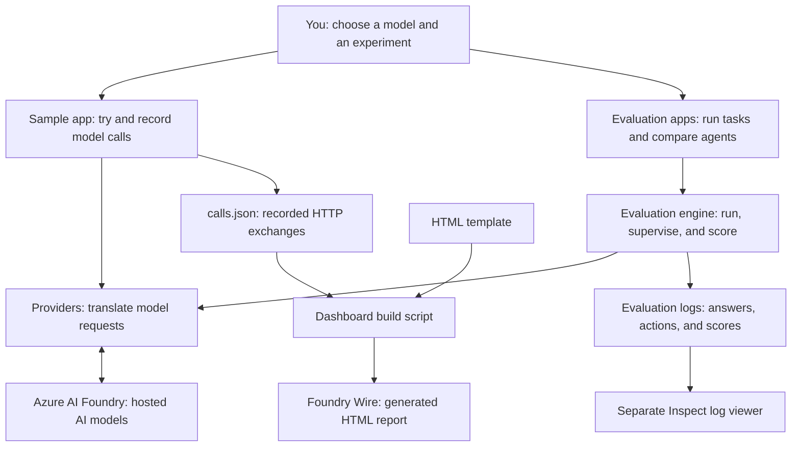
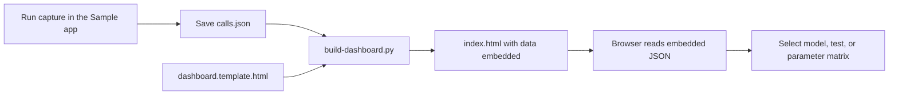
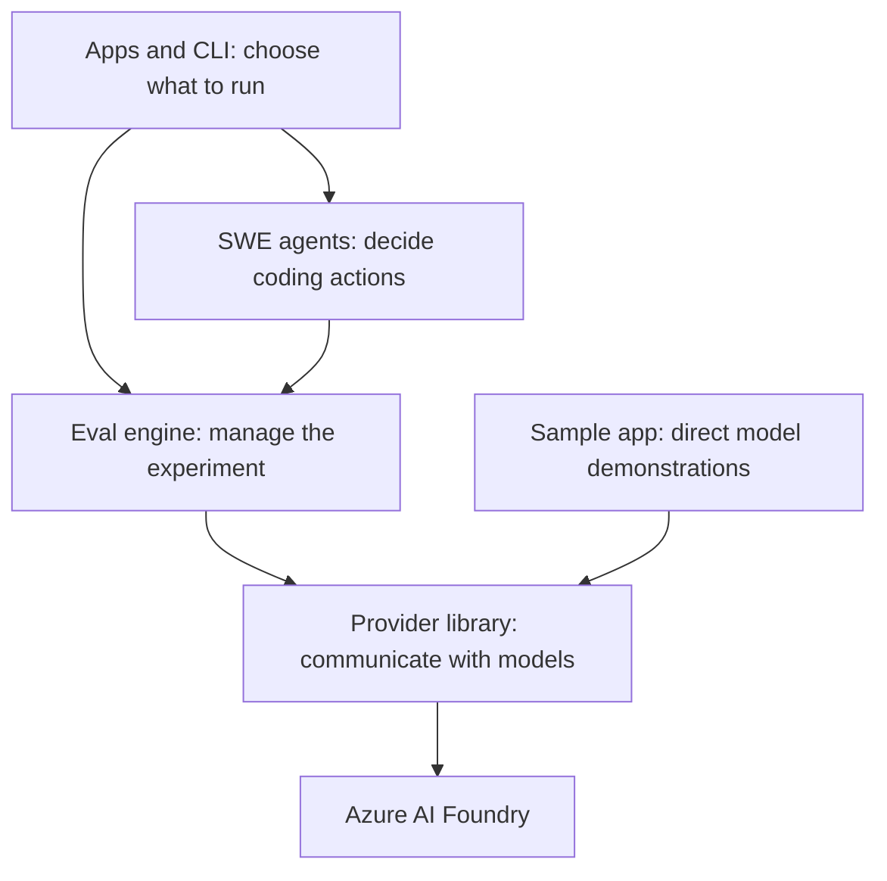
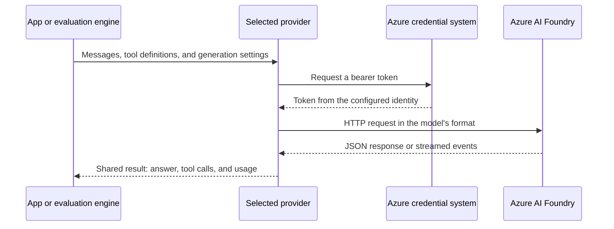
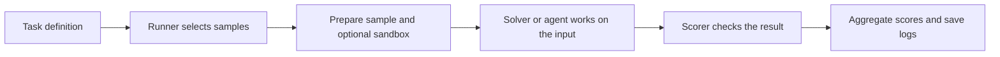
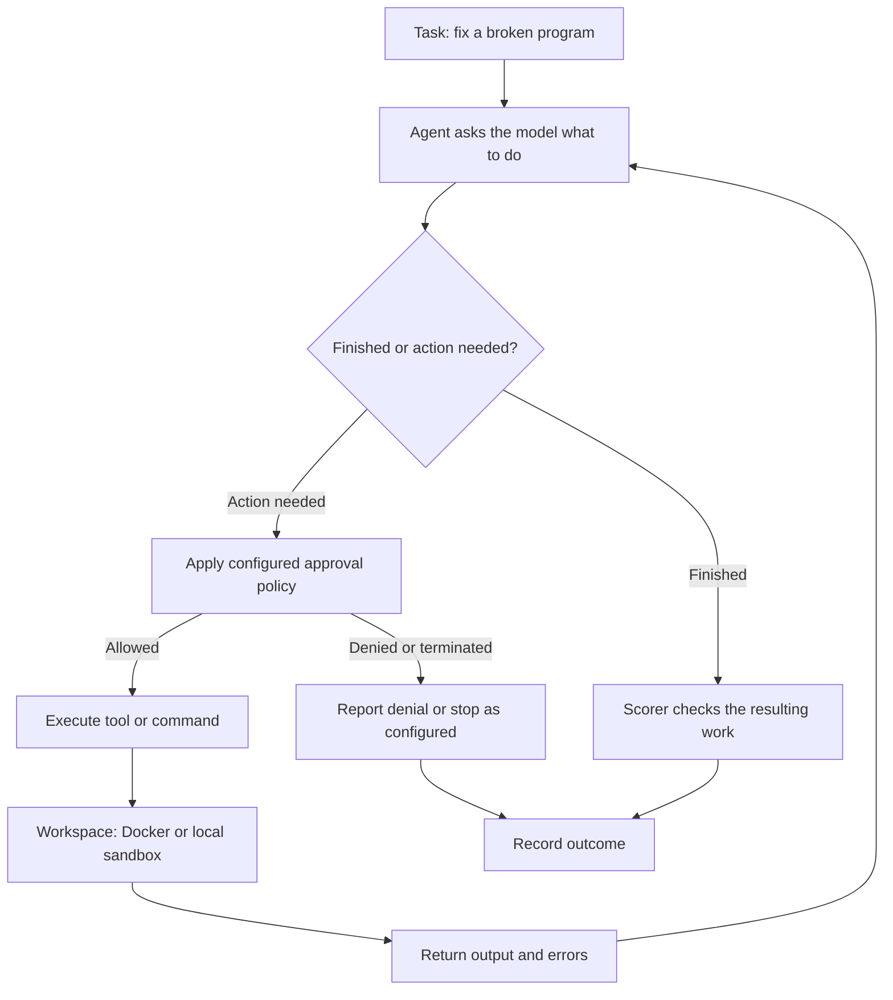

# Architecture overview: InspectAzureAI and Foundry Wire

InspectAzureAI is a toolkit for **trying AI models, testing how well they perform, and inspecting what happened**. It runs on .NET 10 and connects to models deployed in Azure AI Foundry.

The website in this repository, **Foundry Wire**, shows recorded conversations between the toolkit and Azure: requests, responses, errors, and supported model settings.

Think of the product as a **test laboratory**. The .NET programs conduct the experiments, Azure supplies the AI models, and the website is the illustrated lab notebook you read afterward.

This overview describes the local source reviewed on September 5, 2026, including working-tree changes. Paths below are relative to the repository root. Commands also assume you start at that root.

## 1. The whole product in one picture



There are **two reporting paths**. Foundry Wire explains model communication using a capture report. Evaluation logs explain task performance and agent behavior. The dashboard builder reads `calls.json`; it does not automatically turn evaluation logs into the website.

## 2. What can you do with it?

| Capability | Simple example | Where it lives |
|---|---|---|
| Talk to an AI deployment | Send a question and receive an answer | `InspectAzureAI.Sample` and `InspectAzureAI.Provider` |
| Explore model features | Check streaming, tool calls, or reasoning settings | Sample app and provider probes |
| Evaluate answers | Ask a set of questions and score the responses | `InspectAzureAI.Eval` |
| Evaluate coding agents | Give an agent a broken program and check its work | `InspectAzureAI.Swe` and `InspectAzureAI.SweShowcase` |
| Compare combinations | Run deployments across tasks and agents | `InspectAzureAI.ModelMatrix` |
| Inspect model traffic | Read the recorded request and response side by side | `docs/dashboard/index.html` |
| Run evaluations from a terminal | Discover tasks, run them, and manage logs | `InspectAzureAI.Cli` (`inspectai`) |

A model is the AI answering a request. A **deployment** is a named model instance available in your Azure resource. An **agent** adds a work loop around a model so it can take actions, inspect their results, and try again.

## 3. How the website works

Foundry Wire is a **static HTML report with embedded data**. Its HTML defines the page, CSS controls its appearance, and ordinary JavaScript handles the interactive views. This dashboard uses no React or Blazor application layer.

Imagine printing a lab notebook with tabs: selecting a tab changes which saved experiment you see. It does not ask the laboratory to conduct a new experiment.



The three main files are:

| File | Purpose | Analogy |
|---|---|---|
| `docs/dashboard/calls.json` | Saved model checks, parameter probes, and HTTP exchanges | Experiment notes |
| `docs/dashboard/dashboard.template.html` | Layout, styling, field explanations, and interactive JavaScript | Blank notebook design |
| `docs/dashboard/index.html` | Generated page containing the template and captured data | Finished notebook |

The builder inserts the captured JSON into this placeholder:

```html
<!-- From dashboard.template.html -->
<script id="calls" type="application/json">__CALLS_JSON__</script>
```

The browser then loads that embedded data:

```javascript
// From dashboard.template.html
const DATA = JSON.parse(document.getElementById('calls').textContent);
```

JavaScript renders the deployment overview, parameter matrix, and detailed exchanges from `DATA`. It also remembers the selected view in browser `localStorage`.

**Opening the page does not call Azure or fetch `calls.json`.** The report data is already inside the HTML. The template does link to Google Fonts for typography; that is separate from loading model data.

To show new experiments, capture new data and rebuild the page. The page can be opened from disk or served by a static web host; this dashboard needs no application server or database.

## 4. The .NET layers behind the experiments

The main building blocks separate the work into manageable responsibilities:



This is a simplified responsibility diagram, not every project reference. For example, the SWE library also directly uses shared types from the provider library.

| Component | Responsibility | Lab analogy |
|---|---|---|
| Apps / CLI | Accept options and assemble an experiment | Experiment control panel |
| Eval engine | Run samples, manage limits and tools, calculate scores, write logs | Lab supervisor |
| SWE agents | Choose and carry out steps to solve coding tasks | Research assistant |
| Provider library | Convert common requests into each model service's format | Translator |
| Azure AI Foundry | Run the deployed AI model and return its output | External expert |

The `Model` wrapper inside the evaluation engine adds operational behavior around provider calls, including retries, concurrency control, optional caching, and usage/cost handling. The provider handles the service-specific request and response details.

## 5. How one AI request travels

Different model services expect different message formats. The shared `IModelApi` interface gives the caller one consistent way to request an answer.

The Azure provider uses the model-inference route (`/models/chat/completions`). The Anthropic provider handles Claude deployments through the Anthropic Messages route (`/anthropic/v1/messages`). Both return the project's shared result types.

Think of the providers as **travel adapters**: the rest of the application uses one plug, while the adapter fits the destination.



The Azure credential system uses `DefaultAzureCredential`, which can pick up a developer's `az login` or a hosted identity. Credential libraries manage token reuse; the diagram shows the logical authentication step, not a fresh sign-in for every request. This checkout's Azure providers use bearer tokens rather than API-key configuration.

Streaming means the response arrives in pieces, like watching someone type. The provider assembles those pieces and can notify the caller as new content arrives.

## 6. What an evaluation actually does

An evaluation is an **exam with an answer key and a record of the student's work**.

| Term | Plain meaning | Exam analogy |
|---|---|---|
| Dataset | Collection of examples to run | Question paper |
| Sample | One input, possibly with a target answer or files | One question |
| Task | Dataset plus the solving approach, scoring rules, and settings | Complete exam definition |
| Solver | Steps used to produce an answer | Method the student follows |
| Scorer | Checks the resulting answer or work | Marker |
| Metric | Summarizes scores across examples | Overall grade |
| Log | Records the run and what happened within it | Exam record |



The runner can work on several samples at once and enforce configured limits such as turns, tokens, and time. Cost limits require model price data. A successful run means the evaluation completed; it does not necessarily mean the AI answered correctly.

### Small C# example: an exam with one question

This example uses the real project APIs with a scripted model, so it illustrates the evaluation pipeline without contacting Azure. Place it in a .NET 10 console project that references `InspectAzureAI.Eval`.

```csharp
using InspectAzureAI.Eval.Dataset;
using InspectAzureAI.Eval.Model;
using InspectAzureAI.Eval.Runner;
using InspectAzureAI.Eval.Scorers;
using InspectAzureAI.Eval.Tasks;
using InspectAzureAI.Eval.Testing;

// A pretend model gives a predictable answer for this demonstration.
var api = new ScriptedModelApi(ScriptedTurn.Text("Paris"));

var task = new EvalTask
{
    Name = "capital-city-check",
    Dataset = new MemoryDataset(
    [
        new Sample("What is the capital of France?") { Target = "Paris" }
    ]),
    // The default solver asks the model to generate an answer.
    Scorers = [Scorers.Includes()]
};

var log = await Eval.RunAsync(task, new EvalOptions
{
    Model = new Model(api),
    LogDir = "logs/wiki-example",
    MaxSamples = 1
});

Console.WriteLine(log.Status); // Run completion status, not the answer's grade.
```

Here, `Includes()` checks whether the answer contains the target text. It is a simple text check, not a universal test of whether an answer is true. The returned log contains the run's results, and the runner also writes a log file.

## 7. How coding agents get work done

For coding tasks, answering once may not be enough. An agent might inspect a file, change it, run a test, and use the result to decide its next step.

Think of it as an **assistant at a workbench**. The model proposes the next action; the surrounding software executes allowed actions and returns observations.



This is the conceptual loop; individual agents have different completion and error rules. Configured limits can also stop a sample.

The repository supports two SWE approaches:

- **MiniSweAgent:** a native C# loop that asks the model for shell actions and runs them in the sample's sandbox.
- **ClaudeCodeAgent:** launches the actual Claude Code CLI in the sandbox and uses a bridge to route its model requests through the evaluation model layer.

A sandbox is the work area containing task files and commands. Docker provides a container environment; the local implementation runs on the host. They are different execution environments, not equivalent isolation boundaries.

## 8. What is saved, and where?

| Information | Storage | Used by |
|---|---|---|
| Captured HTTP traffic and parameter probes | `docs/dashboard/calls.json` | Dashboard builder |
| Finished wire report | `docs/dashboard/index.html` | Browser |
| Evaluation transcripts, scores, and run details | `.eval` or `.json` log files; default directory is `logs` | Analysis tools and Inspect viewer |
| Cached model responses, when enabled | Prompt-cache files | Evaluation model layer |
| Last selected dashboard view | Browser `localStorage` | Dashboard navigation |

The `.eval` format is a ZIP-based log format. Evaluation results and dashboard captures are file-based artifacts; the architecture shown here does not depend on a central application database.

The command `inspectai view` delegates to the separately installed Python `inspect view`. That viewer is distinct from Foundry Wire and is not implemented as a .NET web application in this port.

During capture, credential headers are redacted. The dashboard builder also refuses to embed recognized credential headers whose values are not marked redacted. This is a credential-header check; it is not general removal of private text from prompts or responses.

## 9. How to refresh the website

These commands illustrate the existing workflow; they were not executed to produce this overview. Live capture requires Azure access, deployed models, and appropriate permissions, and makes model requests.

```bash
# From the repository root, sign in and point at your Foundry resource.
az login
export AZUREAI_BASE_URL="https://<resource>.services.ai.azure.com/models"

# Record model checks and parameter probes.
dotnet run --project src/InspectAzureAI.Sample -- \
  capture --include-failed --params all --out docs/dashboard/calls.json

# Embed the capture into the HTML template.
python3 scripts/build-dashboard.py
```

Open `docs/dashboard/index.html` in a browser to inspect the new report. Changing the template requires rebuilding the HTML; capturing new data also requires rebuilding before the page shows it.

A recorded success or failure describes the deployment and request at capture time. It is not a live health signal or a promise about every future request.

## 10. Where to look in the code

Read these files in order for a guided tour. GitHub links target the reviewed branch, `port/inspect-full`; unpublished local edits may differ from the remote copy.

| Start here | What it explains |
|---|---|
| [Dashboard template](https://github.com/kevinondanet/foundry-providers/blob/port/inspect-full/docs/dashboard/dashboard.template.html) | What the visitor sees and how browser interactions work |
| [Dashboard builder](https://github.com/kevinondanet/foundry-providers/blob/port/inspect-full/scripts/build-dashboard.py) | How captured JSON becomes a standalone HTML report |
| [Provider contract](https://github.com/kevinondanet/foundry-providers/blob/port/inspect-full/src/InspectAzureAI.Provider/Core/IModelApi.cs) | The shared interface for asking models to generate |
| [Task definition](https://github.com/kevinondanet/foundry-providers/blob/port/inspect-full/src/InspectAzureAI.Eval/Tasks/EvalTask.cs) | How datasets, solvers, scorers, and limits fit together |
| [Evaluation runner](https://github.com/kevinondanet/foundry-providers/blob/port/inspect-full/src/InspectAzureAI.Eval/Runner/Eval.cs) | How an evaluation is coordinated |
| [Mini SWE agent](https://github.com/kevinondanet/foundry-providers/blob/port/inspect-full/src/InspectAzureAI.Swe/MiniSwe/MiniSweAgent.cs) | The repeated model/action/observation loop |
| [Claude Code agent](https://github.com/kevinondanet/foundry-providers/blob/port/inspect-full/src/InspectAzureAI.Swe/ClaudeCode/ClaudeCodeAgent.cs) | How the external coding CLI connects to this engine |
| [Viewer command](https://github.com/kevinondanet/foundry-providers/blob/port/inspect-full/src/InspectAzureAI.Cli/Commands/ViewCommand.cs) | Why evaluation-log viewing uses a separate Python tool |
| [Detailed architecture guide](https://github.com/kevinondanet/foundry-providers/blob/port/inspect-full/docs/ARCHITECTURE.md) | Deeper subsystem documentation |

To use this page in GitHub Wiki, copy `Architecture-Overview.md` into the wiki repository, or paste its contents into a page named **Architecture Overview**. Keep the fenced `mermaid` blocks intact so GitHub can render the diagrams.
