# SWE showcase architecture: four agents, one runner, one container per sample

This page walks through the architecture of the **SWE showcase** (`src/InspectAzureAI.SweShowcase`), the console app
that runs Inspect-style coding-agent evaluations against Microsoft Foundry deployments, one Docker container per
sample. It is written for a live demo: every section has a diagram, a verbatim code excerpt, a sample you could
adapt, the commands to type, and what to point out while they run. Section 11 is the presenter's runbook.

Paths are relative to the repository root, and commands assume you start there. The code was read on
2026-09-13 (branch `feat/codex-cli-claude-code-parity`). The reference document behind this page is
`docs/swe-showcase.md`; `docs/container-orchestration.md` and `docs/agent-framework.md` go deeper on sections 5 and 9.

Two things the CLI shows that the diagram in section 1 leaves out: `list` also offers a fifth agent, `copilot` (the GitHub
Copilot CLI inside the sandbox, bridged the same way as Claude Code), and the Model wrapper has a third route,
`responses` (OpenAI Responses API, auto-selected for some deployment names) beside the two providers drawn. Section 4
covers the route; the Copilot agent is outside this page.

## Contents

1. [The architecture in one picture](#1-the-architecture-in-one-picture)
2. [The host: the swe-showcase CLI and the eval runner](#2-the-host-the-swe-showcase-cli-and-the-eval-runner)
3. [The task: EvalTask, dataset, solver and scorers](#3-the-task-evaltask-dataset-solver-and-scorers)
4. [The Model wrapper and the Foundry providers](#4-the-model-wrapper-and-the-foundry-providers)
5. [The Docker sandbox: one container per sample](#5-the-docker-sandbox-one-container-per-sample)
6. [mini-swe-agent: a native C# loop](#6-mini-swe-agent-a-native-c-loop)
7. [basic_agent: Inspect's ReAct loop with the bash tool](#7-basic_agent-inspects-react-loop-with-the-bash-tool)
8. [Claude Code through the SandboxAgentBridge](#8-claude-code-through-the-sandboxagentbridge)
9. [Microsoft Agent Framework in-process through InspectChatClient](#9-microsoft-agent-framework-in-process-through-inspectchatclient)
10. [The eval log and the show command](#10-the-eval-log-and-the-show-command)
11. [Demo runbook](#11-demo-runbook)

## 1. The architecture in one picture

> **In plain words.** The diagram shows the moving parts and who talks to whom. On the host, the console app
> calls the eval runner, which runs a task (dataset, solver, scorers), and every model call goes through one
> `Model` wrapper before it reaches Foundry. Each sample gets its own Docker container; the agents differ in how
> they use it. mini-swe-agent and the basic agent run their loop on the host and only send bash commands into
> the container. Claude Code is the opposite: the real CLI runs inside the container and, because it wants to
> call an Anthropic API, the host runs a small "bridge" web server that pretends to be that API and forwards the
> calls to Foundry. The Agent Framework agent also uses the bridge, but calls it in-process with no HTTP. The
> bullets underneath say the same thing in words.

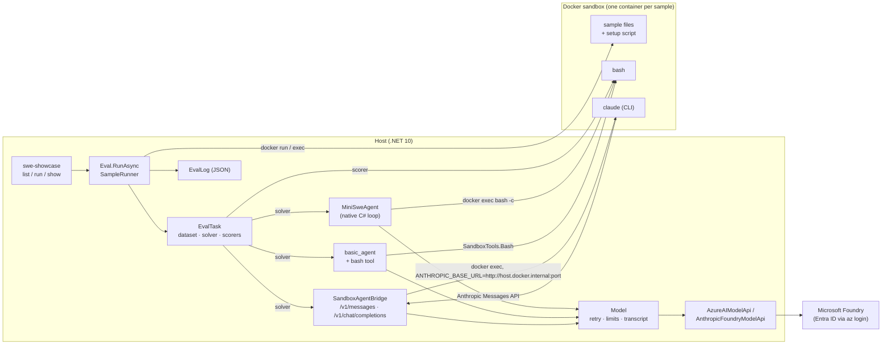

- The **runner** initialises the sandbox provider once per task (building the image), then runs every
  (sample, epoch) with bounded concurrency: container up, files copied, setup script, the solver, the scorers,
  container down, one `EvalSample` in the log.
- **Agents** are `AgentDef`s turned into solvers with `Agents.AsSolver`; the sample's ambient `SampleContext`
  gives them the model, the sandbox, the store, the transcript and `score()`.
- **Claude Code** is the only component that talks HTTP: the CLI inside the container is pointed at the
  host-side `SandboxAgentBridge` (`ANTHROPIC_BASE_URL=http://host.docker.internal:<port>`, a per-run bearer
  token), which translates the Anthropic Messages API into `Model.GenerateAsync` calls and reconstructs the
  agent's conversation from the request/response threads.
- **Agent Framework** (`--agent maf`) talks no HTTP: the framework's `ChatClientAgent` is given an
  `InspectChatClient`, an `IChatClient` over the same `AgentBridge`, so its function-calling loop runs in-process
  while every model call, approval decision and limit is Inspect's; the sandbox `bash` tool is handed to the
  framework as an `AIFunction`.
- Every model call goes through `Model`, so the retry loop, the message/token limits, the `ModelEvent`s in the
  transcript and the usage in the log are the same for all four agents.

## 2. The host: the swe-showcase CLI and the eval runner

> **In plain words.** `swe-showcase run` is a thin front door: it reads the flags, picks a built-in task and an
> agent, signs in to Foundry (or uses a scripted model under `--fake`) and hands one `EvalTask` to the eval
> runner. The runner does the repetitive work so no agent has to: it prepares the sandbox once, then for every
> sample and epoch it starts a container, copies the sample's files in, runs the agent, runs the scorers, removes
> the container and writes one record to the log. Agents never get these things as parameters; they find the
> model, the sandbox, the store and the transcript in an ambient per-sample context. When the run ends the CLI
> prints a summary and an exit code that says whether anything went wrong.

### From `swe-showcase run` to `Eval.RunAsync`

`Program.cs` turns Ctrl+C into a `CancellationToken` (a cancelled run still removes its sandboxes and writes a
`cancelled` log) and calls `Cli.RunAsync`. `RunOptions.Parse` strips the flags from the argument list — a bad
flag is a `UsageError` — and the first remaining word selects `list`, `run` or `show`. `Cli.RunEvalAsync` resolves
the task (`ShowcaseTasks.Resolve`) and the agent (`AgentChoice.Resolve`), picks the sandbox (`docker` by default,
`local` under `--fake`), creates the `Model` — `FakeScripts.For` offline, otherwise `FoundryModels.Create` plus a
token preflight so a sign-in problem becomes exit code 3 before any sample runs — and builds the `EvalTask` with
the agent already wrapped as a solver (`AgentChoice.Solver` calls `Agents.AsSolver`; the task itself is
[section 3](#3-the-task-evaltask-dataset-solver-and-scorers)). `RunWiring.EvalOptions` maps the flags onto
`EvalOptions` (limit, sample ids, epochs, `MaxSamples`, log dir and format, cleanup, approval, cost limit, hooks)
and `Eval.RunAsync(task, evalOptions, cancellationToken)` returns the `EvalLog` that `PrintSummary` prints.

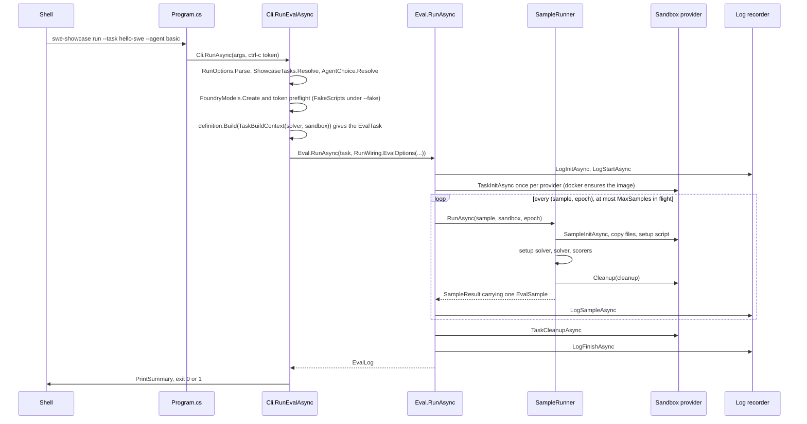

Exit codes are decided in two places. `RunEvalAsync` returns 1 when the log's status is `error` or any sample
carries an error, else 0. `Cli.RunAsync` maps exceptions: `UsageError` and `PrerequisiteError` (a missing
Dockerfile or dataset) give 2; sign-in failures, Azure request failures, `SandboxUnavailableException`, Ctrl+C
and any other exception give 3.

### The runner: one task, samples × epochs, bounded concurrency

`Eval.RunCoreAsync` settles what the CLI left open: the model (`EvalTask.Model` wins over `EvalOptions.Model`),
the samples (`--sample-id` wins over `--limit`; missing ids become 1-based positions), the epochs and the limits
(eval-level values override the task's). It opens the log recorder (`LogInitAsync`, `LogStartAsync`), calls
`TaskInitAsync` once per distinct sandbox spec — for Docker that is `DockerImages.EnsureAsync`, the one-time
image build — then schedules every (sample, epoch) pair and waits for all of them:

```csharp
// src/InspectAzureAI.Eval/Runner/Eval.cs:211-225
            foreach (var providerSpec in providerSpecs)
            {
                await SandboxRegistry.Get(providerSpec.Type).TaskInitAsync(task.Name, providerSpec.Config, cancellationToken).ConfigureAwait(false);
            }

            var runs = new List<Task>(results.Length);
            for (var i = 0; i < samples.Count; i++)
            {
                for (var epoch = 1; epoch <= epochs; epoch++)
                {
                    runs.Add(RunSampleAsync(i * epochs + epoch - 1, samples[i], sandboxSpecs[i], epoch));
                }
            }

            await Task.WhenAll(runs).ConfigureAwait(false);
```

Each `RunSampleAsync` first acquires a lease from the semaphore `SampleScheduler.CreateSampleSemaphore` builds
from `MaxSamples` (`--max-samples`, CLI default 4), so at most that many containers exist at once. It calls
`SampleRunner.RunAsync`, adds the sample's model usage to the run totals, writes the sample with `LogSampleAsync`
(condensed, flushed at the recorder's buffer cadence) and reports it to the console. An errored sample is logged
and counted; when the fail-on-error policy is met the shared `abort` token cancels the samples still in flight.
(`EvalOptions.RetryOnError` re-runs an errored sample from scratch; the showcase CLI leaves it unset.) The
`finally` runs `TaskCleanupAsync` for every provider, then the status is fixed — `Success`, `Cancelled` or
`Error` — metrics are computed, `LogFinishAsync` closes the file, and a cancelled run rethrows only after the log
is safe on disk.

### `SampleRunner`: the per-sample lifecycle

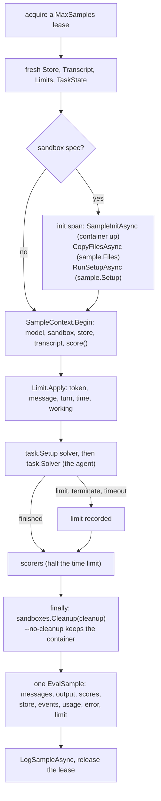

`SampleRunner.RunAsync` is the port of Python's `_task_run_sample_attempt`. Every attempt starts from a fresh
`Store`, `Transcript` and `Limits` and a `TaskState` built from the sample. Inside an `init` span,
`SandboxSetup.InitAsync` asks the provider for the environments (`SampleInitAsync` starts the container — see
[section 5](#5-the-docker-sandbox-one-container-per-sample)), copies `sample.Files` in and runs `sample.Setup`;
if either later step fails the container is removed before the error propagates. Then the ambient context is
installed:

```csharp
// src/InspectAzureAI.Eval/Runner/SampleRunner.cs:128-140
            var context = new SampleContext
            {
                ActiveModel = model,
                Store = store,
                Transcript = transcript,
                Limits = limits,
                Sandboxes = sandboxes,
                SampleState = state,
                Scorer = task.Scorers.Count > 0
                    ? scored => ScoreIntermediateAsync(scored, sample, state, transcript, cancellationToken)
                    : null,
            };
            using var scope = SampleContext.Begin(context);
```

The token, message, turn, time and working limits are a scope around the solvers, so the agent cannot outlive
them; a limit, or an approver terminating the sample, ends the solver but the sample is still scored, which is
why a log record can carry both a `limit` and scores. Scoring gets half the sample's time limit. The `finally`
calls the sandbox's `Cleanup(cleanup)` delegate — `--no-cleanup` keeps the container for inspection — and the
method assembles one `EvalSample` (messages, output, scores, store, transcript events, model usage, timings,
error, limit) that `Eval` writes to the log ([section 10](#10-the-eval-log-and-the-show-command)).

### The ambient `SampleContext`

`SampleContext` is an `AsyncLocal`, so it flows through every `await` into solvers, tools and agents without
being passed along. `Begin` installs it and restores the previous one on dispose; `Require()` throws outside a
sample. It carries `ActiveModel` (Python's `get_model()`), `Store`, `Transcript`, `Limits`, `Sandboxes` with the
`Sandbox(name)` resolver, `SampleState` and `Scorer` (Python's `score()`). This is the one contract all four
agents share: `MiniSweAgent.cs:85-87` does `SampleContext.Require()` and reads `context.ActiveModel` and
`context.Sandbox(...)`; `SandboxTools.cs:29` reaches the same sandbox for the basic agent's `bash` tool.

### Using the runner from your own code

```csharp
// Illustrative (not in the repository): the wiring Cli.RunEvalAsync does, with a two-line agent.
using InspectAzureAI.Eval.Agents;
using InspectAzureAI.Eval.Context;
using InspectAzureAI.Eval.Dataset;
using InspectAzureAI.Eval.Model;
using InspectAzureAI.Eval.Runner;
using InspectAzureAI.Eval.Sandbox;
using InspectAzureAI.Eval.Tasks;

// Agents take no model or sandbox parameters: they read the ambient SampleContext.
var probe = new AgentDef("probe", "records the container's kernel name", async (state, ct) =>
{
    var context = SampleContext.Require();
    var result = await context.Sandbox().ExecAsync(["uname", "-s"], cancellationToken: ct);
    context.Store.Set("kernel", result.Stdout.Trim());   // lands in the EvalSample's store
    return state;
});

var task = new EvalTask
{
    Name = "probe",
    Dataset = new MemoryDataset([new Sample("Which kernel runs in the sandbox?")]),
    Solver = Agents.AsSolver(probe),                      // no Scorers: the summary prints "no scores"
    Sandbox = new SandboxSpec("docker", "src/InspectAzureAI.SweShowcase/sandbox"),
};

var log = await Eval.RunAsync(task, new EvalOptions
{
    Model = FoundryModels.Create("gpt-5.4-mini"),         // Entra ID via az login
    MaxSamples = 4,
    LogDir = "logs",
    Reporter = new ConsoleEvalReporter(),
});
Console.WriteLine($"{log.Status}: {log.Location}");
```

### Try it

```bash
# offline: the built-in tasks and agents (needs only the .NET SDK and a prior dotnet build)
dotnet run --project src/InspectAzureAI.SweShowcase --no-build -- list

# offline: scripted model, local sandbox, basic agent, log into a scratch directory
dotnet run --project src/InspectAzureAI.SweShowcase --no-build -- run --fake --sandbox local \
  --task hello-swe --agent basic \
  --log-dir /private/tmp/claude-501/-Users-kevinburrowes-Documents-code-inspect-azureai-dotnet/b60a5f4b-bb06-4856-9b6d-c5c67736c085/scratchpad/demo-logs
echo "exit $?"

# needs a Docker daemon and Foundry sign-in (az login, AZUREAI_BASE_URL); not run here
dotnet run --project src/InspectAzureAI.SweShowcase -- run --task hello-swe --agent mini-swe --max-samples 2
```

`list` (trimmed):

```
tasks:
  hello-swe        3 samples  scorer=exec_check       three small Python edits, each verified by a bash check command
  pytest-fix       2 samples  scorer=exec_check       fix a tiny package until its pytest suite passes
  system-explorer  2 samples  scorer=model_graded_qa  two questions about the container, judged by model_graded_qa
  ctf              3 samples  scorer=includes         three picoCTF-style flag hunts planted by setup scripts, scored by includes

agents:
  mini-swe         native C# port of mini-swe-agent's bash tool-calling loop (inspect_swe mini_swe_agent)
  claude-code      the Claude Code CLI inside the sandbox, its API calls bridged to the task model (inspect_swe claude_code)
  basic            Inspect's basic_agent ReAct loop with the sandbox bash tool and a submit tool
  maf              a Microsoft Agent Framework ChatClientAgent with the sandbox bash tool, its model calls bridged in-process to the task model
```

The `--fake` run (trimmed; blank lines and the full log path removed):

```
task     : hello-swe (3 samples, scorer exec_check)
agent    : basic (attempts 1)
model    : scripted (--fake: scripted turns, no network)
sandbox  : local (temp directory on this host; demo only)
sample 1 (epoch 1) started
sample 2 (epoch 1) started
sample 3 (epoch 1) started
sample 3 (epoch 1) completed: exec_check=I (221 tokens, 0.1s)
sample 2 (epoch 1) completed: exec_check=I (221 tokens, 0.1s)
sample 1 (epoch 1) completed: exec_check=C (662 tokens, 1.7s)
Log written to .../demo-logs/<timestamp>_hello-swe_<id>.eval
status   : success (3/3 samples completed)
tokens   : 1104 (983 in, 121 out)
exec_check         accuracy      0.333
exit 0
```

### What to point out in the demo

- The header block (task, agent, model, sandbox, log dir) is printed before any sample runs, so the audience can
  check the wiring; `--fake` says so on the `model` line.
- All three `started` lines appear at once and the samples complete out of order: that is `--max-samples`
  (default 4) at work. Re-run with `--max-samples 1` to watch them serialise.
- The scripted model only knows sample 1, so `C, I, I` and accuracy 0.333 is the expected result, not a bug; the
  runner still scored, logged and cleaned up every sample.
- Even the fake model's calls are counted on the `tokens` line — the same accounting the Foundry run shows.
- `echo $?` gives 0; a sample that errors would make it 1, a bad flag 2, a sign-in failure 3.
- Press Ctrl+C during a Docker run: the containers are removed, a `cancelled` log is written, exit code 3.

### Where to look

- `src/InspectAzureAI.SweShowcase/Program.cs` — Ctrl+C becomes a `CancellationToken`; calls `Cli.RunAsync`.
- `src/InspectAzureAI.SweShowcase/Cli.cs` — help text, `list`/`run`/`show` dispatch, `RunEvalAsync`, exit-code
  mapping, `PrintSummary`.
- `src/InspectAzureAI.SweShowcase/RunOptions.cs` — the `run` flags, `DefaultMaxSamples = 4`, `--sandbox` validation.
- `src/InspectAzureAI.SweShowcase/RunWiring.cs` — flags to `EvalOptions`, hook creation, the header lines.
- `src/InspectAzureAI.SweShowcase/AgentChoice.cs` — agent name to solver via `Agents.AsSolver`.
- `src/InspectAzureAI.Eval/Runner/Eval.cs` — `RunAsync`, sample scheduling, fail-on-error, status, log finish.
- `src/InspectAzureAI.Eval/Runner/EvalOptions.cs` — every eval-level knob with its Python name.
- `src/InspectAzureAI.Eval/Runner/SampleRunner.cs` — the per-(sample, epoch) lifecycle.
- `src/InspectAzureAI.Eval/Runner/SandboxSetup.cs` — environments, files, setup script, cleanup on failure.
- `src/InspectAzureAI.Eval/Concurrency/SampleScheduler.cs` — `CreateSampleSemaphore` from `MaxSamples`.
- `src/InspectAzureAI.Eval/Runner/IEvalReporter.cs` — `ConsoleEvalReporter`, the per-sample console lines.
- `src/InspectAzureAI.Eval/Context/SampleContext.cs` — the ambient per-sample services.

## 3. The task: EvalTask, dataset, solver and scorers

> **In plain words.** A task is the recipe for one eval: which problems to pose (the dataset), which agent
> tries them (the solver), how each answer is judged (the scorers), how long an attempt may run (the limits)
> and where it runs (the sandbox). The showcase keeps its problems in small JSON files next to the executable,
> and every problem carries a one-line bash command that decides pass or fail. When you run a task, each
> problem becomes a working state, the agent works on that state inside its own container, and afterwards the
> scorer runs the check command in the same container: exit code 0 means correct. The pass/fail marks are
> added up into an accuracy at the end.

### What an EvalTask bundles

`EvalTask` (`src/InspectAzureAI.Eval/Tasks/EvalTask.cs`) is a C# `record` mirroring Python's `Task`: `Name`,
`Dataset` (an `IDataset`), an optional `Setup` solver, the main `Solver` (default `Solvers.Generate()`),
`Scorers` (a list of `ScorerDef`), an optional task-level `Metrics`/`MetricsByKey` override, `Config`,
`Sandbox` (a `SandboxSpec`), `Epochs`, `FailOnError` (converts implicitly from `bool`), the per-sample
limits (`MessageLimit`, `TokenLimit`, `TimeLimit`, `CostLimit`, `TurnLimit`, `WorkingLimit`), plus `Model`,
`ModelRoles`, `Approval`, `Metadata` and `TaskArgs`. There is no `@task` decorator in the library; the
showcase's `ShowcaseTasks.All` list is the registry that `list` and `run --task` consult.

### hello-swe: dataset.json plus a check command

Each built-in task is a `ShowcaseTask(Name, Description, ScorerName, Build)`. `Build` receives a
`TaskBuildContext(Solver, Sandbox)`: the `--agent` choice already turned into a `Solver` by
[the runner host](#2-the-host-the-swe-showcase-cli-and-the-eval-runner), and the `--sandbox` choice as
`new SandboxSpec("docker", <directory holding the Dockerfile>)` or `new SandboxSpec("local")`
(`Cli.cs:334`). The task itself is twelve lines:

```csharp
// src/InspectAzureAI.SweShowcase/BuiltinTasks/HelloSweTask.cs:17-28
    private static EvalTask Build(TaskBuildContext context) => new()
    {
        Name = Name,
        Dataset = Datasets.Json(TaskData.DatasetPath(Name)),
        Solver = context.Solver,
        Scorers = [ExecCheckScorer.Create()],
        Sandbox = context.Sandbox,
        MessageLimit = ShowcaseLimits.MessageLimit,
        TimeLimit = ShowcaseLimits.TimeLimit,
        // A demo should show every sample; a failed one is recorded (and reported through the exit code) instead of aborting the run.
        FailOnError = false,
    };
```

`Datasets.Json` is the port of `json_dataset`: it reads the array, maps the default field names (`id`, `input`,
`target`, `metadata`, `files`, `setup`) onto `Sample` records, and `SampleRecords.ResolveFiles` turns every
`files` value that exists relative to the dataset file into an absolute path, so `"words.py": "files/words.py"`
points at `tasks/hello-swe/files/words.py`; anything else is kept as inline content. `TaskData.DatasetPath`
looks for `tasks/<name>/dataset.json` next to the executable and throws a `PrerequisiteError` (exit code 2)
when the project has not been built. `ShowcaseLimits` gives every built-in task 200 messages and 20 minutes;
the runner scores whatever state a limited sample has.

### From Sample to TaskState to Score

```mermaid
flowchart LR
    DS["tasks/hello-swe/dataset.json"] -->|"Datasets.Json"| S["Sample<br/>id, input, target, files, metadata.check"]
    S -->|"SampleRunner.RunAsync<br/>one per sample and epoch"| TS["TaskState<br/>messages, metadata, store, limits"]
    TS -->|"EvalTask.Solver<br/>the --agent choice"| TS2["TaskState<br/>messages and output filled in"]
    TS2 -->|"ExecCheckScorer<br/>bash -c metadata.check in the sandbox"| SC["Score<br/>C on exit 0, else I<br/>explanation = command output"]
    SC -->|"accuracy and stderr<br/>over all samples"| M["EvalLog results<br/>exec_check accuracy"]
```

[The runner](#2-the-host-the-swe-showcase-cli-and-the-eval-runner) builds one `TaskState` per (sample, epoch):

```csharp
// src/InspectAzureAI.Eval/Runner/SampleRunner.cs:87-99
        var state = new TaskState(
            model.Name,
            sample.Id!,
            epoch,
            sample.Input,
            sample.Input.ToMessages(),
            sample.Target,
            sample.Choices,
            messageLimit: messageLimit,
            tokenLimit: tokenLimit,
            metadata: sample.Metadata?.ToDictionary(pair => pair.Key, pair => pair.Value, StringComparer.Ordinal),
            store: store,
            sampleUuid: attempt.SampleUuid);
```

`Input.ToMessages()` becomes the first user message; the sample's `Metadata` is copied (a solver may edit its
copy); the state also carries `Target`, `Store`, `Tools`, `Output` and the limit nodes attached through
`AttachLimits`. The sample's `files` and `setup` are applied by
[the sandbox](#5-the-docker-sandbox-one-container-per-sample) before the solver runs. After the solver, the
runner runs every `ScorerDef.Score(state, target, ct)` inside a `scorers` span, keyed by scorer name into
`state.Scores` and the per-sample `SampleScore`s, with its own budget of half the sample time limit. Once all
samples are in, `EvalResultsBuilder.ComputeResults` applies each scorer's metrics (or the task's `Metrics`
override) to produce the `results` of [the eval log](#10-the-eval-log-and-the-show-command).

### The exec_check scorer

`ExecCheckScorer.Create()` is the hand-written equivalent of `@scorer(metrics=[accuracy(), stderr()])`, built
with `Scorers.Custom(name, scorer, metrics)`:

```csharp
// src/InspectAzureAI.SweShowcase/BuiltinTasks/ExecCheckScorer.cs:23-33
        return Scorers.Custom(Name, async (state, _, cancellationToken) =>
        {
            var check = state.Metadata.TryGetValue(MetadataKey, out var value) && value is string command && command.Length > 0
                ? command
                : throw new InvalidOperationException($"Sample {state.SampleId} has no '{MetadataKey}' command in its metadata.");
            var metadata = new Dictionary<string, object?>(StringComparer.Ordinal) { [MetadataKey] = check };
            ExecResult result;
            try
            {
                result = await SampleContext.Require().Sandbox().ExecAsync(["bash", "-c", check], timeout: limit, cancellationToken: cancellationToken);
            }
```

```csharp
// src/InspectAzureAI.SweShowcase/BuiltinTasks/ExecCheckScorer.cs:44-52
            metadata["returncode"] = result.ReturnCode;
            var output = Output(result);
            return new Score(result.Success ? ScoreConstants.Correct : ScoreConstants.Incorrect)
            {
                Answer = state.Output.Completion,
                Explanation = output.Length > 0 ? output : $"exit code {result.ReturnCode}",
                Metadata = metadata,
            };
```

The command comes from `state.Metadata["check"]`, the sandbox from the ambient `SampleContext`, so the check
runs in the very container the agent just edited. `result.Success` (exit 0) scores `C`, anything else `I`;
stdout and stderr become the `Explanation` and the exit code goes into the score metadata. The `catch` between
the two excerpts turns a `SandboxTimeoutException` (default 120 s) into `I` rather than a sample error. A
sample without a `check` throws, which is a task-authoring bug and does surface as a sample error.

### The other three tasks

- `pytest-fix` (2 samples): tiny `textkit` and `mathkit` packages with a failing suite; same `ExecCheckScorer`,
  the check being `python3 -m pytest -q`.
- `system-explorer` (2 samples): questions answered by poking at the container, scored by
  `Scorers.ModelGradedQa()` with the task model as judge.
- `ctf` (3 samples): each sample's `setup` script plants a picoCTF-style flag; the solver is
  `Solvers.Chain(Solvers.SystemMessage(Prompt), context.Solver)` and the scorer `Scorers.Includes()`.

### Writing your own task

Illustrative, not in the repository; every type and method below exists with this spelling. `Models.Create`
needs `AZUREAI_BASE_URL` and an `az login` session.

```csharp
// illustrative: a one-sample task with a custom sandbox scorer and a plain tool-calling solver
using InspectAzureAI.Eval.Context;
using InspectAzureAI.Eval.Dataset;
using InspectAzureAI.Eval.Model;
using InspectAzureAI.Eval.Runner;
using InspectAzureAI.Eval.Sandbox;
using InspectAzureAI.Eval.Scorers;
using InspectAzureAI.Eval.Solvers;
using InspectAzureAI.Eval.Tasks;
using InspectAzureAI.Eval.Tools;

var fileExists = Scorers.Custom("file_exists", async (state, target, ct) =>
{
    var result = await SampleContext.Require().Sandbox()
        .ExecAsync(["test", "-f", target.Text], timeout: TimeSpan.FromSeconds(30), cancellationToken: ct);
    return new Score(result.Success ? ScoreConstants.Correct : ScoreConstants.Incorrect)
    {
        Answer = state.Output.Completion,
        Explanation = result.Success ? "file present" : $"exit code {result.ReturnCode}",
    };
}, Metrics.Accuracy(), Metrics.Stderr());

var task = new EvalTask
{
    Name = "touch-file",
    Dataset = new MemoryDataset(
    [
        new Sample("Create an empty file named done.txt in the current directory.") { Id = 1, Target = "done.txt" },
    ]),
    Solver = Solvers.Chain(Solvers.UseTools(SandboxTools.Bash()), Solvers.Generate()),
    Scorers = [fileExists],
    Sandbox = new SandboxSpec("docker", "src/InspectAzureAI.SweShowcase/sandbox"),
    MessageLimit = 50,
    TimeLimit = TimeSpan.FromMinutes(5),
    FailOnError = false,
};

EvalLog log = await Eval.RunAsync(task, new EvalOptions { Model = Models.Create("gpt-5.4-mini"), LogDir = "logs" });
```

### Try it

Build once (`dotnet build src/InspectAzureAI.SweShowcase`) so the `--no-build` commands work and `tasks/**`
is copied next to the executable.

```bash
# offline: the task registry (it loads each dataset to count the samples)
dotnet run --project src/InspectAzureAI.SweShowcase --no-build -- list
```

```text
tasks:
  hello-swe        3 samples  scorer=exec_check       three small Python edits, each verified by a bash check command
  pytest-fix       2 samples  scorer=exec_check       fix a tiny package until its pytest suite passes
  system-explorer  2 samples  scorer=model_graded_qa  two questions about the container, judged by model_graded_qa
  ctf              3 samples  scorer=includes         three picoCTF-style flag hunts planted by setup scripts, scored by includes
```

```bash
# offline: the hello-swe dataset; the check lives in the data, not in code
cat src/InspectAzureAI.SweShowcase/tasks/hello-swe/dataset.json
```

```json
  {
    "id": 1,
    "input": "Create a file named hello.py in the current directory. Running `python3 hello.py` must print exactly `Hello, Inspect!` on a single line.",
    "target": "python3 hello.py prints Hello, Inspect!",
    "metadata": {
      "check": "test \"$(python3 hello.py)\" = \"Hello, Inspect!\""
    }
  },
```

```bash
# offline: a scripted model solves sample 1 on this host (needs python3 on PATH); exec_check runs all three checks
dotnet run --project src/InspectAzureAI.SweShowcase --no-build -- run --fake --sandbox local --task hello-swe --agent mini-swe \
  --log-dir /private/tmp/claude-501/-Users-kevinburrowes-Documents-code-inspect-azureai-dotnet/b60a5f4b-bb06-4856-9b6d-c5c67736c085/scratchpad/demo-logs
```

```text
task     : hello-swe (3 samples, scorer exec_check)
agent    : mini-swe (attempts 1)
model    : scripted (--fake: scripted turns, no network)
sandbox  : local (temp directory on this host; demo only)
sample 1 (epoch 1) completed: exec_check=C (2503 tokens, 0.3s)
sample 3 (epoch 1) completed: exec_check=I (842 tokens, 0.2s)
sample 2 (epoch 1) completed: exec_check=I (841 tokens, 0.2s)
status   : success (3/3 samples completed)

scorer             metric        value
exec_check         accuracy      0.333
exec_check         stderr        0.333
```

```bash
# needs az login, AZUREAI_BASE_URL and a running Docker daemon: the real task, one container per sample
dotnet run --project src/InspectAzureAI.SweShowcase -- run --task hello-swe --agent mini-swe
```

### What to point out in the demo

- The task is a plain record with four fields that matter here: dataset, solver, scorers, sandbox. Open
  `HelloSweTask.cs` and read it aloud; it fits on one screen.
- `--agent` changes only `Solver`. Dataset, scorer, limits and sandbox are identical for all four agents, which
  is what makes the accuracy numbers comparable.
- The pass/fail rule is data, not code: point at `metadata.check` in `dataset.json`, then at the one line in
  `ExecCheckScorer` that runs it with `bash -c` in the sample's own container after the agent has finished.
- Exit 0 is `C`, anything else is `I`; a check that hangs past 120 s is `I`, not an error, and a sample that
  hits the 200-message or 20-minute limit is still scored on whatever it managed to do.
- The `--fake` run is deterministic: the scripted model solves sample 1 and gives up on the rest, so an offline
  run always reports 1/3 correct; that is your smoke test before touching Foundry.

### Where to look

- `src/InspectAzureAI.Eval/Tasks/EvalTask.cs` - the task record and every knob the runner consumes.
- `src/InspectAzureAI.SweShowcase/BuiltinTasks/HelloSweTask.cs` - the hello-swe definition.
- `src/InspectAzureAI.SweShowcase/BuiltinTasks/ExecCheckScorer.cs` - the `bash -c metadata.check` scorer.
- `src/InspectAzureAI.SweShowcase/BuiltinTasks/TaskData.cs` - locates `tasks/<name>/dataset.json` next to the exe.
- `src/InspectAzureAI.SweShowcase/ShowcaseTasks.cs` - `ShowcaseTask`, `TaskBuildContext`, `ShowcaseLimits`, the registry.
- `src/InspectAzureAI.SweShowcase/tasks/hello-swe/dataset.json` - the three samples and their check commands.
- `src/InspectAzureAI.Eval/Dataset/Sample.cs` - the `Sample` record (input, target, metadata, files, setup).
- `src/InspectAzureAI.Eval/Dataset/SampleRecords.cs` - relative `files`/`setup` paths resolved against the dataset.
- `src/InspectAzureAI.Eval/Solvers/TaskState.cs` - the mutable state a solver chain and the scorers work on.
- `src/InspectAzureAI.Eval/Runner/SampleRunner.cs` - Sample to TaskState, sandbox init, solver, scorer loop.
- `src/InspectAzureAI.Eval/Scorers/ScorerDelegates.cs` - `Scorer` delegate, `ScorerDef`, `ScoreConstants`.

## 4. The Model wrapper and the Foundry providers

> **In plain words.** Whatever agent is running, every request to a language model passes through one C# class,
> `Model`, before it leaves the host. That is where the boring but essential things happen once instead of four
> times: it retries when Foundry says "slow down", it stops a sample that has used too many messages, tokens or
> dollars, and it writes a record of every attempt into the transcript so the log can show exactly what was sent
> and what came back. Underneath it sit small "providers" that each speak one wire protocol to Foundry, and the
> deployment name decides which one is used. Sign-in is your `az login`; no API key is read anywhere.

### One wrapper, every agent

`Model` (`src/InspectAzureAI.Eval/Model/Model.cs`) is the port of Inspect's `Model.generate`. Its `GenerateAsync`
overloads take a prompt string or a `ChatMessage` list plus optional tools, a `ToolChoice`, a `GenerateConfig`, a
`CachePolicy` and a stream handler, and return a `ModelOutput`. One call, in order:

1. merges the per-call config into the model's `GenerateConfig` and fills `MaxTokens` from the provider's
   `MaxTokens()` rule when the caller did not set it;
2. checks the sample's **message limit** before anything is sent;
3. takes a connection slot (the provider's `MaxConnections()`), then consults the **prompt cache** when a
   `CachePolicy` is in force: a hit is recorded as a `CacheMode.Read` event and returned without a provider call;
4. calls `IModelApi.GenerateAsync` inside an attempt scope (attempt timeout, stream-idle timeout);
5. on success prices the output (`ModelCosts.PriceOutput`), records usage per model and per role, then checks
   the **token limit** and the **cost limit**;
6. on failure asks the provider's `ShouldRetry`; if the answer is yes and neither `MaxRetries` nor the retry
   `Timeout` budget is spent, it sleeps `Retry-After` or a jittered exponential backoff and loops. The wait is
   credited to the sample's waiting time so the **working-time limit** does not count it as work.

Every attempt, successful or not, becomes a `ModelEvent` (`ModelEvent.cs`): model, role, input, tools, config,
output or error, the raw `ModelCall`, `Retries`, `Cache` and `WorkingTime`. That is what the eval log and
[the show command](#10-the-eval-log-and-the-show-command) read back. The defaults live in `ModelRetryOptions`:
5 retries (6 attempts), backoff starting at 3 s and doubling to a 60 s cap with full jitter, an optional
whole-call `Timeout`, and an injectable `Delay` so tests never sleep.

```csharp
// src/InspectAzureAI.Eval/Model/Model.cs:290-313
            var decision = thrown switch
            {
                null => RetryDecision.No(),
                AttemptTimeoutException or StreamIdleTimeoutException => RetryDecision.Transient(),
                _ => ModelApiHooks.ShouldRetry(Api, thrown),
            };
            if (!decision.Retry && thrown is not null && HookEmitter.HasApiKeyOverride && ModelApiHooks.IsAuthFailure(Api, thrown))
            {
                decision = RetryDecision.Transient();
            }

            if (decision.Retry)
            {
                Concurrency.ReportHttpRetry(decision.Kind, decision.RetryAfter, Name);
            }

            var budgetExhausted = retryTimeout is { } budget && DateTimeOffset.UtcNow - started >= budget;
            if (!decision.Retry || retries >= maxRetries || budgetExhausted)
            {
                ExceptionDispatchInfo.Capture(failure).Throw();
            }

            var wait = decision.RetryAfter is { } retryAfter ? TimeSpan.FromSeconds(Math.Max(0, retryAfter)) : Backoff(retries);
            retries++;
```

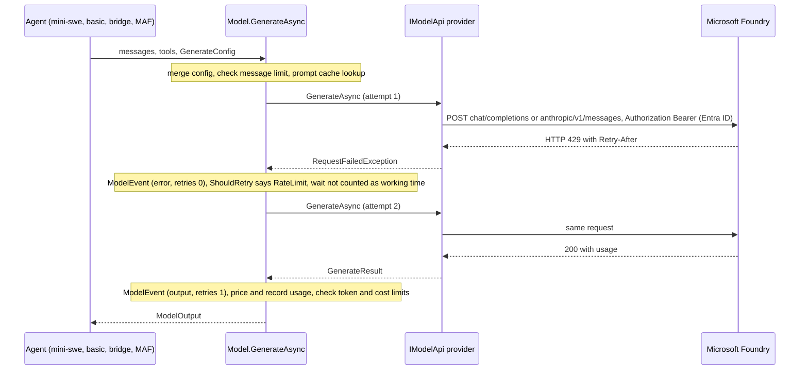

### The providers and how a route is chosen

`FoundryModels.Create` (`FoundryModels.cs`) is the port of `get_model()`: it resolves the deployment name
(`--model`, else `$INSPECT_AZUREAI_MODEL`, else `gpt-5.4-mini`), picks a route with `RouteFor`, builds the
`IModelApi` and wraps it in a `Model`. Three routes exist; the showcase demos the first two:

| Route | Provider | Wire protocol | Picked when |
|---|---|---|---|
| `models` | `AzureAIModelApi` | model-inference `/chat/completions` (Azure.AI.Inference SDK) | default |
| `anthropic` | `AnthropicFoundryModelApi` | Anthropic Messages, `.../anthropic/v1/messages` | name starts with `claude` |
| `responses` | `OpenAIResponsesModelApi` | OpenAI Responses API | `gpt-5.6*`, `*-pro`, `codex`, o-series |

An explicit `--route` always wins. Both showcase providers answer `ShouldRetry` the same way: HTTP 408/429/5xx
retry (429 as a rate limit, honouring `Retry-After`), everything else does not. The Anthropic provider derives
its base URL from the same `AZUREAI_BASE_URL` (`.../models` becomes `.../anthropic`) unless
`AZUREAI_ANTHROPIC_BASE_URL` is set, so one endpoint variable serves both.

**Entra ID only.** Each provider calls `AzureHosting.ResolveAzureCredential`, which wraps a
`DefaultAzureCredential` (environment, workload identity, managed identity, Visual Studio, **Azure CLI**
`az login`, ...) in an `AudienceTokenCredential` pinned to `AZUREAI_AUDIENCE`. The token travels only as
`Authorization: Bearer`, and `ModelArgumentSanitizer.RejectCredentials` refuses a key smuggled in through
`--model-arg`. The CLI's `CreateFoundryModelAsync` fetches one token up front, so a sign-in problem exits with
code 3 instead of erroring every sample.

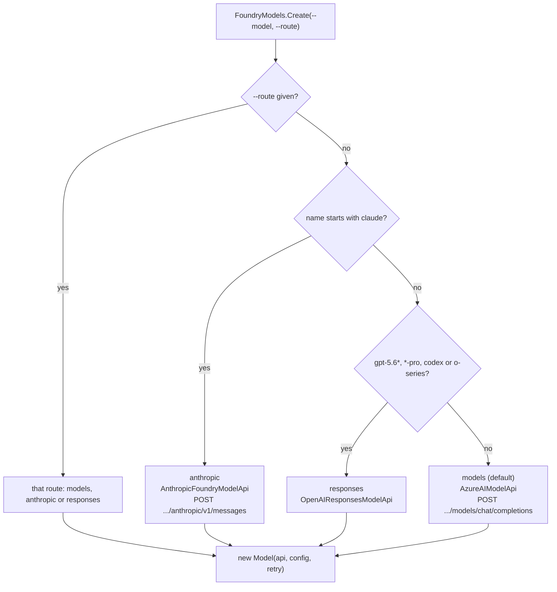

### Building the Model in the showcase

`Cli.cs` builds the model once per run and hands it to [the runner](#2-the-host-the-swe-showcase-cli-and-the-eval-runner)
through `RunWiring.EvalOptions` (`RunWiring.cs:24-39`), which also carries the cost limit, the pricing file and
the hooks. Under `--fake` the same `Model` wraps a scripted `IModelApi`, so retry, limits and events are exercised
offline. `RunOptions.GenerateConfig` turns `--max-tokens` and `--reasoning-effort` into the `GenerateConfig`;
`--cache` becomes the `CachePolicy` the runner applies to every call.

```csharp
// Illustrative -- not in the repo. Needs az login and AZUREAI_BASE_URL; adapt the deployment name.
using InspectAzureAI.Eval.Model;
using InspectAzureAI.Eval.Model.Cache;
using InspectAzureAI.Provider.Core;

// The same call Cli.cs makes: name -> route -> IModelApi -> Model
Model model = FoundryModels.Create(
    "claude-sonnet-4-6",                       // starts with "claude" => AnthropicFoundryModelApi
    config: new GenerateConfig { MaxTokens = 1024, ReasoningEffort = "low" },
    route: null,                               // or "models" | "anthropic" | "responses" to override
    retry: new ModelRetryOptions(MaxRetries: 3, MaxBackoffSeconds: 20));

Console.WriteLine($"{model.Name} on route {FoundryModels.RouteFor("claude-sonnet-4-6")}");

// One generate: retry loop, limits, ModelEvent and usage accounting all happen inside this call
ModelOutput output = await model.GenerateAsync(
    "Reply with one word: ping",
    cache: CachePolicy.Default);               // optional prompt cache; a hit skips the provider

Console.WriteLine(output.Completion);
Console.WriteLine($"{output.Usage?.TotalTokens} tokens, cost {output.Usage?.TotalCost}");
```

### Try it

```bash
# offline: which route values does the CLI accept, and where is the flag parsed?
grep -n "route\|Route" src/InspectAzureAI.SweShowcase/RunOptions.cs | head -20
```

```text
23:    public static readonly IReadOnlyList<string> Routes = ["models", "anthropic", "responses"];
31:    public string? Route { get; init; }
101:        var route = TakeOption(arguments, "--route")?.Trim().ToLowerInvariant();
237:        if (route is not null && !Routes.Contains(route, StringComparer.Ordinal))
239:            throw new UsageError($"--route expects {string.Join("|", Routes)}, got '{route}'");
252:            Route = route,
```

```bash
# offline: the same Model wrapper around a scripted api (no network, no Docker)
dotnet run --project src/InspectAzureAI.SweShowcase --no-launch-profile -- run --fake --sandbox local \
  --task hello-swe --agent mini-swe \
  --log-dir /private/tmp/claude-501/-Users-kevinburrowes-Documents-code-inspect-azureai-dotnet/b60a5f4b-bb06-4856-9b6d-c5c67736c085/scratchpad/demo-logs
```

```text
task     : hello-swe (3 samples, scorer exec_check)
agent    : mini-swe (attempts 1)
model    : scripted (--fake: scripted turns, no network)
sandbox  : local (temp directory on this host; demo only)
log fmt  : eval

sample 1 (epoch 1) completed: exec_check=C (2503 tokens, 0.3s)
Log written to .../demo-logs/<timestamp>_hello-swe_<id>.eval

status   : success (3/3 samples completed)
tokens   : 4186 (3997 in, 189 out)
```

```bash
# needs Foundry sign-in (az login + AZUREAI_BASE_URL) and a Docker daemon -- not run here
az login
export AZUREAI_BASE_URL=https://<resource>.services.ai.azure.com/models

# models route (the default for a gpt-* name), with an output cap and a reasoning effort
dotnet run --project src/InspectAzureAI.SweShowcase -- run --task hello-swe --agent mini-swe \
  --model gpt-5.4-mini --max-tokens 4096 --reasoning-effort low

# anthropic route, picked from the name; prompt cache on for a week (repeat the run to see cache hits)
dotnet run --project src/InspectAzureAI.SweShowcase -- run --task pytest-fix --agent claude-code \
  --model claude-sonnet-4-6 --cache 1W

# override the name heuristic explicitly
dotnet run --project src/InspectAzureAI.SweShowcase -- run --task hello-swe --agent basic \
  --model <deployment> --route responses
```

### What to point out in the demo

- All four agents converge on this one class. `--fake` wraps a scripted `IModelApi` in the same `Model`, so
  the retry, limit and event path you see offline is the real one; only the provider underneath changes.
- Retrying is the provider's decision (`ShouldRetry`: 408/429/5xx, `Retry-After` honoured) but the bounds are
  the wrapper's: `MaxRetries`, the retry `Timeout` budget, and a 60 s backoff cap with full jitter.
- Every attempt is a `ModelEvent`, failures and cache hits included; the "3 model calls" that `show` prints
  per sample are counted from them, and the usage line at the end is summed from the same events.
- Limits live here, not in the agents: message limit before the call, token and cost limits after it, and
  retry waits are subtracted from the sample's working time.
- No API keys: `DefaultAzureCredential` picks up `az login`, both providers share one credential and one
  endpoint variable, and a bad sign-in is caught by the token preflight (exit code 3) before any sample runs.
- Say `--model claude-sonnet-4-6` and the Anthropic Messages route is chosen from the name alone; `--route`
  overrides it.

### Where to look

- `src/InspectAzureAI.Eval/Model/Model.cs` -- `GenerateAsync`: limits, prompt cache, attempt scope, retry loop, `Record()`
- `src/InspectAzureAI.Eval/Model/ModelRetryOptions.cs` -- retry defaults (5 retries, 3 s to 60 s backoff, injectable delay)
- `src/InspectAzureAI.Eval/Model/ModelEvent.cs` -- the transcript record written per attempt
- `src/InspectAzureAI.Eval/Model/FoundryModels.cs` -- `RouteFor` name heuristics and `Create`
- `src/InspectAzureAI.Provider/AzureAIModelApi.cs` -- models route over `ChatCompletionsClient`, `ShouldRetry`, credential
- `src/InspectAzureAI.Provider/Anthropic/AnthropicFoundryModelApi.cs` -- Messages route, base-URL derivation, bearer header
- `src/InspectAzureAI.Provider/Util/AzureHosting.cs` -- `DefaultAzureCredential` and the audience-pinned token
- `src/InspectAzureAI.SweShowcase/Cli.cs` -- `CreateFoundryModelAsync` and the token preflight; the `--fake` model
- `src/InspectAzureAI.SweShowcase/RunWiring.cs` -- `EvalOptions` from the flags (cost limit, pricing, hooks)
- `src/InspectAzureAI.SweShowcase/RunOptions.cs` -- parsing of `--model`, `--route`, `--max-tokens`, `--reasoning-effort`, `--cache`

## 5. The Docker sandbox: one container per sample

> **In plain words.** The model is allowed to run real shell commands and edit real files, so it must not do
> that on the presenter's laptop, and every sample must start from the same clean slate. The runner therefore
> gives each sample its own throwaway Docker container: it starts the box, copies the sample's files in, runs
> the sample's setup script (for the `ctf` task that is the script that hides the flag), lets the agent work,
> scores the result while the box is still alive, then removes the box. The image the boxes come from is built
> once per run from a small Dockerfile and reused until that Dockerfile changes. Nothing here talks to the Docker
> API directly: every step is the ordinary `docker` command run as a child process.

### The image: built once, addressed by content

The showcase sandbox is `src/InspectAzureAI.SweShowcase/sandbox/Dockerfile`, copied next to the executable at
build time. `TaskData.RequireSandboxDirectory()` returns that directory and the CLI turns it into
`new SandboxSpec("docker", <sandbox dir>)` (`Cli.cs:334`); `--sandbox local` gives `new SandboxSpec("local")`
instead. `SandboxSpec` is a two-field record: `Type` is a `SandboxRegistry` key, `Config` is provider specific.
`DockerImages.Resolve` decides what the config means, and `EnsureAsync` builds or pulls only when
`docker image inspect` says the image is missing:

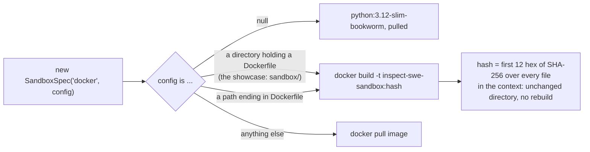

Images are never reclaimed at task cleanup (`DockerSandboxProvider.TaskCleanupAsync` is a no-op on this path), so
old `inspect-swe-sandbox:<hash>` tags accumulate; `.git` is skipped, `.dockerignore` is not honoured.

### The lifecycle

`Eval.RunAsync` calls `TaskInitAsync` once per distinct spec before any sample (`Eval.cs:213`), then
`SampleRunner` calls `SandboxSetup.InitAsync` for every (sample, epoch) inside the `init` transcript span
(`SampleRunner.cs:125`) and the environments' `Cleanup` delegate in a `finally` (`SampleRunner.cs:252`).

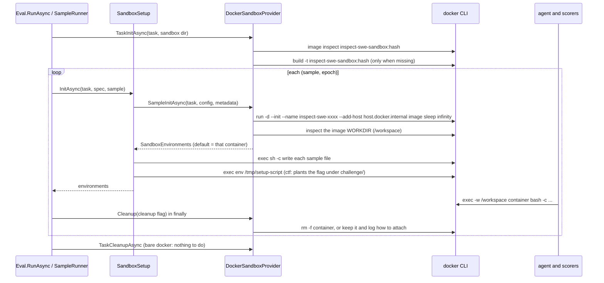

The provider's `SampleInitAsync` is the whole bare path: pick a name, start an idle container, read its
WORKDIR, and hand back one environment plus the cleanup delegate that `--no-cleanup` flips:

```csharp
// src/InspectAzureAI.Eval/Sandbox/Docker/DockerSandboxProvider.cs:89-114
        var image = await DockerImages.EnsureAsync(_cli, config, cancellationToken).ConfigureAwait(false);
        var name = ContainerPrefix + RandomNumberGenerator.GetHexString(12, lowercase: true);
        string workingDirectory;
        try
        {
            await StartContainerAsync(image, name, cancellationToken).ConfigureAwait(false);
            workingDirectory = await _cli.InspectAsync(name, "{{.Config.WorkingDir}}", cancellationToken).ConfigureAwait(false);
        }
        catch
        {
            await RemoveQuietlyAsync(name).ConfigureAwait(false);
            throw;
        }

        var environment = new DockerSandboxEnvironment(_cli, name, workingDirectory);
        return SandboxEnvironments.Single(environment, async cleanup =>
        {
            if (cleanup)
            {
                await RemoveQuietlyAsync(name).ConfigureAwait(false);
            }
            else
            {
                ProviderLogger.Info($"Sandbox container {name} was kept for inspection (docker exec -it {name} bash; docker rm -f {name} to remove).");
            }
        });
```

`StartContainerAsync` runs `docker run -d --init --name NAME --add-host host.docker.internal:host-gateway IMAGE
sleep infinity` (`DockerCli.RunDetachedAsync`, falling back to `tail -f /dev/null` when the image has no
`sleep`). `--add-host` is what later lets Claude Code inside the container reach the host bridge (see
[section 8](#8-claude-code-through-the-sandboxagentbridge)).

### Files, setup, exec

`SandboxSetup.InitAsync` loads `Sample.Files` and `Sample.Setup` on the host (the JSON dataset loader has already
resolved `"setup": "setup/hidden-file.sh"` relative to `tasks/ctf/dataset.json`), writes each file into the
default environment, then runs the setup script once, never retried, with a 300 s limit
(`INSPECT_SANDBOX_SETUP_TIMEOUT`):

```csharp
// src/InspectAzureAI.Eval/Runner/SandboxSetup.cs:167-172
        var setupFile = $"/tmp/{Guid.NewGuid():N}";
        await environment.WriteFileAsync(setupFile, setup, cancellationToken).ConfigureAwait(false);
        try
        {
            await environment.ExecAsync(["chmod", "+x", setupFile], timeout: HousekeepingTimeout, cancellationToken: cancellationToken).ConfigureAwait(false);
            var result = await environment.ExecAsync(["env", setupFile], timeout: SetupTimeout(), cancellationToken: cancellationToken).ConfigureAwait(false);
```

Because the script runs with the image WORKDIR as cwd, `mkdir -p challenge` in `hidden-file.sh` lands the flag
at `/workspace/challenge/.cache/logs/.flag`, exactly where the prompt tells the agent to look.

Every `ISandboxEnvironment.ExecAsync(cmd, ...)` takes an argv, never a shell string. `DockerSandboxEnvironment`
prepends `timeout -s KILL N` inside the container when a timeout is given, and `DockerCli.ExecAsync` assembles
`docker exec [-u USER] [-w CWD] [-e NAME]... [-i] CONTAINER cmd...`; env values travel in the child's
environment, only the names are on the command line, so the bridge token never shows in `ps`. `WriteFileAsync`
and `ReadFileAsync` are the same `docker exec` mechanism (`sh -c` with bytes on stdin, and `cat`).
[docs/container-orchestration.md](../blob/main/docs/container-orchestration.md) covers the timeout and
failure classification, the compose path, and every deviation from Python.

### Using the sandbox API directly

```csharp
// illustrative: what SandboxSetup and the agents do, driven by hand
using InspectAzureAI.Eval.Sandbox;

var spec = new SandboxSpec("docker", "src/InspectAzureAI.SweShowcase/sandbox");   // a directory with a Dockerfile
ISandboxProvider provider = SandboxRegistry.Get(spec.Type);
await provider.TaskInitAsync("demo", spec.Config);                                  // build inspect-swe-sandbox:<hash> once

SandboxEnvironments envs = await provider.SampleInitAsync("demo", spec.Config, new Dictionary<string, string>());
ISandboxEnvironment box = envs.Default;                                             // the "default" container
try
{
    await box.WriteFileAsync("challenge/notes.txt", "hello\n");                     // relative to the image WORKDIR
    ExecResult result = await box.ExecAsync(["bash", "-c", "ls -la challenge; cat challenge/notes.txt"],
        timeout: TimeSpan.FromSeconds(30));                                         // argv, never a shell string
    Console.WriteLine($"{result.Success} rc={result.ReturnCode}\n{result.Stdout}");
}
finally
{
    await envs.Cleanup!(true);                                                      // false keeps the container and logs how to attach
    await provider.TaskCleanupAsync("demo", spec.Config, cleanup: true);
}
```

### Try it

Offline, no Docker: the image recipe, and the same lifecycle on a host temp directory (`--sandbox local`):

```bash
cat src/InspectAzureAI.SweShowcase/sandbox/Dockerfile
```

```
FROM python:3.12-slim-bookworm

RUN apt-get update \
    && apt-get install -y --no-install-recommends bash curl ca-certificates git procps coreutils \
    && rm -rf /var/lib/apt/lists/*

RUN pip install --no-cache-dir pytest

ENV PYTHONUNBUFFERED=1 PIP_DISABLE_PIP_VERSION_CHECK=1

WORKDIR /workspace
```

```bash
dotnet run --project src/InspectAzureAI.SweShowcase -- run --fake --sandbox local --task ctf --agent mini-swe --limit 1 \
  --log-dir /private/tmp/claude-501/-Users-kevinburrowes-Documents-code-inspect-azureai-dotnet/b60a5f4b-bb06-4856-9b6d-c5c67736c085/scratchpad/demo-logs
```

```
task     : ctf (3 samples, scorer includes)
agent    : mini-swe (attempts 1)
model    : scripted (--fake: scripted turns, no network)
sandbox  : local (temp directory on this host; demo only)

sample 1 (epoch 1) started
sample 1 (epoch 1) completed: includes=C (2856 tokens, 0.2s)

status   : success (1/1 samples completed)
scorer             metric        value
includes           accuracy      1.000
```

Needs a running Docker daemon (not run here): the same scripted run through real containers, kept afterwards.

```bash
# --fake with --sandbox docker: no Foundry sign-in, but the image is built and one container per sample is started
dotnet run --project src/InspectAzureAI.SweShowcase -- run --fake --sandbox docker --task ctf --agent mini-swe --limit 1 --no-cleanup \
  --log-dir /private/tmp/claude-501/-Users-kevinburrowes-Documents-code-inspect-azureai-dotnet/b60a5f4b-bb06-4856-9b6d-c5c67736c085/scratchpad/demo-logs

docker images --filter reference='inspect-swe-sandbox:*'     # one tag per Dockerfile content hash
docker ps -a --filter name=inspect-swe-                       # containers kept by --no-cleanup
docker exec -it <inspect-swe-xxxx> bash -c 'ls -la /workspace/challenge/.cache/logs; cat /workspace/challenge/.cache/logs/.flag'
docker rm -f <inspect-swe-xxxx>                               # nothing reclaims kept containers for you
```

### What to point out in the demo

- The `sandbox  :` line of `run` prints `docker (<dir>)`: that directory is the build context, and the tag is a
  content hash, so the first run builds and every later run reuses the image until the Dockerfile changes.
- Container names start with `inspect-swe-`; a `docker ps` during a run shows one per in-flight sample
  (`--max-samples`, default 4) and none afterwards.
- The flag is not in the image and not in the dataset's files: the `setup` script plants it inside the container
  after the container is up, so the model cannot see it without running commands.
- Everything is a `docker` child process with an argv: `docker run`, `docker exec`, `docker rm -f`. There is
  no Docker SDK and no shell string to inject into.
- `--no-cleanup` keeps the container and the log line tells you how to attach; `--sandbox local` is the
  no-Docker fallback for a demo machine, and the CLI itself labels it "demo only".
- Scorers run while the container is still alive, which is why the `exec_check` scorer of `hello-swe` can run
  the tests in the same box the agent edited.

### Where to look

- `src/InspectAzureAI.SweShowcase/sandbox/Dockerfile`: the image recipe (python:3.12-slim-bookworm + bash, git, curl, procps, coreutils, pytest).
- `src/InspectAzureAI.SweShowcase/BuiltinTasks/TaskData.cs`: `RequireSandboxDirectory()`, the build context handed to `SandboxSpec`.
- `src/InspectAzureAI.SweShowcase/Cli.cs`: `--sandbox docker|local` to `SandboxSpec` (line 334) and `--no-cleanup` help text.
- `src/InspectAzureAI.Eval/Sandbox/SandboxSpec.cs`: the two-field record `(Type, Config)`.
- `src/InspectAzureAI.Eval/Sandbox/ISandboxProvider.cs`: `TaskInitAsync` / `SampleInitAsync` / `TaskCleanupAsync`.
- `src/InspectAzureAI.Eval/Sandbox/ISandboxEnvironment.cs`: `ExecAsync(argv)`, `WriteFileAsync`, `ReadFileAsync`, `HostAddress`.
- `src/InspectAzureAI.Eval/Sandbox/SandboxEnvironments.cs`: `Default` plus the `Func<bool, Task>` cleanup delegate.
- `src/InspectAzureAI.Eval/Sandbox/SandboxRegistry.cs`: "local" and "docker" registered; `Register` for others.
- `src/InspectAzureAI.Eval/Sandbox/Docker/DockerSandboxProvider.cs`: the bare path (`docker run` per sample, keep or remove).
- `src/InspectAzureAI.Eval/Sandbox/Docker/DockerImages.cs`: config to image, `inspect-swe-sandbox:<hash>`, build gate.
- `src/InspectAzureAI.Eval/Sandbox/Docker/DockerCli.cs`: one argv per `docker` command; `-e NAME` without values.
- `src/InspectAzureAI.Eval/Sandbox/Docker/DockerSandboxEnvironment.cs`: `ExecCoreAsync`, the in-container `timeout -s KILL` wrap.
- `src/InspectAzureAI.Eval/Sandbox/Local/LocalSandboxProvider.cs`: `--sandbox local`, a temp directory per sample.
- `src/InspectAzureAI.Eval/Runner/SandboxSetup.cs`: files then setup script, cleanup on failure.
- `src/InspectAzureAI.SweShowcase/Tasks/ctf/setup/*.sh`: the three flag-planting scripts.
- `docs/container-orchestration.md`: the deep dive (compose path, exec classification, Python deviations).

## 6. mini-swe-agent: a native C# loop

> **In plain words.** mini-swe-agent is the simplest coding agent in the showcase: the model is given exactly one
> tool, `bash`, and is asked for one command at a time. Each command is run inside the sample's container, its
> exit code and output are sent back as a small JSON message, and the model decides the next command. The agent
> finishes when the model runs `echo COMPLETE_TASK_AND_SUBMIT_FINAL_OUTPUT`; whatever it prints after that line
> is its answer. The upstream Python `DefaultAgent` was rewritten in C#, so nothing has to be installed in the
> image and every model call goes through the same `Model` wrapper as the other agents.

### The loop

`MiniSweAgent.ExecuteAsync` takes the sample's ambient `SampleContext` (model, sandbox, store, transcript), folds
the task's system messages into the prompt, and runs a `Session` once per attempt, scoring between attempts.
`StartAsync` reads `uname` from the sandbox and renders the two `mini.yaml` texts held verbatim in
`MiniSweTemplates`: the system template becomes the system message, the instance template (with `{{task}}`)
the first user message. `TemplateRenderer` is the slice of Jinja2 those templates need: `{{ name }}`
substitution, an undefined name is an error, one trailing newline dropped.

Every step then does the same four things. `StepAsync` checks `StepLimit` and `WallTimeLimitSeconds` (both
`0` = unlimited by default, exiting with `LimitsExceeded` / `TimeExceeded`), calls
`Model.GenerateAsync(input, [BashTool], ToolChoice.Auto)`, and hands the output to `ParseActions`: every tool
call must be `bash` with a `command`. Anything else is a **format error**: the assistant turn is not added to
the trajectory, only the rendered `format_error_template` user message is, and after
`MaxConsecutiveFormatErrors` (3) the run exits as `RepeatedFormatError`. Valid actions go to
`ExecuteActionsAsync`, which applies the eval's ambient `ToolApproval` policy first, then runs each command as
`bash -c "exec 2>&1\n<command>"` through `ISandboxEnvironment.ExecAsync` with the `mini.yaml` environment
(`PAGER=cat`, `TQDM_DISABLE=1`, ...) and a 30 s `CommandTimeout`. On the Docker sandbox that is a
`docker exec [-u USER] [-w CWD] [-e K]* NAME bash -c ...`; a timeout or a failure to run is never an exception
but an observation with `returncode` -1 and an `exception_info`.

The **observation** is `RenderObservation`: the JSON object of `observation_template`, byte-for-byte what Jinja
would produce (`returncode` + `output`, or `output_head` / `output_tail` / `elided_chars` once the output
reaches 10,000 characters), added as a `ChatMessageTool`. `CheckFinished` ends the run when the first
non-blank output line is exactly `COMPLETE_TASK_AND_SUBMIT_FINAL_OUTPUT` and the command succeeded; the rest of
the output is the submission, later tool calls of that turn get the `not_executed` padding. `RecordExit` puts
`mini_swe_agent_exit_status` and `mini_swe_agent_submission` in the sample `Store` and swaps the submission in
as the output completion; `Save` (in a `finally`) stores `mini_swe_agent_trajectory` and
`mini_swe_agent_api_calls`, which `Resume` reloads for a second attempt, fixing dangling tool calls and appending
the task plus the resume reminder. Each command is also an `Info` event with source `mini_swe_agent` in the
transcript.

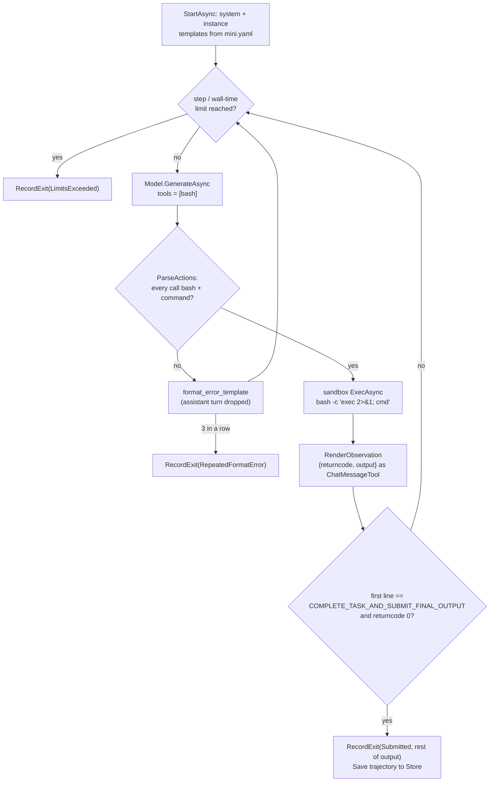

### The step, verbatim

```csharp
// src/InspectAzureAI.Swe/MiniSwe/MiniSweAgent.cs:488-497
            // Upstream raises FormatError before the assistant message is added, so only the format error
            // message enters the trajectory (the response itself lives in the model event).
            var (actions, error) = ParseActions(output);
            if (error is not null)
            {
                return Outcome.FormatError(error);
            }

            _messages.Add(output.Message);
            return await ExecuteActionsAsync(actions, output.Message.Text, cancellationToken).ConfigureAwait(false);
```

```csharp
// src/InspectAzureAI.Swe/MiniSwe/MiniSweAgent.cs:567-574
                var result = await _sandbox.ExecAsync(
                    ["bash", "-c", "exec 2>&1\n" + command],
                    cwd: _cwd,
                    env: _env,
                    user: _options.User,
                    timeout: _options.CommandTimeout,
                    cancellationToken: cancellationToken).ConfigureAwait(false);
                observation = new CommandObservation(result.Stdout + result.Stderr, result.ReturnCode, "");
```

### Attaching the agent to a task

`MiniSwe.Agent(options)` returns an `AgentDef`; `Agents.AsSolver` turns it into the task's solver, which is
exactly what the showcase does in `AgentChoice.Solver` (`Agents.AsSolver(MiniSwe.Agent(new MiniSweAgentOptions
{ Attempts = new AgentAttempts(attempts), Cache = cache, Compaction = compaction }))`). Illustrative:

```csharp
// Illustrative: mini-swe-agent as the solver of a task, two attempts, a 40-step cap, 60 s per command.
using InspectAzureAI.Eval.Agents;
using InspectAzureAI.Eval.Dataset;
using InspectAzureAI.Eval.Tasks;
using InspectAzureAI.Swe.MiniSwe;

var agent = MiniSwe.Agent(new MiniSweAgentOptions
{
    Attempts = new AgentAttempts(Attempts: 2),      // scored between attempts, IncorrectMessage on a miss
    StepLimit = 40,                                 // 0 (default) = no cap; exit status "LimitsExceeded"
    CommandTimeout = TimeSpan.FromSeconds(60),      // default 30 s; a timeout is an observation, not an error
});

var task = new EvalTask
{
    Name = "hello-swe",
    Dataset = Datasets.Json("path/to/hello-swe.json"),
    Solver = Agents.AsSolver(agent),
    Scorers = [/* the task's scorer, e.g. the showcase's ExecCheckScorer.Create() */],
};
```

### Try it

Offline, no Docker: the scripted model writes `hello.py`, runs it, then submits with the marker (sample 1);
samples 2 and 3 give up on their first turn, so accuracy 0.333 is the expected result.

```bash
# offline (--fake, --sandbox local): three samples, a scripted model, a temp directory instead of a container
dotnet run --project src/InspectAzureAI.SweShowcase --no-build -- run --fake --sandbox local --task hello-swe --agent mini-swe \
  --log-dir /private/tmp/claude-501/-Users-kevinburrowes-Documents-code-inspect-azureai-dotnet/b60a5f4b-bb06-4856-9b6d-c5c67736c085/scratchpad/demo-logs
```

```text
task     : hello-swe (3 samples, scorer exec_check)
agent    : mini-swe (attempts 1)
model    : scripted (--fake: scripted turns, no network)
sandbox  : local (temp directory on this host; demo only)
sample 1 (epoch 1) started
sample 2 (epoch 1) started
sample 3 (epoch 1) started
sample 2 (epoch 1) completed: exec_check=I (841 tokens, 0.4s)
sample 3 (epoch 1) completed: exec_check=I (842 tokens, 0.4s)
sample 1 (epoch 1) completed: exec_check=C (2503 tokens, 0.5s)
status   : success (3/3 samples completed)
tokens   : 4186 (3997 in, 189 out)
scorer             metric        value
exec_check         accuracy      0.333
exec_check         stderr        0.333
```

`show` on that log lists sample 1 as `3 model calls, 0 tool calls` with the answer
`Created hello.py; running python3 hello.py prints Hello, Inspect!` (see
[the eval log](#10-the-eval-log-and-the-show-command)).

```bash
# needs Foundry sign-in (az login, AZUREAI_BASE_URL) and a running Docker daemon: one container per sample
dotnet run --project src/InspectAzureAI.SweShowcase -- run --task hello-swe --agent mini-swe

# same, two submissions allowed: an incorrect first submission is scored and the loop resumes from the stored trajectory
dotnet run --project src/InspectAzureAI.SweShowcase -- run --task hello-swe --agent mini-swe --attempts 2
```

### What to point out in the demo

- One tool, one command per step: the model never sees a file-edit or search tool, it edits with `sed` and
  heredocs, exactly as upstream mini-swe-agent does.
- The prompt texts are the upstream `mini.yaml` verbatim, and the observation JSON is byte-for-byte what Jinja
  would render, so a Python trajectory and a C# trajectory look the same to the model.
- There is no submit tool: the run ends when a command prints the marker on its first line with exit code 0.
  Show the `printf '%s\n%s\n' COMPLETE_TASK_AND_SUBMIT_FINAL_OUTPUT ...` turn in the fake run.
- A malformed turn (no tool call, wrong tool, missing `command`) is dropped and replaced by the format-error
  message; three in a row end the sample, so a stubborn model cannot loop forever.
- `show` reports `0 tool calls` for this agent by design: commands are `Info` transcript events with source
  `mini_swe_agent`, not `ToolEvent`s; the model calls, tokens and limits still come from the shared `Model`.
- Everything the loop knows lives in the sample `Store` (`mini_swe_agent_exit_status`, `_submission`,
  `_trajectory`, `_api_calls`), which is what `--attempts 2` resumes from.

### Where to look

- `src/InspectAzureAI.Swe/MiniSwe/MiniSweAgent.cs` — the loop: `ExecuteAsync` (attempts), `Session.RunAsync`
  / `StepAsync` / `ExecuteActionsAsync`, `ParseActions`, `CheckFinished`, `RecordExit`, `Save` / `Resume`.
- `src/InspectAzureAI.Swe/MiniSwe/MiniSweTemplates.cs` — the `mini.yaml` texts, `SubmitMarker`,
  `RenderObservation`, `RenderFormatError`, the default command environment.
- `src/InspectAzureAI.Swe/MiniSwe/TemplateRenderer.cs` — the `{{ name }}` renderer with Jinja's strict-undefined
  and trailing-newline rules.
- `src/InspectAzureAI.Swe/MiniSwe/MiniSweAgentOptions.cs` — `StepLimit`, `WallTimeLimitSeconds`,
  `MaxConsecutiveFormatErrors`, `CommandTimeout`, `Attempts`, `Cache`, `Compaction`.
- `src/InspectAzureAI.Swe/MiniSwe/MiniSwe.cs` — the `mini_swe_agent()` factory returning an `AgentDef`.
- `src/InspectAzureAI.SweShowcase/AgentChoice.cs` — `--agent mini-swe` becomes `Agents.AsSolver(MiniSwe.Agent(...))`.
- `src/InspectAzureAI.SweShowcase/FakeScripts.cs` — the scripted `bash` turns behind `--fake` (`MiniSweTurn`, `Submit`).
- `src/InspectAzureAI.Eval/Sandbox/Docker/DockerCli.cs` — how `ExecAsync` becomes `docker exec ... bash -c`.

## 7. basic_agent: Inspect's ReAct loop with the bash tool

> **In plain words.** The basic agent is Inspect's own general-purpose agent, ported as it is: a system prompt
> that tells the model it has functions to call, a `bash` function that runs a command inside the sample's
> container, and a `submit` function for handing in the answer. The model takes one step, sees the result, takes
> another, and so on until it calls `submit`. If you allow more than one attempt, the answer is graded on the
> spot and a wrong one gets a "your submission was incorrect" message so the model can try again. Nothing in it
> is specific to software tasks; it is the same loop you would use for a maths or QA eval, pointed at a shell.

### What the solver is made of

`Solvers.BasicAgent` (`src/InspectAzureAI.Eval/Solvers/BasicAgent.cs`) returns a `Chain` of four solvers: the
`SystemMessage` (`BasicAgentSystemMessage`, with `{submit}` filled in), `UseTools(tools, append: true)`, a solver
that adds the `submit` `ToolDef` (one required `answer` parameter, `MaxOutput = 0` so the answer is never
truncated), and the loop itself. The showcase gives it exactly one tool, the sandbox `bash` tool from
`SandboxTools`: its single parameter is `cmd`, it runs `bash --login -c cmd` through the sample's ambient
`SampleContext` sandbox (see [the sandbox](#5-the-docker-sandbox-one-container-per-sample)) and returns stderr
(plus a newline) followed by stdout.

```csharp
// src/InspectAzureAI.Eval/Tools/SandboxTools.cs:25-33
public static ToolDef Bash(TimeSpan? timeout = null, string? user = null, string? sandbox = null) =>
    new("bash", BashDescription, StringParam("cmd", "The bash command to execute."), async (arguments, cancellationToken) =>
    {
        var cmd = StringArgument(arguments, "cmd");
        var result = await SampleContext.Require().Sandbox(sandbox)
            .ExecAsync(["bash", "--login", "-c", cmd], timeout: timeout, user: user, cancellationToken: cancellationToken)
            .ConfigureAwait(false);
        return Output(result);
    });
```

The showcase wires it up in one line, with a three-minute wall-clock budget per bash call:

```csharp
// src/InspectAzureAI.SweShowcase/AgentChoice.cs:33
private static readonly TimeSpan BashTimeout = TimeSpan.FromMinutes(3);

// src/InspectAzureAI.SweShowcase/AgentChoice.cs:65
BasicName => Solvers.BasicAgent(tools: [SandboxTools.Bash(BashTimeout)], maxAttempts: attempts, compaction: compaction, cache: cache),
```

### The loop, submit and attempts

Every iteration checks the message limit, calls `Model.GenerateAsync` with the state's messages and tools
(so the retry loop and `ModelEvent`s of [the Model wrapper](#4-the-model-wrapper-and-the-foundry-providers)
apply), checks the token limits and appends the assistant message. A `model_length` stop ends the loop with an
`InfoEvent` unless a `--compaction` hook can recover. No tool calls means the model gets
`BasicAgentContinueMessage` and another turn. Otherwise `ToolExecutor.ExecuteToolsAsync` runs the calls: it
validates the arguments against the tool schema (a missing `cmd` becomes a `ToolCallError` on the tool message,
not a crash), truncates output at `ToolDef.MaxOutput`, then `maxToolOutput`, then 16 KiB, and records one
`ToolEvent` (id, function, arguments, result, error, truncation, working time) on the transcript. The rest of
the loop is the attempts logic:

```csharp
// src/InspectAzureAI.Eval/Solvers/BasicAgent.cs:152-177
var submission = results.Messages.OfType<ChatMessageTool>().FirstOrDefault(m => m.Function == submitName)?.Text;
if (submission is null)
{
    continue;
}

state.Output = state.Output with
{
    Completion = submitAppend ? $"{state.Output.Completion}\n\n{submission}".Trim() : submission,
};

attempts++;
if (attempts >= maxAttempts)
{
    state.Completed = true;
    break;
}

var scores = await ScoreAsync(context, state).ConfigureAwait(false);
if (scoreValueFn(scores[0].Value) == 1.0)
{
    state.Completed = true;
    break;
}

state.Messages.Add(new ChatMessageUser(incorrect));
```

`ScoreAsync` is Python's `score(state)`: it calls the task scorers through `SampleContext.Scorer` (so
`--attempts 2` on `hello-swe` runs `exec_check` mid-sample), and `scoreValue` defaults to `value_to_float`.
The last permitted submission is accepted without scoring; the runner then scores the sample once more for the
log ([section 3](#3-the-task-evaltask-dataset-solver-and-scorers)).

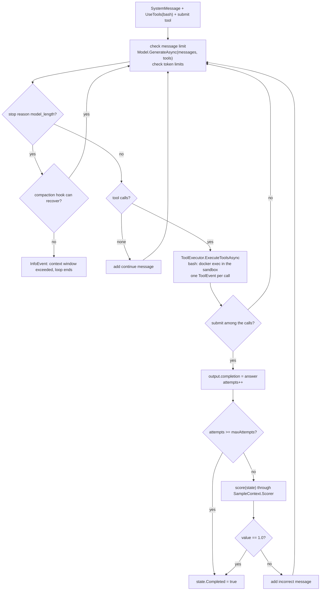

### Limits

`messageLimit` wins over the task's `MessageLimit`; the built-in tasks set 200 (`ShowcaseLimits.MessageLimit`),
and a task with neither a message nor a token limit gets 50 so a never-submitting model cannot loop forever. The
agent's own `tokenLimit` counts only tokens spent since the loop started (Python's scoped `token_limit`). Either
raises `LimitExceededException`; `SampleRunner` catches it, records the limit on the sample and still runs the
scorers.

### Contrast with mini-swe-agent

Both agents are function calls on the wire, but [mini-swe-agent](#6-mini-swe-agent-a-native-c-loop) is a
bash-only protocol: its `BashTool` (`command` parameter) is a hand-built `ToolInfo` the agent executes itself,
every observation is rendered through `MiniSweTemplates.RenderObservation` (return code and output as a JSON
block) before it becomes a `ChatMessageTool`, and the agent finishes when a command prints the
`COMPLETE_TASK_AND_SUBMIT_FINAL_OUTPUT` marker. The basic agent is the generic Inspect machinery instead:
ordinary `ToolDef`s run by `ToolExecutor`, raw stdout/stderr as the tool result, a real `submit` tool, and
scored attempts. Adding a second tool is a list entry, not a template change.

### Using it in your own task (illustrative)

```csharp
// Illustrative: basic_agent with the sandbox bash tool plus a custom pytest tool.
using InspectAzureAI.Eval.Context;
using InspectAzureAI.Eval.Dataset;
using InspectAzureAI.Eval.Sandbox;
using InspectAzureAI.Eval.Solvers;
using InspectAzureAI.Eval.Tasks;
using InspectAzureAI.Eval.Tools;
using InspectAzureAI.Provider.Core;

var pytest = new ToolDef(
    "pytest",
    "Run the test suite and return its output.",
    new ToolParams
    {
        Properties = new Dictionary<string, ToolParam> { ["path"] = ToolParam.Of("string", "Test file or directory (default: tests)") },
    },
    async (arguments, cancellationToken) =>
    {
        var path = arguments["path"]?.GetValue<string>() ?? "tests";
        var result = await SampleContext.Require().Sandbox()
            .ExecAsync(["bash", "--login", "-c", $"python3 -m pytest -q {path}"], timeout: TimeSpan.FromMinutes(2), cancellationToken: cancellationToken);
        return $"exit {result.ReturnCode}\n{result.Stderr}{result.Stdout}";   // string -> ToolResult (implicit)
    })
{ MaxOutput = 8 * 1024 };

var task = new EvalTask
{
    Name = "pytest-fix-basic",
    Dataset = Datasets.Json("data/pytest-fix.json"),
    Solver = Solvers.BasicAgent(
        tools: [SandboxTools.Bash(TimeSpan.FromMinutes(3)), pytest],
        maxAttempts: 2,
        tokenLimit: 200_000),
    Scorers = [ /* an exec_check-style scorer, see section 3 */ ],
    Sandbox = new SandboxSpec("docker", "src/InspectAzureAI.SweShowcase/sandbox"),
    MessageLimit = 200,
};
```

### Try it

Offline, no Docker and no sign-in (the scripted model solves sample 1 with two `bash` calls and a `submit`,
and gives up on samples 2 and 3 by submitting a non-answer, which is exactly what exercises `--attempts`):

```bash
dotnet run --project src/InspectAzureAI.SweShowcase --no-build -- run --fake --sandbox local --task hello-swe --agent basic --attempts 2 --log-dir /private/tmp/claude-501/-Users-kevinburrowes-Documents-code-inspect-azureai-dotnet/b60a5f4b-bb06-4856-9b6d-c5c67736c085/scratchpad/demo-logs
```

```text
task     : hello-swe (3 samples, scorer exec_check)
agent    : basic (attempts 2)
model    : scripted (--fake: scripted turns, no network)
sandbox  : local (temp directory on this host; demo only)
sample 2 (epoch 1) completed: exec_check=I (478 tokens, 0.1s)
sample 3 (epoch 1) completed: exec_check=I (479 tokens, 0.1s)
sample 1 (epoch 1) completed: exec_check=C (662 tokens, 3.1s)
Log written to .../demo-logs/<timestamp>_hello-swe_<id>.eval
status   : success (3/3 samples completed)
tokens   : 1619 (1460 in, 159 out)

scorer             metric        value
exec_check         accuracy      0.333
exec_check         stderr        0.333
```

```bash
dotnet run --project src/InspectAzureAI.SweShowcase --no-build -- show /private/tmp/claude-501/-Users-kevinburrowes-Documents-code-inspect-azureai-dotnet/b60a5f4b-bb06-4856-9b6d-c5c67736c085/scratchpad/demo-logs/<timestamp>_hello-swe_<id>.eval
```

```text
samples:
  1 (epoch 1): exec_check=C | 662 tokens | 3.1s | 3 model calls, 3 tool calls
      answer: Created hello.py; running `python3 hello.py` prints Hello, Inspect!
      exec_check: exit code 0
  2 (epoch 1): exec_check=I | 478 tokens | 0.1s | 2 model calls, 2 tool calls
      answer: I was unable to solve this task.
      exec_check: exit code 1
```

Sample 2's "2 model calls, 2 tool calls" is the attempts path: `submit` (wrong) → scored `I` → "Your submission
was incorrect..." → `submit` again → second attempt accepted. The `ToolEvent`s are in the `.eval` zip (see
[the eval log](#10-the-eval-log-and-the-show-command)); `show` does not list them, but `unzip` and `jq` do:

```bash
unzip -p <log>.eval samples/1_epoch_1.json | jq -c '.events[] | select(.event=="tool") | {function, arguments, result}'
```

```text
{"function":"bash","arguments":{"cmd":"cat > hello.py <<'EOF'\nprint(\"Hello, Inspect!\")\nEOF"},"result":""}
{"function":"bash","arguments":{"cmd":"python3 hello.py"},"result":"Hello, Inspect!\n"}
{"function":"submit","arguments":{"answer":"Created hello.py; running `python3 hello.py` prints Hello, Inspect!"},"result":"Created hello.py; ..."}
```

Live (needs `az login`, `AZUREAI_BASE_URL` and a running Docker daemon; not run here):

```bash
# every hello-swe sample, one container each, a wrong submission is scored and retried once
dotnet run --project src/InspectAzureAI.SweShowcase -- run --task hello-swe --agent basic --attempts 2

# the inspect_swe docs example, model-graded
dotnet run --project src/InspectAzureAI.SweShowcase -- run --task system-explorer --agent basic --limit 1
```

### What to point out in the demo

- This is Inspect's stock `basic_agent`, line for line: the system message, the `submit` tool and the
  incorrect/continue messages are the Python constants, so results compare directly with Python runs.
- Point at `agent    : basic (attempts 2)` in the header, then at sample 2's `2 model calls, 2 tool calls`: the
  first `submit` was scored by the task's own `exec_check` scorer inside the sample, and the model was told to
  retry.
- The `bash` tool is a nine-line `ToolDef`; the container, the timeout, the output truncation and the
  `ToolEvent` are all handled by `SampleContext` and `ToolExecutor`, not by the agent.
- Compare with mini-swe-agent: same model, same container, same `Model` wrapper, but templated observations
  and a printed marker versus plain tool results and a `submit` call.
- The loop cannot run away: the task's 200-message limit (50 by default) and the optional loop-scoped token
  limit end the sample with a recorded limit, and the scorers still run.

### Where to look

- `src/InspectAzureAI.Eval/Solvers/BasicAgent.cs` — the port of `basic_agent`: system message, submit tool, loop, attempts.
- `src/InspectAzureAI.Eval/Solvers/GenerateLoop.cs` — the `Generate` delegate and the message/token limit checks the loop reuses.
- `src/InspectAzureAI.Eval/Tools/SandboxTools.cs` — the `bash` (parameter `cmd`) and `python` sandbox tools.
- `src/InspectAzureAI.Eval/Tools/ToolDef.cs` — a named, described, schema-carrying tool with `MaxOutput` and `Parallel`.
- `src/InspectAzureAI.Eval/Tools/ToolExecutor.cs` — argument validation, staged execution, truncation, one `ToolEvent` per call.
- `src/InspectAzureAI.Eval/Context/TranscriptEvents.cs` — the `ToolEvent` record written to the log.
- `src/InspectAzureAI.SweShowcase/AgentChoice.cs` — `--agent basic` becomes `Solvers.BasicAgent(tools: [SandboxTools.Bash(...)], maxAttempts: attempts, ...)`.
- `src/InspectAzureAI.SweShowcase/FakeScripts.cs` — the scripted `bash(cmd=...)` then `submit(answer=...)` turns behind `--fake`.

## 8. Claude Code through the SandboxAgentBridge

> **In plain words.** Claude Code is a finished product: a command-line program that expects to call Anthropic's
> API over HTTP. Instead of rewriting it, the showcase runs the real program inside the sample's container and
> gives it a stand-in for that API: a small web server on the host called the bridge. Every request the program
> makes is turned into an ordinary `Model` call, so the Foundry deployment answers it, and the answer is dressed
> back up as an Anthropic reply. Because the host sees all the traffic, it can rebuild the agent's conversation
> for the log and stop the program the moment a sample limit is hit. It is the only part of the showcase that
> uses the network between the container and the host.

### What happens on a run

`ClaudeCode.Agent(options)` returns an `AgentDef` whose `Execute` is `ClaudeCodeAgent.ExecuteAsync`
(`src/InspectAzureAI.Swe/ClaudeCode/ClaudeCodeAgent.cs:122`). One run does, in order:

1. **Bridge up.** An `AgentBridge` is built over the sample's `AgentState` and the served `Model` (`models.Served`,
   plus per-role aliases), then `SandboxAgentBridge.StartAsync(bridge, sandbox, port, bridgedTools)` starts an
   `HttpListener`. Port 0 means "probe a free ephemeral port" (five attempts if another process grabs it);
   `AuthToken` is 16 random bytes as hex, minted per instance. `DockerSandboxEnvironment.HostAddress` is
   `host.docker.internal`, so the listener binds the wildcard prefix `http://*:<port>/`; only the local sandbox
   (`127.0.0.1`) binds loopback, because `HttpListener` matches the request's `Host` header against its prefixes.
2. **Binary in.** `ClaudeCodeBinary.EnsureInstalledAsync` runs `which claude` in the container; if absent it
   resolves `stable`, downloads and SHA-256-verifies the binary on the host, caches it under
   `~/.cache/inspect-azureai/claude-code-downloads` (three most recent kept), then `WriteFileAsync` + `chmod +x`
   puts it into the container. The image needs no Node.js.
3. **Launch.** `ClaudeCodeEnv.Build` produces the environment, `ClaudeCodeCommand.SettingsCommand` seeds
   `$HOME/.claude/settings.json` with an `apiKeyHelper` (Claude Code 2.1.37 ignored `ANTHROPIC_AUTH_TOKEN` and
   silently entered OAuth), and `sandbox.ExecAsync` runs
   `claude --print --output-format stream-json --verbose --model <presented> ...` under `Options.User`.

```csharp
// src/InspectAzureAI.Swe/ClaudeCode/ClaudeCodeAgent.cs:164-168
                var (mcpArgs, allowedTools) = await WriteMcpConfigAsync(sandbox, sandboxBridge, cancellationToken).ConfigureAwait(false);
                var flags = ClaudeCodeCommand.BaseFlags(models.Presented, Options.PermissionMode, Options.Debug, Options.DisallowedTools, mcpArgs, allowedTools, centaur: Options.Centaur is not null);
                var agentEnv = ClaudeCodeEnv.Build(sandboxBridge.BaseUrl, sandboxBridge.AuthToken, models, Options.Env);
                var apiKey = agentEnv.TryGetValue("ANTHROPIC_AUTH_TOKEN", out var token) ? token : ClaudeCodeEnv.DefaultApiKey;
                await sandbox.ExecAsync(SandboxUtil.BashCommand(ClaudeCodeCommand.SettingsCommand(apiKey)), user: Options.User, cwd: agentCwd, cancellationToken: cancellationToken).ConfigureAwait(false);
```

The environment (`ClaudeCodeEnv.cs:43-60`) starts with `ANTHROPIC_BASE_URL = sandboxBridge.BaseUrl`
(`http://host.docker.internal:<port>`) and `ANTHROPIC_AUTH_TOKEN = sandboxBridge.AuthToken`, then the presented
names for `ANTHROPIC_MODEL`, the opus/sonnet/haiku defaults and `CLAUDE_CODE_SUBAGENT_MODEL`,
`CLAUDE_CODE_DISABLE_NONESSENTIAL_TRAFFIC=1`, `IS_SANDBOX=1`, blocking MCP timeouts and
`CLAUDE_CODE_DISABLE_AUTO_MEMORY=1`; caller values in `Options.Env` win.

### The request path

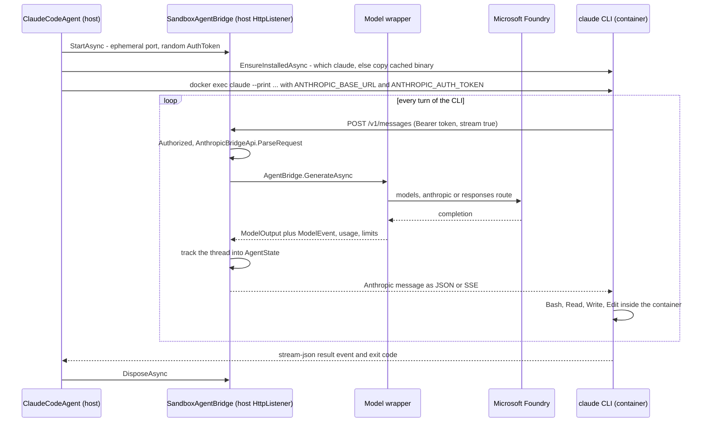

Every request must carry the token as `x-api-key` or `Authorization: Bearer`; the comparison is constant-time and
is the only access control on the wildcard binding:

```csharp
// src/InspectAzureAI.Eval/Agents/Bridge/SandboxAgentBridge.cs:654-668
    private bool Authorized(HttpListenerRequest request)
    {
        var presented = request.Headers["x-api-key"];
        var authorization = request.Headers["Authorization"];
        if (presented is null && authorization is not null && authorization.StartsWith("Bearer ", StringComparison.OrdinalIgnoreCase))
        {
            presented = authorization["Bearer ".Length..].Trim();
        }

        if (presented is null)
        {
            return false;
        }

        return CryptographicOperations.FixedTimeEquals(Encoding.UTF8.GetBytes(presented), _authTokenBytes);
```

After that, `HandleAsync` routes `POST /v1/messages`, `/v1/messages/count_tokens`, `/v1/chat/completions` and
`/v1/responses`, plus `/mcp/{server}` for bridged host tools (empty in the showcase's default configuration);
anything else is 404, a bad token 401. For `/v1/messages`, `AnthropicBridgeApi.ParseRequest` hoists `system`
into system messages and converts tools, tool choice and config; `AgentBridge.GenerateAsync` resolves the
requested name through the aliases, calls `Model.GenerateAsync` (the retry loop, limits and `ModelEvent`s of
[the Model wrapper](#4-the-model-wrapper-and-the-foundry-providers)), retries refusals, applies approval, and
then the port of `_track_state` fingerprints the messages to decide whether this call extends the main thread or
is a side call; the main thread becomes `bridge.State`, which the agent returns and
[the log](#10-the-eval-log-and-the-show-command) records. `ResponseFromOutput` renders the Anthropic message;
with `stream: true` the finished message is replayed as `message_start` / `content_block_*` SSE events through
`SseWriter`. `count_tokens` answers with an estimate of one token per four characters.

Model choice is independent of the dialect: `--model claude-sonnet-4-6` takes the Anthropic route,
`--model gpt-5.4-mini` the model-inference route (the CLI prints an `unrecognized_model` warning and carries on),
and `--route responses` the Responses route. The CLI speaks Anthropic to the bridge in all three cases.

### Limits and shutdown

A handler that catches `LimitExceededException` records it as `LimitError` and cancels `LimitReached`; an
approver's `TerminateSampleException` does the same through `TerminateRequested`. `LaunchAsync` links both
tokens into the exec's `CancellationTokenSource`, so the running `docker exec` is torn down and `ThrowIfSignalled`
rethrows the limit as the sample's outcome rather than a CLI failure. `DisposeAsync` stops the listener when the
agent returns. With `--debug`, the CLI itself gets `--debug`, its raw stdout JSONL and stderr are kept in the
sample store under `claude_code_debug`, and the showcase prints full exception traces.

### Network requirement

The bridge works only if the container can open a TCP connection to the host. The bare Docker path of
[the sandbox](#5-the-docker-sandbox-one-container-per-sample) adds `--add-host host.docker.internal:host-gateway`
(`DockerCli.cs:28`) so Linux hosts behave like Docker Desktop; a compose sandbox with `network_mode: none`
cannot reach it, and `--fake` refuses `--agent claude-code` with exit 2. The transport is plain HTTP; the token
is the protection.

### Using the bridge for another scaffold

Illustrative (not compiled): any in-container program that speaks the Anthropic or OpenAI API can be served the
same way. `AgentPrompt` lives in `InspectAzureAI.Swe`; everything else is `InspectAzureAI.Eval`.

```csharp
// Illustrative: an AgentDef that serves a third-party CLI through the bridge
public static AgentDef MyCliAgent() => new("my-cli", "an in-container scaffold served by the bridge", async (state, ct) =>
{
    var context = SampleContext.Require();
    var sandbox = context.Sandbox();
    var bridge = new AgentBridge(state, context.ActiveModel);   // tracks the main thread into bridge.State
    await using var server = await SandboxAgentBridge.StartAsync(bridge, sandbox, cancellationToken: ct);

    var env = new Dictionary<string, string>
    {
        ["ANTHROPIC_BASE_URL"] = server.BaseUrl,      // http://host.docker.internal:<port>
        ["ANTHROPIC_AUTH_TOKEN"] = server.AuthToken,  // OPENAI_BASE_URL / OPENAI_API_KEY for an OpenAI-style client
    };
    var (prompt, _) = AgentPrompt.BuildUserPrompt(state.Messages);
    using var execCts = CancellationTokenSource.CreateLinkedTokenSource(ct, server.LimitReached, server.TerminateRequested);
    await sandbox.ExecAsync(["my-cli", "--prompt", prompt], env: env, cwd: "/workspace", cancellationToken: execCts.Token);

    if (server.LimitError is { } limit) throw limit;   // the sample ends as a limit, not as a CLI failure
    return server.State;                                // the conversation reconstructed from the request threads
});
```

### Try it

```bash
# offline: where the bridge address and token enter the container
grep -n "ANTHROPIC_BASE_URL\|ANTHROPIC_AUTH_TOKEN\|host.docker.internal" src/InspectAzureAI.Swe/ClaudeCode/*.cs src/InspectAzureAI.Eval/Agents/Bridge/SandboxAgentBridge.cs | head -20
```

```text
src/InspectAzureAI.Swe/ClaudeCode/ClaudeCodeCommand.cs:139:    /// Port of <c>_seed_claude_config</c>: Claude Code 2.1.37 ignores <c>ANTHROPIC_AUTH_TOKEN</c> and silently
src/InspectAzureAI.Swe/ClaudeCode/ClaudeCodeEnv.cs:45:            ["ANTHROPIC_BASE_URL"] = bridgeBaseUrl,
src/InspectAzureAI.Swe/ClaudeCode/ClaudeCodeEnv.cs:46:            ["ANTHROPIC_AUTH_TOKEN"] = authToken,
src/InspectAzureAI.Swe/ClaudeCode/ClaudeCodeAgent.cs:167:                var apiKey = agentEnv.TryGetValue("ANTHROPIC_AUTH_TOKEN", out var token) ? token : ClaudeCodeEnv.DefaultApiKey;
src/InspectAzureAI.Eval/Agents/Bridge/SandboxAgentBridge.cs:77:    /// the host as host.docker.internal, so a prefix naming 127.0.0.1 answers those requests with 400 (Claude Code
```

```bash
# offline: --fake cannot drive claude-code (exit 2); the CLI needs a real sandbox and a bridged model
dotnet run --project src/InspectAzureAI.SweShowcase --no-launch-profile -- run --fake --sandbox local --task hello-swe --agent claude-code \
  --log-dir /private/tmp/claude-501/-Users-kevinburrowes-Documents-code-inspect-azureai-dotnet/b60a5f4b-bb06-4856-9b6d-c5c67736c085/scratchpad/demo-logs
```

```text
--fake cannot drive claude-code: the Claude Code CLI runs inside a real sandbox and needs a real model served through the bridge. Use --agent mini-swe or --agent basic with --fake, or drop --fake.
(usage text follows; exit code 2)
```

```bash
# needs az login, AZUREAI_BASE_URL and a running Docker daemon (not run here)
dotnet run --project src/InspectAzureAI.SweShowcase -- run --task hello-swe --agent claude-code --model claude-sonnet-4-6
# the same CLI driven by a non-Anthropic deployment through the bridge (model-inference route)
dotnet run --project src/InspectAzureAI.SweShowcase -- run --task hello-swe --agent claude-code --model gpt-5.4-mini
# keep the CLI's raw stdout/stderr in the sample store and print full traces
dotnet run --project src/InspectAzureAI.SweShowcase -- run --task pytest-fix --agent claude-code --model claude-sonnet-4-6 --debug
```

### What to point out in the demo

- Nothing about Claude Code was rewritten: the real `claude` binary runs inside the container, in `--print
  --output-format stream-json` mode, and its own tools (Bash, Read, Write, Edit) run in the container too.
- The first run downloads the binary once to `~/.cache/inspect-azureai/claude-code-downloads` and copies it in;
  later runs say "Used claude code binary from cache". The sandbox image has no Node.js.
- The only network hop is container to host: `ANTHROPIC_BASE_URL=http://host.docker.internal:<port>` with a
  per-run token; there is no API key anywhere, and Foundry is still reached with the `az login` credential.
- Swap `--model claude-sonnet-4-6` for `--model gpt-5.4-mini` and the identical CLI runs on a GPT deployment;
  the bridge translates the dialect, the CLI only notices an `unrecognized_model` warning.
- Every bridged call is a normal `Model.GenerateAsync`, so `show` lists the same `ModelEvent`s, usage and
  limits as for the other agents, and a token limit stops the CLI mid-run as a limit, not as a crash.

### Where to look

- `src/InspectAzureAI.Swe/ClaudeCode/ClaudeCodeAgent.cs` — `ClaudeCode.Agent` factory, `ExecuteAsync` run loop,
  `LaunchAsync` with the limit-linked exec, `StartSandboxBridgeAsync`.
- `src/InspectAzureAI.Swe/ClaudeCode/ClaudeCodeEnv.cs` — the container environment (`Build`), bridge URL and
  token first.
- `src/InspectAzureAI.Swe/ClaudeCode/ClaudeCodeBinary.cs` — host-side download, checksum, cache (`DefaultCacheDir`)
  and `EnsureInstalledAsync` copy-in.
- `src/InspectAzureAI.Swe/ClaudeCode/ClaudeCodeCommand.cs` — CLI flags (`BaseFlags`, `--debug`) and the
  `settings.json` seeding (`SettingsCommand`).
- `src/InspectAzureAI.Eval/Agents/Bridge/SandboxAgentBridge.cs` — `HttpListener`, port probing, `Authorized`,
  route table, `LimitError` / `LimitReached`.
- `src/InspectAzureAI.Eval/Agents/Bridge/AgentBridge.cs` — `GenerateAsync` (aliases, refusal retry, approval) and
  the `_track_state` thread tracking into `State`.
- `src/InspectAzureAI.Eval/Agents/Bridge/AnthropicBridgeApi.cs` — Messages API parse, `ResponseFromOutput`,
  `StreamEvents`, `CountTokens`.
- `src/InspectAzureAI.Eval/Sandbox/Docker/DockerCli.cs` — the `--add-host host.docker.internal:host-gateway` run
  argument.
- `docs/container-orchestration.md` — the three container-to-host channels and why the bridge needs a network
  path.

## 9. Microsoft Agent Framework in-process through InspectChatClient

> **In plain words.** The fourth agent is not written by this repository at all: it is a stock Microsoft Agent
> Framework agent, the kind you would build in any .NET app. The trick is what it is given as its "model": a
> chat client that looks ordinary to the framework but is really Inspect's model wrapper. So the framework runs
> its own tool loop in memory, with no web server and no HTTP, while every model call still goes through the
> same retry, limit, approval and transcript machinery as the other three agents. The sandbox `bash` tool is
> handed to the framework as one of its functions, and the outer "try again if wrong" loop is Inspect's.

### No HTTP: the framework's chat client is Inspect's model

`AgentFramework.Agent(MafAgentOptions)` in `src/InspectAzureAI.Maf/MafAgent.cs` returns an `AgentDef`, so the
showcase turns it into a solver exactly as it does mini-swe-agent and Claude Code (`Agents.AsSolver`, see
[the task](#3-the-task-evaltask-dataset-solver-and-scorers)). When the sample runs, `MafAgentLoop.ExecuteAsync`
builds an `AgentBridge` over the incoming `AgentState` and the sample's active model, wraps it in an
`InspectChatClient` (an `IChatClient`), and wraps that in the framework's own `FunctionInvokingChatClient`:

```csharp
// src/InspectAzureAI.Maf/MafAgent.cs:79-89
        var bridge = new AgentBridge(state, model, retryRefusals: options.RetryRefusals, approval: options.Approval, cache: options.Cache);
        using var inspectClient = new InspectChatClient(bridge);
        // Our own function-invocation layer rather than the agent's default one: Inspect's limits bound the run, and
        // tool errors are reported to the model for as long as it keeps calling, as the native tool loop does (an
        // unhandled exception in an Inspect tool still fails the sample: see InvokeToolAsync).
        using var client = new FunctionInvokingChatClient(inspectClient)
        {
            MaximumIterationsPerRequest = options.MaxToolIterations,
            MaximumConsecutiveErrorsPerRequest = int.MaxValue,
            IncludeDetailedErrors = true,
        };
```

The framework's 40-round-trip cap is lifted (`MaxToolIterations` defaults to `int.MaxValue`) so that only
Inspect's message, token, time and cost limits bound the run. A `ChatClientAgent` is then built over that client
with the instructions (default: `basic_agent`'s system message) and the tools, and a function-invocation
middleware (`InvokeToolAsync`) is attached. The sample's messages become the first `RunAsync` input of a fresh
`AgentSession`; the framework resends the whole history on every model call, which is what the bridge's thread
tracking needs to keep `AgentState.Messages` current. This is the same `AgentBridge` that serves
[Claude Code](#8-claude-code-through-the-sandboxagentbridge) over HTTP, called directly.

`InspectChatClient.GetResponseAsync` is the whole adapter: Microsoft.Extensions.AI messages, tools and options in,
a `ChatResponse` out, with the model's tool calls as `FunctionCallContent` for the framework to invoke:

```csharp
// src/InspectAzureAI.Maf/InspectChatClient.cs:28-41
    public async Task<ChatResponse> GetResponseAsync(IEnumerable<MafChatMessage> messages, ChatOptions? options = null, CancellationToken cancellationToken = default)
    {
        ArgumentNullException.ThrowIfNull(messages);
        var input = MafConversion.ToInspectMessages(messages, options?.Instructions);
        var tools = MafConversion.ToToolInfos(options?.Tools);
        var output = await Bridge.GenerateAsync(
            options?.ModelId ?? MafConversion.DefaultModelName,
            input,
            tools,
            MafConversion.ToToolChoice(options?.ToolMode),
            MafConversion.ToGenerateConfig(options),
            cancellationToken).ConfigureAwait(false);
        return MafConversion.ToChatResponse(output);
    }
```

Streaming is synthesised from the finished response. Generation parameters the framework sets are mapped but the
bridge strips them (unless built with `forwardGenerationConfig`), so the served model's own config wins, as for
Claude Code. Every call lands in [the Model wrapper](#4-the-model-wrapper-and-the-foundry-providers) and shows
up as a `ModelEvent` in [the log](#10-the-eval-log-and-the-show-command).

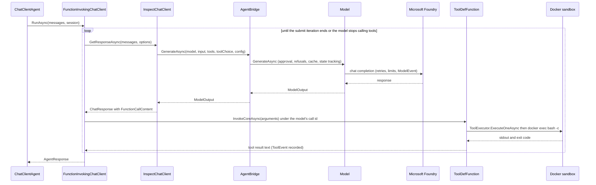

### Inspect tools as AIFunctions

`ToolDefFunction` (`src/InspectAzureAI.Maf/ToolDefFunction.cs`) wraps an Inspect `ToolDef` as an Agent Framework
`AIFunction`: the JSON schema is the tool's `ToolParams`, and `InvokeCoreAsync` reads the model's own tool-call id
from `FunctionInvokingChatClient.CurrentContext` and runs the call through `ToolExecutor.ExecuteOneAsync`, so
argument validation, error mapping, output truncation and the transcript `ToolEvent` are Inspect's. Approval is
not applied there: the bridge already approved (or rejected and replayed) the call on the model response before
the framework saw it. `MafTools.FromToolDefs` is the list form; the showcase hands it
`SandboxTools.Bash(BashTimeout)` (three minutes per command) in `src/InspectAzureAI.SweShowcase/AgentChoice.cs`.
The submit tool is built the same way inside `MafAgentLoop.SubmitTool()`, and the middleware sets
`FunctionInvocationContext.Terminate` once the iteration that ran it has finished its last call, so a submission
costs no extra model call and its sibling calls still run.

### The outer loop is react's

`ExecuteAsync` loops over framework runs exactly as `react` does for the other agents: a submission becomes
`Output.Completion`; with attempts left it is scored with `Agents.ScoreAsync`, and an incorrect one is answered
with the incorrect message on the same session; a run that ends without submitting is nudged with the continue
message. A limit or termination raised inside a tool is captured and re-thrown after `RunAsync` returns. What the
outer loop cannot do is compaction: the framework owns its session history, so `--compaction` is refused by
`AgentChoice.RejectCompaction` with a usage error, unlike [basic_agent](#7-basic_agent-inspects-react-loop-with-the-bash-tool).
Approval, cache, cost limits and hooks apply as for every agent. [docs/agent-framework.md](../blob/main/docs/agent-framework.md)
has the six-step run description, the fidelity notes and the live Foundry results.

### Using it

Illustrative (adapted from the "Using it" example in docs/agent-framework.md; `dataset` is assumed):

```csharp
using InspectAzureAI.Eval.Agents;
using InspectAzureAI.Eval.Tools;
using InspectAzureAI.Maf;
using Microsoft.Extensions.AI;

// a plain C# delegate becomes a framework-side tool; the sandbox bash tool is an Inspect tool wrapped by MafTools
var weather = AIFunctionFactory.Create((string city) => $"Sunny in {city}", "get_weather", "Current weather.");
var agent = AgentFramework.Agent(new MafAgentOptions
{
    Instructions = "Answer with the weather, then call {submit} with a one-line summary.",
    Tools = [weather, .. MafTools.FromToolDefs([SandboxTools.Bash()])],
    Attempts = new AgentAttempts(2),
});
var task = new EvalTask { Name = "weather", Dataset = dataset, Solver = Agents.AsSolver(agent), Scorers = [Scorers.Includes()] };
```

Any `IChatClient` consumer works the same way: `new InspectChatClient(new AgentBridge(state, model))` can back a
Semantic Kernel or raw Microsoft.Extensions.AI pipeline directly.

### Try it

Offline, no Docker, no sign-in (the scripted model drives the framework with `bash` calls then `submit`; only
sample 1 is scripted to succeed, so the other two are `I`):

```bash
dotnet run --project src/InspectAzureAI.SweShowcase --no-build -- run --fake --sandbox local --task hello-swe --agent maf --log-dir /private/tmp/claude-501/-Users-kevinburrowes-Documents-code-inspect-azureai-dotnet/b60a5f4b-bb06-4856-9b6d-c5c67736c085/scratchpad/demo-logs
```

```
task     : hello-swe (3 samples, scorer exec_check)
agent    : maf (attempts 1)
model    : scripted (--fake: scripted turns, no network)
sandbox  : local (temp directory on this host; demo only)
log fmt  : eval

sample 1 (epoch 1) started
sample 2 (epoch 1) completed: exec_check=I (221 tokens, 0.1s)
sample 3 (epoch 1) completed: exec_check=I (221 tokens, 0.1s)
sample 1 (epoch 1) completed: exec_check=C (662 tokens, 2.6s)
Log written to .../demo-logs/<timestamp>_hello-swe_<id>.eval

status   : success (3/3 samples completed)
tokens   : 1104 (983 in, 121 out)
```

`show` on that log lists sample 1 as `exec_check=C | 662 tokens | 2.6s | 3 model calls, 3 tool calls` with the
answer `Created hello.py; running python3 hello.py prints Hello, Inspect!`.

Offline: compaction is refused for this agent (exit code 2):

```bash
dotnet run --project src/InspectAzureAI.SweShowcase --no-build -- run --fake --sandbox local --task hello-swe --agent maf --compaction auto
```

```
--compaction does not apply to maf: Agent Framework keeps the conversation in its own session; use it with --agent mini-swe or --agent basic
```

Needs Foundry sign-in (`az login`, `AZUREAI_BASE_URL`) and a Docker daemon; two scored attempts:

```bash
dotnet run --project src/InspectAzureAI.SweShowcase -- run --task hello-swe --agent maf --attempts 2
```

### What to point out in the demo

- The agent is a stock `ChatClientAgent` from Microsoft.Agents.AI 1.20; nothing in it knows about Inspect. The only
  thing swapped is the `IChatClient` it was handed.
- No HTTP anywhere: contrast with the previous section, where Claude Code inside the container talks to the
  host bridge over `host.docker.internal`. Here the same `AgentBridge` is called in-process.
- The framework's own 40-iteration cap is lifted, so Inspect's `--message-limit`, token, time and cost limits are
  the only limits, and they read the same in the log as for the other three agents.
- Tool calls run through Inspect's executor under the model's own call ids, so `bash` and `submit` appear as
  `ToolEvent`s in the log exactly as they do for `basic`; approval happened on the model response, before the
  framework invoked anything.
- `--attempts 2` shows the outer react loop: the framework session is reused, and the incorrect message is just
  the next user turn.
- `--compaction` is refused with a usage error because the framework, not Inspect, owns the history.

### Where to look

- `src/InspectAzureAI.Maf/MafAgent.cs` — `AgentFramework.Agent`, `MafAgentLoop` (bridge, client, middleware,
  submit tool, attempts loop).
- `src/InspectAzureAI.Maf/MafAgentOptions.cs` — every knob: instructions, tools, submit, attempts, model,
  approval, cache, `AgentFactory`, `MaxToolIterations`.
- `src/InspectAzureAI.Maf/InspectChatClient.cs` — the `IChatClient` over `AgentBridge`.
- `src/InspectAzureAI.Maf/ToolDefFunction.cs` — `ToolDef` as `AIFunction`; `MafTools.FromToolDef(s)`.
- `src/InspectAzureAI.Maf/MafConversion.cs` — messages, tools, options, outputs and usage in both directions.
- `src/InspectAzureAI.SweShowcase/AgentChoice.cs` — `--agent maf` wiring and `RejectCompaction`.
- `src/InspectAzureAI.SweShowcase/FakeScripts.cs` — the scripted turns `--fake` uses for `basic` and `maf`.
- `docs/agent-framework.md` — the full design, fidelity notes, tests and live Foundry results.

## 10. The eval log and the show command

> **In plain words.** Every run leaves exactly one file behind, and that file is the product: the scores and
> metrics, every message the model saw and wrote, every bash command the agent ran and what came back, and
> what it all cost in tokens and seconds. The file has the same shape as a Python Inspect log, so Inspect's
> own viewer can open it and a C# run can sit next to a Python run. `swe-showcase show` prints a one-screen
> summary of any log, `jq` reaches any detail of the JSON form, and C# code can load it back as typed
> records. Nothing needs to be re-run to answer "what did the agent actually do on sample 2?".

### What one run writes

[The runner](#2-the-host-the-swe-showcase-cli-and-the-eval-runner) chooses the format at
`src/InspectAzureAI.Eval/Runner/Eval.cs:183` (`--log-format`, else `INSPECT_LOG_FORMAT`, else
`LogFormats.Default`, which is `.eval`), names the file `<created>_<task>_<eval id>.<eval|json>` under
`--log-dir` (default `logs`, or `INSPECT_LOG_DIR`), and hands it to a recorder that appends samples as they
complete, so a cancelled run still leaves a readable log. `.eval` is Python's zip format, stamped schema
version 2, and is what `inspect view` reads. `.json` is one indented, snake_case document with nulls omitted
(`EvalLogWriter`): the same fields, but greppable and `jq`-friendly, which is why the demo uses it.

### The shape of the log

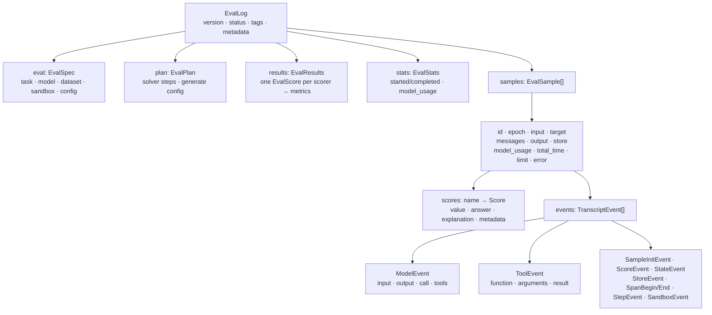

The top of the record mirrors Python's `EvalLog` field for field, in Python's order:

```csharp
// src/InspectAzureAI.Eval/Log/EvalLog.cs:27-46
public sealed record EvalLog
{
    /// <summary>Port of <c>LOG_SCHEMA_VERSION</c>: the current log format version.</summary>
    public const int SchemaVersion = 2;

    /// <summary>Log format version (<see cref="SchemaVersion"/>); readers reject newer versions and normalise older ones.</summary>
    public int Version { get; init; } = SchemaVersion;

    public EvalStatus Status { get; init; } = EvalStatus.Started;

    public required EvalSpec Eval { get; init; }

    /// <summary>Port of <c>EvalLog.plan</c>: the solvers and generate config.</summary>
    public EvalPlan Plan { get; init; } = new();

    public EvalResults? Results { get; init; }

    public EvalStats Stats { get; init; } = new();

    public EvalError? Error { get; init; }
```

`Samples` and `Reductions` follow (lines 63-66). Each `EvalSample` carries the full conversation
(`Messages`), the final `Output`, the `Store`, per-model usage, wall and working time, the `Limit` that
ended it if any, and `Scores`: a dictionary from scorer name to `Score`, whose `Value` is a `ScoreValue`
(`"C"`/`"I"` here), with `Answer`, `Explanation` and `Metadata`. `Events` is the transcript: a `ModelEvent`
per call through [the Model wrapper](#4-the-model-wrapper-and-the-foundry-providers) (input messages,
output, the raw `Call`, the tools offered) and a `ToolEvent` per tool call (`Function`, `Arguments`,
`Result`), inside `SpanBeginEvent`/`SpanEndEvent` pairs that group the solver, the agent loop and the
scorer. All four agents produce the same event types because they share the wrapper.

### What `show` prints

`show` accepts either extension and reads it with `EvalLogFiles.ReadEvalLog`. After the header and the
metrics table it prints one line per sample, counting the events by type:

```csharp
// src/InspectAzureAI.SweShowcase/Cli.cs:257-267
        foreach (var sample in log.Samples ?? [])
        {
            var tokens = sample.ModelUsage.Values.Sum(usage => usage.TotalTokens);
            var modelCalls = sample.Events.Count(e => e is ModelEvent);
            var toolCalls = sample.Events.Count(e => e is ToolEvent);
            var scores = sample.Scores is { Count: > 0 } scored
                ? string.Join(", ", scored.Select(pair => $"{pair.Key}={pair.Value.Text}"))
                : "no scores";
            var seconds = (sample.TotalTime ?? 0).ToString("F1", CultureInfo.InvariantCulture);
            var cost = RunWiring.TotalCost(sample.ModelUsage) is { } sampleCost ? $" | {RunWiring.FormatCost(sampleCost)}" : "";
            var line = $"  {sample.Id} (epoch {sample.Epoch}): {scores} | {tokens} tokens{cost} | {seconds}s | {modelCalls} model calls, {toolCalls} tool calls";
```

Under each sample it prints the first line of the answer and the last line of every score's explanation,
which for `exec_check` is the exit code and for a model-graded scorer is the judge's verdict line.

### Reading a log from C#

`EvalLogWriter.Read` dispatches on the extension, so the same call works for both formats
(`EvalLogWriter.ReadHeader` skips the samples when only the metrics matter). Illustrative:

```csharp
// illustrative: load a log and list each sample's scores and bash commands
using InspectAzureAI.Eval.Context;   // ToolEvent
using InspectAzureAI.Eval.Log;       // EvalLog, EvalLogWriter
using InspectAzureAI.Eval.Model;     // ModelEvent

EvalLog log = EvalLogWriter.Read(args[0]);            // .eval or .json
Console.WriteLine($"{log.Eval.Task} on {log.Eval.Model}: {log.Status}");
foreach (var score in log.Results?.Scores ?? [])
    foreach (var (name, metric) in score.Metrics)
        Console.WriteLine($"  {score.Name}/{name} = {metric.Value:F3}");

foreach (var sample in log.Samples ?? [])
{
    var verdicts = string.Join(", ", (sample.Scores ?? new Dictionary<string, Score>())
        .Select(s => $"{s.Key}={s.Value.Text} ({s.Value.Explanation})"));
    var calls = sample.Events.OfType<ModelEvent>().Count();
    Console.WriteLine($"sample {sample.Id}: {verdicts}; {calls} model calls");
    foreach (var tool in sample.Events.OfType<ToolEvent>().Where(t => t.Function == "bash"))
        Console.WriteLine($"    $ {tool.Arguments["cmd"]}");
}
```

### Try it

Offline: the `--fake` run uses a scripted model and the local sandbox, so it needs only the .NET SDK.

```bash
LOGS=/private/tmp/claude-501/-Users-kevinburrowes-Documents-code-inspect-azureai-dotnet/b60a5f4b-bb06-4856-9b6d-c5c67736c085/scratchpad/demo-logs
dotnet run --project src/InspectAzureAI.SweShowcase --no-build -- run --fake --sandbox local \
  --task hello-swe --agent basic --log-format json --log-dir "$LOGS"
```

```text
task     : hello-swe (3 samples, scorer exec_check)
agent    : basic (attempts 1)
model    : scripted (--fake: scripted turns, no network)
sandbox  : local (temp directory on this host; demo only)
log fmt  : json

sample 1 (epoch 1) completed: exec_check=C (662 tokens, 2.1s)
sample 2 (epoch 1) completed: exec_check=I (221 tokens, 0.1s)
sample 3 (epoch 1) completed: exec_check=I (221 tokens, 0.1s)
Log written to .../demo-logs/2026-09-14T03-44-06-00-00_hello-swe_uRcbBYDHY8ceXkryFzJUZh.json

scorer             metric        value
exec_check         accuracy      0.333
exec_check         stderr        0.333
```

```bash
LOG="$LOGS"/2026-09-14T03-44-06-00-00_hello-swe_uRcbBYDHY8ceXkryFzJUZh.json   # the path printed above
dotnet run --project src/InspectAzureAI.SweShowcase --no-build -- show "$LOG"
```

```text
format   : json
task     : hello-swe (version 0, run DWDbcKvhye4Hk4qcfxYfGD)
model    : scripted
status   : success (3/3 samples completed)
tokens   : 1104 (983 in, 121 out)

samples:
  1 (epoch 1): exec_check=C | 662 tokens | 2.1s | 3 model calls, 3 tool calls
      answer: Created hello.py; running `python3 hello.py` prints Hello, Inspect!
      exec_check: exit code 0
  2 (epoch 1): exec_check=I | 221 tokens | 0.1s | 1 model calls, 1 tool calls
      answer: I was unable to solve this task.
      exec_check: exit code 1
```

```bash
jq '.samples[0].scores' "$LOG"
jq -c '.samples[0].events[] | select(.event=="tool") | {function, arguments}' "$LOG"
jq -c '[.samples[0].events[].event] | group_by(.) | map({(.[0]): length}) | add' "$LOG"
jq -c '.results.scores[0].metrics | map_values(.value)' "$LOG"
```

```text
{ "exec_check": { "value": "C",
    "answer": "Created hello.py; running `python3 hello.py` prints Hello, Inspect!",
    "explanation": "exit code 0",
    "metadata": { "check": "test \"$(python3 hello.py)\" = \"Hello, Inspect!\"", "returncode": 0 },
    "history": [] } }
{"function":"bash","arguments":{"cmd":"cat > hello.py <<'EOF'\nprint(\"Hello, Inspect!\")\nEOF"}}
{"function":"bash","arguments":{"cmd":"python3 hello.py"}}
{"function":"submit","arguments":{"answer":"Created hello.py; running `python3 hello.py` prints Hello, Inspect!"}}
{"model":3,"score":1,"span_begin":12,"span_end":12,"state":4,"step":4,"tool":3}
{"accuracy":0.3333333333333333,"stderr":0.33333333333333337}
```

Needs the Python `inspect-ai` package (`pip install inspect-ai`); opens a browser on the log directory and
reads the default `.eval` files as well as the JSON one:

```bash
inspect view --log-dir "$LOGS"
```

Needs Foundry sign-in and a Docker daemon (do not run offline): the same commands without `--fake` and
`--sandbox local` write a log of the real agent, whose `ToolEvent`s are the bash commands that ran in the
container.

### What to point out in the demo

- The log is the deliverable, not the console: the metrics table `run` prints is read back from the same
  file `show` reads, so a run can be re-examined or shared without re-running it.
- Scores are per sample and per scorer: `.samples[i].scores.exec_check` holds the verdict, the answer, the
  explanation (here the exit code) and the check command in `metadata`.
- The transcript is the audit trail: the three `tool` events on sample 1 are the exact bash commands the
  agent ran, and the `model` events hold the messages it saw when it chose them.
- The default `.eval` file is Python Inspect's own format (schema version 2), so `inspect view` opens a C#
  run and the same `jq` queries work on `inspect eval` output.
- One log schema for four agents: mini-swe-agent, basic_agent, Claude Code and the Agent Framework agent all
  produce `ModelEvent`/`ToolEvent` sequences because every model call passes through `Model`.

### Where to look

- `src/InspectAzureAI.Eval/Log/EvalLog.cs`: the `EvalLog`, `EvalSpec`, `EvalResults`, `EvalStats` and `EvalSample` records.
- `src/InspectAzureAI.Eval/Log/EvalLogWriter.cs`: JSON serialisation (snake_case, Python field order) and `Read`/`ReadHeader`.
- `src/InspectAzureAI.Eval/Log/EvalFormat/LogFormat.cs`: the `eval`/`json` formats, `INSPECT_LOG_FORMAT` and `INSPECT_LOG_DIR`.
- `src/InspectAzureAI.Eval/Log/EvalFormat/EvalLogFiles.cs`: `ReadEvalLog`, `ReadEvalLogSample`, `ListEvalLogs` for either format.
- `src/InspectAzureAI.Eval/Context/TranscriptEvents.cs`, `TranscriptEventTypes.cs`, `Model/ModelEvent.cs`: the event records.
- `src/InspectAzureAI.Eval/Scorers/Score.cs`: `Score` and its `Text` view of the value.
- `src/InspectAzureAI.Eval/Runner/Eval.cs:183-188`: format choice, file naming and the incremental recorder.
- `src/InspectAzureAI.SweShowcase/Cli.cs:213-300`: the `show` command.

## 11. Demo runbook

> **In plain words.** This is the presenter's script: what to check before you walk in, the one run to do in
> advance so the slow first-time work (building the Docker image, downloading the Claude Code binary) is already
> cached, and eight commands in an order that adds one layer at a time. Each step says what appears on screen,
> what to say, how long it took on a real Foundry resource, and what to do if it fails. The offline `--fake`
> run proves the pipeline without a model or a daemon, and every exit code tells you which layer broke.

### Before the demo

```bash
dotnet --version                                  # 10.x
docker version                                    # the daemon must be running (needs Docker)
az login                                          # Entra ID only; no API keys (needs Foundry sign-in)
export AZUREAI_BASE_URL=https://<resource>.services.ai.azure.com/models
export INSPECT_AZUREAI_MODEL=gpt-5.4-mini         # default deployment for every non-Claude step
dotnet build
alias swe-showcase='dotnet run --project src/InspectAzureAI.SweShowcase --no-build --'

# warm-up (needs Docker + Foundry): builds inspect-swe-sandbox:<hash> and caches the Claude Code binary
swe-showcase run --task hello-swe --agent claude-code --model claude-sonnet-4-6 --sample-id 2
```

The endpoint can also live in the gitignored `Properties/launchSettings.json`. The warm-up matters: the verified
cold Claude Code run took 47.4 s (a 316 MiB download into `~/.cache/inspect-azureai/claude-code-downloads`), the
warm one 19.9 s; the image is reused until the Dockerfile changes
([section 5](#5-the-docker-sandbox-one-container-per-sample)).

### The script

`Takes` is the per-sample time from the doc's verified 2026-09-04 runs (gpt-5.4-mini unless stated), plus a few
seconds of `dotnet run` start-up.

| # | Command | Takes | On screen, and what to say | If it fails |
|---|---|---|---|---|
| 1 | `swe-showcase list` | 2 s | Tasks with sample count and scorer, the agents, the Dockerfile path. `copilot` is a fifth agent outside this talk. [Section 2](#2-the-host-the-swe-showcase-cli-and-the-eval-runner), [3](#3-the-task-evaltask-dataset-solver-and-scorers). | Nothing to fail. |
| 2 | `swe-showcase run --fake --sandbox local --task hello-swe --agent mini-swe --log-dir demo-logs` | 3 s | Header, three samples start and finish, `1 C / 2 I`, accuracy 0.333, log path. The whole pipeline with no model and no Docker; the model is `ScriptedModelApi`. [Section 2](#2-the-host-the-swe-showcase-cli-and-the-eval-runner), [10](#10-the-eval-log-and-the-show-command). | Exit 2: `python3` is not on the PATH. |
| 3 | `swe-showcase run --task hello-swe --agent mini-swe --limit 1` | 9.4 s, 4,466 tokens | Image reused, one container, 4 model calls and 4 bash actions, `exec_check=C`. [Section 4](#4-the-model-wrapper-and-the-foundry-providers), [5](#5-the-docker-sandbox-one-container-per-sample), [6](#6-mini-swe-agent-a-native-c-loop). | `Sandbox unavailable` (exit 3): add `--sandbox local`. `Entra ID sign-in failed` (exit 3): follow the printed `az login` hints. No endpoint (exit 2): export `AZUREAI_BASE_URL`. |
| 4 | `swe-showcase run --task hello-swe --agent basic --attempts 2 --limit 1` | 4.8 s, 801 tokens | One `bash(cmd=…)`, then `submit(answer="Done")`, both `ToolEvent`s. With `--attempts 2` an incorrect submit is scored through `score()` and the agent retries. [Section 7](#7-basic_agent-inspects-react-loop-with-the-bash-tool). | Exit 1 = a sample errored; the log is still written, `show` it. Offline: add `--fake --sandbox local`. |
| 5 | `swe-showcase run --task hello-swe --agent claude-code --model claude-sonnet-4-6 --sample-id 2` | 19.9 s warm, 97,023 tokens | The CLI runs inside the container: 4 bridged `/v1/messages` calls with 24 tools each, `Read`, `Edit`, text, `exec_check=C`. Sample 2 because in the verified run sample 1 wrote `/hello.py` and scored `I`. [Section 8](#8-claude-code-through-the-sandboxagentbridge). | "issue with the selected model" with zero model calls = the CLI cannot reach the bridge: re-run with `--no-cleanup --debug`, then `docker exec -it inspect-swe-<name> bash`. `--fake` refuses this agent (exit 2); the cheap live fallback is `--model gpt-5.4-mini` (12.9 s verified). |
| 6 | `swe-showcase run --task hello-swe --agent maf --attempts 2 --limit 1` | 5.3 s, 807 tokens | 2 bridged calls, no HTTP, `bash` and `submit` as `ToolEvent`s; same `Model`, limits and log as the other three. [Section 9](#9-microsoft-agent-framework-in-process-through-inspectchatclient). | `--fake --sandbox local` works (the script drives `maf` like `basic`). |
| 7 | `swe-showcase show <log.eval>` | 1 s | Status, tokens, metrics, one line per sample with model and tool call counts, the answer, the last line of each explanation. [Section 10](#10-the-eval-log-and-the-show-command). | Any `.eval` or `.json` log works, including the step 2 one. |
| 8 | `dotnet run --project src/InspectAzureAI.ModelMatrix -- --parallel 3 --markdown docs/model-matrix-results.md` | minutes: one sample per deployment, three at a time | A row per deployment (status, accuracy, tokens, tok/s, log); a re-run with the same `--log-dir` reuses finished rows. | Open `docs/model-matrix-results.md` (the last full run) or run `-- --fake` on the fixed four-deployment catalog. |

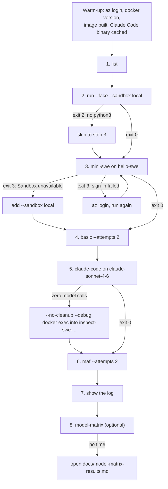

The fallbacks work because the CLI maps every failure to one exit code and prints a hint:

```csharp
// src/InspectAzureAI.SweShowcase/Cli.cs:150-174
        catch (PrerequisiteError ex)
        {
            Console.Error.WriteLine(ProviderUtil.StripRichMarkup(ex.Message));
            return 2;
        }
        catch (Exception ex) when (IsSignInFailure(ex))
        {
            Console.Error.WriteLine($"Entra ID sign-in failed: {SignInFailureMessage(ex)}\n\n{LoginHint}");
            return 3;
        }
        catch (RequestFailedException ex)
        {
            Console.Error.WriteLine($"Azure request failed (HTTP {ex.Status}): {AzureAIModelApi.AzureErrorMessage(ex)}");
            return 3;
        }
        catch (ServiceResponseException ex)
        {
            Console.Error.WriteLine($"Azure response could not be read (retryable): {ex.Message}");
            return 3;
        }
        catch (SandboxUnavailableException ex)
        {
            Console.Error.WriteLine($"Sandbox unavailable: {Describe(ex, options.Debug)}");
            return 3;
        }
```

Exit 0 is fine (an incorrect score is a result, not an error); 1 a sample errored or the run aborted; 2 a usage
error or missing prerequisite; 3 sign-in, Azure or runtime failure. Ctrl-C cancels the token in `Program.cs`, so
the runner removes its sandboxes and writes a `cancelled` log before exiting 3.

`Cli.RunAsync` is the whole program, so the runbook can be driven in-process (`Cli` is `internal`: put this in
the showcase project or a project on its `InternalsVisibleTo` list):

```csharp
// Illustrative: run the steps in order, swapping in the offline script when a live step fails
using InspectAzureAI.SweShowcase;

string[][] steps =
[
    ["list"],
    ["run", "--fake", "--sandbox", "local", "--task", "hello-swe", "--agent", "mini-swe"],
    ["run", "--task", "hello-swe", "--agent", "mini-swe", "--limit", "1"],
    ["run", "--task", "hello-swe", "--agent", "basic", "--attempts", "2", "--limit", "1"],
    ["run", "--task", "hello-swe", "--agent", "claude-code", "--model", "claude-sonnet-4-6", "--sample-id", "2"],
    ["run", "--task", "hello-swe", "--agent", "maf", "--attempts", "2", "--limit", "1"],
];

using var shutdown = new CancellationTokenSource();
foreach (var step in steps)
{
    var code = await Cli.RunAsync(step, shutdown.Token);           // 0 ok, 1 sample error, 2 usage, 3 sign-in/Azure/runtime
    if (code == 3 && step[0] == "run" && !step.Contains("claude-code"))   // --fake cannot drive claude-code
    {
        code = await Cli.RunAsync([.. step, "--fake", "--sandbox", "local"], shutdown.Token);
    }

    Console.WriteLine($"{string.Join(' ', step)} -> exit {code}");
}
```

### Try it

```bash
alias swe-showcase='dotnet run --project src/InspectAzureAI.SweShowcase --no-build --'
swe-showcase list                                                                          # offline
swe-showcase run --fake --sandbox local --task hello-swe --agent mini-swe --log-dir demo-logs   # offline, needs python3
swe-showcase show demo-logs/<timestamp>_hello-swe_<id>.eval                                # offline
swe-showcase run --task hello-swe --agent mini-swe --limit 1                               # needs Docker + Foundry sign-in
dotnet run --project src/InspectAzureAI.ModelMatrix -- --fake                              # offline
```

`list` (trimmed):

```
tasks:
  hello-swe        3 samples  scorer=exec_check       three small Python edits, each verified by a bash check command
  pytest-fix       2 samples  scorer=exec_check       fix a tiny package until its pytest suite passes
  system-explorer  2 samples  scorer=model_graded_qa  two questions about the container, judged by model_graded_qa
  ctf              3 samples  scorer=includes         three picoCTF-style flag hunts planted by setup scripts, scored by includes

agents:
  mini-swe         native C# port of mini-swe-agent's bash tool-calling loop (inspect_swe mini_swe_agent)
  claude-code      the Claude Code CLI inside the sandbox, its API calls bridged to the task model (inspect_swe claude_code)
  copilot          the GitHub Copilot CLI inside the sandbox (BYOK), its API calls bridged to the task model
  basic            Inspect's basic_agent ReAct loop with the sandbox bash tool and a submit tool
  maf              a Microsoft Agent Framework ChatClientAgent with the sandbox bash tool, its model calls bridged in-process to the task model
```

The `--fake` run (trimmed; the log-path lines are omitted):

```
task     : hello-swe (3 samples, scorer exec_check)
agent    : mini-swe (attempts 1)
model    : scripted (--fake: scripted turns, no network)
sandbox  : local (temp directory on this host; demo only)
log fmt  : eval

sample 1 (epoch 1) started
sample 2 (epoch 1) started
sample 3 (epoch 1) started
sample 2 (epoch 1) completed: exec_check=I (841 tokens, 0.4s)
sample 3 (epoch 1) completed: exec_check=I (842 tokens, 0.4s)
sample 1 (epoch 1) completed: exec_check=C (2503 tokens, 0.5s)
status   : success (3/3 samples completed)
tokens   : 4186 (3997 in, 189 out)
exec_check         accuracy      0.333
```

`show` on that log (trimmed):

```
task     : hello-swe (version 0, run U3qQ976CS7HgWQna7qrPTQ)
model    : scripted
status   : success (3/3 samples completed)
tokens   : 4186 (3997 in, 189 out)

samples:
  1 (epoch 1): exec_check=C | 2503 tokens | 0.5s | 3 model calls, 0 tool calls
      answer: Created hello.py; running `python3 hello.py` prints Hello, Inspect!
      exec_check: exit code 0
  2 (epoch 1): exec_check=I | 841 tokens | 0.4s | 1 model calls, 0 tool calls
      answer: I was unable to solve this task.
      exec_check: exit code 1
```

### Troubleshooting

| Symptom | Cause | Do |
|---|---|---|
| `Sandbox unavailable`, exit 3 | Docker daemon not running | start Docker, or `--sandbox local` for the rest of the demo |
| `Entra ID sign-in failed`, exit 3, before any sample | the token preflight in `CreateFoundryModelAsync` | `az login` (add `--tenant`), `az account set --subscription` |
| exit 2 with the help text | bad flag; `--fake` with `claude-code`; `--compaction` with `claude-code` or `maf`; `--cost-limit` without prices | the message names the flag |
| `--fake` samples all `I` | `python3` (or `pytest` for `pytest-fix`) missing on the PATH | install it, or `--fake --sandbox docker` |
| Claude Code "issue with the selected model", zero model calls | the CLI could not reach the bridge on `host.docker.internal` | `--no-cleanup --debug`; the log names the container: `docker exec -it inspect-swe-<name> bash` |
| Claude Code scores `I` on hello-swe sample 1 | the model wrote `/hello.py` (a model choice) | use `--sample-id 2`, or present it as a real finding |
| leftover containers | a run was killed harder than Ctrl-C | `docker ps -a --filter name=inspect-swe-`, then `docker rm -f <name>` |

### Questions you may get

- **Where is the API key?** Nowhere: `az login` and `DefaultAzureCredential`; a token is acquired before any
  sample starts.
- **Why exit 0 when the answer was wrong?** An incorrect score is a result; 1 is reserved for errors.
- **Does Claude Code need Node in the image?** No: the binary is downloaded on the host and copied in at run
  time; a non-Claude deployment works too (gpt-5.4-mini, 12.9 s verified).
- **Why does `show` count 0 tool calls for mini-swe?** Its bash actions live in its own trajectory in the store;
  `basic` and `maf` record `ToolEvent`s.
- **Is `--sandbox local` safe?** Demo only: the agent's commands run unconfined on your machine.

### What to point out in the demo

- Steps 2 and 3 print the same header and sample lines: the pipeline does not change, only the model and the
  sandbox.
- All four agents end in the same log and the same `show` output because every call goes through `Model`.
- Claude Code is the only step where the agent runs inside the container; watch the tokens jump to ~97k.
- `--attempts 2` in steps 4 and 6 is Inspect's `score()` inside the sample, not a re-run.

### Where to look

- `docs/swe-showcase.md` — the flags table, the exit codes and the verified-run table the timings come from.
- `src/InspectAzureAI.SweShowcase/Cli.cs` — `list` / `run` / `show`, `Help`, `LoginHint`, exit codes.
- `src/InspectAzureAI.SweShowcase/RunOptions.cs` — every `run` flag and its default.
- `src/InspectAzureAI.SweShowcase/FakeScripts.cs` — the scripted turns per agent; refuses `claude-code`.
- `src/InspectAzureAI.Eval/Sandbox/Docker/DockerSandboxProvider.cs` — the `inspect-swe-` prefix and the
  kept-container message.
- `src/InspectAzureAI.ModelMatrix/Program.cs` — the matrix entry point (`MatrixCli.RunAsync`).
- `docs/model-matrix-results.md` — the last full matrix run, the offline stand-in for step 8.

## Related pages

- `docs/swe-showcase.md`: the user guide, the Python → C# mapping and the numbered fidelity notes.
- `docs/container-orchestration.md`: how the Docker sandbox works, engine by engine.
- `docs/agent-framework.md`: the Microsoft Agent Framework adapter in depth.
- `docs/inspect-components.md`: tasks, datasets, solvers and scorers from first principles.
- [Architecture overview](Architecture-Overview): the whole product, including the Foundry Wire website.
